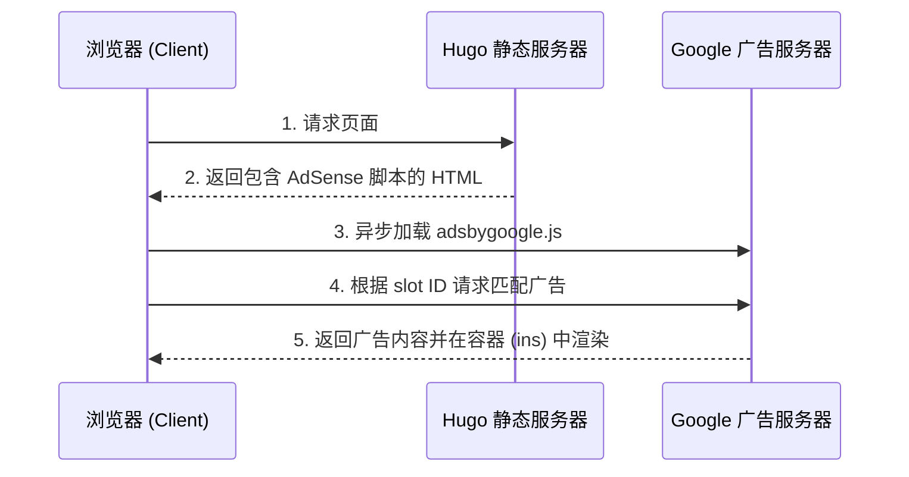

+++
date = '2026-03-23T22:15:08+08:00'
draft = false
title = 'Hugo 静态网站生成器完全指南'
+++

# Hugo 静态网站生成器完全指南

> 文档类型：技术教程
>
> 目标读者：具备命令行操作基础的 Web 开发者
>
> 学习路径：开发路径
>
> 文档级别：Level 2⭐⭐

---

## 学习目标

本教程旨在帮助读者从零掌握 Hugo 静态网站生成器的核心使用方法。完成学习后，读者将能够：

- 在本地环境正确安装和配置 Hugo
- 创建和管理 Hugo 项目结构
- 编写 Markdown 内容并理解 Front Matter 的作用
- 选择、安装和配置 Hugo 主题
- 将静态站点部署到多种托管平台

---

## 第一章：Hugo 简介与核心概念

### 1.1 什么是 Hugo

Hugo 是一个用 Go 语言编写的静态站点生成器（Static Site Generator，SSG）。它将 Markdown 等格式的内容文件与模板结合，经过编译后生成纯静态的 HTML、CSS 和 JavaScript 文件。

与传统的动态网站（如 WordPress）不同，Hugo 生成的站点不需要数据库和服务器端代码运行环境。这意味着：

- **极高的访问性能**：静态文件可以直接由 CDN 分发，访问速度极快
- **出色的安全性**：无数据库、无服务端代码，攻击面几乎为零
- **简单的部署流程**：生成的静态文件可以部署到任何 Web 服务器或 CDN

Hugo 以其惊人的构建速度著称。在普通的笔记本电脑上，它每秒可以生成数千个页面。这种高效的构建能力使其成为大型文档站点和内容丰富的博客的理想选择。

### 1.2 Hugo 的核心工作原理

理解 Hugo 的工作原理有助于更好地使用它。Hugo 的核心流程可以概括为三个阶段：

**内容收集阶段**：Hugo 会扫描项目中的 `content` 目录，读取所有 Markdown（`.md`）文件。每个文件都包含两部分内容：Front Matter（元数据）和正文内容。Front Matter 使用 YAML、TOML 或 JSON 格式，用于定义页面的标题、日期、分类等元信息。

**模板渲染阶段**：Hugo 使用 `layouts` 目录中的模板文件，将收集到的内容渲染成 HTML 页面。模板定义了页面的结构和样式，而内容提供了实际的数据。

**资源处理阶段**：Hugo 还会处理 `assets` 和 `static` 目录中的资源文件，包括图片、CSS、JavaScript 等。Hugo 内置了强大的资源处理能力，可以自动压缩 CSS 和 JavaScript、生成图片缩略图、计算文件指纹等。

### 1.3 Hugo 与其他方案的对比

在选择静态站点生成器时，了解 Hugo 与其他主流方案的区别非常重要。

| 特性 | Hugo | Jekyll | Gatsby | Next.js (SSG) |
|------|------|--------|--------|---------------|
| 语言 | Go | Ruby | JavaScript | JavaScript |
| 构建速度 | 极快 | 慢 | 中等 | 中等 |
| 主题数量 | 300+ | 数百 | 数百 | 数百 |
| 学习曲线 | 低 | 低 | 较高 | 较高 |
| 插件系统 | 无 | 有 | 丰富 | 丰富 |
| API 能力 | 无 | 无 | GraphQL | API 路由 |

对于需要 API 能力或动态功能的项目，Hugo 通常需要搭配 Headless CMS（如 Strapi、Contentful）使用。单纯的 Hugo 站点更适合内容驱动、更新频率适中的场景。

---

## 第二章：安装与环境配置

### 2.1 在 macOS 上安装

在 macOS 上，推荐使用 Homebrew 包管理器安装 Hugo。这是最简单且最推荐的安装方式。

首先确认 Homebrew 已经安装。如果没有安装，可以访问 Homebrew 官网获取安装指令。然后执行以下命令安装 Hugo：

```bash
brew install hugo
```

安装完成后，验证 Hugo 是否正确安装：

```bash
hugo version
```

如果安装成功，会看到类似以下的输出：

```
hugo v0.123.0+extended darwin/amd64 BuildDate=2024-01-15T10:30:00Z
```

### 2.2 在 Windows 上安装

在 Windows 系统上，有多种安装方式可供选择。

**方式一：使用 Chocolatey**

如果已经安装了 Chocolatey，执行以下命令：

```powershell
choco install hugo -extended
```

**方式二：使用 Winget**

在 PowerShell 或命令提示符中执行：

```powershell
winget install Hugo.Hugo.Extended
```

**方式三：手动安装**

从 Hugo 的 GitHub Releases 页面下载对应版本的压缩包。Windows 用户需要下载文件名包含 `windows-amd64.zip` 的版本。解压后，将可执行文件移动到系统 PATH 中的某个目录，或者创建一个便捷的启动脚本。

### 2.3 在 Linux 上安装

大多数 Linux 发行版的包管理器都提供了 Hugo 包。

**Debian / Ubuntu：**

```bash
sudo apt-get install hugo
```

**Fedora：**

```bash
sudo dnf install hugo
```

**Arch Linux：**

```bash
sudo pacman -S hugo
```

对于需要最新版本的场景，也可以从 GitHub 下载预编译的二进制文件进行手动安装。

### 2.4 验证安装

无论使用哪种安装方式，安装完成后都应该验证 Hugo 是否正常工作。在终端中执行：

```bash
hugo version
```

正常的输出会显示 Hugo 的版本号、支持的平台信息以及构建日期。如果看到版本信息，说明安装成功。

### 2.5 创建第一个 Hugo 项目

安装完成后，就可以创建第一个 Hugo 项目了。在终端中执行以下命令：

```bash
hugo new site my-blog
```

这个命令会在当前目录下创建一个名为 `my-blog` 的新项目。创建完成后，进入项目目录：

```bash
cd my-blog
```

查看项目结构：

```bash
ls -la
```

Hugo 项目的目录结构如下：

```
my-blog/
├── archetypes/      # 内容模板定义
├── assets/          # 资源文件（会被 Hugo 管道处理）
├── content/         # 站点内容（Markdown 文件）
├── data/            # 数据文件（JSON/YAML/TOML）
├── layouts/         # 页面模板
├── public/          # 生成的静态站点输出目录
├── static/          # 静态资源（图片、CSS、JS 等）
├── hugo.toml       # Hugo 配置文件
└── resources/      # Hugo 缓存的资源
```

---

## 第三章：配置文件详解

### 3.1 配置文件格式与位置

Hugo 支持三种配置文件格式：YAML、TOML 和 JSON。默认情况下，Hugo 会按以下优先级查找配置文件：

1. `hugo.toml`
2. `hugo.yaml`
3. `hugo.json`

建议使用 TOML 格式，因为它语法简洁且易于阅读。如果项目中不存在配置文件，Hugo 会使用内置的默认值。

### 3.2 基础配置项

以下是 Hugo 配置文件中最常用的基础配置项：

```toml
baseURL = "https://example.org/"
languageCode = "zh-cn"
title = "我的博客"
theme = []

defaultContentLanguage = "zh"

paginate = 10

[outputs]
  home = ["HTML", "RSS"]
  page = ["HTML"]

[taxonomies]
  category = "categories"
  tag = "tags"
  series = "series"
```

`baseURL` 是站点的根地址，必须以协议前缀（`https://`）开头并以斜杠结尾。这个值在生成站点时用于创建绝对链接。

`languageCode` 用于指定站点的语言代码，这会影响 Hugo 内置模板的某些行为，如日期格式。

`title` 是站点的标题，会在页面模板中使用。

`paginate` 控制列表页每页显示的文章数量，默认值是 10。

### 3.3 主题配置

如果使用了主题，通常需要在配置文件中添加主题相关的配置。这些配置的具体内容取决于使用的主题，一般可以在主题的文档中找到示例配置。

例如，使用 Ananke 主题时，可能需要添加以下配置：

```toml
theme = ["ananke"]

[params]
  description = "我的个人博客"
  featured_image = "/images/post-cover.jpg"
  social.twitter = "yourhandle"
```

`theme` 是一个数组，可以同时启用多个主题。

`params` 用于定义自定义参数，这些参数可以在模板中通过 `.Site.Params.xxx` 访问。

### 3.4 多语言配置

Hugo 内置了完善的多语言支持。以下是一个配置双语站点（中文和英文）的示例：

```toml
defaultContentLanguage = "zh"
defaultContentLanguageInSubdir = false

[languages]
  [languages.zh]
    languageName = "中文"
    weight = 1
    title = "我的博客"
    
  [languages.en]
    languageName = "English"
    weight = 2
    title = "My Blog"
```

`defaultContentLanguage` 设置默认语言。

`weight` 用于指定语言的优先级，数字越小优先级越高。

当 `defaultContentLanguageInSubdir` 设置为 `true` 时，非默认语言的页面 URL 会带有语言前缀，如 `/en/about/`。

---

## 第四章：内容管理

### 4.1 内容组织结构

Hugo 的内容存放在 `content` 目录中。每个子目录代表一个内容类型（Content Type），目录名即为内容类型名。例如：

```
content/
├── posts/           # 博客文章
│   ├── first-post.md
│   └── second-post.md
├── pages/           # 独立页面
│   └── about.md
└── docs/            # 文档
    └── getting-started.md
```

这种目录结构决定了生成页面的 URL。例如，`content/posts/first-post.md` 会生成 `/posts/first-post/` 这样的 URL。

### 4.2 Front Matter 详解

Front Matter 位于 Markdown 文件的顶部，用于定义页面的元数据。以下是使用 YAML 格式的 Front Matter 示例：

```yaml
---
title: "我的第一篇文章"
date: 2024-01-20T10:00:00+08:00
draft: false
author: "张三"
categories:
  - 技术
  - 教程
tags:
  - Hugo
  - 静态网站
description: "这是关于 Hugo 的入门教程"
featured_image: "/images/first-post-cover.jpg"
slug: "my-first-post"
aliases:
  - /old-url/
---
```

`title` 是文章的标题，会显示在页面和列表中。

`date` 定义文章的发布日期和时间，格式为 RFC 3339。Hugo 会按此字段对文章进行排序。

`draft` 标记文章是否为草稿。草稿文章在执行 `hugo` 构建时不会生成，在开发服务器中可以通过 `-D` 参数预览。

`categories` 是分类列表，可以有多个分类。

`tags` 是标签列表，与分类类似但通常更细化。

`description` 用于 SEO，会作为页面的 meta description。

`slug` 覆盖 URL 中的文件名部分，提供更灵活的 URL 控制。

`aliases` 定义页面的别名，可以用于创建重定向。

### 4.3 内容模板（Archetypes）

Archetypes 定义了创建新内容时使用的模板。当执行 `hugo new` 命令时，Hugo 会根据内容路径使用对应的 archetype。

创建自定义 archetype，首先在 `archetypes` 目录下创建模板文件：

```yaml
---
title: "{{ replace .Name "-" " " | title }}"
date: {{ .Date }}
draft: true
categories: []
tags: []
---

开始在这里编写内容...
```

使用 archetype 创建新文章：

```bash
hugo new posts/new-article.md
```

Hugo 会使用 `archetypes/default.md` 作为模板。如果要使用特定的 archetype，可以在内容类型目录下创建对应的模板文件，如 `archetypes/posts.md`。

### 4.4 短代码（Shortcodes）

短代码是 Hugo 特有的功能，允许在 Markdown 文件中嵌入可复用的组件。这对于添加视频、提示框、代码高亮等复杂元素非常有用。

**内置短代码**

Hugo 提供了一些内置的短代码。例如，嵌入 YouTube 视频：

```markdown

```

显示 GitHub Gist：

```markdown

```

**自定义短代码**

在 `layouts/shortcodes` 目录下创建短代码文件。例如，创建提示框短代码 `layouts/shortcodes/note.html`：

```html
<div class="note {{ with .Get "type" }}{{ . }}{{ else }}info{{ end }}">
  <strong>{{ with .Get "title" }}{{ . }}{{ end }}</strong>
  {{ .Inner }}
</div>
```

在 Markdown 中使用：

```markdown

这是警告提示框的内容。

```

### 4.5 分类与标签

Hugo 使用分类（Categories）和标签（Tags）来组织内容。这两种元数据的区别在于：分类是分层的（通过目录结构），而标签是非分层的（扁平的）。

在 Front Matter 中定义分类和标签：

```yaml
categories:
  - 技术
tags:
  - Hugo
  - 静态网站
```

生成分类和标签页面的方法是在对应目录下创建 `_index.md` 文件。例如，创建标签页面 `content/tags/_index.md`：

```yaml
---
title: "标签"
---
```

Hugo 会自动生成 `/tags/` 列表页面，以及各个标签的详情页面，如 `/tags/hugo/`。

---

## 第五章：模板系统

### 5.1 模板类型概述

Hugo 的模板系统是生成页面的核心。理解不同类型的模板及其优先级对于定制站点至关重要。

**单页模板（Single Page Template）** 定义单个内容页面的渲染方式，如博客文章详情页。

**列表模板（List Page Template）** 定义列表页面的渲染方式，如某个分类下的所有文章列表。

**首页模板（Home Page Template）** 专门用于站点首页。

**部分模板（Partial Template）** 是可复用的模板组件，可以在其他模板中包含，如页头、页脚、导航栏等。

**短代码模板（Shortcode Template）** 定义短代码的渲染方式。

### 5.2 模板查找顺序

Hugo 使用复杂的查找顺序来确定使用哪个模板。理解这个顺序有助于正确放置模板文件。

对于单页模板，Hugo 按以下顺序查找：首先查找与内容类型匹配的模板路径（如 `layouts/posts/single.html`），然后查找 `_default/single.html`，最后使用内置的模板。

列表模板的查找顺序类似，首先查找 `layouts/_default/list.html`。

### 5.3 基础模板示例

以下是一个基础的单页模板示例。创建文件 `layouts/_default/single.html`：

```html
<!DOCTYPE html>
<html lang="{{ .Site.Language.Lang }}">
<head>
  <meta charset="utf-8">
  <meta name="viewport" content="width=device-width, initial-scale=1.0">
  <title>{{ .Title }} | {{ .Site.Title }}</title>
  <meta name="description" content="{{ .Description }}">
</head>
<body>
  <header>
    <h1><a href="{{ "/" | relURL }}">{{ .Site.Title }}</a></h1>
    <nav>
      {{ range .Site.Menus.main }}
      <a href="{{ .URL | relURL }}">{{ .Name }}</a>
      {{ end }}
    </nav>
  </header>
  
  <main>
    <article>
      <h1>{{ .Title }}</h1>
      <time datetime="{{ .Date.Format "2006-01-02" }}">
        {{ .Date.Format "2006年1月2日" }}
      </time>
      {{ .Content }}
    </article>
  </main>
  
  <footer>
    <p>&copy; {{ now.Year }} {{ .Site.Title }}</p>
  </footer>
</body>
</html>
```

这个模板展示了 Hugo 模板的基本语法：双大括号 `{{ }}` 用于输出变量或执行函数，`with` 用于条件判断，`range` 用于遍历数组或列表。

### 5.4 列表模板

列表模板用于显示一组内容，如某分类下的所有文章。创建文件 `layouts/_default/list.html`：

```html
<!DOCTYPE html>
<html lang="{{ .Site.Language.Lang }}">
<head>
  <meta charset="utf-8">
  <meta name="viewport" content="width=device-width, initial-scale=1.0">
  <title>{{ .Title }} | {{ .Site.Title }}</title>
</head>
<body>
  <header>
    <h1><a href="{{ "/" | relURL }}">{{ .Site.Title }}</a></h1>
  </header>
  
  <main>
    <h1>{{ .Title }}</h1>
    
    <ul class="post-list">
      {{ range .Paginator.Pages }}
      <li>
        <time datetime="{{ .Date.Format "2006-01-02" }}">
          {{ .Date.Format "2006年1月2日" }}
        </time>
        <a href="{{ .Permalink }}">{{ .Title }}</a>
      </li>
      {{ end }}
    </ul>
    
    {{ template "_internal/pagination.html" . }}
  </main>
  
  <footer>
    <p>&copy; {{ now.Year }} {{ .Site.Title }}</p>
  </footer>
</body>
</html>
```

列表模板中使用 `.Paginator.Pages` 来获取当前页的文章列表。Hugo 内置了分页功能，可以通过 `paginator` 变量控制。

---

## 第六章：主题使用

### 6.1 选择合适的主题

Hugo 官方维护着一个主题网站（themes.gohugo.io），收录了数百个社区贡献的主题。选择主题时需要考虑以下因素：

**响应式设计**：确保主题在移动端和桌面端都能正常显示。

**功能完整性**：检查主题是否支持需要的功能，如评论、搜索、代码高亮等。

**维护活跃度**：查看主题的最近更新时间、Issue 数量和社区活跃程度。

**文档质量**：详细的主题文档可以大大降低使用成本。

对于中文博客，推荐考虑以下主题：LoveIt、Stack、PaperMod、Even 等。这些主题都有较好的中文支持和完善的文档。

### 6.2 安装主题

安装主题有两种主要方式：作为 Git 子模块或直接克隆。

**方式一：作为 Git 子模块（推荐）**

如果项目使用 Git 管理，推荐将主题作为子模块添加：

```bash
git init
git submodule add https://github.com/dillonzq/LoveIt.git themes/LoveIt
```

**方式二：直接克隆**

```bash
git clone https://github.com/dillonzq/LoveIt.git themes/LoveIt
```

### 6.3 配置主题

安装主题后，需要在 `hugo.toml` 中启用主题：

```toml
theme = ["LoveIt"]
```

大多数主题都提供了示例配置文件，可以从主题目录中的 `exampleSite` 文件夹复制 `hugo.toml` 到项目根目录，然后根据需要修改。

以下是一个典型的 LoveIt 主题配置示例：

```toml
baseURL = "https://example.org/"
languageCode = "zh-cn"
title = "我的博客"
theme = ["LoveIt"]

[params]
  version = "1.0.0"
  description = "我的个人技术博客"
  author = "张三"
  
  # 导航菜单
  [[params.menu]]
    name = "首页"
    url = "/"
    
  [[params.menu]]
    name = "关于"
    url = "/about/"
  
  # 社交链接
  [params.social]
    GitHub = "yourgithub"
    Twitter = "yourtwitter"
  
  # 文章设置
  [params.post]
    codeCopyButton = true
    codeHighlighting = true
    
[menu]
  [[menu.main]]
    identifier = "home"
    name = "首页"
    url = "/"
    
  [[menu.main]]
    identifier = "about"
    name = "关于"
    url = "/about/"
```

### 6.4 覆盖主题模板

如果需要自定义主题的某个部分，可以在自己的 `layouts` 目录下创建同名文件来覆盖主题的模板。Hugo 会优先使用项目 `layouts` 目录中的模板。

例如，要覆盖主题的首页模板，在 `layouts/index.html` 创建文件即可。

### 6.5 创建自定义样式

如果需要添加自定义 CSS，可以创建 `assets/css/custom.css` 文件（如果使用 Hugo Pipes），或者直接在 `static/css/custom.css` 创建文件，然后在模板中引用。

使用 Hugo Pipes 的方式更加推荐，因为它可以利用 Hugo 的资源处理功能，如自动压缩和指纹生成。在 `assets/css/custom.css` 中添加自定义样式：

```css
.my-custom-class {
  color: #333;
  font-size: 16px;
}
```

在模板中引用：

```html
{{ $customStyle := resources.Get "css/custom.css" }}
<link rel="stylesheet" href="{{ $customStyle.RelPermalink }}">
```

---

## 第七章：内置功能

### 7.1 图片处理

Hugo 提供了强大的图片处理功能，可以对图片进行缩放、裁剪、旋转等操作。这些功能通过图像处理函数实现。

**基础用法**

在模板中使用图像处理函数：

```html
{{ $image := resources.Get "images/photo.jpg" }}
{{ $resized := $image.Resize "800x" }}

```

`Resize` 参数支持多种格式：`800x`（宽度 800，保持比例）、`x600`（高度 600）、`800x600`（固定尺寸，可能变形）、`800x600 smart`（智能裁剪）。

**生成缩略图**

```html
{{ $image := resources.Get "images/photo.jpg" }}
{{ $thumbnail := $image.Resize "400x q80" }}

```

`q80` 设置图片质量为 80%。

### 7.2 Sass/SCSS 支持

Hugo 内置了对 Sass 和 SCSS 的支持。首先确保安装了 Hugo 的 extended 版本，然后在项目中创建 `assets/scss/main.scss`：

```scss
$primary-color: #333;

body {
  color: $primary-color;
  font-family: sans-serif;
}

.container {
  max-width: 1200px;
  margin: 0 auto;
}
```

在模板中引用编译后的 CSS：

```html
{{ $style := resources.Get "scss/main.scss" | toCSS }}
<link rel="stylesheet" href="{{ $style.RelPermalink }}">
```

### 7.3 资源指纹

Hugo 可以为资源文件生成指纹（Hash），用于缓存控制。在模板中使用：

```html
{{ $style := resources.Get "css/main.css" | minify | fingerprint }}
<link rel="stylesheet" href="{{ $style.RelPermalink }}" integrity="{{ $style.Data.Integrity }}">
```

`minify` 压缩 CSS 文件，`fingerprint` 生成文件指纹。

### 7.4 RSS 订阅

Hugo 内置了 RSS 模板。创建 `layouts/_default/rss.xml` 来自定义 RSS feed：

```xml
<rss version="2.0" xmlns:atom="http://www.w3.org/2005/Atom">
  <channel>
    <title>{{ .Site.Title }}</title>
    <link>{{ .Permalink }}</link>
    <description>{{ .Site.Description }}</description>
    <language>{{ .Site.LanguageCode }}</language>
    {{ range first 20 .Site.RegularPages }}
    <item>
      <title>{{ .Title }}</title>
      <link>{{ .Permalink }}</link>
      <pubDate>{{ .Date.Format "Mon, 02 Jan 2006 15:04:05 -0700" | printf "%s" }}</pubDate>
      <description>{{ .Summary | html }}</description>
    </item>
    {{ end }}
  </channel>
</rss>
```

RSS feed 的地址通常是 `/index.xml` 或 `/rss.xml`。

---

## 第八章：部署与发布

### 8.1 本地构建

在项目根目录下执行 `hugo` 命令即可生成静态站点：

```bash
hugo
```

生成的静态文件会输出到 `public` 目录。

**预览草稿**

草稿文章默认不会在生产构建中显示。如果需要预览草稿：

```bash
hugo -D
```

**启动本地服务器**

Hugo 内置了开发服务器，支持热重载：

```bash
hugo server
```

服务器默认在 `http://localhost:1313` 启动。常用参数包括：

- `-D`：包含草稿
- `-F`：不缓存文件变化
- `--port`：指定端口
- `--bind`：指定绑定的 IP 地址

```bash
hugo server -D --port 8080 --bind 0.0.0.0
```

### 8.2 部署到 GitHub Pages

GitHub Pages 是托管静态站点的免费选择，可以绑定自定义域名。

**方式一：使用 GitHub Actions**

在项目根目录创建 `.github/workflows/hugo.yaml`：

```yaml
name: Deploy Hugo Site

on:
  push:
    branches:
      - main

jobs:
  deploy:
    runs-on: ubuntu-latest
    steps:
      - uses: actions/checkout@v4
        with:
          submodules: true
          fetch-depth: 0

      - name: Setup Hugo
        uses: peaceiris/actions-hugo@v2
        with:
          hugo-version: '0.123.0'
          extended: true

      - name: Build
        run: hugo --minify

      - name: Deploy
        uses: peaceiris/actions-gh-pages@v3
        with:
          github_token: ${{ secrets.GITHUB_TOKEN }}
          publish_dir: ./public
```

将代码推送到 GitHub 仓库后，GitHub Actions 会自动构建并部署到 GitHub Pages。部署完成后，访问 `https://username.github.io/repo-name/` 即可看到站点。

**方式二：手动部署**

手动构建后，将 `public` 目录的内容推送到 `gh-pages` 分支：

```bash
hugo --minify
cd public
git init
git add .
git commit -m "Build site"
git push -f git@github.com:username/repo-name.git master:gh-pages
```

### 8.3 部署到 Vercel

Vercel 是另一个流行的静态站点托管平台，提供全球 CDN 和自动 HTTPS。

**方式一：Git 集成**

将项目推送到 GitHub、GitLab 或 Bitbucket，然后在 Vercel Dashboard 中导入项目。Vercel 会自动检测 Hugo 项目并配置构建命令。

构建命令：`hugo`

输出目录：`public`

**方式二：Vercel CLI**

安装 Vercel CLI：

```bash
npm i -g vercel
```

在项目目录中执行部署：

```bash
vercel
```

按照提示完成部署，首次部署会要求登录并配置项目。

### 8.4 部署到 Netlify

Netlify 提供免费的静态站点托管，支持自定义域名和 HTTPS。

在项目根目录创建 `netlify.toml`：

```toml
[build]
  publish = "public"
  command = "hugo --minify"

[context.production.environment]
  HUGO_VERSION = "0.123.0"
  HUGO_ENABLEGITINFO = "true"
```

将项目连接到 Netlify，平台会自动检测配置并完成部署。

### 8.5 部署到自建服务器

如果有自己的服务器，可以通过多种方式部署。

**rsync 同步**

```bash
hugo --minify
rsync -avz --delete public/ user@yourserver:/var/www/yourdomain.com/
```

**scp 复制**

```bash
hugo --minify
scp -r public/* user@yourserver:/var/www/yourdomain.com/
```

**Docker 部署**

创建 `Dockerfile`：

```dockerfile
FROM nginx:alpine
COPY public/ /usr/share/nginx/html/
EXPOSE 80
```

构建并运行：

```bash
docker build -t my-hugo-site .
docker run -d -p 80:80 my-hugo-site
```

---

## 第九章：内容自动化与 AI 集成

### 9.1 手动保存网页文章到 Hugo

如果在网上看到一篇想保存的文章，手动迁移到 Hugo 站点需要以下步骤：

**第一步：创建文章文件**

```bash
hugo new posts/article-title.md
```

这会在 `content/posts/article-title.md` 创建一个新文件，使用 archetype 定义的模板。

**第二步：编辑 Front Matter**

打开生成的文件，补充必要的元数据：

```yaml
---
title: "文章标题"
date: 2024-01-20T10:00:00+08:00
draft: false
categories:
  - 转载
tags:
  - 收藏
description: "原文描述"
source: "原文来源 URL"
---

文章正文内容...
```

**第三步：处理正文内容**

将网页内容转换为 Markdown 格式时，需要注意：

- 标题使用 `#` 到 `######`
- 链接保留为 `[文本](URL)` 格式
- 图片需要下载到 `static/images/` 目录，引用路径改为 `/images/文件名`
- 代码块使用三个反引号包裹
- 引用使用 `>` 标记

**第四步：构建并预览**

```bash
hugo server -D
```

访问 `http://localhost:1313` 预览文章，确认无误后修改 `draft: false`，重新构建：

```bash
hugo
```

### 9.2 AI Agent 自动采集与发布流程

借助 AI Agent（如 OpenCLAW 或类似的 AI 助手），可以实现从网页采集到 Hugo 发布的全自动化。以下是完整的工作流程设计：

```
┌─────────────┐    ┌─────────────┐    ┌─────────────┐    ┌─────────────┐
│  用户指令    │───▶│  采集网页    │───▶│  AI 整理    │───▶│ 生成 Markdown│
│  "采集这篇  │    │  内容提取    │    │  转换格式    │    │  文件       │
│   文章"     │    └─────────────┘    └─────────────┘    └──────┬──────┘
└─────────────┘                                                   │
                                                                  ▼
┌─────────────┐    ┌─────────────┐    ┌─────────────┐    ┌─────────────┐
│  Hugo 站点  │◀───│  触发构建   │◀───│  提交到 Git │◀──│  放置到     │
│  上线       │    │  CI/CD      │    │  仓库       │    │  content    │
└─────────────┘    └─────────────┘    └─────────────┘    └─────────────┘
```

### 9.3 AI Agent 提示词设计

以下是一组用于自动采集和发布文章的 AI Agent 提示词示例：

**采集与转换提示词**

```
你是一个专业的内容整理助手。当用户给你一个网页 URL 时，请完成以下任务：

1. 访问并提取网页内容，包括：
   - 文章标题
   - 发布日期
   - 作者
   - 正文内容
   - 文章描述
   
2. 将内容转换为 Hugo 兼容的 Markdown 格式：
   - 正确使用 Markdown 标题层级
   - 处理代码块、引用、列表等元素
   - 图片使用占位符标记 [图片描述](图片URL)
   
3. 生成符合 Hugo Front Matter 规范的元数据：
   - 使用 YAML 格式
   - 包含 title、date、draft、categories、tags、description 字段
   
4. 输出格式：
   - 首先输出 Front Matter
   - 然后输出正文内容
   - 末尾附上原文来源链接

请严格按照以下格式输出，不要添加任何解释性文字：

---
title: "文章标题"
date: YYYY-MM-DDTHH:MM:SS+08:00
draft: true
author: "作者名"
categories:
  - 分类
tags:
  - 标签
description: "文章描述"
source: "原文URL"
---

正文内容...
```

**自动保存到 Hugo 项目提示词**

```
请将转换后的 Markdown 文件保存到 Hugo 项目中。

项目路径：/path/to/your/hugo-site
文章保存位置：content/posts/
文件名规则：使用文章标题的拼音或英文翻译，用短横线分隔

执行步骤：
1. 检查 content/posts/ 目录是否存在，不存在则创建
2. 生成符合规则的文件名
3. 将 Markdown 内容写入文件
4. 验证文件是否正确创建
5. 报告保存的文件路径

输出格式：
- 保存路径：[路径]
- 文件名：[文件名]
- Front Matter 预览：[前3行]
```

### 9.4 自动化脚本实现

以下是一个 Python 脚本示例，用于将 AI 生成的 Markdown 文件自动保存到 Hugo 项目：

```python
#!/usr/bin/env python3
"""
Hugo 文章自动发布脚本
用于将 Markdown 文件自动保存到 Hugo 项目的 content 目录
"""

import os
import re
import subprocess
from datetime import datetime
from pathlib import Path


def sanitize_filename(title: str) -> str:
    """将标题转换为合法的文件名"""
    filename = re.sub(r'[^\w\s-]', '', title)
    filename = re.sub(r'[-\s]+', '-', filename)
    filename = filename.lower().strip('-')
    return filename


def create_slug(title: str) -> str:
    """生成 URL 友好的 slug"""
    import unicodedata
    slug = unicodedata.normalize('NFKD', title)
    slug = re.sub(r'[^\w\s-]', '', slug)
    slug = re.sub(r'[-\s]+', '-', slug)
    return slug.lower().strip('-')


def update_front_matter(content: str, source_url: str = None) -> str:
    """更新或创建 Front Matter"""
    date = datetime.now().strftime('%Y-%m-%dT%H:%M:%S+08:00')
    
    front_matter = f'''---
title: ""
date: {date}
draft: true
categories: []
tags: []
description: ""
source: ""
---
'''
    
    if content.startswith('---'):
        parts = content.split('---', 2)
        if len(parts) >= 3:
            existing_fm = parts[1]
            body = parts[2]
            if 'date:' not in existing_fm:
                existing_fm = existing_fm.strip() + f'\ndate: {date}\n'
            if source_url and 'source:' not in existing_fm:
                existing_fm = existing_fm.strip() + f'\nsource: "{source_url}"\n'
            return f'---\n{existing_fm}\n---\n{body}'
    
    return front_matter + content


def save_to_hugo(content: str, hugo_root: str, content_type: str = 'posts', source_url: str = None) -> Path:
    """保存内容到 Hugo 项目"""
    hugo_path = Path(hugo_root)
    content_dir = hugo_path / 'content' / content_type
    content_dir.mkdir(parents=True, exist_ok=True)
    
    content = update_front_matter(content, source_url)
    
    title_match = re.search(r'^title:\s*["\']?(.+?)["\']?\s*$', content, re.MULTILINE)
    title = title_match.group(1) if title_match else 'untitled'
    filename = sanitize_filename(title)
    
    timestamp = datetime.now().strftime('%Y%m%d%H%M%S')
    file_path = content_dir / f'{timestamp}-{filename}.md'
    
    with open(file_path, 'w', encoding='utf-8') as f:
        f.write(content)
    
    return file_path


def commit_and_push(hugo_root: str, message: str = None) -> bool:
    """提交更改到 Git 并推送"""
    hugo_path = Path(hugo_root)
    
    try:
        subprocess.run(['git', '-C', str(hugo_path), 'add', '.'], check=True)
        subprocess.run(
            ['git', '-C', str(hugo_path), 'commit', '-m', message or 'Add new article'],
            check=True
        )
        subprocess.run(
            ['git', '-C', str(hugo_path), 'push', 'origin', 'main'],
            check=True
        )
        return True
    except subprocess.CalledProcessError as e:
        print(f"Git 操作失败：{e}")
        return False


def main():
    import sys
    
    if len(sys.argv) < 3:
        print("用法：python hugo_publisher.py <markdown文件> <hugo项目路径>")
        sys.exit(1)
    
    markdown_file = sys.argv[1]
    hugo_root = sys.argv[2]
    
    with open(markdown_file, 'r', encoding='utf-8') as f:
        content = f.read()
    
    source_match = re.search(r'source:\s*["\']?(.+?)["\']?\s*$', content, re.MULTILINE)
    source_url = source_match.group(1) if source_match else None
    
    file_path = save_to_hugo(content, hugo_root, 'posts', source_url)
    print(f"文章已保存到：{file_path}")
    
    if '--auto-commit' in sys.argv:
        if commit_and_push(hugo_root, f'Add article: {file_path.name}'):
            print("已提交并推送")
        else:
            print("提交或推送失败")


if __name__ == '__main__':
    main()
```

使用方法：

```bash
python hugo_publisher.py article.md /path/to/hugo-site --auto-commit
```

### 9.5 GitHub Actions 自动部署

当文章通过 AI Agent 保存到 Hugo 项目并推送到 Git 仓库后，可以使用 GitHub Actions 自动构建和部署：

```yaml
name: Deploy Hugo Site

on:
  push:
    branches:
      - main
  workflow_dispatch:

jobs:
  build-deploy:
    runs-on: ubuntu-latest
    steps:
      - name: Checkout
        uses: actions/checkout@v4
        with:
          submodules: recursive
          fetch-depth: 0

      - name: Setup Hugo
        uses: peaceiris/actions-hugo@v2
        with:
          hugo-version: '0.123.0'
          extended: true

      - name: Build
        run: hugo --minify

      - name: Deploy to GitHub Pages
        uses: peaceiris/actions-gh-pages@v3
        with:
          github_token: ${{ secrets.GITHUB_TOKEN }}
          publish_dir: ./public
          publish_branch: gh-pages
```

### 9.6 完整工作流程总结

以下是使用 AI Agent 自动将网页文章发布到 Hugo 站点的完整流程：

| 步骤 | 执行者 | 操作内容 |
|------|--------|----------|
| 1 | 用户 | 向 AI Agent 发送网页 URL 或文章内容 |
| 2 | AI Agent | 提取网页内容，转换为 Markdown 格式 |
| 3 | AI Agent | 生成符合 Hugo 规范的 Front Matter |
| 4 | AI Agent | 调用保存脚本或直接写入文件 |
| 5 | Git | 自动提交更改（可选） |
| 6 | CI/CD | 自动构建 Hugo 站点 |
| 7 | CI/CD | 部署到托管平台 |

整个流程可以完全自动化，用户只需提供网页链接，AI Agent 即可完成从采集到发布的所有步骤。

### 9.7 注意事项与最佳实践

**内容版权**：自动采集他人文章时，务必注明原文来源和作者，尊重版权。

**图片处理**：AI 转换的图片链接可能是外部链接，建议下载到本地 `static/images/` 目录，确保站点完全静态化。

**Front Matter 检查**：自动生成的内容可能需要人工审核标题、分类、标签等元数据。

**草稿状态**：新文章默认设置为 `draft: true`，确认无误后再改为 `false` 并构建发布。

**版本控制**：建议将所有文章纳入 Git 版本控制，便于追踪修改历史和协作。

---

## 第十章：Google AdSense 广告集成

> **🎯 本章学习目标**
> - 了解 Hugo 静态网站接入 Google AdSense 的标准流程。
> - 掌握通过配置文件统一管理广告参数的最佳实践。
> - 学会编写可复用的广告短代码（Shortcode），实现灵活投放。
> - 掌握广告合规性要求及核心性能优化技巧（如降低 CLS 布局偏移）。

Google AdSense 与 Hugo 完全兼容。Hugo 负责输出极速的静态 HTML，而 AdSense 依赖前端 JavaScript 脚本在客户端渲染广告，两者在架构上互不干扰。其核心渲染流程如下：



### 10.1 接入前置准备

在申请 AdSense 账号前，请确保你的站点满足以下基准条件，这能大幅提升审核通过率：

- **站点状态**：已绑定自定义域名（如 `txtmix.com`），并强制启用 HTTPS。
- **内容质量**：站点已有一定数量的高质量原创文章，且保持稳定更新，切忌用空壳页面申请。
- **合规页面**：必须包含清晰的导航、关于我们（About）以及**隐私政策（Privacy Policy）**页面（隐私政策中需声明 Cookie 及第三方广告的使用）。

> **💡 专家建议**：优先提升内容价值和自然流量，再考虑广告变现。急于在无流量的站点投放广告不仅没有收益，还容易触发平台风控。

### 10.2 核心配置：参数化管理

**为什么需要统一配置？**
如果在多个模板和文章中直接写死（硬编码）AdSense 的 Publisher ID，未来修改或临时关闭广告时将非常痛苦。最佳实践是在 `hugo.toml` 中集中管理。

在你的 `hugo.toml` 文件中添加以下配置：

```toml
[params.adsense]
  # 广告总开关，方便在测试环境或特定情况下全局一键关闭
  enabled = true
  # 你的 AdSense 发布商 ID，必须包含 ca-pub- 前缀
  client = "ca-pub-xxxxxxxxxxxxxxxx"
  # 是否开启自动广告（交由 Google 决定插入位置）
  autoAds = false
```

### 10.3 注入主脚本（全局引入）

要让 AdSense 生效，必须在所有页面的 `<head>` 标签中引入一次（且仅一次）基础脚本。

**步骤 1：创建局部模板**
在项目目录下创建文件 `layouts/partials/adsense/head.html`，输入以下代码：

```html
{{- $cfg := .Site.Params.adsense -}}
<!-- 仅在生产环境、开关打开且配置了 client ID 时注入代码 -->
{{- if and (not hugo.IsServer) $cfg.enabled $cfg.client -}}
<script async src="https://pagead2.googlesyndication.com/pagead/js/adsbygoogle.js?client={{ $cfg.client }}" crossorigin="anonymous"></script>
{{- end -}}
```

> **🛡️ 安全护栏：为什么使用 `not hugo.IsServer`？**
> 在本地开发时（运行 `hugo server`），页面上的广告一旦被意外点击，会被 Google 判定为“无效流量（Invalid Traffic）”，严重时会导致账号被封禁。引入 `not hugo.IsServer` 可以确保广告脚本**绝对不会**在本地开发环境中加载。

**步骤 2：在 `<head>` 中引入**
你需要将这个 partial 挂载到站点的 `<head>` 中。通常的做法是找到你的主题提供的自定义 head 钩子（例如 LoveIt 主题的 `layouts/partials/custom/head.html`），或者直接覆写基础模板，添加以下调用：

```html
{{ partial "adsense/head.html" . }}
```

> **注意**：现代 AdSense 自动广告只需上述带有 `client` 参数的脚本即可生效，无需额外推送 `enable_page_level_ads`（这是旧版写法）。如果开启了自动广告，Google 会自动分析页面结构并插入广告。

### 10.4 灵活投放：自定义广告短代码

如果你关闭了自动广告（`autoAds = false`），或者希望在文章的特定段落精准插入广告，我们需要借助 Hugo 的短代码（Shortcode）功能。

创建文件 `layouts/shortcodes/adsense.html`：

```html
{{- $cfg := .Site.Params.adsense -}}
{{- $slot := .Get "slot" -}}

<!-- 仅在生产环境且配置齐全时加载真实广告 -->
{{- if and (not hugo.IsServer) $cfg.enabled $cfg.client $slot -}}
<div class="ad-container" style="min-height: 100px; margin: 2rem 0; overflow: hidden;">
  <ins class="adsbygoogle"
       style="display:block"
       data-ad-client="{{ $cfg.client }}"
       data-ad-slot="{{ $slot }}"
       data-ad-format="{{ .Get "format" | default "auto" }}"
       data-full-width-responsive="{{ .Get "responsive" | default "true" }}"></ins>
  <script>
       (adsbygoogle = window.adsbygoogle || []).push({});
  </script>
</div>
<!-- 在本地开发环境展示占位符，方便预览排版 -->
{{- else if hugo.IsServer -}}
<div class="ad-placeholder" style="min-height: 100px; margin: 2rem 0; background: #f0f0f0; border: 1px dashed #ccc; display: flex; align-items: center; justify-content: center; color: #888;">
  [AdSense 广告位占位符 - Slot: {{ $slot | default "未指定" }}]
</div>
{{- end -}}
```

**如何在 Markdown 中使用？**
在编写文章时，只需在需要展示广告的地方插入以下短代码（请将 `slot` 替换为你在 AdSense 后台创建的真实广告单元 ID）：

```text
{ { < adsense slot="1234567890" format="auto" responsive="true" > } }
```

*注：在实际使用时，请将 slot 替换为真实的 ID，并去掉大括号之间的空格。*

### 10.5 性能、体验与合规优化

广告加载不当会严重拖慢页面速度并影响 SEO。请务必执行以下优化：

#### 1. 降低 CLS（累积布局偏移）
在上述短代码中，我们为 `<div class="ad-container">` 设置了 `min-height: 100px;`。
**为什么？** 广告脚本通常在页面渲染后才异步拉取广告内容。如果没有预留高度，广告突然出现会将正文往下挤，导致 CLS 指标飙升，严重影响核心网页指标（Core Web Vitals）。

#### 2. 部署 ads.txt（合规必备）
AdSense 强制要求验证站点的广告授权。
在 Hugo 项目的 `static` 目录下新建 `ads.txt` 文件（即 `static/ads.txt`），填入 Google 提供的一行认证代码：
```text
google.com, pub-xxxxxxxxxxxxxxxx, DIRECT, f08c47fec0942fa0
```
Hugo 构建时会将 `static` 目录下的文件原样复制到根目录，从而确保可以通过 `https://你的域名/ads.txt` 成功访问。

#### 3. CSP (内容安全策略) 适配
如果你的 Hugo 站点通过 Netlify / Cloudflare Pages 部署并启用了严格的 CSP (Content Security Policy) 请求头，默认会拦截 Google 的脚本和 iframe。你必须在你的 CSP 头中放行以下域名：
- `script-src`：允许 `https://pagead2.googlesyndication.com` 和 `https://partner.googleadservices.com`
- `frame-src`：允许 `https://googleads.g.doubleclick.net` 和 `https://tpc.googlesyndication.com`

#### 4. GDPR / CCPA 隐私合规 (Cookie 同意)
如果你的网站有来自欧洲（EEA）或美国加州的访客，强制要求获取用户 Cookie 同意。
- 推荐直接在 Google AdSense 后台启用 **“隐私权与消息 (Privacy & messaging)”**。
- Google 会自动通过前文注入的 `adsbygoogle.js` 脚本下发符合 IAB 框架的 CMP (Consent Management Platform) 弹窗，**无需在 Hugo 中额外编写前端代码**。

#### 5. 投放策略与底线
- **克制投放**：一篇文章内手动插入的广告位建议不超过 2 个（如标题下方 1 个，文末 1 个）。
- **严守红线**：绝不能将广告伪装成下载按钮或导航链接，严禁诱导点击，否则账号会被永久封禁。

### 10.6 常见排错指南 (FAQ)

**Q：为什么我配置好了，页面上却是一片空白（广告不展示）？**
1. **学习期**：新创建的广告单元或刚通过审核的账号，通常需要几小时到 48 小时才能开始匹配并展示广告。
2. **拦截插件**：检查你的浏览器是否开启了 AdBlock 等广告拦截扩展。
3. **控制台报错**：按 `F12` 打开浏览器控制台，检查是否有 `403 Forbidden` 或相关跨域脚本阻断错误。

**Q：为什么短代码在页面上直接输出了文本，没有渲染成广告？**
检查短代码的调用语法是否正确，并确保 `hugo.toml` 中的 `enabled` 已设置为 `true`。

**Q：如何验证我的 `ads.txt` 是否生效？**
在浏览器中直接访问 `https://你的域名/ads.txt`，如果能看到你填写的 Google 认证代码文本，即代表部署成功。Google 爬虫最多可能需要 24 小时才能抓取并更新后台状态。

完成以上步骤后，你就拥有一个可持续迭代的 Hugo 广告系统：结构清晰、风险可控、可按数据持续优化。

---

## 常见问题

### Hugo 构建失败，提示模板找不到

确保模板文件放在正确的目录中。单页模板应放在 `layouts/_default/single.html`，列表模板应放在 `layouts/_default/list.html`。同时检查配置文件中的 `theme` 设置是否正确。

### 主题样式不生效

清除 Hugo 的缓存目录 `resources`，然后重新构建：

```bash
rm -rf resources
hugo
```

### 中文标题排序不正确

确保 `.Site.RegularPages` 的排序逻辑正确。可以在模板中明确指定排序方式：

```html
{{ range sort .Paginator.Pages "Date" "desc" }}
```

### 图片路径问题

使用 Hugo 的资源函数处理图片时，路径应相对于项目根目录。例如：`resources.Get "images/photo.jpg"`。

---

## 进阶学习路径

完成本教程后，可以继续探索以下主题：

- **深入模板开发**：学习 Hugo 的模板函数和数据结构
- **自定义输出格式**：生成 JSON、CSV 等多种格式
- **资源管道优化**：深入学习 Hugo Pipes 的高级用法
- **CI/CD 集成**：搭建自动化的构建和部署流程
- **多语言站点**：构建复杂的多语言博客或文档站点

---

## 参考资源

- [Hugo 官方文档](https://gohugo.io/documentation/)
- [Hugo 中文文档](https://www.gohugo.org/)
- [Hugo 主题库](https://themes.gohugo.io/)
- [Hugo 社区论坛](https://discourse.gohugo.io/)

---

*文档版本：1.0*
*最后更新：2024年1月*
