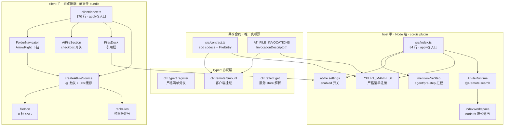

## 这篇文章在回答什么

`omdsh-dev/dsh-at-file` 是 DeepSeek Harness（DSH）Web 界面的 `@file` 提及插件。仓库简介里那句对照很刺眼：

> Codex-style `@file` mentions for DeepSeek Harness.

这句话只对了表面。Codex 的 `@file` 会**自动读取**被提及的文件内容拼进 prompt；dsh-at-file **完全不读**——它只确认路径存在，然后把 `<workspace-reference path="..." kind="file|directory" />` 这条 XML 标记塞进对话流。文件长什么样、PDF 里写了什么、目录里有几个子文件，agent 自己决定要不要读、用什么工具读。

这件事看起来像"省了一步读文件 IO"，但实际是把整个架构的语义权重换了一个面：从「**注入内容**」变成「**标记存在**」。这个换位带来了三个连锁反应：

1. **大小与格式不再是边界**——README 里反复说 "File format and file size do not change this behavior. A PDF follows the same path-reference flow as any other workspace file."。一个 500 MB 的 PDF 和一个 10 行的 JSON，路径提及走同一条路。
2. **工具选择权下放给 agent**——DSH 的 `read` 处理 UTF-8 文本，`read_image` 处理图片，PDF 取决于会话配置。dsh-at-file 不绑架 agent 怎么读。
3. **路径成为一等公民，文件内容退化为二等**——这反过来了。`0.3.0` 之前版本「read file content during submission and enforced file-size limits」的旧实现就是栽在这件事上。

这篇文章拆三个东西：

1. 1742 行代码怎么分成 host（56 行 Remote + 234 行存储/边界）和 client（170 行触发 + 246 行导航/dock）两个对等半——它们不是简单的前后端，而是 cordis 框架上的两个独立插件。
2. **Typert 严格清单** 这个东西解决了一个 README 完全没提但 AGENTS.md 反复警告的坑：source-mode dev 环境和 profile-loaded 部署环境加载的 `@Remote` 装饰器**根本不是同一份**——两个 marker table。
3. 评分算法（`scorePath`）和 ArrowRight 目录导航为什么单独抽出来——它们是菜单 UI 和文件存储之间的纯函数桥。

## 系统地图：双半 + 三段契约

仓库根目录 17 个文件，源码 1742 行（含 `.ts/.tsx`），分得很干净：

| 段 | 文件 | 行数 | 角色 |
|---|---|---|---|
| **host 入口** | `src/index.ts` | 84 | cordis 插件入口；注册 Typert 清单、settings、agent pre-step 监听 |
| **host 远端服务** | `src/runtime.ts` | 56 | `AtFileRuntime extends TypertRemoteService`，`@Remote search` |
| **host 边界** | `src/mention.ts` | 159 | `agent/pre-step` 拦截 + `<workspace-reference>` XML 注入 |
| **host 存储** | `src/files.ts` | 145 | `node:fs opendir` 流式遍历 + `raceAbort` + 截断标记 |
| **host 合约/清单** | `src/contract.ts` + `src/typert.ts` | 100 | zod codecs + InvocationDescriptor + Typert manifest |
| **host 默认配置** | `src/defaults.ts` + `src/settings.ts` | 90 | 56 个内置忽略目录名 + schemastery schema |
| **client 入口** | `src/client/index.ts` | 170 | 挂载 Remote、注册 `@` 源、三个 slot、一个 settings section |
| **client `@` 源** | `src/client/source.ts` | 197 | per-session 30 秒索引缓存 + 防抖 fetch + lexer 监听 |
| **client 评分算法** | `src/client/search.ts` | 94 | `scorePath` + `scoreName` 纯函数（无 IO） |
| **client 导航/dock** | `FolderNavigator.tsx` + `FilesDock.tsx` | 210 | ArrowRight 目录下钻 + 引用栏渲染 |
| **client 图标/locale/styles** | `icons.tsx` + `locales.ts` + `styles.ts` | 291 | 8 种 SVG + 中英字典 + 注入的 CSS 字符串 |



依赖方向是**单向且无环**的。`src/contract.ts` 是 host 和 client 共用的真相源——同一个 `AT_FILE_INVOCATIONS` 数组同时被 `src/typert.ts`（host 清单）和 `src/client/remote.ts`（client 挂载）import。这意味着改一个参数名字，两半都会在编译期炸出来。

这种"共享合约文件 + 双半独立编译"的模式不是 cordis 的标配。AGENTS.md 把它叫 **「recognition contract」**——同一个 `@[^\s@]+` 正则必须在三个地方**字面相同**：客户端的 dock 解析、source 的 `onPick`、host 的 `scanMentions`。AGENTS.md 用了「they are the recognition contract, not one copy」这种话，因为如果三个地方各写一份正则，`0.4.0` 加新字符规则的时候一定会漏。

## 一个插件故意不读文件：reference vs injection

仓库把这一点写在三个地方：

**README § Usage**：

> The plugin does not open the referenced file or list the contents of a referenced directory. The agent can inspect the path with the tools available in the current session when the task requires it.

**README § Path Handling**：

> `maxIndexedFiles` limits picker results. A manually entered path can still be referenced when it exists inside the workspace.

**AGENTS.md**：

> File content NEVER crosses the wire or the Host mention boundary: `agent/pre-step` validates each `@path` and injects only `<workspace-reference path="…" kind="file|directory" />` with source `at-file-mention`.

三处都在重复同一件事：路径是路径，文件是文件，dsh-at-file 只管前者。`src/mention.ts` 的 `referenceForm` 是这件事的物理表达：

```typescript
function referenceForm(mention: Mention): string {
  const kind = mention.kind === 'dir' ? 'directory' : 'file'
  return `<workspace-reference path="${escapeAttribute(mention.relative)}" kind="${kind}" />`
}
```

输出 XML 标记而不是文件内容。`createUserMessage` 把它塞进对话流，`source: { kind: 'at-file-mention', relative }` 这个 source tag 是引用条 dock 识别"哪些消息是我注入的"的凭据——同一文件里这个声明做了 module augmentation：

```typescript
declare module '@deepseek-ai/dsh-llm' {
  interface MessageSourceMap {
    'at-file-mention': { kind: 'at-file-mention'; relative: string }
  }
}
```

`src/invariant.ts` 整个文件 33 行只有一件事：登记一个**空的** `InvariantInstaller`。AGENTS.md 说这是"显式声明该包**没有**运行时不变式"。原因恰好是这个引用哲学——`search` 结果来自实时文件系统、Typert 清单来自 registry 注册、pre-step 验证路径后只注入存在性标记——三者都没跨插件的可变状态，所以不需要事件流断言。`invariant.ts` 是个**消极**的合约："我什么都不会偷偷改"。

这个引用哲学换来三件事 README 都没明说但源码写出来了：

**1. 大小不再是边界**。`files.ts:84` 的遍历只看 dirent 元数据（`isFile()` / `isDirectory()` / `isSymbolicLink()`），从不 `readFile`：

```typescript
if (dirent.isFile()) files.push({ path: child, relative: displayRelative(root, child), kind: 'file' })
```

500 MB 的训练数据集和一个 10 行的 README，在索引里是同一个条目。`maxIndexedFiles` 限制的是**条目数**，不是**总字节数**。

**2. 符号链接被跳过**。`files.ts:88`：

```typescript
if (dirent.isSymbolicLink()) continue
```

理由不是性能而是**避免链接环**——`AGENTS.md` 没说，但 `comment` 写得很直白："a link cycle cannot strand the walk"。这个决定让索引永远是 DAG，agent 引用路径时永远不会碰到无限递归。

**3. 边界保护是绝对的**。`mention.ts:79` 的 `resolveMention`：

```typescript
const confined = pathRelative(cwd, absolute)
if (confined === '..' || confined.startsWith(`..${sep}`) || isAbsolute(confined)) {
  return undefined
}
```

绝对路径和"逃出 cwd 的相对路径"直接返回 `undefined`，不进 `injections`。这意味着 agent **永远**只能引用 cwd 内的路径，`@/etc/passwd` 不行，`@../../sensitive.txt` 也不行。`source.kind === 'user'` 这个检查（`mention.ts:48`）确保只有用户自己写的文本才能生成引用——外部 tool result、agent 自己回的文本，不会偷偷塞进引用流。

## Typert 严格清单：解决双协议分裂

`src/typert.ts` 全文 40 行，但解决了一个 README 完全没提、AGENTS.md 用三句话警告的陷阱：

> The Host Gateway resolves the endpoint through the **strict Typert manifest** (`src/typert.ts`, registered via `ctx.typert.register`) — never through `@Remote` marker tables, because the harness's source-launch dev environment loads the gateway from protocol `src` while a profile-loaded plugin bundle loads protocol `lib` (two marker tables).

翻译成人话：DSH 在 dev 模式下用 `tsx` 直接加载 `src/` 里的 TypeScript 源码，但部署模式下走 `lib/` 的 esbuild bundle。这两条路径会加载**两份独立的** `@Remote` 装饰器模块——它们的 marker table（`Reflect.metadata` 那种）不共享。

后果很具体：`AtFileRuntime.search` 上的 `@Remote` 装饰器在 dev 模式下生效，在 profile-loaded 模式下**不生效**。如果 gateway 靠装饰器表发现 `@Remote` 方法，那么部署后用户调 `@file/search` 会得到 404。

修复方案：手写一个 Typert manifest（`TYPERT_MANIFEST`），通过 `ctx.typert.register` 显式注册：

```typescript
export const TYPERT_MANIFEST: TypertContribution = {
  package: 'dsh-at-file',
  face: 'host',
  schemas: [],
  model: {
    services: [{
      key: 'atFile',
      exportName: 'AtFileRuntime',
      members: [{
        kind: 'method',
        name: 'search',
        signature: 'search(agent: Agent, signal: AbortSignal): Promise<readonly FileEntry[]>',
      }],
    }],
    events: [],
    objects: [],
  },
  invocations: AT_FILE_INVOCATIONS,
}
```

`@Remote` 装饰器留作"documentation and lib-consistent deployments"（AGENTS.md 原话）——dev 模式下也能用，但部署路径走显式 manifest。两条路都对，gateway 不依赖装饰器表。

`AT_FILE_INVOCATIONS` 数组（`src/contract.ts:38`）的字段把整个协议说完了：

```typescript
{
  id: 'dsh-at-file#atFile/search',
  service: 'atFile',
  namespace: 'atFile',
  method: 'search',
  invocation: { kind: 'direct' },
  parameters: [{
    name: 'agent',
    wire: 'agentId',
    source: 'lookup',
    lookup: 'agent',
    codec: {
      mode: 'strict',
      typeSymbol: '@deepseek-ai/dsh-session/types#SessionId',
      schema: sessionIdSchema,
    },
  }],
  cancellation: { parameter: 'signal' },
  result: {
    mode: 'strict',
    typeSymbol: 'dsh-at-file#FileEntry[]',
    schema: z.array(fileEntrySchema),
  },
}
```

三个关键约束：

**1. `wire: 'agentId'` + `source: 'lookup'` + `lookup: 'agent'`**——客户端传的不是完整的 `Agent` 对象，而是 `sessionId` 字符串；gateway 自己 `lookup: 'agent'` 查回活对象。这是 DSH 的标准做法：避免整个 agent 对象（包括工具列表、消息历史）走 wire。

**2. `typeSymbol: '@deepseek-ai/dsh-session/types#SessionId'`**——这个字符串必须**字面等于** agent lookup provider 提供的 wire identity。AGENTS.md 警告：「the gateway's strict path rejects a mismatched symbol」。不是宽容匹配，是字符串相等。

**3. `result.mode: 'strict'` + `schema: z.array(fileEntrySchema)`**——返回结果也要走 codec，gateway 拒绝不符合 schema 的响应。这意味着 `AtFileRuntime.search` 返回值**必须**满足 `readonly FileEntry[]`——`FileEntry` 用 `z.object({...}).readonly()` 定义，缺字段或字段类型不对会被 gateway 在 wire 层拦下来。

**4. `cancellation: { parameter: 'signal' }`**——`signal` 参数被识别为 abort 信号，传给 `indexWorkspace` 后 `raceAbort` 让每次 `opendir().read()` 都能被中断。`src/files.ts:18` 的 `raceAbort` 是个标准的"promise 跟着 abort 一起 reject"包装器，每个文件 IO 都走它。

## cordis 双半：插件就是 plugin

DSH 的 cordis 框架（`@deepseek-ai/cordis`，**不是 Koishi 的 cordis，是 DeepSeek 自己 fork 的**——peerDependencies 写 `^4.0.1-rc.1`）允许同一个 npm 包挂两个独立插件：host 半在 Node 端跑、client 半在浏览器端跑。AGENTS.md 把这叫 "out-of-tree DeepSeek Harness plugin (host + Web client bundle)"。

两半在仓库里是**两个独立文件**：

```typescript
// src/index.ts — host
export const name = 'dsh-at-file'
export const inject = ['typert', 'settings', 'agents']
export function apply(ctx: Context, config?: Config): void { ... }
```

```typescript
// src/client/index.ts — client
export const inject = ['inputTriggers', 'sessions', 'connection', 'remote', 'slots', 'locale', 'settingsScope']
export function apply(ctx: ClientContext): void { ... }
```

两个 `apply` 都不 export 默认值——cordis 的 `Loader` 通过命名导出识别插件（`function plugin (name/inject/Config/apply, no default export)`）。

`build.mjs` 把它们编译成**两个产物**：

| 产物 | 入口 | 格式 | 平台 | 用途 |
|---|---|---|---|---|
| `lib/index.js` | `src/index.ts` | ESM | node22 | host，profile 加载 |
| `lib/invariant.js` | `src/invariant.ts` | ESM | node22 | 不变式伴侣（空实现） |
| `lib/client.js` | `src/client/index.ts` | CJS | browser/es2022 | client，web server 单文件服务 |

client bundle 用 esbuild 包装成 `window.__ModuleLoader__.load({ id: 'dsh-at-file', factory: (require) => { ... } })`——这就是 `AGENTS.md` 说的 "the web server serves exactly one file per client plugin"。`@deepseek-ai/dsh-*` 和 `react` 都标 external，因为 profile 目录里已经装好了。

`lib/` 是**提交到仓库**的——README § Development 说：

> Built files under `lib/` are committed so profile installation does not require package build scripts.

这条决策降低部署摩擦：profile 安装只需要 `dsh plugin add <tarball>`，不用跑 `pnpm install` + `pnpm build`。代价是 `lib/` 必须在每次 `src/` 变更后重新生成并提交。`pnpm run check` = `typecheck && test && build`，所以 `lib/` 与 `src/` 不一致的话 typecheck 阶段就会拦下来。

### `ctx.reflect.get` vs `ctx.remote.atFile`：命名空间的悬挂引用

`src/client/index.ts:63` 有一段极反直觉的注释（也写在 `src/client/remote.ts:14`）：

> The mounted namespace handle resolves through the service store (`ctx.reflect.get`), not through `ctx.remote.atFile`: the generated-style dotted read walks the cordis fiber chain, which stops at the Loader's runtime-less internal forks between a plugin entry and the root fiber — the namespace service mounted under the gateway entry is unreachable that way (the store path resolves it by isolation label instead).

这是另一个双半架构特有的坑。Client bundle 加载时 cordis 把它挂在某个 fiber 下；gateway 加载的 Remote 服务挂在另一个 fiber 下——两者通过 isolation label 互相可见，但通过 `.` 点号读（`ctx.remote.atFile`）会沿 fiber chain 向上爬，**在 Loader 的某个 runtime-less fork 处停下**。读到的就是 `undefined`。

代码用的是 `ctx.reflect.get('remote.atFile')`：

```typescript
const atFile = (ctx.reflect as unknown as { get(name: string): unknown })
  .get('remote.atFile') as AtFileNamespaceFace | undefined
if (atFile === undefined) {
  throw new Error('dsh-at-file: the atFile Remote namespace did not mount')
}
```

绕过 fiber chain，直接走 service store——isolation label 注册的服务在这条路上一定可达。AGENTS.md 强调「verified live」——这个 bug 是在真实环境调试出来的，不是拍脑袋猜的。

## `@` 触发器：30 秒缓存 + 防抖 + 共享 fetch

`src/client/source.ts` 的 `createAtFileSource` 是 client 半最复杂的一段（197 行），把整个 `@` 菜单的状态机装在一个工厂里。

设计压力：用户每次按键都可能触发一次菜单刷新（filter），但远程调用不能每次都发。仓库用三层缓存解决这个问题：

```typescript
interface IndexCache {
  readonly promise: Promise<readonly FileEntry[]>
  readonly abort: AbortController
  settled?: readonly FileEntry[]
  readonly at: number  // 抓取开始的时间戳
}
```

`fetches: Map<SessionId, IndexCache>` 是 per-session 的远端索引副本。`INDEX_TTL_MS = 30_000`（30 秒）决定什么时候过期；过期后下次 `candidates()` 触发新的 fetch。

**关键技巧：共享 fetch**。`fetchIndex` 不为每次按键创建新请求：

```typescript
const existing = fetches.get(sessionId)
const fresh = existing !== undefined && now() - existing.at < INDEX_TTL_MS
if (fresh) {
  if (existing.settled !== undefined) return Promise.resolve(existing.settled)
  return existing.promise  // 已有未完成的请求，join 它
}
if (existing !== undefined) {
  fetches.delete(sessionId)
  existing.abort.abort()  // 旧的过期请求 abort 掉
}
const abort = new AbortController()
const promise = deps.search(sessionId, abort.signal)
fetches.set(sessionId, { promise, abort, at: now() })
```

每次按键传自己的 `signal`（caller's keystroke signal），但共享的远端 fetch 用**自己的** abort controller。caller signal abort 掉只是 yield 早返回（`signal.aborted ? [] : files`），共享 fetch 仍然在飞。这一点 README 没写——但 `src/client/source.ts:147` 的注释讲清楚了：

> A superseded keystroke just yields early; the shared fetch stays warm and its own handlers already contain its settlement.

这避免了菜单输入时的「每次按键都打 N 次 API」的常见反模式。

**lexicon 监听**是另一个细节：`inputTriggers` 框架允许其他 UI（这里是引用栏 `FilesDock`）订阅已抓取的索引变化。每次 `settled` 落定后通知所有 listener：

```typescript
const notifyLexicon = (sessionId: SessionId): void => {
  for (const listener of [...(lexiconListeners.get(sessionId) ?? [])]) {
    try {
      listener()
    } catch (error) {
      console.error('[dsh-at-file] lexicon listener failed:', error)
    }
  }
}
```

`try/catch` 包住每个 listener 调用是为了**不让一个坏 listener 饿死其他 listener**——`AGENTS.md` 没强调但 `comment` 写得明白："one faulty consumer must not starve the others"。

### `onPick`：纯文本标记而不是 chip

`onPick` 是用户从菜单选条目的回调：

```typescript
onPick({ candidate, session }) {
  const file = candidate.value === undefined ? undefined
    : findEntry(session.sessionId, candidate.value)
  if (file === undefined) return undefined
  const suffix = file.kind === 'dir' ? '/' : ''
  return { text: `@${file.relative}${suffix} ` }
}
```

返回的是**纯文本**，不是 chip（结构化 token）。这一点与 dsh-at-file 的核心哲学一致：draft 里就是用户能读懂的 `@path` 字符串，host 在 `agent/pre-step` 边界扫一遍就知道哪些是引用。

chip 方案的诱惑是"结构化、容易解析"。但 dsh-at-file 选了 plain-text 是因为**用户的 draft 是用户的**——chip 会让 draft 看起来像 markdown/HTML 渲染出来的、不可读；plain text 让用户随时能编辑、改名、加注释。

`file.kind === 'dir' ? '/' : ''` 这个细节是文件夹引用的语义标记。README § Path Picker 说：

> When a directory is highlighted, press `ArrowRight` to enter it. The draft advances to `@path/` without a trailing space

斜杠末尾是给 `FolderNavigator` 用的"我现在在目录里"信号。`scanMentions` 看到 `@src/` 会去掉尾部斜杠得到 `src`，再 stat() 知道它是个目录。

## 评分算法：`scorePath` 与 `scoreName`

`src/client/search.ts` 全文 94 行，两个导出函数（`rankFiles` / `scorePath`）加两个内部 helper（`byDefault` / `scoreName`）。纯函数，零 IO——这就是为什么它被单独抽到一个文件。

`scoreName(name, query)` 返回一个**正整数越大越匹配**的分数，负数表示不匹配。顺序是：

```typescript
if (name === query) return 5000                                  // 精确匹配
if (name.startsWith(query)) return 4500 - name.length            // 前缀匹配（短名优先）
const contained = name.indexOf(query)
if (contained >= 0) return 4000 - contained * 10 - name.length   // 子串（早出现优先 + 短名优先）
// 否则退化为紧凑子序列匹配：
let first = -1, previous = -1, gaps = 0, at = 0
for (const ch of query) {
  const found = name.indexOf(ch, at)
  if (found < 0) return -1                                       // 字符不存在 → 失败
  if (first < 0) first = found
  if (previous >= 0) gaps += found - previous - 1
  previous = found
  at = found + 1
}
return 3000 - first * 10 - gaps * 5 - name.length                // 越早越紧凑越好
```

5000/4500/4000/3000 这四个 anchor 的间距是**有意**的：精确匹配压倒前缀、前缀压倒子串、子串压倒子序列。即使是子序列匹配，得分也比精确匹配低 2000+——这条 invariant 保证 `R` 这种单字母查询永远不会排到 `README.md` 前面。

**scorePath 处理带 `/` 的查询**。三段逻辑：

```typescript
if (!normalizedQuery.includes('/')) return scoreName(basename, query)
// 情况 1：纯文件名查询 → 只在最后一段（basename）上 score

if (normalizedQuery.endsWith('/')) {
  // 情况 2：`src/` 这种尾斜杠 → 在 src 路径前缀内的条目
  const prefix = normalizedQuery.slice(0, -1)
  if (!lowerPath.startsWith(`${prefix}/`)) return -1
  const depth = lowerPath.slice(prefix.length + 1).split('/').length
  return 6000 - (depth - 1) * 100 - path.length
}

// 情况 3：`src/view` 多段 → 按段顺序匹配
let cursor = 0, total = 0, lastMatch = -1
for (const querySegment of querySegments) {
  let matchedIndex = -1, matchedScore = -1
  for (let index = cursor; index < pathSegments.length; index++) {
    const score = scoreName(pathSegments[index], querySegment)
    if (score < 0) continue
    matchedScore = score; matchedIndex = index; break
  }
  if (matchedIndex < 0) return -1
  total += matchedScore
  lastMatch = matchedIndex
  cursor = matchedIndex + 1
}
const basenameBonus = lastMatch === pathSegments.length - 1 ? 1000 : 0
return total + basenameBonus - path.length
```

情况 2 用 `6000` 这个比精确匹配（5000）还高的 anchor——`src/` 命中 `src/client/view.ts` 必须排在 `view.ts` 这种**裸文件名**前面。这是 fzf 风格 fuzzy match 的设计选择：目录上下文比裸名字更重要。

`basenameBonus = 1000` 是另一条 invariant：`src/view` 命中 `src/client/view.ts`（命中 basename）应该比命中 `src/view-legacy/server.ts`（命中中间段）排得更高——以 basename 结尾的路径意味着"用户其实在想这个文件，不是这个名字类似的另一个"。

**rankFiles 的最终排序**：

```typescript
.sort((a, b) => b.score - a.score
  || (a.file.kind === 'dir' ? 1 : 0) - (b.file.kind === 'dir' ? 1 : 0)
  || a.file.relative.length - b.file.relative.length
  || (a.file.relative < b.file.relative ? -1 : 1))
.slice(0, limit)
```

四级 tiebreak：分数 → 文件夹优先（dirs first 还是 files first？这里 files first，因为 `kind === 'dir' ? 1 : 0` 把 dir 拍到高位）→ 路径短者优先 → 字典序。

## ArrowRight 目录导航：菜单 UI 和存储之间的桥

`src/client/FolderNavigator.tsx` 是 client 半最不像"前端"的一段。它**不渲染任何 UI**——`return null` 是函数体最后一行。组件的全部职责是：监听 `document` 的 keydown，当用户按 ArrowRight 且菜单里高亮的是目录时，**替换 draft 内容、保持菜单开启**。

为什么需要这么个东西？因为菜单的 input-trigger 框架假设 `@path` 是一锤子买卖（`onPick` 完事菜单关闭）。但 dsh-at-file 想支持"`src/` → ArrowRight → 进入 `src/` 子菜单"这种层级浏览——一次按键不要关菜单。

`folderNavigationTarget` 是纯函数，把"按键瞬间"的菜单快照 + 输入状态映射到"接受/拒绝"：

```typescript
export function folderNavigationTarget(
  menu: MenuState,
  input: FolderNavigationInput,
  selection: FolderNavigationSelection,
): FolderNavigationTarget | undefined {
  if (!menu.open || menu.hit === null || menu.highlight === null) return undefined
  const { hit, highlight } = menu
  if (hit.trigger !== '@' || highlight.source !== SOURCE_NAME
    || hit.span.draftRev !== input.draftRev) return undefined
  if (selection.start !== selection.end || selection.start !== hit.span.end) return undefined
  if (input.phase !== 'plain' && input.phase !== 'claimed') return undefined
  const group = menu.groups.find(candidate => candidate.source === SOURCE_NAME)
  if (group?.status !== 'ready') return undefined
  const candidate = group.items[highlight.index]
  if (candidate?.atFileKind !== 'dir' || candidate.value === undefined) return undefined
  const token = `@${candidate.value}/`
  return {
    draft: input.draft.slice(0, hit.span.start) + token + input.draft.slice(hit.span.end),
    caret: hit.span.start + token.length,
    tier: input.phase,
  }
}
```

七条拒绝条件，依次过滤：

| 检查 | 拒绝什么 |
|---|---|
| `menu.open / hit / highlight` | 菜单关闭或没有高亮 |
| `hit.trigger === '@' && source === 'at-file'` | 触发器不是 `@` 或来源不是本插件 |
| `hit.span.draftRev === input.draftRev` | draft 在触发到按键之间变了（菜单状态过期） |
| `selection.start === end === hit.span.end` | 光标不在触发范围末尾（用户在别处编辑） |
| `input.phase === 'plain' \|\| 'claimed'` | agent 正在 adjudicate/submit 中（避免抢状态） |
| `group.status === 'ready'` | 远端索引还没回来 |
| `candidate.atFileKind === 'dir' && value !== undefined` | 高亮项不是目录或没有 workspace-relative 路径 |

`isFolderNavigationKey` 是另一条纯函数，拒绝所有「可能是输入法或修饰键」的 ArrowRight：

```typescript
return event.key === 'ArrowRight'
  && !event.defaultPrevented
  && !event.isComposing
  && event.keyCode !== 229       // IME composition active
  && !event.altKey && !event.ctrlKey && !event.metaKey && !event.shiftKey
```

`keyCode === 229` 是 IME 合成的固定标记——浏览器在中文/日文输入法合成过程中把 ArrowRight 的 keyCode 设为 229，必须避开，否则按右方向键选候选词会把目录导航误触发。

组件本体的 hook 链：

```typescript
useLayoutEffect(() => {
  const navigation = pending.current
  if (navigation === null) return
  pending.current = null
  controller.track(input.draft, navigation.caret, { tier: navigation.tier }, input.draftRev)
  navigation.textarea.setSelectionRange(navigation.caret, navigation.caret)
}, [controller, input.draft, input.draftRev])
```

`pending` ref 在 keydown handler 里被写入；`useLayoutEffect` 在 React commit 后跑，把 caret 重新放到 `token` 末尾，再调 `controller.track(...)` 让 input-trigger 框架重新识别新的 `@src/` 触发。

**关键 invariant**：`setDraft` 必须在 keydown handler 里同步调用（立即改 draft），`controller.track` 必须在 layout effect 里调用（React 渲染完成后）。混了顺序会触发 stale closure bug——keydown 拿到的是旧 draft，layout effect 拿到的是新 draft，光标就乱了。

## FilesDock：被 settings 实时 gate 的纯展示组件

`FilesDock.tsx` 渲染 input 上方的引用栏——一行一个 `@path` token，可以点击打开、点 × 移除。整个组件 94 行，包含两个纯函数：

```typescript
export function draftMentions(draft: string): readonly DraftMention[] {
  const seen = new Set<string>()
  const out: DraftMention[] = []
  for (const match of draft.matchAll(MENTION_PATTERN)) {
    const raw = match[1] as string
    const relative = raw.endsWith('/') ? raw.slice(0, -1) : raw
    if (relative === '' || seen.has(relative)) continue
    seen.add(relative)
    out.push({ relative, start: match.index, end: match.index + match[0].length })
  }
  return out
}
```

跟 host 的 `scanMentions` 是同一个正则、同一个语义、同一个去重顺序——`AGENTS.md` 强调的 "recognition contract" 在这里又一次字面相同。

```typescript
export function withoutToken(draft: string, start: number, end: number): string {
  return draft.slice(0, start) + draft.slice(end)
}
```

移除用 span 切割，不用正则——因为正则匹配可能因为「前后字符变化」而漂移，span 是按 match 时刻的索引钉死的。

**settings gate 是双层的**：

```typescript
export function FilesDock({ input, inputActions, onOpen, useScope, t }: AtFileDockProps) {
  const enabled = useScope(snapshot => snapshot.value?.enabled ?? true)
  if (!enabled) return null
  // ...
}
```

第一层在 `AtFileSection`（设置页面），通过 `scope.set('enabled', false)` 改 scope 值；第二层在 `FilesDock` 和 `client/index.ts` 的 `syncSource`——通过 `useScope(snapshot => snapshot.value?.enabled ?? true)` 订阅。`src/client/index.ts:90` 的 `syncSource`：

```typescript
let sourceRegistered = false
let sourceDispose = (): void => {}
const syncSource = (): void => {
  const enabled = scope.getSnapshot().value?.enabled ?? true
  if (enabled && !sourceRegistered) {
    sourceDispose = inputTriggers.registerSource(source)
    sourceRegistered = true
  } else if (!enabled && sourceRegistered) {
    sourceDispose()
    sourceDispose = () => {}
    sourceRegistered = false
  }
}
ctx.effect(() => {
  syncSource()
  const off = scope.subscribe(syncSource)
  return () => { off(); sourceDispose() }
}, 'dsh-at-file: source (settings-gated)')
```

关掉开关的瞬间，inputTriggers 的源被注销，`@` 不再弹菜单；打开开关的瞬间源被重新注册。这是 settings 的「live」语义——`src/settings.ts:25` 写的是 `applies: 'live'`（不是 `applies: 'restart'`）。

`useScope(snapshot => snapshot.value?.enabled ?? true)`——这就是为什么关掉开关 dock 立即消失，不需要重载页面。

`onOpen(relative)` 调用走的是 `host.openPath` wire 端点——DSH 提供的 host 端方法，让插件无需自己写「打开文件」逻辑。`src/client/index.ts:115` 那个 `openRelative` 还做了 entry map 查找，从 `relative → FileEntry` 找到绝对路径再发给 host，relative 和 absolute 的转译只发生在这里一次。

## 默认忽略目录：56 个条目为什么不够

`src/defaults.ts` 全列了 56 个目录 basename，覆盖了主流工具链。挑几个值得说的：

| 类别 | 例子 |
|---|---|
| VCS | `.git`、`.hg`、`.svn` |
| JS/TS 工具链 | `node_modules`、`.next`、`.nuxt`、`.output`、`.svelte-kit`、`.angular`、`.turbo`、`.nx`、`.parcel-cache` |
| Python | `__pycache__`、`.pytest_cache`、`.mypy_cache`、`.ruff_cache`、`.tox`、`.venv`、`venv` |
| Java/JVM | `.gradle`、`.kotlin`、`.cxx`、`.externalNativeBuild` |
| iOS/macOS | `Pods`、`.swiftpm`、`.build`、`build`、`DerivedData`、`xcuserdata` |
| C++/CMake | `CMakeFiles`、`cmake-build-debug`、`cmake-build-release`、`cmake-build-relwithdebinfo`、`cmake-build-minsizerel`、`_deps` |
| .NET | `bin`、`obj` |
| Rust/Cargo | `target` |
| Unity/Unreal | `Library`、`Temp`、`Logs`、`Binaries`、`Intermediate`、`Saved`、`DerivedDataCache` |
| IDE | `.idea`、`.vs`、`.vscode`、`.fleet`、`.history`、`.metadata`、`.settings` |
| Godot | `.godot` |

这份名单有意思的地方是它**很保守**——只列了 `node_modules`，没有 `bower_components` 之外的更多 JS 包管理器（pnpm 的 store？yarn 的 cache？）。但 README § Configuration 给了用户一个逃生通道：

> `ignoreDirs` replaces the built-in list of directory names excluded from the picker. Set it to `[]` to index every directory.

`replaces`——是替换不是追加。这个语义选择意味着：如果用户想保留内置列表但加自己的，得自己把 56 个再抄一遍。AGENTS.md 没说为什么这么设计，但实战经验告诉我：替换语义比合并语义少 bug——merge 容易忘「之前传过的列表也作废」，replace 是幂等的。

## 一次完整轮次：用户输入到模型看见什么

把上面所有抽象落到一段具体对话，看数据在 8 跳里怎么流。

**第 1 跳：用户按 `@`。** `client/source.ts` 的 `trigger: '@'` 触发器命中。`inputTriggers` 框架调 `source.candidates(session, { query: '', signal })`。

**第 2 跳：共享 fetch**。`fetchIndex(sessionId, signal)` 查 `fetches` map：第一次 miss → 创建 `AbortController` + 调 `deps.search(sessionId, abort.signal)` → `atFile.search(sessionId, signal)` 走 wire `/api/atFile/<method>`。

**第 3 跳：host 远端方法**。DSH Gateway 收到 `atFile/search` 请求，查 `TYPERT_MANIFEST` 找到 `parameters[0].lookup === 'agent'` → 把 `sessionId` 字符串 lookup 成活的 `Agent` 对象 → 调 `AtFileRuntime.search(agent, signal)`。

**第 4 跳：索引工作区**。`agent.session.header.cwd` 拿到工作区根 → `indexWorkspace(cwd, { maxFiles: 5000, ignoreDirs: [...56 个] }, signal)` → 流式 `opendir + read` → `files.sort(...)` 返回 `{ files, truncated }`。如果超过 5000 条提前停，`truncated: true`。

**第 5 跳：back to client**。`search()` 包装层把 entries 缓存到 `entryByRel` map（dock 用）+ 更新 `fetches.get(sessionId).settled` → notify 所有 lexicon listener → 把 entries 通过 wire 回客户端。

**第 6 跳：用户输入 `sp` 然后 `spec`。** 每次按键触发 `candidates()` 重入 → `rankFiles(files, 'sp', 12)` / `rankFiles(files, 'spec', 12)` → `scorePath` 给出排序 → `candidateRows` 把 file 行转 picker rows（重名 basename 加 dirname、套 SVG 图标）。

**第 7 跳：用户回车选 `docs/spec.pdf`。** `onPick` 返回 `{ text: '@docs/spec.pdf ' }` → 写到 draft。

**第 8 跳（关键）：用户按发送。** `agent/pre-step` 触发 `mentionPreStep`：
- `next()` 拿到下游决策
- `isEnabled()` 检查 settings（live 读，每次调用）
- `expandMentions` 扫所有 user 文本的 `@[^\s@]+` → `resolveMention('docs/spec.pdf', cwd, signal)` 验证存在 + 拿 kind
- 对每个验证通过的 mention，注入 `<workspace-reference path="docs/spec.pdf" kind="file" />` user message
- 这些消息进对话流，发给模型

模型看见的是 user message 后多了几行 XML：

```xml
<workspace-reference path="docs/spec.pdf" kind="file" />
<workspace-reference path="src/view" kind="dir" />
```

模型**永远不会**在 message 里看见文件内容。它只知道"用户想让我看 `docs/spec.pdf`"——如果它想看，自己用 `read` 工具读。

这才是 dsh-at-file 把 Codex 的 `@file` 抄过来又改掉核心机制的完整闭环：表层仍是 `@file`，底层不再读内容。

## 工程取舍与它故意没做的事

`dsh-at-file` 几条钉死的决策值得列出来，因为它们反过来定义了 plugin 的形态。

**lib/ 提交到仓库**。`pnpm run check` 是 typecheck + test + build 三段式，每段必绿。`lib/` 在每次 build 后必须更新。代价是 PR 体积大（sourcemap + ESM 输出每个文件 2-3x），好处是 profile 安装零依赖，部署摩擦接近零。

**严格 Typert manifest 手写，不生成**。AGENTS.md 说 source-launch dev 环境和 profile-loaded 部署环境加载两份独立的 `@Remote` 装饰器表——装饰器方案在生产环境默默坏掉。`TYPERT_MANIFEST` 40 行把「装饰器隐式注册」换成「显式清单注册」，换来两条部署路径用同一条 wire 定义。

**plain-text `@path` 而非 chip token**。chip 容易解析、editor 友好，但破坏 draft 的可读性。plain text 让用户随时能编辑、改名、加注释——draft 是用户自己的。

**`source.kind === 'user'` 单源检查**。`mention.ts:48` 的常量 `USER_SOURCE_KIND = 'user'` 把「哪些消息能产生引用」白名单缩到只用户文本。外部 tool result、agent 自己回的文本、system prompt——都不可能伪造引用。这是引用机制不被 prompt injection 滥用的核心。

**`coverage: 100% per file`**。`vitest.config.ts` 配 v8 coverage，`src/types.ts` 是 type-only 排除，其余文件要求 100% per-file。`src/files.ts:64` 的 `raceAbort` 有 `/* v8 ignore start -- requires a filesystem await to stall exactly while abort lands */` 注释——团队画了明确的线：「物理上不可能精确时序触发」的分支允许忽略，但必须注释说明。

**`AtFileRuntime` 只 export `search`，不 export `read`**。`v0.3.0` 之前的实现是「提交时读内容 + 文件大小限制」，现在彻底反过来了，文件大小限制在 schema 层面消失。

**没有 fuzzy find over content**。`scorePath` 只匹配文件名/路径段，不读文件内容做匹配。想在所有 markdown 里搜 `TODO`，交给 agent 自己的 grep/ripgrep。

**没有 watch 模式**。`indexWorkspace` 每次都全量扫，不监听 `fs.watch`。`INDEX_TTL_MS = 30_000` 是 client 半的妥协（30 秒内复用缓存），host 端没有增量更新。代价是新建文件最长 30 秒菜单里看不到；好处是 host 端 IO 模型简单到极致——只有「被调就扫」一种触发。

**没有远程工作区**。`indexWorkspace(cwd, ...)` 只接受本地 `cwd`。DSH 整个生态目前不假设远程工作区存在；如果未来有 SSH/容器场景，需要重新设计 cwd → index 的契约。

**没有 README 之外的文档**。没有 `docs/`、wiki、ADR（架构决策记录）。AGENTS.md 是唯一的架构说明文件，且完全围绕「开发约束」（布局、契约、检查阶梯、locale）。README 给用户。中间没有过渡地带——你必须读源码或 AGENTS.md 才能知道"为什么这样写"。`0.4.0` 之前的 README 是个 200 行大 logo 的豪华版——commit `60b7b81` 直接 revert：「drop the big README logo (the settings-tab icon is the real need)」。项目文化的优先级是「设置页里的 checkbox」而不是「README 里的装饰图」。

## 这件事为什么重要

`omdsh-dev/dsh-at-file` 不是个普通的"上传文件给 AI 看"插件。它的核心命题是：

> **路径是路径，文件是文件——AI 工具应该让 agent 决定要不要读，而不是替它决定。**

这条命题的工程落地是：把 Codex 的 `@file` 抄过来当表层，底层只标路径不读内容。下放换来三件事：

1. **大小/格式不再是边界**，500 MB PDF 和 10 行 JSON 在 dsh-at-file 眼里是同一条路径
2. **工具选择权**在 agent 手里——它用 `read`、`read_image`，还是别的工具，自己挑
3. **边界保护是绝对的**——`source.kind === 'user'` + 绝对路径拒绝 + cwd 越界拒绝，三道闸门

代价也很清楚：`<workspace-reference>` 只是提示不是指令，模型听不听话决定实际效果；PDF 这种模型自己读不了的文件会卡住，README § Path Handling 末尾那句 "PDF support depends on the tools available in the session" 是给用户的事先免责；如果 `cwd` 没有，`AtFileRuntime.search` 直接 throw `the session has no workspace directory`。

代码层面，`Typert 严格清单` + `ctx.reflect.get` + `recognition contract` + `raceAbort` + `live settings gate` 是这个哲学能工程化落地的五个钉子。少一个，整个机制就会塌。

`v0.4.0` 版本的 1742 行 TypeScript 是这件事的当前最优解。下一版本会是什么——也许会加 `read_image` 作为远端方法（让 dsh-at-file 接管图片读取协议），也许会加 fuzzy 路径匹配（`@src:utils` 这种语法）——但把文件读取权交给 agent 自己这条原则，大概率会留下。

## 维护指引：从 v0.3 升级到 v0.4 要知道的几件事

`v0.3.0` 之前版本的语义变更最大：`read file content during submission` 的旧实现彻底废弃，新版本只标路径不读内容。`AGENTS.md` 强调 "This mechanism applies to version `0.3.0` and later"——意味着低于这个版本的 profile 必须强制升级，否则插件和 host 协议不兼容。

`cordis.patch.yml` 配置项从无到 `maxIndexedFiles` + `ignoreDirs` 是破坏性变化：旧 profile 不需要 patch，但升级后想精细化调优必须自己写：

```yaml
- id: dsh-at-file
  config:
    maxIndexedFiles: 10000
    # ignoreDirs 省略时沿用内置 56 项；要追加只能整体替换
```

`lib/` 提交策略要求 src 变更后**必须**重跑 `pnpm run build` 并把生成物一起提交——这是 PR review 的硬门槛，因为 profile 安装流程不跑 build。`AGENTS.md § Check ladder` 写得很直白：`pnpm run check` 必须 green before every commit。

`coverage: 100% per file` 是回归测试的锚点（`src/types.ts` 是 type-only 排除）。例外必须用 `/* v8 ignore start -- reason */` 或 `/* v8 ignore next -- reason */` 注释——`src/files.ts` 和 `src/runtime.ts` 里有几个这种标注，全是「物理上无法精确触发的时序分支」。新增例外时**必须**带 reason 注释，否则 PR 会被打回。

`@Remote` 装饰器虽然留着，但只是文档作用。生产环境**不能依赖**装饰器表做发现——必须走 `TYPERT_MANIFEST`。这点 AGENTS.md 用了「never through `@Remote` marker tables」全大写强调。

新增 `web` 平台以外的 client 端（如桌面端）需要重新评估 `cordis` 框架的 fiber chain 假设——`ctx.reflect.get` 的服务 store 路径是 web 端验证过的，desktop 端的 isolation label 拓扑可能不一样。