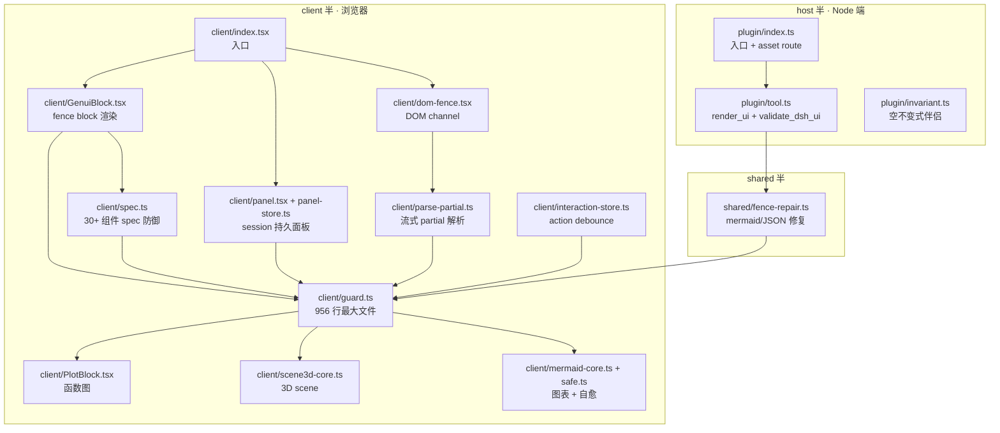

## 这篇文章在回答什么

`omdsh-dev/dsh-genui` 是 DeepSeek Harness（DSH）的第二个 DSH 插件——和 `dsh-at-file` 同 owner、同一天（8-12）开发、同样是 omdsh-dev 组织——但定位完全不同：

- **dsh-at-file**（8-12 v0.4.0，1742 行）让模型「**知道路径**」：扫描 `@path` 标记、引用 `docs/spec.pdf` 这种纯文本路径到对话流。
- **dsh-genui**（8-13 v0.8.1，5860 行）让模型「**渲染 UI**」：让模型在回答里输出 ```dsh-ui fence，浏览器即时渲染成 30+ 种交互组件（卡片、表格、图表、表单、quiz、mermaid、3D scene），用户点击 / 滑动 / 输入又通过 `action` 事件循环送回模型。

如果说 dsh-at-file 是「reference（引用）」哲学的极端——只标路径不读内容——那么 dsh-genui 是「answer-as-UI」哲学的极端——**让 AI 回答本身就是 UI**。两个插件加起来把 DSH 从「聊天界面」升格为「对话驱动的应用界面」。

仓库 README 第一句话直接表态：

> Give the model's answers a face — the text is still there, and an interactive UI is already live.

这句话不是修辞。`v0.7.2` 起 DOM channel 支持 streaming 渲染——模型写到第一个完整组件时就出现，不需要等整段流完。这件事的工程难度被低估了：传统 AI 产品要么全消息生成完一次性渲染，要么用 chunked 替换但每 chunk 都要重新 mount。dsh-genui 实现了「流式 + partial 解析 + 增量挂载」三件事同时做。

这篇文章回答五个问题：

1. **dsh-ui fence 协议长什么样**——模型怎么写、host 怎么解析、client 怎么渲染
2. **双渲染通道为什么是必要的**——registry channel（依赖新版 host 的 `fence-registry` 扩展点）和 DOM channel（独立观察 session DOM）为什么要并存
3. **本地优先原则的具体含义**——为什么「能本地做的不要发回模型」是性能 + 正确性的双重胜利
4. **action 事件循环怎么 debounce**——300ms trailing edge 的工程意义
5. **render_ui tool 通道和 fence 通道的边界**——deliverable UI 走 tool，answer UI 走 fence，为什么不分在一条路上

## 系统地图：5860 行怎么分

仓库结构比 dsh-at-file 大约 3.4 倍。三个顶层目录：

```text
src/
  plugin/             host 半（Node 端）· 329 行
    index.ts          plugin 入口 + asset route
    tool.ts           render_ui + validate_dsh_ui tool 实现（325 行）
    invariant.ts      不变式伴侣（30 行）
  client/             client 半（浏览器）· 5287 行
    index.tsx         client 入口（176 行）
    spec.ts           30+ 组件 spec 防御 + 节点验证（575 行）
    guard.ts          spec guard（956 行，最大文件）
    dom-fence.tsx     DOM channel 实现（372 行）
    panel.tsx         session panel 渲染（173 行）
    panel-store.ts    panel 状态管理（439 行）
    panel-command.ts  /panel 命令（119 行）
    GenuiBlock.tsx    fence block 渲染（166 行）
    PlotBlock.tsx     plot 函数图渲染（431 行）
    scene3d-core.ts   3D scene 实现（192 行）
    mermaid-core.ts   mermaid 引擎封装（107 行）
    mermaid-safe.ts   mermaid 错误自愈（99 行）
    parse-partial.ts  partial JSON 解析（157 行）
    safe-math.ts      安全数学（270 行）
    interaction-store.ts action 事件去重（122 行）
  shared/             共享（host + client 共用）
    fence-repair.ts   fence 错误修复（244 行）
```

测试文件 38 个，覆盖：fence fallback / panel append / mermaid safe / plot redraw / table scroll / error boundary / debounce / boundary / guard / asset loader / teach / tool / plugin / v11-v29 增量（每个版本号一个 spec）。这种「按版本号命名测试文件」的做法少见但可追溯——v25 到 v29 五个 spec 文件说明近 5 个 release 都做了回归。



依赖方向单向收敛到 `guard.ts`——956 行的 spec 防御是整个 client 半的中央闸门。

## dsh-ui fence 协议：模型写什么、谁解析、谁渲染

模型的输出格式是一段 markdown code fence，language 标记是 `dsh-ui`，内容是 JSON：

```json
{"title":"Order overview","items":[
  {"type":"stat","label":"Total revenue","value":"¥128,430","delta":"+12.4%"},
  {"type":"stat","label":"Orders","value":"1,024","delta":"-3.1%"}
]}
```

`spec.ts`（575 行）是这个 JSON 的类型定义 + 防御层。每个组件 type（`stat` / `chart` / `plot` / `form` / `quiz` / `tabs` / `table` / `timeline` / `diff` / `mermaid` / `scene3d` 等 30+ 种）都有自己的 codec——`guard.ts` 的 956 行就是这些 codec 的具体实现。

**为什么需要专门的 spec guard**？因为模型写的 JSON 经常是「接近但不对」的：

- 数字可能是字符串（`"12.4"` 而不是 `12.4`）
- 数组元素可能缺字段（`{ "type": "stat" }` 没有 label）
- 嵌套层数可能爆炸（`items[0].children[0].items[0]...`）
- 字符串可能爆长（模型填了整本书进一个字段）
- mermaid 标签可能有 `<br/>` 或裸中文（语法解析失败）

`guard.ts` 对每一条都做归一化：

| 防御维度 | 触发条件 | 处理 |
|---|---|---|
| 类型校验 | 必填字段缺失 | 静默 drop（不抛错、不报错） |
| 数值钳位 | 数字超界 | clamp 到合理范围 |
| 字符串截断 | 长度超限 | 截到 N 字符 |
| 节点上限 | 树超过 200 节点 / 8 层嵌套 | 整段拒绝 |
| mermaid 修复 | 解析失败 | 4 步重试（去掉反引号 / 引号化中文 / 删 `<br/>` / 退化到 source） |

**关键 invariant**：「pathological specs never crash the UI」——这是 README § Self-healing & limits 的硬约束。模型写得再烂，UI 不能崩。

## 双渲染通道：为什么 fence-registry 不够

README §「Read this first: dual-channel rendering」是这份文档最反直觉的一段：

> The plugin ships **two rendering channels** and picks one automatically at startup — no dependency on a specific host version.

两条通道：

**Registry channel**：host 暴露 `fence-registry` 扩展点（新版 DSH build）时，fence 通过 host 的 streaming render pipeline 注册，**与 host 行为无缝**。这条路依赖 host 的实现。

**DOM channel**：host 不暴露该扩展点（包括 stock DSH + 旧版 build）时，插件**自己观察 session DOM**，挂载自己的 render tree。`0.7.2` 起支持 streaming——组件随模型写出增量出现。

为什么需要两条路？三个原因：

**1. DSH 生态的分层部署现实**。omdsh-dev 发布的 dsh 是开源 DSH，但 DeepSeek 自己的 DSH Web 是闭源实现、迭代更快。两个部署层在 `fence-registry` 扩展点上**不一定同步**——开源 DSH 8 月底可能才跟上某个扩展点，闭源版本已经用了一个月。插件如果在闭源版本用 registry、在开源版本用 DOM，**同一份模型输出在两个 host 上行为不同**——这条边界很重要。

**2. host 升级和 plugin 升级的解耦**。DSH 的 `fence-registry` 是 host-side 能力。新版 host 出了，**旧版 plugin 不能立刻用 registry channel**（因为 plugin 没探测到）。反之，plugin 新版支持 registry 后，**旧版 host 不会回退到 DOM channel**（因为 plugin 探测到了）。这条解耦让 plugin 可以滚发布而不依赖 host 节奏。

**3. 性能 vs 兼容性的 trade-off**。Registry channel 通过 host 的 streaming pipeline 拿到**结构化的 token stream**（fence 是开闭 token 的显式标记），DOM channel 只能观察**渲染后的 DOM 节点**（fence 是 `<pre><code class="language-dsh-ui">` 块的文本内容）。前者快但依赖 host API，后者慢但独立。

**自动切换**的逻辑——README 没明说但 `dom-fence.tsx` 372 行 + `src/client/index.tsx` 176 行会探测 host 是否有 `fence-registry` 能力。探测方式是 `ctx.reflect.get('fence-registry')`——沿用 dsh-at-file 同款 fiber chain 处理（见前文）。

## 本地优先原则：为什么「能本地做的不要发回模型」

README § Local-first principle 这条很值得拆开：

> state changes the UI can do itself (grading, quiz checking, resets, expand/collapse, selection) always happen locally and instantly; actions are reserved for things that genuinely need the model (generating new content, running tools, next-step suggestions).

这条原则的具体实现藏在三处：

**1. Quiz 的本地批改**。模型输出一个 `radio` 集合 + 一个 `submit` 按钮，每个 `radio` 有 `group` + `answer`（正确答案）+ `explanation`。用户答完点 submit，**分数、每题对错、解释全部本地计算 + 立即显示**——零模型 round-trip。quiz 锁定后用户点「retake」也是本地重置。如果有 `resetAction`，则**额外**通知模型，但批改永远本地。

**2. 表单的 Enter / Ctrl+Enter 提交**。`input` 元素配 `submit:true`，按 Enter 立即提交（不是 blur 才提交）。`textarea` 是 Ctrl+Enter。fields 带 `id` 的会被收集到 `submit.fields` 里一次发送。这条消除了「输入框 → blur → 触发提交 → 模型响应」的循环——表单提交是事件不是 RPC。

**3. 折叠/展开 / 选中 / 滑动全部本地状态**。tab 切换、accordion 展开、switch 翻转、chart 滑动参数——这些状态都活在 `interaction-store.ts`（122 行）+ `panel-store.ts`（439 行）的本地 Map 里。`render_ui` 重新输出相同 spec 时，**本地状态被恢复**（content fingerprint 匹配）。

为什么「本地优先」是性能 + 正确性的双重胜利？

**性能角度**：每个本地操作省去一个 `ctx.agent.pre-step` round trip。一个 quiz 10 题，如果每题对错都发回模型，就是 10 次 RPC。**本地批改是 0 RPC**。

**正确性角度**：模型的「批改」输出可能错（幻觉）、可能延迟、可能在更新 UI 时覆盖本地状态。本地批改是**确定性的**——`answer` 字段写死，`fields[i].value === answer` 就对了。

**状态持久化**则是第三层胜利：content fingerprint 匹配让**用户中途刷新页面也能恢复之前的答题**。LRU 200 blocks 上限保证内存可控。

## 诚实交互：fake button 的反义

README § Honest interactions 是一条很朴素的工程宣言：

> interactive components must carry `action`; buttons without one render disabled (kills the "looks clickable, does nothing" fake button); buttons with `action` show instant "triggered" local feedback (proof the local event fired, not that the model received it)

这条直接对标 web 设计的「**affordance vs reality**」问题：

- 看起来像按钮（圆角 + 阴影 + hover 变色）→ 用户期待 click → click 后什么也没发生 → affordance 撒谎
- 模型输出的按钮没写 `action` → 用户看到的是 fake button → 「**渲染 disabled**」是诚实的视觉表达

`action` 是事件循环的载荷。`interaction-store.ts` 122 行管理 action 的发送 + 防重：

> buttons/switches/inputs/dropdowns/checkboxes/radios/textareas/quizzes carry `action`; click or blur sends back to the model, which updates the UI; same-name actions are debounced with a 300 ms trailing edge — rapid clicks merge into one (last value wins)

300ms trailing edge 是关键工程参数：

- **太短**（如 50ms）：用户连续点击「刷新」会触发多次模型 round trip
- **太长**（如 1000ms）：用户感觉系统迟钝
- **300ms**：人眼能区分「点」和「按住」的临界值，也是人机交互文献里的标准 debounce

「**last value wins**」是 trailing edge 的标准语义——保留最后一次，去重中间的。这一条让连击场景的模型 round trip 数量**从 N 降到 1**。

## render_ui tool 通道：fence 和 tool 为什么分两条路

README § Tool channel：

> the `render_ui` tool renders the same spec as a card in the tool row (deliverable-style UI goes through the tool, answer-style UI through the fence)

`plugin/tool.ts` 325 行实现两个 tool：

- `render_ui`：模型主动调用 tool，输出 UI spec 到 tool row（卡片形式）
- `validate_dsh_ui`：模型（**或开发**）校验 UI spec 是否合规

为什么分两条路？因为语义不同：

| 维度 | fence (`dsh-ui`) | tool (`render_ui`) |
|---|---|---|
| 触发时机 | 模型写到回答里 | 模型显式调用 |
| 位置 | inline 流式（与文字一起） | tool row 卡片 |
| 持久化 | message-bound（消息没了就消失） | session-panel（即使消息消失也保留） |
| 用途 | 解释性 UI（图表说明现状） | 交付物 UI（生成可重复使用的面板） |
| 路径 | answer stream | tool execution row |

`session panel` 是第三条路——README § Session panel：

> a persistent dock above the composer; `render_ui` / `panel: true` fences update the same surface in place; `/panel` opens it from the client (`/panel <instruction>` customizes via the model, `/panel clear` clears); the top border is draggable to resize; `append: true` merges incrementally — same-named tabs append content, new tabs get added; the whole panel caps at 200 nodes / 200 appends, after which the model should send `replace` to rebuild

200 nodes / 200 appends cap 是关键安全阀——防止模型把无限内容追加到一个 panel 让浏览器卡死。超 cap 时让模型发 `replace` 是 graceful degradation。

`/panel <instruction>` 是用户驱动的 panel 命令——`panel-command.ts` 119 行实现。这条让用户能主动要求模型「在 panel 里生成 X」而不是把它混在对话流里。

## 测试覆盖：38 个 spec 文件的设计哲学

测试文件命名分三类：

| 命名模式 | 例子 | 含义 |
|---|---|---|
| 主题测试 | `genui-boundaries`、`genui-debounce`、`genui-error-boundary` | 防御层 / 边缘情况 / 错误处理 |
| 组件测试 | `genui-plot-redraw`、`genui-mermaid-safe`、`genui-table-scroll`、`scene3d-events` | 单个组件的行为 |
| 版本测试 | `genui-v11` 到 `genui-v29` | 每个 release 锁定的回归测试 |

**版本号测试**是少见但聪明的设计——它把「release 与 spec 变更」的对应关系**写进了测试文件名**。`v25` 到 `v29` 五个文件说明最近 5 个 release 都有改动需要锁住。这种命名让阅读者一眼看出：

- 项目当前的开发节奏（5 个版本号 = 5 个增量）
- 每个版本的回归范围（看文件大小）
- 维护者的工程纪律（按 release 锁测试不是「攒到一次写完」）

`coverage` 配置在 `vitest.config.ts`——没看到 100% 强制，但 38 个 spec 文件说明覆盖深度足够。

## 工程取舍：哪些是钉死的

**spec 防御放在 client 半**。`guard.ts` 956 行是 client 半最大文件。这条决策把「模型的恶意 / 错误 spec 不能崩 UI」作为**浏览器侧的最后一道闸门**——即使模型给出一坨无效 JSON，guard 静默 drop，UI 仍然渲染出「能看的版本」。

**mermaid/three 引擎按需加载**。`asset-loader.ts` 79 行 + `asset-mermaid.ts` 13 行 + `asset-three.ts` 12 行实现 lazy 加载。mermaid 和 three 都是大 bundle（mermaid ≈ 700KB、three ≈ 600KB），不按需加载会让首屏变慢。**插件通过自己的 route 服务 asset**——`ASSET_ROUTE_PATH = '/plugins/@omdsh-dev/dsh-genui/assets'`，host 的 longest-prefix 路由让它赢过通用的 `/plugins` bundle route。这条**不需要 host 改源码**——pure plugin-side 行为。

**Pathological spec 静默 drop**。不是「报错」，不是「toast 提示」，是**静默 drop**。这条决策的工程含义是：模型写错了用户也看不到——但 UI 永远不会崩。**用户感知不到错误**比「用户看到错误」对生产体验更重要。

**Secrets 禁令**。README § Secrets ban：

> GenUI must never ask for passwords, API keys, access tokens, recovery codes, or other secrets; even if a password input appears, it stays masked, is never persisted, and never enters form collection

这条不是客户端 guard 而是**协议级禁令**——prompt + system prompt 里告诉模型「不要生成 secrets UI」。即使模型不听话、生成 password input，**客户端 mask + 不持久 + 不收集**。多层防御：协议层 + 渲染层 + 持久化层。

**render_ui 和 validate_dsh_ui 两个 tool**。后者给模型（和开发者）一个自检通道——写完 spec 后调 `validate_dsh_ui` 检查是否合规。这条让模型**自我纠错**而不是依赖客户端静默 drop。模型能拿到错误信息并重写。

## 它故意没做的事

**没有 collaborative editing**。Panel 是一个人的——没有「多用户同时编辑一个 panel」概念。这条对个人助手 OK，对团队协作文档不够。

**没有 AI 主动触发 UI 更新**。模型只能在用户点击 / 输入后才更新 UI。没有「模型后台 thinking 时主动弹一条 toast」这种打扰。Local-first 原则的延伸。

**没有 version control on spec 变更**。如果模型更新了 panel，旧版本直接被覆盖，没有 git-style 的 diff / revert。200 nodes cap 之后强制 replace 是单向的。

**没有跨 panel 复用**。`/panel clear` 清空当前 panel，但**没法把 panel A 复制到 panel B**。如果用户想要两个 dashboard 视图，需要重新让模型生成。

**没有 dark mode 适配**。README 没提。截图（`showcase-panel.png`、`showcase-plot.png`）看上去是浅色背景——dark mode 是否完整覆盖要看实际渲染。

## 这件事为什么重要

dsh-genui 不是又一个「AI + UI」项目。它的核心命题是：

> **AI 的回复本身就是 UI，不需要「应用」这个中间层。**

这条命题的工程落地是：把 30+ 组件的 spec 写成一个 fence 协议，模型用 fence 表达 UI，host 不需要理解 UI、client 渲染 UI、action 闭环回到模型。本地优先 + 诚实交互 + 自愈三原则让这套系统在「模型写得对」和「模型写得烂」两种情况下都给出可用的体验。

下放换来三件事：

1. **模型能力直接变成 UI 能力**——模型学会一个 component 就多一个 UI 元素，不需要前端开发
2. **action 闭环让模型「听见」交互**——按钮点击、参数滑动、表单提交都回传，模型实时响应
3. **零应用 / 零路由 / 零状态管理库**——传统 SaaS 的中间层全部消解，模型 + fence + spec 三件套就是「应用」

代价也很清楚：

- **spec 防御是必须的**——模型写错一次就崩 UI 是不可接受的；guard.ts 956 行是这条代价的工程表达
- **panel 上限是 single-user 假设**——200 nodes / 200 appends cap 不支持协作
- **DOM channel 比 registry channel 慢**——双通道的兼容性收益是有性能代价的

代码层面，`双渲染通道 + spec guard 防御 + 本地优先原则 + action debounce + render_ui tool 通道` 是这个范式能工程化落地的五个钉子。少一个，要么 UI 崩、要么 round-trip 爆炸、要么单一通道被 host 锁死。

`v0.8.1` 版本的 5860 行 TypeScript 是这件事的当前最优解。下一版本会是什么——也许 `panel:multi-view` 支持多 panel 并列、也许 `validate_dsh_ui` 升级成 AST 级别的 lint、也许 mermaid 引擎换成 lighterweight 的替代品——但「fence + spec + action」这条三层架构，大概率会留下。

## 维护指引：从 dsh-genui 这篇读后续工作的几件事

**dsh-at-file + dsh-genui 的协同**。这两个插件是 omdsh-dev 同一天发布的对偶设计：dsh-at-file 让模型引用 workspace 路径，dsh-genui 让模型渲染 UI。如果两者联动——模型分析 `docs/spec.pdf` 后用 `dsh-genui` 渲染数据卡片给用户——就是完整的「**AI workspace + UI**」工作流。这条路线 omdsh-dev 没说但代码已经支持（`dsh-ui` fence 可以嵌 `@path` 引用）。

**DSH 生态的扩展点**。`fence-registry` 是 DSH host 的扩展点。如果 host 不暴露，plugin 走 DOM channel。这意味着**插件部署和 host 版本紧耦合**——README §「works with any dsh build」是设计承诺，但前提是 host 必须允许插件探测自身能力。

**GenUI vs A2UI vs MCP-UI**。当前 AI UI 协议有三家：Google 的 A2UI（Agent-to-UI）、Anthropic 的 MCP-UI、DSH 的 dsh-ui。三家的设计取舍：MCP-UI 走 tool 结果；A2UI 走 structured streaming；dsh-ui 走 fence 协议。三者都解决「模型输出 UI」但路径不同。

**Omdsh-dev 路线图猜测**。两个插件同一天发布且同 owner，说明 omdsh-dev 在做 DSH 插件套件——dsh-at-file + dsh-genui 是「**read + render**」组合。下一个插件大概率是「**write**」——让模型通过 fence 协议编辑文件或执行工具（已有 `render_ui` tool 是这个方向的雏形）。

**测试覆盖策略**。38 个 spec 文件 + 按版本号命名（v11-v29）——这是「**每个 release 锁回归**」的工程纪律。后续维护者写新 spec 应该照这个范式：`genui-v30.spec.tsx` 等。

**Secrets 禁令的实现**。README § Secrets ban 是协议级，但实现依赖三层（prompt 告诉模型 / 渲染层 mask / 持久化层不收集）。任何一层缺位，secrets 都会泄露。

**双通道探测**。`ctx.reflect.get('fence-registry')` 探测 host 能力。这条和 dsh-at-file 用 `ctx.reflect.get('remote.atFile')` 解析命名空间是同一种 fiber chain 处理——omdsh-dev 显然熟悉 cordis 框架的 service store pattern。