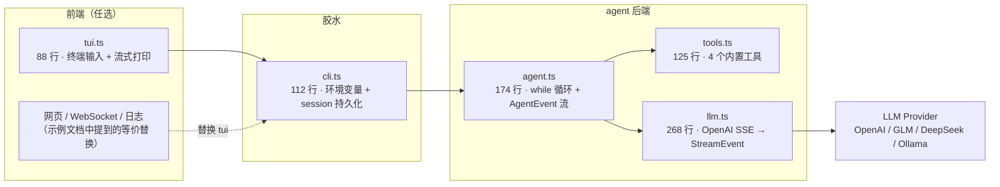

## 这篇文章在回答什么

SaladDay/pi-from-scratch 是一个 2026 年 8 月挂在 GitHub 上的教学仓库，把生产级 AI coding agent [pi](https://github.com/earendil-works/pi) 拆解成五个 TypeScript 文件、约 600 行代码。仓库简介里那句话很直接：

> 删除 pi 的工程细节，留下 pi 的核心思想。

这件事如果只是「写一个 600 行的 demo」，并没有阅读价值。nano-pi 真正有意思的是它在删的过程中做了哪些判断——哪些工程细节是噪音、哪些是骨架、哪些是「为了让学生看懂而刻意简化」的选择。配套的 docs 里反复出现一句注释模式：「教学版省略」「教学版简化为」「pi 里是…，教学版极简为」。读懂这些省略，就是读懂 nano-pi 的设计哲学。

这篇文章回答三个问题：

1. nano-pi 的五个文件为什么是这五个，而不是四个或六个——分层依据是什么
2. 双层事件流（`StreamEvent` 与 `AgentEvent`）的语义升级对应了哪种前后端分离思想
3. 它故意省略掉的工程细节（compaction 精确切割、JSON Schema 校验、session branching、工具并发）——什么时候不该照搬简化

## 系统地图：五个文件各管什么

nano-pi 整仓库的实际代码量是 767 行（按 `wc -l src/*.ts` 计数，含注释和空行）。如果只算非空非注释行，`agent.ts 174` + `cli.ts 112` + `llm.ts 268` + `tools.ts 125` + `tui.ts 88`。llm.ts 因为有 SSE 解析和类型定义，膨胀到了 268 行；真正的「核心循环」在 agent.ts，只有 174 行。



依赖方向是单向的：llm 不 import agent 的代码、agent 不 import tui 的代码、tools 不 import agent 之外的任何东西、tui 只识别 AgentEvent 这个对外契约。cli 是唯一 import 所有模块的那个文件。这条单向链让每个模块都可以独立替换——换 tui、换 tools、甚至换 llm 的 provider，上下游都不用动。

llm.ts 同时定义了 `Context`、`Message`、`ContentBlock`、`StreamEvent` 这几个核心数据类型。`Context` 是一个 `{ systemPrompt, messages }` 的纯 JSON 对象，整个对话历史都在 messages 数组里。把它整个 `JSON.stringify` 写盘，下次 `JSON.parse` 读回来，session 就恢复了——这是 cli.ts 持久化方案的根基。

| 文件 | 行数 | 单一职责 | 对外暴露 |
| --- | --- | --- | --- |
| llm.ts | 268 | 把 OpenAI SSE 翻译成 4 种 StreamEvent，定义 Context/Message | `stream()` + `contextToOpenAIMessages()` + `buildAssistantMessage()` + `buildToolResultMessage()` |
| agent.ts | 174 | while 循环，把 StreamEvent 升级为 AgentEvent，管理 Context 增长 | `runAgent()` + `compactContext()` |
| tools.ts | 125 | 4 个工具的纯函数实现 | `builtinTools()` |
| tui.ts | 88 | 终端输入 + 流式打印 | `Tui` 类 |
| cli.ts | 112 | 拼装 + session JSONL 持久化 | `main()` + `loadSession()` + `persistSession()` |

## 两层事件流：为什么 StreamEvent 和 AgentEvent 不是同一套

nano-pi 里有两套事件：

```typescript
// llm.ts —— LLM 层的原始事件
type StreamEvent =
  | { type: 'text_delta'; delta: string }
  | { type: 'tool_call'; id: string; name: string; args: unknown }
  | { type: 'done'; stopReason: 'end_turn' | 'tool_use' | 'max_tokens' | 'aborted' }
  | { type: 'error'; error: Error }

// agent.ts —— agent 层的高级事件
type AgentEvent =
  | { type: 'assistant_text'; delta: string }
  | { type: 'tool_call'; id: string; name: string; args: unknown }
  | { type: 'tool_result'; id: string; name: string; result: string }
  | { type: 'turn_end'; stopReason: 'end_turn' | 'max_tokens' | 'aborted' | 'error' }
```

表面看几乎一样，但语义层级不同：

- **`StreamEvent`** 描述「LLM 这条 HTTP 流告诉了我什么」。`max_tokens` 是 OpenAI 协议的 `finish_reason: "length"` 翻译过来的，`tool_use` 是 `tool_calls` 翻译过来的。`StreamEvent` 还保留了 `error` 这种「协议层失败」的语义——网络断了、API 返回 500、JSON 解析炸了，都走这个事件。
- **`AgentEvent`** 描述「agent 这一轮做了什么」。`tool_result` 是 StreamEvent 里根本没有的事件——它代表「工具已经跑完了，结果是 X」。`turn_end` 把 StreamEvent 的 4 种 stopReason 合并重命名为 4 种（`end_turn` / `max_tokens` / `aborted` / `error`），而且把「OpenAI 偶尔返回 `tool_calls` 但没真的给 tool_call delta」这种畸形协议情况统一为 `end_turn`。

这套分层对应的是教科书里的「前后端分离」：

- agent 是后端，吐出 AgentEvent
- tui / web / 日志都是前端，只认 AgentEvent
- StreamEvent 是后端内部的实现细节

docs/ch02-loop.md 里有一段直接演示了这个分离：把 tui 整个换成一个 20 行的 HTTP server，把 `tui.printText(ev.delta)` 改成 `res.write(\`data: ${JSON.stringify(ev)}\n\n\`)`，agent.ts 一行都不用动。这不是修辞——因为 `runAgent()` 的对外契约就是 AgentEvent，谁来消费、怎么消费，跟 agent 没关系。

pi 的架构也是这个思路：`pi-agent-core` 对 `pi-tui` 零依赖。nano-pi 把这条约束做成了物理隔离——tui.ts 不 import agent.ts 的任何东西，只通过 cli.ts 间接接受事件流。

## 一次完整轮次：context 是怎么长起来的

把抽象的事件流落到一段具体对话上，看 context 的形状变化。假设用户问「读一下 hello.txt」。

第一轮 stream 之前：

```json
{
  "systemPrompt": "你是一个编码助手...",
  "messages": [
    { "role": "user", "content": "读一下 hello.txt" }
  ]
}
```

模型回了一段文本 + 一个 tool_call。`buildAssistantMessage()` 把它们打包塞回 context.messages：

```json
[
  { "role": "user", "content": "读一下 hello.txt" },
  { "role": "assistant", "content": [
    { "type": "text", "text": "我来读取这个文件。" },
    { "type": "tool_use", "id": "call_1", "name": "read_file", "input": {"path": "hello.txt"} }
  ]}
]
```

注意 `tool_result` 在 nano-pi 的内部表示里是嵌在 `user` message 的 `content` 数组里的一条 `ContentBlock`，跟 OpenAI 协议要求的那种独立 `role: "tool"` 消息不一样。这是 nano-pi 故意选的内部表示——「用我们最顺手的数据结构，转换成各家 provider 的格式是 llm.ts 的工作」。这种「内部表示 vs 线协议格式」的分离，跟 HTTP 内部用 `HttpRequest` 对象、对外序列化 wire format 是一个道理。`contextToOpenAIMessages()` 在发请求前逐条转换：普通文本保留 user 或 assistant，tool_use 转成 `tool_calls`，tool_result 转成 `role: "tool"`。llm.ts 的代码注释里给了一个很直接的解释：docs 里也说明了——这是为了让我们自己写代码的时候能直接用 ContentBlock 数组，不用每次写请求的时候都先生成 OpenAI 协议要求的「tool message」。

执行完 `read_file`，`buildToolResultMessage()` 把结果打包：

```json
[
  { "role": "user", "content": "读一下 hello.txt" },
  { "role": "assistant", "content": [
    { "type": "text", "text": "我来读取这个文件。" },
    { "type": "tool_use", "id": "call_1", "name": "read_file", "input": {"path": "hello.txt" } }
  ]},
  { "role": "user", "content": [
    { "type": "tool_result", "tool_use_id": "call_1", "content": "hello world" }
  ]}
]
```

第二轮 stream，模型看到 tool_result，回了纯文本「文件内容是 hello world。」，没有 tool_call。toolCalls 数组为空，循环结束。整个对话就这样一条一条长起来。

这里有一个微妙之处：`buildAssistantMessage(text, [])` 在 abort 路径下被调用时，会生成一条只有文本没有 tool_call 的 assistant message——这是为了**保持「每条 assistant message 必须有内容」**的协议约束，否则 OpenAI API 会返回 400。同理，被 abort 跳过的 tool_call 也要补一条 `error: aborted` 的 tool_result，因为**每条 tool_call 必须有对应的 tool_result**，session 恢复时缺一个，API 就报错。

## 三个边界：max_tokens、aborted、error 的处理哲学

agent loop 的核心 while 循环里有三处 if 专门处理异常终止，每一处都不是「报错退出」那么简单：

### 边界一：max_tokens + tool_call 同时发生

```typescript
if (stopReason === 'max_tokens' && toolCalls.length > 0) {
  const results = toolCalls.map(tc => ({
    tool_use_id: tc.id,
    content: `error: output truncated by max_tokens, tool "${tc.name}" args may be incomplete.`,
  }))
  context.messages.push(buildToolResultMessage(results))
  continue  // 不 return，让模型下一轮重发
}
```

为什么不直接执行 tool_call？因为 `max_tokens` 截断时，tool_call 的 `arguments` JSON 可能被切成半截。拿半截 JSON 去执行 `edit` 或 `run_bash`，轻则报错，重则写出错乱的文件。nano-pi 的策略是把截断信息作为 tool_result 放回 context，让模型下一轮「知道自己的输出被截了，请重新发完整版」。这是把错误当作上下文的一种取舍——LLM 不只是执行者，也是「能从自己错误里学的执行者」。

### 边界二：abort 发生的位置不同，处理不同

abort 可能在三个位置发生：等 LLM 回复时、解析 tool_call 时、执行工具时。nano-pi 区分对待：

- **abort 在 stream 中**：`buildAssistantMessage(text, [])`——只保存已收到的文本，**丢掉 tool_calls**。因为「tool_call 没有对应 tool_result」会让 session 恢复时 API 报错。abort 触发后用户多半不会再恢复这个 session，但 agent 不知道这件事，所以按最坏情况处理。
- **abort 在工具执行中**：已执行完的工具保留 result，剩下的 tool_call 补 `error: aborted`。同样的「配对约束」考虑。
- **abort 在 compaction 中**：`compactContext()` 第一行就 `if (signal?.aborted) return`——abort 时跳过压缩，因为 LLM 总结请求也会被中断，得到的可能是空摘要或半截摘要。「用空摘要替换掉原始消息」比「不压缩」更危险，所以宁可不压。

### 边界三：error 事件

```typescript
} else if (ev.type === 'error') {
  context.messages.push(buildAssistantMessage(text, []))
  yield { type: 'assistant_text', delta: `\n[error] ${ev.error.message}` }
  yield { type: 'turn_end', stopReason: 'error' }
  return  // 终止循环
}
```

跟 max_tokens 不同，error 后直接终止循环、退出 while。原因是 max_tokens 是「模型答到一半、上下文还完整」，可以重试；error 是「请求失败、不知道上下文是否完整」，再问一次大概率同样的错。abort 和 error 之后都不 return 的话，会立刻发起新一轮请求，重蹈覆辙。

这三处 if 加起来不到 30 行，但每个都有明确的语义理由。把它跟 pi 的生产级代码对比一下就能看出教学版的价值——pi 的对应处理要兼顾「session 恢复」「tool_call 反序列化」「UI 状态同步」等多条线；nano-pi 把它们全部砍掉，只保留最容易出错的那几条，让读者看清「agent loop 必须在哪些点做防御」。

### 一个隐藏的边界：tool_use stopReason 但 toolCalls 为空

还有一处不那么显眼但在 runAgent 里被处理过的边界：OpenAI API 偶尔会返回 `finish_reason: 'tool_calls'`（被 llm.ts 翻译成 `tool_use`），但 tool_calls 增量流根本没有真的发出来——`toolCalls` 数组最终为空。agent 不会直接 yield 一个 `tool_use` 的 turn_end，而是把这种情况统一降级为 `end_turn`：

```typescript
const reason = stopReason === 'tool_use' ? 'end_turn' : stopReason
if (toolCalls.length === 0) {
  yield { type: 'turn_end', stopReason: reason }
  return
}
```

把「畸形协议回复」折进正常流程，是把无法控制的上游行为降级成「LLM 这一轮没干活」。这是 OpenAI 协议层一个不稳定的角落，nano-pi 用 2 行代码把不确定性关进了 while 循环。

## 四个工具的设计取舍：为什么是 read / write / edit / bash

`tools.ts` 一共 125 行，4 个工具。每个都是纯函数：`async (args, signal?) => Promise<string>`，不碰 agent 状态、不知道 Context 的存在、不知道自己被谁调用。AgentEvent 流过来一个 `tool_call`，agent 在 `toolMap.get(tc.name)` 里找到对应的 execute 调用，把字符串结果包成 `tool_result` 事件 yield 出去。

| 工具 | 入参 | 返回 | 设计取舍 |
| --- | --- | --- | --- |
| `read_file` | `{ path }` | 文件内容（截尾部） | 200 行截断、完整输出存临时文件，错误信息通常在末尾 |
| `write_file` | `{ path, content }` | `wrote <path> (<n> chars)` | 先 `mkdir -p` 父目录，避免调用方处理目录创建 |
| `edit` | `{ path, old_string, new_string }` | `edited <path>: replaced <n> chars` | 精确字符串匹配 + 唯一性校验；不用行号是因为行号会漂移 |
| `run_bash` | `{ command }` | stdout+stderr（截尾部） | 失败不抛异常，把 exit code / stderr / stdout 拼成字符串返回 |

四个工具回答的是「一个 coding agent 干活最少需要什么能力」：**读**拿到当前状态，**写**从无到有创建文件，**改**在已有文件里精确改一段，**跑**执行命令验证。

`read_file` 和 `run_bash` 都调用了同一个工具内辅助函数 `truncateOutput(content, maxLines=200)`：超出 200 行时只保留尾部，完整内容写进 `/tmp/nanopi-output-<pid>-<n>.txt`，返回值里附上临时文件路径。这个设计的两点判断值得看：

- **为什么是尾部而不是头部**：编译器的错误信息、stack trace、运行日志的关键报错都在末尾。如果保留前 200 行，模型看到的是正常输出；保留末尾 200 行，模型看到的是报错。tail 优先是「错误可见」优先。
- **为什么不直接截断丢弃**：完整内容还在磁盘上，路径返回给模型后，模型可以自己调 `read_file` 读临时文件再细看。这是一种「先压缩、再可回查」的思路——nano-pi 用 30 行 `truncateOutput` 实现了和 Headroom 的 CCR 同一类语义，只是没有公开的 retrieve API。

`read_file` 本身的返回值还要再加一层：除了尾部 200 行，路径也是稳定的输入参数，模型可以重读同一个文件查其他行。这是「压缩不丢信息」的实现方式：完整内容在原始路径上一直存在，截断只是对当前这一轮的限制。

`edit` 的 `old_string` + `new_string` 设计值得展开。它不接收行号，而是要求调用方给出一段**在文件里恰好出现一次**的字符串。`execute` 里有三步校验：

```typescript
const count = content.split(old_string).length - 1
if (count === 0) throw new Error(`old_string not found in ${filePath}`)
if (count > 1) throw new Error(`old_string matches ${count} places in ${filePath}, must be unique`)
// 用函数替换避免 $& $1 等特殊字符被 String.replace 解释
const newContent = content.replace(old_string, () => new_string)
```

第三步用 `() => new_string` 而不是直接传字符串，是为了让 `new_string` 里的 `$&`（匹配到的文本）、`$1`（第一个捕获组）不被 `String.replace()` 当成特殊指令。这是「调用标准库时记得它的 API 边界」的典型例子。

`run_bash` 的失败处理更值得展开。它**不抛异常**：

```typescript
try {
  const { stdout, stderr } = await execAsync(command, { maxBuffer: 1024*1024, timeout: 30000, signal })
  return stderr ? `[stderr] ${stderr}\n[stdout] ${stdout}` : stdout
} catch (e) {
  if (signal?.aborted) return 'aborted'
  return `[exit ${err.code}] ${err.stderr ?? ''}${err.stdout ?? ''}`
}
```

为什么？因为 agent 拿到的是 tool_result 字符串——对它来说，退出码 1 的「编译失败」和退出码 0 的「编译成功」没有本质区别，都是这一轮需要继续读下去的信息。shell 的「失败」语义在这里被翻译成「这一轮的观察结果」，异常不是被吞掉，而是被改写成可继续阅读的字符串。

pi 的 agent-core 层也是这四个工具。claude-code、codex 这些商业 coding agent 的核心工具集基本是这个组合，每个拆成更细的版本（`view`、`grep`、`glob`、`patch`、`apply_diff` 等）。nano-pi 用最少集合证明了「这四个够用」——再多就是工程优化，不是核心思想。

## compaction：为什么用消息条数而不是 token 数

```typescript
const COMPACT_THRESHOLD = 50
const KEEP_RECENT = 20

async function compactContext(model, context, signal) {
  if (signal?.aborted) return
  if (context.messages.length < COMPACT_THRESHOLD) return

  const oldMessages = context.messages.slice(0, -KEEP_RECENT)
  const recentMessages = context.messages.slice(-KEEP_RECENT)

  // 让 LLM 总结旧消息
  const summaryContext = {
    systemPrompt: '请将以下对话总结为简洁的上下文摘要...',
    messages: [{ role: 'user', content: conversationText }],
  }
  let summary = ''
  for await (const ev of stream(model, summaryContext, { signal })) {
    if (ev.type === 'text_delta') summary += ev.delta
  }

  if (!summary) return  // 总结失败时保留原消息

  context.messages = [
    { role: 'user', content: `[context summary]\n${summary}` },
    ...recentMessages,
  ]
}
```

`compactContext()` 在每轮循环开头调用。超过 50 条消息时，把前 30 条拿出来序列化成一个 user message，让 LLM 总结成摘要，用这条摘要替换前 30 条，保留最近 20 条。

pi 的实现 970 行。nano-pi 用消息条数近似 token 数。pi 里做了三件 nano-pi 没做的事：

1. **精确 token 估算**：用模型的 tokenizer 数真实 token，不只是「消息条数」。pi 会在切割点两边都算 token，确保摘要替换后总 token 不超过窗口的 80%
2. **最优切割点计算**：在「保留整轮对话（user + assistant + tool_result 的最小单元）」和「目标 token 数」之间找最优解，不会把一轮对话拦腰切断
3. **跨消息边界的 split turn**：当一轮对话超过单条消息上限时，把它拆成多条独立消息，保留对话完整性

nano-pi 用「消息数 ≥ 50」一刀切，估算粗糙但概念完整。docs 里直接说了：「教的是『context 有上限，满了要压缩』——agent 自管理上下文的核心能力」。

一个细节值得注意：`if (!summary) return`——压缩失败时**不替换** context，宁可不压也不要用空摘要污染。这是「错误降级」的典型选择：宁可保留可能超限的 context，也不用一个不可信的摘要污染 LLM 的工作记忆。同样的考虑也出现在 abort 路径：`if (signal?.aborted) return` 在函数第一行——abort 状态下 LLM 总结请求也会被中断，得到空摘要或半截摘要的风险很高。与其得到一个不可信的摘要，不如不压缩。

这条「宁可保留可能超限的原状，也不被一个不可信的派生状态污染源」是 nano-pi 三处错误降级都遵循的原则（另一个是 abort 跳过的 tool_call 要补 `error: aborted`，不补会让 session 恢复时 API 报错——同样是「不要让派生错误破坏主流程」）。

## tui 与 agent 的解耦：换前端不改后端

`Tui` 类 88 行，对外暴露 9 个方法：

```typescript
class Tui {
  onPrompt(cb: (text: string) => void)
  onAbort(cb: () => void)
  setBusy(busy: boolean)
  printText(delta: string)
  printToolCall(name: string, args: unknown)
  printToolResult(name: string, result: string)
  printTurnEnd()
  start() / stop()
}
```

`tui.ts` 不 import `agent.ts` 的任何东西。它只认 AgentEvent，不知道 LLM 是什么、不知道工具怎么执行。这层隔离让两件事变得可能：

- **测试 agent 不需要跑终端**：`loadSession()` / `persistSession()` 都被 export 出来，测试可以直接驱动 agent loop、断言 context 变化，不用开 stdin
- **换前端不改后端**：docs 里给了一个 20 行的 HTTP server demo，把 `tui.printText(ev.delta)` 改成 `res.write(\`data: ${JSON.stringify(ev)}\n\n\`)`，浏览器就拿到了 SSE 流

Tui 里有一个反直觉的设计：`setBusy()` 不是「锁住整个 UI」，而是「锁住输入 + 屏蔽默认 Ctrl+C」。

```typescript
process.stdin.on('keypress', (_ch, key) => {
  // 只在 agent 运行时处理 Ctrl+C，空闲时交给 readline 默认行为
  if (this.busy && key?.ctrl && key?.name === 'c' && !this.aborted) {
    this.aborted = true
    this.onAbortCb?.()
  }
})
```

为什么这样？因为 agent 在跑的时候按 Ctrl+C 应该是「中断当前 agent 循环」，但 agent 没在跑的时候按 Ctrl+C 应该是「退出整个程序」（readline 的默认行为）。Tui 用 `this.busy` 区分这两种意图。

`prompt()` 也因此变得不那么直接：agent 跑完一轮调 `setBusy(false)` 才会再 `prompt()`，而不是每轮结束都立即显示提示符。这是一个细节，但少了它就会出现「agent 还在输出最后一行，用户已经敲了新 prompt」的并发问题。

还要看到 Tui 故意没做的事情：不做 differential renderer（只调 `process.stdout.write`，不维护虚拟终端缓冲区），不做 component 树（每个事件直接产生一行输出，不维护状态机），不做 markdown 渲染（流式文本是字符拼接，不解析语法）。docs 里直接说：「这些是『终端 UI 框架』的功课，不是『手撕 agent』的灵魂。」——nano-pi 的取舍是「UI 能显示就行，不优化」。这条取舍在 tui 的 88 行代码里看得最清楚：每一行都是「能让 agent 和用户看见对方」的最少代码，没有一行是「为了体验更顺滑」写的。

## cli.ts 的胶水层：session 持久化和 AbortController 的寿命

cli.ts 是唯一 import 所有其他模块的文件，112 行。它做三件事：

1. **环境变量 → Model 对象**：从 `NANOPI_API_KEY` / `NANOPI_MODEL` / `NANOPI_BASE_URL` 读配置，组装成 `Model` 类型
2. **session JSONL 持久化**：每轮结束把 context 里新增的消息 append 到 `~/.nanopi/session.jsonl`，启动时 `loadSession()` 把它们读回来
3. **每轮新建 AbortController**

第三点最容易被忽视。`AbortController` 是单次使用的——一旦 `abort()` 被调用，这个 controller 就废了，下次再 `abort()` 不会有任何效果。所以 nano-pi 在 `tui.onPrompt` 回调里每轮都新建一个：

```typescript
tui.onPrompt(async (text) => {
  context.messages.push({ role: 'user', content: text })
  tui.setBusy(true)
  const ctrl = new AbortController()
  tui.onAbort(() => ctrl.abort())  // 重新注册回调指向新 controller

  for await (const ev of runAgent(model, context, tools, ctrl.signal)) { ... }
})
```

同时 `tui.onAbort` 也要每轮重新注册，因为回调里捕获的是上一轮的 ctrl。这种「一次性资源每轮新建」的模式是异步控制流的常见坑——如果忘了重建，用户按第二次 Ctrl+C 就完全没反应了。

session 持久化的设计也值得一提。用 JSONL（一行一个 JSON 对象）而不是单个 JSON 数组的好处：

- **append 简单**：`fs.appendFile()` 写入新行，不读旧内容
- **读时容错**：损坏的行跳过，不影响其他行（`loadSession` 里 `flatMap` + `try/catch`）
- **容易流式处理**：理论上可以一行一行读，不用把整个 session 加载到内存

`persistedCount` 这个进程级变量也存在 cli.ts 里——它不是 agent 状态，是「这一进程已经写盘了多少条」的记录。因为 `context.messages` 跨多轮会一直增长，但只 append 新增的部分。这种「状态在 agent 不在，在 cli」的拆分也体现了边界划分——agent 不知道 session 文件存在，cli 负责把 agent 的状态落地。

## 什么时候不该照搬简化

nano-pi 的删减不是「哪个特性不重要所以删」——每处删减都有明确的代价。读源码时需要看清这些代价，才能知道哪天你想加回来时该往哪里加：

| 删掉的工程细节 | 代价 | 何时必须加回来 |
| --- | --- | --- |
| JSON Schema 参数校验 | 工具收到畸形 args 时直接报错，模型从错误里自纠 | 多 provider、多版本工具、需要 IDE 自动补全 |
| 精确 token 数 compaction | context 估算粗糙，可能提前触发或晚触发压缩 | 长任务 Agent、超长 session、需要稳定 token 预算 |
| 工具并发执行 | tool_call 串行，慢了 N 倍 | 独立工具（如 `read_file` × 多文件） |
| session branching | 不支持「从中间轮次恢复 + 分叉」 | 探索性任务、需要 A/B 不同 prompt 路径 |
| 多 provider 适配 | 只支持 OpenAI 兼容格式 | Anthropic / Bedrock / 本地模型需要不同协议 |
| TypeScript extensions / skills 系统 | 工具集是写死的 | 用户需要自定义工具或加载第三方 skills |
| pi-tui 的 differential renderer | 终端滚动不优化，长输出会闪烁 | 需要长时间运行的交互体验 |

这些被砍掉的特性大多对应**生产环境的真实痛点**：token 预算、并发、provider 兼容、UI 性能。nano-pi 用 600 行代码证明了「agent 的核心思想不需要这些也能跑」，但**核心思想跑通 ≠ 生产可用**。

## 怎么落地：从 nano-pi 到自己的 agent

如果你想从 nano-pi 出发做一个生产可用的 agent，docs 里给的渐进路径很清楚：

1. **先跑通 nano-pi**：`npm install && export NANOPI_API_KEY=... && npm run dev`，让一个能读能写能改能跑命令的 agent 在你终端里跑起来
2. **换一个前端**：参考 docs 里 20 行 HTTP server demo，把 tui 换成 SSE + 浏览器，把 4 个工具换成你想要的 UI 控件
3. **加一个工具**：在 `tools.ts` 里加一个 `grep` 或 `glob`，注意保持「纯函数 + 不碰 agent 状态」的契约
4. **接入真实 compaction**：把 `compactContext()` 换成基于 tokenizer 的精确实现，参考 pi 的 `pi-agent-core` 中 `compaction.ts`（970 行）
5. **接入第二家 provider**：在 llm.ts 里加一个分支，把 Anthropic 的 `event_stream` 也翻译成同样的 4 种 StreamEvent
6. **加 session branching**：在 cli.ts 里维护一个 `tree` 结构而不是线性 JSONL，允许从任意历史节点恢复

第 1-3 步不需要碰 agent.ts。第 4-5 步需要碰 llm.ts 但 agent.ts 完全不用动。第 6 步会改动 cli.ts 和 llm.ts 的 session 读写接口，但 runAgent 本身还是那个 while 循环。这就是单向依赖的红利——每一步的改动范围都跟它的复杂度成正比。

## 600 行代码删掉了什么，又留下了什么

读完整套源码和 docs，nano-pi 的删减可以归纳成两个方向：

**被砍掉的工程细节**：JSON Schema 校验、精确 token 估算、工具并发、session branching、多 provider 适配、UI differential renderer——这些全是「让生产 agent 更稳」的工作，跟「让 agent 跑起来」无关。砍掉之后，「教学版缺了什么」是一目了然的。

**被刻意保留的边界**：tool_call / tool_result 的配对约束（API 协议硬要求）、abort 时的半成品处理（不污染 session）、compaction 失败时的降级（不污染 context）、read_file 的输出截断（不让 OOM 一次干掉 8K context）——这些不是「为了跑起来」，是「为了不崩」。教学版没有删掉它们，是判断它们属于骨架。

这套取舍背后是一个工程观点：**agent 的核心思想是循环、事件、context，剩下的是工程优化**。600 行 TypeScript 跑通了这条最小骨架，多出来的一万行 pi 是让这条骨架在生产环境里不掉链子。两者不是替代关系，是教学版和生产版的关系。

SaladDay 在仓库简介里写的那句话——「删除 pi 的工程细节，留下 pi 的核心思想」——读完代码再看，会发现它不是营销话术，是真做了。但「核心思想 ≠ 生产可用」这件事，nano-pi 自己也在多处注释里点名了：pi 里还有不少没覆盖的东西值得单独写（精确 token 估算和 compaction 切割策略、TypeScript 扩展系统、多 provider 适配、session branching、pi-tui 的 differential renderer）。

---

仓库地址：<https://github.com/SaladDay/pi-from-scratch>
配套文档：<https://pi-from-scratch.vercel.app/>
源项目：<https://github.com/earendil-works/pi>