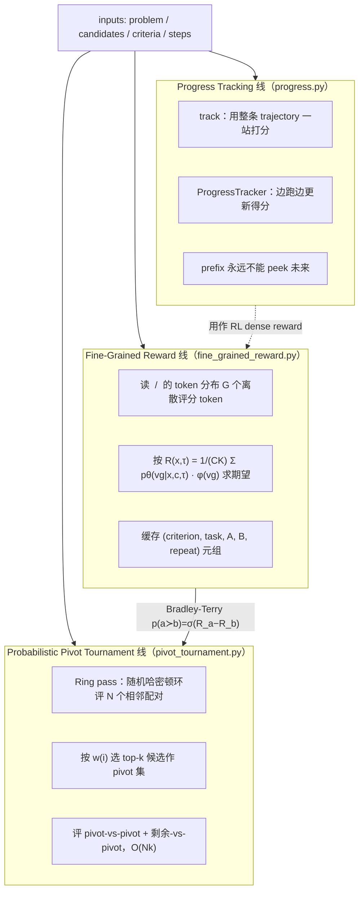

# LLM-as-a-Verifier：当「验证」成为继预训练 / 训练后 / 测试时之后的第四条扩展轴

**核心判断**：llm-as-a-verifier 真正解决的问题不是「给 agent 的输出打一个分数」，而是把「判断方案对不对」这项工作从一次性离散判定改写成可规模化、可重复、可观测的连续过程——它把 verifier 变成了继预训练、训练后、测试时之后的第四条扩展轴（论文 arXiv 2607.05391 的原话）。从 README、文档和论文的三件套读下来，这不是一个比 LLM-as-a-Judge 更准的 evaluator，而是一套把评估成本从 O(N²) 压到 O(Nk)、把评测结果从抖动不止的离散分数压成可缓存可复用的连续奖励的工作。

## 为什么这个仓库值得拆

`llm-as-a-verifier/llm-as-a-verifier` 在 GitHub 上的姿态只有一句话：`pip install llm-verifier`。这个 0.2.0 版的 PyPI 包当前 1.96k stars / 137 forks（GitHub API 拉取于 2026-08-19 13:00 GMT+8），MIT 协议，2026-04-09 创建、2026-08-14 最后一次 push。安装一行、跨 4 套 agent 基准 4 项 SOTA：Terminal-Bench V2 86.5%、SWE-Bench Verified 78.2%、RoboRewardBench 87.4%、MedAgentBench 73.3%。它的 9 位作者出自 Stanford（Chelsea Finn、Marco Pavone）、Princeton（Yuejiang Liu）、UC Berkeley（Ion Stoica、Jackey Kwok、Shulu Li）和 Prime Intellect（Azalia Mirhoseini），同时工程化的配套 TurboAgent（Claude Code Proxy 插件）也已经独立成仓。

把它和「`{ agent }` + `LLM-as-a-Judge`」的常见配方摆在一起，差别一眼就看出来：

- **对一个 trajectory 只取一个整数**：27% 平局率、不能拿来当 RL（强化学习）reward、不能做 progress tracking。
- **对一组 token 概率分布取期望**：平局率降到接近 0、可缓存在 disk、可喂给 SAC（Soft Actor-Critic 离策略强化学习算法）/ GRPO（Group Relative Policy Optimization 近端策略优化算法）做 reward、可在多步执行中追踪进度。

llm-as-a-verifier 重新定义了「评分」这件事的形状。下面把这套系统拆到能自己改 cache 与准则的程度。

## 系统地图：三条线如何在一次 `select` 里合流

仓库 `llm_verifier/` 下的代码只做三件事，但它们必须同时工作：



抽象层面三条线互相独立，工程层面它们是同一个 API 的三种用法：

- `select` → 起 B 线，B 内部把所有 (A, B) 对交给 A 线。
- `track` / `ProgressTracker` → 起 C 线，每一步 checkpoint 由 A 线打分。
- `compare` → 是 A 线最朴素的形态：一次 (A, B) 取两个 reward。

下面把 A、B、C 三根线分别摊开，每根都给出「为什么这样做」的最小理由。

## 第一根线：粒度、重复、准则分解——把离散打分拉成连续梯度

### 1. 为什么 G=20 不是 G=5

LLM-as-a-Judge 的传统做法是让模型输出 1–5 的整数，让模型在采样温度较低的情况下自己选一个。这个做法在 Terminal-Bench V2 上吃掉 27% 的任务——复杂方案之间，模型的「信念」其实很模糊，但整数采样把信念全压扁了。文档 `fine_grained_reward.html` 列了一个对照实验，用 Terminal-Bench `query-optimize` 任务（agent 拿到一条慢 SQL，要写出等价且更快的查询；两条候选都能跑得快，但只有一条验过了和基准数据库的等价）：

| 方法 | 正确 > 错误 ✅ | 正确 = 错误 ⚖️ | 正确 < 错误 ❌ |
| --- | --- | --- | --- |
| Judge (离散, G=5) | 12 / 100 | 88 / 100 | 0 / 100 |
| Verifier (连续, G=5) | 69 / 100 | 0 / 100 | 31 / 100 |
| Verifier (连续, G=20) | 77 / 100 | 0 / 100 | 23 / 100 |

这就是「连续 reward」的真正含义：整数采样把模型的信念切碎成 5 块，取期望以后再放大到 20 块，原来被判「平局」的那 88 份评价里只有 31 份需要纠正，其余 69 份本来就是「正确 > 错误」。

实现层只做了一件事——把 `<score_A> 1..20 </score_A>` 里的数字替换成 20 个字母 (`A`–`T`)，让每个评分恰好是一个 token，这样可以直接拿到 20 个离散概率 `pθ(vg|x,c,τ)`，再用 `φ(vg)` 把它映射成 `[0,1]` 标量。`GRANULARITY = 20` 就是 `references/api.html` 里写死的常量。

### 2. 准则越多越准，但不靠维度堆叠

`verification_scaling.html` 的对比实验：单一准则（无论粒度多细）只能到 75.2–76.4% 准确率，三准则组合（Specification / Output / Errors）一起打分能到 78.3%。这条曲线的「为什么」是 complexity reduction——「这段 trajectory 是不是对的」其实在混着「规格对不对」「输出格式对不对」「日志里有没有报错信号」三件事，模型被迫一次答三道题时通常只挑它最熟的信号。

仓库 `criteria/` 下有 `terminal_bench.md` / `swe_bench.md` / `medagentbench.md` 三份模板，文件结构上你也可以照着 `TEMPLATE.md` 写自己领域的 `criterion_id.md`。Verifier 接受两种调用形式：

```python
# 1. 内置准则名
result = llm_verifier.select(problem, candidates, criteria="terminal_bench")

# 2. 现场写一个 dict
result = llm_verifier.select(
    problem=problem,
    candidates=candidates,
    criteria={"Correctness": "Does the code actually reverse the string?",
              "Verification": "Did the agent confirm the fix?"},
)
```

每条准则在 R(x,τ) 公式里都贡献 1/C 权重、重复 K 次，期望在 0–1 之间。

### 3. 重复评估是把方差拍平的杠杆

docs `verification_scaling.html` 同样展示了「`k=16` 时离散的 judge 才刚把 ties 压下来，verifier 仍然领先 7.2%」的数据。背后的逻辑是：单次 `<score_A>` 采样是 0/1 方差，重复 K 次后 reward 的标准差会按 √K 下降。所以 README `USAGE` 字段做了「进程级、线程安全的 token 计数器」，library 用户的 `select` / `compare` / `track` 拿到的是同一份实测数据。

## 第二根线：Probabilistic Pivot Tournament 把 N 选 1 砍成 O(Nk)

### 算法在做什么

`pivot_tournament.html` 用 5 步把 N 个候选排序：

1. **Ring pass**：随机哈密顿环，N 个相邻对各评一次，让每个候选都既出现在 A 槽又出现在 B 槽——位置偏置被配对级抵消。
2. **Pivot selection**：按 ring pass 得分 `w(i)` 把候选升序排，取 top-k 作 pivot 集 P。
3. **Pivot tournament**：对每个 `non-pivot vs pivot` 和 `pivot vs pivot` 跑 pairwise preference `p(a≻b) = σ(R_a − R_b)`，预算集中花在不确定的顶部候选。
4. **聚合**：win mass `w_i` 和 count `c_i` 累加，winner 用 `w_i / c_i` 的归一化值。
5. **规模**：从 O(N²) 降到 O(Nk)，k 取 2 时一次 `select` 几乎只要 2N 次 directed comparison。

文档 `references/api.html` 写到 `pivots` 接受 `clamp(k, 2, N)`，仓库默认 `pivots=2` / `n_evaluations=8`，CLI 三个开关 `--pivots` / `--n-evaluations` / `--seed` 完整覆盖。

### 一次性开销：缓存可控、断点可续

`select` / `compare` / `track` 三个 API 都吃 `cache="path/to/cache.json"` 实参；每个 `(criterion, task, A, B, repeat)` 元组进缓存，重跑只比新比较——把每次实验变成可复用数据集。`pivot_tournament.py` 里有更细的两阶段评分：先扫 ring pass 选 pivot、再打分 pivot。所以同一份样本换种子、换 k、换模型时，缓存大概率被打满。

`on_error` 默认 `"tie"`——一次 verifier call 失败就把 (A, B) 评 0.5/0.5，仅对本轮生效、永不写盘；`"raise"` 立即抛错。`compare` 和 `track` 没有 tie fallback，失败就是 raise。

## 第三根线：把 verifier 调成可观测、可早停、可解释的过程

### 拿到 progress 曲线

README 给出两步走：

```python
result = llm_verifier.track(problem=problem, steps=steps,
                            checkpoint_steps=[1, 2, 3, 4, 5], n_evaluations=4)
print(result.scores)  # [0.00106, 0.02417, 0.03143, 0.62004, 0.99978]
```

`track` 对一条已完成 trajectory 一次性打分，最便宜；`ProgressTracker` 是它的在线版：

```python
tracker = llm_verifier.ProgressTracker(problem, n_evaluations=4)
score = tracker.update('Read the problem statement')            # 0.00002
score = tracker.update('Wrote def rev(s): return s')            # 0.00013
score = tracker.update('Changed to def rev(s): return s[::-1]') # 0.73938
score = tracker.update('Tested: rev("abc") returned "cba"')     # 0.98604
if score < 0.05:
    # 滚到第 5 步 reward 还在 0.005 附近，hold 不住就跑别的 rollout
    ...
```

两者的关键差异：`ProgressTracker` 只能看到 prefix——结构上不可能让未来泄漏到今天。`progress.py` 把这一步和评估目标一起实现为「让 verifier 相信当前 trajectory prefix 已经能完成任务的概率」，所以曲线本身即可解释。

### 用 verifier 喂 RL

`reinforcement_learning.html` 把这条线推到极限：离策略的 SAC 拿 `track` 作为 dense reward 喂 LIBERO（机器人操作任务集），近策略的 GRPO 拿 `select`-style tournament 对推理模型的输出取 reward。整个接入「不涉及任何 reward-model 微调」——verifier reward 直接复用现有 LLM 的推断能力。[^rl-data]

[^rl-data]: 文档原页附带的具体数值表（`14× / 40 47,990 / 43,450 / 4,540 / 1.10× / 60 / 55,860 / 50,780 / 5,080 / 1.10×`）是页面抓取时残留的 HTML 片段，不是可直接引用的覆盖点；这里只摘录它的方向性结论，原文以 `reinforcement_learning.html` 为准。

## benchmark 怎么读：4 套数字背后不是同一套题

README 的主表用的是 Gemini 2.5 Flash 作为 verifier 模型，base agent 各不一样：

| Benchmark | Base Model | Harness | Pass@1 | LLM-as-a-Verifier | Oracle |
| --- | --- | --- | --- | --- | --- |
| Terminal-Bench V2 | GPT-5.5 (×5) | Capy | 83.1% | 86.5% | 92.1% |
| SWE-Bench Verified | Opus 4.5 / 4.6 / Gemini 3 Flash (×3) | mini-swe-agent | 76.1% | 78.2% | 84.4% |
| MedAgentBench | Claude Opus 4.8 (×5) | AgentBench | 70.2% | 73.3% | 75.0% |
| RoboRewardBench | Qwen 3.6 35B VLM (×N) | – | – | 87.4% | – |

数字看上去漂亮，但读 benchmark 要回答三件事：

1. **测的是什么**：Terminal-Bench 偏生产式终端 cookbook（git 仓库恢复、SQL 优化、CI 修复）；SWE-Bench Verified 偏具体 issue 单文件 bug；MedAgentBench 偏医疗多轮问诊框架；RoboRewardBench 偏机器人轨迹偏好的相对打分。verifier 在「轨迹偏好的细粒度」和「最终答案的离散正确」两个任务上拿到的「提升」本质不同。
2. **数字变化反映什么**：Score 高的关键不是模型更大，而是 G=20 + 重复 + 多准则把 verifier 自己的判断方差压下来了——这部分提升是 verifier 的，复用你的工作流时直接拿。
3. **不能推出什么**：Oracle 给出的是「agent 里 5 条随机采样里至少有一条对」的理想上限；Capy 拿到 92.1% 说明「采样足够多时 base agent 已经有解」，Verifier 在 86.5% 卡住的位置说明「差 5.6% 的不可达由环偏置以外的因素决定」。所以「用 verifier 压榨 standard agent」可以逼近 oracle，但没法突破。

另外一组容易被忽略的数字是 Terminal-Bench 2.1 自验：deepseek-v4-flash 同时扮演 generator 和 verifier（同模型自验），Pass@1 是 79.4% / 78.7%，LLM-as-a-Verifier 是 86.5% ± 1.1% / 88.0% ± 0.6%。这等于说「verifier 比 generator 更了解 generator 的边界」——这正是论文标题的口径。

## 任务流案例：一次 best-of-5 实际怎么跑

下面把 README `Select Best of N agent trajectories` 那一节展开成可见的步骤，假设任务是「Fix the failing test in utils.py」，5 条 trajectory 已经在 `traj_1..traj_5`。

```python
import llm_verifier

result = llm_verifier.select(
    problem="Fix the failing test in utils.py.",
    candidates=[traj_1, traj_2, traj_3, traj_4, traj_5],
    criteria={"Root cause": "Did the agent fix the real cause?",
              "Verification": "Did the agent confirm the fix?"},
    model="gemini-2.5-flash",          # verifier model
    n_evaluations=4,                   # 重复 4 次
    pivots=2,                          # k=2 pivot
)

print("Best candidate:", result.index)   # 0
print("Ranking:", result.ranking)        # [0, 3, 1, 4, 2]
print("n_comparisons:", result.n_comparisons)
```

实际发生了什么：

1. 仓库载入 `criteria/terminal_bench.md`（如果你传 `criteria="terminal_bench"`）或用写死的两个 dict。把 5 条 trajectory 拼成 5×5 候选对，但仍只取不打乱的位置。
2. `pivot_tournament.py` 起一条 `seed=0` 的随机哈密顿环，评 5 对相邻 candidate：`traj_1 vs traj_2`, `traj_2 vs traj_3`, `traj_3 vs traj_4`, `traj_4 vs traj_5`, `traj_5 vs traj_1`。每对做 2 准则 × 4 重复 = 8 次 verifier 调用。
3. Ring pass 得分排序得到 top-k=2 的 pivot 集，假设是 `{traj_1, traj_3}`。
4. 跑 `pivot vs pivot` + `non-pivot vs pivot` 全部 directed 对，共计 `2 × 2 + 3 × 2 = 10` 个 directed pair；每对走 8 次 verifier 调用。
5. 谁 win mass 归一化最高，谁就是 `result.index`；`result.ranking` 给出 0..4 的全局排序。

总调用数 = (5 + 10) × 8 = 120 次 Gemini 2.5 Flash 调用，和 5^2 = 25 对 round-robin 比，省下了 30 次 verifier 调用——而且 cache 一旦命中，重跑就是 0 次。

## 后端：怎么让 verifier 自己跑起来

`get_started/installation.html` 列了两条：

- **Gemini via Vertex AI（默认）**：`VERTEX_API_KEY` 写到 `.env`，`DEFAULT_MODEL = "gemini-2.5-flash"`。需要 token 级 logprob。
- **OpenAI-compatible (vLLM / SGLang)**：`vllm serve Qwen/Qwen3.5-9B --port 8000`，再 `export OPENAI_BASE_URL=http://localhost:8000/v1`，自己本地跑。`OPENAI_BASE_URL` 优先于 `VERTEX_API_KEY`。

对于不外发 logprob 的模型（部分闭源 frontier），`logit_restricted_models.html` 教了「logit-restricted」办法：把 `<score_A>` 用 20 个 letter 强制预填，让模型在受限 logit 集合下输出，分布保持校准。这等于把 verifier 接到了一批原本不返 logprob 的模型上。

## 一次自验：Terminal-Bench 2.1 怎么让一个模型评价自己

`README.md` 里 `Self-Verification (Terminal Bench 2.1)` 这一节单独拆出来讲，是因为它回答了一个绕不开的问题：verifier 会不会只是「对自己人客气」？

```text
| Config       | Pass@1 | LLM-as-a-Verifier | Oracle |
| ------------ | ------ | ----------------- | ------ |
| Best-of-3    | 79.4%  | 86.5% ± 1.1%      | 92.1%  |
| Best-of-5    | 78.7%  | 88.0% ± 0.6%      | 96.6%  |
```

复现脚本：

```bash
python scripts/run_bo3.py                    # best-of-3
python scripts/run_bo5.py                    # best-of-5
```

这意味着尽管 judge 和 generator 是同一个 deepseek-v4-flash，verifier 仍能从 5 条采样里挑出明显更好的一条——因为 verifier 看的不是「这条答案模型觉得对不对」，而是「这条 trajectory 里的中间步骤告诉 verifier 模型『它做什么和没做什么』」。不同视角让 verifier 在恰当粒度下能识破自己生成时的抖动。

## 缓存优化：3.4× 的 token 削减是怎么省下来的

`prefix-cache optimization` 这一节是 0.2.0 的新东西。Terminal-Bench 2.1 一次 verification prompt 携带 2 条 trajectory (~80k tokens)，按 criterion × repeat 重复评分；如果后端缓存 prompt prefix：

- **关键 1**：把「criteria」放在 prompt 末尾，前面（task + 两条 trajectory + 评分刻度）就是所有 scoring call 的共享 prefix。
- **关键 2**：每个 distinct prefix 第一次预热完整跑完，再 fan-out 其余 K 次。

实测效果：cache hit rate 从 5.2% 拉到 78.4%，uncached input tokens 砍约 3.4×。`scripts/run.py` 总会打印这份账单：

```
Verifier tokens (4,320 verifier calls)
  input                          272,551,552
    cached input                 214,712,320  (78.8% hit rate)
    uncached input                57,839,232
  output                          32,441,600
    reasoning                     26,102,144
```

`llm_verifier.USAGE` 是进程级、线程安全的 `TokenUsage`，可以在 lib user 一侧直接 `llm_verifier.token_usage()` 拿到：`calls`, `input_tokens`, `cached_input_tokens`, `output_tokens`, `cache_hit_rate`。任何 backend 不返 usage 字段就贡献 0，不会污染统计。

## 多模态：相机帧 / 截图进 trajectory

`multimodal/image_inputs.html` 与 `progress.py` 一起把 per-step image 写进 prefix：

```python
tracker = llm_verifier.ProgressTracker(problem)
score = tracker.update("Opened the color panel.", images="red.png")    # 0.000
score = tracker.update("Dragged the hue slider halfway.", images="purple.png")  # 0.175
score = tracker.update("Saved; the square renders blue.", images="blue.png")   # 1.000
```

图像可以是本地路径、http(s) URL 或 raw bytes；prefix 累积之后 verifier 永远看到完整历史——这一段对 RoboRewardBench（机器人轨迹）和其它 VLM 评测场景尤其关键。

## Claude Code 插件：TurboAgent 怎么把 verifier 嵌进 Claude Code

`README.md` 把这一节单独列出来。`llm-as-a-verifier/TurboAgent` 是个独立仓库，它做的事是在 Claude Code 和模型 provider 之间坐一个 LLM API proxy：

```bash
pip install git+https://github.com/llm-as-a-verifier/TurboAgent
turbo-agent                                        # starts on port 8888
ANTHROPIC_BASE_URL=http://localhost:8888 claude
```

每次 Claude Code 要发请求时，TurboAgent 会并行生成多个候选回答、内部跑 Probabilistic Pivot Tournament、返回最佳的那条。`http://localhost:8888/visualizer` 还提供 pipeline DAG / 候选对照 / 进度曲线可视化。这把 verifier 从「离线评测」提到「代理自身的 service layer」。

## 仓库目录：哪些文件是核心

```
.
├── scripts/                     # 命令行入口
│   ├── run.py                   #   registry-driven benchmark 启动器
│   ├── run_bo3.py / run_bo5.py  #   best-of-3 / best-of-5 自验复现
│   └── terminal_bench_progress.py
├── criteria/                    # verifier 准则 + ground-truth 备注
│   ├── TEMPLATE.md
│   ├── terminal_bench.md
│   ├── swe_bench.md
│   └── medagentbench.md
├── llm_verifier/                # 框架本体
│   ├── __init__.py              #   select / compare / track / ProgressTracker
│   ├── __main__.py              #   python -m llm_verifier <file.md>
│   ├── benchmarks.py            #   BENCHMARKS registry（typed Benchmark）
│   ├── fine_grained_reward.py   #   R(x,τ) = 1/(CK) Σ pθ(vg) · φ(vg)
│   ├── progress.py              #   track / ProgressTracker
│   ├── pivot_tournament.py      #   PPT
│   ├── prompts.py               #   加载 criteria/*.md + 归一化
│   └── loaders.py               #   per-benchmark trajectory loader
└── data/                        # 每个 benchmark 的 trajectory
```

每个 benchmark 跑完写 `cache/<benchmark>.json` 缓存 + `results/<benchmark>.txt` 结果表。benchmarks 用 typed dataclass 注册：

```python
@dataclass
class Benchmark:
    name: str
    loader: str
    prompts: str
    data: dict
    cache: str
    results: str
    criteria: list
    n_evaluations: int = 8
    pivots: int = 2
    seed: int = 0
```

`scripts/run.py` 跑 `python scripts/run.py swe_bench --pivots 2 --n-evaluations 8 --seed 0 --max-workers 50`——CLI 标志 override registry 字面值。

## 在自家场景里接入：3 步复制 README 走一遍

仓库自带 `add_new_benchmark.md`，把 Claude Code / Codex 拉进来扩 benchmark 只用 3 步：

1. 把你的 agent trajectory 拷到 `data/<task_name>_trajs/`。
2. 在 `add_new_benchmark.md` 里全文替换 `task_name` 为你的子目录名。
3. 在仓库里开 Claude Code（权限 disable），把上面替换完的文档贴进去，让它自己跑 generate criteria 和 best-of-N。

把这一步展开：

- Claude Code 读取 `criteria/TEMPLATE.md` → 生成同 schema 的 `<task_name>.md`。
- 在 `llm_verifier/benchmarks.py` 里注册一条 `Benchmark`。
- 在 `llm_verifier/loaders.py` 里加一个 `load_<task_name>()` 读 `data/<task_name>_trajs/`。
- 跑 `python scripts/run.py <task_name>`。

## 何时该用、什么时候别用

按 README 主线和文档禁区，下面是一些经验判断：

**适合用 llm-as-a-verifier 的场景**：

- 你有 3 条以上 candidate trajectory（agent 的多次采样、parallel rollouts），需要选最好的。
- 你需要 online progress tracking——agent 跑 5 步就要知道会不会跑砸。
- 想给 RL 训练加 dense reward但又不想训奖励模型，离策略 / 近策略都行。
- 跨模态 trajectory（机器人帧 + 文本观察）需要在 verifier 中看到完整历史。

**不太合适的场景**：

- 只有 1 条 trajectory：直接 `compare` 配 Ground Truth 就行，pivot tournament 退化。
- 模型完全无法给出 logprob，且又不支持 logit-restricted（logit 限制）接口——这条路就断了。
- 评估 prompt 与答案长度都很短、要求 latency 极低——额外的 K 次重复吃不消。
- 完全没缓存的 backend，每个 prompt 的 prefix 都是 unique——3.4× 削减没了。

## 隐藏的工程细节

- `on_error="tie"` 失败时只进入本轮打分、不进缓存；意味着 concurrency 高的 batch 跑完后再重跑一次顺便补上。
- 把缓存键设为 `(criterion, task, A, B, repeat)` 而不是 `(criterion, task, A, B)` 的好处：K 次重复可以并行打，缓存键天然独立。
- `pivots` 设成 N 会退化成完整 round-robin；仓库默认 `pivots=2` 在 N=5 时省 30% 调用，在 N=10 时省 60%。
- `compare` 的位置偏置未被消除——它没有 ring pass；只靠 `select` 的 tournament 抹平。
- `ProgressTracker.update` 每次 + 1 次 verifier call × K 重复；T 步 trajectory 走完是 T×K 调用，比 `track` 的 K 次贵，但是 prefix 不能 peek 未来。

## 引用与延伸阅读

```bibtex
@misc{kwok2026llmasaverifiergeneralpurposeverificationframework,
      title={LLM-as-a-Verifier: A General-Purpose Verification Framework},
      author={Jacky Kwok and Shulu Li and Pranav Atreya and Yuejiang Liu and Yixing Jiang and Chelsea Finn and Marco Pavone and Ion Stoica and Azalia Mirhoseini},
      year={2026},
      eprint={2607.05391},
      archivePrefix={arXiv},
      primaryClass={cs.AI},
      url={https://arxiv.org/abs/2607.05391},
}
```

- 仓库：[github.com/llm-as-a-verifier/llm-as-a-verifier](https://github.com/llm-as-a-verifier/llm-as-a-verifier)
- 文档站：[llm-as-a-verifier.com/docs/](https://llm-as-a-verifier.com/docs/)
- 论文：[arxiv.org/abs/2607.05391](https://arxiv.org/abs/2607.05391)
- Claude Code 插件：[github.com/llm-as-a-verifier/TurboAgent](https://github.com/llm-as-a-verifier/TurboAgent)

## 常见问题

**Q1. 这和 LLM-as-a-Judge 到底有什么不一样？**
A1. Judge 把信念压成一个整数，27% 平局。Verifier 保留 score token 的完整分布再取期望，0 平局，且可喂 RL、可做 progress、可缓存。

**Q2. 一次 `select` 多贵？**
A2. O(Nk) directed comparison × C 准则 × K 重复。N=5、k=2、C=2、K=4 时 120 次 verifier 调用；缓存命中后重跑基本免费。

**Q3. 怎么跑可复现 + 断点续上的实验？**
A3. 用 `seed=0` + `cache="path/to/cache.json"`，`scripts/run.py` 会自动跳过已评比较、健全重试。

**Q4. verifier call 失败怎么办？**
A4. `select` 默认 `on_error="tie"`，本轮 0.5/0.5，不写缓存；切到 `"raise"` 立即 fail fast。`compare` / `track` 失败直接 raise。

**Q5. `track` 还是 `ProgressTracker`？**
A5. 成品 trajectory 用 `track` 一次打分最便宜；运行中需要 prefix-only 评分（例如提前放弃无望 rollout）用 `ProgressTracker`。

**Q6. Trajectory 太长怎么办？**
A6. 显式 truncate 工具输出；多准则（Specification / Output / Errors）也能让 verifier 聚焦。

**Q7. 编程任务以外能用吗？**
A7. 能。RoboRewardBench 87.4% Qwen 3.6 35B VLM、MedAgentBench 73.3% 都是 zero-shot；LIBERO + MATH 的 SAC + GRPO dense reward 同样 zero-shot。

---

> 数据来源：仓库 `README.md`（502 行）+ 文档站 `llm-as-a-verifier.com/docs/` 16 篇 + 论文 arXiv 2607.05391 摘要 + GitHub API 元数据（2026-08-19 13:00 GMT+8）。
