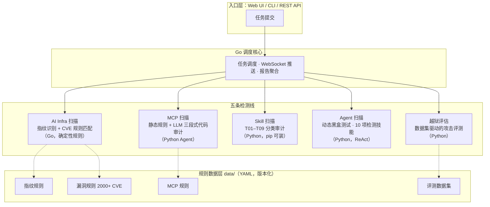

# AI-Infra-Guard：把 AI 红队测试从手工渗透变成一台可运维的平台

> 来源：GitHub 仓库 `github.com/Tencent/AI-Infra-Guard`（截至 2026-09-29 GMT+8：6,629 stars / 619 forks / 41 open issues / v4.6.2 / Apache-2.0 / 最近 push 2026-09-28）。
>
> 本文基于仓库 `README.md` + 目录结构 + GitHub API 元数据实查整合而成。

大模型落地的安全问题，近两年正在从「模型会不会说错话」转移到「围着模型转的一圈基础设施会不会被打穿」。Ollama 未授权访问、vLLM 的 RCE、n8n 的工作流漏洞、MCP Server 里藏着的工具投毒、Agent Skill 里的远控脚本——这些风险散落在五六个不同的技术层面，过去要么靠安全团队手工渗透，要么靠四五款互不相通的工具各扫各的。腾讯朱雀实验室的 AI-Infra-Guard（下称 A.I.G）给出的答案，是把这五层风险收进同一个平台：基础设施漏洞扫描、MCP Server 扫描、Agent Skill 扫描、运行中 Agent 的动态黑盒测试、模型越狱评估，外加一个 API 中转检测器。

这个项目 2024 年 12 月 25 日创建，目前 6629 star、619 fork，Apache-2.0 协议，版本迭代到 v4.6.2（2026 年 9 月），登过 Black Hat Europe 2025 Arsenal。数字之外更值得看的是它的取舍：检测规则全部是版本化的 YAML 数据，LLM 只在规则覆盖不了的地方出场。这在满屏「AI 检测 AI」的宣传里，算得上一个冷静的设计。

## 一张图看清五条扫描线

A.I.G 容易被误解成一个「大而全的扫描器集合」，其实它内部是五条原理完全不同的检测线，再加上一套 Go 调度层把它们串起来：

五条线一句话分清：

| 检测线 | 测什么 | 怎么测 |
|---|---|---|
| AI Infra 扫描 | 运行中的 AI 服务 | 网络指纹识别 + 2000+ CVE 规则匹配 |
| MCP 扫描 | MCP Server 源码 | 正则预扫 + LLM 三段式代码审计 |
| Skill 扫描 | Agent Skill 项目 | LLM 多阶段审计，按 T01–T09 分类 |
| Agent 扫描 | 运行中的 Agent 平台 | 动态黑盒，10 项技能并行探测 |
| 越狱评估 | 你的模型本身 | 多轮攻击数据集 + 跨模型对比 |

## 机制拆分：五条线各自在干什么

### AI Infra 扫描：规则先行，确定性优先

这条线最「传统」，也最能看出项目的工程判断。它对目标发起网络探测，识别出「这是 Ollama 0.x 还是 vLLM 0.8」，然后用漏洞规则库匹配已知 CVE。规则库覆盖 146 个 AI 组件、2000 多条 CVE 规则，v4.6.2 又新增了 155 条，覆盖 LangFlow、n8n、PraisonAI、vLLM、llama-cpp、MLflow 等 40 多个组件。

关键在于：这条线完全不用 LLM。指纹是 YAML 规则，匹配是确定性逻辑，快且结果可复现。规则全部放在 `data/fingerprints/` 和 `data/vuln/` 目录下随仓库版本化，不编译进二进制——社区给一个新组件提指纹 PR，当天就能生效。

### MCP 扫描：静态规则打底，LLM 收尾

MCP（Model Context Protocol）Server 的安全问题光靠正则扫不出来：恶意逻辑可以藏在「描述文件说一套、代码干另一套」的缝隙里。A.I.G 的 mcp-scan 用了两层结构：先用正则预扫 14 类高危模式（`curl|bash`、云元数据访问、凭据窃取等），把命中结果注入 Agent 上下文；然后 LLM Agent 沿着「信息收集 → 代码审计 → 漏洞复核」三段流水线做深度审计。

结果按 MCP01–MCP10 十类专项风险分类，外加名称混淆、Rug Pull、工具遮蔽三个补充类别——「工具遮蔽」指的是重定义同名工具覆盖合法行为，这是 MCP 生态里 2025 年才被系统性研究的攻击面。CLI 模式默认输出 SARIF 2.1.0 JSON，可以直接进 GitHub Code Scanning，这条通路对 CI/CD 集成很重要。

它还有一个容易被忽略的能力：项目根目录如果有 `SKILL.md`，会自动触发「意图一致性审计」，比对声明文档和 `scripts/` 里的实际代码是不是一回事。声明说「整理文件」，代码却在拉远控脚本，这种藏在文档和实现缝隙里的攻击，纯规则扫描无能为力。

### Skill 扫描：给 Agent Skill 做安检的独立 CLI

`aig-skill-scan` 可以 `pip install` 单独使用，专门审 Agent Skill 项目（如 OpenClaw Skills）。漏洞分类对齐朱雀自建的 SkillTrustBench 基准，T01 到 T09 九类：指令劫持、记忆投毒、远程载荷执行、恶意代码、提权、持久化、工具劫持、不安全依赖、不安全编码。

它的流程设计有个务实细节：默认跑完代码审计后，只有当结论是 `suspicious`（有漏洞但无明确攻击意图）时才追加一轮裁决复核；`normal` 和 `malicious` 这两个明确结论直接走快速通道。这省掉的是最贵的那一步 LLM 调用。预扫阶段还会查 `.pyc` 字节码引用和字符集走私——v4.5.2 的更新日志里明确提到，这两类是针对绕过检测手段的对抗性修补。

### Agent 扫描：动态黑盒，十项技能并行

前三条线审的是代码和配置，Agent 扫描打的是活的系统。它通过 provider YAML 接入运行中的 Agent 平台（Dify、Coze、OpenAI 兼容接口、HTTP、WebSocket 等十余种），侦察 Agent 先摸清目标能力，然后十项检测技能并行开工，默认跑五项：数据泄露、工具滥用、间接提示注入、越权、Web 外传。每项都是构造恶意输入、观察响应、判断是否中招的完整攻击循环，最后统一映射到 OWASP ASI 标准。

仓库里自带两个「靶子 Agent」用于验证：一个是带 `web_fetch` 工具且无 URL 白名单的 Memory Heist Agent，一个是埋了 8 个弱点的客服 Agent。能被自家工具稳定打穿的靶子，也是用户校验扫描器是否正常工作的标尺。

### 越狱评估与 API 中转检测

越狱评估面向模型本身：配置目标模型的 API 端点，从数据集选择攻击方法打过去，支持 Many-Shot、PAIR、GOAT、ActorAttack 四种多轮攻击，输出跨模型安全对比。API 中转检测器是 v4.6.0 加入的新线，用多探针黑盒审计判断「你接的中转 API 是不是把你悄悄换成了别的模型，或者塞了后门」——针对的是模型供应环节的投毒风险。

## 一次任务怎么流过系统

以扫描一台内网 vLLM 推理服务为例。你在 Web UI 提交 `http://192.168.1.100:8000`，Go 后端建任务、推进度；指纹引擎对目标发探测请求，识别出组件是 vLLM 及其版本号；漏洞匹配器拿版本号去查 2000 多条规则，命中若干 CVE；报告层聚合出组件、版本、漏洞、严重等级、修复建议。整个过程没有 LLM 参与，指纹和规则匹配都是毫秒级的本地操作，扫描耗时主要花在网络探测上。

换一个场景：团队要引入一个第三方 MCP Server。提交 GitHub URL 后，Python Agent 拉源码，正则预扫先标出高危模式，三段流水线逐段推进，每一段的中间结论实时推到前端。如果审计发现 `SKILL.md` 声明与实现不符，报告里会单独列出隐藏行为。两条路径的差别体现了平台的分工哲学：确定性的事交给规则，语义性的事才交给 LLM。

## Benchmark 怎么看：SkillTrustBench 的三问

A.I.G 用 SkillTrustBench 评测 skill-scan 的检测质量，README 给出了五个模型的成绩：

| 模型 | F1 | Precision | Recall | FPR |
|---|---|---|---|---|
| Claude Opus 4.6 | 0.9848 | 0.9725 | 0.9974 | 0.0663 |
| GLM 5.1 | 0.9836 | 0.9701 | 0.9974 | 0.0723 |
| Gemini 3.5 Flash | 0.9792 | 0.9947 | 0.9641 | 0.0120 |
| Kimi 2.6 | 0.9780 | 0.9895 | 0.9667 | 0.0241 |
| DeepSeek v4 Flash | 0.9740 | 0.9868 | 0.9615 | 0.0301 |

这三个问题比数字本身重要：

**它测的是什么。** SkillTrustBench 是朱雀自建的 Agent Skill 安全基准，样本按 T01–T09 九类风险组织。测的是「用某个 LLM 驱动扫描时，能否正确区分恶意、可疑、正常三类 Skill」——注意被测对象是扫描器（及其背后的模型），不是 A.I.G 平台本身。

**数字差异反映什么。** F1 的高低主要反映驱动模型的判断力：Claude Opus 4.6 和 GLM 5.1 的 Recall 都到 0.9974，几乎不放走恶意样本；Gemini 3.5 Flash 的 FPR 只有 0.0120，误报最少但漏报相对多。这组数字实际上是帮你选驱动模型的决策表——安全团队厌恶漏报就选高 Recall 组合，厌恶误报淹没人就选低 FPR 组合。

**不能推出什么。** 不能推出「A.I.G 在真实生态的 Skill 上就是 98% 准确」——基准分布和真实分布不是一回事；也不能推出其他四条扫描线（Infra、MCP、Agent、越狱）有同等检测率，它们各有各的评测方式，且 Infra 扫描是规则匹配，不存在这类统计指标。另外要记住基准是官方自建的，数字由维护方自己报告。

## 部署与采用建议

部署是 Docker Compose 一条命令，4GB 内存、10GB 磁盘起，跑起来后访问 `http://localhost:8088`。有三点必须写进采用决策：

1. **不能暴露公网。** 官方明确定位是企业或个人内网使用的红队平台，目前没有鉴权机制。这不是小瑕疵，是使用前提。
2. **LLM 调用是持续成本。** Infra 扫描免费跑，但 MCP/Skill/Agent 扫描每一步都在消耗 LLM API 配额，扫描频率和模型选型直接决定账单。
3. **需要自带 API Key。** 所有 LLM 相关功能走 OpenAI 兼容接口，默认指向 OpenRouter，你可以换成本地或国产模型。

谁该先用：已经部署了 Ollama、vLLM、ComfyUI、Dify 这类组件的团队，AI Infra 扫描线零成本、纯规则，今天就能跑出第一份资产风险清单；正在构建 Agent 或引入第三方 MCP Server / Skill 的团队，MCP 和 Skill 扫描线可以直接嵌进 CI/CD（SARIF 输出原生对接 GitHub Code Scanning）。

谁可以等等：只调 API、不部署基础设施、也不自建 Agent 的轻量使用者，五条线里只有越狱评估和你相关，单独找评测工具或许更轻。

从 2024 年底的一个 Go 单文件扫描器，到今天 Go 调度核心加五个独立引擎的平台，A.I.G 的架构演进有一条清晰的主线：能用确定性规则解决的事，不让 LLM 出场；LLM 只在语义判断的地方介入，且每一步都有 SARIF、OWASP ASI 这样的标准出口。对一个安全工具来说，可解释、可复现、可进流水线，比任何「智能」标签都值钱。它不完美——无鉴权、依赖外部 LLM、部分基准自建自评——但作为目前覆盖面最完整的开源 AI 红队平台，值得进入每一个认真对待 AI 安全的团队的工具清单。

## 附：核心事实速查

- 项目：[Tencent/AI-Infra-Guard](https://github.com/Tencent/AI-Infra-Guard)，腾讯朱雀实验室（安全平台部）
- 协议：Apache-2.0（含归属条款：集成须注明来源）；主语言 Python，调度核心 Go
- 创建：2024-12-25；当前 6629 star / 619 fork / 41 open issues；最近 push 2026-09-28
- 版本：v4.6.2（2026-09-17）
- 漏洞库：146 个 AI 组件，2000+ CVE 规则
- 部署：`docker-compose -f docker-compose.images.yml up -d` → `http://localhost:8088`；无鉴权，禁止公网
- 相关研究：Black Hat Europe 2025 Arsenal、FORGE-Bench、RogueHandoff-20、SkillJack
