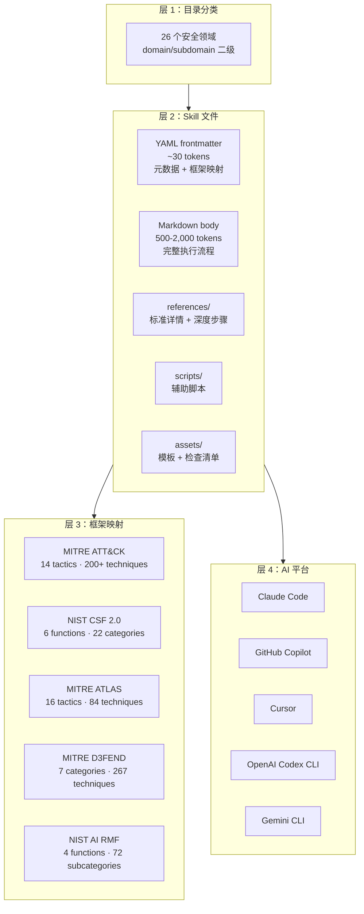

一个初级安全分析师知道怎么用 Volatility3 分析可疑内存 dump，知道哪条 Sigma 规则能检测 Kerberoasting，知道怎么跨云服务商做入侵范围评估。**大多数 AI 智能体不知道——除非你把这些技能给它。**

Anthropic Cybersecurity Skills（6.9k stars，Apache 2.0）就是做这件事的。754 个结构化技能，覆盖 26 个安全领域，每个技能都映射到 MITRE ATT&CK、NIST CSF 2.0、MITRE ATLAS、D3FEND 和 NIST AI RMF 五大框架，遵循 agentskills.io 开放标准。可以直接插到 Claude Code、Copilot 和 Cursor 里使用。

下面从三个维度把这套技能库拆开：

1. 渐进式加载机制是怎么设计的——为什么 frontmatter 约 30 tokens、完整 workflow 约 500-2,000 tokens，这个比例来自 context 窗口的硬约束，不是拍脑袋定的
2. 五框架映射的设计意图——一个技能同时映射五个框架，对企业的合规审计意味着什么
3. 在实际 DFIR 场景中，AI 是如何从 754 个 skill 里找到正确的几个并执行的

## 系统地图：四层结构



| 层级 | 内容 | 设计意图 |
| ---- | ---- | ---- |
| 目录分类 | `domain/subdomain` 二级，26 个领域 | 按技能类型组织，AI 扫描时先定位领域 |
| Skill 文件 | `SKILL.md` + `references/` + `scripts/` + `assets/` | 渐进式加载：先读 frontmatter，再决定是否加载完整文件 |
| 框架映射 | 五个框架的对照关系 | 一个技能同时满足多个合规方向 |
| AI 平台 | Claude Code、Copilot、Cursor 等 | 通过 agentskills.io 标准统一接入 |

## 核心设计决策

### 决策一：渐进式加载——为什么 frontmatter 和 body 必须分开

每个 Skill 的 frontmatter 约 30 tokens，完整 workflow 约 500-2,000 tokens。这个比例不是拍脑袋定的：

```yaml
---
name: performing-memory-forensics-with-volatility3
description: >-
  Analyze memory dumps to extract running processes, network connections,
  injected code, and malware artifacts using the Volatility3 framework.
domain: cybersecurity
subdomain: digital-forensics
tags: [forensics, memory-analysis, volatility3, incident-response, dfir]
atlas_techniques: [AML.T0047]
d3fend_techniques: [D3-MA, D3-PSMD]
nist_ai_rmf: [MEASURE-2.6]
nist_csf: [DE.CM-01, RS.AN-03]
version: "1.2"
author: mukul975
---
```

30 tokens 意味着：AI 可以在单次 context 窗口内扫描全部 754 个 skill 的 frontmatter（约 754 × 30 = 22,620 tokens），找到相关项后，再只加载匹配的那几个完整 skill。

如果 frontmatter 和 body 不分开，全部 754 个 skill 的完整内容约 754 × 1,000（取中值）= 754,000 tokens——远超当前任何 LLM 的 context 窗口。

这个设计不是"让文件更整洁"，而是**让 AI 有能力在全部技能库中做一次全量扫描，再精准加载**。没有渐进式加载，AI 只能随机抽样或按目录猜测，准确率会大幅下降。

### 决策二：五框架映射——一个技能，五个合规方向

同一个技能，同时映射到五个不同框架。以 `analyzing-network-traffic-of-malware` 为例：

| 框架 | 映射 | 含义 |
| ---- | ---- | ---- |
| MITRE ATT&CK | T1071 | 应用层协议（攻击者视角） |
| NIST CSF 2.0 | DE.CM | 持续监控（防御治理视角） |
| MITRE ATLAS | AML.T0047 | ML 威胁指标（AI 安全视角） |
| MITRE D3FEND | D3-NTA | 网络流量分析（防御对策视角） |
| NIST AI RMF | MEASURE-2.6 | AI 度量（AI 风险管理视角） |

对企业的实际影响：**一个 skill 直接覆盖多个合规检查项，不需要分别维护五套独立的映射表。** 审计时，从"网络流量分析"这个能力出发，可以同时出具 ATT&CK 覆盖率、NIST CSF 合规度和 AI RMF 度量——三个维度共用同一份执行记录。

### 决策三：为什么是 agentskills.io 标准而不是自己定义格式

agentskills.io 是一个开放的 Skill 定义标准，规定了 YAML frontmatter 的字段结构、文件目录布局和渐进式加载约定。选择这个标准而不是自己定义格式，带来的收益是跨平台兼容：

- 同一个 skill 可以在 Claude Code、Copilot、Cursor、Codex CLI、Gemini CLI 上使用
- 不需要为每个平台维护一套格式转换
- 社区贡献的 skill 可以互操作

## 26 个安全领域覆盖策略

覆盖范围按技能数量排序（前十）：

| 领域 | 技能数 | 代表能力 | 为什么排前面 |
| ---- | ---- | ---- | ---- |
| 云安全 | 60 | AWS/Azure/GCP 加固、CSPM、云取证 | 云安全是当前企业安全投入最大的方向 |
| 威胁狩猎 | 55 | 假设驱动狩猎、LOTL 检测、行为分析 | 从被动防御到主动狩猎的转变 |
| 威胁情报 | 50 | STIX/TAXII、MISP、feed 集成、攻击者画像 | 情报驱动安全的基础设施 |
| Web 应用安全 | 42 | OWASP Top 10、SQLi、XSS、SSRF | 最常见的攻击面 |
| 网络安全 | 40 | IDS/IPS、防火墙规则、VLAN、流量分析 | 网络层仍然是第一道防线 |
| 恶意软件分析 | 39 | 静态/动态分析、逆向工程、沙箱 | 恶意软件数量持续增长 |
| 数字取证 | 37 | 磁盘镜像、内存取证、时间线重构 | 事件响应的核心能力 |
| 安全运营 | 36 | SIEM 关联、日志分析、告警分诊 | SOC 日常运营的基础 |

技能数量分布与行业投入直接对应——云安全（企业上云加速）、威胁狩猎（从被动防御向主动检测转型）和威胁情报（情报驱动的 SOAR 闭环）占据前三，各自对应明确的市场驱动力。

## 一次真实 DFIR 分析：AI 如何使用这些技能

以"分析内存 dump 中的凭证窃取"为例。这是一个典型的 DFIR 场景：收到一个可疑的内存 dump，需要判断是否有凭证窃取行为。

```
1. AI 扫描全部 754 个 frontmatter（~22,620 tokens）
   匹配标签：memory-analysis、dfir、credential-access

2. 加载 top 3 匹配技能（~3,000 tokens）：
   - performing-memory-forensics-with-volatility3
   - hunting-for-lsass-credential-dumping
   - windows-event-log-analysis-for-credential-access

3. 按 workflow 步骤执行：
   - 运行 Volatility3 插件：windows.psscan、windows.netscan、windows.malfind
   - 检查 LSASS 进程访问模式（检测 Mimikatz 类工具）
   - 关联 Windows 安全事件日志（Event ID 10、4625、4672）

4. 验证结果：
   - 确认可疑进程访问了 LSASS
   - 内存中发现注入代码
   - 事件日志中检测到异常登录尝试
   - 映射到 ATT&CK T1003（OS Credential Dumping）

5. 输出报告：按 Skill 模板生成结构化 DFIR 报告
```

没有这些技能，AI 会猜 Volatility3 命令、漏掉关键步骤（比如忘记检查 LSASS 访问模式）。有了这些技能，AI 遵循的是资深 DFIR 分析师同款 playbook——每一步都有明确的输入、输出和验证标准。

## 与现有安全工具的位置关系

| 维度 | 传统工具（Volatility、Sigma、YARA） | 本项目 |
| ---- | ---- | ---- |
| 交付物 | 命令行工具 / 规则文件 / 特征库 | 结构化执行流程 + 框架映射 |
| 使用者 | 安全工程师手动操作 | AI 智能体按 playbook 自动执行 |
| 文档化 | 工具文档散落，playbook 缺失 | 每个 skill 内置完整 step-by-step |
| 框架映射 | 单独维护，需要人工对照 | 技能自带五框架映射 |
| 可组合性 | 工具之间需要手动串联 | Skill 之间通过标签和框架映射自动关联 |

这个项目不是替代 Volatility3 或 Sigma——它是在这些工具之上加了一层"AI 可执行的 playbook"。工具还是那些工具，但 AI 不再需要猜"该用哪个工具、参数怎么传、结果怎么解读"。

## 安装与使用

```bash
# 推荐：npx 一键安装
npx skills add mukul975/Anthropic-Cybersecurity-Skills

# 或者 Git clone
git clone https://github.com/mukul975/Anthropic-Cybersecurity-Skills.git
cd Anthropic-Cybersecurity-Skills
```

支持平台：Claude Code、GitHub Copilot、OpenAI Codex CLI、Cursor、Gemini CLI，以及任何兼容 agentskills.io 标准的平台。

## 谁该用，谁该等

**直接用的场景**：

- 正在构建 AI 安全智能体或自动化分析流水线——754 个 skill 直接作为可执行知识库
- 有合规需求的企业——五框架映射让一个 skill 同时覆盖多个合规方向
- 需要快速让 LLM 具备 DFIR、威胁狩猎、恶意软件分析能力——不需要从零写 playbook
- 安全团队想用 AI 做一线分诊——AI 按 skill 执行标准化分析，人工只做二次确认

**可以先等的场景**：

- 只需要 IOC 列表或简单检测规则——现有开源规则库（Sigma、YARA 社区）够用
- 团队没有 AI Agent 开发能力——skill 需要 AI 来执行，不是给人读的操作手册
- 安全分析完全依赖人工，自动化场景有限——这个项目的价值在于 AI 自动化，不是人工参考

## 自测清单

- [ ] 能解释渐进式加载的设计：frontmatter ~30 tokens 用于全量扫描，body ~500-2,000 tokens 用于精准加载
- [ ] 知道五框架映射的工程价值：一个 skill 同时覆盖 MITRE ATT&CK、NIST CSF、ATLAS、D3FEND 和 AI RMF
- [ ] 理解 agentskills.io 标准的意义：跨平台兼容，不需要为每个 AI 平台维护一套格式
- [ ] 能描述一次完整的 DFIR 分析流程：从扫描 754 个 frontmatter 到输出结构化报告
- [ ] 知道这个项目不是替代 Volatility3/Sigma/YARA，而是在它们之上加了一层 AI 可执行的 playbook

## 结论

Anthropic Cybersecurity Skills 解决的问题很具体：AI 在安全分析中缺乏可执行的操作指引——它知道工具的存在，但不知道面对一个内存 dump 时该先跑哪个插件、后检查什么证据、如何把结果映射到 ATT&CK 框架。754 个 skill 填补的就是这层 gap：每一步有明确的输入、输出和验证标准，每一个 skill 自带五框架映射，省去了安全团队从零编写和单独维护映射表的工作。

对于正在构建 AI 安全智能体的团队，这套技能库可以直接作为可执行知识库接入 Claude Code，开始跑分析。不需要自己写 754 个 playbook，不需要理解 agentskills.io 的字段规范后才能开始——clone 下来就能用。

> ⚠️ 社区项目声明：本项目是独立社区项目，与 Anthropic PBC 无附属关系。

## 参考资料

- [Anthropic Cybersecurity Skills GitHub](https://github.com/mukul975/Anthropic-Cybersecurity-Skills)
- [项目主页](https://mahipal.engineer/Anthropic-Cybersecurity-Skills/)
- [agentskills.io 标准](https://agentskills.io/)
- [MITRE ATT&CK](https://attack.mitre.org/)
- [NIST CSF 2.0](https://www.nist.gov/cyberframework)