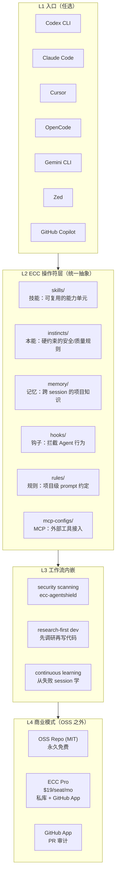
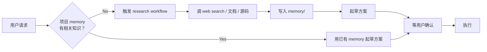

## 这篇文章在回答什么

affaan-m/ecc 是 2026 年 6 月 GitHub Trending 当日榜、当日新增 1,368 颗星。仓库自报数据是 **182K+ stars、28K+ forks、170+ contributors、12+ 语言生态**。

但跟其他 trending 项目不同——ecc 不是"一个工具"，是"一套操作符体系"。README 反复强调一个词：**harness-native**。

> The harness-native operator system for agentic work. Built from real-world multi-harness engineering workflows.
>
> Not just configs. A complete system: skills, instincts, memory optimization, continuous learning, security scanning, and research-first development.

它兼容 **Codex、Claude Code、Cursor、OpenCode、Gemini、Zed、GitHub Copilot** 七个主流 AI 编码 harness——意味着同一套操作符语义，在不同 Agent 框架下都能跑。

这篇文章回答三个问题：

- "harness-native" 到底是什么意思——为什么 ecc 不直接做"另一个 Agent"，而要做"跨 Agent 的操作符"
- skills / instincts / memory / hooks / rules / MCP 这套六层操作符体系怎么协同工作
- "research-first development" 跟"先写代码再补测试"的工程文化差异是什么，ecc 怎么把这种文化固化进工具链

## 系统地图：六层操作符体系

ecc 不是一个应用，是一个**跨 harness 的操作符层**。它的代码组织方式是「按操作符类型分包」，而不是「按应用功能分包」：



| 操作符层 | 解决的问题 | 跨 harness 怎么统一 |
| -------- | ---------- | ------------------- |
| skills/ | "这个项目需要哪些专用能力" | 文件格式统一，调用接口因 harness 而异 |
| instincts/ | "什么绝对不能做" | 编译期/运行期硬约束，绕过即报警 |
| memory/ | "上次这个项目踩过什么坑" | 项目级 .ecc/memory/ 目录，所有 harness 共享 |
| hooks/ | "在 Agent 行动 X 前先做 Y" | 通过各 harness 的 hook 适配层实现 |
| rules/ | "这个项目的代码风格约定" | 编译为各 harness 的 system prompt 片段 |
| mcp-configs/ | "Agent 能调哪些外部工具" | 标准 MCP 协议，跨 harness 通用 |

## "harness-native" 的真正含义

仓库原话：

> ECC is the harness-native operator system for agentic work.

"harness-native" 这个词不是营销话术，它在表达一个具体的设计判断：

**不替代 Agent，做 Agent 之上的"操作符"**

类比一下：Kubernetes 不替代 Docker，它做的是 "container orchestrator"。ecc 不替代 Claude Code / Cursor / Codex，它做的是 "agentic work orchestrator"。

这意味着：

1. **不需要"迁移到 ecc"**——你继续用你习惯的 harness，ecc 在上面叠加操作符
2. **不被任何 harness 锁定**——Claude Code 涨价了？换 Cursor，操作符层一行不改
3. **操作符可移植**——在这个项目写的 skill，可以原样带到下一个项目

这是 ecc 跟"另一个 Agent"类项目（Hermes Agent、Sim Studio 等）的根本定位差异。

## Skills vs Instincts vs Memory：三层操作符的语义差异

ecc 把 Agent 需要的"非代码知识"分成三个互不重叠的层：

```yaml
# skills/：可复用的能力（什么时候主动调用）
skill:
  name: "add-typescript-strict-mode"
  trigger: "用户要求为 TS 项目加 strict mode"
  steps:
    - 修改 tsconfig.json
    - 修复所有隐式 any 报错
    - 跑 tsc --noEmit 验证

# instincts/：硬约束（永远不能违反）
instinct:
  name: "no-secrets-in-commits"
  trigger: "git commit 前"
  action: "扫描暂存区，禁止任何 .env / *.key / AWS_* 提交"

# memory/：跨 session 的项目知识
memory:
  - "这个项目用 pnpm 而不是 npm"
  - "数据库迁移必须先写 down 再写 up"
  - "PR 必须引用 issue 编号"
```

三层差异：

- **skills 是 "how"**：怎么完成任务，可以被禁用、修改、覆盖
- **instincts 是 "never"**：永远不能做，绕过需要显式 override
- **memory 是 "what"**：关于这个项目的事实，不会被 Agent 主动调用，但 recall 时会自动浮现

这跟 hermes-agent 的"learning loop"、sim-studio 的"block registry"、claude-code 的"subagent"是**完全不同的设计哲学**——ecc 不做"聪明的 Agent"，做"可靠的工程纪律"。

## research-first development 怎么固化进工具链

ecc 强调的一个工作流是 **research-first development**——在写代码前先做调研。这听起来像"多查文档"，但 ecc 用工具链强制：



关键设计：**调研结果必须先落 memory/，再起方案**。这意味着：

- 同一个项目的调研结果不会重复做
- 下次换 harness 接手时，调研积累保留
- memory/ 目录可以提交到 Git 做团队共享

## 兼容性矩阵：七个 Harness 怎么适配

ecc 支持 7 个 harness，但每个 harness 的能力面、工具调用接口、配置文件位置都不一样。ecc 用**适配器模式**统一：

| Harness | 配置位置 | ECC 适配器 |
| ------- | -------- | --------- |
| Claude Code | `~/.claude/` | `adapters/claude-code/` |
| Cursor | `.cursor/` | `adapters/cursor/` |
| Codex | `~/.codex/` | `adapters/codex/` |
| OpenCode | `~/.config/opencode/` | `adapters/opencode/` |
| Gemini CLI | `~/.gemini/` | `adapters/gemini/` |
| Zed | `.zed/` | `adapters/zed/` |
| GitHub Copilot | `.github/` | `adapters/copilot/` |

每个适配器做三件事：

1. 把 `skills/` 编译成该 harness 能识别的格式
2. 把 `instincts/` 翻译成该 harness 的 hook / pre-tool-use 规则
3. 把 `memory/` 注入到该 harness 的 system prompt 上下文

## 安全：ecc-agentshield

ecc 的安全不是"git push 前扫一下 secrets"那种事后的检查，是**操作符层内置的安全本能**：

- `instincts/no-destructive-rm.md`：禁止 Agent 跑 `rm -rf` 未经确认
- `instincts/no-secret-commit.md`：禁止提交任何带 secret pattern 的文件
- `instincts/no-unreviewed-db-migration.md`：数据库迁移必须人工 review
- `mcp-configs/restricted-browser.md`：限制 Agent 浏览器访问的域名

这套本能是**编译进操作符层的硬约束**，不是 prompt 里的"请谨慎操作"。

## 商业模式：OSS + Pro

ecc 的商业模式很有趣：

- **OSS 仓库本身 MIT 永久免费**
- **ECC Pro** $19/seat/mo：私库 + GitHub App + 团队协作
- **GitHub App**：免费层 + 付费层，专注 PR 审计

README 强调："OSS stays free. This repo is MIT-licensed forever."——和很多"开源但核心功能付费"的项目不同，ecc 的所有核心操作符都开源。

## 总结

ecc 不是"又一个 AI Agent"。它做的是一件更底层的事：

**在 Agent 之上建一层"工程纪律操作符"**

- 不替代 harness，做 harness 之上的统一抽象
- skills/instincts/memory 三层把"非代码知识"分得清清楚楚
- 跨 7 个主流 harness 可移植，反锁定
- research-first、security-first 的工作流内嵌进工具链

它适合谁：需要在多个 AI Agent 框架间切换、关心工程纪律而不是 Agent 智能、想把团队的最佳实践沉淀成可执行规则而不是 prompt 的人。

项目地址：<https://github.com/affaan-m/ecc>
官方站点：<https://ecc.tools/>
Hermes 集成：<https://github.com/affaan-m/ecc/blob/main/docs/HERMES-SETUP.md>
架构文档：<https://github.com/affaan-m/ecc/blob/main/docs/architecture/cross-harness.md>
