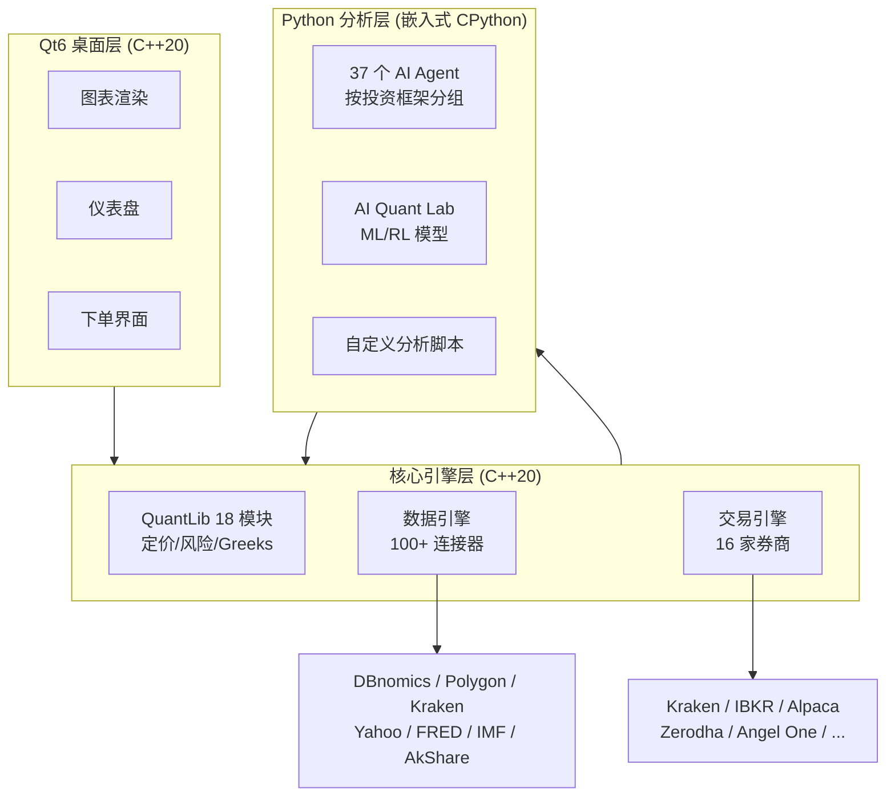

## 这篇文章在回答什么

FinceptTerminal 目前 22k+ stars，1300+ forks，v4.0.3。从 GitHub 数字看，它是金融科技领域最活跃的开源项目之一。但如果你只看到"开源 Bloomberg 替代品"这个标签，会错过它真正有意思的部分——**一套 C++20 + Qt6 + 内嵌 Python 的混合架构，是怎么在保证原生桌面性能的同时，把 QuantLib 的 18 个量化模块、37 个 AI Agent 和 100+ 数据连接器接到一起的。**

这篇文章回答三个问题：

1. 为什么选 C++/Qt6 做 UI 而不是 Electron——在金融场景下，这个选择解决了什么实际问题
2. 内嵌 Python 引擎是怎么和 C++ 层通信的，这种混合架构的边界在哪里
3. 37 个 AI Agent 的分组策略——为什么按投资框架而不是按模型分组，以及这种分组对策略回测意味着什么

## 系统地图：混合架构的分层

FinceptTerminal 的架构不是单进程应用。它由三层运行时组成，各层通过明确的边界通信。



| 层级 | 运行时 | 负责什么 | 为什么必须用这个语言 |
| ---- | ---- | ---- | ---- |
| UI 层 | C++20 + Qt6 | 原生桌面渲染、图表、下单界面 | 金融终端对渲染延迟敏感，Electron 的额外内存和启动时间不可接受 |
| 核心引擎 | C++20 | QuantLib 定价、风险计算、数据连接、交易执行 | QuantLib 是 C++ 库，直接调用比跨语言桥接快一个数量级 |
| 分析层 | 嵌入式 CPython 3.11+ | AI Agent、ML 模型、自定义分析脚本 | Python 拥有最完整的量化分析和 AI 生态，没必要用 C++ 重写 |

## 核心架构决策

### 决策一：为什么不用 Electron

金融终端和普通桌面应用有几个关键差异：

1. **渲染延迟敏感**：实时行情图表需要 60fps 刷新，Web 技术栈在这个场景下很难保证稳定帧率
2. **内存占用敏感**：Bloomberg 用户的典型工作台同时开着 4-8 个窗口，Electron 每个窗口独立进程，内存占用线性增长
3. **计算密集型**：QuantLib 的期权定价、Monte Carlo 模拟、VaR 计算需要原生性能，通过 WebAssembly 或 Node.js binding 都会引入额外开销

Qt6 在金融场景下还有一个独特的优势：**QCustomPlot 和 Qt Charts 是金融行业图表的事实标准**，从 Bloomberg 到 Interactive Brokers 的 TWS 都在用。选 Qt6 意味着直接复用这个成熟的图表生态。

### 决策二：内嵌 Python 的通信边界

FinceptTerminal 不是把 Python 脚本通过 subprocess 调用——它内嵌了 CPython 解释器。这意味着 C++ 和 Python 共享同一个进程空间，数据通过 Python C API 直接传递，不需要序列化/反序列化。

通信边界定义在：

- **C++ → Python**：传递市场数据 numpy 数组、交易信号、回测参数
- **Python → C++**：返回分析结果、AI Agent 建议、ML 模型预测
- **不跨边界**：UI 渲染永远在 C++ 侧，Python 永远不会直接操作 Qt Widget

这个边界很关键。如果让 Python 直接操作 UI，任何 Python 脚本的阻塞（比如等 API 响应）都会冻结整个界面。把 UI 和计算分离，UI 线程永远是响应的。

### 决策三：AI Agent 为什么按投资框架分组

37 个 Agent 不是按模型分组（OpenAI / Anthropic / Ollama），而是按投资框架：

| Agent 框架 | 代表人物 | 策略特征 | 适用市场 |
| ---- | ---- | ---- | ---- |
| 价值投资 | Buffett、Graham、Lynch、Munger、Klarman、Marks | 低估值 + 安全边际 + 长期持有 | 成熟市场大盘股 |
| 成长投资 | growth agents | PEG + 营收增速 | 科技/生物医药 |
| 宏观 | macroeconomic agents | Fed 政策 + 美债 + 汇率 | 外汇/大宗商品 |
| 地缘政治 | geopolitical agents | 供应链风险 + 制裁影响 | 能源/军工/半导体 |

这种分组的实际收益是：**回测时可以对同一只股票同时跑 6 个价值投资 Agent，看它们的判断分歧在哪里。** 如果 Buffett Agent 和 Graham Agent 都给出了买入信号，但 Munger Agent 给出了卖出——这个分歧本身就值得研究。

每个 Agent 底层可以切换不同的 LLM Provider（OpenAI、Anthropic、Gemini、Groq、DeepSeek、MiniMax、Ollama），但分析框架保持不变。支持 Ollama 本地部署意味着敏感的投资策略数据不出本地。

## 量化模块：QuantLib 18 个模块的 GUI 封装

QuantLib 是金融数学的工业标准库，但它一直是 C++ 命令行工具。FinceptTerminal 把它的 18 个模块封装成了 GUI 操作：

| 模块类别 | 覆盖内容 | 不需要写代码 |
| ---- | ---- | ---- |
| 定价 | 期权、可转债、利率衍生品 | 在 GUI 填参数，点击计算 |
| 风险 | VaR、CVaR、Greeks | 选组合，一键出风险报告 |
| 随机过程 | Black-Scholes、Heston、Hull-White | 选模型，调整参数 |
| 波动率 | 隐含波动率曲面、期限结构 | 可视化展示 |
| 固定收益 | 收益率曲线构建、久期/凸性 | 输入债券参数，自动计算 |

对没有 C++ 背景但懂金融的量化研究员来说，这个封装直接省掉了学 QuantLib API 的步骤。

## 数据层：100+ 连接器的设计

数据连接器覆盖四类来源：

| 类别 | 来源 | 数据类型 |
| ---- | ---- | ---- |
| 宏观经济 | IMF、World Bank、FRED、DBnomics | GDP、CPI、利率、失业率 |
| 股票 | Yahoo Finance、Polygon、AkShare | 行情、财报、基本面 |
| 加密货币 | Kraken、Polygon | 实时 WebSocket 行情 |
| 另类数据 | Adanos 情绪数据 | 供应链、舆情 |

所有连接器通过统一的数据引擎接口接入，新加一个数据源不需要改动 UI 层或分析层。数据引擎负责缓存、格式转换和错误重试。

## 交易层：16 家券商的一键接入

交易引擎对接了 16 家券商，覆盖三类：

- **国际券商**：IBKR、Alpaca、Tradier、Saxo
- **印度券商**：Zerodha、Angel One、Upstox、Fyers、Dhan、Groww、Kotak、IIFL、5paisa、AliceBlue、Shoonya、Motilal
- **加密货币**：Kraken + HyperLiquid WebSocket

Paper Trading 引擎（模拟盘）是独立的一层，所有策略可以先在模拟盘上验证，再切换到实盘。Paper Trading 和实盘用同一套 API 接口，切换只需要改一个配置项。

## AI Quant Lab：ML 层的架构

这是一个内置的机器学习量化实验室，运行在 Python 分析层：

- **分类模型**：预测涨跌方向
- **回归模型**：预测价格区间
- **时间序列**：ARIMA、LSTM 预测
- **因子发现**：自动化 alpha 因子挖掘
- **强化学习**：RL-based 组合优化

所有模型通过 Python 生态（scikit-learn、PyTorch、stable-baselines3）执行，结果在 Qt6 界面可视化。对没有 Quant 背景但有 Python 能力的投资者，这个 Lab 把量化分析的门槛从"先学 C++ 和 QuantLib API"降到了"写 Python 脚本"。

## 安装：一条命令从源码到运行

```bash
git clone https://github.com/Fincept-Corporation/FinceptTerminal.git
cd FinceptTerminal
chmod +x setup.sh && ./setup.sh
```

`setup.sh` 自动处理：编译器检查 → CMake 配置 → Qt6 依赖安装 → Python 依赖安装 → 编译 → 启动。Windows 上是两条 CMake 命令。

但这里有一个实际限制：从源码编译需要 C++20 编译器（GCC 11+、Clang 14+、MSVC 2022+）和 Qt6 开发库。如果你的系统没有预装这些，setup.sh 会尝试自动安装，但在某些 Linux 发行版上可能失败。预编译安装包（Windows/macOS ARM/Linux）是更稳的选择。

## 和 Bloomberg / TradingView 的定位差异

| 维度 | Bloomberg Terminal | TradingView | FinceptTerminal |
| ---- | ---- | ---- | ---- |
| 价格 | $2,000+/月 | $100+/月 | 免费开源 |
| 平台 | 专有硬件 + 软件 | Web/桌面 | Windows/Linux/macOS ARM |
| AI Agent | 无 | 无 | 37 个按投资框架分组 |
| 数据独特性 | 独家（新闻、机构数据） | 付费数据 | 100+ 免费连接器 |
| 算法交易 | IBKR 桥接 | 无 | 16 家券商 + Paper Trading |
| 源码 | 不公开 | 不公开 | AGPL-3.0 |
| 离线能力 | 需要专线 | 需要网络 | 本地运行，数据可离线 |

FinceptTerminal 不是在和 Bloomberg 抢机构客户——Bloomberg 的独家数据、新闻终端和 IB 聊天系统是它的护城河。FinceptTerminal 真正替代的是：**个人投资者和中小型基金花 $2,000/月买 Bloomberg 只是为了看数据和做基础分析的那部分需求。**

## 谁该用，谁该等

**直接上手的场景**：

- 个人投资者或小型基金，不想付 Bloomberg 订阅费但需要专业级分析工具
- Python 量化研究者，需要 GUI 而不只是 Jupyter Notebook——特别是需要同时看图表、跑回测、调参数
- 价值投资者，想把 Buffett/Graham 的框架系统化，对比不同流派对同一只股票的看法
- 需要本地运行的金融终端（数据不出本地，策略代码不上云）

**可以先等的场景**：

- 只需要 K 线和基础技术指标——TradingView 更轻量且开箱即用
- 依赖 Bloomberg 独家数据（新闻终端、机构级数据覆盖、IB 聊天）
- 团队没有 Linux/macOS 桌面开发维护能力——预编译包可用，但从源码编译有门槛

## 自测清单

- [ ] 能解释 FinceptTerminal 的三层架构：C++ UI 层、C++ 核心引擎层、Python 分析层各自的职责
- [ ] 知道为什么金融终端选 Qt6 而不是 Electron——渲染延迟、内存占用、QuantLib 原生调用三个原因
- [ ] 理解内嵌 CPython 的通信边界：什么数据跨边界传递，什么永远不跨边界
- [ ] 能说清楚 AI Agent 按投资框架分组而不是按模型分组的原因
- [ ] 知道 Paper Trading 和实盘用同一套 API 接口，切换只需要改配置项
- [ ] 能判断自己的场景该用 FinceptTerminal 还是 TradingView 还是 Bloomberg

## 结论

FinceptTerminal 的架构最值得关注的地方，不是它集成了多少家券商、接入了多少数据源。而是它在 C++ 和 Python 之间划的那条线：UI 和核心计算留在 C++ 侧，保证原生性能和渲染稳定；分析和 AI 放在 Python 侧，复用最完整的量化生态。这条线画清楚了，两边的优势都能发挥；画不清楚，就会出现"Python 脚本阻塞 UI 线程"或"C++ 重写 ML 模型"的尴尬。

对个人投资者和中小型基金来说，这套架构提供了一个可参考的范式：**不用在"原生性能"和"AI 生态"之间二选一，用混合架构两个都要。**

## 参考资料

- [FinceptTerminal GitHub](https://github.com/Fincept-Corporation/FinceptTerminal)
- [QuantLib 官方文档](https://www.quantlib.org/)
- [Qt6 文档](https://doc.qt.io/qt-6/)