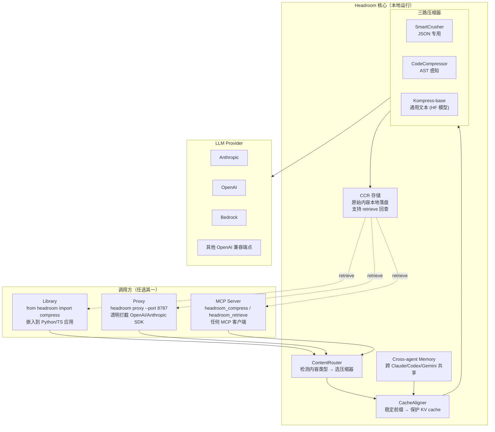

## 这篇文章在回答什么

Headroom 是 2026 年 6 月 GitHub Trending 当日榜第二、当日新增 2,503 颗星的项目。它做的事情看起来简单：**在 Agent 调 LLM 之前，把 prompt 里的工具输出、日志、RAG chunks、文件内容压一压，60-95% token 砍掉，答案不变。**

但这件事如果只是"调一个 LLM 总结文本"，那不稀奇。Headroom 真正有意思的是它把"压缩"做成了一个独立的工程层：

1. **可逆压缩（CCR）**：原始内容从不删除，LLM 觉得信息不够可以调 `headroom_retrieve` 拉回来——压缩不是有损截断，是「先压后取」
2. **CacheAligner**：刻意稳定 prompt 前缀，让 Anthropic/OpenAI 的 KV cache 真的能命中——压缩如果把 cache 命中率打没了，token 省了但延迟没省
3. **三种接入形态**：library（嵌入代码）、proxy（零代码改动）、MCP server（任何 MCP 客户端）——同一份压缩逻辑，三种部署方式

这篇文章不写"用 Headroom 能省多少 token"（README 有真实截图），它回答三个工程问题：

- ContentRouter 怎么判断"这段该走哪个压缩器"——JSON、代码、纯文本三路分发的判断信号是什么
- CacheAligner 为什么是"压缩层里最容易被忽略但最值钱的一环"——它解决了 LLM 成本结构里的什么隐性税
- CCR 的可逆存储和"先压缩后取回"的语义为什么不是"再调一次 LLM 总结"——它对长任务 Agent 的 context 预算意味着什么

## 系统地图：压缩层的三个接入面

Headroom 不强迫用户选一种接入方式。同一个压缩内核，通过三种外壳暴露：



| 接入形态 | 适用场景 | 代码改动 |
| -------- | -------- | -------- |
| Library | 已经在写自己的 Agent 框架，要精确控制压缩时机 | 1 行 import，调用 `compress(messages)` |
| Proxy | 不想改任何应用代码，让 SDK 走代理 | 改环境变量 `OPENAI_BASE_URL` 指向 8787 |
| MCP | 用 Claude Desktop / Cursor 等 MCP 客户端 | 在 `mcp.json` 加一行 server 配置 |
| `headroom wrap` | 包装现有 CLI 编码 Agent（claude/codex/cursor/copilot） | 1 条命令，自动接管 shell 调用链 |

## ContentRouter：内容类型分发的判断信号

Headroom 的 ContentRouter 不做"调用 LLM 总结"这种通用压缩。它对每段内容先做一次类型判断，再路由到三路专用压缩器：

| 内容类型 | 路由到 | 压缩原理 |
| -------- | ------ | -------- |
| JSON（tool output、API 响应） | SmartCrusher | 字段名哈希化、冗余键裁剪、数组采样、保留 schema |
| 源代码（Python/TS/Go/Java/Shell/Perl/Markdown） | CodeCompressor | AST 解析后保留函数签名 + 关键路径，省略注释和样板代码 |
| 自然语言（文档、对话、错误日志） | Kompress-base | 自研 8B 参数模型（HF: `chopratejas/kompress-base`），专门训练做"保意压缩" |

判断信号的细节（从仓库结构推断）：

- **JSON 检测**：尝试 `json.loads`，成功 + 顶层有 3+ 键 → SmartCrusher
- **代码检测**：文件扩展名 + shebang 行 + 大括号/缩进风格匹配 → CodeCompressor
- **fallback**：默认走 Kompress-base

这种分发的关键是：**不是所有内容都该用 LLM 总结**。JSON 工具输出压缩 95% 用规则就能做到，强行用 LLM 总结反而是浪费；源代码压缩 AST 比 LLM 精确得多；只有自然语言才真的需要模型。

## CacheAligner：压缩层里最容易被低估的一环

压缩 prompt 减少 token 是显性收益。但 LLM 的真实成本结构里还有一项隐性税：**KV cache 命中率**。

Anthropic 和 OpenAI 都对 prompt 前缀做 KV cache：相同的前缀会复用之前算好的 attention key/value，省掉重新计算的成本（账单上有 10× 差距）。但**任何对 prompt 前缀的修改都会让 cache 失效**。

Headroom 的 CacheAligner 解决的就是这个问题。它做两件事：

1. **稳定前缀**：把 system prompt、工具定义、历史消息摘要这些"不太变"的部分 hash 化，hash 相同就复用 cache slot
2. **延迟压缩**：只有真正变化的部分（比如新进来的工具输出）才被压缩，cache 命中的部分原样保留

这意味着：即使压缩了 90% 的 token，因为 cache 还在命中，**真实账单成本可能降到 1/20**。

## CCR：可逆压缩为什么不是"再总结一遍"

Headroom 的 CCR（Content-Code Reversible）是一个有意识的设计选择：**压缩后的内容不是 LLM 一次性消费的——它要可回查**。

```python
# 伪代码演示 CCR 的工作流
compressed = headroom.compress(tool_output_10000_tokens)  # 压成 1200 tokens
response = llm.complete(prompt + compressed)
if "I need more details on the error stack" in response:
    original = headroom.retrieve(compressed.ref_id)  # 拿回原始 10000 tokens
    response = llm.complete(prompt + original)
```

这跟"调一次 LLM 总结、再调一次 LLM 展开"的区别是：

- **保留精确信息**：原文一字不差落本地磁盘，retrieve 不需要再过模型
- **context 预算可控**：长任务 Agent 不会因为"怕漏信息"而把整段塞进 prompt
- **审计可追溯**：CCR 存储本身就是一个完整的事件日志

## Cross-agent Memory 与 `headroom learn`

Headroom 还做了两件延伸的事：

1. **Cross-agent Memory**：同一个项目里 Claude Code、Cursor、Codex 跑出来的关键决策，去重后共享——换 Agent 不丢上下文
2. **`headroom learn`**：扫描失败的 session，自动把"哪条命令错了、为什么错"写进 `CLAUDE.md` / `AGENTS.md`——Agent 越用越聪明

## 怎么用

```bash
# 装包
pip install "headroom-ai[all]"   # Python
npm install headroom-ai          # Node/TS

# 选一个接入方式
headroom wrap claude             # 包装编码 Agent
headroom proxy --port 8787       # 透明代理
from headroom import compress    # 嵌入代码

# 看效果
headroom perf
```

官方实测：10,144 tokens → 1,260 tokens（87.6% 压缩），LLM 找 FATAL 错误的结果完全一致。

## 总结

Headroom 不是一个 "AI 总结工具"——它是一个**独立的工程层**，把"Agent 上下文优化"这件事拆成：

- ContentRouter 做内容类型分发（不让 LLM 总结 JSON）
- 三路专用压缩器做实际压缩（规则 + AST + 专用模型）
- CacheAligner 保护 KV cache（让账单成本也降）
- CCR 让压缩可逆（不丢信息，精确可查）
- 三种接入形态让任何 Agent 都能用（library/proxy/MCP）

这套设计背后是一个清醒的判断：**Agent 时代，token 成本和 context 质量是两个独立的优化目标，需要分层解决**。

项目地址：<https://github.com/chopratejas/headroom>
文档：<https://headroom-docs.vercel.app/docs>
模型：<https://huggingface.co/chopratejas/kompress-base>
