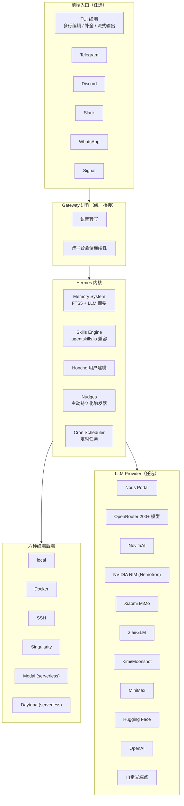

## 这篇文章在回答什么

Nous Research 的 Hermes Agent 是 2026 年 6 月 GitHub Trending 当日榜第一、当日新增 1,821 颗星。它和 Claude Code、Codex CLI、Cursor 这些编码 Agent 看起来都在做"终端里和 AI 对话、让它调用工具"这件事，但 Hermes 的核心差异化是 README 里反复出现的一个词：**closed learning loop（闭环学习循环）**。

> The only agent with a built-in learning loop — it creates skills from experience, improves them during use, nudges itself to persist knowledge, searches its own past conversations, and builds a deepening model of who you are across sessions.

这句话看起来像营销。但拆开看，Hermes 把"Agent 自我进化"拆成了五个可独立验证的子系统：

1. **Skill 自创与自改进**：复杂任务完成后自动沉淀 skill，skill 在使用中持续优化
2. **FTS5 会话检索 + LLM 摘要**：跨 session 召回历史对话
3. **Honcho dialectic 用户建模**：用一个第三方库做"关于用户的辩论式建模"
4. **Periodic memory nudges**：Agent 主动 push 自己把知识写盘
5. **agentskills.io 开放标准兼容**：skill 文件遵循一个可移植的开放规范

这篇文章回答三个问题：

- "Skill 自创自改进"具体怎么实现——是 LLM 写文件，还是有独立的 skill lifecycle manager
- 跨 session recall 怎么避免"找回来一堆过时信息"——FTS5 + LLM 摘要的过滤逻辑是什么
- 为什么 Hermes 要支持六种终端后端（local / Docker / SSH / Singularity / Modal / Daytona）——这个"运行在哪"的设计对 Agent 形态意味着什么

## 系统地图：Hermes 的核心子系统



| 关键能力 | 解决的实际问题 |
| -------- | -------------- |
| TUI + 6 个 IM 平台 + 单 Gateway | 一次配置，所有入口共享同一份 memory/skill/cron |
| FTS5 + LLM 摘要 recall | 不再是"刚聊过什么"的关键词匹配，而是"上次我们讨论 X 时的结论" |
| Honcho dialectic 建模 | 不是"用户喜欢 Python"，是"用户在 A 场景下选 X、在 B 场景下选 Y"的辩证画像 |
| 6 种 terminal backend | 同样的 hermes 命令，在笔记本/容器/远程 GPU 集群/serverless 上是同一份语义 |

## Closed Learning Loop：五个子系统的耦合关系

Hermes 跟 Claude Code 最大的区别不是 UI、不是工具集，是**它把"学习"做成了 Agent 运行时的一部分**。其他 Agent 的 memory 是外挂，Hermes 的 memory 是内核。

### 1. Skill 自创与自改进

```bash
# 实际工作流（伪代码）
user: "帮我把这份 CSV 转成 Parquet 并加 zstd 压缩"
agent: 执行 → 失败 → 调研 pyarrow 文档 → 重试 → 成功
# skill engine 检测到这是"复合任务 + 含试错"，自动沉淀：
skills/
  csv-to-parquet-zstd/
    SKILL.md          # 描述、触发条件、依赖
    script.py         # 实际脚本
    notes.md          # 试错中学到的踩坑
# 下次用户说"用上次那个方法转 CSV"，skill engine 直接命中
```

**关键设计**：skill 文件本身是**可读 markdown**，遵循 [agentskills.io](https://agentskills.io) 开放标准——意味着从其他 Agent 移植 skill 进来不需要重写。

### 2. FTS5 + LLM 摘要的跨 session recall

Hermes 不直接用向量数据库做 RAG。它走的是更便宜的路径：

- **FTS5**（SQLite 全文索引）做关键词 + 短语级匹配，速度快、成本低
- **LLM 摘要**只在召回后做"把多段历史压成一段"，不是"把所有历史都向量化"

这套组合的代价是：不能做语义级别的模糊召回。但对一个**用同一台机器、同一个用户、同一组任务**的个人 Agent 来说，FTS5 + 摘要的精度通常够用，而且**完全本地、不依赖向量数据库**。

### 3. Honcho dialectic 用户建模

Honcho（plastic-labs 出品）做了一件有意思的事：它不维护一个"用户画像 JSON"，而是维护一个**关于用户的多方观点**。

Hermes 集成 Honcho 后，Agent 对你的理解会演化：

- 早期："这个用户似乎在用 Python 做数据处理"
- 中期："他偏好 pandas 而不是 polars（基于历史选择）"
- 后期："他在 A 项目用 pandas，在 B 项目用 polars（不同场景不同选型）"

**辩证式建模**比单一画像更接近真实用户——人是矛盾的、会变的、在不同上下文里有不同偏好。

### 4. Periodic memory nudges

Agent 不会"自动记得一切"——它需要被**推一下**。

Hermes 的 nudges 子系统做这件事：在合适的时机（比如任务刚完成、用户刚说"先这样吧"、连续对话超过 N 轮），主动把当前上下文里的关键信息写进 memory，而不是等用户显式说"记一下"。

这模拟的是人脑的"短期记忆 → 长期记忆"巩固过程。

### 5. agentskills.io 开放标准

Hermes 不发明私有 skill 格式。它用 [agentskills.io](https://agentskills.io) 这个开放标准——意味着：

- 从 Claude Code、Cursor、其他 Agent 导出 skill，可以直接 import 到 Hermes
- Hermes 自创的 skill 也能 export 给其他 Agent
- skill 文件就是 markdown，**没有运行时锁定**

## 六种 Terminal Backend：为什么"在哪跑"是产品决策

Hermes 支持六种终端后端：local、Docker、SSH、Singularity、Modal、Daytona。

这看起来像运维花活，但实际是**产品形态决策**：

| Backend | 适用场景 | 关键收益 |
| ------- | -------- | -------- |
| local | 笔记本/工作站开发 | 最低延迟，直接访问本地文件 |
| Docker | 干净的复现环境 | 配置即代码，团队共享 |
| SSH | 远程 GPU 服务器 | 算力上云，UI 留在本地 |
| Singularity | HPC 集群 | 在超算上跑 AI Agent |
| Modal | serverless GPU | 按秒计费，闲时 0 成本 |
| Daytona | serverless dev env | 环境休眠，按需唤醒，几乎免费 |

特别是 **Modal** 和 **Daytona** 这两个 serverless 后端——它们的存在意味着 Hermes 可以"几乎免费"地常驻。

README 里说得很直白：

> Run it on a $5 VPS, a GPU cluster, or serverless infrastructure that costs nearly nothing when idle. It's not tied to your laptop — talk to it from Telegram while it works on a cloud VM.

这是 Hermes 跟 Claude Code 最大的产品形态差异：**Claude Code 是"开发者的本地工具"，Hermes 是"用户的常驻伙伴"**。

## Nous Portal：跳过 API Key 收集

Hermes 的另一层产品设计：**如果你不想自己收集 5 个不同 Provider 的 API Key，可以直接用 Nous Portal**。

```bash
hermes setup --portal
```

一行命令 OAuth 登录，Portal 自动接管 model、web search（Firecrawl）、image gen（FAL）、TTS（OpenAI）、cloud browser（Browser Use）——这些原本要 5 个 Key 5 个账号的事，现在一个订阅搞定。

300+ 模型 `hermes model` 切换，没有锁定。

## 安装

```bash
# Linux / macOS / WSL2
curl -fsSL https://hermes-agent.nousresearch.com/install.sh | bash

# Windows 原生 (PowerShell)
iex (irm https://hermes-agent.nousresearch.com/install.ps1)

# 启动
hermes
```

## 总结

Hermes Agent 不只是"又一个终端 Agent"。它在做一件 Anthropic、OpenAI 这些大厂没空做的事：**把 Agent 跑成"用户的常驻伙伴"而不是"开发者的临时工具"**。

三个最有意思的设计决策：

1. **Closed learning loop 是一等公民**：memory、skill、nudges、Honcho 不是外挂，是内核
2. **Serverless backend 默认化**：Modal/Daytona 让 Agent 闲时几乎免费，醒时按需拉起
3. **agentskills.io 开放标准**：skill 文件就是 markdown，跨 Agent 可移植，反锁定

它适合谁：每天跟 AI 协作超过 2 小时、觉得"每次都要重新教 AI 我是谁"很烦、希望 Agent 越用越懂你而不是每次都重置的人。

项目地址：<https://github.com/NousResearch/hermes-agent>
文档：<https://hermes-agent.nousresearch.com/docs/>
中文 README：<https://github.com/NousResearch/hermes-agent/blob/main/README.zh-CN.md>
