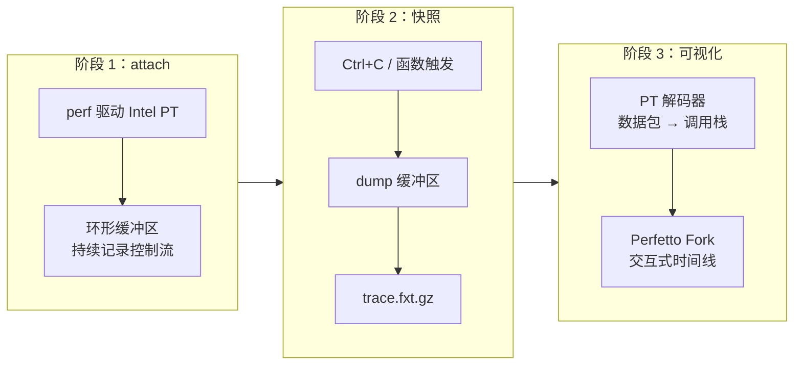

## 这篇文章在回答什么

magic-trace 是 Jane Street 开源的进程追踪工具，5.6k stars，MIT 许可证。它解决的问题一句话就能说清楚：**传统 `perf` 只能采样，magic-trace 能给你完整控制流。**

但这句话背后藏着一套复杂的硬件链路：Intel Processor Trace 持续记录处理器分支 → 环形缓冲区缓存 → 触发时 dump → 解码为 FXT 格式 → Perfetto 渲染为交互式时间线。每一步都有工程取舍。

这篇文章回答三个问题：

1. Intel PT 到底是怎么在 40ns 精度下记录完整控制流的——硬件原理和它的极限
2. 环形缓冲区 + 触发快照的设计为什么比"持续写到磁盘"更合理
3. 从 PT 数据包到可读调用栈的解码过程，为什么这块是 magic-trace 最复杂的部分

## 系统地图：三阶段工作流



| 阶段 | 做什么 | 关键产物 | 开销 |
| ---- | ---- | ---- | ---- |
| attach | 用 `perf` 驱动 Intel PT，开始记录控制流到环形缓冲区 | 进程 attach 成功 | 2%-10% |
| 快照 | 收到 Ctrl+C 或触发条件时 dump 缓冲区 | `trace.fxt.gz` 文件 | 触发时 ~10μs |
| 可视化 | PT 解码器将数据包还原为调用栈，Perfetto 渲染 | 交互式时间线 | 浏览器本地完成 |

## Intel PT 的硬件原理：为什么能到 40ns

Intel PT 不是采样。它是 Intel 处理器内置的硬件追踪单元，位于每个物理核心上。它的工作方式：

1. **持续记录分支**：每当处理器遇到条件跳转、间接调用、返回、中断等控制流变更，PT 硬件就把目标地址和源地址打包成一个数据包
2. **不记录指令本身**：PT 只记录"控制流去哪了"，不记录每条指令。这比记录全部指令的数据量小 2-3 个数量级
3. **写入环形缓冲区**：数据包写入内存中的环形缓冲区，写满后覆盖最旧的数据

40ns 分辨率来自 PT 硬件的时间戳计数器（TSC）。每个 PT 数据包都可以附带 TSC 值，解码后能精确到 40ns 级别的时序。

这里有三个关键限制需要先搞清楚：

- **仅 Intel**：PT 是 Intel 的硬件特性，Skylake（第 6 代 Core）及以后支持。AMD 不支持。
- **仅 Linux**：magic-trace 通过 Linux `perf` 子系统驱动 PT。macOS 和 Windows 没有对应的内核接口。
- **虚拟机基本不支持**：大多数云 VM 不暴露 Intel PT 给 guest。裸金属或专用主机才能用。

### 为什么不用持续写磁盘

magic-trace 用的是环形缓冲区，不是持续写磁盘。PT 数据速率取决于程序的分支密度——一个分支密集的程序每秒可能产生几百 MB 的 PT 数据。持续写磁盘会引入 I/O 竞争，干扰被追踪进程的行为。

环形缓冲区的好处：**追踪过程中只写内存，不碰磁盘。** 只在触发快照的瞬间，把缓冲区内容一次性 dump 到磁盘。这就解释了为什么运行时开销只有 2%-10%，而触发快照瞬间有 ~10μs 的额外延迟。

## 快照触发机制：两种模式的适用场景

### 手动快照

`Ctrl+C` 终止 magic-trace 时，它把缓冲区从进程启动到此刻的所有记录 dump 出来。适合分析崩溃前的调用链——程序崩溃后，缓冲区里仍然保留着崩溃前最后几秒的完整控制流。

### 函数触发

通过 `-trigger` 参数指定一个函数名，magic-trace 会在该函数被调用时自动触发快照：

```bash
magic-trace attach -pid $(pidof demo) -trigger 'my_function'
```

触发符号支持三种匹配方式：

- 模糊匹配：`-trigger '?'` 匹配任意包含 `?` 的函数名
- 完整 mangled 符号：指定 C++ 的完整符号名
- 默认空函数：`-trigger magic_trace_stop_indicator`（默认值）

函数触发的应用场景更精准：只在你关心的操作发生时才 dump 调用历史。比如你想知道"HTTP 请求入口函数被调用前的 5 秒发生了什么"，就在那个入口函数上设置触发。

## PT 数据包到调用栈：解码过程

magic-trace 最复杂的部分不是记录，是解码。PT 硬件输出的是一系列压缩数据包（TNT、TIP、FUP、MODE 等），不是人类可读的调用栈。

解码过程：

1. **读取 PT 数据包**：从环形缓冲区 dump 的二进制数据中解析 TNT（Taken/Not-Taken）、TIP（Target IP）、FUP（Flow Update Packet）等数据包
2. **重建控制流**：结合被追踪进程的二进制文件（需要 DWARF 调试信息或符号表），把 PT 数据包还原为"从地址 A 跳到地址 B"的序列
3. **构建调用栈**：从控制流序列中识别 `call` 和 `ret` 指令，重建函数调用关系
4. **关联时间戳**：从 PT 数据包的 TSC 值计算每个函数调用的精确时长
5. **输出 FXT**：将解码后的调用栈和时间信息写入 FXT 格式文件

这一步要求被追踪的二进制文件有符号信息。没有符号表，magic-trace 能还原控制流，但无法给出函数名——时间线上会显示为裸地址。

## 一次完整追踪：从 attach 到时间线

以 magic-trace 自带的 `demo.c` 为例：

```bash
# 1. 编译 demo（带符号信息）
gcc -g -o demo demo.c -lm -ldl

# 2. 启动 demo
./demo &
DEMO_PID=$!

# 3. attach magic-trace
magic-trace attach -pid $DEMO_PID

# 4. 在另一个终端触发 demo 的工作
# 5. Ctrl+C 终止 magic-trace，生成 trace.fxt.gz

# 6. 浏览器打开 magic-trace.org，加载 trace.fxt.gz
```

在时间线上，你会看到：

1. `dlopen` → `dlsym` → `cos` → `printf` → `dlclose` 的完整调用链
2. 每个函数调用精确到 40ns 的时长
3. `cos` 函数执行了约 5.7μs
4. 放大后，`cos` 内部有 5 个粉色"未追踪"区域——是 page fault handler（内核态），Intel PT 在用户态模式下不记录内核控制流

这个例子说明了传统 profiling 和 magic-trace 的根本差异：**`perf` 告诉你 `cos` 是热点，magic-trace 告诉你 `cos` 为什么慢——因为有 page fault。**

## 与 perf 的互补关系

| 维度 | perf | magic-trace |
| ---- | ---- | ---- |
| 记录方式 | 周期性采样 call stack | 完整连续记录控制流 |
| 分辨率 | 受采样频率限制（通常 μs 级） | ~40ns（硬件 TSC 精度） |
| 数据量 | 小（采样点） | 大（完整控制流，数百 MB/minute） |
| 分析视角 | 统计热点 | 时间线 + 因果链 |
| 适用场景 | 日常 profiling、持续监控 | 诊断特定时刻的异常 |
| 运行时开销 | 极低（采样频率可控） | 2%-10%（持续记录） |

Doug Patti（Jane Street 的开发者）对两者的评价：perf 给你另一个视角，magic-trace 给你完整切片。一个看趋势，一个看原因。

## 安装与排障

### 快速安装

```bash
# 下载最新 release
curl -LO https://github.com/janestreet/magic-trace/releases/latest/download/magic-trace
chmod +x magic-trace

# 确认平台支持
dmesg | grep -i pt
# 期望输出包含 "Processor Trace" 或类似字样

# 测试
./magic-trace -help
```

### 常见排障

**`dmesg | grep -i pt` 没有输出**

说明你的 CPU 或内核不支持 Intel PT。需要 Skylake（第 6 代 Core）及以后的 Intel 处理器，Linux 内核 4.1+。

**`magic-trace attach` 报 "Permission denied"**

需要 `perf_event_paranoid` 权限：

```bash
sudo sysctl -w kernel.perf_event_paranoid=-1
# 或永久修改
echo 'kernel.perf_event_paranoid=-1' | sudo tee -a /etc/sysctl.conf
```

**在虚拟机里运行失败**

大多数云 VM（AWS、GCP、Azure）不暴露 Intel PT 给 guest。需要裸金属实例或专用主机。本地 VirtualBox/VMware 默认也不支持。

**时间线上全是裸地址，没有函数名**

被追踪的二进制文件缺少符号信息。编译时加 `-g` 或确保二进制文件包含 DWARF 调试信息。

## 谁该用，谁该等

**直接用的场景**：

- 在 Linux 裸金属或专用主机上做生产环境性能诊断
- 需要追踪"这个请求为什么慢"——知道慢在哪层，不只是知道哪个函数是热点
- 调试崩溃前的调用历史——程序崩溃后，缓冲区里还有最后几秒的完整控制流
- 验证一个函数"真的只跑了 X μs"——而不是依赖采样估算

**可以先等的场景**：

- 主要在 macOS 或 Windows 开发——magic-trace 不支持
- 生产环境跑在虚拟机上——Intel PT 不可用
- 只需要日常 profiling——`perf` 够用且开销更低
- 需要持续监控——magic-trace 是触发式快照，不是持续采样工具

## 自测清单

- [ ] 能解释 Intel PT 和传统采样的根本区别——PT 记录完整控制流，采样只记录统计热点
- [ ] 知道环形缓冲区比持续写磁盘的工程优势——不引入 I/O 竞争，运行时开销更低
- [ ] 理解 PT 数据包到可读调用栈的解码过程需要哪些输入
- [ ] 能区分手动快照和函数触发的适用场景
- [ ] 知道为什么 Intel PT 在用户态模式下不记录内核控制流，以及这在时间线上表现为"未追踪"区域
- [ ] 能判断自己的场景该用 magic-trace 还是 perf

## 结论

magic-trace 的价值不在"比 perf 更好"，而在"perf 做不到的那件事"——给你一个特定时刻的完整控制流切片。这个能力在诊断"为什么这个请求慢了"和"崩溃前发生了什么"时，比采样热点有用得多。

但它的限制也很明确：只支持 Intel 裸金属 Linux，开销 2%-10%，数据量大（可能几百 MB/minute）。它不是替换 perf 的工具，是 perf 的补充——perf 看趋势，magic-trace 看原因。

## 参考资料

- [magic-trace GitHub](https://github.com/janestreet/magic-trace)
- [magic-trace 官网](https://magic-trace.org)
- [Intel Processor Trace 文档](https://www.intel.com/content/www/us/en/developer/articles/technical/intel-pt.html)
- [Perfetto 文档](https://perfetto.dev/)