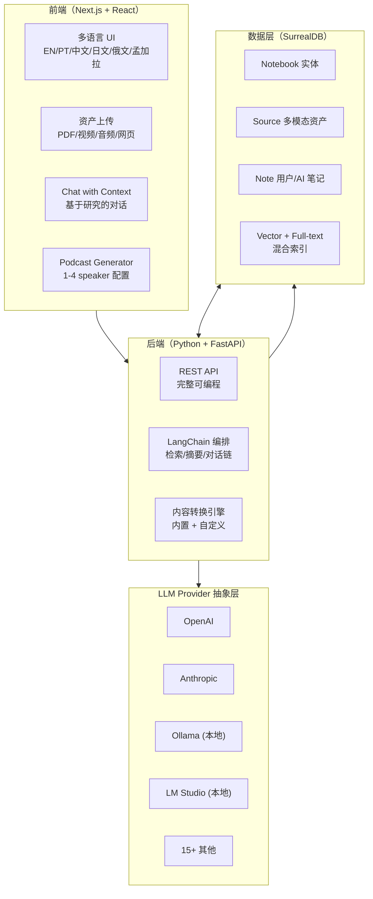
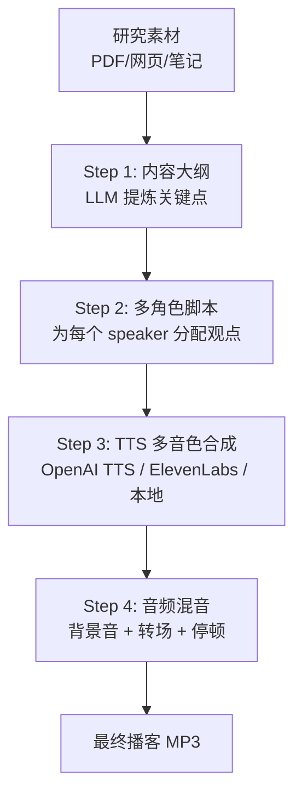

## 这篇文章在回答什么

lfnovo/open-notebook 是 2026 年 6 月 GitHub Trending 当日榜、当日新增 1,142 颗星。它做的是 **Google Notebook LM 的开源替代品**——上传 PDF / 视频 / 音频 / 网页，让 AI 帮你理解、做笔记、生成播客。

但它跟 Notebook LM 的核心差异化是 README 里那张对比表反复强调的几件事：

- **隐私第一**：自托管，数据不出你的服务器
- **18+ AI Provider**：从 OpenAI/Anthropic 到 Ollama/LM Studio 全支持
- **1-4 speaker 播客**：Notebook LM 只支持 2 speaker deep-dive
- **完全 API 化**：可以做自动化
- **开源可定制**

但开源替代品满天飞，为什么 open-notebook 能上 trending？这篇文章回答三个问题：

- **18+ Provider 抽象层**怎么设计——既要支持云端大模型，又要支持本地 Ollama，统一的接口契约是什么
- **多 speaker 播客生成**的具体管线——从内容大纲到多角色音频，工程上分几段
- **SurrealDB** 为什么被选做数据层——一个看起来"小众"的数据库，在这个场景里解决了什么特殊问题

## 系统地图：四层架构

open-notebook 的代码组织是清晰的四层——前端、后端、数据、Provider 抽象：



| 层 | 选型 | 关键约束 |
| -- | ---- | -------- |
| 前端 | Next.js + React | SSR 多语言，SSG 静态化 |
| 后端 | Python + LangChain | 生态丰富，AI 库最全 |
| 数据 | SurrealDB | 多模型 + 向量 + 关系，全在一个 DB |
| Provider | 18+ 抽象层 | 统一接口，按 provider 配置路由 |

## 18+ Provider 抽象层：统一接口契约

open-notebook 能在 README 里写 "18+ providers"，靠的是把"调用 LLM"这件事抽象成一个**与 provider 无关的接口**：

```python
# 伪代码：统一调用接口
class ModelProvider(Protocol):
    def chat(self, messages: list, **kwargs) -> str: ...
    def embed(self, texts: list) -> list[list[float]]: ...
    def transcribe(self, audio_path: str) -> str: ...
    def tts(self, text: str, voice: str) -> bytes: ...

# 每个 provider 各自实现
class OpenAIProvider: ...
class AnthropicProvider: ...
class OllamaProvider:  # 本地模型
    def chat(self, messages, **kwargs): 
        return ollama.chat(model="llama3", messages=messages)
    # ...
```

这套抽象的关键设计点：

1. **配置驱动**：`~/.open-notebook/config.toml` 里写 `provider = "ollama"`，整个应用切换模型
2. **能力降级**：不是每个 provider 都支持所有能力（embed、tts、transcribe）——抽象层在调用时检查 capability，没有就 fallback 到"有能力的 provider"
3. **本地优先支持**：Ollama、LM Studio 这类本地推理是一等公民，不是"也能用"

这意味着用户可以**完全本地化**部署：用 Ollama 跑 LLM，用 Whisper 本地转写，用 Piper 本地 TTS——数据从头到尾不出服务器。

## 多 Speaker 播客生成管线

Notebook LM 最让人惊艳的功能是 "Audio Overview"——自动生成双人对话播客。open-notebook 把这个做到了 **1-4 speaker**，而且**完全可控**：



| 步骤 | 关键参数 |
| ---- | -------- |
| 内容大纲 | temperature=0.3, max_tokens=2000 |
| 多角色脚本 | 每个 speaker 的 persona + 立场 + 语言风格 |
| TTS 合成 | 1-4 个 voice_id 映射到 speaker |
| 音频混音 | 停顿、背景音乐、章节转场 |

**1-4 speaker 的关键价值**：

- **1 speaker**：单人深度讲解、读书笔记
- **2 speaker**：标准对话（Notebook LM 的格式）
- **3-4 speaker**：圆桌讨论、辩论、多视角分析

比如分析一篇论文，2 speaker 是"主持 + 嘉宾"，4 speaker 可以是"主持人 + 支持者 + 反对者 + 领域专家"——听感完全不一样。

## SurrealDB 选型分析

数据层用 **SurrealDB** 是 open-notebook 一个有趣的技术选择。SurrealDB 是一个相对小众的 multi-model 数据库：

| 能力 | 在 open-notebook 中的用途 |
| ---- | ------------------------- |
| Document store | 存 notebook、note、source 文档 |
| Graph relations | notebook → source → note → embedding 关联 |
| Vector search | 内置向量索引（无需专用向量 DB） |
| Full-text search | 内置 FTS 索引 |
| SQL-like 查询 | SurrealQL，一种类 SQL 语法 |

**为什么不用 PostgreSQL + pgvector？**

- pgvector 也能做，但 graph 关系要单独建模
- 多个"内容资产"的关系查询（某 source 被哪些 notebook 引用、谁引用了这个 note）在 SQL 里很啰嗦，在 SurrealQL 里更自然

**为什么不用专门的向量数据库（Qdrant / Weaviate）？**

- 多一个组件就多一份运维
- 数据一致性需要双写
- SurrealDB 的向量能力虽然不是 SOTA，但对 RAG 场景够用

**代价**：SurrealDB 生态比 PG 小很多，运维工具没那么成熟。

## 跟 Notebook LM 的真实差异

README 的对比表列了 9 项差异，但**真正的产品差异**集中在三点：

| 维度 | Notebook LM | Open Notebook |
| ---- | ----------- | ------------- |
| 隐私 | 数据在 Google 云 | 数据在你自己的服务器 |
| 灵活性 | 只能用 Google 模型 | 18+ provider，包括本地 Ollama |
| 播客 | 固定 2 speaker | 1-4 speaker，可定制人设 |

**注意一个反向差异**：citation 体验。Notebook LM 的 "show sources" 体验做得非常成熟，点击引用直接跳到原文位置。open-notebook 自己在对比表里写 "will improve"——这是它需要补的短板。

## 多模态资产管理

open-notebook 支持的资产类型比 Notebook LM 多：

- **PDF**：解析 + 切分 + embed
- **视频**：转写（Whisper）+ 关键帧提取 + embed
- **音频**：直接转写
- **网页**：抓取 + 清洗 + embed
- **YouTube/Bilibili**：链接自动转写
- **EPUB/Markdown/纯文本**

每种资产都走统一的"转 embeddable 单元"管线——切分、摘要、embed、存 SurrealDB。检索时混合向量 + 全文。

## 部署

```bash
# 需要 Docker Desktop
git clone https://github.com/lfnovo/open-notebook
cd open-notebook
docker compose up -d
# 访问 http://localhost:8501
```

第一次启动会让你选 LLM provider，选 Ollama 就能完全离线。

## 总结

open-notebook 不是 "Notebook LM 的简单复刻"。它在三件事上做得更远：

1. **本地化做到底**：18+ provider 抽象 + SurrealDB 内置向量 = 完全离线部署
2. **播客生成做到 4 speaker**：圆桌讨论是 Notebook LM 没有的产品形态
3. **API 优先**：所有功能都有 REST endpoint，可以接自动化

它适合谁：

- 研究人员/学生：需要喂 AI 大量文献，不想数据上 Google 云
- 内容创作者：想要 1-4 speaker 播客，Notebook LM 模板化生成不够用
- 隐私敏感团队：客户数据/内部研究不能出内网

它**不太适合**：

- 想要"零配置即开即用"——Notebook LM 的开箱体验更顺滑
- 看重 citation 体验——Notebook LM 的引用跳转明显更成熟

项目地址：<https://github.com/lfnovo/open-notebook>
官方站点：<https://www.open-notebook.ai>
文档：<https://github.com/lfnovo/open-notebook/blob/main/docs/0-START-HERE/index.md>
