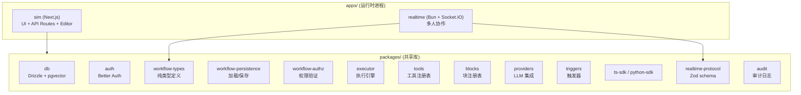

## 这篇文章在回答什么

Sim Studio 目前 27.8k stars，1000+ 集成，SOC2 合规。放在 GitHub 上，数字很好看。但如果你只读 landing page 的"拖拽式构建 Agent"，很容易错过它真正有意思的部分——**这套 Monorepo 架构是怎么把可视化编辑、多人协作、代码执行沙箱和第三方服务集成接到一起的。**

这篇文章回答三个问题：

1. Sim 的 Block → Tool → Icon 三层扩展体系是怎么设计的，为什么新加一个服务集成必须走这条固定路径
2. 执行引擎里"序列化阶段"和"执行期"为什么要分离，不分离会怎样
3. 实时协作服务为什么刻意不用 Next.js、不用 React、不用 Block 注册表——这个边界隔离决策对多用户 Agent 平台有什么启示

这篇文章不会教你"怎么拖一个节点"。它会在你已经知道 Sim 是什么的前提下，帮你理解这套架构做的取舍——哪些设计是故意的，哪些是现阶段的妥协。

## 系统地图：Monorepo 的分层逻辑

Sim 的代码分布在 `apps/` 和 `packages/` 两层。先看层级，再看每个包的角色。



| 层级 | 负责什么 | 关键约束 |
| ---- | ---- | ---- |
| `apps/sim` | Next.js 主应用，UI 渲染 + API Routes + Workflow Editor | 可以引用所有 `packages/` |
| `apps/realtime` | 多人实时协作，Socket.IO 长连接 | 禁止引用 React、Next.js、Block 注册表、Provider SDK |
| `packages/` | 共享库，纯逻辑与类型 | 禁止导入 `apps/` 中的任何模块 |

依赖方向是单向的：`apps/* → packages/*`，`packages/` 内部不得引用 `apps/`。这条规则由 CI 脚本 `scripts/check-realtime-prune-graph.ts` 强制执行——违反则 CI 失败。

## 核心架构决策：为什么不是单体

Sim 的架构有三个值得单独讲的决策。

### 决策一：为什么 Block 扩展必须走 Tool → Block → Icon 三层

Sim 的节点扩展体系不是自由注册的——每引入一个新服务，必须依次完成三层：

```
Tool 定义 → Tool 注册 → Icon 创建 → Block 定义 → Block 注册 → (可选) Trigger
```

这看起来比"直接定义一个 Block 类"更繁琐。但它的收益在一致性上：每个 Block 都引用一个已注册的 Tool，每个 Tool 都有明确的参数 schema（Zod）、请求配置和输出定义。不会出现"Block 有了但底层 Tool 不存在"或"Tool 注册了但编辑器里找不到"的情况。

Tool 的结构化描述（`ToolConfig<Params, Response>`）如下：

```typescript
export const serviceTool: ToolConfig<Params, Response> = {
  id: 'service_action',
  name: 'Service Action',
  description: '...',
  version: '1.0.0',
  oauth: { required: true, provider: 'service' },
  params: { /* Zod schema */ },
  request: { url: '/api/tools/service/action', method: 'POST' },
  transformResponse: async (response) => { /* 标准化输出 */ },
  outputs: { /* 定义输出字段 */ },
}
```

Block 引用 Tool 时，通过 `tools.config.tool` 和 `tools.config.params` 把 Tool 参数映射为可视化表单：

```typescript
export const ServiceBlock: BlockConfig = {
  type: 'service',
  name: 'Service',
  category: 'tools',
  subBlocks: [
    // 每个 subBlock 对应表单中的一个字段
    { id: 'field', title: 'Label', type: 'short-input', required: true },
  ],
  tools: {
    access: ['service_action'],
    config: {
      tool: (p) => `service_${p.operation}`,      // 序列化阶段执行
      params: (p) => ({ /* 类型转换 */ }),         // 执行阶段执行
    },
  },
}
```

这里有一个容易被忽略的细节：`tools.config.tool` 和 `tools.config.params` 的执行时机不同。

- `tool` 在序列化阶段执行。此时 Block 的变量引用（`<Block.output>`）尚未解析，如果在这里做 `Number()` 之类的类型转换，会破坏动态引用。
- `params` 在执行阶段运行。此时变量已解析完毕，可以做类型转换。

这个分离不是"设计上的优雅"，而是**不分离就会导致变量引用被破坏**的工程必然。如果你在扩展 Block 时发现变量引用异常，大概率是把类型转换放在了 `tool` 而不是 `params` 里。

### 决策二：为什么实时协作服务要刻意"瘦身"

`apps/realtime` 是一个独立的 Bun 进程，只处理 Socket.IO 长连接。它的约束清单：

- 不使用 Next.js
- 不导入 React
- 不引用 Block 注册表
- 不引用 Provider SDK
- 不引用执行器

CI 脚本 `check-realtime-prune-graph.ts` 会扫描 `apps/realtime` 的依赖图，确保它没有引入上述任何模块。

这个设计的收益不是"轻量"，而是**防止服务间隐式耦合膨胀**。在多人协作场景下，realtime 服务只需要知道"谁在移动哪个节点"——它不需要知道节点是什么类型、Block 怎么执行、LLM 怎么调用。如果把整个应用树挂到实时服务上，任何一个 `packages/` 的改动都可能导致协作服务重启或行为异常。

`packages/realtime-protocol` 是实时服务与编辑器之间唯一的通信契约——Zod schema 定义操作常量和消息格式，编辑器和服务各读自己的那份，互不依赖对方的运行时。

### 决策三：`workflow-types` 为什么是纯类型包

`packages/workflow-types` 不含任何运行时逻辑，只有类型定义：

```typescript
// BlockState、Loop、Parallel 等纯类型
type BlockState = { /* ... */ }
type Loop = { items: string; iterator: string; maxIterations: number }
type Parallel = { branches: Block[]; strategy: 'all' | 'any' }
```

这看起来不起眼，但解决了 Monorepo 里一个常见问题：executor、persistence、authz 三个包都需要知道工作流的数据结构，但谁也不应该依赖谁的运行时。如果类型定义和运行时逻辑混在一起，任何一个包的改动都会触发连锁的依赖更新和类型检查。

把类型单独抽成一个包，意味着 executor、persistence、authz 可以各自独立引用同一份类型契约，不用担心循环依赖或执行环境差异。这是 Monorepo 里避免"类型耦合"的标准做法。

## 一次真实工作流如何在 Sim 里执行

拿"PR Review Assistant"这个预置模板举例。用户配置了这样一个工作流：当 GitHub 有新的 PR 打开时，Agent 自动检查代码风格、安全漏洞，并生成 review 评论。

```
1. GitHub Webhook 触发 → 
2. Router Block 判断事件类型（PR opened / PR comment）→
3. Agent Block 读取 PR diff + 文件列表 → 
4. Agent 调用 LLM 分析代码（对照知识库中的 style guide）→
5. Function Block 格式化输出为 review comment → 
6. GitHub API Block 将评论 post 到 PR 页面
```

这条路径上，Sim 的几层抽象在同时工作：

- **触发器层**：GitHub Webhook 触发工作流启动，不需要轮询
- **执行引擎层**：从 Router 到 Agent 到 Function 到 API Block，按拓扑顺序遍历
- **变量解析层**：Agent Block 的输出（review 文本）作为 Function Block 的输入，通过 `<Block.output>` 引用
- **工具层**：GitHub API Block 的底层 Tool 处理 OAuth 认证和请求封装
- **审计层**：每一步执行都被 `@sim/audit` 记录，包含输入、输出、耗时和成本

执行失败时，BlockState 记录错误信息，工作流可以从失败节点重新触发，不需要从头跑。

## 代码执行隔离：为什么需要两种沙箱

Sim 支持用户在 Function Block 中执行自定义代码。任意代码执行意味着必须隔离——不能让用户代码直接访问宿主进程的文件系统、网络或环境变量。

Sim 提供了两种方案：

- **E2B（远程沙箱）**：代码发送到云端隔离环境执行，适合需要较强算力或需要安全隔离的场景
- **isolated-vm（本地隔离）**：在 Node.js 进程内创建 V8 隔离环境，适合轻量级代码片段，延迟更低

两种方案都保证用户代码不会直接影响宿主进程。选择哪种取决于你的工作流对延迟和算力的需求。

## 状态管理分层：为什么用 Zustand + TanStack Query 而不是全放 Redux

Sim 的状态管理没有用一个 Store 管所有。它按数据来源和生命周期拆成了三层：

| 层 | 工具 | 管什么 | 为什么 |
| ---- | ---- | ---- | ---- |
| 全局 UI 状态 | Zustand | 当前选中的节点、侧边栏展开、画布缩放 | 高频变更、纯客户端 |
| 服务端状态 | TanStack Query | 工作流列表、用户信息、工具配置 | 需要缓存策略、自动失效 |
| 组件内状态 | `useState` | 表单输入、弹窗可见性 | 作用域小、不需要共享 |

`useState` 不参与数据获取——所有需要从 API 拿的数据都走 TanStack Query。这个约束防止了数据获取逻辑散落在组件里，也避免了"同一个 API 被多个组件独立请求"的浪费。

## 技术栈全景

| 层级 | 技术选型 | 选型原因 |
| ---- | ---- | ---- |
| 前端框架 | Next.js（App Router） | API Routes + SSR + 页面渲染一体化 |
| 运行时 | Bun | 比 Node.js 更快的包管理和脚本执行 |
| 数据库 | PostgreSQL + Drizzle ORM + pgvector | 结构化存储 + 向量检索，无需额外向量数据库 |
| 认证 | Better Auth | 跨服务统一认证，支持 OAuth 多 provider |
| UI | Shadcn + Tailwind CSS | 一致性设计，组件可按需引入 |
| 状态管理 | Zustand + TanStack Query | UI 状态与服务端状态分离 |
| 可视化编辑器 | ReactFlow | 工作流画布，支持自定义节点和边 |
| 实时协作 | Socket.IO（Bun 独立进程） | 长连接，与主应用进程解耦 |
| 代码执行 | E2B + isolated-vm | 远程沙箱与本地隔离双模式 |
| Monorepo | Turborepo | 构建缓存与任务编排 |
| 审计 | `@sim/audit` | 统一入口记录所有敏感操作 |

## 和 LangGraph / AutoGen 比，Sim 适合什么场景

Sim 的定位不是"代码优先的 Agent 编排框架"。它的核心差异在三个地方：

1. **可视化编辑 + 多人协作**：非技术用户可以在画布上理解工作流结构，团队成员可以同时编辑同一张画布。LangGraph 和 AutoGen 是代码优先的，没有可视化层。
2. **开箱即用的工具集成**：1000+ 预置工具连接，OAuth 认证统一管理。在 LangGraph 里，每个工具连接都需要自己写认证逻辑。
3. **部署到执行一条龙**：从工作流定义到部署到日志追踪，全在 Sim 的 workspace 里完成。LangGraph 需要自己搭部署和监控。

反过来，Sim 不适合的场景：

- 需要极深度定制 Agent 逻辑（比如自定义复杂的 multi-agent 协商协议）
- 需要完全离线运行（Sim 的 Copilot 功能依赖云端服务）
- 当前工作流完全由代码生成、不需要可视化编辑

## 部署：三种方式怎么选

| 方式 | 适合 | 限制 |
| ---- | ---- | ---- |
| `npx simstudio` | 快速体验，5 分钟跑起来 | 背后是 Docker，需要 Docker 环境 |
| Docker Compose | 生产自托管，完整控制 | 需要管理 PostgreSQL 和 pgvector |
| 手动开发部署 | 需要改源码、加自定义 Block | 需要 Node.js v20+、Bun、PostgreSQL 12+ |

手动部署的完整流程：

```bash
git clone https://github.com/simstudioai/sim.git && cd sim
bun install

# 配置环境变量
cp apps/sim/.env.example apps/sim/.env
perl -i -pe "s/your_encryption_key/$(openssl rand -hex 32)/" apps/sim/.env
perl -i -pe "s/your_internal_api_secret/$(openssl rand -hex 32)/" apps/sim/.env
perl -i -pe "s/your_api_encryption_key/$(openssl rand -hex 32)/" apps/sim/.env

# 启动数据库
docker run --name simstudio-db \
  -e POSTGRES_PASSWORD=your_password \
  -e POSTGRES_DB=simstudio \
  -p 5432:5432 -d pgvector/pgvector:pg17

# 迁移 + 启动
cd packages/db && bun run db:migrate
cd ../.. && bun run dev:full
```

如果要使用 Copilot（自然语言转工作流节点），需要在 `https://sim.ai` 生成 Copilot API Key 并设为环境变量 `COPILOT_API_KEY`。自托管不使用 Copilot 不影响其他功能。

## 谁该用 Sim，谁该用 LangGraph

**用 Sim 的场景**：

- 团队里有非技术成员需要参与工作流设计和调试
- 需要快速接入大量第三方服务（Gmail、Slack、GitHub、Notion 等），不想每次写 OAuth 逻辑
- 需要一个有 UI 的工作流管理平台，包含日志、审计、权限控制

**用 LangGraph 的场景**：

- Agent 逻辑需要极深度定制，比如自定义的 multi-agent 协商协议
- 整个工作流由代码生成，不需要可视化编辑层
- 需要完全离线运行，不依赖任何云端服务

**两者可以共存**：把 Sim 作为团队协作和可视化编排层，把 LangGraph 作为底层复杂 Agent 逻辑的执行引擎——通过 Sim 的 API Block 或 MCP 连接桥接。

## 扩展开发：加一个服务集成的完整路径

假设要加一个 Notion 集成。需要依次完成：

1. 在 `tools/notion/` 下创建 `notion_tool`，定义 Zod schema 和请求逻辑
2. 在 `tools/registry.ts` 中注册该 Tool
3. 在 `components/icons.tsx` 中添加 `NotionIcon` SVG 组件
4. 在 `blocks/blocks/notion.ts` 中定义 Block 配置，引用 `notion_tool`
5. 在 `blocks/registry.ts` 中按字母顺序插入该 Block
6. （可选）在 `triggers/notion/` 下创建 webhook 触发器

这条路径是强制的。不能跳过 Tool 直接注册 Block，也不能有 Block 却没有 Icon。约束意味着一致性——每引入一个服务，都走完完整链路，不会出现"编辑器里有图标但点了没反应"的状况。

## 自测清单

读完这篇文章后，如果你准备深入使用 Sim，先过一遍：

- [ ] 能解释 Sim 的 Monorepo 分层：`apps/` 和 `packages/` 各自的职责和依赖方向
- [ ] 知道 Block 扩展的三层路径（Tool → Block → Icon），以及为什么必须按这个顺序
- [ ] 能说清楚 `tools.config.tool` 和 `tools.config.params` 的执行时机差异，以及放错位置会导致什么 bug
- [ ] 理解 `apps/realtime` 为什么要刻意不引用 React、Next.js 和 Block 注册表
- [ ] 知道 `workflow-types` 为什么是纯类型包，不含任何运行时逻辑
- [ ] 能区分 Zustand、TanStack Query 和 `useState` 在 Sim 中各自的职责
- [ ] 能判断自己的场景该用 Sim 还是 LangGraph，或者两者怎么结合

## 结论

Sim Studio 的架构里最值得关注的地方，不是它支持了多少个集成、有多少个预置模板。而是它在 Monorepo 里做的那几个关键决策：Block 扩展的固定路径保证了扩展一致性；序列化与执行期的分离防止了变量引用破坏；实时协作服务的边界隔离防止了服务间隐式耦合；纯类型包解决了多消费者场景下的类型共享问题。

这些决策单独拿出来都不算"新技术"，但放在一个 27.8k stars、面向生产部署的开源项目里，它们构成了一个可参考的工程范式：**如何在多人协作的 Agent 平台上，把扩展性、一致性和隔离性同时做到位。**

## 参考资料

- [Sim Studio 官网](https://simstudio.ai/)
- [Sim Studio GitHub](https://github.com/simstudioai/sim)
- [Sim 官方文档](https://docs.sim.ai/)
- [ReactFlow 文档](https://reactflow.dev/)
- [Drizzle ORM 文档](https://orm.drizzle.team)
- [Better Auth 文档](https://better-auth.com)