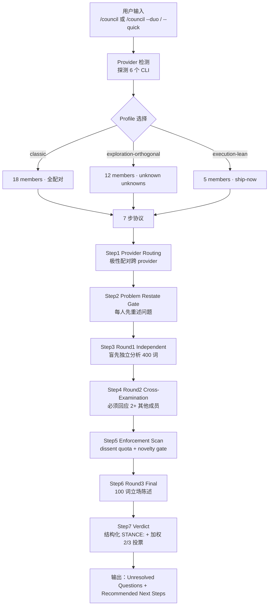

## 一、先给判断：这套 skill 不是把 18 个 prompt 串起来，而是把"单模型自信地猜"换成"多模型被强制对抗"

把同一个问题丢给 Claude，绝大多数时候会得到一段**结构工整、措辞自信、细节可疑**的回答。**真正的风险不是模型说错，而是模型用同一个家族的归纳偏差把同一个错回答得很自信。** Council of High Intelligence（[0xNyk/council-of-high-intelligence](https://github.com/0xNyk/council-of-high-intelligence)，CC0 协议，今日 trending daily 第一、star 2,124）做的事不是 prompt 模板，而是把"决策"重构成一次**带协议约束的多智能体协商**：

- 角色不是装饰品，而是**带极性配对的对手**——Socrates 负责拆假设、Feynman 负责从第一性原理重建，两人在同一议题上必须形成张力。
- 决策不是平均分，而是**结构化立场 + 强制多数决**——每位成员最后一轮必须输出一行 `STANCE:`，由领域内成员加权投票，达到 2/3 加权多数才算共识，否则直接呈报分歧。
- 模型不是单一来源，而是**跨 provider 强制分流**——极性配对的两个人必须落在不同模型家族（Claude / OpenAI / Gemini / Ollama / NVIDIA NIM / Cursor），避免一个模型的家族偏差同时传染给两个互相对抗的角色。
- 协议不是无限循环，而是**有界轮次预算**——full 模式 3 轮、quick 模式 2 轮、duo 模式 3 轮；任何一对成员互相应答超过 2 条消息就强制切断（"hemlock rule"）。

因此本文不打算把它当作"又一个多 agent 框架"来介绍，而是按**机制**拆：18 个角色的极性如何成对、3 套预置 panel 如何分工、7 步协议如何把对话变成投票、自动路由如何把 6 个 CLI 编排成一张"决策板凳"。

---

## 二、系统地图：18 personas × 3 panel × 7 步协议 × 6 个 provider

进入任何细节之前，先把整套系统的四层结构画出来，避免后面把"角色"和"协议步"混在一起讲。



四层关系要点：

1. **Panel 是角色集合**（classic 18、exploration-orthogonal 12、execution-lean 5），通过 `/council --profile` 切换。
2. **Mode 是协议深度**（full 3 轮、quick 2 轮、duo 2 人 3 步），通过 `/council --quick` 或 `/council --duo` 切换。
3. **Triad 是 3 人小组**（20 个领域组合），通过 `/council --triad <domain>` 选择，例如 `--triad strategy` 拉 Sun Tzu + Machiavelli + Aurelius。
4. **Provider 是底层模型**（Claude / Codex / Gemini / Ollama / NVIDIA NIM / Cursor），通过自动路由决定每个成员跑在哪个模型上。

> 读者拿到这套 skill 时最容易踩的坑：**把"18 personas"当成"18 个 prompt"，结果发现它们之间根本不互相引用——persona 只是身份标签，真正产生对抗的是协议步（cross-examination + dissent quota）。**

---

## 三、18 personas 的本质：不是百科词条，而是极性配对

直接看名单容易误读——以为是"找一个会哲学的 prompt"或者"找一个会工程的 prompt"。**README 真正想表达的判断是：单点最强没用，必须把观点放在互相对抗的位置上。** 下面把 18 人按"互相撕扯的双方"重新分组：

| 极性对 | 一方（拆 / 反对 / 反例） | 另一方（建 / 主张 / 正例） |
|--------|----------------------|----------------------|
| Socrates ↔ Feynman | Socrates 拆掉一切假设 | Feynman 从第一性原理重建 |
| Aristotle ↔ Lao Tzu | Aristotle 把一切归类 | Lao Tzu 说"分类本身就是问题" |
| Sun Tzu ↔ Aurelius | Sun Tzu 玩外部博弈 | Aurelius 治内心 |
| Ada ↔ Machiavelli | Ada 讲形式化纯度 | Machiavelli 讲真实激励 |
| Torvalds ↔ Watts | Torvalds 出具体方案 | Watts 追问问题是否成立 |
| Musashi ↔ Torvalds | Musashi 等最佳时点 | Torvalds 立刻 ship |
| Karpathy ↔ Sutskever | Karpathy 边做边观察 | Sutskever 先停一停研究安全 |
| Karpathy ↔ Ada | 经验 ML 直觉 | 形式系统理论 |
| Kahneman ↔ Feynman | Kahneman 说"你的认知是第一个错" | Feynman 说"信第一性原理" |
| Meadows ↔ Torvalds | Meadows 改反馈环路 | Torvalds 改症状然后 ship |
| Munger ↔ Aristotle | Munger 用多模型心智网格 | Aristotle 用单一分类体系 |
| Taleb ↔ Karpathy | Taleb 关注隐藏灾难尾部 | Karpathy 看平滑经验曲线 |
| Rams ↔ Ada | Rams 看用户要什么 | Ada 看计算能做什么 |

> **设计意图：每个角色没有"客观正确答案"，每个角色都站在另一极的对立面。** 一份诚实的评估应该由对立的双方同时陈述，而不是任一方独占。

这也直接决定了**为什么必须多 provider**——如果 Socrates 和 Feynman 都跑在同一个 Claude 模型上，他们的"对立"只是同一个归纳偏差的两副面具。这就是自动路由的硬约束（见第五节）。

---

## 四、3 套预置 panel 的取舍：人数越多 ≠ 越好

README 给出的 3 个 panel 不是"豪华套餐"，而是**用人数换视角、用速度换覆盖**的明确取舍：

| Panel | 人数 | 默认场景 | 速度/深度权衡 |
|-------|------|---------|--------------|
| `classic` | 18 | 战略级问题，需要完整覆盖 | 慢：full 模式 3 轮 × 18 人 |
| `exploration-orthogonal` | 12 | 探索未知未知数 | 中：偏向反直觉组合 |
| `execution-lean` | 5 | 决策→执行 | 快：5 人 + ship-now triad |

`execution-lean` 只有 5 个人：Torvalds、Feynman、Sun Tzu、Aurelius、Ada。**设计意图是"决策会议不要把所有人都拉进来"——能上桌的只有真的能下决定的人**。这与传统"决策要民主、人多保险"的做法相反，README 的隐含假设是：**人多 = 共识噪声变大；人少 + 强约束 = 真分歧浮现。**

因此"用哪个 panel"的选择本身也是一次决策：

- 技术选型、性能调优、需求歧义——`execution-lean`。
- 战略规划、商业模式、新市场评估——`classic`。
- 探索阶段、产品方向未定——`exploration-orthogonal`。

这个映射不是 README 明确写出来的规则，但从三套 panel 的成员构成反推，是最贴合 README 给的"domain triads"的隐含策略。

---

## 五、自动路由：6 个 provider 怎么把人贴上去

`/council --dry-route` 是排查自动路由的最佳入口，会打印每个成员被分配到哪个 provider。机制按以下顺序决策：

1. **极性配对硬约束**：任何一对极性对（比如 Socrates ↔ Feynman）必须落到不同 provider。
2. **均匀分布**：成员尽量均匀铺到所有可用 provider。
3. **`provider_affinity` 兜底**：每个 persona 的 frontmatter 里有"偏好 provider"字段，作为 tiebreaker。
4. **失败回退**：任何 provider 失败 → 自动回退到 Claude。

| Provider | 调用方式 | 检测条件 | 备注 |
|----------|---------|---------|------|
| Anthropic | subagent | 永远在 | 默认兜底 |
| OpenAI | `codex exec` | 装了 `codex` CLI | OpenAI 官方 |
| Google | `gemini -p` | 装了 `gemini` CLI | Gemini |
| Ollama | `ollama run` | 装了 `ollama` | 本地模型 |
| NVIDIA NIM | OpenAI-compatible API | 设了 `NVIDIA_API_KEY` | build.nvidia.com 130+ 模型 |
| Cursor | `cursor-agent -p` | 装了 `cursor-agent` | GPT-5/Claude/Gemini/Grok 聚合 |

两个值得特别说明的细节：

- **NVIDIA NIM 不需要 CLI**，只要 `export NVIDIA_API_KEY=nvapi-...` 就被自动识别。130+ 开放权重模型（DeepSeek、Kimi、GLM、Qwen、Nemotron）通过 OpenAI-compatible endpoint 暴露，免费额度 1,000 credits、40 RPM。
- **Cursor 是聚合器**，单一 `cursor-agent` 二进制同时提供 GPT-5.x、Claude、Gemini、Grok。**因此配 Cursor 时要明确选"跨家族"模型**（如 `gpt-5.4-high`、`gemini-2.5-pro`、`grok-4`），否则本来想分流，结果却把同一个家族偏差复制两遍。

README 给的两个反向示例（`configs/provider-model-slots.{nim,cursor}.example.yaml`）就是用来覆盖这两个边界场景的。

---

## 六、7 步协议：把"讨论"压缩成"决策"

full 模式的 7 步是最值得展开的一段，因为它直接决定了 Council 跟"把 18 个 prompt 拼起来"之间到底差在哪：

| 步 | 名称 | 关键约束 |
|----|------|----------|
| 1 | Provider Detection & Routing | 极性对必须跨 provider |
| 2 | Problem Restate Gate | 每位成员**先重述问题** + 给一个备选 framing |
| 3 | Round 1 Independent (盲先) | 全部并行；400 词上限 |
| 4 | Round 2 Cross-Examination | 必须回应 2+ 其他成员；300 词 |
| 5 | Enforcement Scan | dissent quota + novelty gate + agreement check + anti-recursion |
| 6 | Round 3 Final | 100 词立场陈述 |
| 7 | Verdict Synthesis | 结构化 `STANCE:` 行 + 加权 2/3 多数决 |

> **强制结构（enforcement）是 Council 真正的护城河。** 没有这几条 enforcement，整个系统就退化成"18 个 prompt 各自发言"——读起来热闹，但没有任何"决策机制"。

具体 enforcement 三条线：

- **dissent quota + novelty gate**：如果 >70% 过早达成共识，系统强制挑两位成员去钢人对方观点；novelty gate 阻止"换句话说"式的复读。
- **anti-recursion（hemlock rule）**：任何一对成员互相应答超过 2 条消息就强制切断，避免 Socrates 把整个会议拖成无限提问。
- **加权多数决**：每位成员最后一轮必须输出一行 `STANCE: ...`（支持 / 反对 / 有条件）。共识的判定不是"看起来多数"，而是**领域内成员 ×1.5 加权、领域外成员 ×1** 的结构化计票；权重由"领域"triad 在协议开始前指定（领域定义要在观点形成之前，避免事后加权）。

如果最终未达成 2/3 加权多数，系统**不会合成一个虚假共识**，而是直接把分歧 + 完整计票回吐给用户，由用户决定怎么继续。**"未达成共识也是结果"是 README 反复强调的判断——比"看起来同意"更有价值。**

quick 模式（2 轮、无 cross-examination）和 duo 模式（2 人 3 步：开场→回应→终态）则是把同一个 protocol 压缩给"简单决策"和"二元争论"用。

---

## 七、一个具体案例：`/council Should we open-source our agent framework?`

README 的 quickstart 例子是这套 skill 最完整的端到端展示。把 README 的命令按 7 步协议展开，能直接看到协议如何运作：

```
/council Should we open-source our agent framework?
```

这一条命令会触发以下流程（按 step 序）：

1. **Provider Detection & Routing**：探测到 Claude（默认）+ Codex（装了 `codex` CLI）两个 provider。Socrates 路由到 Claude，Feynman 路由到 Codex；其他 16 人按 provider_affinity 平均铺。
2. **Problem Restate Gate**：18 人各自先重述问题，例如：
   - Socrates: "你真正想问的是'开源能否帮我们获得开发者心智'还是'开源能否帮我们获得收入'？"
   - Aristotle: "开源是一个动作，把'什么开源'拆出来：核心代码？训练数据？评测集？"
   - Munger: "先想不开源会发生什么。损失是什么？"
3. **Round 1 独立分析（400 词内）**：18 人并行。
   - Sun Tzu 看外部博弈：竞品是否已开源？开源后的攻防。
   - Machiavelli 看真实激励：用户为什么来？是因为开源还是因为产品本身？
   - Taleb 看尾部风险：开源后被监管盯上的概率。
4. **Round 2 Cross-Examination**：每位成员必须引用并挑战至少 2 位其他成员。
   - Karpathy 反驳 Sutskever："你说安全优先，但你给的安全预算对应到我们这种小团队根本不可行。"
   - Sutskever 反驳 Karpathy："你用'不可行'当借口，但 safety cost 是内生的，不是外加的。"
5. **Enforcement Scan**：发现 Sun Tzu / Machiavelli / Aurelius（战略组）已经过早形成共识 → 强制 Karpathy / Sutskever 去钢人反对意见。
6. **Round 3 终态立场（100 词）**：每人输出 `STANCE: 支持 / 反对 / 有条件`，并说明加权立场：
   - Sun Tzu: `STANCE: 有条件 / 仅在 X 数据集保留后`
   - Machiavelli: `STANCE: 支持 / 视为心智营销手段`
   - Taleb: `STANCE: 反对 / 开源暴露被监管盯上的尾部`
7. **Verdict Synthesis**：加权 2/3 多数未达成 → 输出 unresolved questions + 全票计票 + next steps，不合成假共识。

**真实用户看到的不是"18 个人各自发言"，而是一份带分歧地图的决策稿**——这才是这套 skill 真正的产出形态。

---

## 八、20 个 Triad：把"领域知识"预编译到成员组合里

README 把 20 个常用 triad 直接列在表里。这个设计的关键不是"建议"，而是**预先把"哪些角色对哪些问题有用"压成可枚举的入口**：

| 领域 | Triad | 三人 | 为什么是这三人 |
|------|------|------|--------------|
| architecture | Aristotle + Ada + Feynman | 分类 + 形式化 + 第一性原理 |
| strategy | Sun Tzu + Machiavelli + Aurelius | 地形 + 激励 + 道德地基 |
| debugging | Feynman + Socrates + Ada | 自底向上 + 假设质疑 + 形式化验证 |
| ai-safety | Sutskever + Aurelius + Socrates | 前沿安全 + 道德清晰 + 假设破坏 |
| decision | Kahneman + Munger + Aurelius | 偏见识别 + 反向思考 + 道德锚定 |
| economics | Munger + Machiavelli + Sun Tzu | 模型 + 激励 + 竞争 |
| ... | ... | ... | ... |

> **Triad 的核心价值：把"应该问谁"从开放问题降级为枚举选项。** 用户不需要记住 18 个人谁跟谁合得来，只需要选领域。

这种做法在用户体验上和"用 RAG 检索相关 agent"等价，但**省去了 RAG 系统本身的工程成本**——一次 `git clone` + `./install.sh` 就拿到全部 20 个 triad。

---

## 九、benchmark 解读：协议性指标 vs 决策性指标

Council 不是一个有 benchmark 的系统（没有测试集、没有分数榜），所以这一节回答的不是"它跑得多快"或"准确率多高"，而是**协议性的硬指标**：这些数字变化到底反映系统的哪一部分。

**第一类：轮次预算指标。**

| 模式 | 轮数 | 强制约束 | 反映什么 |
|------|------|----------|----------|
| full | 3 | dissent quota + novelty gate | 完整审议 |
| quick | 2 | 无 cross-examination | 跳过对抗 |
| duo | 3 步 | 仅 2 人 | 二元争论 |

数字变化反映的不是"模型能力"，而是**协议设计对决策深度的影响**——同一个问题在 full 和 quick 下的输出结构差异由协议而非模型决定。

**第二类：consensus 指标。**

- **加权 2/3 多数**：领域成员 ×1.5、领域外 ×1，权重在协议开始前指定。
- **未能达成**直接以全票计票形式回吐给用户。
- **未尝试合成假共识**——这是 README 反复强调的设计原则。

> **从这些指标不能直接推出什么：**
> - 不能推出"加权投票比简单多数更准确"——共识本身的质量依赖 triad 配置和领域权重指定。
> - 不能推出"未达成 2/3 = 答案错误"——可能只是问题本身模糊（这时 Step 2 的 Problem Restate Gate 应该已经暴露）。
> - 不能推出"20 个 triad 是完备的"——它们覆盖 README 写出来的高频领域，但低频领域需要用户自己组合成员。

**第三类：provider 路由指标。**

- 极性对必须跨 provider（硬约束）；
- 成员均匀分布（软约束）；
- 任意 provider 失败 → 自动回退 Claude。

> **从路由指标不能推出什么：**
> - 不能推出"路由到 6 个 provider = 决策质量提升 6 倍"——provider 数量只是保证模型家族多样性，不是性能指标。
> - 不能推出"用 NVIDIA NIM 的开放权重模型 = 开源本地决策"——NIM 仍然是远程推理，只是模型权重开放。

> 因此，本节与其说是在评估 benchmark，不如说是在**给读者一把尺子**：当你看到别人报告 Council 的"决策质量"时，先问一句"他用的是哪个 mode？三脚架配置是什么？权重怎么定的？"

---

## 十、采用顺序与适用边界

不是所有人都该用 Council。以下是按团队类型的采用建议：

**适合：**

- 战略级、产品级决策——需要对抗模型家族偏差的场景。
- 多视角决策已有共识但希望**结构化对抗**——而不是"再开一次会"。
- 已经有 Claude Code 或 Codex 的本地工作流——`./install.sh` 加一行命令就能跑。
- 已经有 6 个 provider 中的至少 2 个——自动路由才能产生真正的"跨模型"。

**不适合：**

- 单点技术决策、bug 排查——`execution-lean` 也嫌重，直接问 Claude / Codex 更划算。
- 需要大量事实查询的决策——Council 不擅长"找出正确答案"，擅长"列出不同视角"。
- 团队无 Claude Code / Codex 工作流——`./install.sh` 的全部价值建立在 agent + subagent 已就位的前提上。

**采用顺序：**

1. **先做 `--dry-route`**：打印路由表，确认 provider 配置无误。
2. **跑 demo session pack**：`demos/session-pack.md` 测试 3 个模式。
3. **用 `--quick --duo`** 起步：先用轻量模式验证你的问题确实"需要 18 人"。
4. **再升级到 `--full`**：评估 full 模式的输出对你实际决策的影响。
5. **最后上 `--copy-configs`**：安装 provider-model-slots 模板，进入多 provider 阶段。

---

## 十一、结尾：回到系统层价值

Council 的价值不在 18 个 persona 的"模拟"，而在三件事：

1. **极性配对 + 跨 provider 路由**——把模型家族偏差从"系统性风险"降级为"被强制对抗的局部偏差"。
2. **7 步协议 + enforcement scan**——把"对话"重构成"决策"，未达成的分歧也是有效输出。
3. **20 个 triad 预编译**——把"该问谁"从开放问题降级为枚举选项。

因此它的真正定位是**给 Claude Code / Codex 用户的一份"决策协议附件"**——不是替代 Claude，而是给 Claude 加一个结构化的对手席。

如果你已经在 Claude Code / Codex 上工作，面临"再问一次还是一样答案"的瓶颈，**Council 提供的不是更多答案，而是让现有答案**先**互相撕一遍。**

---

## 资料口径说明

- 仓库：[0xNyk/council-of-high-intelligence](https://github.com/0xNyk/council-of-high-intelligence)，CC0 协议。
- 本文中 18 personas 表、3 panel、20 triad、7 步协议、6 provider 表均来自 README 截至 2026-06-30 的版本。
- "极性配对"、"execution-lean"、"weighted 2/3 majority"、"hemlock rule" 等术语均沿用 README 原文。
- Trending 数据来源：github.com/trending daily 2026-06-30 15:00 (Asia/Shanghai)。
- 文章不依赖任何特定 provider 的可用性；具体 provider 配置请参考 `configs/provider-model-slots.example.yaml`。

