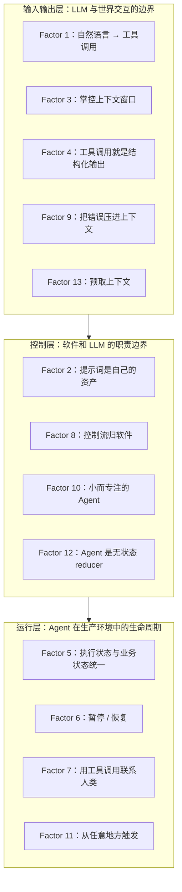

# 12-Factor Agents：把 LLM 应用从 Demo 拉进生产线的工程原则

## 核心判断

用 LLM 做产品，团队容易在两极之间来回摇摆。一极是把所有希望押在万能 Agent 范式上——给个 prompt、挂一堆工具、让模型自己 loop 到目标达成；另一极是把 LLM 降级成增强搜索，外面包一堆 if-else。

Dex（humanlayer 创始人）访谈了 100 多个 SaaS 创始人之后，落在一句话上：**真正交付到生产用户手里的 LLM 软件，绝大多数是软件 + LLM 步骤的混合体，不是纯 Agent。**

这个判断是 12-Factor Agents 全部 13 条原则的出发点。每一条背后都有团队踩过的坑，以及他们最后被迫从零重写的代码。

用 LLM 做产品，或要把 AI 能力嵌入现有系统，读完可以回答三个问题：

- 为什么大多数 Agent 框架只能带你到 70-80% 的质量？
- 从 demo 到生产级之间，缺的到底是什么？
- 如果不用框架，自己该按什么原则来搭？

12-Factor Agents 在 GitHub 上拿了 20k+ stars 之后，作者 Dex 持续在更新补充材料——视频讲解、脚手架 `npx/uvx create-12-factor-agent`、Discord 社区和开源参考实现 `got-agents/agents`。这套原则正在被越来越多的团队当成 Agent 工程基线：用它审视现有实现，或者用它指导新项目从第一行代码开始的结构。

---

## 好 Agent 的本质是软件

理解 12-Factor Agents 之前，先看**软件 → DAG → Agent Loop** 的演化逻辑。

### 软件本质上是有向图

20 年前，DAG（有向无环图）编排器开始流行——Airflow、Prefect、Dagster、Inngest、Windmill。它们带来的是工程保障，不是新算法：可观测性、模块化、重试、管理界面。团队能看清每一步的状态、定位失败的节点、手动或自动重跑。

### Agent Loop 的承诺与现实

Agent 范式抛出了一个承诺：**让 LLM 自己决定路径，扔掉 DAG。** 工程师只提供"边"（可用的工具 / 动作），模型在运行时决定走到哪些"节点"。理论上少写编排代码、LLM 能发现未预见的解法、错误可自动恢复。

实际运行中的 Agent Loop，本质是三步循环：

```python
initial_event = {"message": "..."}
context = [initial_event]

while True:
 next_step = await llm.determine_next_step(context)
 context.append(next_step)

 if next_step.intent == "done":
 return next_step.final_answer

 result = await execute_step(next_step)
 context.append(result)
```

1. LLM 输出下一步要做什么（结构化输出 / tool calling）
2. 确定性代码执行这个工具调用
3. 执行结果追加进上下文窗口
4. 重复，直到 LLM 判断"完成"

**这套循环本身只能稳定工作在 70-80% 的质量区间。** 超过这个阈值，需要对循环中每一步的工程控制，不是更聪明的模型。

### 从 70% 到生产级的典型翻车路径

Dex 访谈中反复出现的团队轨迹：

1. 决定做 Agent → 产品设计 → 用 LangChain / CrewAI 等框架快速出 demo → 70-80% 质量
2. 发现 80% 在真实客户场景里完全不够——客户不会接受"大多数时候对"
3. 开始逆向工程框架内部注入的 prompts、flow、状态管理
4. 认输，从零重写

12-Factor Agents 要解决的是**让第四步不用从零开始**，不是"再做一个框架"。每条原则对应一个"不这么干，迟早回来改"的工程判断。

---

## 系统地图

先看一眼全景。13 条原则分布在三层上：



| 层次 | 管什么 | 核心工程问题 |
|------|--------|----------|
| **输入输出层** (F1, F3, F4, F9, F13) | LLM 看到什么、输出什么、怎么被调用 | 上下文格式怎么设计？工具契约怎么定义？错误怎么反馈给 LLM？ |
| **控制层** (F2, F8, F10, F12) | 谁来决定下一步做什么 | 提示词所有权归谁？while loop 归谁写？Agent 粒度多大？状态怎么建模？ |
| **运行层** (F5, F6, F7, F11) | Agent 在生产环境怎么活下来 | 状态怎么持久化？人怎么介入？触发源有哪些？ |

遇到具体问题时，先定位"这属于哪一层"。比如 Agent 在生产环境里停了就再也恢复不了——这是运行层的问题，和 prompt 没关系。把问题放对层次，就能找到对应的那条 Factor。

---

## 一次真实任务穿过系统长什么样

逐条拆解原则之前，先看一个完整的任务流案例。后续每个 Factor 里，可以随时回到这张图确认"这条管的是哪个环节"。

**场景**：用户通过 Slack 消息要求部署后端服务的最新版本到生产环境。

```
用户消息到达
 │
 ▼
[F11] 从 Slack webhook 触发，与用户在对话中相遇
 │
 ▼
[F13] 预取：拉取 Git tags、最近部署记录、变更日志
 │
 ▼
[F3] 构建上下文窗口：Slack 消息 + 预取数据打包为 XML 事件
 │
 ▼
[F1] LLM 输出结构化决策：{ "intent": "tool_call", "tool": "list_git_tags" }
 │
 ▼
[F4] 确定性代码执行 `git tag --list`，不是 LLM 在执行
 │
 ▼
[F9] 如果 `git tag` 失败 → 错误摘要压入上下文，LLM 决定重试或报告
 │
 ▼
[F8] 控制流归软件：LLM 选择工具，但 if/else / 循环由代码管理
 │
 ▼
[F7] 部署前需审批 → Agent 发 Slack "确认部署 v1.2.3 到生产？"
 │
 ▼
[F6] 等待审批时持久化状态、释放资源
 │
 ▼
[F7] 用户回复 "yes" → Agent 恢复执行
 │
 ▼
[F5] 部署过程中，执行状态和业务状态同一数据源追踪
 │
 ▼
[F2] 整个流程中，prompt 完全由团队自己的代码显式构建
 │
 ▼
[F10] 部署 Agent 只做部署，报告 Agent 只做报告，互不干扰
 │
 ▼
[F12] 整个 Agent 可作为纯函数回放：(状态, 事件) → 新状态
```

这个任务流贯穿了全部 12 条正式原则加预取。接下来逐条拆解。

---

## 逐条拆解

### Factor 1：自然语言 → 工具调用

把用户的一句话需求转换为结构化工具调用对象，是 Agent 的原子操作。

用户说：

> "create a payment link for $750 to Terri for sponsoring the february AI tinkerers meetup"

Agent 应该输出：

```json
{
 "function": {
 "name": "create_payment_link",
 "parameters": {
 "amount": 750,
 "customer": "cust_128934ddasf9",
 "product": "prod_8675309",
 "price": "prc_09874329fds",
 "quantity": 1,
 "memo": "Hey Terri - see below for the payment link for the february AI tinkerers meetup"
 }
 }
}
```

之后确定性代码接手：

```python
next_step = await llm.determine_next_step(
 "create a payment link for $750 to Terri "
 "for sponsoring the february AI tinkerers meetup"
)

if next_step.function == 'create_payment_link':
 stripe.paymentlinks.create(next_step.parameters)
 return
```

Factor 1 解决一件事：**把自然语言指令转成机器可执行的结构化调用。** 这一步做得干净，后续步骤才能可靠。

容易忽略的工程细节：参数里 `customer`、`product`、`price` 这些 ID 是怎么来的？LLM 不会凭空生成它们。要么靠 Factor 13（预取）提前加载到上下文里，要么靠 Factor 3（上下文工程）让 LLM 有足够信息做实体映射。Factor 1 的输出质量，取决于上游喂进去了什么。如果你发现模型在参数选择上反复出错，先去查上下文里有没有足够的候选数据，而不是去调 temperature 或换模型。

Factor 1 和 Factor 3 要一起看：**LLM 的"理解"能力是上下文工程的结果，不是模型的固有属性。**

---

### Factor 2：提示词是自己的资产

提示词是工程资产，不是框架的注入黑盒。

当你在生产环境调试 Agent 行为时，需要精确控制每一条指令。大多数框架会在你不知道的情况下注入 system prompt——角色设定、行为约束、工具使用规则。这会导致三个问题：

- **行为不稳定**：框架升级后，注入的 prompt 变了，Agent 行为跟着变——而你根本不知道哪条规则变了。
- **难以复现**：同样的用户输入，因为框架内部状态不同，输出不同。
- **调试困难**：出问题时，你不知道这条指令来自你自己写的 prompt，还是框架在背后加进去的。

Own your prompts 的做法：**把提示词当作第一公民的代码资产，用 Git 管理，在代码中显式构建整个 prompt 字符串。** 哪怕你仍然用某个框架做底层 LLM 调用，至少 prompt 的完整内容是你用 `grep` 能定位到的。

实用判断标准：排查 Agent 行为问题时，能不能在 5 分钟内定位到"哪段代码构建了这条 prompt"？做不到的话，你就不算 own your prompts。

更进一步的做法是把 prompt 本身当成可测试的模块。如果一段 system prompt 超过 50 行，考虑提取其中可独立验证的约束——例如"工具选择规则"和"输出格式规范"——分别写成可 diff、可评分的 prompt 片段。这和常规软件里把巨型函数拆成小函数是一个道理。

---

### Factor 3：掌控上下文窗口

上下文窗口是 Agent 最核心的工程对象，不是容量数字。

#### 标准消息格式的隐性成本

大多数 LLM 客户端默认用标准消息格式：

```json
[
 {"role": "system", "content": "You are a helpful assistant..."},
 {"role": "user", "content": "Can you deploy the backend?"},
 {
 "role": "assistant",
 "content": null,
 "tool_calls": [{"id": "1", "name": "list_git_tags", "arguments": "{}"}]
 },
 {
 "role": "tool",
 "name": "list_git_tags",
 "content": "{\"tags\": [{\"name\": \"v1.2.3\", \"commit\": \"abc123\"}]}",
 "tool_call_id": "1"
 }
]
```

这套格式有两个实际问题。第一，每个消息块有固定的元数据开销（role、tool_call_id 等），长对话中 token 消耗可观。第二，`role: tool` 的语义是给模型看的，不直观反映"这是哪一步、产生了什么数据"——对工程师不够可读，对模型来说也不一定是最优的注意力分配。

#### 自定义事件格式

12-Factor Agents 建议用 XML 风格的自定义格式，把每一步建模为事件：

```python
class Thread:
 events: List[Event]

class Event:
 type: Literal["list_git_tags", "deploy_backend", ...]
 data: Any

def event_to_prompt(event: Event) -> str:
 data = event.data if isinstance(event.data, str) else stringify_to_yaml(event.data)
 return f"<{event.type}>\n{data}\n</{event.type}>"

def thread_to_prompt(thread: Thread) -> str:
 return '\n\n'.join(event_to_prompt(e) for e in thread.events)
```

这样每个上下文窗口看起来像：

```xml
<slack_message>
 From: @alex
 Channel: #deployments
 Text: Can you deploy the latest backend to production?
</slack_message>

<list_git_tags_result>
 tags:
 - name: "v1.2.3"
 commit: "abc123"
 - name: "v1.2.2"
 commit: "def456"
</list_git_tags_result>

what's the next step?
```

好处是双重的：**对模型**，XML 标签直接标记了信息边界，模型更容易定位相关上下文，降低"中间丢失"（lost in the middle）效应；**对工程师**，事件结构本身就是调试信息——你能直接看到每一步的类型和数据，不需要在 JSON 嵌套里翻。上下文工程还包括 RAG（检索增强生成）、跨会话记忆、Schema 对齐解析（BAML 等工具）。但核心原则不变：**上下文的构建方式必须由你完全控制**，否则你永远没法系统性地优化 token 效率和注意力分配。

实用启发：每次做上下文裁剪时，优先删掉"已被后续步骤取代的信息"。比如第 3 步生成了部署报告，那么第 1 步的原始 build log 可能就不再需要留在窗口里了。上下文工程的关键是"每一轮里 LLM 真正需要看到什么"，不是"能塞多少"。

---

### Factor 4：工具调用就是结构化输出

工具调用不是 Agent 独有的魔法——它只是 LLM 输出结构化数据的一种形式。Function Calling、Structured Outputs (JSON Mode)、约束解码，都是同一件事的不同技术路径。

这一点讲清楚之后，能解开 Agent 复杂性的一个心结：**给 LLM 一个工具时，只是在要求它以特定格式输出数据；执行工具的是确定性代码，从来不是 LLM。**

由此可以得出两条结论。第一，工具设计应该像 API 设计一样严肃——参数类型、校验逻辑、错误返回格式，这些和普通软件工程里的 API 设计没有区别。第二，Agent 行为不稳定时，第一步排查的应该是"工具定义是否清晰"和"上下文里是否有足够信息让 LLM 做参数选择"，而不是去调 temperature。

常见反模式：给 LLM 挂了 20 个工具，每个工具的参数描述含糊，然后怪模型不够聪明。人类工程师拿到 20 个文档不全的 API，也未必能在一轮对话里准确选出该调哪个、参数该怎么填。

工具返回值的格式同样影响 Agent 质量。返回一个 5KB 的 JSON blob 不如返回一个被精心裁剪的结构体——只包含 LLM 做下一步决策需要的字段。工具设计是双向的：输入参数设计 + 输出格式设计，缺一不可。

---

### Factor 5：执行状态与业务状态统一建模

Agent 运行过程中会自然产生两套状态。一套是"执行历史"——哪些步骤完成了、当前在哪个步骤；另一套是"业务状态"——订单状态、用户资料、审批结果。大多数实现会不自觉地把它们分开维护：执行状态存在 Agent 的内存里，业务状态存在数据库里。

分开维护的直接后果：**Agent 重启后执行状态丢失**，而业务数据库的状态显示"订单已创建但后续步骤没执行完"。这种不一致是 Bug 的温床。

更好的做法是把执行状态也当作业务状态的一部分。用单一数据源——不管是 PostgreSQL 一行、Redis 一个 key、还是一条事件溯源日志——同时描述"任务当前在哪里"和"业务当前是什么状态"。这条原则是 Factor 6（暂停 / 恢复）的技术前提：你没法恢复一个序列化不完整的 Agent。

具体实现上，简单有效的模式是在业务数据库里加一张 `agent_tasks` 表，字段包含 `id`、`status`、`current_step`、`events_json`（Factor 3 的 Thread）和 `business_entity_id`（关联业务实体）。Agent 重启时从这张表读取最后的状态就能继续。

---

### Factor 6：暂停 / 恢复

Agent 暂停和恢复的能力不是"高级功能"——只要 Agent 需要等待人工审批、外部 webhook 回调、或长耗时异步操作，这就是基本要求。

典型场景：

- 部署 Agent 发起了部署请求，需要等 CI/CD 系统返回结果
- 客服 Agent 遇到退款超过阈值，需要主管审批
- 服务器重启或进程崩溃，Agent 需要从上次中断的地方继续

实现手段上，把 Agent 的执行状态序列化到持久化存储，通过简单 API 做 save/load。Factor 5（统一状态）让这件事变成可能——如果执行状态和业务状态是同一套 schema，序列化和恢复就只是一次数据库读写。

容易被忽略的细节：**恢复时上下文窗口的重建。** 如果你在暂停时只存了"执行到第 3 步"这个元信息，但没有存前 3 步产生的完整 Thread 事件列表，恢复后 LLM 看到的是一个残缺的对话历史。正确做法是把整个 Thread（Factor 3 的事件列表）作为状态的一部分持久化。

恢复逻辑的伪代码：

```python
def resume_agent(task_id: str) -> str:
 task = db.get_task(task_id)
 if task is None:
 raise TaskNotFound(task_id)

 state = State.from_dict(task.state_snapshot)
 thread = Thread(events=task.events)

 return run_agent_loop(state, thread)
```

关键约束：`task.state_snapshot` 和 `task.events` 必须在同一个事务里写入，否则恢复后的状态和事件列表可能不匹配。

---

### Factor 7：用工具调用联系人类

Agent 遇到无法自主决策的情况时，应该主动联系人类，而不是卡死或乱猜。

把"联系人类"也建模为工具调用：

```python
{
 "function": {
 "name": "contact_human",
 "parameters": {
 "reason": "退款金额 $5,000 超出客服自主审批上限 $1,000",
 "context": {
 "order_id": "ord_12345",
 "customer_tier": "enterprise",
 "refund_requested": 5000
 },
 "channel": "slack",
 "target": "#ops-escalations"
 }
 }
}
```

这样做的好处是保持整个流程的一致性：**Agent 通过同一套工具调用机制与人类交互，不需要为"人机协作"单独开辟一条异常处理分支。** 从代码角度看，`contact_human` 和 `create_payment_link` 是同一类东西——Agent 发出一个函数调用，确定性代码去执行。区别只在前者的"执行"是发一条 Slack 消息然后阻塞等待回复。

工程细节：`contact_human` 的回复格式同样需要结构化。与其让人类打一段自然语言塞回上下文，不如给审批人几个按钮选项——"批准 / 拒绝 / 需要更多信息"——每个选项映射到标准化的回复结构。这样 LLM 在恢复执行时看到的是结构化的审批结果，而不是一段需要再次解析的自由文本。

---

### Factor 8：控制流归软件，不归 LLM

控制流——"什么时候做什么、什么条件下跳转、什么情况下终止"——是软件的职责，不是 LLM 的。

好的 LLM 应用的架构是：**软件定义骨架，模型填充细节。** 骨架是控制流（DAG、状态机、if/else），细节是内容生成和局部决策（这段文字怎么写、这几个参数填什么）。

这里需要纠正一个常见误解：Factor 8 不是说 LLM 不能参与决策。LLM 当然可以决定"下一步调用哪个工具、参数是什么"——这是 Factor 1 的范畴。Factor 8 说的是一条更硬的边界：**决定"什么时候停下来、什么时候重试、什么时候升级到人工处理"的逻辑，应该写在确定性代码里，而不是靠 LLM 自己判断。**

在 while loop 的外层用代码控制终止条件：

```python
MAX_ITERATIONS = 25
iteration = 0

while iteration < MAX_ITERATIONS:
 next_step = await llm.determine_next_step(context)

 if next_step.intent == "done":
 return next_step.final_answer

 if next_step.tool in CRITICAL_TOOLS:
 require_human_approval(next_step)

 result = await execute(next_step)
 context.append(result)
 iteration += 1

raise MaxIterationsExceeded(f"Agent did not finish within {MAX_ITERATIONS} steps")
```

类比：工作流引擎编排 Agent 节点，Agent 节点内部调用 LLM。DAG 回来了——但这一次，节点是 LLM 调用，边是确定性代码。

---

### Factor 9：把错误压进上下文窗口

传统异常处理模式：Agent 出错 → 抛异常 → 中断 → 人工介入。这套模式在 Agent 场景下代价很高——每次中断都意味着之前积累的上下文、状态和进度全部丢失。

更好的做法：**Agent 出错 → 把错误压缩进上下文 → 继续 loop → 让模型决定如何处理。**

压缩方式是把原始错误转换为结构化摘要，不是把整个 stack trace 塞进 context window：

```python
{
 "error_type": "api_rate_limit",
 "source_tool": "fetch_github_issues",
 "retry_after_seconds": 60,
 "affected_parameters": {"repo": "org/repo", "since": "2026-05-01"},
 "suggested_action": "retry_after_wait"
}
```

LLM 拿到这条摘要后可以做多种决策：等待后重试、换一个 API endpoint、跳过这步用已有数据继续、升级到人工处理。关键是 LLM 有了选择权，而不是被中断直接判死刑。

**边界判断**：不是所有错误都该压进上下文。如果是系统性的——API key 失效、数据库连接断了——重试不会改变结果，应该走传统异常处理。Factor 9 最适合的是**可恢复的、瞬时的、LLM 有能力做出有意义决策的错误**：API 限流、临时超时、数据格式不匹配。区分这两类错误的规则不妨写成一段确定性代码：凡是 `error_type` 在 `RECOVERABLE_ERRORS` 集合里的进上下文，其余走传统异常抛出。

---

### Factor 10：小而专注的 Agent

一个 Agent 同时做"处理支付 + 回答用户问题 + 写报告"，每个环节都会做得更差。这和单一职责原则（SRP）一脉相承——但 Agent 场景下有额外理由。

LLM 的注意力是有限资源。system prompt 越长、工具列表越长、上下文越复杂，模型在每件事上分配的注意力就越少。一个"万能 Agent"的 system prompt 可能写满 3 页，覆盖 8 种业务场景，挂 30 个工具——结果是模型在每种场景下平均只能分到 12.5% 的注意力，任何边缘情况都可能触发跳场景的幻觉。

实践建议：

- **按功能域拆分**：支付 Agent、客服 Agent、报告 Agent、部署 Agent，各自有独立的 prompt 和工具集
- **每个 Agent 有明确的输入 / 输出契约**：进什么格式的事件，出什么格式的结果
- **通过消息总线或共享状态协调**：Agent 之间不直接调用，避免形成不可追踪的依赖链

拆得够细的话，每个 Agent 的 system prompt 可以控制在半页以内，工具列表不超过 5 个。这个量级下，模型的行为稳定性和可调试性会有数量级的提升。

判断标准：发现自己正在往某个 Agent 的 system prompt 里加"如果用户问的是 X 类问题，则……"这种场景分叉逻辑时，就是该拆 Agent 的信号了。场景分叉不应该由 prompt 里的 if-else 来处理，而应该由路由层（一段确定性代码）根据用户意图把请求分发到对应的 Agent。

---

### Factor 11：从任意地方触发，在用户所在的地方相遇

Agent 的触发源应该多元——webhook、cron 定时任务、用户消息、API 调用、CI/CD 事件——而交付结果应该在用户已经在用的渠道里（Slack、邮件、IDE、Dashboard），不需要用户特意打开一个 Agent 界面。

这条原则容易被当成"产品体验"而轻视，但它有硬工程含义：**Agent 的入口和出口必须解耦。** 入口逻辑不应该假设"用户一定会通过 HTTP POST 发 JSON"，出口逻辑不应该假设"用户当前一定在 Web 页面前等待响应"。

实现上，Agent 的触发层和交付层应该被设计成可插拔的适配器：今天从 Slack 触发、输出到 Slack；下个月加一个 cron 触发、输出到邮件。Agent 核心逻辑不感知这些变化。具体做法是定义两个接口——`Trigger`（带 `source` 和 `payload`）和 `Delivery`（带 `channel` 和 `recipient`）——Agent 内核只依赖这两个接口，不依赖具体实现。

---

### Factor 12：把 Agent 做成无状态 reducer

把 Agent 建模为无状态 reducer——`(状态, 事件) → 新状态`——而不是"有记忆的活物"。

```python
def agent_step(state: State, event: Event) -> State:
 next_step = llm.determine_next_step(state.context)
 if next_step.is_tool_call:
 result = execute_tool(next_step.tool, next_step.args)
 return state.append(event=result)
 elif next_step.is_done:
 return state.mark_done(final_answer=next_step.answer)
 else:
 return state
```

无状态 reducer 带来的工程收益比表面上看起来大得多：

- **可测试**：给定相同的 State 和 Event，输出总是相同——不依赖 Agent 内部是否有"记忆"。可以为关键路径写标准单元测试：构造一个 State（含特定上下文），输入一个 Event，断言输出的 State 是正确的。
- **可回放**：存下所有事件后，在任何时间点重放，重现当时的决策过程。这在排查生产事故时无价——不是在猜测 Agent 当时"可能想了什么"，而是逐帧回放每一步的输入输出。
- **可 Fork**：同一个状态可以 fork 出多个并行执行路径。例如同时尝试两种不同的工具选择策略，比较结果后再决定走哪条路。这在需要探索性决策的场景里（比如代码生成 Agent 尝试多种实现方案）尤其有用。
- **可调试**：整个执行轨迹是确定性的。每一步的输入输出都可以看，不存在"Agent 脑子里在想什么"的模糊空间。

**这条和 Factor 8 的配合**：Factor 8 说控制流归软件，Factor 12 说 Agent 本身是可预测的纯函数。两条合起来，意思就是"你的 LLM 应用应该像一个确定性的状态机，其中某些节点的转换逻辑由 LLM 提供"——而不是"一个聪明的黑箱在接管你的应用"。

测试策略推荐三层：

1. **单元层**：给 `agent_step` 传入固定的 `State` 和 `Event`，断言返回的 `State` 正确。这里要 mock LLM 的返回。
2. **集成层**：跑一遍完整的事件序列，用真实 LLM 调用，断言最终状态和关键中间状态符合预期。
3. **回放层**：把生产环境采集的事件序列灌入 `agent_step`，对比重放结果和实际结果。如果有偏差，说明代码逻辑有非确定性因素需要排查。

---

### Factor 13（荣誉提及）：预取上下文

在用户发出请求之前，就预取所有可能需要的上下文。和 Web 性能优化里的预加载一样：不等用户点击，提前把可能需要的数据拉进上下文窗口。

回到 Factor 1 的例子：LLM 凭什么知道 `customer_id` 是 `cust_128934ddasf9`？因为当用户开始打开支付表单时，后台 Agent 已经预取了该用户的 Stripe customer ID、常用 product ID、历史支付偏好。用户提交的那一刻，Agent 的上下文窗口里已经有了完整信息，不需要额外轮次去查。

这不是锦上添花的优化。在需要严格响应时间的场景里（用户期望秒级回复），没有预取意味着 Agent Loop 至少要多跑 2-3 轮去查数据，每轮都有网络延迟和推理延迟叠加。

预取的内容可以按用户会话的上下文来判断：用户打开了哪个页面、最近的操作是什么、历史偏好是什么。把这套逻辑写成一段确定性代码，放在 Agent Loop 启动之前执行，而不是让 LLM 在 Loop 内部决定"我还需要查什么数据"。

---

## 如何落地

### 采用路线图

团队从 0 构建 AI 产品时，推荐的采用顺序如下：

| 优先级 | 时机 | 先做 | 理由 |
|--------|------|------|------|
| **P0** | 第一周 | Factor 2（Own your prompts）+ Factor 3（Own your context window） | 决定后续所有优化的自由度。prompt 不是你的资产，你连调都调不了；上下文格式不受控，所有 token 优化都是白做。 |
| **P1** | 第二周 | Factor 1（NL→Tool Calls）+ Factor 4（Tools = Structured Outputs） | 把 LLM 怎么输出结构化数据这件事定下来。所有工具调用的基础。 |
| **P2** | 第三周 | Factor 8（Own control flow）+ Factor 12（Stateless reducer） | 画出控制流骨架，把 Agent 建模为 reducer。测试和调试的难度此后断崖式下降。 |
| **P3** | 第四周 | Factor 5（Unify state）+ Factor 6（Pause/Resume） | 让 Agent 在真实环境中活下来——重启不丢状态、等待后能恢复。 |
| **P4** | 按需 | Factor 7（Contact humans）、Factor 9（Compact errors）、Factor 10（Small agents）、Factor 11（Trigger anywhere）、Factor 13（Pre-fetch） | 这些是从 90% 做到 99% 的原则。早期不必全上，但每条都对应一类踩坑场景。 |

团队在已有产品里嵌入 AI 能力（而不是从零做 Agent）时，建议反过来：先从 Factor 11（Trigger anywhere）和 Factor 7（Contact humans）入手，因为现有产品已经有触发源和用户渠道，且人机协作的边界是首先要厘清的。

### 什么时候这套原则边际收益递减

- **原型 / Demo 阶段**：目标是快速验证想法，用 LangChain 或直接调 API 足够。这套原则的收益在需要稳定交付给用户时才显现。
- **模型能力远超任务复杂度时**：只需要 LLM 做简单的文本分类或结构化提取，没有多步循环，大部分原则用不上。
- **纯研究 / 探索性项目**：目标是看看模型能做到什么，而不是做出可靠的产品，工程约束反而是负担。

### 这套原则不覆盖什么

作者 Dex 明确划分了几个话题边界：

- **MCP（Model Context Protocol）**：不讨论。MCP 是工具发现和调用的协议层，12-Factor Agents 是 Agent 工程的设计层——可以在这套原则上实现 MCP 客户端，但原则本身不绑定任何协议。
- **框架对比**：不涉及 LangChain vs LangGraph vs CrewAI 的横向评测。它告诉你好框架为什么好，但不帮你选框架。
- **模型训练 / Fine-tuning**：假设使用现有模型，聚焦工程层面的优化。

---

## 与 12-Factor App 的呼应

熟悉 Heroku 在 2011 年提出的 [12-Factor App](https://12factor.net/) 的话，会看到命名上的致敬——但这个致敬不是表面上的。两套原则有深层的结构对应：

| 12-Factor App | 12-Factor Agents | 共通逻辑 |
|---------------|------------------|----------|
| 代码库一份，多次部署 | Factor 12：Agent 是无状态 reducer | 状态外置，计算逻辑无状态 |
| 依赖显式声明 | Factor 2：Own your prompts | 输入资产显式追踪，不隐式依赖外部 |
| 配置存储在环境变量 | Factor 3：Own your context window | 运行时数据注入方式可控 |
| 进程无状态且不共享 | Factor 5：统一状态 + Factor 10：小 Agent | 独立、可替换、状态外部化 |

Heroku 那套原则改变了一代 Web 开发者对"应用该怎么部署"的认知。12-Factor Agents 针对的是一个更新、更混乱的领域：LLM 应用的工程化。

---

## 常见翻车现场

### 翻车 1：把 Agent Loop 当成架构

"我们用了 Agent，所以不需要设计工作流。"

Agent Loop 是 LLM 与工具交互的**机制**，不是应用架构。机制只解决"模型怎么调工具"，不解决"业务流程是什么"。把业务逻辑全交给 LLM 自由探索，结果是"不可预测"，不是"更智能"。

### 翻车 2：给 LLM 挂了太多工具

一个 Agent 挂了 15 个工具，system prompt 写了 2 页，用户问"我的订单状态是什么"，Agent 先调了知识库搜索、又调了情感分析、最后才想起查订单。

工具多不是能力强。每多一个工具都是在稀释 LLM 的注意力预算。控制在 5 个以内，超出就拆 Agent。

### 翻车 3：上下文窗口当垃圾桶

"反正模型支持 128K，全塞进去。"

上下文窗口越大，模型的注意力越容易被无关信息分散。"中间丢失"（lost in the middle）是已知现象：LLM 对窗口中间位置的文本关注度显著低于开头和结尾。上下文工程的核心是"优先保留什么、大胆丢弃什么"，不是"能塞多少"。

### 翻车 4：状态只存在内存里

Agent 的所有进度存在一个 Python 进程的局部变量里，进程重启后用户问"上次的任务怎么样了"，Agent 说"什么任务？"

这是 Factor 5 和 Factor 6 要解决的问题——团队通常在第一起生产事故后才会做的事。

### 翻车 5：指望模型升级来解决架构问题

"GPT-5 出来之后这些问题自然就没了。"

模型升级会提高单步决策的准确率，但不会替你解决状态管理、控制流归属、人机协作边界这些架构问题。Factor 8 的 while loop 上限、Factor 6 的暂停恢复机制、Factor 5 的状态持久化——这些和模型智商无关。更聪明的模型只是让单步决策更准，不等于让你可以跳过架构。

---

## 自检清单

Agent 正准备上线时，逐条过一遍：

- [ ] 能在 5 分钟内定位到任意一条 prompt 在代码里的构建位置？（Factor 2）
- [ ] 上下文窗口的格式完全由你自己的代码控制，不依赖框架的隐藏注入？（Factor 3）
- [ ] 进程重启后，Agent 能从上次中断的地方继续吗？（Factor 5 + Factor 6）
- [ ] 每个 Agent 的 system prompt 能控制在半页以内、工具不超过 5 个吗？（Factor 10）
- [ ] 控制流逻辑（终止条件、重试次数、升级人类）是写在确定性代码里，不是写在 prompt 里？（Factor 8）
- [ ] 给定相同的事件序列，Agent 能复现相同的决策路径吗？（Factor 12）
- [ ] 遇到可恢复错误时，Agent 是自己决策怎么处理，还是直接中断？（Factor 9）
- [ ] 需要人工介入时，是否通过统一的工具调用机制而不是硬编码的异常分支？（Factor 7）

以上有超过 2 个答案为"否"的话，回到对应的 Factor 先修，再推进其他功能。

---

## 项目资源

脚手架和配套资料：

```bash
npx create-12-factor-agent

uvx create-12-factor-agent
```

- [AI Engineer World's Fair 演讲视频](https://www.youtube.com/watch?v=8kMaTybvDUw)（Dex 的首次公开讲解）
- [Deep Dive 视频](https://www.youtube.com/watch?v=yxJDyQ8v6P0)（更深入的技术细节）
- [Discord 社区](https://humanlayer.dev/discord)
- [The Outer Loop 博客](https://theouterloop.substack.com)（Dex 持续更新的工程笔记）
- [got-agents/agents](https://github.com/got-agents/agents)：社区按此方法论构建的开源 Agent 参考实现

> **项目地址**：[github.com/humanlayer/12-factor-agents](https://github.com/humanlayer/12-factor-agents)
> **内容许可**：CC BY-SA 4.0 | **代码许可**：Apache 2.0