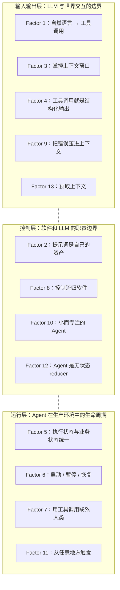

# 12-Factor Agents：把 LLM 应用从 Demo 拉进生产线的工程原则

## 学习目标

读完本文后，你应当能够：

- 说清 Agent Loop（智能体循环）在 70-80% 质量区间卡住的根本原因，并指出对应的工程层修复方向
- 把 12 条正式原则加 1 条荣誉提及映射到输入输出层、控制层、运行层三个层次，遇到具体问题时先定位层次再找 Factor
- 在团队从零搭建或迁移已有 LLM 应用时，按 P0→P4 顺序排出第一周的工程任务清单
- 区分「可压进上下文的瞬时错误」与「必须抛出的系统性错误」，并写出对应的判定代码
- 用无状态 reducer（归约函数）模式为关键 Agent 路径编写单元测试、集成测试和回放测试

阅读建议：第一遍按「核心判断 → 系统地图 → 一次真实任务穿过系统」读，先看清整体结构；第二遍按需跳到具体 Factor。文末「自检清单」可作为上线前的逐条核对表。

### 读者背景假设

本文假设读者已熟悉 LLM（大语言模型）的基本调用方式（如 OpenAI / Anthropic SDK 的 chat completion 接口）、Python 异步编程（`async/await`）、以及函数调用（function calling）的概念。代码示例用 Python 展示，但原则本身与语言无关。

若你是刚接触 LLM 应用的工程师，建议先读 [OpenAI Function Calling 指南](https://platform.openai.com/docs/guides/function-calling) 和 [Anthropic Tool Use 文档](https://docs.anthropic.com/en/docs/build-with-claude/tool-use)，对"模型如何输出结构化调用"有直观认识后再回来。若你已经在用 LangChain / CrewAI 等框架做过 demo，本文会帮你识别框架在哪些环节替你做了决策，以及这些决策何时该收回自己手里。

## 核心判断

用 LLM 做产品的团队，常常在两种走法之间反复。一种是把赌注押在万能 Agent 上：写一段 prompt、挂上工具集，让模型自己 loop 到目标。另一种是把 LLM 当成增强搜索，外面包厚厚一层 if-else 兜底。

humanlayer 创始人 Dex（Dexter Horthy）访谈 100 多个 SaaS 创始人之后，给出的判断很直接：**真正交付到生产用户手里的 LLM 软件，绝大多数是软件 + LLM 步骤的混合体，而不是纯 Agent。**

这个判断不是理论推演。每一条原则背后，都有一个具体的、让某个团队白干了几周的踩坑故事。比如有个团队用 LangChain 搭了客服 Agent，demo 跑得不错，一上生产就炸——用户问"我的订单状态"，Agent 调了知识库搜索、情感分析，最后才想起查订单表。问题不在模型不够聪明，而在工具设计和上下文组织。

12-Factor Agents 要解决的就是这类问题。它不教你"怎么搭 Agent"，而是帮你回答：

- 为什么 Agent 框架跑出来的 demo 停在 70-80% 后再也上不去？
- 从 demo 到生产级之间，缺的是模型能力还是工程结构？
- 不用框架、自己搭的话，先做哪一块？

仓库地址是 [github.com/humanlayer/12-factor-agents](https://github.com/humanlayer/12-factor-agents)，配套有视频讲解、脚手架 `npx/uvx create-12-factor-agent`、Discord 社区和开源参考实现 `got-agents/agents`。团队一般拿它做两件事：审视现有实现里哪些环节失控，以及指导新项目从第一行代码开始的结构。

## 目录

- [学习目标](#学习目标)
- [核心判断](#核心判断)
- [好 Agent 的本质是软件](#好-agent-的本质是软件)
- [系统地图](#系统地图)
- [一次真实任务穿过系统长什么样](#一次真实任务穿过系统长什么样)
- [逐条拆解](#逐条拆解)
- [如何落地](#如何落地)
- [与 12-Factor App 的呼应](#与-12-factor-app-的呼应)
- [常见翻车现场](#常见翻车现场)
- [常见问题](#常见问题)
- [自检清单](#自检清单)
- [练习题](#练习题)
- [自测题](#自测题)
- [进阶路径](#进阶路径)
- [12-Factor Agents 快速参考卡](#12-factor-agents-快速参考卡)
- [项目资源](#项目资源)

---

## 好 Agent 的本质是软件

要理解 12-Factor Agents，先看 Agent 在软件演化里的位置。路径很清晰：**软件 → DAG → Agent Loop**。

### 软件本质上是有向图

翻出你团队 CI/CD 里最复杂的那条流水线，数一数里面有多少个"步骤 A 完成后再跑步骤 B"的依赖。这就是 DAG（有向无环图）。过去二十年，Airflow、Prefect、Dagster、Inngest、Windmill 这些工具把 DAG 编排变成了一件可观测、可重试、可在 UI 上点两下就恢复的事——节点挂了能看到是哪个节点，跑崩了能从失败点重来，不用盯着终端手动补数据。

### Agent Loop 的承诺与现实

Agent 范式抛出一个看起来很省事的承诺：**让 LLM 自己决定路径，扔掉 DAG。** 工程师只提供"边"（可用的工具），模型在运行时决定走哪些"节点"。听上去不错——少写编排代码，LLM 说不定还能发现你没考虑到的解法，错误自动恢复。

但实际跑起来的 Agent Loop，核心就是这三步：

```python
# 简化版 Agent Loop
while not done:
    # 1. LLM 输出下一步要做什么
    next_step = await llm.decide(context)
    
    # 2. 确定性代码执行这个工具调用
    result = await execute(next_step)
    
    # 3. 执行结果追加进上下文窗口
    context.append(result)

# 重复，直到 LLM 判断"完成"
```

用 Python 完整写出来的话：

```python
from dataclasses import dataclass, field
from typing import Literal, Any, Callable
import json
from openai import AsyncOpenAI

@dataclass
class NextStep:
    intent: Literal["tool_call", "done"]
    tool: str | None = None
    args: dict[str, Any] = field(default_factory=dict)
    final_answer: str | None = None

class LLMClient:
    """基于 OpenAI SDK 的 tool calling 实现。"""

    def __init__(self, model: str, tools: dict[str, Callable]) -> None:
        self.client = AsyncOpenAI()
        self.model = model
        self.tools = tools

    async def determine_next_step(self, context: list[dict]) -> NextStep:
        response = await self.client.chat.completions.create(
            model=self.model,
            messages=context,
            tools=[{"type": "function", "function": {"name": name, "parameters": {"type": "object", "properties": {}}}} for name in self.tools],
        )
        choice = response.choices[0].message
        if choice.tool_calls:
            call = choice.tool_calls[0]
            return NextStep(intent="tool_call", tool=call.function.name, args=json.loads(call.function.arguments or "{}"))
        return NextStep(intent="done", final_answer=choice.content)

async def execute_step(step: NextStep, tools: dict[str, Callable]) -> dict:
    """确定性代码执行工具调用。"""
    handler = tools.get(step.tool or "")
    if handler is None:
        return {"status": "error", "reason": f"unknown tool: {step.tool}"}
    return {"status": "executed", "result": handler(**step.args)}

async def agent_loop(context: list[dict], llm: LLMClient, tools: dict[str, Callable]) -> str:
    while True:
        next_step = await llm.determine_next_step(context)
        context.append({"role": "assistant", "tool_call": next_step.tool, "args": next_step.args})
        if next_step.intent == "done":
            return next_step.final_answer or ""
        result = await execute_step(next_step, tools)
        context.append({"role": "tool", "name": next_step.tool, "result": result})
```

这套循环的天花板在 **70-80% 质量区间**。"质量"指端到端任务成功率——demo 跑 10 次有 7-8 次能通，剩下 2-3 次要么走偏要么卡死。再往上推，靠的是对循环中每一步的工程控制，模型本身已经给不出更多。

### 从 70% 到生产级的典型翻车路径

Dex 访谈 100 多个团队后发现了一条反复出现的轨迹：

1. 用 LangChain 或 CrewAI 搭一个 Agent demo
2. 跑出 70-80% 的成功率
3. 觉得差不多了，推到真实客户场景
4. 炸了。用户不接受"大多数时候对"
5. 开始逆向工程框架内部注入的 prompt、flow、状态管理
6. 发现框架替你做的决策恰好是你需要自己掌控的那部分
7. 从零重写

12-Factor Agents 要解决的问题不在"怎么搭 Agent"，而在**让重写这一步不用从零开始**。每条原则背后，都有一个具体的踩坑故事——比如有个团队发现 Agent 在生产环境里"卡住"了，查了半天是执行状态存在内存里，进程重启后全丢了。

---

## 系统地图

12 条正式原则加 1 条荣誉提及分布在三层上。这个分层不是执行流水线，而是**概念分类**——遇到问题先定位层次，再找对应 Factor。



三层各自管的事：

| 层次 | 管什么 | 核心工程问题 |
|------|--------|----------|
| **输入输出层** (F1, F3, F4, F9, F13) | LLM 看到什么、输出什么 | 上下文格式怎么设计？工具契约怎么定义？错误怎么反馈？ |
| **控制层** (F2, F8, F10, F12) | 谁来决定下一步 | prompt 所有权归谁？while loop 归谁写？Agent 粒度多大？ |
| **运行层** (F5, F6, F7, F11) | Agent 怎么在生产环境活下来 | 状态怎么持久化？人怎么介入？触发源有哪些？ |

**怎么用这个地图**：Agent 在生产环境里停了就再也恢复不了→运行层的问题（F5/F6）。LLM 总是调错工具→输入输出层的问题（F1/F4）。控制流逻辑散在 prompt 里到处都是→控制层的问题（F8/F12）。

把问题放对层次，就能找到对应的那条 Factor。

> **小技巧**：把这条系统地图截图贴在团队 Wiki 里，讨论 Agent 行为异常时先对层次，再翻正文。

## 一次真实任务穿过系统长什么样

下面用一个完整任务流把 12 条原则串起来。后续读每个 Factor 时，可以回到这张图确认"这条管的是哪个环节"。

**场景**：用户通过 Slack 消息要求部署后端服务的最新版本到生产环境。

```text
用户消息到达
 │
 ▼
[F11] 从 Slack webhook 触发，与用户在对话中相遇
 │
 ▼
[F13] 预取：拉取 Git tags、最近部署记录、变更日志
 │
 ▼
[F3] 构建上下文窗口：Slack 消息 + 预取数据打包为 XML 事件
 │
 ▼
[F1] LLM 输出结构化决策：{ "intent": "tool_call", "tool": "list_git_tags" }
 │
 ▼
[F4] 确定性代码执行 `git tag --list`，不是 LLM 在执行
 │
 ▼
[F9] 如果 `git tag` 失败 → 错误摘要压入上下文，LLM 决定重试或报告
 │
 ▼
[F8] 控制流归软件：LLM 选择工具，但 if/else / 循环由代码管理
 │
 ▼
[F7] 部署前需审批 → Agent 发 Slack "确认部署 v1.2.3 到生产？"
 │
 ▼
[F6] 等待审批时持久化状态、释放资源
 │
 ▼
[F7] 用户回复 "yes" → Agent 恢复执行
 │
 ▼
[F5] 部署过程中，执行状态和业务状态同一数据源追踪
 │
 ▼
[F2] 整个流程中，prompt 完全由团队自己的代码显式构建
 │
 ▼
[F10] 部署 Agent 只做部署，报告 Agent 只做报告，互不干扰
 │
 ▼
[F12] 整个 Agent 可作为纯函数回放：(状态, 事件) → 新状态
```

这个任务流贯穿了全部 12 条正式原则加 1 条荣誉提及（预取）。

---

## 逐条拆解

### Factor 1：自然语言 → 工具调用

用户说了一句人话，Agent 把它转成一次函数调用——这是整个 Agent 循环的起点，也是最容易被人忽视的一步。

用户说：

> "create a payment link for $750 to Terri for sponsoring the february AI tinkerers meetup"

Agent 应该输出：

```json
{
    "type": "function",
    "function": {
        "name": "create_payment_link",
        "parameters": {
            "amount": 750,
            "customer": "cust_128934ddasf9",
            "product": "prod_8675309",
            "price": "prc_09874329fds",
            "quantity": 1,
            "memo": "Hey Terri - see below for the payment link for the february AI tinkerers meetup"
        }
    }
}
```

之后代码接手：

```python
next_step = await llm.determine_next_step(
    [
        {"role": "user", "content": "create a payment link for $750 to Terri "
         "for sponsoring the february AI tinkerers meetup"}
    ]
)

if next_step.tool == 'create_payment_link':
    stripe.paymentlinks.create(**next_step.args)
    return
```

这一步的干净程度，决定了后续所有步骤的可靠性。

参数里的 `customer`、`product`、`price` 这些 ID 怎么来的？LLM 不会凭空生成。要么靠 Factor 13（预取）提前加载到上下文，要么靠 Factor 3（上下文工程）让 LLM 有足够信息做实体映射。Factor 1 的输出质量，取决于上游喂进去了什么。

模型在参数选择上反复出错时，先去查上下文里有没有足够的候选数据，别急着调 temperature 或换模型。LLM 的"理解"能力，很大程度由上下文工程决定。

---

### Factor 2：提示词是自己的资产

提示词要能 `git grep` 到、能在 code review 里被讨论、能单独跑回归测试——把它当代码管，而不是当配置项藏在框架底层。

大多数框架会在你不知道的情况下注入 system prompt——角色设定、行为约束、工具使用规则。三个后果：

- **行为不稳定**：框架升级后，注入的 prompt 变了，Agent 行为跟着变——而你根本不知道哪条规则变了。
- **难以复现**：同样的用户输入，因为框架内部状态不同，输出不同。
- **调试困难**：出问题时，你不知道这条指令来自你自己写的 prompt，还是框架在背后加进去的。

做法：**用 Git 管理 prompt 文件，在代码里显式构建完整的 prompt 字符串。** 哪怕底层 LLM 调用仍然用了某个框架，至少 prompt 的完整内容你能一键定位到。

排查 Agent 行为问题时，能不能在 5 分钟内定位到"哪段代码构建了这条 prompt"？做不到的话，prompt 就不算是你的资产。

如果一段 system prompt 超过 50 行，考虑把其中可独立验证的约束——比如"工具选择规则"和"输出格式规范"——拆成可 diff、可评分的小段。这跟常规软件里拆巨型函数是同一个道理。

---

### Factor 3：掌控上下文窗口

上下文窗口不是一块容量数字——它是 Agent 的视野。LLM 只看得到塞进窗口的东西，看不到的部分对它来说就不存在。怎么组织这些内容，直接决定了 Agent 的决策质量。

**标准消息格式的隐性成本。** 大多数 LLM 客户端默认用标准消息格式：

```json
[
    {"role": "system", "content": "You are a helpful assistant..."},
    {"role": "user", "content": "Can you deploy the backend?"},
    {
        "role": "assistant",
        "content": null,
        "tool_calls": [{"id": "1", "name": "list_git_tags", "arguments": "{}"}]
    },
    {
        "role": "tool",
        "name": "list_git_tags",
        "content": "{\"tags\": [{\"name\": \"v1.2.3\", \"commit\": \"abc123\"}]}",
        "tool_call_id": "1"
    }
]
```

这套格式有两个实际问题。第一，每个消息块有固定的元数据开销（role、tool_call_id 等），长对话中 token 消耗可观。第二，`role: tool` 的语义是给模型看的，不直观反映"这是哪一步、产生了什么数据"——对工程师不够可读，对模型来说也不一定是最优的注意力分配。

**自定义事件格式。** 12-Factor Agents 建议用 XML 风格的自定义格式，把每一步建模为事件：

```python
class Thread:
    events: List[Event]

class Event:
    type: Literal["list_git_tags", "deploy_backend", ...]
    data: Any

def event_to_prompt(event: Event) -> str:
    data = event.data if isinstance(event.data, str) else stringify_to_yaml(event.data)
    return f"<{event.type}>\n{data}\n</{event.type}>"

def thread_to_prompt(thread: Thread) -> str:
    return '\n\n'.join(event_to_prompt(e) for e in thread.events)
```

这样每个上下文窗口看起来像：

```xml
<slack_message>
 From: @alex
 Channel: #deployments
 Text: Can you deploy the latest backend to production?
</slack_message>

<list_git_tags_result>
 tags:
 - name: "v1.2.3"
 commit: "abc123"
 - name: "v1.2.2"
 commit: "def456"
</list_git_tags_result>

what's the next step?
```

XML 标签直接标记了信息边界，模型更容易定位相关内容，降低"中间丢失"（lost in the middle）效应。对工程师来说，事件结构本身就是调试信息——直接看到每一步的类型和数据，不需要在 JSON 嵌套里翻。

RAG、跨会话记忆、Schema 对齐解析（BAML 等工具）这些技术各管一段数据供给，但有一条前提不变：**上下文的构建方式必须完全由你控制**，否则你永远没法系统性地优化 token 效率和注意力分配。

每次做上下文裁剪时，先删掉"已被后续步骤取代的信息"。比如第 3 步生成了部署报告，那第 1 步的原始 build log 大概率不再需要留在窗口里。上下文工程的关键是"这一轮 LLM 真正需要看到什么"，不是看能塞多少 token。

---

### Factor 4：工具调用就是结构化输出

Function Calling、Structured Outputs（JSON Mode）、约束解码——这三件事解决的是同一个问题：让 LLM 输出特定格式的结构化数据。Agent 只是其中一种用法，不是专属特性。

想清楚一件事能解开一个常见心结：给 LLM 挂一个工具，本质上只是在要求它以某种格式输出数据；真正执行工具的是你自己的代码，LLM 只负责决定"调哪个、参数填什么"。

工具设计要按 API 设计的标准做——参数类型、校验逻辑、错误返回格式，这些和普通软件工程里的 API 设计没有区别。Agent 行为不稳定时，第一步排查的应该是"工具定义是否清晰"和"上下文里是否有足够信息让 LLM 做参数选择"，而不是去调 temperature。

常见反模式：给 LLM 挂了 20 个工具，每个工具的参数描述含糊，然后怪模型不够聪明。人类工程师拿到 20 个文档不全的 API，也未必能在一轮对话里准确选出该调哪个、参数该怎么填。

工具返回值的格式同样影响 Agent 质量。返回一个 5KB 的 JSON blob 不如返回一个被精心裁剪的结构体——只包含 LLM 做下一步决策需要的字段。工具设计是双向的：输入参数设计 + 输出格式设计，缺一不可。

---

### Factor 5：执行状态与业务状态统一建模

Agent 跑起来之后，会自然长出两套状态。一套是执行历史——哪些步骤完成了、当前在哪一步；另一套是业务状态——订单状态、用户资料、审批结果。大多数实现会在不知不觉中把它们分开维护：执行状态塞在 Agent 进程的内存里，业务状态存在数据库里。

分开维护的直接后果：Agent 重启后执行状态丢失，但数据库里显示"订单已创建，后续步骤没执行完"。这种不一致是 Bug 的温床。

正确的做法是把执行状态也当成业务状态的一部分。用单一数据源——PostgreSQL 一行、Redis 一个 key、一条事件溯源日志——同时描述"任务当前在哪里"和"业务当前是什么状态"。这是 Factor 6（暂停 / 恢复）的技术前提：一个序列化不完整的 Agent 根本没法恢复。

一个电商团队的客服 Agent 踩过这个坑（参见 Dex 访谈记录）：执行状态存在内存里，业务状态存在订单表里。某次部署重启后，Agent 丢了执行状态，但订单表显示"已退款"——Agent 重复执行了退款操作。修复方案是把 `agent_tasks` 表和 `orders` 表放在同一个事务里，Agent 每完成一步就更新两张表的状态字段。

具体实现上，一种常见模式是在业务数据库里加一张 `agent_tasks` 表，字段包含 `id`、`status`、`current_step`、`events_json`（Factor 3 的 Thread）和 `business_entity_id`（关联业务实体）。Agent 重启时从这张表读取最后的状态就能继续。

---

### Factor 6：启动 / 暂停 / 恢复（Launch/Pause/Resume with simple APIs）

Agent 暂停和恢复在生产环境里是基本要求——只要 Agent 需要等待人工审批、外部 webhook 回调、或长耗时异步操作，没有这套机制就只能让进程空转占着资源。"启动"同样重要：Agent 的入口要能从任意事件触发（见 Factor 11），而不是硬编码成"用户发了一条消息"。

典型场景：

- 部署 Agent 发起了部署请求，需要等 CI/CD 系统返回结果
- 客服 Agent 遇到退款超过阈值，需要主管审批
- 服务器重启或进程崩溃，Agent 需要从上次中断的地方继续

实现手段上，把 Agent 的执行状态序列化到持久化存储，通过简单 API 做 save/load。Factor 5（统一状态）让这件事变成可能——如果执行状态和业务状态是同一套 schema，序列化和恢复就只是一次数据库读写。

容易被忽略的细节：**恢复时上下文窗口的重建。** 暂停时只存了"执行到第 3 步"这个元信息，却没有存前 3 步产生的完整 Thread 事件列表，恢复后 LLM 看到的是一个残缺的对话历史。正确做法是把整个 Thread（Factor 3 的事件列表）作为状态的一部分持久化。

恢复逻辑的伪代码：

```python
def resume_agent(task_id: str) -> str:
    task = db.get_task(task_id)
    if task is None:
        raise TaskNotFound(task_id)

    state = State.from_dict(task.state_snapshot)
    thread = Thread(events=task.events)

    return run_agent_loop(state, thread)
```

关键约束：`task.state_snapshot` 和 `task.events` 必须在同一个事务里写入，否则恢复后的状态和事件列表可能不匹配。

---

### Factor 7：用工具调用联系人类

Agent 卡住时无非两种结局：乱猜一个答案，或者卡死不动。Factor 7 给的是第三种选择——主动找人帮忙，而且用跟调用任何工具完全相同的机制。

```json
{
    "type": "function",
    "function": {
        "name": "contact_human",
        "parameters": {
            "reason": "退款金额 $5,000 超出客服自主审批上限 $1,000",
            "context": {
                "order_id": "ord_12345",
                "customer_tier": "enterprise",
                "refund_requested": 5000
            },
            "channel": "slack",
            "target": "#ops-escalations"
        }
    }
}
```

Agent 通过同一套工具调用机制与人类交互，不需要为"人机协作"单独开一条异常处理分支。从代码角度看，`contact_human` 和 `create_payment_link` 是同一类东西——Agent 发出一个函数调用，代码去执行。区别只在前者的"执行"是发一条 Slack 消息然后阻塞等待回复。

工程细节：`contact_human` 的回复格式同样需要结构化。与其让人类打一段自然语言塞回上下文，不如给审批人几个按钮选项——"批准 / 拒绝 / 需要更多信息"——每个选项映射到标准化的回复结构。这样 LLM 在恢复执行时看到的是结构化的审批结果，而不是一段需要再次解析的自由文本。

---

### Factor 8：控制流归软件，不归 LLM

控制流——"什么时候做什么、什么条件下跳转、什么情况下终止"——写在代码里。LLM 只负责单步决策：选哪个工具、填什么参数。

LLM 应用的架构应该长这样：系统骨架由代码定义（DAG、状态机、if/else），模型在骨架约束下执行具体步骤——这段文字怎么写、这几个参数填什么。

容易搞混的一点：Factor 8 并没有禁止 LLM 参与决策。LLM 当然可以决定"下一步调用哪个工具、参数是什么"（那是 Factor 1 的范围）。Factor 8 划的是一条更硬的边界：**决定什么时候停下来、什么时候重试、什么时候升级到人工处理的逻辑，写在代码里，不写在 prompt 里**。

在 while loop 的外层用代码控制终止条件：

```python
MAX_ITERATIONS = 25
iteration = 0

while iteration < MAX_ITERATIONS:
    next_step = await llm.determine_next_step(context)

    if next_step.intent == "done":
        return next_step.final_answer

    if next_step.tool in CRITICAL_TOOLS:
        require_human_approval(next_step)

    result = await execute(next_step)
    context.append(result)
    iteration += 1

raise MaxIterationsExceeded(f"Agent did not finish within {MAX_ITERATIONS} steps")
```

到了 Factor 8，DAG 换了一种形式回到 Agent 架构里：工作流引擎编排 Agent 节点，Agent 节点内部调用 LLM。这一次，节点是 LLM 调用，边是代码逻辑。

---

### Factor 9：把错误压进上下文窗口

传统的异常处理是：出错 → 抛异常 → 中断 → 等人来修。这套模式在 Agent 场景下代价很高——每次中断都意味着之前积累的上下文、状态和进度全丢了。

另一种做法是把错误压缩进上下文，让 loop 继续，由模型决定如何处理。

压缩方式是把原始错误转换为结构化摘要，而不是把整个 stack trace 塞进 context window：

```json
{
    "error_type": "api_rate_limit",
    "source_tool": "fetch_github_issues",
    "retry_after_seconds": 60,
    "affected_parameters": {"repo": "org/repo", "since": "2026-05-01"},
    "suggested_action": "retry_after_wait"
}
```

LLM 拿到这条摘要后可以做多种决策：等待后重试、换一个 API endpoint、跳过这步用已有数据继续、升级到人工处理。LLM 拿到了选择权，可恢复的错误不再直接中断整条 loop。

**边界判断**：错误该不该压进上下文，看的是"LLM 重新决策能不能改变结果"。API 限流、临时超时、数据格式不匹配——这些 LLM 有可能通过换策略来绕过，压进去让它自己判断。API key 失效、数据库连接断了——重试不会改变结果，走传统异常抛出。区分这两类的逻辑本身就是一段代码：凡是 `error_type` 在 `RECOVERABLE_ERRORS` 集合里的进上下文，其余抛出。

---

### Factor 10：小而专注的 Agent

一个 Agent 同时做"处理支付 + 回答用户问题 + 写报告"，每个环节都会做得更差。这和单一职责原则一脉相承——但 Agent 场景下有额外的硬理由。

把"一个大 Agent 做 10 件事"和"5 个小 Agent 各做 2 件事"放在一起对比，差异是具体的：

- **上下文长度**：大 Agent 要把 10 个场景的说明塞进同一个 system prompt，小 Agent 每个只装载自己那 2 个场景的说明。
- **工具数量**：大 Agent 挂 20+ 个工具，每轮要在 20 个候选里做选择；小 Agent 每个 5 个以内。
- **测试难度**：大 Agent 改一处 prompt 可能影响 10 个场景的回归；小 Agent 改一个只跑它自己的测试套件。
- **故障半径**：大 Agent 一个幻觉可能把支付逻辑带偏；小 Agent 支付出问题不会污染报告。

这四条加起来，决定了大 Agent 在 70% 之后每提升 1% 都要付出更高的边际成本。每多一个场景，回归测试就要多覆盖一条路径，prompt 调整的影响面也跟着扩大。

LLM 的注意力是有限资源。system prompt 越长、工具列表越长、上下文越复杂，模型在每件事上分配的注意力就越少。一个"万能 Agent"的 system prompt 可能写满 3 页，覆盖 8 种业务场景，挂 30 个工具——结果是模型在每种场景下平均只能分到 12.5% 的注意力，任何边缘情况都可能触发跳场景的幻觉。

拆分时可以参考三个方向：

- **按功能域拆**：支付 Agent、客服 Agent、报告 Agent、部署 Agent，各自有独立的 prompt 和工具集
- **每个 Agent 有明确的输入 / 输出契约**：进什么格式的事件，出什么格式的结果
- **通过消息总线或共享状态协调**：Agent 之间不直接调用，避免形成不可追踪的依赖链

拆得够细的话，每个 Agent 的 system prompt 可以控制在半页以内，工具列表不超过 5 个。这个量级下模型注意力更集中，出问题时一看就知道是哪个 Agent 的哪段 prompt。

什么时候该拆？**发现自己正在往某个 Agent 的 system prompt 里加"如果用户问的是 X 类问题，则……"这种场景分叉逻辑时**。场景分叉不应该用 prompt 里的 if-else 来处理，应该由路由层（一段代码）根据用户意图把请求分发到对应的 Agent。

---

### Factor 11：从任意地方触发，在用户所在的地方相遇

Agent 应该能从 webhook、cron 定时任务、用户消息、API 调用、CI/CD 事件等任意入口触发，把结果推送到用户已经在用的渠道里——Slack、邮件、IDE、Dashboard——不需要用户专门打开一个 Agent 界面。

这不只是产品体验问题，它有硬工程含义：**Agent 的入口和出口必须解耦。** 入口逻辑不应该假设"用户一定会通过 HTTP POST 发 JSON"，出口逻辑也不应该假设"用户当前一定在 Web 页面前等着"。今天从 Slack 触发、输出到 Slack；下个月加一个 cron 触发、输出到邮件——Agent 核心逻辑不感知这些变化。做法是定义两个接口——`Trigger`（带 `source` 和 `payload`）和 `Delivery`（带 `channel` 和 `recipient`）——Agent 内核只依赖这两个接口。

---

### Factor 12：把 Agent 做成无状态 reducer

把 Agent 建模为无状态 reducer——`(状态, 事件) → 新状态`——而不是"有记忆的活物"。

```python
from dataclasses import dataclass, field
from typing import Any, Callable, Protocol

@dataclass
class Event:
    """上下文窗口中的一个事件，对应 Factor 3 的自定义事件格式。"""
    type: str
    data: Any = None

@dataclass
class State:
    """Agent 的可序列化状态，同时承载执行状态与业务状态（Factor 5）。"""
    context: list[Event] = field(default_factory=list)
    done: bool = False
    final_answer: str | None = None

    def append(self, event: Event) -> "State":
        return State(context=self.context + [event], done=self.done, final_answer=self.final_answer)

    def mark_done(self, final_answer: str) -> "State":
        return State(context=self.context, done=True, final_answer=final_answer)


class LLMClientProtocol(Protocol):
    """LLM 客户端协议，determine_next_step 返回结构化决策（见 Factor 1）。"""

    async def determine_next_step(self, context: list[Event]) -> Any: ...


async def agent_step(
    state: State,
    event: Event,
    llm: LLMClientProtocol,
    tools: dict[str, Callable],
) -> State:
    """单步 reducer：(state, event, deps) → new_state。"""
    next_step = await llm.determine_next_step(state.context)
    if next_step.intent == "tool_call":
        handler = tools.get(next_step.tool or "")
        result = handler(**next_step.args) if handler else {"error": f"unknown tool: {next_step.tool}"}
        return state.append(event=Event(type="tool_result", data=result))
    elif next_step.intent == "done":
        return state.mark_done(final_answer=next_step.final_answer or "")
    else:
        return state
```

无状态 reducer 让四件事变成可能：

- **可测试**：给定相同的 State 和 Event，输出总是相同——不依赖 Agent 内部是否有"记忆"。可以为关键路径写标准单元测试：构造一个 State（含特定上下文），输入一个 Event，断言输出的 State 是正确的。
- **可回放**：存下所有事件后，在任何时间点重放，重现当时的决策过程。排查生产事故时逐帧回放每一步的输入输出，靠代码还原 Agent 当时做了什么，而不是靠猜。
- **可 Fork**：同一个状态可以 fork 出多个并行执行路径。比如同时尝试两种不同的工具选择策略，比较结果后再决定走哪条路。在代码生成 Agent 尝试多种实现方案的场景里尤其有用。
- **可调试**：整个执行轨迹是确定性的。每一步的输入输出都可以看，不存在"Agent 脑子里在想什么"的模糊空间。

Factor 8 把 while loop 的终止条件、重试次数、人工升级写在 `agent_loop` 函数体里；Factor 12 把每一步的状态变更建模为 `agent_step(state, event) -> new_state` 的纯函数调用。两者落地后，Agent 的执行轨迹变成一串可序列化的 State 对象，每一步的输入输出都能在日志里查到——LLM 的职责收窄到单步选工具、填参数，控制权回到代码手里。

测试策略推荐三层：

1. **单元层**：给 `agent_step` 传入固定的 `State` 和 `Event`，断言返回的 `State` 正确。这里要 mock LLM 的返回。
2. **集成层**：跑一遍完整的事件序列，用真实 LLM 调用，断言最终状态和关键中间状态符合预期。
3. **回放层**：把生产环境采集的事件序列灌入 `agent_step`，对比重放结果和实际结果。有偏差，说明代码逻辑有非确定性因素需要排查。

---

### Factor 13（荣誉提及）：预取上下文

在用户发出请求之前，就预取所有可能需要的上下文。和 Web 性能优化里的预加载一样：不等用户点击，提前把可能需要的数据拉进上下文窗口。

回到 Factor 1 的例子：LLM 凭什么知道 `customer_id` 是 `cust_128934ddasf9`？因为当用户开始打开支付表单时，后台 Agent 已经预取了该用户的 Stripe customer ID、常用 product ID、历史支付偏好。用户提交的那一刻，Agent 的上下文窗口里已经有了完整信息，不需要额外轮次去查。

在需要严格响应时间的场景里（用户期望秒级回复），没有预取意味着 Agent Loop 至少要多跑 2-3 轮去查数据，每轮都有网络延迟和推理延迟叠加。这属于基础设施投入，不是可选项。

预取的内容可以按用户会话的上下文来判断：用户打开了哪个页面、最近的操作是什么、历史偏好是什么。把这套逻辑写成一段代码，放在 Agent Loop 启动之前执行，而不是让 LLM 在 Loop 内部决定"我还需要查什么数据"。

---

## 如何落地

### 采用路线图

团队从 0 构建 AI 产品时，建议按下面的顺序推进：

| 优先级 | 时机 | 先做 | 理由 |
|--------|------|------|------|
| **P0** | 第一周 | Factor 2（Own your prompts）+ Factor 3（Own your context window） | 决定后续所有优化的自由度。prompt 不是你的资产，你连调都调不了；上下文格式不受控，所有 token 优化都是白做。 |
| **P1** | 第二周 | Factor 1（NL→Tool Calls）+ Factor 4（Tools = Structured Outputs） | 把 LLM 怎么输出结构化数据这件事定下来。所有工具调用的基础。 |
| **P2** | 第三周 | Factor 8（Own control flow）+ Factor 12（Stateless reducer） | 画出控制流骨架，把 Agent 建模为 reducer。此后每条路径都能写单元测试和回放测试。 |
| **P3** | 第四周 | Factor 5（Unify state）+ Factor 6（Launch/Pause/Resume） | 让 Agent 在真实环境中活下来——重启不丢状态、等待后能恢复。 |
| **P4** | 按需 | Factor 7（Contact humans）、Factor 9（Compact errors）、Factor 10（Small agents）、Factor 11（Trigger anywhere）、Factor 13（Pre-fetch） | 这些是从 90% 做到 99% 的原则。早期不必全上，但每条都对应一类踩坑场景。 |

团队在已有产品里嵌入 AI 能力（而不是从零做 Agent）时，顺序要倒过来：先从 Factor 11（Trigger anywhere）和 Factor 7（Contact humans）入手。原因是现有产品已经有触发源和用户渠道，而且人机协作的边界通常是首先要厘清的问题——这两条不先定下来，后面所有工程结构都会被"什么时候该问人"这种悬而未决的问题拖着走。

### 什么时候这套原则边际收益递减

- **原型 / Demo 阶段**：目标是快速验证想法，用 LangChain 或直接调 API 足够。这套原则的收益在需要稳定交付给用户时才显现。
- **模型能力远超任务复杂度时**：LLM 只做文本分类或结构化提取，没有多步循环，大部分原则用不上。
- **纯研究 / 探索性项目**：目标是看看模型能做到什么，做可靠产品不在议程上，工程约束反而是负担。

### 这套原则不覆盖什么

作者 Dex 明确划分了几个话题边界：

- **MCP（Model Context Protocol）**：不讨论。MCP 是工具发现和调用的协议层，12-Factor Agents 是 Agent 工程的设计层——可以在这套原则上实现 MCP 客户端，但原则本身不绑定任何协议。
- **框架对比**：不涉及 LangChain vs LangGraph vs CrewAI 的横向评测。它告诉你好框架为什么好，但不帮你选框架。
- **模型训练 / Fine-tuning**：假设使用现有模型，聚焦工程层面的优化。

---

## 与 12-Factor App 的呼应

熟悉 Heroku 在 2011 年提出的 [12-Factor App](https://12factor.net/) 的话，会看到命名上的致敬——但这个致敬不是表面上的。两套原则在状态外置、依赖显式、配置可控这几件事上走的是同一条路：

| 12-Factor App | 12-Factor Agents | 共通逻辑 |
|---------------|------------------|----------|
| 代码库一份，多次部署 | Factor 12：Agent 是无状态 reducer | 状态外置，计算逻辑无状态 |
| 依赖显式声明 | Factor 2：Own your prompts | 输入资产显式追踪，不隐式依赖外部 |
| 配置存储在环境变量 | Factor 3：Own your context window | 运行时数据注入方式可控 |
| 进程无状态且不共享 | Factor 5：统一状态 + Factor 10：小 Agent | 独立、可替换、状态外部化 |

2011 年 Heroku 提出 12-Factor App 的时候，配置外置、依赖显式、进程无状态这些做法还不是共识。后来它们成了云原生的默认前提——原因不在理论高深，而在照着做的人确实少踩了坑。12-Factor Agents 在 LLM 应用上做的是同一件事：把 prompt 构建位置、上下文格式、控制流归属、状态持久化这些原本被框架藏起来的决策，逐条摆到桌面上，交给团队自己掌控。

---

## 常见翻车现场

### 翻车 1：把 Agent Loop 当成系统架构

"我们用了 Agent，所以不需要设计工作流。"

Agent Loop 只解决"模型怎么调工具"这一层的问题。业务流程该怎么编排，还得另外设计。把它当应用架构用，等于把 if/else 全交给概率模型——出问题时你不知道是该修 prompt 还是该修代码。

### 翻车 2：工具挂太多

一个 Agent 挂了 15 个工具，system prompt 写了 2 页。用户问"我的订单状态是什么"，Agent 先调了知识库搜索、又调了情感分析、最后才想起查订单。

工具多不等于能力强。每多一个工具都在稀释 LLM 的注意力预算。控制在 5 个以内，超出就拆 Agent。

### 翻车 3：上下文窗口当垃圾桶

"反正模型支持 128K，全塞进去。"

上下文窗口越大，模型的注意力越容易被无关信息分散。"中间丢失"（lost in the middle）是已知现象：LLM 对窗口中间位置的文本关注度显著低于开头和结尾。上下文工程的核心是"优先保留什么、大胆丢弃什么"，不是把 128K token 全部塞满。

### 翻车 4：状态只存在内存里

Agent 的所有进度存在一个 Python 进程的局部变量里。进程重启后用户问"上次的任务怎么样了"，Agent 说"什么任务？"

这是 Factor 5 和 Factor 6 要解决的问题——但大多数团队在第一起生产事故之前不会想到要做。

### 翻车 5：指望模型升级来解决架构问题

"GPT-5 出来之后这些问题自然就没了。"

模型升级会提高单步决策的准确率，但状态管理、控制流归属、人机协作边界这些架构问题跟模型智商无关。更聪明的模型让单步决策更准，但 while loop 的上限、暂停恢复机制、状态持久化——这些都还是得自己做。

---

## 常见问题

### Q1：12-Factor Agents 和 LangChain / LangGraph / CrewAI 是什么关系？

12-Factor Agents 给的是一份设计清单，团队拿着它审视自己的实现缺哪一块；它不提供任何运行时，也不替你做框架选型。你可以用这些原则审视 LangChain 实现——比如检查 prompt 是否被框架隐式注入（Factor 2）、控制流是否归代码（Factor 8）。如果框架挡住了某条原则的落地，那就是该考虑换框架或自己搭的信号。

### Q2：12 条正式原则加 1 条荣誉提及必须全做完才能上线吗？

不必。采用路线图里 P0-P3 是从 0 到能稳定交付的最小集合，P4 是从 90% 做到 99% 的增量。原型阶段甚至可以全部跳过——原则的收益在需要稳定交付给真实用户时才显现。

### Q3：已经用了框架，怎么迁移？

不要一次性重写。先做 Factor 2（把 prompt 从框架里抠出来，用 Git 管理）和 Factor 3（把上下文格式从框架默认改为自定义事件格式）。这两步不动业务逻辑，但能让你看清当前实现里哪些行为是框架注入的、哪些是你自己写的。看清之后，再决定哪些环节需要按 Factor 8 / Factor 12 重构。

### Q4：Agent Loop 上限设多少合适？

取决于任务复杂度和单步成本。Dex 在参考实现里用的是 25 步（参见 `got-agents/agents` 仓库 `examples/` 目录下的客服与部署示例），覆盖大多数客服、部署、数据处理场景。如果任务天然需要更多步骤（比如代码生成 Agent），考虑拆成多个小 Agent（Factor 10）串联，而不是把单 Loop 上限拉到 100。

### Q5：无状态 reducer 怎么处理需要调用真实 LLM 的场景？

`agent_step` 函数内部仍然调用 LLM，但 LLM 调用的输入完全由传入的 `State` 决定，输出被封装成新的 `State` 返回。测试时 mock 掉 LLM 调用，就能验证 reducer 逻辑本身是否正确。集成测试和回放测试再覆盖真实 LLM 调用的部分。

### Q6：自定义事件格式和标准消息格式能不能混用？

技术上可以，但不建议。混用会让上下文工程失去一致性——你既要在 JSON 嵌套里翻工具调用结果，又要在 XML 标签里找用户消息。Factor 3 推荐的是把所有上下文统一建模为事件，包括用户消息、工具调用、工具返回、错误摘要。统一格式后，裁剪、压缩、回放逻辑都只针对一种数据结构。

### Q7：Agent 在生产环境里"卡住"了，怎么排查？

按层次定位。先看运行层：进程是否还在、是否在等外部回调（Factor 6 的暂停状态有没有正确写入）。再看控制层：是否触发了 `MAX_ITERATIONS` 上限但没正确抛出（Factor 8）。最后看输入输出层：上下文窗口是否被错误摘要塞爆（Factor 9），或工具返回值过大导致 LLM 注意力分散（Factor 4）。常见根因是 Factor 5 没做好——执行状态没落库，进程重启后状态丢失，Agent 不知道自己停在哪一步。

### Q8：LLM 输出的工具调用参数不符合 schema，怎么办？

不要在 prompt 里反复强调格式。工具定义层用 JSON Schema 或 Pydantic 做严格校验，参数不合规直接返回结构化错误（Factor 9 模式）让 LLM 重试。这步解决的是"不让错误参数通过"。然后回到 Factor 3 检查上下文里是否给了 LLM 足够的候选值——如果 LLM 看不到 `customer_id`，它只能猜，猜错不是模型的问题。

### Q9：多 Agent 协作时，状态怎么传递？

不要让 Agent 之间直接共享内存。Factor 10 要求 Agent 之间通过消息总线或共享状态协调，Factor 5 要求状态统一持久化。具体做法：每个 Agent 完成自己的 reducer 步骤后，把输出事件写入共享的 `agent_tasks` 表（或消息队列），下一个 Agent 从队列里取事件作为自己的输入。这样每个 Agent 仍然是无状态 reducer（Factor 12），整体协作链路可回放、可调试。

### Q10：迁移到 12-Factor Agents 时，怎么衡量收益？

定三个基线指标：第一，端到端任务成功率（从 70% 提升到 90%+ 通常需要 P0-P3 全部落地）；第二，平均调试时间（能在 5 分钟内定位 prompt 构建位置，对比之前在框架代码里翻找）；第三，生产事故恢复时间（Factor 5 + Factor 6 落地后，进程重启不再等于任务丢失）。三项指标都没动的话，回到自检清单逐条核对。

---

## 自检清单

Agent 正准备上线时，逐条过一遍：

- [ ] 能在 5 分钟内定位到任意一条 prompt 在代码里的构建位置？（Factor 2，答否→回读 [Factor 2](#factor-2提示词是自己的资产)）
- [ ] 上下文窗口的格式完全由你自己的代码控制，不依赖框架的隐藏注入？（Factor 3，答否→回读 [Factor 3](#factor-3掌控上下文窗口)）
- [ ] 进程重启后，Agent 能从上次中断的地方继续吗？（Factor 5 + Factor 6，答否→回读 [Factor 5](#factor-5执行状态与业务状态统一) 与 [Factor 6](#factor-6启动--暂停--恢复)）
- [ ] 每个 Agent 的 system prompt 能控制在半页以内、工具不超过 5 个吗？（Factor 10，答否→回读 [Factor 10](#factor-10小而专注的-agent)）
- [ ] 控制流逻辑（终止条件、重试次数、升级人类）是写在确定性代码里，不是写在 prompt 里？（Factor 8，答否→回读 [Factor 8](#factor-8控制流归软件)）
- [ ] 给定相同的事件序列，Agent 能复现相同的决策路径吗？（Factor 12，答否→回读 [Factor 12](#factor-12agent-是无状态-reducer)）
- [ ] 遇到可恢复错误时，Agent 是自己决策怎么处理，还是直接中断？（Factor 9，答否→回读 [Factor 9](#factor-9把错误压进上下文)）
- [ ] 需要人工介入时，是否通过统一的工具调用机制而不是硬编码的异常分支？（Factor 7，答否→回读 [Factor 7](#factor-7用工具调用联系人类)）

以上有超过 2 个答案为"否"的话，回到对应的 Factor 先修，再推进其他功能。

---

## 练习题

### 练习 1：错误分类与上下文压缩

给定以下三个 Agent 运行时遇到的错误，判断每个应该走 Factor 9（压进上下文让 LLM 决策）还是传统异常抛出，并写出对应的处理伪代码。

1. 调用 Stripe API 创建支付链接时返回 429（rate limit），响应头里带 `Retry-After: 30`
2. 数据库连接池耗尽，所有写入操作超时
3. LLM 输出的工具调用参数里 `customer_id` 字段类型为字符串，但 schema 要求是 UUID 格式

参考思路：第 1 个是可恢复的瞬时错误，压进上下文让 LLM 决定等待重试或换 endpoint；第 2 个是系统性错误，重试不会改变结果，应该抛异常触发告警；第 3 个介于两者之间——可以先走 Factor 9 让 LLM 看到校验错误后重试，但如果连续重试 3 次仍失败，升级为传统异常。

### 练习 2：为现有 Agent 补 reducer 测试

找一个你之前用框架（LangChain / CrewAI / 自写）做的 Agent，完成以下步骤：

1. 把 Agent 的单步逻辑提取成 `agent_step(state: State, event: Event, llm, tools) -> State` 的签名
2. 写一个单元测试：构造一个包含 3 个事件的 State，mock 掉 LLM 返回，断言 `agent_step` 的输出 State 正确
3. 把生产环境采集的一段真实事件序列（至少 10 个事件）灌入 reducer，记录每一步的 State 快照

完成后回答：你的 Agent 在第几步出现了非确定性？是 LLM 调用本身的不确定性，还是代码里混入了时间戳、随机数、全局变量等隐藏状态？

参考答案要点（自评检查清单）：

1. **签名是否真的纯函数**：`agent_step` 内部除了 LLM 调用，有没有读取 `datetime.now()`、`random.random()`、环境变量、全局缓存？这些都要么 mock 掉、要么作为参数显式传入
2. **State 是否可序列化**：能否 `json.dumps(state)`？如果 State 里塞了数据库连接对象、文件句柄，说明状态建模还没收敛——回 Factor 5 重做
3. **单元测试覆盖度**：3 个事件至少覆盖"工具调用成功""工具调用失败重试""Agent 主动终止"三种路径，缺一种就补
4. **回放测试的快照对比**：10 个事件灌完，每步 State 快照是否与生产日志一致？不一致的步骤通常是 LLM 调用那步——记录 `model`、`temperature`、`seed`，下次回放前固定
5. **非确定性来源定位**：若 LLM 调用本身不稳定，把 `temperature` 降到 0 并固定 `seed` 再跑一次；若仍有差异，检查 prompt 里是否混入了动态内容（如"当前时间"）

---

## 自测题

读完本文后，先自己想 30 秒再展开答案：

<details>
<summary>1. Agent Loop 在 70-80% 质量区间卡住，通常缺的是模型能力还是工程结构？给出判断依据。</summary>

缺的是工程结构。判断依据：同一个模型在 demo 里能跑通 70%，说明能力上限不是瓶颈；卡在 70-80% 通常是因为上下文窗口失控（Factor 3）、错误没压进上下文（Factor 9）、控制流写在 prompt 里导致不可观测（Factor 8）。换更强的模型只能把上限从 80% 推到 85%，工程结构修好后能从 80% 推到 95%+。
</details>

<details>
<summary>2. 把 12 条原则映射到输入输出层、控制层、运行层，遇到"Agent 跑着跑着上下文越来越长"该定位到哪一层？</summary>

输入输出层（Factor 3：掌控上下文窗口）。上下文膨胀是 LLM 看到什么、输出什么的问题，不是控制流或运行生命周期的问题。修复方向：自定义事件格式（删掉中间步骤的完整响应，只保留摘要）、设上下文窗口硬上限、用 Factor 13 预取替代全量加载。
</details>

<details>
<summary>3. "可压进上下文的瞬时错误"与"必须抛出的系统性错误"的判定边界是什么？各举一例。</summary>

判定边界：错误是否可通过 LLM 重新决策来恢复。可恢复→压进上下文（Factor 9）；不可恢复→抛异常。瞬时错误例：API 限流 429（等一会儿重试可能成功）；系统性错误例：数据库连接池耗尽（重试不会改变结果，需要人工介入扩容）。中间地带：参数校验失败先压进上下文让 LLM 重试，连续 3 次失败再升级为异常。
</details>

<details>
<summary>4. 无状态 reducer 模式下，Agent 的"记忆"存在哪里？为什么这样设计？</summary>

记忆存在 `State` 对象里，作为 `agent_step` 的输入和输出，不存于函数内部闭包或全局变量。设计原因：State 可序列化（Factor 5）、可持久化（Factor 6）、可回放测试（Factor 12）。进程崩溃后从持久化的 State 恢复，测试时 mock 掉 LLM 调用即可验证 reducer 逻辑。
</details>

<details>
<summary>5. 团队从零搭建 Agent，第一周的工程任务清单怎么排？</summary>

按 P0→P4 顺序：P0 先做 Factor 2（prompt 进 Git）+ Factor 3（自定义上下文格式）+ Factor 8（控制流写代码里），这三步不动业务逻辑但能让你看清现状；P1 做 Factor 12（reducer 化）+ Factor 9（错误压上下文），建立可测试基础；P2 做 Factor 5 + Factor 6（状态持久化与恢复）；P3 做 Factor 7（人工介入通道）+ Factor 10（拆小 Agent）；P4 做 Factor 11（触发源扩展）+ Factor 13（预取优化）。
</details>

---

## 进阶路径

读完本文后，按以下顺序动手操作，而不是只按阅读顺序：

### 第一步：跑通一个最小 Agent（预计 2-3 小时）

1. 安装依赖：`pip install openai`
2. 申请 OpenAI API Key（或本地跑 Ollama）
3. 把本文「Agent Loop 的承诺与现实」节的 Python 代码抄进本地文件 `minimal_agent.py`
4. 把 `AsyncOpenAI()` 替换成你的实际 client 调用
5. 运行：`python minimal_agent.py`
6. 预期结果：输入"查一下订单 ORD-001 的状态"，Agent 至少尝试调用一次工具

**验证标准**：Agent 能完成一轮 tool_call → execute → append 的循环，不抛未捕获的异常。

### 第二步：对照 got-agents/agents 做差异分析（预计 1 小时）

1. `git clone https://github.com/got-agents/agents.git`
2. 打开 `examples/customer-support/` 目录
3. 对比本文 Factor 2/3/8/12 的论述，在代码里找到对应实现位置
4. 记录：哪条 Factor 在该示例里体现得最明显？哪条最不明显？

**交付物**：一页差异对照表（可以直接存在团队 Wiki 里）。

### 第三步：给现有 Agent 做 reducer 化（预计 1 天）

1. 找一个你们团队已有的 Agent（用 LangChain / 自写都行）
2. 把它的单步逻辑提取成 `agent_step(state, event, llm, tools) -> State` 签名
3. 用 Mock LLM 跑通 3 个路径的单元测试（工具调用成功 / 失败重试 / Agent 主动终止）
4. 把生产环境的真实事件序列（至少 10 个事件）灌入 reducer，记录每一步的 State 快照

**验收条件**：reducer 化后，相同输入产生相同输出（temperature=0 前提下）。

### 第四步（可选）：加 Factor 5+6 做持久化（预计 2-3 天）

在第三步基础上，加一张 `agent_tasks` 表（SQLite 也行），字段至少包含：`id, status, current_step, events_json, business_entity_id`。实现 `save_state(task_id, state)` 和 `load_state(task_id)` 两个函数后，进程重启不再等于任务丢失。

---


## 12-Factor Agents 快速参考卡

| # | 名称 | 一句话 | 属于哪层 |
|---|---|---|---|
| 1 | 自然语言 → 工具调用 | LLM 输出结构化决策，代码执行工具 | 输入输出层 |
| 2 | 提示词是自己的资产 | prompt 进 Git，不靠框架隐式注入 | 控制层 |
| 3 | 掌控上下文窗口 | 自定义事件格式替代标准消息格式 | 输入输出层 |
| 4 | 工具调用 = 结构化输出 | 工具设计像 API 设计一样严肃 | 输入输出层 |
| 5 | 执行状态与业务状态统一 | 一张表同时描述"任务在哪"和"业务是什么" | 运行层 |
| 6 | 启动 / 暂停 / 恢复 | 状态可序列化，API 可 save/load | 运行层 |
| 7 | 用工具调用联系人类 | `contact_human` 和 `create_payment_link` 是同一类东西 | 运行层 |
| 8 | 控制流归软件 | while loop 的终止条件写在代码里 | 控制层 |
| 9 | 把错误压进上下文 | 可恢复错误摘要进上下文，LLM 决定怎么处理 | 输入输出层 |
| 10 | 小而专注的 Agent | system prompt 半页以内，工具 5 个以内 | 控制层 |
| 11 | 从任意地方触发 | 入口解耦，Trigger + Delivery 两个接口 | 运行层 |
| 12 | Agent 是无状态 reducer | `(状态, 事件) → 新状态`，可测试可回放 | 控制层 |
| 13 | 预取上下文（荣誉提及） | 用户发请求之前就拉好数据 | 输入输出层 |

**采用顺序**：Factor 2 + 3（P0）→ Factor 1 + 4（P1）→ Factor 8 + 12（P2）→ Factor 5 + 6（P3）→ 其余按需（P4）

**三层系统地图**：
```
输入输出层 (F1,F3,F4,F9,F13)  ← LLM 看到什么、输出什么
控制层     (F2,F8,F10,F12)    ← 谁决定下一步
运行层     (F5,F6,F7,F11)     ← 在生产环境怎么活下来
```

---

## 项目资源

脚手架和配套资料：

```bash
npx create-12-factor-agent

uvx create-12-factor-agent
```

- [AI Engineer World's Fair 演讲视频](https://www.youtube.com/watch?v=8kMaTybvDUw)（Dex 的首次公开讲解，链接有效性以发布时为准）
- [Deep Dive 视频](https://www.youtube.com/watch?v=yxJDyQ8v6P0)（更深入的技术细节，链接有效性以发布时为准）
- [Discord 社区](https://humanlayer.dev/discord)（链接有效性以发布时为准）
- [The Outer Loop 博客](https://theouterloop.substack.com)（Dex 持续更新的工程笔记）
- [got-agents/agents](https://github.com/got-agents/agents)：社区按此方法论构建的开源 Agent 参考实现（链接有效性以发布时为准）

> **项目地址**：[github.com/humanlayer/12-factor-agents](https://github.com/humanlayer/12-factor-agents)
> **内容许可**：CC BY-SA 4.0 | **代码许可**：Apache 2.0

---

## 资料口径说明

本文的判断和结论来自以下来源，存在明确的局限性：

1. **主要来源**：humanlayer/12-factor-agents 仓库的公开文档、Dex（Dexter Horthy）在 AI Engineer World's Fair 的演讲视频、以及 The Outer Loop 博客的技术笔记。这些材料代表了作者团队从 100+ SaaS 团队访谈中提炼的工程判断，但是样本选择和结论推广存在主观性。

2. **技术准确性边界**：本文涉及代码示例基于 OpenAI SDK 的 Python 实现，使用其他 SDK（如 Anthropic、Ollama）时具体 API 调用方式会有差异，但原则本身与语言无关。代码示例以教学为目的，生产环境需要加错误处理、日志、监控等工程化组件。

3. **适用性边界**：12-Factor Agents 面向的是"需要稳定交付给真实用户的 LLM 应用"，对于原型验证、纯研究、单轮结构化提取等场景，部分原则的边际收益会递减。文中的"70-80% 天花板"判断基于作者团队的访谈样本，不同业务场景下这个数值可能有差异。

4. **未覆盖话题**：本文明确不讨论 MCP（Model Context Protocol）协议层、框架横向评测、模型训练/Fine-tuning，这些话题的判断需要参考其他专门资料。

5. **版本与时效性**：本文基于 2026 年 5 月的仓库版本撰写。12-Factor Agents 仍在持续迭代，后续新增原则或调整以仓库最新版本为准。
