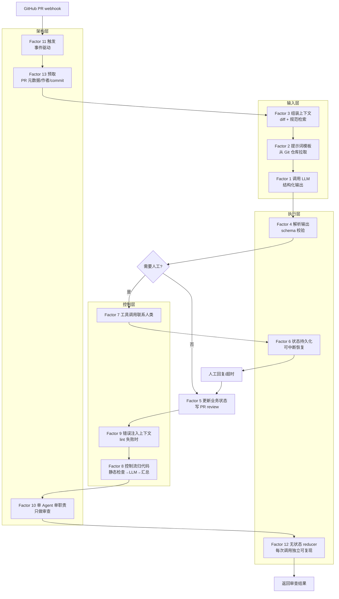

# 12-Factor Agents：构建生产级 LLM 应用的 12 条原则

12-Factor Agents 给出 12 条工程约束，每条约束把 LLM 的某类不确定性交给代码处理。这组约束来自生产环境的实践，和 Agent 框架的区别在于，它不提供运行时，只提供约束——每条原则都在回答同一个问题：什么东西该由代码管、什么东西可以交给模型。

官方仓库给出 12 条正式原则加 1 条荣誉提及（Factor 13：预取上下文）。本文按「输入层 → 执行层 → 控制层 → 架构层 → 荣誉提及」的顺序拆开，每条原则说清楚解决什么问题、边界在哪，最后给一个代码审查 Agent 的完整任务流和落地顺序。

## 学习目标

读完本文，可以掌握以下能力：

- 说出 12 条原则各自要解决的具体工程问题，以及把它们分布在四个层面的原因
- 区分「交给模型决策」和「交给代码掌控」的边界，能在新场景里判断哪些环节该收回控制权
- 为 Factor 1（结构化输出）、Factor 8（控制流）、Factor 12（无状态 Reducer）写出可运行的 Python 示例
- 跟踪一次代码审查 Agent 从触发到退出的完整路径，说清楚每条原则在这条路径上落在哪里
- 按收益和成本排序，给出自己团队未来 3 个月的落地优先级

## 读者背景与阅读建议

本文假设你熟悉 Python 语法、OpenAI SDK 的基本调用方式，以及 function calling（函数调用）的概念——具体说，知道怎么用 `client.chat.completions.create` 发起一次请求，知道工具调用的输入输出大致长什么样。如果你还没跑通过 OpenAI 官方的 function calling 示例，建议先动手走一遍再回来，否则 Factor 1 和 Factor 4 的代码会读得有点隔。

阅读路径建议分两遍：

- **第一遍**只读「先看全景」「为什么是这 12 条」和每条 Factor 的开头一段，建立整体地图。先别急着看代码示例——搞清楚每条原则解决什么问题、属于哪个层面，比看懂某段实现更重要。
- **第二遍**按层面顺序精读，重点看 Factor 1、8、12 的代码示例（这三条是落地时的起点），并对照「一个代码审查 Agent 的完整路径」把 12 条原则串起来。读完做一遍「自测清单」，答「否」的条目就是你下一步该动手的地方。

如果你已经在线上跑着 Agent、正在排查稳定性问题，可以直接跳到「常见错误排查」按症状定位，再回看对应 Factor。

## 目录

- [学习目标](#学习目标)
- [读者背景与阅读建议](#读者背景与阅读建议)
- [先看全景：12 条原则的分层地图](#先看全景12-条原则的分层地图)
- [为什么是这 12 条](#为什么是这-12-条)
- [输入层：提示词、上下文与工具调用](#输入层提示词上下文与工具调用)
- [执行层：输出、状态与可中断运行](#执行层输出状态与可中断运行)
- [控制层：人工介入、流程与错误处理](#控制层人工介入流程与错误处理)
- [架构层：粒度、触发与无状态化](#架构层粒度触发与无状态化)
- [荣誉提及：Factor 13 — 预取上下文](#荣誉提及factor-13--预取上下文)
- [一个代码审查 Agent 的完整路径](#一个代码审查-agent-的完整路径)
- [从哪里开始](#从哪里开始)
- [常见错误排查](#常见错误排查)
- [常见问题](#常见问题)
- [自测清单](#自测清单)
- [实战练习](#实战练习)
- [适用边界与决策建议](#适用边界与决策建议)
- [参考资源](#参考资源)

## 先看全景：12 条原则的分层地图

12 条原则分布在四个层面，从上到下越来越靠近运行时的确定性：

| 层面 | 原则 | 要解决的问题 |
|------|------|-------------|
| **输入层** | Factor 1-3 | LLM 该看到什么、以什么格式看到 |
| **执行层** | Factor 4-6 | 模型吐出结果后，系统怎么接住、怎么继续 |
| **控制层** | Factor 7-9 | 人工怎么介入、流程谁说了算、出错怎么办 |
| **架构层** | Factor 10-12 | 单个 Agent 的边界、触发方式和状态管理 |

这张表就是全文的地图——从数据进入模型到结果返回调用方的完整流水线。Factor 13（荣誉提及）不归入任何一层，因为它是一种横切上下文组装的优化策略，任何一层都可能用到。

把这张地图落到一次真实请求上，下面这条流程串起后文「一个代码审查 Agent 的完整路径」里的 13 步，每一步标注它落在哪一层、对应哪条 Factor：



读完这张图再往下看每条 Factor 的细节，能随时回到这里定位「这条原则在整个请求路径上处于什么位置」。

## 为什么是这 12 条

作者 Dex 在 AI Engineer World's Fair 的演讲中给过一个观察：目前大多数所谓「AI Agent」，绝大部分代码是确定性的，LLM 只在关键节点做点缀。真正能在生产环境稳定运行的 Agent，靠的是大量软件工程加少量 LLM 智能。

这 12 条原则就是从「大量软件工程」这个方向上总结出来的。12 条原则的共同方向是把控制权从模型收回代码，具体收回哪些环节见下文逐条说明。这个方向和「让 Agent 更智能」是正交的——12-Factor 不涉及提示词技巧，关注的是怎么把不确定性约束在可控范围内。

## 输入层：提示词、上下文与工具调用

### Factor 1 — 自然语言 → 工具调用

Agent 调用工具跟调用 API 没有本质区别——输入自然语言描述、输出结构化结果。如果工具返回的是自由文本，下游代码就得写正则去提取、处理转义、应对模型偶尔加一句解释；如果工具返回的是 JSON，下游直接用现成的解析器，失败也能在 schema（模式定义）校验层统一拦截。把工具当「魔法能力」来设计、让它吐自由文本，调用链路就会变得不透明。

例外只出现在输出仅供人阅读、不进下游代码的场景——比如生成一段给用户读的摘要，可以保留自由文本。只要输出要被代码消费，就必须走结构化格式。

下面是一个最小可运行示例，展示如何用 Pydantic（Python 数据验证库）定义工具的输出 schema 并校验 LLM 返回：

```python
# pip install pydantic openai
import logging
import time
from typing import Literal
from pydantic import BaseModel, ValidationError
from openai import OpenAI

logger = logging.getLogger(__name__)

class CodeReviewDecision(BaseModel):
    """代码审查 Agent 的结构化输出。

    用 Literal（字面量类型）而非 str + 注释，让非法取值在 schema 校验阶段就被拦截，
    下游代码无需再写 if intent not in {...} 的防御性判断。
    """
    intent: Literal["approve", "request_changes", "ask_human"]
    severity: Literal["info", "warning", "critical"]
    comment: str

client = OpenAI()

def review_code(diff: str) -> CodeReviewDecision:
    """调用 LLM 审查 diff，返回结构化结果。

    输出不符合 schema 时走重试，重试仍失败则降级为 ask_human。
    """
    prompt = f"""审查以下 diff，按 JSON schema 返回结论：
{diff}

只返回 JSON，字段：intent, severity, comment。"""
    for attempt in range(3):
        try:
            resp = client.chat.completions.create(
                model="gpt-4o-mini",
                messages=[{"role": "user", "content": prompt}],
                response_format={"type": "json_object"},
                timeout=30,  # 显式超时，避免默认值拖垮调用链（需 OpenAI SDK v1.x+，旧版仅在 client 初始化时支持 timeout）
            )
        except Exception as err:
            # 网络层失败：埋点后按指数退避重试
            logger.warning(
                "llm_call_error", extra={"attempt": attempt, "error": str(err)}
            )
            if attempt == 2:
                return CodeReviewDecision(
                    intent="ask_human",
                    severity="warning",
                    comment=f"LLM 调用失败：{err}",
                )
            time.sleep(2 ** attempt)  # 1s, 2s, 4s 退避
            continue
        try:
            return CodeReviewDecision.model_validate_json(
                resp.choices[0].message.content
            )
        except ValidationError as err:
            # 校验失败：埋点记录原始输出，用于后续分析提示词漂移
            logger.warning(
                "schema_validation_failed",
                extra={
                    "attempt": attempt,
                    "raw_output": resp.choices[0].message.content,
                    "error": str(err),
                },
            )
            if attempt == 2:
                # 降级：交给人工
                return CodeReviewDecision(
                    intent="ask_human",
                    severity="warning",
                    comment=f"LLM 输出校验失败：{err}",
                )
            time.sleep(2 ** attempt)
            continue
    raise RuntimeError("unreachable")

# 用法
decision = review_code("diff --git a/main.py b/main.py\n+eval(user_input)")
print(decision.intent, decision.severity)
```

这段代码把 Factor 1 和 Factor 4 接在了一起：LLM 的输出被 Pydantic schema 约束成结构化 JSON，校验失败时走重试和降级，下游代码拿到的是确定类型而不是自由文本。

上面这个示例在生产环境跑时，有三个工程细节需要单独处理。第一是超时——OpenAI 调用默认超时偏长，显式设置 `timeout=30`，避免单个慢请求把 Agent 调用链拖垮。第二是重试退避——重试间隔按 `2 ** attempt` 秒递增（1s、2s、4s），给上游留恢复窗口，避免雪崩。第三是可观测性——每次校验失败打一条结构化日志（含 attempt、错误类型、原始输出），事后能统计 schema 失败率，定位是提示词漂移还是模型本身问题。这三点不是 Factor 1 强制要求的，但缺了任何一条，线上稳定性都会出问题。

### Factor 2 — 掌控你的提示词

散落在配置文件、环境变量或聊天界面里的提示词，会在调试时变成灾难。提示词的微小改动会让模型行为发生漂移，如果不进版本管理，你无法回答「上次审查通过率高，这次为什么变低了」——因为没人记得提示词改过什么。把提示词写成 `.md` 或 `.jinja` 文件放在仓库里，每次改动走 code review，行为变化就有迹可循。

实验阶段允许提示词散落，方便快速迭代；一旦 Agent 进了生产环境或被多人共享，就必须收敛到版本管理。一个可操作的判断点：当有人开始问「这个提示词是谁改的」时，就该进仓库了。

### Factor 3 — 掌控上下文窗口

作者把「Context Engineering」放在比「Prompt Engineering」更本质的位置。上下文窗口的大小和内容布局，直接决定了模型能看到什么、记住什么、做出什么判断。如何压缩历史、选择检索片段、组织消息顺序——这些比提示词里的措辞影响更大。

上下文窗口是稀缺资源。塞太多无关内容，模型注意力被稀释，关键信息反而被忽略；塞太少，模型缺前置信息做判断。Context Engineering 的核心是在有限 token 预算里把「模型做这次决策真正需要的信息」按优先级排好。

判断该补什么时，看「模型这次决策缺了哪些信息会出错」——缺什么补什么，不缺的不补。一个常见反例是把整个对话历史原样塞进去，结果模型被早期无关内容带偏。

## 执行层：输出、状态与可中断运行

### Factor 4 — 工具即结构化输出

统一 LLM 的输出格式，消除二义性。不要让下游代码去猜模型返回的是 JSON 还是纯文本、是成功还是失败。

Factor 1 讲的是「单次工具调用要结构化」，Factor 4 把这个约束推广到 Agent 所有输出。统一格式后，错误处理、重试、降级可以做成一个公共层，不用每个调用点各写一套。

对外接口必须结构化，内部思考过程可以保留自由文本——只要不流出 Agent 边界。

### Factor 5 — 执行状态 = 业务状态

一个真实场景：代码审查 Agent 跑完一轮，Agent 内部计数器记「已审查 3 个文件」，但 PR 上的 review 状态只更新了 2 个。有人问「到底审了几个」，你查 Agent 内存是一套数，查 GitHub 是另一套数。这种对不上的情况一旦出现，就要写同步逻辑去对齐两边，而同步逻辑本身又会引入新的 bug。

问题出在「Agent 内部状态」和「业务状态」被拆成了两份。Factor 5 的做法是不要两份：Agent 当前的执行进度，直接就是业务系统里的真实状态——数据库行、PR review 状态、工单状态。Agent 不另起一套私有计数器，业务系统也不需要被同步。

边界在于「跨调用」这三个字。Agent 内部允许有临时变量（当前这次调用的中间结果），但这些变量不应该跨调用持久化。跨调用的状态必须落到业务系统，而不是 Agent 自己的内存或私有存储。看这个状态在服务重启后还要不要用——要用的就该在业务系统里，而不是在 Agent 内存里。

### Factor 6 — 简单 API 的启动 / 暂停 / 恢复

生产级 Agent 必须支持中断和恢复。运行中的 Agent 可能因为人工审批、外部依赖超时、资源限制等原因停下来，不能每次中断都从零开始。

审查一个 500 文件的大 PR，跑到第 200 个文件时进程被 OOM 杀掉——从头重跑既浪费 token 又拖慢响应。把执行状态持久化到外部存储，恢复时从断点继续，是生产环境的基本要求。

短任务不必上。一次问答、一次分类不需要中断恢复，加了反而增加复杂度。看这个任务的中断概率有多高、重跑成本有多贵——两者都高才需要做。

## 控制层：人工介入、流程与错误处理

### Factor 7 — 用工具调用联系人类

Agent 需要人工介入时，不应该靠「在日志里打印一句话」。应该通过标准化的工具调用机制发出请求、等待响应、超时处理——和调用任何其他工具一样。

日志里打一句话，没人会看。把人工介入做成工具调用，请求会进队列、有超时、有重试、有审计记录。人和其他工具在 Agent 眼里没有区别，都是「调用 → 等响应 → 处理结果」。

debug 阶段不必上。打日志没问题；生产环境里需要人做决策的环节，必须走工具调用，否则请求会丢。

### Factor 8 — 掌控你的控制流

大多数 Agent 框架让 LLM 决定下一步做什么。但在生产环境里，控制流应该由代码掌控，LLM 只负责需要「智能」的那部分决策。不要让模型替你编排业务流程。

让模型决定控制流，意味着每次执行路径都可能不同——测试无法覆盖、复现 bug 困难、性能不可预测。把控制流写成代码（`while` 循环、状态机、显式分支），LLM 只在「需要判断」的节点被调用，执行路径就是确定的，可测试、可复现、可监控。

判断一个决策是否需要模型介入，看它有没有明确的规则——有规则就写代码，没规则才让模型判断。比如「这段代码是否有 bug」让模型判断，「审查完要不要继续审查下一个文件」用代码控制。

下面这段代码把上面的判断落成可运行示例：

```python
# pip install openai pydantic
from openai import OpenAI
from pydantic import BaseModel

class LintDecision(BaseModel):
    """LLM 只负责这个判断。"""
    has_issue: bool
    reason: str

client = OpenAI()

def llm_judge(code: str) -> LintDecision:
    """LLM 只做一件事：判断代码是否有问题。"""
    resp = client.chat.completions.create(
        model="gpt-4o-mini",
        messages=[{"role": "user", "content": f"代码是否有问题？只返回 JSON：has_issue, reason\n\n{code}"}],
        response_format={"type": "json_object"},
    )
    return LintDecision.model_validate_json(resp.choices[0].message.content)

def review_pipeline(files: list[str]) -> dict:
    """控制流由代码掌控：循环、终止条件、汇总都在这里。

    LLM 只在 llm_judge 调用点参与，不参与流程编排。
    """
    results = {}
    index = 0
    # 控制流是显式的 while 循环，不是「让模型决定下一步」
    while index < len(files):
        code = files[index]
        decision = llm_judge(code)
        results[files[index]] = decision
        if decision.has_issue and decision.reason.startswith("critical"):
            # 关键问题立即停止，这是代码的判断，不是模型的判断
            break
        index += 1
    return results

# 用法
files = ["print('hello')", "eval(input())", "import os"]
report = review_pipeline(files)
for path, decision in report.items():
    print(f"{path}: {decision.has_issue} - {decision.reason}")
```

这段代码里，`while` 循环、终止条件、汇总逻辑都是代码写的，LLM 只在 `llm_judge` 里判断「这段代码是否有问题」。如果让模型决定「下一步审查哪个文件」「要不要继续」，执行路径就不可控了。

### Factor 9 — 将错误压缩进上下文窗口

模型不知道发生了什么，就没法调整策略。如果上一次调用 `fetch_git_tags` 超时了，模型却看不到这个信息，下一次它还会走同一条路径；把错误写进上下文窗口，模型下一次推理就能换路径或降级——这比任何 prompt 告诉它「注意错误处理」都有效。

写进上下文的是「模型能用上的错误」——失败原因、影响范围、已尝试的方案。完整的堆栈可能太长，需要压缩。敏感信息（密钥、内部路径）要脱敏后再写入。

## 架构层：粒度、触发与无状态化

### Factor 10 — 小而专注的 Agent

对比两种做法。第一种：把代码审查、生成 release notes、打标签、更新 changelog 全塞进一个 Agent 的提示词。提示词越加越长，模型每次推理都要扫一遍所有职责的说明，注意力被稀释——结果每件事都做得马虎。改一个职责的提示词，还可能影响其他职责的输出。

第二种：拆成四个小 Agent，各自只管一件事。代码审查 Agent 的上下文窗口只装 diff 和规范文档，release notes Agent 只装 commit 历史。每个 Agent 的提示词短、专注，输出质量更稳，也更容易单独测试和复用。

拆分的代价是协调成本——Agent 之间要传上下文、同步状态。所以拆分粒度不是越细越好。看这两个 Agent 是否经常需要彼此的上下文：如果经常需要，合并可能更好；如果基本独立，拆开。一个可操作的信号是：如果你发现两个 Agent 之间频繁互调、互相传大段上下文，说明它们其实该合成一个。

### Factor 11 — 触发无处不在，用户在哪就在哪

用事件驱动架构解耦 Agent 的触发源。Agent 不应该只绑定在 HTTP endpoint 上——Slack 消息、GitHub webhook（网络钩子）、cron（定时任务）、数据库变更，都可以是触发源。

把 Agent 绑死在 HTTP endpoint 上，意味着用户要主动调用才能用。事件驱动让 Agent 在「事情发生时」自动响应，更贴近真实工作流（PR 创建、工单状态变更、定时检查）。

已有 HTTP 调用足够时不必上。事件驱动增加了系统复杂度（消息队列、幂等性、重试）。如果 Agent 只需要被人主动调用，HTTP endpoint 就够了；如果需要在「事情发生时」自动跑，才上事件驱动。

### Factor 12 — 让 Agent 成为无状态 Reducer

每次 Agent 调用 = `f(当前状态, 新输入)` → `新状态`。没有副作用，没有隐式状态累积。写成纯函数后，同样的输入永远得到同样的输出，测试和调试都能从任意状态重放。

有副作用的 Agent 难测试——同样的输入跑两次结果不同，因为内部状态变了。写成 reducer（归约函数），测试只要构造 `(状态, 输入)` 对，断言输出状态，不需要 mock 外部依赖。

reducer 本身无副作用，但 Agent 系统整体可以有副作用（写数据库、调外部 API）。原则是「副作用发生在 reducer 之外」——reducer 计算出新状态，外部代码根据新状态执行副作用。

reducer 的签名如下：

```python
# pip install pydantic
from pydantic import BaseModel
from typing import Literal

class AgentState(BaseModel):
    """Agent 的全部状态，显式、可序列化。

    状态序列化存储后端选型：
    - Redis / 内存 KV：适合短任务、高频读写、可容忍丢失的场景（如会话级
      中间状态）。延迟低，但持久化要额外配置。
    - 关系型数据库（PostgreSQL 等）：适合需要事务、审计、跨 Agent 共享的
      长任务状态。延迟略高，但能和业务状态写在同一事务里，避免 Factor 5
      说的双重状态对齐问题。
    - 对象存储 / 文件系统：适合状态体积大、读写频率低的场景（如完整对话
      历史、大块中间产物）。成本最低，但不适合做实时查询。
    选型时主要看三点：状态体积、读写频率、是否需要和业务数据同事务提交。
    """
    reviewed_files: list[str] = []
    issues_found: int = 0
    status: Literal["running", "done", "blocked"] = "running"

    def serialize(self) -> str:
        """序列化为 JSON 字符串，供持久化层存储。"""
        return self.model_dump_json()

    @classmethod
    def deserialize(cls, raw: str) -> "AgentState":
        """从持久化层恢复状态。"""
        return cls.model_validate_json(raw)

class AgentInput(BaseModel):
    """单次输入。"""
    file_path: str
    code: str
    has_issue: bool

class AgentOutput(BaseModel):
    """reducer 的输出：新状态 + 要执行的副作用描述。"""
    new_state: AgentState
    side_effects: list[str] = []  # 副作用以描述形式返回，由外部代码执行

def review_reducer(state: AgentState, inp: AgentInput) -> AgentOutput:
    """无状态 reducer：纯函数，输出只依赖输入。

    f(state, input) -> (new_state, side_effects)
    同样的 (state, input) 永远返回同样的 (new_state, side_effects)。
    """
    new_reviewed = state.reviewed_files + [inp.file_path]
    new_issues = state.issues_found + (1 if inp.has_issue else 0)
    effects: list[str] = []
    if inp.has_issue:
        effects.append(f"post_comment:{inp.file_path}")
    new_status = state.status
    if new_issues >= 3:
        new_status = "blocked"
        effects.append("notify_human:too_many_issues")
    new_state = AgentState(
        reviewed_files=new_reviewed,
        issues_found=new_issues,
        status=new_status,
    )
    return AgentOutput(new_state=new_state, side_effects=effects)

# 用法：reducer 本身可测试，副作用在外部执行
state = AgentState()
inp = AgentInput(file_path="main.py", code="eval(x)", has_issue=True)
result = review_reducer(state, inp)
print(result.new_state.status)        # running
print(result.new_state.issues_found)  # 1
print(result.side_effects)            # ['post_comment:main.py']

# 持久化：把新状态序列化后写入存储后端，下次恢复时反序列化
raw = result.new_state.serialize()         # 写入 Redis / Postgres / 文件
restored = AgentState.deserialize(raw)      # 下次调用前恢复
assert restored == result.new_state

# 同样的输入永远返回同样的输出，可复现
assert review_reducer(state, inp) == review_reducer(state, inp)
```

这个 reducer 签名里，`review_reducer` 是纯函数，副作用以字符串描述形式返回，由外部代码（不在 reducer 内）执行。测试时只测 reducer，不测副作用执行。

## 荣誉提及：Factor 13 — 预取上下文

Factor 13 是官方仓库的附录（appendix-13-pre-fetch），不在正式 12 条里，但工程价值不低。思路一句话能说清：如果你已经知道模型大概率会调用某个工具，就直接在代码里预先调用，把结果塞进上下文，别浪费一次 token 往返让模型自己 fetch。

每次 LLM 调用都是一次网络往返 + 推理耗时。如果模型 90% 的概率会调 `list_git_tags`，让模型先返回「我要调 list_git_tags」、代码再执行、再把结果回传给模型，多了一次往返。直接在代码里 fetch 好，把结果放进上下文，模型一次推理就能用上。

预取的前提是「高概率会用到」。如果模型只有 10% 的概率调某个工具，预取就是浪费——90% 的情况下上下文里多了一段无用信息。看这个工具在历史调用里被命中的频率。另一个边界是预取的数据量——如果数据很大（比如整个仓库的文件列表），预取会挤占上下文预算，反而得不偿失。

下面是 Factor 13 的对比示例，展示「让模型自己 fetch」和「代码预取」的差异：

```python
# pip install openai pydantic
from openai import OpenAI
from pydantic import BaseModel
from typing import Literal

client = OpenAI()

class DeployDecision(BaseModel):
    intent: Literal["deploy_backend_to_prod", "done_for_now"]
    tag: str | None = None
    message: str | None = None

# 反例：让模型自己决定要不要 fetch git tags
def deploy_bad(initial_message: str) -> DeployDecision:
    """模型可能先返回 list_git_tags，多一次往返。"""
    resp = client.chat.completions.create(
        model="gpt-4o-mini",
        messages=[{"role": "user", "content": f"""
部署任务。你可能需要查看 git tags。
当前事件：{initial_message}

返回 JSON：intent (deploy_backend_to_prod | list_git_tags | done_for_now)
"""}],
        response_format={"type": "json_object"},
    )
    # 如果返回 list_git_tags，这里要再调一次 fetch_git_tags，
    # 然后把结果回传给模型，模型再返回 deploy 或 done——多一次往返
    return DeployDecision.model_validate_json(resp.choices[0].message.content)

# 正例：代码预取 git tags，直接放进上下文
def fetch_git_tags() -> list[str]:
    """模拟从 git 仓库拉取 tags。"""
    return ["v1.0.0", "v1.1.0", "v2.0.0"]

def deploy_good(initial_message: str) -> DeployDecision:
    """代码预先 fetch tags，模型一次推理就能决策。"""
    tags = fetch_git_tags()  # 确定性预取
    resp = client.chat.completions.create(
        model="gpt-4o-mini",
        messages=[{"role": "user", "content": f"""
部署任务。当前可用的 git tags：{tags}
当前事件：{initial_message}

返回 JSON：intent (deploy_backend_to_prod | done_for_now), tag, message
"""}],
        response_format={"type": "json_object"},
    )
    return DeployDecision.model_validate_json(resp.choices[0].message.content)

# 用法
decision = deploy_good("发布 v1.1.0 到生产环境")
print(decision.intent, decision.tag)
```

`deploy_good` 把 `list_git_tags` 这个工具调用改成代码的确定性预取，不再走「模型先说要调、代码再执行、结果再回传」这一圈。模型只做「用哪个 tag 部署」的判断，少一次往返，少一个工具定义。

## 一个代码审查 Agent 的完整路径

GitHub 上配置了一个代码审查 Agent，每当有新 PR 就会触发。这条请求穿过 12 条原则的过程如下：

1. **触发（Factor 11）**：GitHub webhook 把 PR 事件推到消息队列，Agent 从队列里拿到事件——触发源和 Agent 本体完全解耦。
2. **组装上下文（Factor 3）**：Agent 从 PR 里提取 diff 内容，从向量数据库里检索相关代码规范，按优先级排列后填入上下文窗口——消息顺序和内容密度都是设计好的，不是随便塞进去的。
3. **构造提示词（Factor 2）**：提示词模板从 Git 仓库里拉取，和代码一起受版本管理。模板里定义了审查维度、输出格式和拒绝审查的条件。
4. **调用 LLM（Factor 1）**：自然语言描述的任务被发给模型，模型返回结构化审查意见。
5. **解析输出（Factor 4）**：返回的 JSON 被校验——是标准格式就继续，格式不对就走重试或降级路径。
6. **更新状态（Factor 5）**：审查结果直接写入 PR 的 review comment，Agent 的执行状态就是 PR 上的真实状态，不存在两套东西需要同步。
7. **人工确认（Factor 7）**：如果 Agent 发现潜在的安全问题，会通过工具调用向指定的代码 owner 发送确认请求，等待回复或超时。
8. **可中断运行（Factor 6）**：等待人工确认期间，Agent 的执行状态被持久化。即使服务重启，恢复后从持久化状态继续，不用重新审查整个 PR。
9. **错误注入上下文（Factor 9）**：调用外部 lint 工具失败时，错误信息被写进上下文窗口。下一次推理时，模型自己会避开同样的调用路径或给出降级建议。
10. **控制流归代码（Factor 8）**：Agent 的执行流程由代码编排——先跑静态检查、再跑 LLM 审查、最后汇总结果——模型只参与「这段代码是否有问题」的判断，不参与编排。
11. **单 Agent 单职责（Factor 10）**：这个 Agent 只做代码审查。生成 release notes、更新 changelog、打标签是另外的 Agent 或普通脚本的事。
12. **无状态推理（Factor 12）**：每次审查调用都是独立的——输入是 PR diff 和规范文档，输出是审查意见。下一次 PR 的审查不会「继承」上一次的内部状态，结果完全可复现。
13. **预取上下文（Factor 13）**：Agent 启动时直接从仓库拉取 PR 元数据、作者信息、最近 commit 列表，不留给模型「我要不要调这个工具」的往返。

## 从哪里开始

把 LLM 应用推上生产环境时，建议按以下顺序落地这 12 条原则：

第一周先做收益最大、成本最低的 3 条：

- Factor 8（控制流）：控制流写在确定性代码里，LLM 只做判断节点。这是单点改动，但对稳定性的影响最直接。
- Factor 9（错误压缩进上下文）：把错误信息写进上下文，不需要改架构。
- Factor 4（统一输出格式）：在 LLM 调用外层加一层 schema 校验，投入小。

接下来做需要改架构的 3 条：

- Factor 12（无状态 Reducer）：把推理逻辑改成纯函数式，测试和调试的收益随 Agent 数量线性增长。
- Factor 6（启动 / 暂停 / 恢复）：长任务必须支持中断。
- Factor 11（事件驱动触发）：Agent 不再只能通过 HTTP 调用。

最后是精细化管理层面的：

- Factor 2（提示词版本化）、Factor 3（上下文工程）、Factor 10（Agent 粒度拆分）等，在你已经跑通了基础流程之后再投入。
- Factor 13（预取上下文）放在最后，因为它依赖你对 Agent 调用模式的统计——得先跑一段时间，才知道哪些工具调用值得预取。

如果你的团队还在选框架阶段、Agent 还没上线，不如先把 Factor 8 和 Factor 4 落实——这两条能帮你在选框架时就排除掉一批把控制流交给模型的方案。

## 常见错误排查

落地时常见的问题按下表症状定位，比从头排查快。

| 症状 | 可能的原因 | 排查方向 |
|------|-----------|----------|
| Agent 同样的输入跑两次结果不同 | 违反 Factor 12，reducer 有隐式状态或副作用 | 检查 reducer 函数是否读了全局变量、是否在 reducer 内直接调外部 API |
| LLM 输出偶尔导致下游代码崩溃 | 违反 Factor 4，没有 schema 校验层 | 在 LLM 调用出口加 Pydantic / JSON Schema 校验，失败走重试或降级 |
| Agent 长任务中断后无法恢复 | 违反 Factor 6，状态没持久化 | 把 AgentState 序列化到数据库或文件，恢复时反序列化 |
| Agent 行为突然变差，找不到原因 | 违反 Factor 2，提示词改动没记录 | 把提示词移进 Git 仓库，用 `git log` 查最近改动 |
| 人工介入请求丢失 | 违反 Factor 7，靠日志通知人 | 改成工具调用机制，请求进队列，有超时和重试 |
| 模型反复调用同一个失败工具 | 违反 Factor 9，错误没写进上下文 | 把工具失败的错误信息追加到上下文窗口 |
| Agent 提示词越来越长，输出质量下降 | 违反 Factor 10，单 Agent 塞了太多职责 | 按职责拆成多个小 Agent，各自独立上下文 |
| 上下文窗口经常超限 | 违反 Factor 3，没有压缩策略 | 实现历史压缩（保留摘要 + 最近 N 条）、检索片段按相关性裁剪 |
| 模型每次都先调 `list_xxx` 再决策 | 违反 Factor 13，没做预取 | 统计工具调用频率，高频工具改成代码预取 |

排查时先定位症状对应哪条原则被违反，再针对性修复。改一条跑一遍测试，确认有效再改下一条。

## 常见问题

**12-Factor Agents 和 LangChain / LlamaIndex 是什么关系？** 12-Factor 是工程约束集，不是框架。LangChain 这类框架可以用来实现 12-Factor Agent，但默认配置经常违反 Factor 8（让模型决定控制流）和 Factor 12（链路里有隐式状态）。用框架不会自动满足 12 条；不用框架，手写代码也能让 Agent 满足 12 条。

**Factor 12 要求无状态，那 Agent 怎么记住历史？** 历史不在 Agent 内部，在外部状态存储。reducer 的 `state` 参数就是从外部存储读进来的，reducer 算完新状态再写回外部存储。Agent 本身无状态，但系统有状态——状态在 reducer 之外。

**Factor 8 和 Factor 1 是不是重复了？** 不重复。Factor 1 讲「单次工具调用要结构化输出」，Factor 8 讲「整个流程的编排权在代码手里」。前者约束输出格式，后者约束控制流。一个 Agent 可以输出完全结构化（满足 Factor 1），但下一步做什么由模型决定（违反 Factor 8）。

**小团队有必要全部落地 12 条吗？** 没必要。先做 Factor 8、9、4 这三条收益最大的，跑稳之后再按需补。12 条更像是写新 Agent 或审计旧 Agent 时的检查清单，逐条对照能发现哪些环节把控制权交给了模型；它不是上线门槛——没有哪条原则要求「不满足就不能上生产」。但如果你的 Agent 处理的是钱、权限或生产数据，Factor 7（人工介入）和 Factor 6（可中断恢复）建议早做。

**Factor 13 为什么只是荣誉提及？** 因为它依赖前置条件——你得先有 Agent 运行一段时间、统计出工具调用频率，才知道哪些工具值得预取。新项目没数据，预取就是瞎猜。所以 Factor 13 放在最后，作为优化手段而不是基础约束。

**这些原则适用于多 Agent 系统吗？** 单 Agent 的 12 条原则在多 Agent 系统里仍然适用，每个 Agent 各自满足。多 Agent 系统额外需要考虑 Agent 之间的通信协议、状态传递、故障隔离——这些不在 12-Factor 范围内，需要参考其他工程实践。

**12-Factor Agent 和传统状态机有什么区别？** 状态机的状态转移是确定性的，12-Factor Agent 在 reducer 内部允许调用 LLM 做判断（Factor 8 的「判断节点」）。区别在于：状态机的转移规则全部写死，12-Factor Agent 把「需要智能的判断」交给 LLM、「流程编排」交给代码。可以理解为「带 LLM 判断节点的状态机」。

## 自测清单

逐条过一遍，诚实回答「是」或「否」。答「否」的条目，就是你下一步该动手的地方——最后一列标了该回看哪条 Factor。

### 输入层

| 自测项 | 是/否 | 答否时回看 |
|--------|-------|------------|
| Agent 调用的每个工具是否都有明确的结构化输出定义？ | | [Factor 1](#factor-1--自然语言--工具调用) |
| 提示词模板是否和代码一起进了版本管理？ | | [Factor 2](#factor-2--掌控你的提示词) |
| 上下文窗口的内容布局是否有设计原则——什么在前、什么在后、什么可以压缩？ | | [Factor 3](#factor-3--掌控上下文窗口) |

### 执行层

| 自测项 | 是/否 | 答否时回看 |
|--------|-------|------------|
| 下游代码是否需要「猜」LLM 返回的是什么格式？ | | [Factor 4](#factor-4--工具即结构化输出) |
| Agent 的执行状态是否就是业务系统的真实状态，不存在两套状态需要对齐？ | | [Factor 5](#factor-5--执行状态--业务状态) |
| 长任务中断后能否从保存点恢复，而不是从头重跑？ | | [Factor 6](#factor-6--简单-api-的启动--暂停--恢复) |

### 控制层

| 自测项 | 是/否 | 答否时回看 |
|--------|-------|------------|
| Agent 需要人工介入时，是通过标准化的工具调用机制还是靠日志里打一句话？ | | [Factor 7](#factor-7--用工具调用联系人类) |
| 业务流程的编排权在代码手里还是模型手里？ | | [Factor 8](#factor-8--掌控你的控制流) |
| 工具调用失败的错误信息是否写进了上下文窗口，供下一次推理使用？ | | [Factor 9](#factor-9--将错误压缩进上下文窗口) |

### 架构层

| 自测项 | 是/否 | 答否时回看 |
|--------|-------|------------|
| 每个 Agent 是否只做一件事？ | | [Factor 10](#factor-10--小而专注的-agent) |
| Agent 的触发方式是否只有 HTTP 一种？ | | [Factor 11](#factor-11--触发无处不在用户在哪就在哪) |
| 每次 Agent 调用是否可以写成 f(state, input) → new_state，输出只依赖输入而不是隐式状态？ | | [Factor 12](#factor-12--让-agent-成为无状态-reducer) |

### 荣誉提及

| 自测项 | 是/否 | 答否时回看 |
|--------|-------|------------|
| 是否统计过 Agent 的工具调用频率，把高频工具改成代码预取？ | | [Factor 13](#荣誉提及factor-13--预取上下文) |

## 实战练习

以下四个练习难度递增。第一个半小时内能做完，第四个可能需要一个下午——做完第四个，12 条原则会从读过的文字变成你实际用过的工程约束。

### 审计一个现有 Agent

找一个你正在开发或维护的 LLM 应用，拿出上一节的自测清单逐条打分。不要跳过任何条目。打完分之后，找出得分最低的两个层面，写一段 200 字以内的改进计划。

打分本身不是重点，重点是借 12 条原则的视角重新审视自己写的代码。很多人做完会发现 Factor 8（控制流归代码）和 Factor 9（错误写进上下文）是改起来成本最低但收益最高的——恰好也是文章建议最先落地的。

### 落地 Factor 8 + Factor 4

找一个目前靠「给 LLM 一段提示词，让它自己决定下一步做什么」的 Agent 场景。做两个改动：

1. 用代码接管流程编排——把步骤写清楚，LLM 只在需要判断的节点被调用。
2. 在 LLM 调用出口加一层 schema 校验——输出不符合预期格式时不直接传给下游，而是走重试或降级路径。

完成后用同样的测试用例跑一遍，对比改动前后的输出稳定性。你会直观感受到「控制流交给代码」和「控制流交给模型」在实际运行中到底差在哪里。

### 实现一个最小 Reducer 并写测试

这个练习介于审计和从零设计之间——你要动手写代码，但范围收窄到 Factor 12 一条原则。场景：一个工单分流 Agent，每次收到一条工单，reducer 根据工单类型更新状态，并返回要执行的副作用。

要求：

1. 用 Pydantic 定义 `TicketState`（含 `pending_count`、`resolved_count`、`escalated_count` 三个字段）和 `TicketInput`（含 `ticket_id`、`category`、`priority` 三个字段）。
2. 写一个 `ticket_reducer(state, inp) -> (new_state, side_effects)` 纯函数。规则：`priority == "critical"` 时 `escalated_count` 加 1 并追加 `notify_human` 副作用；其余情况 `resolved_count` 加 1。
3. 用 `pytest` 写至少 4 个测试：普通工单、critical 工单、连续处理多个工单的状态累加、同样的输入跑两次结果一致（可复现性）。
4. 额外挑战：给 `TicketState` 加 `serialize` / `deserialize` 方法，写一个测试验证「序列化 → 反序列化」后状态不变。

下面是测试的起手骨架，reducer 实现留给你写：

```python
# pip install pydantic pytest
from typing import Literal
from pydantic import BaseModel

# TODO: 定义 TicketState、TicketInput、TicketOutput
# TODO: 实现 ticket_reducer

def test_normal_ticket_increments_resolved():
    state = TicketState()
    inp = TicketInput(ticket_id="T-1", category="billing", priority="normal")
    out = ticket_reducer(state, inp)
    assert out.new_state.resolved_count == 1
    assert out.new_state.escalated_count == 0
    assert out.side_effects == []

def test_critical_ticket_escalates():
    state = TicketState()
    inp = TicketInput(ticket_id="T-2", category="security", priority="critical")
    out = ticket_reducer(state, inp)
    assert out.new_state.escalated_count == 1
    assert "notify_human" in out.side_effects[0]

def test_state_accumulates_across_calls():
    state = TicketState()
    for tid, cat, pri in [("T-1", "billing", "normal"),
                          ("T-2", "security", "critical"),
                          ("T-3", "usage", "normal")]:
        out = ticket_reducer(state, TicketInput(ticket_id=tid, category=cat, priority=pri))
        state = out.new_state
    assert state.resolved_count == 2
    assert state.escalated_count == 1

def test_reducer_is_deterministic():
    state = TicketState()
    inp = TicketInput(ticket_id="T-1", category="billing", priority="normal")
    assert ticket_reducer(state, inp) == ticket_reducer(state, inp)
```

做完这个练习你会直观感受到「reducer 是纯函数」给测试带来的便利——你不需要 mock 任何外部依赖，构造 `(state, input)` 对就能断言输出。如果你发现测试里要 mock 数据库或 LLM 调用，说明 reducer 里混进了副作用，回去检查。

### 从零设计一个符合 12 条原则的 Agent

挑一个你熟悉的业务场景——代码审查、客服分流、数据标注质检都可以——从零设计一个 Agent。要求：

- 写出一份设计文档，逐条说明你如何满足 12 条原则
- 画出触发链路、上下文组装流程、输出处理路径和人工介入节点
- 至少包含一个「任务流过系统」的完整路径描述，参考正文中代码审查 Agent 的写法
- 给出 Factor 13 的预取决策：哪些工具值得预取、依据是什么

这个练习不要求写代码，只做设计。难点是在一个具体场景里同时满足 12 条原则时，不同原则之间的取舍和优先级。

## 自测题

读完本文后，先自己想 30 秒再展开答案：

<details>
<summary>1. Factor 8（控制流归代码）和 Factor 1（自然语言→工具调用）的区别是什么？给出一个违反 Factor 8 但满足 Factor 1 的例子。</summary>

区别：Factor 1 约束单次工具调用的输出格式（要结构化），Factor 8 约束整个流程的编排权（在代码手里，不在模型手里）。一个 Agent 可以输出完全结构化（满足 Factor 1），但下一步做什么由模型决定（违反 Factor 8）——比如 prompt 里写"根据用户意图决定下一步调用哪个工具"，这就是把控制流交给了模型。
</details>

<details>
<summary>2. Factor 5（执行状态=业务状态）要解决的核心问题是什么？给出一个违反后的具体事故场景。</summary>

核心问题：防止 Agent 内部状态和业务系统状态变成两套，对账不上。事故场景：代码审查 Agent 内部计数器记"已审查 3 个文件"，但 PR 上的 review 状态只更新了 2 个。有人问"到底审了几个"，查 Agent 内存是一套数，查 GitHub 是另一套数。修复方案是把 Agent 的执行状态也存进业务数据库同一张表里，用事务保证一致性。
</details>

<details>
<summary>3. Factor 12（无状态 reducer）模式下，怎么处理需要调用真实 LLM 的场景？测试时怎么办？</summary>

`agent_step` 函数内部仍然调用 LLM，但 LLM 调用的输入完全由传入的 `State` 决定，输出被封装成新的 `State` 返回。测试时 mock 掉 LLM 调用，就能验证 reducer 逻辑本身是否正确。集成测试和回放测试再覆盖真实 LLM 调用的部分。关键是 reducer 本身是纯函数——给定相同的 `State` 和 `Event`，输出总是相同。
</details>

<details>
<summary>4. Factor 13（预取上下文）的判定边界是什么？哪些情况不应该预取？</summary>

判定边界：工具在历史调用中被命中的频率是否足够高（比如 >70%），以及预取的数据量是否在上下文预算内。不应该预取的情况：① 工具调用频率低（<30%），预取了反而浪费上下文预算；② 预取的数据量很大（比如整个仓库的文件列表），会挤占上下文窗口；③ 数据实时性要求高（比如当前库存量），预取的数据可能过期。
</details>

<details>
<summary>5. 12-Factor Agents 的适用边界是什么？举一个不适合用的场景。</summary>

适用边界：Agent 需要跨多次调用，且每次调用的结果会影响下一步。不适合的场景：纯对话式聊天机器人——用户问一句答一句，没有多步流程、没有业务状态、没有人工介入节点，硬套 12 条会增加不必要的架构复杂度。单次 LLM 调用的简单功能（比如文案润色）也不适合，Factor 6 的中断恢复、Factor 12 的 reducer 在这里没有收益。
</details>

---

## 进阶路径

读完本文后，按以下顺序动手操作，而不是只按阅读顺序：

### 第一步：跑通一个最小 reducer（预计 2-3 小时）

1. 安装依赖：`pip install openai pydantic`
2. 把本文「Factor 12」节的 `review_reducer` 代码抄进本地文件 `minimal_reducer.py`
3. 跑通测试：构造一个 `AgentState` 和 `AgentInput`，调用 `review_reducer`，断言输出
4. 预期结果：同样的输入跑两次，输出完全一致（temperature=0 前提下）

**验证标准**：reducer 函数本身不调用任何外部 API，所有副作用以字符串描述返回。

### 第二步：对照 humanlayer/12-factor-agents 仓库做差异分析（预计 1 小时）

1. `git clone https://github.com/humanlayer/12-factor-agents.git`
2. 打开 `content/` 目录，找到 Factor 2、3、8、12 对应的文档
3. 对比本文的论述和官方文档的差异：哪些点本文强调了但官方没提？哪些点官方强调了但本文没覆盖？
4. 记录：差异点是否影响了你的理解或实践？

**交付物**：一页差异对照表（可以直接存在团队 Wiki 里）。

### 第三步：给现有 Agent 做 Factor 8 + Factor 4 落地（预计 1 天）

1. 找一个你们团队已有的 Agent（用 LangChain / 自写都行）
2. 检查控制流是否由代码掌控：搜索代码里是否有 `while True` 或 `for` 循环，LLM 调用是否在循环体内被调用
3. 如果控制流由 prompt 决定（比如"根据用户意图决定下一步"），把它改成代码里的 `if/else` 或状态机
4. 在 LLM 调用出口加 Pydantic schema 校验，失败走重试或降级

**验收条件**：Agent 的执行路径可以画成一张流程图，每个节点是确定性代码或 LLM 判断节点。

### 第四步（可选）：加 Factor 5+6 做持久化（预计 2-3 天）

在第三步基础上，加一张 `agent_tasks` 表（SQLite 也行），字段至少包含：`id, status, current_step, events_json, business_entity_id`。实现 `save_state(task_id, state)` 和 `load_state(task_id)` 两个函数后，进程重启不再等于任务丢失。

---

## 资料口径说明

本文的判断和结论来自以下来源，存在明确的局限性：

1. **主要来源**：humanlayer/12-factor-agents 仓库的公开文档、Dex（Dexter Horthy）在 AI Engineer World's Fair 的演讲视频、以及官方仓库中的代码示例。这些材料代表了作者团队从生产环境实践中提炼的工程判断，但样本选择存在主观性，结论推广需要结合团队自身场景。

2. **技术准确性边界**：本文涉及代码示例基于 OpenAI SDK 的 Python 实现，使用其他 SDK（如 Anthropic、Ollama）时具体 API 调用方式会有差异，但原则本身与语言无关。代码示例以教学为目的，生产环境需要加错误处理、日志、监控等工程化组件。

3. **适用性边界**：12-Factor Agents 面向的是"需要稳定交付给真实用户的 LLM 应用"，对于原型验证、纯研究、单轮结构化提取等场景，部分原则的边际收益会递减。文中的"70-80% 天花板"判断基于作者团队的访谈样本，不同业务场景下这个数值可能有差异。

4. **未覆盖话题**：本文明确不讨论 MCP（Model Context Protocol）协议层、框架横向评测、模型训练/Fine-tuning，这些话题的判断需要参考其他专门资料。

5. **版本与时效性**：本文基于 2026 年 5 月的仓库版本撰写。12-Factor Agents 仍在持续迭代，后续新增原则或调整以仓库最新版本为准。

---

## 适用边界与决策建议

12-Factor Agents 不适合所有 LLM 应用。它解决的是「LLM 参与多步业务流程时如何保持可控、可复现、可恢复」这个问题，所以适用范围有明确边界。

适合用的场景有三类：

- **SaaS 后端 Agent**：自动处理工单、自动配置资源、自动跑数据管道。Agent 要跨多次调用、要和业务系统状态对齐、要支持人工审批，Factor 5、6、7、12 直接命中。
- **客服 Agent**：需要调用多个工具查订单、改状态、转人工，Factor 1、4、8 让工具调用和控制流可控。
- **数据处理 Agent**：批量跑、中途可能断、跑完要能复现，Factor 6、12 的中断恢复和无状态 reducer 正好对应。

不适合的场景有两类：

- **纯对话式聊天机器人**：用户问一句答一句，没有多步流程、没有业务状态、没有人工介入节点，硬套 12 条会增加不必要的架构复杂度。
- **单次 LLM 调用的简单功能**：比如一段文案润色、一次情感分类，输入输出都是一次性的，Factor 6 的中断恢复、Factor 12 的 reducer 在这里没有收益。

团队该不该采用，取决于你的 Agent 是否满足两个条件：会跨多次调用，且每次调用的结果会影响下一步。

如果两个条件都满足，说明 Agent 真的在做多步业务流程，12 条值得认真落地，尤其是 Factor 5、6、8、12 这几条直接对应「跨调用状态」「中断恢复」「控制流」「可复现」的环节。

如果只满足一个条件——比如会跨多次调用但每步独立、前一步不影响后一步——挑相关的几条做就够了。常见的是 Factor 1、4（输出结构化）和 Factor 2（提示词版本化），其余条目收益有限。

如果两个条件都不满足，大概率根本不需要 Agent 框架，直接调一次 LLM API 就行。强行套 12 条反而会把一段单次调用包装成 reducer + 状态持久化 + 事件触发，徒增维护负担。

从哪条 Factor 开始，参考前面「从哪里开始」一节——Factor 8、9、4 是收益最大、改动最小的起点。

## 参考资源

GitHub: [humanlayer/12-factor-agents](https://github.com/humanlayer/12-factor-agents)（仓库以 Markdown/MDX 文档为主，配套 Mintlify 文档站）

- [演讲视频：AI Engineer World's Fair](https://www.youtube.com/watch?v=8kMaTybvDUw)（链接有效性以发布时为准）
- [深度解读视频](https://www.youtube.com/watch?v=yxJDyQ8v6P0)（链接有效性以发布时为准）
- [Factor 3：掌控上下文窗口（完整原文）](https://github.com/humanlayer/12-factor-agents/blob/main/content/factor-03-own-your-context-window.md)
- [Factor 13：预取上下文（附录原文）](https://github.com/humanlayer/12-factor-agents/blob/main/content/appendix-13-pre-fetch.md)
- [npx 脚手架工具](https://github.com/humanlayer/12-factor-agents/discussions/61)：快速创建一个符合 12-Factor 的 Agent 项目
