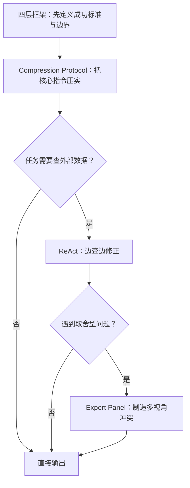

> **难度**：⭐⭐⭐⭐ | **类型**：方法论梳理 + 实战模板 | **更新日期**：2026-05-06 | **预计阅读时间**：18 - 25 分钟
>
> **适合读者**：AI 应用开发者、Agent 设计者、提示词工程实践者
>
> 提示词工程没有消失。变化的是——过去靠措辞就能拉起一个任务，现在要管的是任务的定义、上下文的组织、工具的边界，以及系统什么时候该停下来。
>
> **事实边界**：文中涉及 ReAct、Chain-of-Thought 与长上下文位置偏差的部分，分别基于公开论文 [ReAct](https://arxiv.org/abs/2210.03629)、[Chain-of-Thought Prompting](https://arxiv.org/abs/2201.11903) 与 [Lost in the Middle](https://arxiv.org/abs/2307.03172)。关于 prompt engineering 与 context engineering 的关系，以 Anthropic 的公开工程文章和文档为主要参考。文中的 **Expert Panel** 与 **Compression Protocol** 是工程化称呼，便于讨论，不是统一的学术标准术语。

## 目录

1. [先把「2026 年的提示词工程」说清楚](#1-先把2026-年的提示词工程说清楚)
2. [策略一：Expert Panel（多角色评审）](#2-策略一expert-panel多角色评审)
3. [策略二：Compression Protocol（关键信息锚点）](#3-策略二compression-protocol关键信息锚点)
4. [策略三：ReAct 循环（Reason + Act）](#4-策略三react-循环reason--act)
5. [策略四：四层框架——先定位故障层，再动手修](#5-策略四四层框架先定位故障层再动手修)
6. [四个策略如何接成一条工作流](#6-四个策略如何接成一条工作流)
7. [最小骨架：一套可以直接重写旧 prompt 的模板](#7-最小骨架一套可以直接重写旧-prompt-的模板)
8. [两道练习](#8-两道练习)
9. [60 秒选型表](#9-60-秒选型表)
10. [结语](#10-结语)
11. [延伸阅读](#延伸阅读)

过去几年，提示词工程常被理解成措辞优化：换一种口气、加一个角色、把一句要求写得更像模板。在简单任务里，这类做法仍然有效。但到了 Agent、工具调用、长上下文、RAG 和多轮协作场景，结果差异更多来自三项基础工作：成功标准有没有写清楚，上下文有没有筛选和组织，系统知不知道什么时候该停。

Anthropic 在 [prompt engineering overview](https://platform.claude.com/docs/en/docs/build-with-claude/prompt-engineering/overview) 里强调了一个前提：开始调 prompt 之前，先准备清晰的成功标准、可重复的评测方式，以及一版能跑的初稿。随后在 [context engineering](https://www.anthropic.com/engineering/effective-context-engineering-for-ai-agents) 文章里，把范围进一步扩展到系统指令、工具、历史消息、检索结果、运行状态与长期记忆。两层放在一起看，当前更关键的工作不是找一句「更厉害的咒语」，而是判断哪些信息必须进上下文、哪些适合在运行时按需取用、哪些动作需要被循环验证。

下文聚焦四类高频且误用率也高的策略，各管一片问题。

| 策略 | 解决什么 | 什么时候上 |
| ------ | ------ | ------ |
| **Expert Panel** | 单一角色输出圆滑、缺少取舍 | 多方案比较、技术评审、风险权衡 |
| **Compression Protocol** | 长上下文里硬约束被噪音冲淡 | 长系统提示词、复杂任务说明、RAG 输出整理 |
| **ReAct 循环** | 一次性回答覆盖不了检索、工具调用与验证 | Agent、调试、诊断、数据查询 |
| **四层框架** | 团队不知道问题出在写法、上下文还是规格 | 排查失效 prompt、重写系统指令、做评测 |

这篇文章要交付四件事：用四层框架定位当前 prompt 的真正故障点；判断一个任务是该直接写清规格还是引入多角色评审、压缩锚点或 ReAct 循环；把一份旧 prompt 改写成带成功标准、约束、上下文来源与停止规则的版本；区分哪些方法有论文出处，哪些只是工程实践里的便捷标签。

## 1. 先把「2026 年的提示词工程」说清楚

### 1.1 工作重心变了，不是多了一套学派

「2026 年的提示词工程」不是说行业突然冒出了四个统一流派。变化是工程上的：简单任务里措辞依然重要，但任务一旦需要多轮交互、外部工具或长上下文，问题就从「这句话够不够像专家」变成了模型到底拿到了什么材料、这些材料排在什么位置、哪些约束被明确标成了不可违反。

顺着这个视角回看，很多旧困惑会更容易定位。比如「prompt 改了十版还不稳」——原因通常不是还没找到最合适的那句话，而是没有定义成功标准，或者上下文里塞了太多低信号信息。

### 1.2 名字的来历：论文术语 vs 工程标签

文中涉及的名称，来源层级不一样，先说清会少很多误引用。

| 名称 | 来源层级 | 怎么理解 |
| ------ | ------ | ------ |
| **ReAct** | 明确论文术语 | 推理与行动交替进行的工作流 |
| **Chain-of-Thought** | 明确论文术语 | 展开中间推理步骤的 prompting 方法 |
| **Lost in the Middle** | 明确论文结论 | 长上下文里，相关信息处于中部时利用率可能下降 |
| **Context engineering** | 工程概念，来自公开工程文章 | 对进入上下文的所有高信号信息做策划、筛选与维护 |
| **Expert Panel** | 工程化便捷称呼 | 用多角色、不同 KPI 暴露取舍冲突 |
| **Compression Protocol** | 工程化便捷称呼 | 把任务目标与硬约束压成结构化锚点 |

ReAct 可以直接回到论文语境讨论；Expert Panel 与 Compression Protocol 更适合作为工作中的便利标签。区分这一步不是吹毛求疵——当你和同行讨论时，说「我们在用 ReAct 做工具循环」和「我们在用 Expert Panel 做评审」是两件完全不同的事。

### 1.3 上下文长了，不等于每个 token 都被公平利用

[Lost in the Middle](https://arxiv.org/abs/2307.03172) 讨论了一个很务实的问题：模型能接收更长的输入，但不会稳定利用每一部分。论文在多文档问答与键值检索任务中发现，相关信息出现在上下文中部时，性能常常低于出现在开头或结尾时。这个结论来自论文中的实验设置与评测模型，不能粗暴外推成「所有模型在所有长上下文场景都一样差」，但足够说明一个工程现实：**上下文长度增加，不会自动带来等比例的信息利用率。**

Anthropic 的 context engineering 文章把这一现象翻译成了更直白的工程语言：上下文是有限资源，应该用尽量少但尽量高信号的 token 去完成任务。「少」指的是不要用低价值背景、重复的工具输出、陈旧的历史消息去挤占注意力预算——而不是盲目缩减。

### 1.4 动手调 prompt 之前，先把三样东西备好

Anthropic 的 prompt engineering 概览给了一个直接可抄的前提清单：

1. 先定义成功标准——否则「改好了没有」没法判定。
2. 先准备一套可重复的评测方式——否则每次试出来的结果都只是印象分。
3. 先有一版能工作的初稿，再针对失败模式迭代——而不是从空白页上幻想最佳写法。

三样都没有的时候，继续堆技巧只会放大噪音。后面四个策略都建立在这个前提上。

还有一条边界常被忽略：不是每种失败都该靠 prompt engineering 解决。延迟太高、成本超标、工具返回质量差、模型能力到顶——这些问题更适合通过换模型、改工具设计或调整系统架构来处理。把这些也压回 prompt，本身就是误诊。

## 2. 策略一：Expert Panel（多角色评审）

### 2.1 它要解决的，是「取舍没被展开」

让模型扮演「资深专家」很常见，但单角色有一个通病：输出经常表面稳重、实际保守——每个方案讲两句优点，最后落回「要结合业务场景综合判断」。这类回答在逻辑上挑不出错，却没法拿来决策。它没把关键冲突和代价展开。

现实里的技术评审不是把所有正确的话都念一遍，而是把互相冲突的目标摊开来谈。性能与安全、交付速度与长期维护、短期收益与治理成本——这些本来就不可能同时最优。Expert Panel 做的事很简单：用不同角色的评价函数，把冲突强行显性化。

一个反面例子：你问模型「用单体还是微服务」，单角色回答往往是「单体适合小团队快速迭代，微服务适合大团队独立部署，要根据实际情况选择」。这句话每一句都对，但读完之后你还是不知道该怎么选。加上 Expert Panel，架构角色会说「微服务的部署流水线和监控体系需要额外投入 3-6 个月」，业务角色会接「6 个月的延迟对当前项目不可接受」，冲突就出来了。

### 2.2 什么时候值得上，什么时候不值

| 场景 | 适合？ | 理由 |
| ------ | ------ | ------ |
| 微服务 vs 单体、SQL vs NoSQL 这类方案比较 | 适合 | 本身就存在多维度权衡 |
| 架构评审、技术债取舍、上线风险评估 | 适合 | 需要把利弊与站位讲明 |
| 「ReAct 论文是哪年发的」这类纯事实问答 | 不适合 | 只需要准确回答，不需要辩论 |
| 有明确单一标准答案的任务 | 不适合 | 多角色只会增加噪音和成本 |

判断标准：**当问题的核心是取舍，而不是检索事实时，才值得引入多角色。**

### 2.3 一版更可靠的写法

不要只写「请模拟三位专家讨论」。决定效果的是角色之间的评价维度差异，以及他们是否必须回应彼此的冲突点。

```text
你将模拟一次技术评审会，参与者有三位：

1. 架构负责人：优先关注系统复杂度、可扩展性、迁移成本
2. 安全负责人：优先关注攻击面、权限边界、审计能力
3. 业务负责人：优先关注交付周期、用户影响、回报速度

请围绕以下问题展开讨论：
{问题}

要求：
- 每个角色先给出自己的推荐方案
- 明确指出最担心的代价是什么
- 至少回应一位其他角色的分歧点
- 最后给出综合建议：推荐什么、不推荐什么、成立前提是什么

输出格式：
【角色】
- 推荐：
- 主要收益：
- 主要代价：
- 对其他角色的回应：

【综合结论】
- 最终建议：
- 成立前提：
- 哪类团队不适合：
```

这段模板的核心不在「有三个人」，而在三件事：每个角色有不同 KPI、角色之间必须回应分歧、综合结论要写出成立前提。缺其中任一条，输出都可能重新滑回「都可以」。

一个真实使用场景：某团队在选 API 网关方案时，让「成本控制角色」（KPI：年度运维总费用）和「可靠性角色」（KPI：全年可用性 SLO）分别按自己的评价函数给出推荐，结果暴露了一个之前没人提的前提——可靠性角色推荐的自建方案需要额外投入两名 SRE，而成本角色推荐的托管方案在高并发下有额外限流费用。最终结论不是选 A 或选 B，而是「半年内先用托管方案，同步搭建自建方案的灰度环境，根据监控数据在 Q3 做最终切换」。

### 2.4 怎么判断它真的起效了

Expert Panel 写完后，用 3 个信号做快速验收：

1. 输出里出现了互相冲突的优先级，而不是换措辞重复同一观点。
2. 综合结论同时写明了「推荐什么」和「不推荐什么」。
3. 最终建议附带了前提条件，而不是抽象地说「视情况而定」。

三条都不满足时，问题通常不在模型——角色设计没有拉开差异。

### 2.5 代价与常见误用

Expert Panel 的收益是把权衡讲透，代价是 token 消耗、响应时延和输出长度都会明显上升。常见误用有三个：

1. 角色高度同质——「架构师 A、架构师 B、架构师 C」。这不会制造分歧，只会制造重复。
2. 人设写得很花，评价函数却很空。模型不需要口头禅和生平故事，需要的是不同的目标函数。
3. 把辩论原样交给最终用户。在多数场景里，Expert Panel 更适合做中间分析层——用户需要的是整理过的结论，不是三位专家的完整对话记录。

## 3. 策略二：Compression Protocol（关键信息锚点）

### 3.1 压缩的不是字数，是「硬信息密度」

「压缩」这个词很容易被理解成删字数。但问题不在于 prompt 长，而在于重要信息和次要信息混在一起——模型分不清哪些内容不能丢。

Compression Protocol 要做的事：把任务目标、成功标准、硬约束、禁止事项、输出要求、停止条件压成结构化锚点，并在长上下文中，把最关键的一两条放在更容易被注意到的位置（开头或结尾区域）。

Anthropic 的 context engineering 文章强调了两个直接相关的原则：系统提示应该清楚、直接，保持「最小但充分」的信息量；few-shot 示例应该挑代表性的 canonical examples，而不是把所有边缘情况塞进去。这和 Compression Protocol 目标一致——减少信息稀释。

一个场景：某团队的客服系统 prompt 从 800 字膨胀到了 4000 字，里面混杂了品牌调性说明、历史事故复盘、产品更新记录和大量「请保持礼貌」的反复强调。压缩后保留的是：3 条硬约束（不退款、不辱骂、不编造库存）、2 条成功标准（问题闭环率 > 85%、错误信息率 = 0）、以及 1 条停止规则（连续两轮无法推进时升级人工）。品牌调性和事故记录挪到了运行时按需查询的知识库。改动后，错误信息率从 12% 降到 3%——不是因为加了更多约束，而是删了干扰。

### 3.2 什么内容该进核心区，什么内容该退出去

下面这几类信息会直接改变模型行为，优先压缩进核心锚点：

1. 任务目标。
2. 成功标准。
3. 硬约束与禁止事项。
4. 输出格式与目标受众。
5. 停止条件与未知处理规则。

下面这些通常不该挤进核心区：背景故事、解释性铺垫、不影响行为的风格偏好、重复但没有新增约束的信息。长背景不是绝对不能保留，但更适合放在次级上下文，或改成运行时按需取用。

### 3.3 一份可直接改写旧 prompt 的模板

```text
【任务】
输出一份面向 CTO 的故障复盘摘要，控制在 500 字内。

【成功标准】
- 说清事故原因、影响范围、临时止血措施、后续修复项
- 不编造监控数据
- 风格直接，不做情绪化表述

【硬约束】
- 只使用提供的日志、工单与监控结论
- 不得补充未确认的根因
- 如果证据不足，明确写「尚未确认」

【输出格式】
1. 事故概述
2. 已确认事实
3. 尚待确认项
4. 后续动作

【停止规则】
- 证据足够时直接输出
- 关键信息缺失且无法从资料补齐时，提出一个澄清问题
```

这里最有价值的不是「最后再重复一遍任务」这种技巧本身，而是前面的结构化分层。只有当上下文已经很长、关键信息容易被冲掉时，重复锚点才有实际意义；上下文本来就很短的情况下，重复反而制造冗余。

### 3.4 怎么评估压缩有没有做对

用 4 个问题快速复盘：

1. 如果只允许保留 5 行，哪 5 行最不能丢？
2. 硬约束是不是独立成块，而不是埋在背景段落里？
3. 成功标准能不能被评测脚本或人工审阅直接验证？
4. 删掉一段背景说明后，任务是否仍能稳定完成——或者这段信息是否已经被其他约束覆盖了？

第四条答不上来，通常说明这段背景还没被提炼成真正的约束。

### 3.5 和 compaction、总结、口号式写法的区别

Compression Protocol 不等于 Anthropic 在 context engineering 文章里提到的 compaction。Compaction 偏向长任务中的上下文压缩与续航——把已有上下文总结后继续推进；Compression Protocol 说的是在系统提示或任务说明层面，如何把硬信息写成高信号结构。两者有关联，但不是同一件事。

另一个常见误区是把压缩写成命令口号：全大写、很多 MUST、同一句话连写三遍。约束本身如果仍然模糊——比如「必须保证高质量输出」——再强烈的语气也帮不了忙。真正起作用的是具体、可验证的条件，不是情绪化的强调。

## 4. 策略三：ReAct 循环（Reason + Act）

### 4.1 ReAct 适合「需要观察之后再继续」的任务

[ReAct](https://arxiv.org/abs/2210.03629) 的核心不是「多写一点思考过程」，而是让推理与行动交替发生：先基于当前证据提出下一步假设，再去检索、查询或调用工具，然后根据 observation 回来修正判断。论文把 reasoning traces 与 task-specific actions 放进同一条轨道——它减少的是闭门猜测。

它与 [Chain-of-Thought](https://arxiv.org/abs/2201.11903) 的边界值得专门画一条：CoT 把中间推理步骤展开，ReAct 把推理和外部行动交错起来。两者不互斥。CoT 更偏向一次性展开推理，ReAct 更偏向边思考、边观察、边修正。

### 4.2 工程上，不需要把内心独白全部倒给用户

ReAct 的工程价值在于交替式决策，不在于向用户公开一长串内部推理。生产环境里更稳的做法是：对内保留必要的推理空间，对外只暴露行动日志、进度摘要、关键信息增量和最终结论。这样既方便调试，也不会把大量中间猜测直接丢给用户。

一个实用模板如下：

```text
你是一个会使用工具的分析助手。

处理复杂任务时，按以下循环工作：
1. Thought：基于当前证据，给出下一步最值得验证的假设
2. Action：执行一个最小必要动作（检索、查询、调用工具）
3. Observation：记录返回结果里与任务相关的事实
4. Next Step：判断是继续、改道，还是停止

规则：
- 一次只做一个最有信息增量的动作
- 如果已有证据足够回答，就停止，不要继续调用工具
- 如果关键数据缺失且工具拿不到，再向用户提问
- 无法验证的部分要显式标注未知
```

### 4.3 一个真实系统的排查案例

假设你在做一个带检索的客服助手，用户反馈「同样的问题今天和昨天的回答不一致」。这类问题很难靠一次性 prompt 解决——首先要搞清楚差异从哪里来。

用 ReAct 的思路，排查过程是这样的：

1. **Thought**：先判断差异来自检索结果变化，还是系统 prompt 漂移。
2. **Action**：查看最近两次请求的召回片段和系统配置版本。
3. **Observation**：系统 prompt 没变，但召回片段发生了替换。
4. **Next Step**：继续检查召回排序逻辑、索引更新时间，或缓存策略是否变化。

再举一个更完整的例子——一个面向运维团队的故障诊断 Agent。用户输入「数据库查询在昨天 23:00 突然变慢」，系统的工作流没有一次性给结论，而是走了一轮 ReAct：

1. **Thought**：判断先查慢查询日志还是先查机器负载。
2. **Action**：查询昨天的慢查询日志，筛选 22:50-23:10 时间段。
3. **Observation**：该时段出现大量全表扫描，主要集中在 `orders` 表，锁等待时间飙升。
4. **Thought**：锁等待飙升通常与未提交事务或长事务有关。
5. **Action**：查询数据库活跃事务，过滤持续时间 > 30s 的会话。
6. **Observation**：发现一个从 22:55 开始的未提交事务，执行了一个不带 WHERE 条件的 UPDATE。
7. **Next Step**：证据足够——根因是未提交事务导致锁等待。停止搜索，输出结论并附带会话 ID 和 SQL 文本。

这个流程里，ReAct 的价值不在于显得「更聪明」，而在于每一步都基于 observation 推进，而不是凭第一反应下结论。

### 4.4 停止规则写不清，ReAct 就会退化成成本黑洞

ReAct 最常见的失败不是「不够主动」，而是「循环过头」。一个能上线的 ReAct 工作流，至少要提前定义三件事：

1. **何时停止搜索**——证据已足够支持结论时停止。
2. **何时向用户提问**——只有关键缺失信息会改变答案时才问。
3. **何时承认未知**——拿不到证据时明确标注，而不是继续碰运气。

判断 ReAct 是否健康，看三个指标：每个动作是否都能解释信息增量、无效工具调用比例是否在下降、最终输出里未知项是否被老实标注。第三点做不到，这个循环就还没有真正收敛。

## 5. 策略四：四层框架——先定位故障层，再动手修

很多 prompt 调不好的根本原因，是团队连问题出在哪一层都没分清。有人一直改措辞，有人一直堆示例，有人一直换角色设定——但故障点可能并不在写法，而在目标定义、上下文供给或业务意图。

把问题拆成四层之后，定位会清楚很多：

| 层级 | 回答什么问题 | 常见失效症状 | 优先检查什么 |
| ------ | ------ | ------ | ------ |
| **规格层** | 到底什么算完成 | 输出很努力，但不符合验收 | 成功标准、硬约束、边界条件 |
| **意图层** | 你真正想解决什么 | 回答「看起来对」，帮不到业务 | 深层目标、优先级、隐性约束 |
| **上下文层** | 模型手上有什么信息 | 漏掉关键事实、被噪音带偏、前后不一致 | 检索内容、示例、历史消息、工具返回 |
| **写法层** | 指令是否清楚好读 | 格式不稳、偶发误解、风格漂移 | 措辞、结构、分节、标签 |

### 5.1 规格层——多数情况下比写法层更值得先查

团队的第一反应几乎总是改句子。比如把「帮我优化首页」换成「请作为资深前端工程师深入优化首页性能和体验」。这种改写有时会改善风格，但如果「优化」到底意味着加载更快、转化率更高、无障碍更好还是交互更稳——本来就没定义清楚——模型仍然是在猜。

一份能用的规格至少回答 5 个问题：目标对象是谁、输出长什么样、绝对不能做什么、什么条件算完成、证据不足时该怎么办。这 5 个问题没写清之前，继续在写法层折腾很少会带来决定性收益。

一个真实教训：某团队花了两周反复调整一套代码审查 prompt 的措辞，始终不满意输出质量。后来回到规格层重写，把成功标准从「给出有用的建议」改成了「每条建议必须附带代码位置引用和不少于一个具体改写示例」，输出质量立刻稳定。问题一直都没出在句子写得好不好上。

### 5.2 上下文层——今天最容易被低估的故障源

在真实系统里，模型输入从来不只是 prompt 文本。它还包括检索片段、工具返回值、消息历史、系统状态、用户权限、缓存结果与中间记忆。任何一环变脏，最终输出都会漂移。

这也是 context engineering 值得单独成章的原因。你提供的信息不是越多越好——越多只意味着更高的注意力竞争。工程上的难点不是「能不能塞得下」，而是「哪些信息值得留下」。

一个典型翻车场景：RAG 系统给模型灌了 20 条检索结果，其中前 5 条来自过时的文档，后 5 条来自已废弃的实验性功能，中间 10 条才是正确的当前版本文档。模型没有能力区分文档版本，最终生成了一段混合了新旧 API 的错误示例。这个故障不在 prompt 写法层，也不在规格层——在上下文层的检索质量上。

### 5.3 一个可以照着走的排查顺序

```text
Step 1：规格层
- 成功标准明确吗？
- 不允许做什么写清了吗？
- 输出格式和边界条件能验收吗？

Step 2：意图层
- 用户表面需求背后，真正想解决什么？
- 多个目标冲突时，谁优先？

Step 3：上下文层
- 模型拿到的信息够不够？
- 有没有噪音、过期资料或低质量召回？
- 重要信息放在了容易被看到的位置吗？

Step 4：写法层
- 指令有没有歧义？
- 分节是不是太散？
- 示例是否真的代表目标输出？
```

多数情况下，排到第二层或第三层，问题就已经露出来了。这恰好说明：很多「prompt 失效」不是写法失败，是规格和上下文失败。

### 5.4 症状到修复动作的速查表

落地排查时，先把典型症状和修复方向对上：

| 症状 | 更可能是哪一层 | 优先修复动作 |
| ------ | ------ | ------ |
| 回答看起来努力，但和验收要求不对齐 | 规格层 | 把成功标准改成可验证条目 |
| 事实经常漏掉关键条件，不同轮次差异大 | 上下文层 | 清理噪音，重新组织检索与锚点 |
| 方案分析总是过于圆滑，缺少取舍 | 意图层 / 写法层 | 引入 Expert Panel，强制回应冲突 |
| 工具调用很多，结论仍然发散 | 上下文层 / 工作流 | 给 ReAct 增加停止规则与未知处理 |
| 输出格式偶尔漂移，核心内容大致正确 | 写法层 | 收紧结构、标签与 few-shot 示例 |

## 6. 四个策略如何接成一条工作流

假设你要做一个面向企业研发团队的故障分析助手。合理的落地顺序是：



具体来说：

1. **先用四层框架写规格**。定义目标、边界、成功标准与未知处理规则。
2. **再用 Compression Protocol 压实核心指令**。把任务、约束、输出与停止条件整理成高信号结构。
3. **需要查日志、查监控、查工单时，引入 ReAct**。让模型基于 observation 持续修正下一步动作。
4. **遇到取舍型问题时，再叠加 Expert Panel**。例如「这次故障优先补缓存、补熔断还是重构依赖治理」。

这四步的顺序逻辑很简单：先定义什么算完成，再决定哪些信息必须进入上下文，再决定什么时候需要循环观察，最后才决定是否需要制造多视角冲突。

换一个完全不同的场景——面向内容团队的「事实核查与改写助手」——同样的顺序依然适用：

1. **先写规格**。定义输出要同时满足事实准确、语气克制、保留原意；禁止补充未核实结论。
2. **再压缩锚点**。把可用资料、引用规则、输出格式、未知处理方式整理成高信号区块。
3. **需要查资料时走 ReAct**。让系统逐条核对来源、记录 observation，再判断是否继续查证。
4. **遇到风格与准确性的冲突时，再引入 Expert Panel**。让「事实核查角色」和「编辑角色」分别指出删改风险与可读性问题，最后再合并结论。

两个例子的共同点不在业务领域，而在顺序：先定完成标准，再定上下文，再定循环，最后才定是否需要多视角冲突。

## 7. 最小骨架：一套可以直接重写旧 prompt 的模板

很多旧 prompt 不需要推倒重来。先改成下面这版骨架，再按任务特点叠加策略：

```markdown
## Goal
[最终要交付什么]

## Success Criteria
- [满足什么条件才算完成]

## Constraints
- [绝对不能违反的边界]

## Available Context
- [模型可使用的信息来源]

## Output
- [输出格式、长度、对象]

## Stop Rules
- [何时停止、何时追问、何时承认未知]
```

这份骨架的价值,在于它把「好 prompt」从玄学拆成几个明确字段。等这几个字段稳定以后，再决定是否叠加 Expert Panel、Compression Protocol 或 ReAct——比一上来就堆技巧更可控。

### 7.1 不算代价就上策略，和不算成本就上架构一样危险

四种策略都有效，但没有一种是零代价的。把代价和观察指标一起写进评测表，比凭直觉加策略可靠得多。

| 策略 | 主要代价 | 优先观察什么 |
| ------ | ------ | ------ |
| **Expert Panel** | token 成本上升，输出更长，结论整理成本增加 | 是否真的暴露冲突，并明确排除不推荐方案 |
| **Compression Protocol** | 前期抽象成本更高，需要先想清楚什么是硬约束 | 关键约束是否在多轮评测里更稳定地被遵守 |
| **ReAct** | 工具调用、时延和系统复杂度上升 | 无效动作比例是否下降，停止规则是否真正生效 |
| **四层框架** | 前期诊断时间增加，团队需要统一术语 | 是否减少了盲目改写，是否更快定位责任层级 |

当一个策略的代价已经明显高于收益时，最合理的决定不是继续微调——是先退回更简单的方案。

## 8. 两道练习

### 练习一：给一个旧 prompt 做四层诊断

拿你团队里一个「不算坏，但始终不稳」的 prompt。先不要动字句，只回答四个问题：

1. 它的成功标准是否可验证？
2. 它真正服务的业务意图是什么？
3. 模型当前能拿到哪些信息，哪些是噪音？
4. 只有到第四步时，再看写法是否有歧义。

前三步没答清之前，不该先改句子。

### 练习二：把长 prompt 压成锚点结构

找一段你们正在使用的长系统提示词，只保留任务目标、成功标准、硬约束、输出要求与停止规则。然后看删掉的背景里有没有实际上不能丢的信息。这个练习的目的不是盲目缩短，而是学会区分「看起来重要」和「会改变行为」。

## 9. 60 秒选型表

| 眼前问题 | 先用什么 | 暂时别急着做什么 |
| ------ | ------ | ------ |
| 模型回答太圆滑，没把方案利弊讲透 | **Expert Panel** | 继续加「请更专业一点」这类措辞 |
| 长系统提示词经常漏掉关键约束 | **Compression Protocol** | 单纯把 prompt 写得更长 |
| 问题必须查资料、调工具、看反馈才能回答 | **ReAct** | 一次性要求「完整分析并直接给结论」 |
| 不知道问题出在文案、上下文还是目标定义 | **四层框架** | 上来就反复改句子 |

经验法则：连续改了三轮写法还是不稳，就停下来，回到规格层和上下文层重新审题。

## 10. 结语

2026 年的提示词工程，写法依然是最后那道工序——但前面多了三层：先把成功标准定义到可验证的程度，再把上下文组织到高信号密度，最后把工具的启动和停止条件写到不会失控。过去一段措辞精巧的提示词能拉起一个任务，现在系统变成了 Agent、多轮对话、长上下文和检索增强的组合体，决定结果的已经不是那一段话，而是它背后的配置。

这不意味着措辞不重要了。它意味着，当你把规格、上下文和工具边界都对齐之后，措辞是那个把 87 分推到 93 分的东西——而不是把 50 分救到 80 分的东西。

能持续用在工程里的判断力，大概就四种。需要取舍时，主动制造角色冲突，别等模型自己暴露权衡。长上下文里，把硬约束压成锚点，别把所有背景一股脑塞进去。依赖外部证据时，让模型边查边修正，别期望一次性猜对。结果不稳定时，先定位故障层，再决定改哪里。

走到这一步，提示词工程的讨论才算从「写话术」真正跨到了「做系统」。

## 延伸阅读

**核心论文**

- [ReAct: Synergizing Reasoning and Acting in Language Models](https://arxiv.org/abs/2210.03629)
- [Chain-of-Thought Prompting Elicits Reasoning in Large Language Models](https://arxiv.org/abs/2201.11903)
- [Lost in the Middle: How Language Models Use Long Contexts](https://arxiv.org/abs/2307.03172)

**工程指南**

- [Effective context engineering for AI agents | Anthropic](https://www.anthropic.com/engineering/effective-context-engineering-for-ai-agents)
- [Prompt engineering overview | Anthropic Docs](https://platform.claude.com/docs/en/docs/build-with-claude/prompt-engineering/overview)
- [Prompt engineering guide | OpenAI](https://platform.openai.com/docs/guides/prompt-engineering)
- [Best practices for prompt engineering with OpenAI API](https://help.openai.com/en/articles/6654000-best-practices-for-prompt-engineering-with-the-openai-api)
- [Prompt design strategies | Google Gemini API](https://ai.google.dev/gemini-api/docs/prompting-strategies)

**自动化提示词优化**

- [DSPy: Programming—not prompting—Foundation Models](https://github.com/stanfordnlp/dspy) — 斯坦福 Hazy Research 出品，用签名和优化器替代手写 prompt