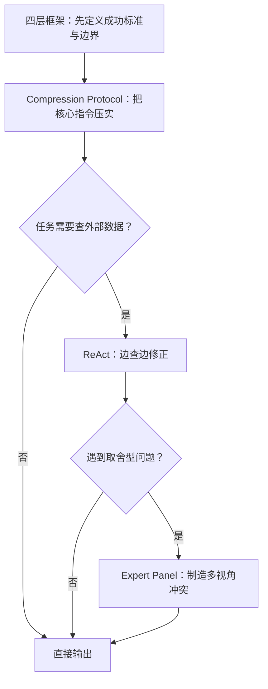

> **难度**：⭐⭐⭐⭐ | **类型**：方法论梳理 + 实战模板 | **更新日期**：2026-06-23 | **预计阅读时间**：22 - 30 分钟
>
> **适合读者**：AI 应用开发者、Agent 设计者、提示词工程实践者
>
> 提示词工程没死，只是长胖了。两年前我们讨论怎么写好一段话，现在要讨论一组配置：任务怎么定义、上下文怎么组织、工具什么时候启动和停下。措辞改好了能把 87 分推到 93 分，但剩下的分数不在句子里面。
>
> **事实边界**：ReAct、Chain-of-Thought 与长上下文位置偏差分别基于公开论文 [ReAct](https://arxiv.org/abs/2210.03629)、[Chain-of-Thought Prompting](https://arxiv.org/abs/2201.11903) 与 [Lost in the Middle](https://arxiv.org/abs/2307.03172)。prompt engineering 与 context engineering 的关系以 Anthropic 的公开工程文章和文档为主要参考。**Expert Panel** 与 **Compression Protocol** 是工程化便捷称呼，不是统一的学术术语。2026 年的写法变化体现在工程化层叠，底层论文多来自 2022 - 2023 年。

## 目录

1. [学习目标](#1-学习目标)
2. [先把「2026 年的提示词工程」说清楚](#2-先把2026-年的提示词工程说清楚)
3. [系统全景：四个策略各在什么层级解决问题](#3-系统全景四个策略各在什么层级解决问题)
4. [策略一：Expert Panel（多角色评审）](#4-策略一expert-panel多角色评审)
5. [策略二：Compression Protocol（关键信息锚点）](#5-策略二compression-protocol关键信息锚点)
6. [策略三：ReAct 循环（Reason + Act）](#6-策略三react-循环reason--act)
7. [策略四：四层框架——先定位故障层，再动手修](#7-策略四四层框架先定位故障层再动手修)
8. [四个策略如何接成一条工作流](#8-四个策略如何接成一条工作流)
9. [最小骨架：一套可以直接重写旧 prompt 的模板](#9-最小骨架一套可以直接重写旧-prompt-的模板)
10. [三道练习与自测](#10-三道练习与自测)
11. [60 秒选型表](#11-60-秒选型表)
12. [结语：下一步做什么](#12-结语下一步做什么)
13. [常见问题（FAQ）](#13-常见问题faq)
14. [延伸阅读](#14-延伸阅读)

## 1. 学习目标

读完本文，你应该能够：

- 用四层框架定位任意一个 prompt 的真实故障层
- 判断一个任务是该直接写清规格，还是引入 Expert Panel、Compression Protocol 或 ReAct 循环
- 把一份旧 prompt 改写成带成功标准、约束、停止规则的精简骨架
- 区分哪些方法有论文出处，哪些只是工程实践里的便捷标签

## 2. 先把「2026 年的提示词工程」说清楚

### 2.1 工作重心变了，没有多出一套学派

2026 年的提示词工程，变化不在理论，在工程。简单任务里措辞还是第一位，但一旦任务涉及多轮交互、外部工具或长上下文，决定输出的就不再是「哪句话更像专家」，而是模型拿到了什么材料、这些材料排在什么位置、哪些约束被标成了不可违反。翻译成工程动作就是三组连续判断：哪些信息必须进上下文，哪些适合运行时按需取用，哪些动作需要被循环验证。

一个常见场景：prompt 改了十版还是不稳——八成是成功标准没定义，或者上下文里塞了太多低信号信息。这时候继续找「最合适的那句话」，等于在一个错误的层面上反复改句子。

### 2.2 名字的来历：论文术语 vs 工程标签

文中涉及的名称，来源层级不一样，先说清会少很多误引用。

| 名称 | 来源层级 | 怎么理解 |
| ------ | ------ | ------ |
| **ReAct** | 明确论文术语 | 推理与行动交替进行的工作流 |
| **Chain-of-Thought** | 明确论文术语 | 展开中间推理步骤的 prompting 方法 |
| **Lost in the Middle** | 明确论文结论 | 长上下文里，相关信息处于中部时利用率可能下降 |
| **Context engineering** | 工程概念，来自公开工程文章 | 对进入上下文的所有高信号信息做策划、筛选与维护 |
| **Expert Panel** | 工程化便捷称呼 | 用多角色、不同 KPI 暴露取舍冲突 |
| **Compression Protocol** | 工程化便捷称呼 | 把任务目标与硬约束压成结构化锚点 |

ReAct 可以直接回到论文语境讨论；Expert Panel 与 Compression Protocol 更适合作为工作中的便利标签。区分这一步在跨团队沟通时尤其必要——说「我们在用 ReAct 做工具循环」和「我们在用 Expert Panel 做评审」是两件完全不同的事。

### 2.3 上下文长了，不等于每个 token 都被公平利用

[Lost in the Middle](https://arxiv.org/abs/2307.03172) 讨论了一个很务实的问题：模型能接收更长的输入，但不会稳定利用每一部分。论文在多文档问答与键值检索任务中发现，相关信息出现在上下文中部时，性能常常低于出现在开头或结尾时。这一点来自论文中的实验设置与评测模型，不是所有模型在所有长上下文场景都一个表现，但它指向一个工程现实：**上下文长度增加不会自动带来等比例的信息利用率。**

Anthropic 的 context engineering 文章把这个现象说得更直白：上下文是有限资源，应该用尽量少但尽量高信号的 token 去完成任务。「少」指的是不要用低价值背景、重复的工具输出、陈旧的历史消息去挤占注意力预算。注意力预算有限，根子在 Transformer 的自注意力机制——每个 token 通过 query-key 点积与其他 token 计算注意力权重，上下文越长，单个 token 分配到的注意力越分散，低信号内容推高的是分母，拉低的是高信号内容被注意到的概率（这是工程化解释，严格机制见 Transformer 原论文）。缩减字数本身不解决问题，关键是区分硬约束和低信号背景——只删背景，不删约束。

### 2.4 动手调 prompt 之前，先把三样东西备好

Anthropic 的 prompt engineering 概览给了三样前提：

1. 先定义成功标准——否则「改好了没有」没法判定。
2. 先准备一套可重复的评测方式——否则每次试出来的结果都只是印象分。
3. 先有一版能工作的初稿，再针对失败模式迭代。从空白页上幻想最佳写法，往往连失败模式都观察不到。

三样都没备好就上策略，等于在没定义成功标准的情况下叠加 token 消耗——评测分不出高低，迭代没有方向。

还有一条边界常被忽略：不是所有失败都该靠 prompt engineering 修。延迟太高、成本超标、工具返回质量差、模型能力到顶——这些更适合换模型、改工具设计或调整系统架构。把这些也压回 prompt，本身就是误诊。

四类策略对应的失效模式与适用场景：

| 策略 | 解决什么 | 什么时候上 |
| ------ | ------ | ------ |
| **Expert Panel** | 单一角色输出圆滑、缺少取舍 | 多方案比较、技术评审、风险权衡 |
| **Compression Protocol** | 长上下文里硬约束被噪音冲淡 | 长系统提示词、复杂任务说明、RAG 输出整理 |
| **ReAct 循环** | 一次性回答覆盖不了检索、工具调用与验证 | Agent、调试、诊断、数据查询 |
| **四层框架** | 团队不知道问题出在写法、上下文还是规格 | 排查失效 prompt、重写系统指令、做评测 |

## 3. 系统全景：四个策略各在什么层级解决问题

四个策略不在同一个平面上。它们对应的干预层级不同，用错了层级等于在病灶旁边绕圈。先看清它们各自打在哪一层，后面的战术选择才不会错位。

```text
                    ┌──────────────────────────────┐
                    │     四层框架：诊断层          │
                    │  先回答「问题出在哪一层」     │
                    └──────────┬───────────────────┘
                               │ 定位后分发
          ┌────────┬───────────┼───────────┬────────┐
          ▼        ▼           ▼           ▼        ▼
    规格/意图层   上下文层    写法层      工具/工作流层
    ┌──────┐  ┌──────┐   ┌──────┐    ┌──────┐
    │Expert│  │Compr-│   │ 写法 │    │ReAct │
    │Panel │  │ession│   │ 优化 │    │ 循环 │
    │      │  │Proto-│   │(措辞)│    │      │
    │解决：「都│col    │   │      │    │解决：「一
    │可以」式 │      │   │解决：格│    │次性猜不
    │圆滑输出│解决：「关│   │式漂移│    │对」
    │      │键约束被│   │偶发误│    │
    │打在哪：│噪音冲淡│   │解   │    │打在哪：
    │模型输出│」     │   │      │    │工具调用
    │的评价函│打在哪：│   │打在哪：│    │循环
    │数冲突 │上下文注│   │prompt │    │
    │      │意力分配│   │文本  │    │
    └──────┘  └──────┘   └──────┘    └──────┘
```

这张图主要用来判断「用错层」。假设你的 QA 机器人输出格式偶尔漂移、核心内容大致正确——这是写法层的问题，上 ReAct 只会引入不必要的工具调用和延迟。反过来，上下文里灌了 20 条检索结果、前 5 条来自旧文档、后 5 条来自已废弃功能——这是上下文层的问题，改句子解决不了。

- **Expert Panel 和 ReAct 解决的是两类不同的「发散」**：前者解决评价函数单一导致的圆滑输出；后者解决信息不足导致的闭门猜测。症状都是「回答不满意」，但根因和修复路径完全不同。
- **Compression Protocol 不替代四层框架**：四层框架先判断故障层，如果落在上下文层，Compression Protocol 是这一层里最有效的修复动作之一。但规格层的问题跟「信息密度」无关——成功标准没定义清楚，压得多紧都没用。

建议的处理顺序：遇到任何 prompt 问题 → 先用四层框架定位 → 规格层问题先补成功标准 → 上下文层问题用 Compression Protocol → 写法层问题调措辞和 few-shot → 需要工具循环的上 ReAct → 需要暴露取舍的叠加 Expert Panel。后面的四个策略详解，都按这条顺序展开。

## 4. 策略一：Expert Panel（多角色评审）

### 4.1 单角色输出的通病：保守且回避取舍

让模型扮演「资深专家」很常见，但单角色有一个通病：输出经常表面稳重、实际保守——每个方案讲两句优点，最后落回「要结合业务场景综合判断」。这类回答在逻辑上挑不出错，却没法拿来决策。它没把关键冲突和代价展开。单角色容易保守，是因为模型在没有明确评价函数冲突时，会回避任何可能被判定为「片面」的取舍——训练数据里这类圆滑回答的接受度最高，模型自然往这个方向收敛。

现实里的技术评审会把互相冲突的目标摊开来谈，不会把所有正确的话都念一遍。性能与安全、交付速度与长期维护、短期收益与治理成本——这些本来就不可能同时最优。Expert Panel 做的事就是用不同角色的评价函数，把冲突强行显性化。

比如你问模型「用单体还是微服务」，单角色回答往往是「单体适合小团队快速迭代，微服务适合大团队独立部署，要根据实际情况选择」。这句话每一句都对，但读完之后你还是不知道该怎么选。加上 Expert Panel，架构角色会说「微服务的部署流水线和监控体系需要额外投入 3-6 个月」，业务角色会接「6 个月的延迟对当前项目不可接受」，冲突就出来了。

### 4.2 什么时候值得上，什么时候不值

| 场景 | 适合？ | 理由 |
| ------ | ------ | ------ |
| 微服务 vs 单体、SQL vs NoSQL 这类方案比较 | 适合 | 本身就存在多维度权衡 |
| 架构评审、技术债取舍、上线风险评估 | 适合 | 需要把利弊与站位讲明 |
| 「ReAct 论文是哪年发的」这类纯事实问答 | 不适合 | 要求准确回答，不需要辩论 |
| 有明确单一标准答案的任务 | 不适合 | 多角色只会增加噪音和成本 |

一个问题值不值得上多角色，看它的核心是取舍还是检索事实。取舍型问题用 Expert Panel；事实型问题，检索就够了。

### 4.3 一版更可靠的写法

不要只写「请模拟三位专家讨论」。决定效果的是角色之间的评价维度差异，以及他们是否必须回应彼此的冲突点。

```text
你将模拟一次技术评审会，参与者有三位：

1. 架构负责人：优先关注系统复杂度、可扩展性、迁移成本
2. 安全负责人：优先关注攻击面、权限边界、审计能力
3. 业务负责人：优先关注交付周期、用户影响、回报速度

请围绕以下问题展开讨论：
{问题}

要求：
- 每个角色先给出自己的推荐方案
- 明确指出最担心的代价是什么
- 至少回应一位其他角色的分歧点
- 最后给出综合建议：推荐什么、不推荐什么、成立前提是什么

输出格式：
【角色】
- 推荐：
- 主要收益：
- 主要代价：
- 对其他角色的回应：

【综合结论】
- 最终建议：
- 成立前提：
- 哪类团队不适合：
```

这段模板能起效，靠三样东西：每个角色有不同 KPI、角色之间必须回应分歧、综合结论要写出成立前提。缺其中任一条，输出都可能重新滑回「都可以」。

某团队在选 API 网关方案时，让「成本控制角色」（KPI：年度运维总费用）和「可靠性角色」（KPI：全年可用性 SLO）分别按自己的评价函数给出推荐，结果暴露了一个之前没人提的前提——可靠性角色推荐的自建方案需要额外投入两名 SRE，而成本角色推荐的托管方案在高并发下有额外限流费用。最终结论落在折中方案：半年内先用托管方案，同步搭建自建方案的灰度环境，根据监控数据在 Q3 做最终切换。

### 4.4 怎么判断它真的起效了

Expert Panel 写完后，用 3 个信号做快速验收：

1. 输出里出现了互相冲突的优先级，没有换措辞重复同一观点。
2. 综合结论同时写明了「推荐什么」和「不推荐什么」。
3. 最终建议附带了前提条件，比如「适用团队规模 < 20 人」「要求已有 Kubernetes 运维能力」这类具体约束。

三条都不满足时，问题通常不在模型——角色设计没有拉开差异。

### 4.5 代价与常见误用

Expert Panel 的收益是把权衡讲透，代价是 token 消耗、响应时延和输出长度都会明显上升。粗略经验值：3 角色面板比单角色回答多消耗 3-5 倍 token，响应时间多 2-3 倍。常见误用有三个：

1. 角色高度同质——「架构师 A、架构师 B、架构师 C」。这种设计只会制造重复，制造不出分歧。
2. 人设写得很花，评价函数却很空。模型不需要口头禅和生平故事，需要的是不同的目标函数。
3. 把辩论原样交给最终用户。在多数场景里，Expert Panel 更适合做中间分析层——用户要的是整理过的结论，三位专家的完整对话记录对他们没用。

## 5. 策略二：Compression Protocol（关键信息锚点）

### 5.1 压缩的目标是「硬信息密度」，字数只是表象

「压缩」容易被理解成删字数。但问题在于重要信息和次要信息混在一起——模型分不清哪些内容不能丢。

Compression Protocol 要做的事：把任务目标、成功标准、硬约束、禁止事项、输出要求、停止条件压成结构化锚点，并在长上下文中，把最关键的一两条放在更容易被注意到的位置（开头或结尾区域）。

Anthropic 的 context engineering 文章点出了两个直接相关的原则：系统提示应该清楚、直接，保持「最小但充分」的信息量；few-shot 示例应该挑代表性的 canonical examples，不要把所有边缘情况塞进去。这两条原则落到 Compression Protocol 上，就是把硬约束从背景里提炼出来、独立成块，让模型在长上下文里也能稳定看到。独立成块有效，是因为 Transformer 的注意力机制对每个 token 分配的权重相互竞争——硬约束混在背景段落里时，会被周围语义噪音稀释；独立成块后，约束获得相对独立的注意力槽位，被遵守的概率显著上升。

一个典型场景：客服系统 prompt 从数百字膨胀到数千字，里面混杂了品牌调性说明、历史事故复盘、产品更新记录和大量「请保持礼貌」的反复强调。压缩后保留的是少数硬约束（不退款、不辱骂、不编造库存）、可量化的成功标准（问题闭环率、错误信息率）以及一条停止规则（连续两轮无法推进时升级人工）。品牌调性和事故记录挪到运行时按需查询的知识库。这类改动的价值主要在删减干扰——模型在长上下文里能更稳定地注意到剩下的硬约束，约束数量增加反而会分散注意力。

### 5.2 什么内容该进核心区，什么内容该退出去

下面这几类信息会直接改变模型行为，优先压缩进核心锚点：

1. 任务目标。
2. 成功标准。
3. 硬约束与禁止事项。
4. 输出格式与目标受众。
5. 停止条件与未知处理规则。

下面这些通常不该挤进核心区：背景故事、解释性铺垫、不影响行为的风格偏好、重复但没有新增约束的信息。长背景可以保留，但更适合放在次级上下文，或改成运行时按需取用。

### 5.3 一份可直接改写旧 prompt 的模板

```text
【任务】
输出一份面向 CTO 的故障复盘摘要，控制在 500 字内。

【成功标准】
- 说清事故原因、影响范围、临时止血措施、后续修复项
- 不编造监控数据
- 风格直接，不做情绪化表述

【硬约束】
- 只使用提供的日志、工单与监控结论
- 不得补充未确认的根因
- 如果证据不足，明确写「尚未确认」

【输出格式】
1. 事故概述
2. 已确认事实
3. 尚待确认项
4. 后续动作

【停止规则】
- 证据足够时直接输出
- 关键信息缺失且无法从资料补齐时，提出一个澄清问题
```

这套模板依赖前面的结构化分层——只有把硬约束独立成块，「最后再重复一遍任务」才会产生实际作用。上下文已经很长、关键信息容易被冲掉时，重复锚点才有意义；上下文本来就很短的情况下，重复反而制造冗余。

### 5.4 怎么评估压缩有没有做对

用 4 个问题快速复盘：

1. 如果只允许保留 5 行，哪 5 行最不能丢？
2. 硬约束是否独立成块，没有埋在背景段落里？
3. 成功标准能不能被评测脚本或人工审阅直接验证？
4. 删掉一段背景说明后，任务是否仍能稳定完成——或者这段信息是否已经被其他约束覆盖了？

第四条答不上来，通常说明这段背景还没被提炼成真正的约束。

### 5.5 和 compaction、口号式写法的区别

Compression Protocol 与 Anthropic 在 context engineering 文章里提到的 compaction（上下文压缩）作用层级不同：compaction 偏向长任务中的上下文压缩与续航，把已有上下文总结后继续推进；Compression Protocol 说的是在系统提示或任务说明层面，把硬信息写成高信号结构。

另一个常见误区是把压缩写成命令口号：全大写、很多 MUST、同一句话连写三遍。约束本身如果仍然模糊——比如「必须保证高质量输出」——再强烈的语气也帮不了忙。真正起作用的是具体、可验证的条件。

## 6. 策略三：ReAct 循环（Reason + Act）

### 6.1 ReAct 适合「需要观察之后再继续」的任务

[ReAct](https://arxiv.org/abs/2210.03629) 的核心是让推理与行动交替发生：先基于当前证据提出下一步假设，再去检索、查询或调用工具，然后根据 observation 回来修正判断。论文把 reasoning traces 与 task-specific actions 放进同一条轨道——它减少的是闭门猜测。每一步推理都有外部证据校验，纯 CoT 在信息不足时容易沿着错误前提一路展开，ReAct 通过 observation 把推理拉回证据地面。

这与 [Chain-of-Thought](https://arxiv.org/abs/2201.11903) 的边界需要单独画一条：CoT 把中间推理步骤展开，ReAct 把推理和外部行动交错起来。两者不互斥——CoT 偏一次性展开推理，ReAct 偏边思考、边观察、边修正。从 token 消耗角度看，ReAct 比纯 CoT 贵（每次 action 都产生额外 token），但当任务涉及时变数据（日志、实时指标、动态配置）时，CoT 基于已过时的前提展开推理的代价通常比 ReAct 的额外 token 成本更高。

### 6.2 工程上，不需要把内心独白全部倒给用户

ReAct 的工程价值在交替式决策，不必把一长串内部推理公开给用户。生产环境里更稳的做法是：对内保留必要的推理空间，对外只暴露行动日志、进度摘要、关键信息增量和最终结论。这样既方便调试，也避免把大量中间猜测直接丢给用户。

下面这版模板可以直接套用：

```text
你是一个会使用工具的分析助手。

处理复杂任务时，按以下循环工作：
1. Thought：基于当前证据，给出下一步最值得验证的假设
2. Action：执行一个最小必要动作（检索、查询、调用工具）
3. Observation：记录返回结果里与任务相关的事实
4. Next Step：判断是继续、改道，还是停止

规则：
- 一次只做一个最有信息增量的动作
- 如果已有证据足够回答，就停止，不要继续调用工具
- 如果关键数据缺失且工具拿不到，再向用户提问
- 无法验证的部分要显式标注未知
```

工程实现上，ReAct 循环的最小骨架大致是这样的：

```python
import json
from dataclasses import dataclass
from typing import Any


@dataclass
class ThoughtResult:
    reasoning: str
    is_final: bool = False
    answer: str = ""
    tool_name: str = ""
    tool_args: dict[str, Any] | None = None


def react_loop(
    llm_call,
    tools: dict[str, callable],
    task: str,
    max_steps: int = 10,
    timeout: float = 30.0,
) -> str:
    """简单的 ReAct 循环：推理 → 行动 → 观察 → 再推理。

    llm_call(task, evidence) 返回 ThoughtResult
    tools 是工具名到函数的映射，每个函数接收 kwargs 并返回字符串

    关键设计：
    - max_steps 防止无限循环（正式环境建议 5-15，视任务复杂度调整）
    - is_final 让模型自己决定何时停止，而不是等步数耗尽
    - evidence 列表累积每一步的推理和观察，形成可追溯的决策链
    """
    evidence: list[str] = [f"任务: {task}"]

    for step in range(max_steps):
        thought = llm_call(task, evidence)
        if thought.is_final:
            return thought.answer

        tool_fn = tools.get(thought.tool_name)
        if tool_fn is None:
            evidence.append(
                f"[错误] 未知工具 '{thought.tool_name}'，"
                f"可用工具: {list(tools.keys())}"
            )
            continue

        try:
            observation = tool_fn(**(thought.tool_args or {}))
            evidence.append(f"[{thought.tool_name}] → {observation}")
        except Exception as exc:
            evidence.append(
                f"[{thought.tool_name}] 调用失败: {exc}"
            )

    return (
        "已达步数上限。\n"
        "已知证据:\n" + "\n".join(f"- {e}" for e in evidence) +
        "\n未确认的推断已标注。"
    )
```

骨架里四个关键设计：`max_steps` 兜底防止无限循环（正式环境建议根据任务复杂度设 5-15）；`thought.is_final` 是停止规则的代码化表达，让模型主动收敛而不是被动超时；`evidence` 列表让每一步推理都能引用前序观察，形成可追溯的决策链；未知工具和调用异常都有处理路径。生产环境还需要补上 token 用量监控、工具调用重试策略（建议 2 次指数退避）和一条熔断规则——单次循环 token 消耗超过阈值（比如 8000）时触发人工介入。

### 6.3 排查案例：客服回答不一致问题

假设你在做一个带检索的客服助手，用户反馈「同样的问题今天和昨天的回答不一致」。这类问题很难靠一次性 prompt 解决——首先要搞清楚差异从哪里来。

用 ReAct 的思路，排查过程是这样的：

1. **Thought**：先判断差异来自检索结果变化，还是系统 prompt 漂移。
2. **Action**：查看最近两次请求的召回片段和系统配置版本。
3. **Observation**：系统 prompt 没变，但召回片段发生了替换。
4. **Next Step**：继续检查召回排序逻辑、索引更新时间，或缓存策略是否变化。

把场景换成运维团队的故障诊断 Agent，流程会更长。用户输入「数据库查询在昨天 23:00 突然变慢」，系统的工作流没有一次性给结论，而是走了一轮 ReAct：

1. **Thought**：判断先查慢查询日志还是先查机器负载。
2. **Action**：查询昨天的慢查询日志，筛选 22:50-23:10 时间段。
3. **Observation**：该时段出现大量全表扫描，主要集中在 `orders` 表，锁等待时间飙升，最大锁等待时长达到 47 秒。
4. **Thought**：锁等待飙升通常与未提交事务或长事务有关——全表扫描本身不会造成这么长的锁等待，除非有其他事务持有锁。
5. **Action**：查询数据库活跃事务，过滤持续时间 > 30s 的会话。
6. **Observation**：发现一个从 22:55 开始的未提交事务，执行了一个不带 WHERE 条件的 UPDATE `orders` 语句，已持有排他锁超过 28 分钟。
7. **Next Step**：证据足够——根因是未提交事务导致锁等待。停止搜索，输出结论并附带会话 ID（`session_id: 3a7f-...`）和 SQL 文本。

ReAct 在这里做到的是每一步都基于 observation 推进。如果凭第一反应下结论，很可能在第一步就跳过 22:55 那条未提交事务，直接归因到「全表扫描」——诊断停在表面，修复方案也会跟着跑偏。每一步的 observation 把推理方向校正回来，少了它，推理就会沿着错误前提继续展开。

### 6.4 停止规则写不清，ReAct 就会退化成成本黑洞

ReAct 最怕的是「循环过头」——这会直接把成本拉爆。不够主动反而好处理。一个能上线的 ReAct 工作流，至少要提前定义三件事：

1. **何时停止搜索**——证据已足够支持结论时停止。
2. **何时向用户提问**——只有关键缺失信息会改变答案时才问。
3. **何时承认未知**——拿不到证据时明确标注，停止继续碰运气。

判断 ReAct 是否健康，看三个指标：每个动作是否都能解释信息增量、无效工具调用比例是否在下降、最终输出里未知项是否被老实标注。第三点做不到，这个循环就还没有真正收敛。作为附加保险，建议在生产环境里给 max_steps 设一个比理论值更紧的上限（5-8 步通常足够），并在超出时触发人工审核——宁可少查一步也不要把 token 预算烧干。

## 7. 策略四：四层框架——先定位故障层，再动手修

prompt 调不好，很多时候是因为团队连问题出在哪一层都没分清。有人一直改措辞，有人一直堆示例，有人一直换角色设定——但故障点可能在目标定义、上下文供给或业务意图，写法只是最外层的皮。

把问题拆成四层之后，定位会清楚很多：

| 层级 | 回答什么问题 | 常见失效症状 | 优先检查什么 |
| ------ | ------ | ------ | ------ |
| **规格层** | 到底什么算完成 | 输出很努力，但不符合验收 | 成功标准、硬约束、边界条件 |
| **意图层** | 你真正想解决什么 | 回答「看起来对」，帮不到业务 | 深层目标、优先级、隐性约束 |
| **上下文层** | 模型手上有什么信息 | 漏掉关键事实、被噪音带偏、前后不一致 | 检索内容、示例、历史消息、工具返回 |
| **写法层** | 指令是否清楚好读 | 格式不稳、偶发误解、风格漂移 | 措辞、结构、分节、标签 |

### 7.1 规格层——多数情况下比写法层更值得先查

团队的第一反应几乎总是改句子。比如把「帮我优化首页」换成「请作为资深前端工程师深入优化首页性能和体验」。这种改写有时会改善风格，但如果「优化」到底意味着加载更快、转化率更高、无障碍更好还是交互更稳——本来就没定义清楚——模型仍然是在猜。

一份能用的规格至少回答 5 个问题：目标对象是谁、输出长什么样、绝对不能做什么、什么条件算完成、证据不足时该怎么办。这 5 个问题没写清之前，继续在写法层折腾很少会带来决定性收益。

写代码审查 prompt 的团队经常碰到这种事：反复调整措辞，输出质量始终不稳。回到规格层重写，把成功标准从「给出有用的建议」改成「每条建议必须附带代码位置引用和不少于一个具体改写示例」之后，输出立刻收敛。这类问题的根因通常在成功标准是否可验证——可验证的标准让模型从「猜什么是好建议」变成「按字段填空」，措辞调整无法替代这种结构化约束。

### 7.2 上下文层——今天最容易被低估的故障源

在真实系统里，模型输入从来不只是 prompt 文本。它还包括检索片段、工具返回值、消息历史、系统状态、用户权限、缓存结果与中间记忆。任何一环变脏，最终输出都会漂移。

context engineering 值得单独成章，原因也在这里。你提供的信息越多，注意力竞争就越激烈；「能不能塞得下」早已经不是问题，问题在于哪些信息值得留下。

举个例子：RAG 系统给模型灌了 20 条检索结果，其中前 5 条来自过时的文档，后 5 条来自已废弃的实验性功能，中间 10 条才是正确的当前版本文档。模型没有能力区分文档版本，最终生成了一段混合了新旧 API 的错误示例。这个故障出在上下文层的检索质量上，写法层和规格层都没问题。

### 7.3 一个可以照着走的排查顺序

```text
Step 1：规格层
- 成功标准明确吗？
- 不允许做什么写清了吗？
- 输出格式和边界条件能验收吗？

Step 2：意图层
- 用户表面需求背后，真正想解决什么？
- 多个目标冲突时，谁优先？

Step 3：上下文层
- 模型拿到的信息够不够？
- 有没有噪音、过期资料或低质量召回？
- 重要信息放在了容易被看到的位置吗？

Step 4：写法层
- 指令有没有歧义？
- 分节是不是太散？
- 示例是否真的代表目标输出？
```

多数情况下，排到第二层或第三层，问题就已经露出来了。很多「prompt 失效」的根因在规格层或上下文层，写法层只是表象。

### 7.4 症状到修复动作的速查表

落地排查时，先把典型症状和修复方向对上：

| 症状 | 更可能是哪一层 | 优先修复动作 |
| ------ | ------ | ------ |
| 回答看起来努力，但和验收要求不对齐 | 规格层 | 把成功标准改成可验证条目 |
| 事实经常漏掉关键条件，不同轮次差异大 | 上下文层 | 清理噪音，重新组织检索与锚点 |
| 方案分析总是过于圆滑，缺少取舍 | 意图层 / 写法层 | 引入 Expert Panel，强制回应冲突 |
| 工具调用很多，结论仍然发散 | 上下文层 / 工作流 | 给 ReAct 增加停止规则与未知处理 |
| 输出格式偶尔漂移，核心内容大致正确 | 写法层 | 收紧结构、标签与 few-shot 示例 |

## 8. 四个策略如何接成一条工作流

假设你要做一个面向企业研发团队的故障分析助手。合理的落地顺序是：



具体来说：

1. **先用四层框架写规格**。定义目标、边界、成功标准与未知处理规则。
2. **再用 Compression Protocol 压实核心指令**。把任务、约束、输出与停止条件整理成高信号结构。
3. **需要查日志、查监控、查工单时，引入 ReAct**。让模型基于 observation 持续修正下一步动作。
4. **遇到取舍型问题时，再叠加 Expert Panel**。举例：「这次故障优先补缓存、补熔断还是重构依赖治理」。

这条顺序做的是：先定义什么算完成，再决定哪些信息必须进入上下文，再决定什么时候需要循环观察，最后才决定是否需要制造多视角冲突。

换一个完全不同的场景——面向内容团队的「事实核查与改写助手」——同样的顺序依然适用：

1. **先写规格**。定义输出要同时满足事实准确、语气克制、保留原意；禁止补充未核实结论。
2. **再压缩锚点**。把可用资料、引用规则、输出格式、未知处理方式整理成高信号区块。
3. **需要查资料时走 ReAct**。让系统逐条核对来源、记录 observation，再判断是否继续查证。
4. **遇到风格与准确性的冲突时，再引入 Expert Panel**。让「事实核查角色」和「编辑角色」分别指出删改风险与可读性问题，最后再合并结论。

两个例子行业不同，但顺序一致——这条工作流不限于特定业务领域。

### 8.1 反例：跳过规格层直接上 Expert Panel

顺序错了，四个策略各自再对也救不回来。有个团队做「代码评审助手」，第一版直接上 Expert Panel，让「架构师」「安全工程师」「性能工程师」三个角色讨论每一段代码。输出冗长、互相重复，开发者抱怨「读完不知道该改哪一行」。团队的反应是再加第四个角色「平衡观点」，输出更长。

问题在规格层空着——「一条评审意见必须附带代码位置引用和具体改写示例」这条成功标准从未定义。规格层模糊时，Expert Panel 会把模糊放大成更长的模糊。回到第一步，把成功标准写成「每条意见可被开发者直接执行（含文件路径、行号、改写片段）」，再压成 Compression Protocol 锚点，Expert Panel 反而收敛——每个角色都被迫在「可执行」这个约束下表态。

## 9. 最小骨架：一套可以直接重写旧 prompt 的模板

很多旧 prompt 不需要推倒重来。先改成下面这版骨架，再按任务特点叠加策略：

```markdown
## Goal
[最终要交付什么]

## Success Criteria
- [满足什么条件才算完成]

## Constraints
- [绝对不能违反的边界]

## Available Context
- [模型可使用的信息来源]

## Output
- [输出格式、长度、对象]

## Stop Rules
- [何时停止、何时追问、何时承认未知]
```

这份骨架把「好 prompt」从玄学拆成几个明确字段。等这几个字段稳定以后，再决定是否叠加 Expert Panel、Compression Protocol 或 ReAct——比一上来就堆技巧更可控。

### 9.1 改写前 → 改写后对照

下面是一段典型的旧 prompt（来自真实团队常见写法，已脱敏）：

```text
你是一位资深的前端工程师，请帮我优化首页性能。要专业、深入、全面，
考虑各种可能的优化方向，给出详细的建议。请用中文回答，格式清晰。
```

这段 prompt 的问题：没有成功标准（「优化」到底指什么？）、没有硬约束（不能用什么？）、没有停止规则（证据不足怎么办？）、没有可用上下文（模型手上有什么资料？）。模型只能猜，输出往往是「压缩图片、减少 HTTP 请求、使用 CDN」这类正确但无法落地的清单。

改写成骨架之后：

```markdown
## Goal
输出一份面向首页性能优化的整改清单，可直接交给前端工程师执行。

## Success Criteria
- 每条建议必须附带：问题位置（文件/URL）、预期收益（LCP/CLS/TTFB 具体数值范围）、实施成本（人天）
- 至少覆盖 LCP、CLS、TBT 三个核心 Web Vitals 指标
- 不允许出现「建议优化图片」这类无落地信息的条目

## Constraints
- 只基于提供的 Lighthouse 报告和 Chrome DevTools 性能录制
- 不得建议更换技术栈（当前是 Next.js 14）
- 不得补充未在报告中出现的根因

## Available Context
- Lighthouse 报告（JSON）：见附件
- 首页关键渲染路径截图：见附件
- 当前线上 LCP = 4.2s，目标 < 2.5s

## Output
- Markdown 表格：问题 | 位置 | 预期收益 | 实施成本 | 优先级
- 总长度控制在 800 字内

## Stop Rules
- 报告数据足以支撑结论时直接输出
- 关键指标缺失时，先列出需要补充的测量项，再给已知部分的建议
```

改写后的版本：成功标准可验证（每条建议必须有位置、收益、成本）、硬约束明确（不换技术栈、不编造根因）、停止规则清晰（数据缺失时先列测量项）。模型从「猜」变成了「按字段填空」，输出可以直接进入排期，不再停留在「正确但无法落地」。

### 9.2 不算代价就上策略，和不算成本就上架构一样危险

四种策略都有效，但没有一种是零代价的。把代价和观察指标一起写进评测表，比凭直觉加策略可靠得多。

| 策略 | 主要代价 | 优先观察什么 |
| ------ | ------ | ------ |
| **Expert Panel** | token 成本上升 3-5 倍，输出更长，结论整理成本增加 | 是否真的暴露冲突，并明确排除不推荐方案 |
| **Compression Protocol** | 前期抽象成本更高，需要先想清楚什么是硬约束 | 关键约束是否在多轮评测里更稳定地被遵守 |
| **ReAct** | 工具调用、时延和系统复杂度上升，平均多 2-5 轮交互 | 无效动作比例是否下降，停止规则是否真正生效 |
| **四层框架** | 前期诊断时间增加 20-40 分钟，团队需要统一术语 | 是否减少了盲目改写，是否更快定位责任层级 |

当一个策略的代价已经明显高于收益时，先退回更简单的方案；继续微调只会让代价继续累积。

## 10. 三道练习与自测

### 练习一：判断故障层并给出修复方向（入门）

下面这段 prompt 来自一个团队的代码审查助手，输出始终不稳定：

```text
你是一位资深代码审查员，请帮我审查以下代码，给出专业的改进建议。
```

问题：
1. 这段 prompt 的故障主要在哪一层？
2. 给出修复方向（不需要写出完整 prompt）。

<details>
<summary>参考答案</summary>

**故障层**：规格层。

**判断依据**：
- 没有成功标准——「专业的改进建议」无法验证，模型不知道什么算「专业」、什么算「改进」。
- 没有硬约束——不限定只审查提供的代码、不限定输出格式、不限定是否需要附带代码示例。
- 没有停止规则——证据不足时该怎么办没写。

**修复方向**：
1. 把成功标准改成可验证条目，例如「每条建议必须附带代码位置（文件:行号）和具体改写示例」。
2. 补硬约束：只基于提供的代码、不得补充未在代码中出现的根因。
3. 补停止规则：代码量过大时先输出优先级最高的 3 条，其余标注「待审查」。

规格层没对齐时，措辞调整的收益很有限——这是先查规格层再查写法层的核心原因。

</details>

### 练习二：四层诊断一个你自己的 prompt

拿你团队里一个「不算坏，但始终不稳」的 prompt。先不要动字句，只回答四个问题：

1. 它的成功标准是否可验证？
2. 它真正服务的业务意图是什么？
3. 模型当前能拿到哪些信息，哪些是噪音？
4. 只有到第四步时，再看写法是否有歧义。

前三步没答清之前，不应该先改句子。

### 练习三：把长 prompt 压成锚点结构

找一段你们正在使用的长系统提示词，只保留任务目标、成功标准、硬约束、输出要求与停止规则。然后看删掉的背景里有没有实际上不能丢的信息。这个练习的关键是学会区分「看起来重要」和「会改变行为」——删背景时不删约束，删约束时必须确认它真的不影响输出。

### 自测

用下面这组问题检查理解程度。每条能用一两句话回答，说明核心内容已经到位。

1. 你的 prompt 里，成功标准是「可验证的结果描述」还是「模糊的形容词」？
2. 如果只允许保留 5 行系统提示词，哪 5 行最不能丢？
3. 当前 prompt 的硬约束是独立成块，还是埋在背景段落里？
4. 模型产生错误时，你最先排查的是规格层、意图层、上下文层还是写法层？
5. 什么情况下 Expert Panel 反而会制造噪音，无法暴露冲突？
6. 压缩系统提示词时，你删掉的是「背景故事」还是「硬约束」？
7. ReAct 循环里，停止规则是否写到了「证据足够就停」这个粒度？
8. 你的 prompt 里，有没有靠「全大写」「多写一遍」来代替「写清楚约束」？
9. 连续改了三轮写法还是不稳——你停下来回到规格层了吗？
10. 你正在用的 prompt 里，有哪些信息属于「看起来重要」但实际不改变输出的？

## 11. 60 秒选型表

| 眼前问题 | 先用什么 | 暂时别急着做什么 |
| ------ | ------ | ------ |
| 模型回答太圆滑，没把方案利弊讲透 | **Expert Panel** | 继续加「请更专业一点」这类措辞 |
| 长系统提示词经常漏掉关键约束 | **Compression Protocol** | 单纯把 prompt 写得更长 |
| 问题必须查资料、调工具、看反馈才能回答 | **ReAct** | 一次性要求「完整分析并直接给结论」 |
| 不知道问题出在文案、上下文还是目标定义 | **四层框架** | 上来就反复改句子 |

踩坑信号很明确：连续改了三轮写法还是不稳。这时候该停下来，回到规格层和上下文层重新审题，别继续在句子上磨。

## 12. 结语：下一步做什么

写到这里，真正能带走的是「什么时候不该用」——四个策略怎么用只是表面。

两年前的 prompt engineering 指南翻开，大概率会教你写「你是一位资深专家」起手式。今天再翻开，写法还在，前面多了三层：先定义成功标准到可验证的程度，再组织上下文到高信号密度，最后把工具的启停条件写到不会失控。措辞没有归零，但有效区间收窄了——规格和上下文没对齐的时候，措辞调整的边际收益通常不超过 5 分。

再画一条更务实的线：这套框架不要求每次写 prompt 都走完全流程。三行的一次性提问直接写就行，不需要搬出四层框架当仪式。这套方法的适用场景是**需要反复迭代的生产级 prompt**——系统提示词、Agent 指令、评测模板——这些一旦上线就会被反复调用，前期多花 30 分钟的设计时间，后面能省下几十次调试和几百次误判。

四条顺序也不能随便换：先定义「做完了」是什么，再决定什么信息必须留在上下文里，再定观察和修正的节奏，最后才考虑是否需要制造多视角冲突来暴露取舍。这四步是一条连续的生产线，按顺序走完。

落到具体行动上，不妨就从手边一个「感觉还行但偶尔抽风」的 prompt 开始。拿四层框架走一遍：它缺了哪一层？如果只改一个字段，改哪个收益最高？修完之后跑三组对比评测，看输出差异度和无效工具调用比例有没有实际变化。有了这一步的数据，你做的已经是工程诊断，不再是凭感觉优化 prompt。

## 13. 常见问题（FAQ）

**Q1：这四个策略和「把 prompt 写长一点」有什么区别？**

四个策略都不靠堆字数起作用。Expert Panel 靠角色间的 KPI 差异制造冲突，Compression Protocol 靠结构化分层提高信息密度，ReAct 靠交替式行动降低猜测成本，四层框架靠分层诊断避免在错误的层面反复修改。只把 prompt 写长，通常只是在写法层增加低信号文本。

**Q2：我已经用了 ReAct，为什么还是会无限循环？**

几乎都是停止规则没写清楚。ReAct 需要三样东西来收敛：何时停止搜索、何时向用户提问、何时承认未知。这三条缺一条，循环就会继续探索下去。先补停止规则，再调其他参数。如果频繁触发 max_steps 上限，可以再看工具返回是否包含足够的终止信号——有时问题不在循环逻辑，而在 observation 的信息密度不够，模型判断不了「证据是否已经充足」。

**Q3：什么时候该用 Expert Panel，什么时候用四层框架就够了？**

如果问题核心是方案取舍（选 A 还是选 B），用 Expert Panel。如果问题是「不知道为什么输出不对」，先用四层框架定位故障层——多数情况下，问题出在规格层或上下文层，写法层只是表象。

**Q4：Compression Protocol 和直接缩短 prompt 长度有什么区别？**

缩短长度可能是在删「看起来不重要」的背景信息。Compression Protocol 是先把硬约束从背景里提炼出来、独立成块，再判断哪些背景不改变输出行为。前者是删减，后者是提炼。实践中一个简单判断标准：删完后跑三组对比评测，看关键约束的遵守率有没有下降——下降了说明删错了对象，约束被当成背景删掉了。

**Q5：这篇文章里的方法有论文出处吗？**

ReAct、Chain-of-Thought、Lost in the Middle 有明确的论文出处（见延伸阅读）。Expert Panel 和 Compression Protocol 是工程化称呼，来自实践经验的归纳。四层框架是本文作者提出的诊断框架，核心思路来自 Anthropic 的 prompt engineering / context engineering 公开资料。区分论文术语和工程标签，在跨团队讨论时尤其重要。

**Q6：这些策略会增加多少成本？**

Expert Panel 增加 token 消耗和输出长度（3-5 倍），Compression Protocol 主要增加前期设计成本（写的时候多花 20-30 分钟，但运行时通常更省 token），ReAct 增加工具调用次数和时延（平均多 2-5 轮交互），四层框架增加诊断时间（20-40 分钟）。第九节的代价表给了每种策略的主要代价和观察指标。从落地经验看，四层框架 + Compression Protocol 组合的 ROI 最高——前期多花 30 分钟设计，后续迭代效率通常有明显提升。如果团队已经有成熟的评测脚本和回归用例，这个 ROI 会更高：Compression Protocol 做一次，评测脚本就能替你验证多次。

**Q7：我团队里每个人对「好 prompt」的标准都不一样，怎么统一？**

先跑一遍四层框架的诊断——大概率问题出在规格层没有共同定义。把「好 prompt」拆成可验证的成功标准、硬约束和停止规则，团队就有了共同的讨论语言。在跨团队评审时，建议直接用第九节的最小骨架模板作为 checklist：Goal、Success Criteria、Constraints、Stop Rules 四个字段填满，基本不会漏掉关键信息。

---

## 14. 延伸阅读

**核心论文**

- [ReAct: Synergizing Reasoning and Acting in Language Models](https://arxiv.org/abs/2210.03629)
- [Chain-of-Thought Prompting Elicits Reasoning in Large Language Models](https://arxiv.org/abs/2201.11903)
- [Lost in the Middle: How Language Models Use Long Contexts](https://arxiv.org/abs/2307.03172)

**工程指南**

- [Effective context engineering for AI agents | Anthropic](https://www.anthropic.com/engineering/effective-context-engineering-for-ai-agents)
- [Prompt engineering overview | Anthropic Docs](https://platform.claude.com/docs/en/docs/build-with-claude/prompt-engineering/overview)
- [Prompt engineering guide | OpenAI](https://platform.openai.com/docs/guides/prompt-engineering)
- [Best practices for prompt engineering with OpenAI API](https://help.openai.com/en/articles/6654000-best-practices-for-prompt-engineering-with-the-openai-api)
- [Prompt design strategies | Google Gemini API](https://ai.google.dev/gemini-api/docs/prompting-strategies)

**自动化提示词优化**

- [DSPy: Programming—not prompting—Foundation Models](https://github.com/stanfordnlp/dspy) — 斯坦福 Hazy Research 出品，用签名和优化器替代手写 prompt

**进阶阅读（来自本文相关线索）**

- [Attention Is All You Need](https://arxiv.org/abs/1706.03762) — Transformer 原论文，理解注意力机制的工程前提
- [Prompt Engineering Guide | DAIR.AI](https://www.promptingguide.ai/) — 社区维护的综合性提示词工程指南，覆盖从基础到 Agent 的完整路径
- [Anthropic's Claude prompting guide](https://docs.anthropic.com/en/docs/build-with-claude/prompt-engineering/overview) — 本文多处引用的工程实践来源
