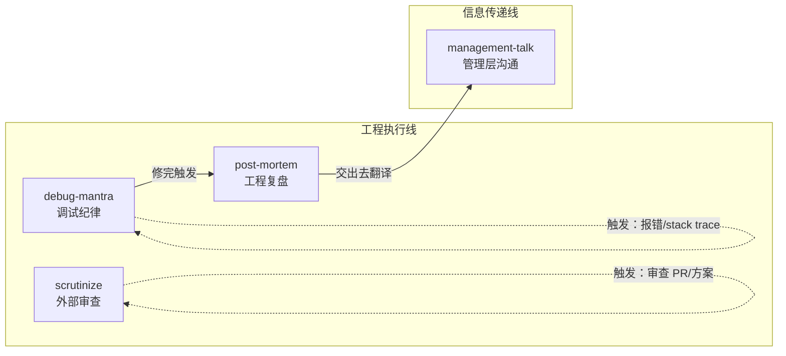

+++
date = '2026-05-21T11:50:00+08:00'
draft = false
title = '9arm-skills：让 AI 编程助手按流程干活的合约式 Skills'
slug = '9arm-skills-claude-code-agent-skills-guide'
description = '9arm-skills 不是提示词模板，而是一组可执行的合约式 Skills，覆盖版本管理、代码审查、测试生成、文档更新等 9 个编码阶段，让 AI 编程助手老老实实按流程干活。'
categories = ['技术笔记']
tags = ['AI', 'Claude', 'Skills', '开发工具']
+++

# 9arm-skills：让 AI 编程助手按流程干活的合约式 Skills

## 阅读指引

**目标读者**：用 Claude Code、Cursor 或类似 AI 编程助手做日常开发的工程师。如果你已经不满足于「AI 给的方案听起来都对但就是差点意思」，这篇文章应该对你有用。

**学习目标**：读完你会理解：

- 把工程流程写成提示词模板和写成 Agent 可执行约束，两种思路的分界线在哪里
- 9arm-skills 里 4 个核心技能各自管什么、在什么时机触发、拒绝在什么条件下执行
- 这套设计背后的工程判断，以及它不适用于哪些场景

**前置知识**：需要知道 Claude Code 的「自定义指令」功能，以及 AI 编程助手的基本工作方式。如果你用过 Claude Code 的 `CLAUDE.md` 或 `.claude/skills` 目录，理解起来会更顺畅。

**范围说明**：9arm-skills 仓库整体覆盖 9 个编码阶段，本文只拆其中最需要纪律保障的 4 个核心技能——`debug-mantra`、`post-mortem`、`scrutinize`、`management-talk`。

## 目录

- [一、你遇到过这种情况吗](#一你遇到过这种情况吗)
- [二、一张图看懂四技能的分工](#二一张图看懂四技能的分工)
- [三、四个技能的完整拆解](#三四个技能的完整拆解)
- [四、一个完整的流转案例](#四一个完整的流转案例)
- [五、这套设计的工程逻辑](#五这套设计的工程逻辑)
- [六、适用与不适用](#六适用与不适用)
- [七、局限性](#七局限性)
- [八、自测](#八自测)
- [九、实战与进阶](#九实战与进阶)
- [十、FAQ](#十faq)
- [十一、收束](#十一收束)

如果你对某个技能已经了解，可以直接跳到[四、一个完整的流转案例](#四一个完整的流转案例)看四个技能怎么配合。

---

## 一、你遇到过这种情况吗

AI 助手给的建议常常「听起来对但差点意思」。模型能力够用，缺的是一组让它在证据不足时停下来的约束。9arm-skills 就是为填这个差距做的。

AI 助手说：「建议把这段逻辑抽成一个独立函数，提高复用性。」

它说得没错。函数确实可以抽。但你的团队有自己的一套做法：哪些逻辑该抽、抽到哪个模块、命名前缀跟什么对齐——这些隐性知识，通用 AI 模型不知道。你拿到的是一句不会错但也不太有用的建议。

再把场景放大一点。你刚修了一个折磨两天的 bug，想让 AI 帮你写复盘文档。它洋洋洒洒给你三段话，看起来结构完整，但仔细一读：没有复现步骤，没有根因追溯链，没有验证方案——写的是一篇「叙事散文」，不是一份工程师之间传递判断的工程记录。

通用模型默认给「最可能有帮助的回答」，但工程流程需要它在证据不足时拒绝回答。

9arm-skills（GitHub: [thananon/9arm-skills](https://github.com/thananon/9arm-skills)，撰写时约 1k Stars）就是为解决这个问题设计的。作者 Thananon Patinyasakdikul（Arm）把项目里最常用、最需要纪律保障的四件事——调试、复盘、代码审查、向上沟通——分别编码成四个技能（Skill）。每个技能是一份**规定了触发时机、执行顺序和退出条件的可执行合约**，AI 必须照办，否则就停下来。

---

## 二、一张图看懂四技能的分工

四个技能覆盖两条主线——一条面向工程执行（工程师对工程师），一条面向信息传递（工程师对组织）。

两条线有明确的交接点：`post-mortem` 产出的是面向工程师的工程真相，如果你需要给 VP 或 PM 看，把这份产出交给 `management-talk`——它负责把函数名、文件路径、commit SHA 翻译成领导层能用来做决策的语言。post-mortem 不删代码标识符，management-talk 不编造事实、不替用户往 Slack 或邮件渠道发帖——两个技能各自守住自己的边界。

---

## 三、四个技能的完整拆解

下面逐一展开每个技能「管什么、怎么执行、在什么条件下拒绝执行」。

### debug-mantra：调试四念处

这是整个技能库中最「硬」的一个——它规定了一条调试纪律，并要求 AI 在每个调试 session 开始时逐字复述，然后按序执行。

**四步执行链：**

1. **复现（Reproduce reliably）** — 在提出任何修复假设之前，必须拿到一个可运行的复现脚本。如果是 flaky（偶发性 bug），先把复现率从 1% 提到 50% 以上——循环触发、加并发压力、注入 sleep 缩小时间窗口。50% 的 flaky 可以调试，1% 的不行。**完全没有复现 → 停下来，明确告知用户，不准跳到假设阶段。**

2. **追踪失败路径（Know the fail path）** — 三条路径按优先级递进：在调试器里设断点 → 源追踪加配置开关枚举 → 代码内埋点（printf/log，每个探针带唯一前缀方便后续 `grep` 清理）。只有当上一级确实走不通时才升级手段。

3. **证伪假设（Falsify the hypothesis）** — 提出 3-5 个排序假设，先跑**证伪实验**。能存活下来的假设才值得继续。只追一个假设会锚定在第一个看起来合理的想法上。

4. **交叉验证每一条线索（Every run is a breadcrumb）** — 维护一份运行账本（ledger）：每次实验改了哪个变量、观察到什么、排除了什么。新假设必须与账本中**所有**历史记录一致。不一致 → 假设有问题，修正或丢弃。

**触发时机**：

- `/debug-mantra` 命令
- 用户报告 bug、说「坏了/报错了/不行」
- 用户粘贴 stack trace 或 error log

**关键约束**：除非用户明确说「跳过口诀」，AI 必须在第一条回复里逐字背诵四步口诀，然后按序执行。这是技能强行加在 AI 行为上的闸门。

---

### post-mortem：工程复盘的及格线

这个技能划了一条硬线：**没有可靠复现、已知根因、已验证修复的情况下，拒绝起草复盘文档**。

这跟大多数人的直觉相反。我们习惯让 AI「帮忙写个复盘」，但它不知道你的 bug 到底修好了没有，也不知道你所谓的「根因」是确认过的机制还是一厢情愿的假设。`post-mortem` 直接把门槛写进触发逻辑里——四个必要条件缺一不可：

- [ ] 存在可靠复现（不是「有时候会崩」）
- [ ] 根因已知（机制确认，不是假设）
- [ ] 修复已落地（有 PR 或 commit 指针）
- [ ] 修复已验证（原始复现通过、客户负载通过）

如果缺了任何一项，它会列出缺什么然后停下来——而不是凑一篇看着像复盘的「推测性叙事」。

**复盘文档结构（4 个必填段 + 5 个条件段）：**

| 段 | 类型 | 内容要求 |
|----|------|----------|
| Summary | 必填 | 一句话：什么坏了 / 什么修好了 / JIRA + PR + Owner |
| Root cause | 必填 | 全链路机制追溯，**保留所有代码标识符**（函数名、文件路径、struct 字段）——这是整个文档最贵的一段 |
| Fix | 必填 | 改了什么，为什么能治根因而非掩盖症状；如有失败的修法尝试，点名并解释错在哪里 |
| Validation | 必填 | 怎么验证的，诚实标注只测了哪些配置——「在 Llama-2-70B / 8 GPU / DeepSpeed 验证通过，未在其他负载重测」比暗示全覆盖有用得多 |
| Symptom | 条件 | 实际见到的错误输出、日志、性能数字 |
| Why it produced the symptom | 条件 | 把根因和症状之间的因果链走通——bug 在 `tadaLaunchPrepare` 里，但客户看到的是几小时后训练挂起 |
| How it was found | 条件 | 调试路径：什么工具、哪些假设被否掉、哪一次实验定案 |
| Why it slipped through | 条件 | CI 盲区 / 潜在代码被后续改动激活 / 之前的修复掩盖了症状 / Review 遗漏 |
| Action items | 条件 | 具体到人 + ticket + PR 的后续动作 |

**两个关键区别**：

- 这是**工程师对工程师**的文档。函数名、struct 字段、commit SHA、行号——全部保留。六个月后的你要靠 `grep` 回到现场，不是靠读叙事散文。
- 它为 `management-talk` 提供源材料。把这份工程文档交给 `management-talk`，后者负责翻译成给 VP 看的版本。

---

### scrutinize：外部视角的端到端审查

`scrutinize` 做一件代码评审里最难自动化的事：先问「这个改动该不该存在」，再查「它到底干了什么」。

大多数 AI 代码审查只读 diff，然后给你一堆风格建议。`scrutinize` 的四步 workflow 顺序不可跳过：

**Step 1 — 意图（Intent）**：用一句话描述这个改动的目标。如果连目标都说不清楚，直接停在这里。然后必须问：有没有更简单或更小的方法达到同样目的？考虑方案包括：

- 不做（问题是真实存在的吗？）
- 用已有的机制而非新增 surface（暴露面）
- 更小的改动解决 90% 的问题
- 在另一个层面解决（配置而非代码、框架而非应用、编译期而非运行时）

**Step 2 — 追踪（Trace）**：从入口点出发，沿真实调用链通读，包含 diff 两侧未被修改的代码。bug 往往藏在 diff 和周边代码的交界处。

**Step 3 — 验证（Verify）**：对每个声称的行为，显式回答「我走了一遍代码路径，实际发生了 X，所以这个声称成立/不成立」。同时检查什么输入/状态会打破它、它悄悄改了什么（性能语义、错误语义、对外契约）、测试是否真的覆盖了所追踪的路径。

**Step 4 — 报告（Report）**：按严重程度排列，每个发现包含引用（`file:line`）、后果、证据、建议改动。结尾给一句话判决：ship / fix-then-ship / rework / reject。

输出不谈「这个 PR 看起来不错」。每条发现带引用。没有发现就说清楚你追了哪些路径、检查了哪些边界。

---

### management-talk：工程事实的语境转换

`management-talk` 解决的问题很具体：工程师写的 bug 分析在 VP 眼里是一堆不认识的名词，而直接删掉所有技术细节又会让信息失真。它在中间做了一层**精准翻译**。

**翻译规则：**

| 处理方式 | 对象 | 原因 |
|----------|------|------|
| 保留 | 产品名、框架名、团队组件名、JIRA Key、PR 编号、客户/负载标识 | 这些是工程和领导层之间的交叉索引 |
| 删除 | 函数名、文件路径、struct 字段、commit SHA、代码表达式、环境变量名 | 对目标受众不可操作 |
| 翻译 | 机制描述 → 一两句平实的因果关系 | 「kernel 读到 `scratchBuf == NULL`」→「GPU 从未初始化的缓冲区读取数据并永久等待一个永远到不了的信号」 |

然后根据发布渠道**二次塑形**：

| 渠道 | 规则 |
|------|------|
| JIRA 评论 | 完整结构化块，粗体段标签易扫描 |
| Slack | 一条消息：粗体 TL;DR + 2-4 子弹 + 一个内链，不超过 80 词 |
| 异步站会 | 1-3 行：`[状态] [事项]。负责人。下一步。` |
| 邮件 | TL;DR 即标题，正文用流动段落代替粗体标签 |
| 会议发言要点 | 子弹列表，每项最多一小句，按发言顺序排列 |

`management-talk` 还显式声明了它**不做什么**：不编造事实、不删 JIRA Key/PR 编号（删了就断了交叉索引）、不替用户推测负责人、不替用户往 Slack 或邮件渠道发帖——只把草稿交给用户自己决定。

---

## 四、一个完整的流转案例

> **以下案例为虚构示意**：Tada 通信库、dumbModel 等项目名与代码标识符均为虚构，仅用于演示四个技能的配合流程。

假设你接手了一个 GPU 训练挂起的 bug。

**1. debug-mantra 接管调试 session**（虚构）

CI 报 `Tada` 通信库在 8-GPU LLM-7B 微调时 eval 阶段永久挂起，无报错、无超时——busy-spin（忙等待）在 `tadaKernel_AllReduce_f32_RING`。

AI 被 debug-mantra 约束，第一条回复先逐字背诵四步口诀，然后开始：

- Step 1：把「8-GPU 偶尔挂」收敛为 2-GPU 子集上确定性的 30s 复现脚本
- Step 2：调试器 attach → 发现 kernel 正确入队，排除启动顺序假设 → 源追踪发现 `tadaLaunchPrepare` 存在一个单流快速路径的门控 → 埋点 `[DBG-7af3]` 显示 kernel 发布先于 `deviceStream` 的 IPC publish 完成
- Step 3：排出 4 个假设，先跑证伪实验——第一个假设（启动顺序）被调试器推翻；第二个假设（scratch 缓冲区竞态）被埋点日志确认
- Step 4：关键实验——强制 `numStreams = 2`，bug 消失。根因锁定：单流快速路径跳过了跨流同步事件

**2. 修完后，post-mortem 起草复盘**（虚构）

修复落地（PR #5751：移除不安全的快速路径 + 收紧设备端 null check），验证通过（3 次 2 小时连续跑 + 6 小时浸泡跑 + `tada-tests` 套件全绿）。

四个必要条件全部满足，post-mortem 开始起草。文档包含：

- 根因全链路：`tadaLaunchPrepare` 门控条件 `scheduler->numStreams == 1 && !plan->persistent` → 跳过 `launchStream` 与 `deviceStream` 的跨流事件 → `scratchBuf` 在 kernel 可见时为 `NULL` → 解引用野指针 → ring ready-flag 读到垃圾内存 → 永久自旋
- 症状与根因的因果链：挂起在 ring waitloop（调用栈最后一帧），实际 bug 在 launch-prep（几帧之前）。跳过的同步是静默的，直到 dumbModel 的 reduce-scatter pattern（规约-分散模式）在每次 eval step 精确触发门控
- 失败的修复尝试：PR #5612 在 IPC publish 后加了主机端防御检查，在部分路径掩盖了症状但没有消除底层竞态——这次也一并回退
- 怎么漏出去的：单流快速路径 3 月加入时假设 dumbModel 总走多流路径。5 月 dumbModel launcher 把 eval step 坍缩为单流——条件翻转。CI 没有覆盖单流 + IPC + scratch buffer 的组合矩阵

**3. management-talk 翻译给管理层**（虚构）

把 post-mortem 的工程事实交给 management-talk：

JIRA 评论版本：

> **Status: Fixed pending merge.** Bug found, fix validated, PR up for review.
>
> **Impact:** LLM-7B fine-tuning on 8 GPUs would hang every eval step — blocking entire workload. Affects customers using dumbModel.
>
> **What broke:** GPU comms library (Tada) skipped an internal synchronization step under a config dumbModel triggers. GPUs read from uninitialized buffer and got stuck. The unsafe shortcut existed for months but wasn't reached by any real workload until now.
>
> **Owner:** Alex (Tada team). PR org/platform#5751.
>
> **Next steps:** code review → merge. Workaround until then: disable IPC registration.

Slack 版本（<80 词）：

> **Tada hang affecting dumbModel LLM-7B fine-tuning is fixed pending merge.** (JIRA-12345)
> - Skipped sync in comms fast-path → GPUs read uninitialized memory → hang. Latent for months.
> - Owner: Alex, PR #5751 in review.
> - Workaround: disable IPC registration.

Slack 中文草稿（<80 字）：

> **【已修复待合并】Tada 通信库在 dumbModel LLM-7B 微调时挂起**（JIRA-12345）
> - 通信快速路径跳过同步 → GPU 读未初始化内存 → 挂起。潜在数月。
> - 负责人：Alex，PR #5751 审查中。
> - 临时方案：关闭 IPC 注册。

**4. scrutinize 审查修复 PR**（虚构）

`scrutinize` 从意图开始：移除不安全快速路径 + 收紧设备端 null check → 目标成立 → 但有没有更简单的方式？→ 已有代码库中不存在更轻量的替代 → 通过。然后端到端追踪代码路径：`tadaLaunchPrepare` → `tadaLaunchKernel` → `tadaLaunchFinish` → 检查移除后的 fallback 路径是否正确覆盖了 `numStreams == 1` 的情况 → 验证 null check 的位置是在解引用之前而非之后。

四个技能在这个流程里各自卡住了 AI 默认会跳过的环节——debug-mantra 拒绝在没复现时推进，post-mortem 拒绝删代码标识符。

---

## 五、这套设计的工程逻辑

这套设计为什么管用？下面几条直接来自 `SKILL.md` 文件里的工程决策。

### 拒绝条件写在触发逻辑里

把上面同一个 bug 放到没有约束的 AI 编程助手面前，行为路径会明显不同。

**调试阶段**。AI 看到报错后大概率直接给出三个修复假设，跳过复现脚本。你拿到的是「看起来都合理」的候选答案，但没有任何一个被证伪过——第一个看起来最合理的假设往往就被采纳，根因是不是它没人知道。

**复盘阶段**。修完之后让 AI 写复盘，它会基于你提供的片段信息生成一篇结构完整的文档：有 Summary、有 Root cause、有 Action items。但 Root cause 段写的是「可能是 X 导致的」而不是「确认是 X 导致的」，Validation 段会写「建议补充测试」而不是「在 Llama-2-70B / 8 GPU / DeepSpeed 验证通过，未在其他负载重测」。文档读起来流畅，但六个月后你 grep 不到任何能定位现场的代码标识符。

**审查阶段**。AI 读完 diff 给出 5 条风格建议和 2 条「考虑抽取函数」的意见，跳过了「这个快速路径该不该存在」这一步。null check 加在了解引用之后，没人发现。

**向上沟通**。你把工程文档原文贴给 VP，VP 在站会上问「这个 tadaKernel 是什么」，没人答得上来。

这些差异来自约束的缺失——AI 做了它默认会做的事，但工程流程需要它在证据不足时停下来。9arm-skills 把**拒绝条件**写进触发逻辑：`debug-mantra` 的退出条件是「没有可靠复现就停下来」，`post-mortem` 的退出条件是「四个必要输入缺一不可」，`scrutinize` 的 Step 1 是「先问这个改动该不该存在」。

AI 一直在变聪明，但你不想它在你还没确认根因时就替你写了一份看起来很有道理的复盘——好看，但错，而且因为好看所以更难被识别为错。

### 代码标识符是回溯入口

`post-mortem` 和 `management-talk` 最关键的默契在这里：前者保留所有代码标识符（函数名、struct 字段、文件路径、commit SHA），后者把同一份事实翻译成管理层能读的语言。

两份文档各自的版本就是各自的真相。复盘文档里的 `tadaLaunchPrepare` 是六个月后 `git log --grep` 的回溯点；管理层 Slack 里的「skipped synchronization in the comms fast-path」是 VP 在站会上向 PM 转述的一句判断。复盘文档保留 `tadaLaunchPrepare` 这类标识符，管理层 Slack 把它翻译成「comms fast-path」——两份文档各自完整，不需要互相迁就。

### 实验空间与发布门槛分治

9arm-skills 的目录分层本身是一套治理模型：

- `engineering/`、`productivity/`、`misc/` —— 对外暴露的技能，必须同时在 README 和 `plugin.json` 里有入口
- `personal/` —— 跟个人配置绑定，不出现在公开索引中
- `in-progress/` —— 草稿空间，可以试错但不影响可用技能列表
- `deprecated/` —— 正式退出通道，不跟活跃技能混在一起

软链接安装脚本（`link-skills.sh`）只链接 shippable 目录下的技能，`deprecated/`、`in-progress/`、`personal/` 全部跳过。草稿不会污染可用技能列表，废弃有正式的退出通道——你可以放心在 `in-progress/` 里试探新流程，而不必担心它被 AI 意外触发。

> 上述目录结构基于撰写时的仓库快照，技能增减与归类以仓库 README 当前版本为准。

---

## 六、适用与不适用

9arm-skills 对「已经在按流程走的团队」加成最明显。如果你们已经有一套调试纪律、复盘规范、代码审查惯例，那把这个库拿过来改写成团队的版本，AI 就能直接继承这些判断。

**推荐的采用顺序**：

1. 先装 `debug-mantra`，跑一周。把四步口诀打卡变成肌肉记忆，感受 AI 在「拒绝跳到假设」这件事上的行为变化。
   **验收信号**：当 AI 在你贴出 stack trace 后第一条回复是逐字背诵四步口诀而不是直接给修复假设，且至少有一次它要求你先提供复现脚本再继续——这一步就跑通了。

2. 再装 `post-mortem`。每次修完 bug 后让 AI 按那 9 段结构起草复盘——你立刻能看出哪些信息你在修 bug 过程中实际上没有收集。
   **验收信号**：至少有一次 post-mortem 因为缺「可靠复现」或「根因确认」而拒绝起草，并明确列出缺什么——这说明门槛在生效。

3. 再装 `scrutinize` 和 `management-talk`。这两个是锦上添花——审查流程和向上沟通在团队规模扩大后才变成高频需求。
   **验收信号**：`scrutinize` 至少在一次 PR 审查中质疑了改动本身的必要性（而不只是给风格建议）；`management-talk` 产出的 Slack 草稿里没有函数名和 commit SHA，但 JIRA Key 还在。

**什么时候不必用**：

- 项目还处在快速原型阶段，流程本身就是每周在变的东西。这时候让 AI 跟着硬约束反而不如自由探索高效。
- 单人项目，没有「团队隐性知识」需要传递。你不需要 `management-talk` 翻译给 VP，也不需要 `scrutinize` 模拟一个外部审查者的视角。
- 主要用 AI 做一次性脚本生成而非持续 coding session。技能的触发条件建立在「AI 始终活跃在 session 中」这个前提上。

**如果你要构建自己的技能库**：

9arm-skills 的目录结构和安装机制本身就是一套可复用的骨架。从 `in-progress/` 起手写你的第一个技能，用 `SKILL.md` 的 YAML frontmatter（`name` + `description`）声明元数据，在正文中规定触发时机、执行顺序和退出条件。写完后移到 `engineering/` 或 `productivity/`，跑 `link-skills.sh`，你的 AI session 就能多一条可执行约束。

---

## 七、局限性

9arm-skills 本身有明确的适用范围。

**技能质量绑定作者经验**。`debug-mantra` 的四步口诀是作者自己在工程实践中验证过的调试方法论。如果你的团队的调试习惯不同——比如你们靠 bisect 定位而非调试器——那这个技能就需要改写，而不是照搬。

**语言栈是 Shell**。技能的辅助脚本以 Shell 为主，复杂逻辑的扩展性有限。如果你需要技能内部执行更复杂的预处理（比如解析 AST 再做代码审查），`scrutinize` 的 Shell 脚本版本只是一个起点。

**文化耦合**。四个技能都假设你的团队有工程师自主推动流程的文化。如果团队习惯是主管分配任务、工程师执行，那 `scrutinize` 的「先问这个改动该不该存在」这一步可能跟实际决策权归属不一致。

---

## 八、自测

用下面这组递进式问题检查理解程度。基础题考复述与定位，进阶题考解释原因，开放题考判断与应用。答不上来的条目回看对应章节。

### 基础题（能复述与定位）

1. 四个技能（debug-mantra、post-mortem、scrutinize、management-talk）分别约束了什么？各自的退出条件是什么？回看：[debug-mantra](#debug-mantra调试四念处)、[post-mortem](#post-mortem工程复盘的及格线)、[scrutinize](#scrutinize外部视角的端到端审查)、[management-talk](#management-talk工程事实的语境转换)。
   **判定**：能说出四个退出条件各算 25%。

2. 能描述四个技能在 GPU 挂起 bug 场景中的完整配合流程——debug-mantra 接管调试、post-mortem 起草复盘、management-talk 翻译给管理层、scrutinize 审查修复 PR，每一步交接了什么。回看：[一个完整的流转案例](#四一个完整的流转案例)。
   **判定**：能说出每一步交接的具体产物（复现脚本、复盘文档、Slack 草稿、审查报告）各算 25%。

### 进阶题（能解释为什么）

3. post-mortem 保留代码标识符（函数名、文件路径、commit SHA）的原因是什么？management-talk 又为什么要把这些标识符删掉？两份文档各自的受众是谁？回看：[post-mortem](#post-mortem工程复盘的及格线)、[management-talk](#management-talk工程事实的语境转换)。
   **判定**：能说出 post-mortem 受众是工程师、management-talk 受众是管理层，且能解释 grep 回溯 vs 决策转述的差异即算通过。

4. scrutinize 的四步 workflow 为什么把「意图」放在「追踪」之前？如果先做追踪再做意图判断，会漏掉哪类问题？这一顺序要避免的是哪类浪费？回看：[scrutinize](#scrutinize外部视角的端到端审查)。
   **判定**：能说出「先追踪后意图」会漏掉「改动本身不必要」这类问题，且指出这是为了避免实现层面的浪费即算通过。

5. bug-fix-flow 中 reproduce 的输出被谁消费？如果跳过复现直接进入修复假设，后续哪个技能会拒绝继续？为什么这个拒绝是必要的？回看：[debug-mantra](#debug-mantra调试四念处)、[post-mortem](#post-mortem工程复盘的及格线)。
   **判定**：能说出 reproduce 的输出被 post-mortem 消费，跳过复现会导致 post-mortem 拒绝起草，且解释这个拒绝避免了基于假设写复盘即算通过。

6. 9arm-skills 的目录分层（`engineering/`、`in-progress/`、`deprecated/`、`personal/`）如何防止草稿技能被 AI 意外触发？软链接安装脚本在这里起什么作用？回看：[实验空间与发布门槛分治](#实验空间与发布门槛分治)。
   **判定**：能说出软链接脚本只链接 shippable 目录、草稿目录不被链接，且解释这防止了 AI 扫描到未完成技能即算通过。

### 开放题（能判断与应用）

7. 能根据团队情况判断是否适合采用 9arm-skills，并给出采用顺序。判断依据是什么？回看：[适用与不适用](#六适用与不适用)。

8. 能基于现有技能文件自定义一个团队专属版本——哪些字段必须改、哪些字段可以保留、改完后怎么验证。回看：[实战与进阶](#九实战与进阶)。

---

## 九、实战与进阶

下面三个练习从观察行为到动手改写，覆盖 9arm-skills 的核心使用路径；做完后顺着进阶路径往深度走。

### 实战练习

#### 练习一：用 debug-mantra 跑一次真实调试

找一个你最近遇到过的 bug（已经修完也可以复现）。在 AI 编程助手里加载 debug-mantra，把 bug 描述和报错信息贴给它。观察：

1. AI 的第一条回复是否逐字背诵了四步口诀？（如果不是，检查技能是否正确加载——通常是因为 AI 工具的 skill 目录路径不对）
2. AI 有没有在没有可靠复现的情况下跳到修复假设阶段？如果有，记下它跳过的步骤。
3. 四步走完后，AI 提出的根因和你当时实际发现的根因是否一致？如果不一致，是在哪一步分叉的？

跑完这次调试后，回答：debug-mantra 在你的调试习惯里，哪个环节和你的直觉最冲突？（通常答案在"证伪假设"这步——大多数人习惯了先提出最可能的假设然后验证，debug-mantra 要求你先跑证伪实验。）

#### 练习二：让 post-mortem 拒绝起草一次复盘

故意构造一个不满足四个必要条件的场景——比如修了一个 bug 但没有保留复现脚本。让 AI 写复盘，观察 post-mortem 的行为：

1. 它有没有直接拒绝起草？
2. 它列出的缺失项是否准确？（有没有把"缺复现"错判成"缺验证"？）
3. 缺的这几项里，哪些你确实没收集、哪些其实是有的但 AI 没检测到？

这个练习的价值不在看 AI 拒绝得多坚决，而在让你意识到：你平时修完 bug 走到"写复盘"这一步时，真正缺了哪些信息。大部分人缺的不是根因，是"可靠复现"——因为修完 bug 之后复现脚本往往被忘了保存。

#### 练习三：基于一个现有技能改出你团队专属版本

选四个技能中和你日常工作最相关的一个。复制它的 SKILL.md，改三个地方：

1. **触发时机**：改成你团队更常用的触发方式（比如你们用 `/debug` 而不是 `/debug-mantra`）
2. **退出条件**：调整门槛——如果你们团队不要求 50% 复现率才继续，设一个你们能接受的值
3. **输出格式**：按你团队的文档模板改写输出结构

改完后加载到你的 AI 工具里，用同一个 bug 场景对比原版和定制版的行为差异。记录哪些差异是定制带来的，哪些差异是因为改动了退出条件导致 AI 走了不同的决策路径。

### 进阶路径

1. **读完 9arm-skills 仓库里四个 SKILL.md 的完整源码**：本文概括了核心逻辑，但每个技能还有一些本文没展开的边缘规则——比如 `scrutinize` 对不同语言的审查侧重、`management-talk` 对不同渠道的二次塑形细节。直接读源码比读任何解析都直接。
2. **把 debug-mantra 的四步口诀改写成你团队的调试纪律**：9arm-skills 的四个技能是作者 Arm 的个人实践，不代表通用真理。如果你的团队靠 bisect 定位而不是调试器，把"追踪失败路径"里的三条路径顺序改成 bisect 优先。这一步是练习三的延伸——从改单个字段到改方法论本身。
3. **用 `in-progress/` 目录写一个你自己的技能**：9arm-skills 的目录结构和安装机制是一套可复用的骨架。挑一个你团队最没纪律保障的环节——多半是修完 bug 到写复盘之间——写成一份 AI 必须遵守的合约。第一行写退出条件。
4. **关注仓库的 releases 页面**：作者持续在优化技能文件，关注 CHANGELOG 里退出条件和工作流的变更——这些变更往往反映了"某个退出条件在生产中被发现太松或太紧"。

---

## 十、FAQ

**Q：9arm-skills 和 Claude Code 内置的 CLAUDE.md 有什么区别？**

CLAUDE.md 是静态的全局指令，AI 读完之后怎么执行由它自己判断。9arm-skills 的 SKILL.md 把三件事写成硬约束：触发时机（比如用户粘贴 stack trace 时 debug-mantra 必须接管）、执行顺序（四步口诀按序走，不准跳）、退出条件（没有可靠复现就停下来，不准凑答案）。前者是"建议你参考"，后者是"必须照办，否则停下来"。

**Q：技能加载失败怎么排查？**

按这个顺序查：

1. SKILL.md 是否在 AI 工具能扫描到的 skills 目录下。9arm-skills 用 `link-skills.sh` 把 `engineering/`、`productivity/`、`misc/` 三个 shippable 目录软链接到目标位置，`deprecated/`、`in-progress/`、`personal/` 不会被链接——如果你从草稿目录直接加载，自然不生效。
2. SKILL.md 的 YAML frontmatter 是否齐全。`name` 和 `description` 两个字段是 AI 识别技能入口的依据，缺了就匹配不上。
3. 软链接是否指向正确路径。换机器或换目录后软链接失效是常见原因。

**Q：能不能只装其中一个技能？**

可以。第六节给的采用顺序就是分步装：先装 `debug-mantra` 跑一周，再装 `post-mortem`，最后装 `scrutinize` 和 `management-talk`。四个技能之间没有硬依赖——`post-mortem` 产出的工程文档可以交给 `management-talk` 翻译，但不装 `management-talk` 也不影响 `post-mortem` 本身起草。按你团队最缺纪律保障的那个环节先装。

**Q：支持 Cursor / 其他 AI 编程助手吗？**

SKILL.md 本质是 Markdown 加 YAML frontmatter，这套格式原生面向 Claude Code 的 `.claude/skills` 机制。文章开头把 Cursor 和类似工具的工程师也列为目标读者，是因为约束式思路对任何 AI 编程助手都适用——但 Cursor 等工具是否能严格遵守退出条件，取决于其是否提供类似 skills 的显式调用机制，需查阅对应工具文档。你可以把 SKILL.md 内容拷过去当项目级自定义指令用，但强制力会比在 Claude Code 里弱。

---

## 十一、收束

开头那个场景里，AI 给的建议「听起来对但差点意思」，差的是一组约束——告诉它在什么时候执行哪个流程、在什么条件下停下来。

9arm-skills 把这些约束写成了 AI 必须照办的合约。修完 bug 让 AI 起草复盘时，它会先列出缺哪些必要输入——让你立刻知道还缺什么，比拿到一篇流畅但 grep 不到任何代码标识符的「叙事散文」有用。调试、复盘、审查三个环节都有类似的约束在起作用。

如果打算上手，先做一件事：把你团队现在最没纪律保障的那个环节（多半是修完 bug 到写复盘之间）写成一份 AI 必须遵守的合约，第一行写退出条件——「没有可靠复现就不起草」。

---

*项目地址：[thananon/9arm-skills](https://github.com/thananon/9arm-skills)*
