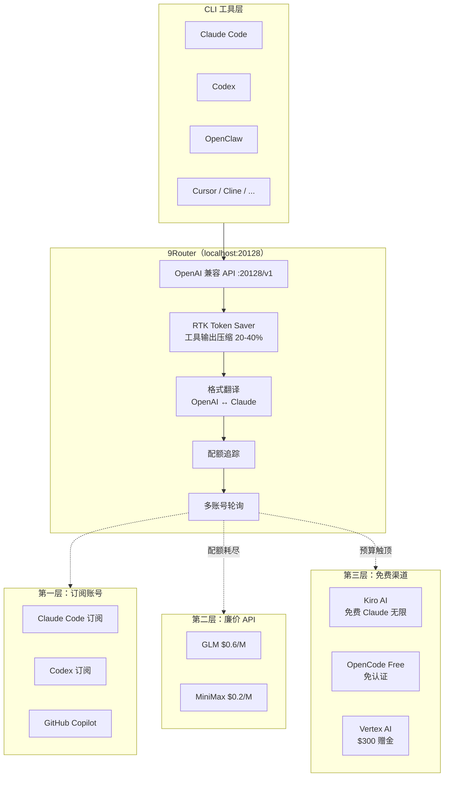

# 9Router 深度解析：AI 编程工具的免费路由层，以及它为什么不是又一个 API 代理

**9Router 站的位置很窄：它只管三件事——工具调用输出正在烧掉你的 Token、订阅额度每个月都在过期、主模型挂了之后你的 CLI 工具直接停工。**

市面上已经有 OpenRouter、One API、LiteLLM 等代理方案，但 9Router 走了一条不同的路——它在代理层之上叠了三件事：RTK 工具输出压缩、三层自动降级、订阅额度最大化利用。对于重度依赖 Claude Code / Cursor / Codex 等 CLI 编程工具的开发者来说，这套组合拳直接对应了账单上最痛的几个点。

本文从系统设计的视角拆解 9Router 的架构，重点说明 RTK 压缩和自动降级这两条主线的实现原理，并在最后给出不同场景下的采用建议。


---

## 系统总览：先把四条机制线拆开

9Router 很容易被当成"又一个兼容 OpenAI 格式的反代"——收到请求、转格式、发出去。但实际上它内部跑了四条独立的机制线，各自解决互不重叠的问题。



这张图里有四条独立的机制线，各自解决不同层面的问题：

| 机制 | 解决的问题 | 不解决的问题 |
|------|-----------|-------------|
| **RTK Token Saver** | `git diff`、`grep` 等工具输出占 Token 过多 | 不压缩对话历史、不压缩模型推理 |
| **三层自动降级** | 主模型额度耗尽或宕机后工具停工 | 不提升模型回答质量 |
| **配额追踪** | 订阅到期了额度还没用完 | 不帮你多拿额度 |
| **多账号轮询** | 单个账号的速率限制 | 不绕过服务商的并发上限 |

理解这四条线的边界之后，再看 9Router 的内部流转，就不会把它们混在一起了。

---

## 一、它到底解决了什么

### 1.1 工具调用输出的 Token 泄漏

在 Claude Code 或 Codex 里做一次修改，底层会发生什么：

1. Agent 读文件 → 返回文件内容
2. Agent 跑 `git diff` → 返回 diff 输出
3. Agent 跑测试 → 返回测试结果
4. Agent 判断下一步 → 把以上所有输出再送回模型

每一步的 `tool_result` 都被完整送进下一次请求的上下文。一个中型项目的 `git diff` 可能就有几千 Token，而 Claude Code 一天可能触发上百次工具调用。**工具输出烧掉的 Token 往往比你的 prompt 本身多得多。**

9Router 的 RTK（Response Token Kompressor）在代理层截获 `tool_result`，对工具输出做结构化压缩：去掉重复行、折叠长 diff 块、精简 JSON 格式。实测节省 20-40% 的 Token 消耗——压缩的是进出代理层的工具输出，不碰对话历史和模型推理。

### 1.2 订阅额度被浪费

Claude Code 每月 $20 的订阅赠送大量 API 调用额度。问题在于：大多数开发者根本用不完——月底额度自动清零。同时，他们可能又在另一条线上单独购买了 OpenAI 或 Anthropic 的按量付费 API。

9Router 的配额追踪模块在 Dashboard 上展示每个订阅账号的剩余额度，并通过自动降级策略优先消耗订阅额度，切到付费 API 之前先把订阅榨干。

### 1.3 主模型宕机后的真空期

当 Anthropic API 限流或宕机时，配置了固定 `ANTHROPIC_BASE_URL` 的 CLI 工具直接罢工。9Router 的三层降级机制让它在主链路中断后自动切到备用模型，用户端的 CLI 工具感知不到切换。

---

## 二、核心机制拆解

### 2.1 RTK Token Saver——工具输出的压缩策略

RTK 不是对全量请求做压缩。它在代理层只处理 `tool_result` 类型的消息体，具体策略：

- **去重折叠**：`git status` 连续两次返回相同输出时，第二次替换为 `(unchanged)` 标记
- **Diff 截断**：超过 N 行的 diff 块保留开头和结尾，中间替换为 `[... N lines skipped ...]`
- **JSON 精简**：去掉格式化空白、合并单元素数组
- **无损标记**：被压缩的部分打上 `[RTK: compressed]` Tag，下游 Agent 知道此处被缩写过

压缩是请求级别的，不影响模型本身的输出质量。对于纯对话请求（没有工具调用），RTK 不做任何处理，直接透传。

```
原始请求（一次 Claude Code 修 bug 的完整链路）：

User prompt:     "fix the null pointer in auth.ts"       → 12 tokens
Read file:       auth.ts (full content)                   → 2,340 tokens
Grep search:     all references to getUser()               → 847 tokens
Git diff:        changes to 4 files                        → 3,120 tokens

合计：每次工具调用往返 ≈ 6,319 tokens

RTK 压缩后：

Read file:       auth.ts → 同上（首次读取不压缩）
Grep search:     去重后保留唯一匹配行                        → 312 tokens
Git diff:       截断大文件 diff，折叠重复块                  → 1,580 tokens

合计：≈ 4,232 tokens，节省 33%
```

### 2.2 三层自动降级——两类触发条件，各自的切换逻辑不同

降级触发条件分为两类：

| 触发类型 | 检测方式 | 动作 |
|---------|---------|------|
| **配额耗尽** | Dashboard 配额追踪返回 0 | 切换到下一层 |
| **调用失败** | HTTP 429 / 5xx / 超时 | 重试 N 次后切换到下一层 |

三层结构：

1. **第一层：订阅账号（Subscription）** —— 通过 OAuth 接入 Claude Code、Codex、GitHub Copilot、Cursor 的订阅 API，直接消费已付费额度
2. **第二层：廉价 API（Cheap）** —— 当订阅额度耗尽，切到 GLM（$0.6/百万 Token）、MiniMax（$0.2/百万 Token）等低成本提供商
3. **第三层：免费渠道（Free）** —— 预算触顶后降级到 Kiro AI（免费 Claude 无限）、OpenCode Free（免认证）、Vertex AI（$300 赠金）

和一般的主备切换不同，Dashboard 上可以配置每层的预算上限和模型偏好。举个例子：订阅层可以指定"优先用 Claude Sonnet 4.5"，廉价层指定"只走 GLM-5"，免费层指定"允许 Kiro 和 Vertex 但排除 OpenCode Free"。

### 2.3 格式翻译——为什么 OpenAI 和 Claude 的协议不能直接互通

Claude Code 和 Codex 等工具内部使用的是 Anthropic 原生 API 格式（Messages API），而 Cursor、Cline 等工具用的是 OpenAI 兼容格式（Chat Completions API）。两者的请求/响应结构差异不小：

- **System prompt 位置**：OpenAI 放在 `messages[0]` 里，Anthropic 放在顶层 `system` 字段
- **Stop reason**：OpenAI 用 `finish_reason: "stop"`，Anthropic 用 `stop_reason: "end_turn"`
- **Tool use 结构**：OpenAI 用 `tool_calls` 数组，Anthropic 用 `content` 数组里的 `tool_use` 块

9Router 在代理层做双向转译：OpenAI 格式进来 → 转成 Anthropic 格式发给后端 → Anthropic 响应转回 OpenAI 格式返回给客户端。对客户端来说，它看到的一直是 OpenAI 兼容的 `/v1/chat/completions` 端点，但实际后端可以是 Anthropic、Claude Code 订阅、甚至原生 Claude API。

### 2.4 多账号轮询——绕过单账号速率限制

同一提供商的多个账号可以在 Dashboard 里分别添加。请求进来时，Router 在所有可用账号之间做轮询（round-robin）。这解决了两个问题：

1. 单个 OpenAI API Key 的 RPM（每分钟请求数）限制被分摊
2. 多个 Claude Code 订阅号可以叠加使用，额度不用分散管理

---

## 三、一次完整请求的流转过程

以一次 Claude Code 的典型修 bug 会话为例，追踪请求如何穿过 9Router 的每一层：

```text
1. 用户在 Claude Code 中发出指令："fix the null pointer in auth.ts"

2. Claude Code 通过 OPENAI_BASE_URL=http://localhost:20128/v1 将请求发到 9Router

3. 9Router 收到请求，识别客户端类型（通过 User-Agent 或请求特征）

4. 请求进入 RTK 模块 → 检查是否为对话请求（无 tool_result）→ 跳过压缩，透传

5. 格式翻译模块 → Claude Code 发来的是 Anthropic 原生格式
   → 不转译（后端也是 Anthropic 格式），透传

6. 配额追踪 → 查询 Claude Code 订阅的剩余额度 → 额度充足 → 路由到订阅层

7. 多账号轮询 → 从 3 个 Claude Code 订阅号中选第 2 个 → 发出请求

8. 模型返回响应 → Claude Code 收到后执行工具调用（读文件、改代码、跑测试）

9. 第二轮请求进来 → 包含 tool_result → RTK 模块检测到 tool_result
   → 对 git diff 输出执行压缩 → 节省约 35% Token → 路由到第 3 个订阅号

10. 第 N 轮请求 → 配额追踪显示订阅额度耗尽
    → 自动降级到第二层 → 路由到 GLM API → 继续工作

11. 用户全程无感知，Claude Code 始终认为自己在和同一个后端对话
```

这个流程里，第 6-10 步是 9Router 真正干活的地方——用户不需要手动切换模型、不需要在不同 CLI 工具里改配置、不需要担心额度什么时候用完。

---

## 四、安装与配置

### 4.1 安装

9Router 是 npm 全局包，安装后直接运行：

```bash
npm install -g 9router
9router
```

Dashboard 自动在 `http://localhost:20128` 打开。如果需要自定义端口或不自动打开浏览器：

```bash
9router --port 8080 --no-browser
```

### 4.2 Docker 部署

适合长期运行在服务器或 NAS 上：

```bash
docker run -d --name 9router -p 20128:20128 \
  -v "$HOME/.9router:/app/data" -e DATA_DIR=/app/data \
  decolua/9router:latest
```

镜像支持 amd64 和 arm64。数据持久化在 `~/.9router/db/data.sqlite`，包括账号信息、配额状态和路由配置。

### 4.3 接入免费渠道（零注册）

打开 Dashboard → Providers → Connect **Kiro AI**（免费 Claude 无限）或 **OpenCode Free**（免认证）即可。无需注册任何外部账号。

### 4.4 配置 CLI 工具

所有工具的配置方式一致——指向 `localhost:20128/v1`：

**Claude Code：**

```bash
export OPENAI_BASE_URL=http://localhost:20128/v1
export OPENAI_API_KEY=any-value
```

**Cursor（Settings → Models → Advanced）：**

```json
{
  "openaiApiKey": "any-value",
  "openaiBaseUrl": "http://localhost:20128/v1"
}
```

**Codex / OpenClaw / Cline：**

```bash
export OPENAI_BASE_URL=http://localhost:20128/v1
```

API Key 在 Dashboard 里生成，不是直接填环境变量里的真实 Key——Dashboard 的 Key 是 Router 的内部标识，真实 API Key 保存在本地 SQLite 里。

---

## 五、支持的生态

### 5.1 CLI 工具

9Router 兼容所有使用 OpenAI 或 Anthropic 兼容 API 的 CLI 编程工具：

Claude Code · Codex · OpenClaw · Cursor · Antigravity · Cline · Continue · Droid · Roo · GitHub Copilot · Kilo Code · Gemini CLI · Qwen Code · iFlow · Crush · Crusher · Aider · OpenCode

### 5.2 提供商分层

| 层级 | 类型 | 代表 | 接入方式 |
|------|------|------|---------|
| OAuth 订阅 | 付费 | Claude Code、Codex、GitHub Copilot、Cursor、Antigravity | Dashboard 内 OAuth 授权 |
| API Key | 按量付费 | OpenAI、Anthropic、DeepSeek、xAI、Groq、GLM、Kimi、MiniMax、OpenRouter 等 40+ | 在 Dashboard 填入 Key |
| 免费 | 零成本 | Kiro AI（Claude 无限）、OpenCode Free（免认证）、Vertex AI（$300 赠金） | 一键连接或填入账号 |

iFlow、Qwen 和 Gemini CLI 的免费层已在 2026 年下线，目前推荐的首选免费渠道是 Kiro AI 和 OpenCode Free。

---

## 六、Dashboard 功能概览

9Router 自带的 Web Dashboard（Next.js 构建）不只是配置页面，它是日常使用中的控制面板：

- **Providers 管理**：OAuth 授权、API Key 录入、模型启用/禁用
- **配额看板**：每个订阅号/API Key 的剩余额度实时展示
- **路由策略**：配置三层降级顺序、每层预算上限、每层偏好的模型列表
- **用量统计**：按提供商、模型、日期的 Token 消耗图表
- **API Key 管理**：生成和管理客户端用的 Internal API Key
- **RTK 配置**：是否启用压缩、压缩策略参数（diff 截断行数、是否压缩 JSON）

Dashboard 数据全部落在本地 SQLite（`~/.9router/db/data.sqlite`），不经过任何外部服务。

---

## 七、常见问题排查

### 7.1 CLI 工具连接不上 9Router

```bash
# 先确认 9Router 是否在运行
curl http://localhost:20128/health
# 预期返回：{"status": "ok"}

# 如果连接失败，检查端口是否被占用
lsof -i :20128
```

常见原因：9Router 进程没启动、防火墙拦截了本地端口、环境变量 `OPENAI_BASE_URL` 拼写错误（多了 `/v1` 后面的斜杠或不一致的端口号）。

### 7.2 免费层模型报认证错误

Kiro AI 和 OpenCode Free 的可用模型列表会动态变化。如果配置的模型名不存在，Dashboard 的日志面板会显示具体错误。去 Providers 页面刷新模型列表，通常能解决问题。

### 7.3 RTK 压缩后 Agent 行为异常

RTK 对 diff 的截断可能在某些场景下丢失关键上下文——比如 Agent 需要看到完整的函数签名变化来判断是否影响其他调用方。如果怀疑 RTK 在干扰 Agent 判断，先在 RTK 设置里关掉压缩，跑一遍同样的任务对比结果。确认 RTK 无影响后再开启。

### 7.4 Docker 容器重启后配置丢失

确认挂载了数据目录卷。如果启动时没用 `-v "$HOME/.9router:/app/data"`，容器内的 SQLite 会在重启时重置。修复方式：停止容器，用带卷挂载的参数重新启动。

---

## 八、数据与状态管理

9Router 的持久化数据只有三类：

| 数据类型 | 存储位置 | 说明 |
|---------|---------|------|
| 账号与配额 | `~/.9router/db/data.sqlite` | OAuth Token、API Key、配额余量 |
| 路由配置 | `~/.9router/db/data.sqlite` | 降级策略、模型偏好、预算设置 |
| 请求日志 | Dashboard 内实时展示 | 不做持久化存储，刷新即清 |

不持久化请求日志是一个主动选择——所有 LLM 请求的 prompt 和 tool_result 只在内存中停留，不会写入磁盘。

---

## 九、采用建议

9Router 不适合所有人。根据你的使用场景，下面是一个粗粒度的决策框架：

### 适合先上的情况

- **Claude Code 或 Codex 重度用户**：工具调用频繁，RTK 压缩收益明显。按每天 200 次工具调用、每次平均 3,000 Token 的工具输出来算，RTK 压缩 30% 就是每天 180,000 Token。一个月下来是几百万 Token 的差额。
- **手里有多个订阅号或 API Key**：比如公司号 + 个人号 + 学生号，轮询分摊速率限制，且额度集中消耗。
- **免费层就能覆盖日常工作**：如果你的任务 Vibe Coding 居多、不太需要顶尖推理，Kiro AI 的免费 Claude 基本上够用，9Router 让这些免费渠道和你的 CLI 工具无缝对接。

### 可以等等的情况

- **只用一个模型且从不触达速率限制**：直接配环境变量就够了，中间多一层代理反而增加延迟。
- **任务对延迟极其敏感**：代理层增加约 50-200ms 的延迟（主要是格式翻译和 RTK 处理），如果你在做实时交互类的工作且每毫秒都重要，直连更快。
- **公司安全策略不允许本地代理**：9Router 在本地运行一个 HTTP 服务，有些企业安全策略会拦截。

### 推荐的采用顺序

1. 先用免费层（Kiro AI / OpenCode Free）试一周，感受一下零成本跑 Claude Code 是否足够
2. 如果满意，把订阅号也加进去，启用自动降级，让免费层作为最后兜底
3. 根据一周的用量统计，决定是否需要接入廉价 API 作为第二层
4. 最后考虑开 RTK 压缩（注意：RTK 对某些 Agent 可能会影响判断——压缩后的 diff 可能丢失关键上下文，建议先在非关键项目上验证）

---

## 十、项目现状

| 指标 | 数据 |
|------|------|
| GitHub Stars | 2.5k |
| npm 周下载量 | 54,000+ |
| 许可证 | MIT |
| 技术栈 | Next.js（全栈 JavaScript） |
| 安装方式 | `npm install -g 9router` 或 Docker |
| 默认端口 | 20128 |
| 最新版本 | 0.4.x（活跃开发中） |

**官方资源：**
- GitHub：[github.com/decolua/9router](https://github.com/decolua/9router)
- 官网：[9router.com](https://9router.com)
- npm：[npmjs.com/package/9router](https://www.npmjs.com/package/9router)
- Docker Hub：[hub.docker.com/r/decolua/9router](https://hub.docker.com/r/decolua/9router)

---

## 如果只记三件事

1. **路由只是 9Router 的表层，真正起作用的是 RTK 压缩 + 三层降级 + 配额榨干**。单独看每一项都有替代方案，但三件事在一个 Dashboard 里完成、且不需要改 CLI 工具配置，这是它站得住脚的地方。

2. **它的定位是"CLI 编程工具的后端代理"**。它不解决多模型调度、不解决 prompt 管理、不解决 RAG——它只站在 Claude Code / Codex / Cursor 等具体工具和 AI 后端之间，做精简、兜底和额度利用。和 OpenRouter、LiteLLM 这类通用 API 网关不在同一个赛道。

3. **先试免费层，再决定要不要把付费账号也放进去**。Kiro AI 和 OpenCode Free 已经能覆盖大量日常编程任务，不要一上来就担心配置复杂度——免费层的接入只需要点两下鼠标。


如果还想继续深挖——9Router 的源码在 [github.com/decolua/9router](https://github.com/decolua/9router)，RTK 压缩的实现在 `open-sse` 模块里，三层降级的策略表在 Dashboard 的 `src` 目录下。从这两个模块入手，读完源码后再回到本文的系统总览图，每条机制线就都有了对应的代码路径。

---

_本文基于 9Router v0.4.x 撰写，项目处于活跃开发中，功能细节可能随版本更新而变化。_