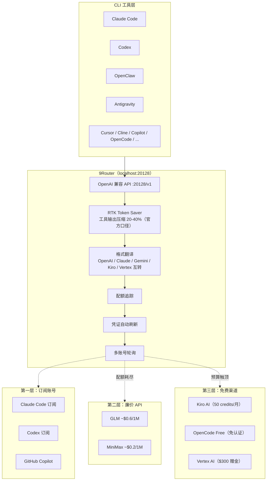

# 9Router：给 AI 编程工具套一层免费用量的路由

AI 编程工具烧钱的方式就那么几种：工具调用的输出占 Token、订阅额度每个月清零、主模型宕机或限流时工作停下来。9Router 把这三件事都收进一个本地运行的代理层，让 CLI 工具始终以为自己在跟同一个后端对话。

它和 OpenRouter、One API、LiteLLM 这类网关分工不同：通用网关忙着把请求拆给多家 API，9Router 负责把已有额度用干净——订阅、廉价、免费三层自上而下自动降级，加上 RTK 对工具输出的压缩。官方口径覆盖 40+ 供应商、100+ 模型，Claude Code、Codex、Cursor、Cline、OpenClaw、Antigravity 这些 CLI 工具都在支持列表里。项目本身 MIT 协议，npm 包 `9router` 当前版本 0.5.x，GitHub 上 27k stars。

## 系统总览：代理层里几条并列的机制

9Router 看起来像 OpenAI 兼容格式的反代——收到请求、换个格式、发出去。代理层内部实际跑了五条独立的线，各自解决一个问题：

| 机制 | 解决的问题 | 不解决的问题 |
|------|-----------|-------------|
| RTK Token Saver | `git diff`、`grep` 这类工具输出占 Token 多 | 不压缩对话历史、不压缩模型输出 |
| Caveman / Ponytail | 模型回复啰嗦、代码过度设计 | 不改模型能力本身 |
| 三层自动降级 | 主模型额度耗尽或宕机后工具停工 | 不提升模型回答质量 |
| 凭证自动刷新 | OAuth 订阅 Token 过期后手动重登 | 不改变模型选择逻辑 |
| 配额追踪 + 多账号轮询 | 订阅到期了额度还没用完；单账号速率限制 | 不帮你多拿额度、不绕过服务商的并发上限 |


```mermaid
flowchart TB
 subgraph CLI["CLI 工具层"]
 CC["Claude Code"]
 CX["Codex"]
 OC["OpenClaw"]
 AG["Antigravity"]
 CS["Cursor / Cline / Copilot / OpenCode / ..."]
 end

 subgraph Router["9Router（localhost:20128）"]
 direction TB
 API["OpenAI 兼容 API :20128/v1"]
 RTK["RTK Token Saver<br/>工具输出压缩 20-40%（官方口径）"]
 FMT["格式翻译<br/>OpenAI / Claude / Gemini / Kiro / Vertex 互转"]
 QT["配额追踪"]
 RF["凭证自动刷新"]
 LB["多账号轮询"]

 API --> RTK
 RTK --> FMT
 FMT --> QT
 QT --> RF
 RF --> LB
 end

 subgraph Tier1["第一层：订阅账号"]
 CCSub["Claude Code 订阅"]
 CXSub["Codex 订阅"]
 GHSub["GitHub Copilot"]
 end

 subgraph Tier2["第二层：廉价 API"]
 GLM["GLM ~$0.6/1M"]
 MM["MiniMax ~$0.2/1M"]
 end

 subgraph Tier3["第三层：免费渠道"]
 Kiro["Kiro AI（50 credits/月）"]
 OpenCodeF["OpenCode Free（免认证）"]
 Vertex["Vertex AI（$300 赠金）"]
 end

 CLI --> API
 LB -.-> Tier1
 LB -.配额耗尽.-> Tier2
 LB -.预算触顶.-> Tier3
```

这些线里，省 Token（RTK 加输出侧两个开关）和三层降级是最能拉开它和普通代理差距的两块，下面分别看。

## RTK：只压缩工具输出，不碰对话

工具调用是 CLI 编程里最烧 Token 的地方。一次修 bug 的过程大致是：Agent 读文件拿到全文、跑 `git diff` 拿到改动、跑测试拿到结果，然后把这些输出全部塞回下一次请求的上下文。一个中型项目的 `git diff` 可能就是几千 Token，而一次会话里这样的工具调用能触发上百次。9Router 的 README 给的估计是：工具输出能吃掉单次请求 prompt 预算的 30-50%。

RTK（Rust Token Killer，移植自 Rust 项目 [rtk-ai/rtk](https://github.com/rtk-ai/rtk) 的压缩管线）在代理层截获 `tool_result` 这类消息，在转发给模型之前先做结构化压缩。它默认开启，带一整套按内容自动识别的过滤器，读每段输出的前 1024 个字符判断类型：`git-log`、`git-diff`、`git-status`、`build-output`（npm/cargo 等构建输出）、`grep`、`find`、`tree`、`ls`、`search-list`、`read-numbered`（带行号的文件转储）、`dedup-log`（多行重复噪音去重）、`smart-truncate`（保留头 120 行尾 60 行）。检测顺序固定，从 git-log 一路排到 smart-truncate，匹配不上就不压缩。

三道门槛决定了哪些输出会被动过：

- 小于 500 字节的输出直接跳过，压缩这点文本不划算；
- 超过 10 MiB 的输出也跳过；
- 标记为错误的 `tool_result`（`is_error: true`）原样保留——报错堆栈是排障现场，压坏了得不偿失。

压缩本身有安全底线：过滤器抛异常、返回空、或者压缩结果比原文本还大，一律回退原文。官方口径是每请求省 20-40% 的输入 Token，README 里的示例是一次请求从 47K Token 压到 28K。这个数字怎么读，有三件事要说清楚：

1. **测的是什么**：单次请求里工具输出部分的体积变化，按 9Router 的 JS 移植管线算。上游 Rust 版 RTK 自己的口径更激进（常见开发命令省 60-90%），移植版取的是保守区间。
2. **反映系统的哪部分**：只反映入站压缩管线的效率，跟模型质量、路由策略都无关。
3. **不能推出什么**：推不出账单少 40%。输入 Token 只是账单的一部分，输出 Token、对话历史都不在这个管线的管辖范围内——管输出的另有机制，下一节说。

还有一个单请求逃生口：带上 `X-9Router-Token-Saver: off` 请求头，这一条请求绕过所有省 Token 机制，适合确认"压缩是不是改坏了上下文"这类排查场景。

## 输出侧的三个开关：Caveman、Ponytail、Headroom

RTK 管入站，输出侧是另一套思路：改写 system prompt 让模型少说、少写。9Router 内置了两个，外加一个可选的外挂代理。

**Caveman Mode** 改写自 [JuliusBrussee/caveman](https://github.com/JuliusBrussee/caveman) 的提示词，让模型用电报体回答——技术内容保留，废话砍掉，官方口径最多省 65% 的输出 Token。**Ponytail** 注入"懒惰资深工程师"提示词，把模型往 YAGNI（You Aren't Gonna Need It，用不上就不写）方向压：能删就不加、用标准库不上新依赖、能一行就不抽象。它分 Lite / Full / Ultra 三档，Ultra 档会直接在回答里挑战需求本身。两者都明确声明不牺牲输入校验、防数据丢失的错误处理、安全和无障碍代码。

第三个开关 **Headroom** 不在 9Router 进程里，是一个独立的外部代理：`pip install "headroom-ai[proxy]"` 后跑在 `localhost:8787`，9Router 在发给供应商之前先调它的 `/v1/compress` 接口。它的容错方向和 RTK 一致——Headroom 挂了或报错，9Router 照发原始请求，不因外挂故障断工作流。

三个开关和 RTK 可以叠加：RTK 压输入，Caveman 压输出，Ponytail 压 diff 体积，Headroom 再压一遍上下文。都在 Dashboard 的 Endpoint 设置里开关。压得越狠越要留心——输出侧的改写直接改变模型行为风格，Pair review 或者需要详细解释的场景别全开。

## 三层降级：订阅 → 廉价 → 免费

降级按两层条件触发，行为不同：

| 触发类型 | 表现 | 动作 |
|---------|------|------|
| 配额耗尽 | 订阅额度被用完 | 切到下一层 |
| 调用失败 | HTTP 429 / 5xx / 超时 | 重试若干次后切到下一层 |

三层结构：

1. **订阅层**：通过 OAuth 接 Claude Code、Codex、GitHub Copilot、Cursor 等订阅账号，直接消费已付费额度。
2. **廉价层**：GLM（约 $0.6/百万 Token）、MiniMax（约 $0.2/百万 Token）、Kimi K2.5（$9/月包 1000 万 Token）这类按量付费但便宜的渠道。
3. **免费层**：Kiro AI、OpenCode Free、Vertex AI 这类零成本渠道。

一次请求怎么穿过这条链，可以看这个场景：你开着 Claude Code 修一个 bug，Agent 跑 `git diff` 拿到 8000 Token 的改动输出——这 8000 Token 先经过 RTK 压到 5000 左右，再翻译格式发出去。请求落到订阅账号时额度恰好用完，返回额度不足的错误，该账号进入短暂冷却；路由切到廉价层的 GLM 重试；如果廉价层也撞上限流，再落到免费层的 Kiro。对客户端来说全程无感——CLI 工具配置的永远是同一个 `localhost:20128/v1` 端点，工具侧不知道中间换过三次后端。

除了账号之间的降级，还有一层模型组合（Combo）的降级：一个 Combo 是按顺序排好的多模型序列，比如 `cc/claude-opus-4-7 → glm/glm-5.1 → kr/claude-sonnet-4.5`，当前模型路径整体不可用时按序列往下试。订阅、廉价、免费是"渠道"维度的兜底，Combo 是"模型"维度的兜底，两者叠加才是完整的降级逻辑。Combo 建好后在 CLI 里直接当模型名用。

## 免费渠道的现状，比想象中更波动

免费层是 9Router 宣传里最吸引人的部分，但也是政策变化最快的地方。README 里明确写了：

- **iFlow、Qwen Code、Gemini CLI** 的免费层在 2026 年已停用：iFlow 转为付费，Qwen Code 的免费 OAuth 档被阿里巴巴于 2026-04-15 全面关停，Gemini CLI 服务被 Google 于 2026-06-18 彻底下线（由闭源的 Antigravity CLI 接替）。
- **Kiro AI**（AWS 的 agentic IDE）：2025 年 9 月起转付费模式，免费档现在每月 50 credits，登录走 AWS Builder ID、IAM Identity Center、Google 或 GitHub OAuth，新账号前 30 天另有 500 credits 试用。免费档可调 `kr/claude-sonnet-4.5`、`kr/glm-5`、`kr/MiniMax-M2.5` 等模型；付费档从 $20/月（1000 credits）到 $200/月（10000 credits）。README 里"Kiro AI Unlimited FREE"是旧口径，别照这个信。
- **OpenCode Free** 免认证，是个透传代理，模型列表从 `opencode.ai/zen/v1/models` 自动拉取，会浮动，部分模型只限时免费。
- **Vertex AI** 的 $300 赠金对新 GCP 账号仍然有效（90 天内用完），但自 2026 年 3 月起，Gemini API（AI Studio 端点）的用量不再从赠金里扣，要改用 Vertex AI Studio 端点调用 Gemini 才能消耗赠金。

所以"Kiro 免费"这种印象已经不准了。真要看当前哪些渠道还能用，得打开 Dashboard 的 Providers 页面，而不是信旧文章。

## 配额、多账号与凭证刷新：把订阅额度用干净

订阅额度每个月清零，是 9Router 盯上的第二个浪费点。配额追踪模块在 Dashboard 上展示每个账号的 Token 消耗、重置倒计时和预估成本——重置周期跟着服务商走：Claude Code 和 Codex 是 5 小时 + 每周双周期，GitHub Copilot 每月 1 日，GLM 每天 10 点，MiniMax 是 5 小时滚动。配合降级策略优先消耗订阅额度，切到付费渠道之前先把订阅榨干。一个细节：Dashboard 上的"成本"数字是参考值——按付费 API 的价格估算"这些额度值多少钱"，9Router 自己不向你收费，你付的仍是订阅费或按量账单。

多账号轮询则是把同一个提供商的多个账号做 round-robin 或按优先级分配，一个账号撞配额就落到下一个。它解决的是单账号的速率限制，绕不开服务商按全局算的并发上限——用几个 Key 不会把并发上限变成几倍，这是加账号之前要想清楚的事。

凭证自动刷新负责让订阅账号不靠手动重登也能一直活着：OAuth 拿到的 access token 会过期，9Router 在过期前的提前量窗口内主动刷新（Codex 还有一层按 refresh token 年龄的额外策略）；请求途中撞上 401/403，会先刷新凭证再原样重试，重试前还会换上刚轮换的 refresh token，避免拿已消费的旧凭证再刷一次导致 `invalid_grant`。这跟三层降级是两件事——刷新救的是"Token 过期"，降级救的是"账号被限流或额度耗尽"。

## Dashboard 与数据落点

9Router 自带一个 Web Dashboard（Next.js 16 + React 19 构建），负责管理提供商的 OAuth 授权和 API Key、配置三层降级与每层模型偏好、看每个账号的剩余额度和 Token 用量、开关 RTK 并调压缩参数、生成客户端用的内部 API Key。

运行时数据都在本地 SQLite 里：`${DATA_DIR}/db/data.sqlite`（`DATA_DIR` 默认 `~/.9router/`），供应商连接、Combo、模型别名、API Key、设置和用量历史全在这一个文件；同目录 `db/backups/` 下有自动备份。更细的请求/翻译调试日志默认关闭，设 `ENABLE_REQUEST_LOGS=true` 才写进 `logs/`。想迁移机器，备份或导出这一个 SQLite 文件就够。

云同步是可选项：配好 `CLOUD_URL`（服务端变量，`NEXT_PUBLIC_CLOUD_URL` 仅向后兼容）后，供应商连接、Combo、设置等配置会同步到远端做多机复用，不配就全在本地。README 说明了同步内容是"providers, combos, and settings"，但没有逐项列出凭据是否参与同步——介意的话，敏感环境直接不开云同步，这是最干净的答案。

本地服务要守好三道口子：Dashboard 首次登录密码默认 `123456`（`INITIAL_PASSWORD`），跑起来第一件事就是改掉；`JWT_SECRET` 不设会自动生成并存到 `~/.9router/jwt-secret`，单机用没问题，多实例部署才需要显式统一；`API_KEY_SECRET` 有一个公开的内置默认值，用来给生成的 API Key 做 HMAC 签名，认真部署应当换掉。另外两个变量跟部署形态有关：`REQUIRE_API_KEY=true` 给 `/v1/*` 路由强制 Bearer Key（公网暴露时 README 明确建议），`AUTH_COOKIE_SECURE=true` 给 HTTPS 反代后面的部署强制 Secure Cookie。

## 安装与接入

npm 全局安装后直接运行：

```bash
npm install -g 9router
9router
```

Dashboard 自动在 `http://localhost:20128` 打开，OpenAI 兼容端点是 `http://localhost:20128/v1`。Node 版本有两个口径：npm 包的 engines 声明 `>=18`，官方文档的前置要求和 README 技术栈都写 Node.js 20+，装最新 LTS 最稳。不想碰 Node 环境可以用官方镜像（Docker Hub 的 `decolua/9router` 或 GHCR 的 `ghcr.io/decolua/9router`，amd64/arm64 双架构）：

```bash
docker run -d --name 9router -p 20128:20128 \
  -v "$HOME/.9router:/app/data" -e DATA_DIR=/app/data decolua/9router:latest
```

从源码跑的方式是 `cp .env.example .env && npm install`，然后 `PORT=20128 NEXT_PUBLIC_BASE_URL=http://localhost:20128 npm run dev`（生产模式加 `npm run build`）。README 还列了第四种落点：Cloudflare Workers，适合多设备共享一个入口的场景。

CLI 工具的接法因工具而异，共同点是端点和 Key 都指向 Router：

```bash
# Codex CLI
export OPENAI_BASE_URL="http://localhost:20128"
export OPENAI_API_KEY="your-9router-api-key"
```

Claude Code 改 `~/.claude/config.json` 里的 `anthropic_api_base` 和 `anthropic_api_key`；Cursor 在 Settings → Models → Advanced 里填同样的 Base URL 和 Key；Cline / RooCode / Continue 选 OpenAI Compatible 提供商类型。这里的 Key 是 Dashboard 生成的内部标识，不是任何一家服务商的真实 API Key。

模型名带供应商前缀，比如 `kr/claude-sonnet-4.5` 是 Kiro 渠道的 Claude Sonnet 4.5，`cc/`、`cx/`、`glm/`、`kr/` 各指向不同来路；建好的 Combo 名可以直接填进模型名一栏。完整清单在 Dashboard 的模型选择页。

## 常见问题排查

README 的 Troubleshooting 部分覆盖了几种高频故障，对照现象直接查：

- **报 "Language model did not provide messages"**：多半是上游供应商配额耗尽，去 Dashboard 配额页确认，或把 Combo 降级链配好让它自动切。
- **频繁限流**：订阅额度用尽时的正常现象；把 `cc/claude-opus-4-7 → glm/glm-5.1 → kr/claude-sonnet-4.5` 这类降级链配上就自动兜底。
- **Dashboard 端口不对**：显式设 `PORT=20128` 和 `NEXT_PUBLIC_BASE_URL=http://localhost:20128`。
- **首次登录失败**：检查 `.env` 里的 `INITIAL_PASSWORD`；没设的话兜底密码是 `123456`。
- **`logs/` 下没有请求日志**：设 `ENABLE_REQUEST_LOGS=true`。
- **怀疑压缩改坏了上下文**：单条请求带 `X-9Router-Token-Saver: off` 头对比测试，或在 Dashboard 里临时关 RTK。

## 该不该用

- **适合先上的**：Claude Code / Codex 这类工具调用频繁的重度用户，RTK 压缩的收益最直接；手里有多个订阅号或 API Key 的人，轮询能把速率限制分摊掉、额度集中消耗；想用免费渠道跑日常任务的人，9Router 让这些渠道和 CLI 工具对接起来不用改配置。
- **可以等等的**：只用一个模型、从不触达速率限制，直接配环境变量就够了，中间多一层代理只增加延迟；对请求延迟极其敏感的场景，直连更快；公司安全策略不允许本地起 HTTP 服务的话，这一条就卡死了。

真要试，顺序建议是先接免费渠道跑一段时间，对照 Dashboard 的用量统计看是否够用，够用再考虑把订阅号和廉价层加进来，最后再开输出侧的开关——RTK 压 diff 理论上可能丢掉关键上下文（它自己也留了错误输出不压的底线），Caveman 和 Ponytail 更是直接改变模型行为，先在非关键项目上验证一遍再放开。

顺带一提它的来路和分叉：9Router 的前身灵感来自 Go 写的 CLIProxyAPI，社区里还有一个功能更全的 TypeScript fork [OmniRoute](https://github.com/diegosouzapw/OmniRoute)，加了四层降级、多模态 API、熔断和语义缓存——想要这些能力可以看那边。

## 结语

9Router 的实际工作集中在三件事上：入站压工具输出（RTK）、出站压模型话痨（Caveman / Ponytail）、额度榨干加三层兜底。路由本身只是入口。单独看每一项都有替代方案，但三件事在一个 Dashboard 里完成、且不需要改 CLI 工具配置，这是它和通用代理方案的差异。

它的范围限定在 CLI 编程工具和 AI 后端之间——做精简、兜底和额度利用，不涉及多模型调度、prompt 管理或 RAG。OpenRouter、LiteLLM 这类网关覆盖的面更宽，9Router 走的是更窄的一条路。

免费渠道的政策变化很快，这篇里的数字只对应当前版本（2026 年 9 月，9router 0.5.x）。要用之前，以仓库 [github.com/decolua/9router](https://github.com/decolua/9router) 的 README、Dashboard 的 Providers 页面和各渠道官方定价页为准。
