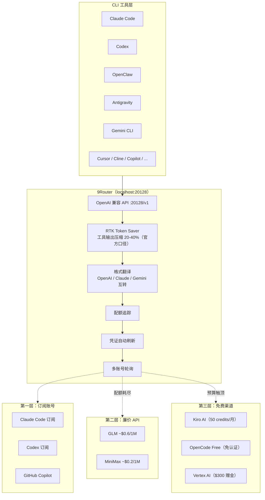

# 9Router：给 AI 编程工具套一层免费用量的路由

AI 编程工具烧钱的方式就那么几种：工具调用的输出占 Token、订阅额度每个月清零、主模型宕机或限流时工作停下来。9Router 把这三件事都收进一个本地运行的代理层，让 CLI 工具始终以为自己在跟同一个后端对话。

它和 OpenRouter、One API、LiteLLM 这类网关分工不同：通用网关忙着把请求拆给多家 API，9Router 负责把已有额度用干净——订阅、廉价、免费三层自上而下自动降级，加上 RTK 对工具输出的压缩。官方口径覆盖 40+ 供应商、100+ 模型，Claude Code、Cursor、Codex、OpenClaw、Antigravity、Gemini CLI 这些工具都能接进来。

## 系统总览：代理层里几条并列的机制

9Router 看起来像 OpenAI 兼容格式的反代——收到请求、换个格式、发出去。代理层内部实际跑了五条独立的线，各自解决一个问题：

| 机制 | 解决的问题 | 不解决的问题 |
|------|-----------|-------------|
| RTK Token Saver | `git diff`、`grep` 这类工具输出占 Token 多 | 不压缩对话历史、不压缩模型推理 |
| 三层自动降级 | 主模型额度耗尽或宕机后工具停工 | 不提升模型回答质量 |
| 凭证自动刷新 | OAuth 订阅 Token 过期后手动重登 | 不改变模型选择逻辑 |
| 配额追踪 | 订阅到期了额度还没用完 | 不帮你多拿额度 |
| 多账号轮询 | 单个账号的速率限制 | 不绕过服务商的并发上限 |


```mermaid
flowchart TB
 subgraph CLI["CLI 工具层"]
 CC["Claude Code"]
 CX["Codex"]
 OC["OpenClaw"]
 AG["Antigravity"]
 GM["Gemini CLI"]
 CS["Cursor / Cline / Copilot / ..."]
 end

 subgraph Router["9Router（localhost:20128）"]
 direction TB
 API["OpenAI 兼容 API :20128/v1"]
 RTK["RTK Token Saver<br/>工具输出压缩 20-40%（官方口径）"]
 FMT["格式翻译<br/>OpenAI / Claude / Gemini 互转"]
 QT["配额追踪"]
 RF["凭证自动刷新"]
 LB["多账号轮询"]

 API --> RTK
 RTK --> FMT
 FMT --> QT
 QT --> RF
 RF --> LB
 end

 subgraph Tier1["第一层：订阅账号"]
 CCSub["Claude Code 订阅"]
 CXSub["Codex 订阅"]
 GHSub["GitHub Copilot"]
 end

 subgraph Tier2["第二层：廉价 API"]
 GLM["GLM ~$0.6/1M"]
 MM["MiniMax ~$0.2/1M"]
 end

 subgraph Tier3["第三层：免费渠道"]
 Kiro["Kiro AI（50 credits/月）"]
 OpenCodeF["OpenCode Free（免认证）"]
 Vertex["Vertex AI（$300 赠金）"]
 end

 CLI --> API
 LB -.-> Tier1
 LB -.配额耗尽.-> Tier2
 LB -.预算触顶.-> Tier3
```

这五条线里，RTK 和三层降级是最能拉开它和普通代理差距的两块，下面分别看。

## RTK：只压缩工具输出，不碰对话

工具调用是 CLI 编程里最烧 Token 的地方。一次修 bug 的过程大致是：Agent 读文件拿到全文、跑 `git diff` 拿到改动、跑测试拿到结果，然后把这些输出全部塞回下一次请求的上下文。一个中型项目的 `git diff` 可能就是几千 Token，而一次会话里这样的工具调用能触发上百次。

RTK（Runtime Token Kit，从 Rust 的 rtk-ai/rtk 库移植过来）在代理层截获 `tool_result` 这类消息，在转发给模型之前先做结构化压缩。它带一整套按内容自动识别的过滤器：git diff / grep / ls / tree / 构建日志 / 错误堆栈各有专用处理，靠读内容前 4 KB 判断该用哪个；压缩前还有预处理，去掉 BOM、折叠连续空行、跨轮次去重重复代码块。按官方口径能省 20-40% 的 Token，GitHub 仓库描述里写的数字是 -40%，实际跑下来 `git diff` 常见省 30% 左右、长日志更高。

RTK 有一条安全底线：压缩失败、或者压缩结果比原文本还大，就原样返回，绝不改坏请求。

它只处理工具输出，不碰对话历史。原因很直接：工具输出是原始数据，压缩它不改变模型推理；对话历史里带着系统提示和此前的推理上下文，压缩这条线容易丢信息、改变模型行为。纯对话请求（没有工具调用）RTK 直接透传。输出侧是另一套机制——Caveman Mode 靠改写 system prompt 让模型说短话，管的是生成侧，跟 RTK 的入站压缩是两条路。

## 三层降级：订阅 → 廉价 → 免费

降级按两层条件触发，行为不同：

| 触发类型 | 表现 | 动作 |
|---------|------|------|
| 配额耗尽 | 订阅额度被用完 | 切到下一层 |
| 调用失败 | HTTP 429 / 5xx / 超时 | 重试若干次后切到下一层 |

三层结构：

1. **订阅层**：通过 OAuth 接 Claude Code、Codex、GitHub Copilot 等订阅账号，直接消费已付费额度。
2. **廉价层**：GLM（约 $0.6/百万 Token）、MiniMax（约 $0.2/百万 Token）这类按量付费但便宜的渠道。
3. **免费层**：Kiro AI、OpenCode Free、Vertex AI 这类零成本渠道。

一次请求怎么穿过这条链，可以看这个场景：你开着 Claude Code 干活，订阅额度恰好用完。下一次请求先落到订阅账号，返回额度不足的错误，该账号进入短暂冷却；路由判断当前层没救了，切到廉价层的 GLM 重试；如果廉价层也撞上限流，再落到免费层的 Kiro。对客户端来说全程无感——CLI 工具配置的永远是同一个 `localhost:20128/v1` 端点，工具侧不知道中间换过三次后端。

除了账号之间的降级，还有一层模型组合（Combo）的降级：一个 Combo 是按顺序排好的多模型序列，当前模型路径整体不可用时，按序列往下试。订阅、廉价、免费是"渠道"维度的兜底，Combo 是"模型"维度的兜底，两者叠加才是完整的降级逻辑。

## 免费渠道的现状，比想象中更波动

免费层是 9Router 宣传里最吸引人的部分，但也是政策变化最快的地方。README 里明确写了：

- **iFlow、Qwen Code、Gemini CLI** 的免费层在 2026 年已停用，不再作为可用渠道。
- **Kiro AI**（AWS 的 agentic IDE）：免费档现在不是"无限"。官方定价页上免费档是每月 50 credits，可访问开源权重模型和 Claude Sonnet 4.5，新账号还有一次性试用额度；付费档从 $20/月（1000 credits）起。9Router 的 README 里"Kiro AI Unlimited FREE"是旧口径，别照这个信。
- **OpenCode Free** 免认证，但可用模型列表会浮动，部分模型只限时免费。
- **Vertex AI** 的 $300 赠金对新 GCP 账号仍然有效，但自 2026 年 3 月起，Gemini API（AI Studio 端点）的用量不再从赠金里扣，要改用 Vertex AI 端点调用 Gemini 才能消耗赠金。

所以"Kiro 免费"这种印象已经不准了。真要看当前哪些渠道还能用，得打开 Dashboard 的 Providers 页面，而不是信旧文章。

## 配额、多账号与凭证刷新：把订阅额度用干净

订阅额度每个月清零，是 9Router 盯上的第二个浪费点。配额追踪模块在 Dashboard 上展示每个订阅账号的剩余额度、重置倒计时和预估成本，配合降级策略优先消耗订阅额度，切到付费渠道之前先把订阅榨干。一个细节：Dashboard 上的"成本"数字是参考值——按付费 API 的价格估算"这些额度值多少钱"，9Router 自己不向你收费，你付的仍是订阅费或按量账单。

多账号轮询则是把同一个提供商的多个账号做 round-robin 分配，把一个账号的速率限制分摊到多个账号上。它解决的是单账号的 RPM 限制，绕不开服务商按全局算的并发上限——用几个 Key 不会把并发上限变成几倍。

凭证自动刷新负责让订阅账号不靠手动重登也能一直活着：OAuth 登录拿到的 access token 会过期，9Router 在请求前预检有效期，过期就先刷新再发；请求途中撞上 401/403，也会刷新后重试一次。这跟三层降级是两件事——刷新救的是"Token 过期"，降级救的是"账号被限流或额度耗尽"。

## Dashboard 与数据落点

9Router 自带一个 Web Dashboard（Next.js 构建），负责管理提供商的 OAuth 授权和 API Key、配置三层降级与每层模型偏好、看每个账号的剩余额度和 Token 用量、开关 RTK 并调压缩参数、生成客户端用的内部 API Key。

运行时数据存在本地 `~/.9router/` 目录下：配置和凭据在 `db.json`，用量聚合写 `usage.json`，请求状态日志追加到 `log.txt`；更深的请求/翻译调试日志默认关闭，需要设 `ENABLE_REQUEST_LOGS=true` 才写进 `logs/`。凭据默认留在本地，不随 9Router 上报——但要注意它有一个可选的云同步，配了 `NEXT_PUBLIC_CLOUD_URL` 后会把供应商、模型别名、组合等配置同步到远端做多机复用，关掉就全在本地。

本地服务要自己守好两道口子：Dashboard 的初始登录密码默认是 `123456`，跑起来第一件事就是改掉；`JWT_SECRET`、`API_KEY_SECRET` 这些环境变量也建议显式设置，而不是依赖内置默认值。

## 安装与接入

npm 全局安装后直接运行：

```bash
npm install -g 9router
9router
```

Dashboard 自动在 `http://localhost:20128` 打开，OpenAI 兼容端点是 `http://localhost:20128/v1`。从源码跑的方式是 `npm run dev` 或 `npm run build && npm run start`，需要设置 `NEXT_PUBLIC_BASE_URL`。要求 Node 18 以上。仓库同时提供了 Dockerfile 和 DOCKER.md，不想碰 Node 环境可以走容器化部署。

CLI 工具的接法统一——把端点指向本地：

```bash
export OPENAI_BASE_URL=http://localhost:20128/v1
export OPENAI_API_KEY=<Dashboard 里生成的 Key>
```

这个 Key 是 Router 的内部标识，不是真实 API Key；真实凭据存在本地 SQLite 里。Cursor 这类工具在设置里把 base URL 和 API Key 填成同样的值即可。模型名带供应商前缀，比如 `kr/claude-sonnet-4.5`，Dashboard 的模型选择里能看到完整列表。

## 该不该用

- **适合先上的**：Claude Code / Codex 这类工具调用频繁的重度用户，RTK 压缩的收益最直接；手里有多个订阅号或 API Key 的人，轮询能把速率限制分摊掉、额度集中消耗；想用免费渠道跑日常任务的人，9Router 让这些渠道和 CLI 工具对接起来不用改配置。
- **可以等等的**：只用一个模型、从不触达速率限制，直接配环境变量就够了，中间多一层代理只增加延迟；对请求延迟极其敏感的场景，直连更快；公司安全策略不允许本地起 HTTP 服务的话，这一条就卡死了。

真要试，顺序建议是先接免费渠道跑一段时间，对照 Dashboard 的用量统计看是否够用，够用再考虑把订阅号和廉价层加进来，最后再开 RTK——RTK 压缩 diff 可能丢掉关键上下文，先在非关键项目上验证一遍再放开。

## 结语

9Router 的实际工作集中在 RTK 压缩、三层降级和配额榨干三件事上，路由只是入口。单独看每一项都有替代方案，但三件事在一个 Dashboard 里完成、且不需要改 CLI 工具配置，这是它和通用代理方案的差异。

它的范围限定在 CLI 编程工具和 AI 后端之间——做精简、兜底和额度利用，不涉及多模型调度、prompt 管理或 RAG。OpenRouter、LiteLLM 这类网关覆盖的面更宽，9Router 走的是更窄的一条路。

免费渠道的政策变化很快，这篇里的数字只对应当前版本（2026 年）。要用之前，以仓库 [github.com/decolua/9router](https://github.com/decolua/9router) 的 README、Dashboard 的 Providers 页面和各渠道官方定价页为准。
