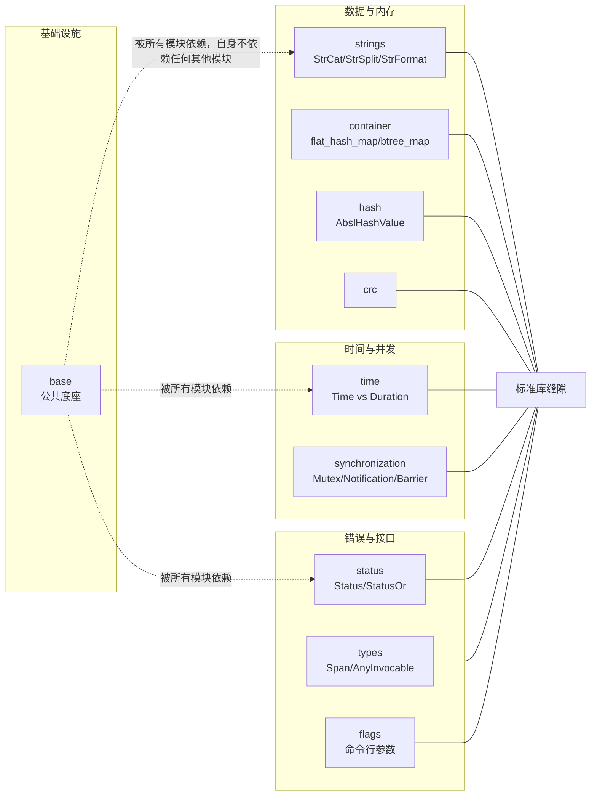

# Abseil C++ 通用库深度拆解：Google 的 C++ 标准库补完计划

## 核心判断

Abseil 做的事情很具体：把 Google 内部 C++ 代码库里长期打磨、反复使用的组件抽出来开源（2017 年 9 月），当前版本以 C++17 为最低标准，在标准库成熟之前先给出一份生产可用的实现，等标准追上来再把成熟部分反向输回标准。它和 Boost、`std::` 的边界就藏在这句话里——不是补所有缺失，只补"标准库还没覆盖好、但 Google 内部已经用顺手"的缝隙。

## 项目坐标

| 维度 | 数据 |
|------|------|
| 仓库 | abseil/abseil-cpp |
| Stars | 约 1.8 万 |
| Forks | 约 3.2 千 |
| 主语言 | C++（C++17） |
| License | Apache 2.0 |
| 默认分支 | master |
| 起源 | 2017 年 9 月从 Google 内部代码库开源 |
| 文档 | abseil.io |

Stars、Forks 数据截至 2026 年 9 月。

## 总览：模块为什么这么切

Abseil 的目录不是按"工具类型"分类，而是按"概念归属"。下面这张图把各模块对应到它们各自补的那块标准库缝隙：



- `absl/strings/`：字符串处理。`absl::StrCat`、`absl::StrSplit`、`absl::StrFormat` 是核心，风格上刻意避开 `std::stringstream` 和 `printf`。
- `absl/container/`：补充标准库容器。`flat_hash_map`、`flat_hash_set`、`btree_map`、`node_hash_map` 是亮点，对应"在 CPU 缓存与哈希冲突之间的工程取舍"。
- `absl/time/`：时间库。`absl::Time`（绝对时刻，纳秒精度）与 `absl::Duration`（时间长度）严格分离，避免"墙上时间"与"时间间隔"混用。
- `absl/synchronization/`：并发原语。`absl::Mutex`、`absl::Notification`、`absl::Barrier`，以及按使用场景分类的多种同步工具。
- `absl/status/`：错误处理。`absl::Status` + `absl::StatusOr<T>` 是 Google 内部 RPC 体系的基石，C++ 标准库长时间没有对等物。
- `absl/numeric/`、`absl/random/`、`absl/hash/`、`absl/crc/`：数值、随机数、哈希、CRC 各成独立小专题。
- `absl/base/`、`absl/types/`、`absl/functional/`、`absl/utility/`：基础设施层。`absl::Span` 在 `types` 里；`absl::AnyInvocable` 在 `functional` 里，定位与 C++23 的 `std::move_only_function` 相近，但 API 略有差异，官方明确不承诺二者互换。

这种切分的好处是每个模块都能独立引入、独立升级。代价是初看目录会疑惑"为什么没有 `absl::json` 或 `absl::http`"——网络、IO、解析器不属于 Abseil 的职责，它的边界停在"通用基础组件"。

## 三个核心组件的取舍

### 1. `flat_hash_map`：为什么 Google 自己造轮子

`std::unordered_map` 在大多数 libstdc++/libc++ 里用"链地址法 + 每节点独立分配"。高频插入/查询时，分配器开销和缓存局部性都不理想。`flat_hash_map` 改用开放寻址（Swiss Table 风格），把键值对存在一块连续数组里，probe 序列用 SIMD 加速元数据比对。

取舍落在三处：

- **留住的**：查询/插入常数因子更小，内存连续、缓存局部性好，整体占用更低（没有每节点分配头）。
- **付出的**：插入/删除时的"墓碑标记"会让极端删除场景下 hash 表退化；每个 slot 要多付一个控制字节的元数据。
- **不该用的**：元素极多但查询极稀疏，或删除比例高过插入的场景。`flat_hash_map` 是为"紧凑 + 高频读写"设计的，标准 `unordered_map` 在极端删除下反而更稳。

### 2. `absl::Status` + `absl::StatusOr<T>`：错误处理的标准答案

C++ 在异常和返回码之间没有官方推荐路径。Google 内部的做法是：用值传递 `Status`，把错误码和消息装在里面；当函数可能失败又要返回结果时，包成 `StatusOr<T>`，用 `.value()` / `.status()` 拆开。

```cpp
absl::StatusOr<User> GetUser(absl::string_view id) {
  if (id.empty()) return absl::InvalidArgumentError("id empty");
  // ...
  return user;
}

auto result = GetUser("u-1");
if (!result.ok()) {
  return absl::NotFoundError(result.status().ToString());
}
User u = *result;
```

这套体系给大型代码库的好处是错误路径与正常路径语法对称——`StatusOr<T>` 强制调用者拆包，编译器不会悄悄吞掉失败。代价是没有 stack trace，不像异常能在多层调用间自动带上下文，调试时要手动补。

这个思路已经落地为 `std::expected`：提案 P0323R12 在 2022 年 2 月的 WG21 会议上被接受进入 C++23 工作草案，并随 C++23 正式发布成为标准设施。Abseil 的策略在这里得到验证：先在真实代码里跑通抽象，再反向输入给标准委员会，而不是反过来。

### 3. `absl::Time` vs `absl::Duration`：把"瞬时"和"间隔"分开

`absl::Time` 是某个绝对时刻（纳秒精度，从 Unix epoch 起算）；`absl::Duration` 是两个时刻之间的差。它们严格不互转，必须走显式转换函数才能拿到人能读的形式，例如 `absl::ToCivilSecond(time, time_zone)` 把时刻转成日历字段，`absl::ToUnixNanos(time)` 取回 Unix 纳秒计数。

Google 坚持这个切分，是因为在跨时区、跨夏令时、跨 NTP 校准的服务里，把"瞬时"和"间隔"混用是时间类 bug 的头号来源：`absl::Now()` 走系统墙上时钟，会随校准跳变；`absl::Duration` 只做差值算术，不携带"现在几点"的语义，自然不受跳变波及。这也是通行的工程共识——测量耗时用时段做算术，别拿两次墙上时间相减之外的方式自造计数。

## 一条路径怎么穿过这些组件

把上面三个组件拼进一个真实函数，能看清它们各自管哪一段（用到的头文件都在注释里，方便直接照着搭）：

```cpp
#include "absl/container/flat_hash_map.h"
#include "absl/log/log.h"              // ABSL_LOG(INFO)
#include "absl/status/statusor.h"
#include "absl/synchronization/mutex.h" // Mutex / MutexLock
#include "absl/time/time.h"             // Now / ToDoubleMilliseconds

// flat_hash_map 做缓存，Mutex 保护并发，Time/Duration 记录耗时，StatusOr 返回结果
absl::flat_hash_map<std::string, User> cache;
absl::Mutex mu;

absl::StatusOr<User> GetUserCached(absl::string_view id) {
  absl::Time start = absl::Now();
  {
    absl::MutexLock lock(&mu);
    auto it = cache.find(std::string(id));
    if (it != cache.end()) {
      ABSL_LOG(INFO) << "cache hit in "
                     << absl::ToDoubleMilliseconds(absl::Now() - start) << "ms";
      return it->second;
    }
  }
  return absl::NotFoundError("user not cached");
}
```

这个例子把四类组件一次串起来：`flat_hash_map` 存数据、`MutexLock` 保护并发、`absl::Now()` 配合 `Duration` 计量、`StatusOr` 表达"没命中"这个失败路径。每一处单独拿出来都简单，合在一起就是 Abseil 在生产链路里最常见的用法。

## 与 Boost 和 C++ 标准库的关系

很多 Abseil 组件对应"Boost 早期方案 + Google 内部迭代"。几个对照：

| 能力 | Boost | Abseil | C++ 标准 |
|------|-------|--------|----------|
| 字符串拼接/分割 | `boost::algorithm::join` 等 | `absl::StrCat` / `StrSplit` | 无直接对等物（`std::format` 只管格式化） |
| 哈希容器 | `boost::unordered_map` | `absl::flat_hash_map` | `std::unordered_map` |
| 时间 | `boost::chrono` | `absl::Time` / `Duration` | `std::chrono`（time_point 与 duration 分离；日历与时区 C++20 才补齐） |
| 错误状态 | 无统一方案（`boost::system::error_code`、`boost::outcome` 并存） | `absl::Status` / `StatusOr` | `std::expected`（C++23） |
| 标志位 | `boost::program_options` | `absl::flags` | 无 |

Abseil 的原则是"标准库有能用的就不重复造"。`optional`、`variant`、`span` 这类在 C++17 起标准库已经足够的，Abseil 的对应头文件退化为迁移别名，新代码直接用 `std::`。它专注的是标准库没覆盖好的缝隙，而非与 Boost 全面竞争。

## 构建与引入

Abseil 用 CMake + Bazel 双支持。CMake 用户最常见的两条路径：

```bash
# 方式一：源码作为子目录（嵌入式使用）
add_subdirectory(abseil_cpp)
target_link_libraries(my_app PRIVATE absl::strings absl::time absl::status)

# 方式二：预编译安装
# 详见 abseil.io 的 "Installing Abseil" 章节
```

Bazel 用户在依赖列表加一行即可：

```python
deps = ["com_google_absl//absl/strings"]
```

编译需要 `-std=c++17` 或更高，这是官方 README 声明的基准；用更高的语言标准编译不需要额外开关。

按方式一（`add_subdirectory`）引入时，可以用一个最小工程验证组件是否真的接进来了。注意 Abseil 自身的 `CMakeLists.txt` 声明最低要求 CMake 3.16，工程声明的版本低于它会在配置阶段直接报错：

```cmake
# CMakeLists.txt
cmake_minimum_required(VERSION 3.16)
project(absl_smoke)
set(CMAKE_CXX_STANDARD 17)
add_subdirectory(abseil_cpp)
add_executable(smoke main.cc)
target_link_libraries(smoke PRIVATE absl::strings)
```

```cpp
// main.cc
#include "absl/strings/str_cat.h"
#include <cstdio>
int main() {
  std::printf("%s\n", absl::StrCat("ok-", 1).c_str());
  return 0;
}
```

能编译链接并打印 `ok-1`，说明 `strings` 组件可用。需要编译成库的那几个组件（`absl/time`、`absl/random`、`absl/synchronization`）照此把库名加进 `target_link_libraries` 即可。

有三个边界值得先说清楚：

- **不是 header-only**。很多组件是 header-only，但 `absl/time`、`absl/random`、`absl/synchronization` 需要编译成库，按需 `target_link_libraries` 链接。
- **不为小体积而生**。Abseil 不以压缩二进制为目标，链接后体积增长可感知，对体积极敏感的场景先链接最小子集实测再决定；C++14 项目必须升级到 C++17 才能用——这是老项目引入的第一道坎。
- **迭代器稳定性要查文档**。官方注释写得很清楚：插入若触发 rehash，全部迭代器失效；`flat` 系列连引用、指针的稳定性都不保证，需要稳定指针的场景（如多线程共享元素）换 `node_hash_map`。

## 采用顺序与边界

**适合先上**：

- 已经在用现代 C++（C++17 或 C++20），代码库超过 10 万行，需要统一的字符串、容器、错误处理抽象。
- 服务端长生命周期进程（数据库、RPC 网关、消息中间件），对内存碎片和缓存局部性敏感。
- 已经在用 gRPC、Protobuf 的团队基本没得选：Protobuf 自 v22 起直接依赖 Abseil，gRPC 的官方构建也把它列为基础依赖。既然这套库已经跟着依赖进了二进制，主动用它反而能收编团队里各写各的字符串和哈希容器。

**不必急着上**：

- 嵌入式或对二进制大小极敏感的项目——最小子集也要几 MB。
- 团队已有深厚 Boost 积累的是另一回事——不是冲突，而是两套概念体系（`StatusOr`、Swiss Table）并存会抬学习成本，得先明确哪套负责哪块。
- 需要严格兼容某版 C++ 标准、或演进速度受限的合规场景——Abseil 建议 live-at-head，旧版本到新版本偶有 breaking。

如果决定引入，建议顺序是：先换 `absl/strings/` 和 `absl/time/`（最容易立刻替换 std 用法），再上 `absl/container/`（理解 Swiss Table 动机），最后动 `absl/status/`——这套抽象有传染性，引入后整个调用链都要改签名，要放到团队能接受的时候。

## 常见问题与排查

**C++14 项目能用吗？** 不能，编译要求 `-std=c++17` 起，这是它最硬的前提；老项目要么整体升级，要么暂缓引入。

**编译通过，链接时一堆 undefined reference，为什么？** 多半是把 `absl/strings/xxx.h` 当 header-only 用了，但 `absl/time`、`absl/random`、`absl/synchronization` 必须显式 `target_link_libraries` 链接成库，少哪个库补哪个。

**把 Abseil 头文件裸 `-I` 进工程会怎样？** 容易与本地同名符号打架。推荐只用 `add_subdirectory` 加 `target_link_libraries` 按目标链接，让构建系统管理 include 路径，别全局 `-I`。

**`flat_hash_map` 在什么场景性能反而变差？** 删除频率高、元素又多的场景，开放寻址的墓碑会让表逐渐退化；短生命周期对象建议用 `node_hash_map`，长期批量删除明显时干脆退回 `std::unordered_map`。

**版本怎么维护？** Abseil 采用 live-at-head 策略，旧版本到新版本之间偶有破坏性变更。跟随官方 head 或锁定一个稳定版本并订阅 release，不要混用两个差异很大的版本。

## 总评

Abseil 真正出售的不是若干更快的容器，而是 Google 内部验证过的一套工程约定：容器怎么选、错误怎么传、时间怎么算，都给定了答案，团队不必在这些地方反复重新争论。买这套约定的代价是跟着上游走——live-at-head 把跟进变成持续成本。代码库规模够大、生命周期够长的服务端项目，这笔交易通常是净收益；还在 C++14 上徘徊、或对二进制体积锱铢必较的项目，先别上车。

## 参考资源

- 官方文档：[https://abseil.io](https://abseil.io)
- 设计原则（"Why Abseil"）：[https://abseil.io/about/philosophy](https://abseil.io/about/philosophy)
- 兼容性承诺（live-at-head 的边界与 LTS 策略）：[https://abseil.io/about/compatibility](https://abseil.io/about/compatibility)
- Swiss Table 设计思路：Matt Kulukundis, CppCon 2017《Designing a Fast, Efficient, Cache-friendly Hash Table, Step by Step》
- `std::expected` 提案：[P0323](https://wg21.link/p0323)