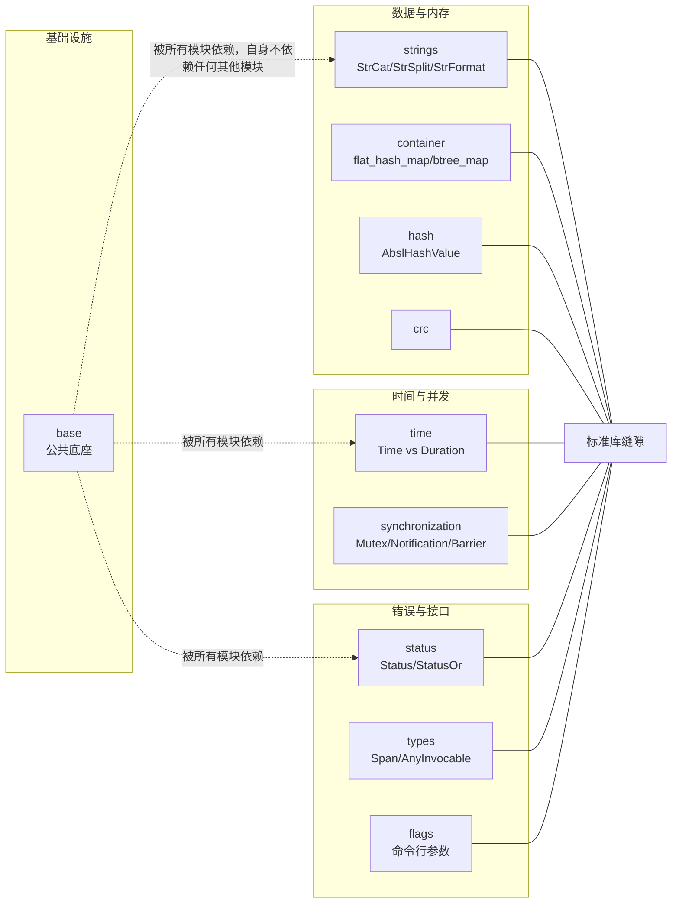

# Abseil C++ 通用库深度拆解：Google 的 C++ 标准库补完计划

## 核心判断

Abseil 做的事情很具体：把 Google 内部 C++ 代码库里长期打磨、反复使用的组件抽出来开源（2017 年 9 月），当前版本以 C++17 为最低标准，在标准库成熟之前先给出一份生产可用的实现，等标准追上来再把成熟部分反向输回标准。它和 Boost、`std::` 的边界就藏在这句话里——官方文档明确写过 Abseil "不是要和标准库竞争"，它只补"标准库还没覆盖好、但 Google 内部已经用顺手"的那部分缝隙。

本文假设你写过现代 C++（至少 C++17），用过 `std::unordered_map`，并且大致知道"缓存未命中很贵"这件事意味着什么。不需要你了解哈希表的实现细节，文中用到的地方会补足背景。

## 目录

- [项目坐标](#项目坐标)
- [总览：模块为什么这么切](#总览模块为什么这么切)
- [三个核心组件的取舍](#三个核心组件的取舍)
- [性能数字怎么读](#性能数字怎么读)
- [一条路径怎么穿过这些组件](#一条路径怎么穿过这些组件)
- [与 Boost 和 C++ 标准库的关系](#与-boost-和-c-标准库的关系)
- [构建与引入](#构建与引入)
- [采用顺序与边界](#采用顺序与边界)
- [常见问题与排查](#常见问题与排查)
- [总评](#总评)
- [参考资源](#参考资源)

## 项目坐标

| 维度 | 数据 |
|------|------|
| 仓库 | abseil/abseil-cpp |
| Stars | 约 1.8 万 |
| Forks | 约 3.2 千 |
| 主语言 | C++（C++17） |
| License | Apache 2.0 |
| 默认分支 | master |
| 起源 | 2017 年 9 月从 Google 内部代码库开源 |
| 文档 | abseil.io |

Stars、Forks 数据截至 2026 年 9 月。

## 总览：模块为什么这么切

Abseil 的目录不是按"工具类型"分类，而是按"概念归属"。下面这张图把各模块对应到它们各自补的那块标准库缝隙：



- `absl/strings/`：字符串处理。`absl::StrCat`、`absl::StrSplit`、`absl::StrFormat` 是核心，风格上刻意避开 `std::stringstream` 和 `printf`。`StrFormat` 用编译期格式串检查换类型安全，格式串写错在编译期就能报出来；它出现早于 C++20 的 `std::format`，API 风格也不同——`std::format` 用 `{}` 占位，`StrFormat` 沿用 `%s`、`%d` 这套惯例。这一模块还提供 `absl::string_view` 的两个补丁函数：`absl::ClippedSubstr`（`substr` 越界时截断而不是抛异常）和 `absl::NullSafeStringView`（空指针安全地构造空视图）。
- `absl/container/`：补充标准库容器。`flat_hash_map`、`flat_hash_set`、`btree_map`、`node_hash_map` 是亮点，对应"在 CPU 缓存与哈希冲突之间的工程取舍"。
- `absl/time/`：时间库。`absl::Time`（绝对时刻，纳秒精度）与 `absl::Duration`（时间长度）严格分离，避免"墙上时间"与"时间间隔"混用。
- `absl/synchronization/`：并发原语。`absl::Mutex`、`absl::Notification`、`absl::Barrier`，以及按使用场景分类的多种同步工具。
- `absl/status/`：错误处理。`absl::Status` + `absl::StatusOr<T>` 是 Google 内部 RPC 体系的基石，C++ 标准库长时间没有对等物。
- `absl/numeric/`、`absl/random/`、`absl/hash/`、`absl/crc/`：数值、随机数、哈希、CRC 各成独立小专题。
- `absl/base/`、`absl/types/`、`absl/functional/`、`absl/utility/`：基础设施层。`absl::Span` 在 `types` 里；`absl::AnyInvocable` 在 `functional` 里，定位与 C++23 的 `std::move_only_function` 相近，但 API 略有差异，官方明确不承诺二者互换。

这种切分的好处是每个模块都能独立引入、独立升级。代价是初看目录会疑惑"为什么没有 `absl::json` 或 `absl::http`"——网络、IO、解析器不属于 Abseil 的职责，它的边界停在"通用基础组件"。

## 三个核心组件的取舍

### 1. `flat_hash_map`：为什么 Google 自己造轮子

`std::unordered_map` 在大多数 libstdc++/libc++ 里用"链地址法（separate chaining）+ 每节点独立分配"实现：每个键值对单独堆分配，再用链表串起来。高频插入/查询时，分配器开销和缓存局部性都不理想。`flat_hash_map` 改用开放寻址（open addressing，冲突后按规则在数组内找下一个空位），把键值对直接存在一块连续数组里，探测序列用 SIMD 指令批量比对一组控制字节——这是 Swiss Table 设计的核心，作者 Matt Kulukundis 在 CppCon 2017 上从头推演过整个设计过程。

取舍落在三处：

- **留住的**：查询/插入常数因子更小，内存连续、缓存局部性好，整体占用更低（没有每节点分配头）。
- **付出的**：删除不回收槽位，只留"墓碑"标记，官方注释明说 `erase()` 会让 `begin()` 和 `++` 迭代变慢；每个 slot 要多付一个控制字节的元数据。
- **不该用的**：元素极多但查询极稀疏，或删除比例高过插入的场景。`flat_hash_map` 是为"紧凑 + 高频读写"设计的，标准 `unordered_map` 在极端删除下反而更稳。

失效规则也和标准容器不同，直接引官方注释：插入若触发 rehash，全部迭代器失效；"rehash 之后，表内元素的引用和指针全部失效"——这一点比 `std::unordered_map` 更严格，后者 rehash 只失效迭代器，引用和指针仍然有效。需要稳定指针的场景（比如多线程共享元素、把元素地址存进别处）换 `node_hash_map`，它把值放回堆节点，换回性能换稳定性的老账。

### 2. `absl::Status` + `absl::StatusOr<T>`：错误处理的标准答案

C++ 在异常和返回码之间没有官方推荐路径。Google 内部的做法是：用值传递 `Status`，把错误码和消息装在里面；当函数可能失败又要返回结果时，包成 `StatusOr<T>`，用 `.value()` / `.status()` 拆开。

```cpp
#include "absl/status/status.h"
#include "absl/status/statusor.h"
#include <string>

absl::StatusOr<std::string> GetUserName(absl::string_view id) {
  if (id.empty()) return absl::InvalidArgumentError("id empty");
  // ... 查存储、发请求
  return "Alice";
}

auto result = GetUserName("u-1");
if (!result.ok()) {
  // result.status().ToString() 输出带错误码的消息，直接可打进日志
  return absl::NotFoundError(result.status().ToString());
}
std::string name = *result;
```

这套体系给大型代码库的好处是错误路径与正常路径语法对称——`StatusOr<T>` 强制调用者拆包，编译器不会悄悄吞掉失败。代价是没有 stack trace，不像异常能在多层调用间自动带上下文，调试时要手动补。

这个思路已经落地为 `std::expected`：提案 P0323R12 在 2022 年 2 月的 WG21 会议上被接受进入 C++23 工作草案，并随 C++23 正式发布成为标准设施。Abseil 的策略在这里得到验证：先在真实代码里跑通抽象，再反向输入给标准委员会，而不是反过来。

### 3. `absl::Time` vs `absl::Duration`：把"瞬时"和"间隔"分开

`absl::Time` 是某个绝对时刻（纳秒精度，从 Unix epoch 起算）；`absl::Duration` 是两个时刻之间的差。它们严格不互转，必须走显式转换函数才能拿到人能读的形式，例如 `absl::ToCivilSecond(time, time_zone)` 把时刻转成日历字段，`absl::ToUnixNanos(time)` 取回 Unix 纳秒计数。

Google 坚持这个切分，是因为在跨时区、跨夏令时、跨 NTP 校准的服务里，把"瞬时"和"间隔"混用是时间类 bug 的头号来源：`absl::Now()` 走系统墙上时钟，会随校准跳变；`absl::Duration` 只做差值算术，不携带"现在几点"的语义，自然不受跳变波及。这也是通行的工程共识——测量耗时用时段做算术，别拿两次墙上时间相减之外的方式自造计数。

`std::chrono` 在类型层面同样分离了 `time_point` 和 `duration`，Abseil 的差异在于日历与时区是一等公民：`absl::ConvertDateTime`、`absl::TimeZone` 开箱即用，不依赖 C++20 的 `std::chrono` 日历扩展。老标准项目要处理时区，Abseil 这套是少有的现成选择。

## 性能数字怎么读

Swiss Table 公开的性能结论（CppCon 2017 演讲、官方博客）都指向同一句话：比 `std::unordered_map` 更快、更省内存。读这些数字之前先回答三个问题。

**测的是什么？** 主要是点查询、插入、全表构造的吞吐和内存占用。这些操作恰好是哈希表的高频路径，也是缓存局部性差异最大的地方。

**数字反映系统的哪一部分？** 几乎全部来自内存布局：键值对连续存放消灭了每节点堆分配，探测时用 SIMD 一次比对一组控制字节，把"逐个比较键"变成"先批量过滤再比较"。也就是说，收益大小取决于你的负载有多少时间花在哈希表访问上——表越大、访问越热，收益越明显。

**不能推出什么？** 至少三条：

- 不能推出"所有场景都快"。删除密集的负载会累积墓碑，官方注释明确说 `erase()` 拖慢 `begin()` 和迭代推进；这时退化的是常数因子，而不是渐进复杂度，基准测试里未必显形。
- 不能推出引用稳定性。任何 rehash 都会让引用和指针失效，把"更快"的容器用错稳定性语义，换来的可能是难查的悬垂指针。
- 不能推出对你手里那版 libstdc++/libc++ 的结论。各标准库的 `unordered_map` 实现质量参差，演讲里的数字测的是特定年代的实现。

正确姿势是拿自己的真实负载测一遍：同样的键类型、同样的访问序列，对比 `flat_hash_map`、`node_hash_map` 和 `std::unordered_map` 三个数，再看取舍。Abseil 官方不对外承诺具体倍数，仓库里的基准代码测的场景也未必是你的场景，任何数字都要在复测之后才算数。

## 一条路径怎么穿过这些组件

把上面几个组件拼进一个真实函数，能看清它们各自管哪一段（用到的头文件都在注释里，方便直接照着搭）：

```cpp
#include "absl/container/flat_hash_map.h"
#include "absl/log/log.h"              // ABSL_LOG(INFO)
#include "absl/status/statusor.h"
#include "absl/synchronization/mutex.h" // Mutex / MutexLock
#include "absl/time/time.h"             // Now / ToDoubleMilliseconds
#include <string>

struct User { std::string name; };

// flat_hash_map 做缓存，Mutex 保护并发，Time/Duration 记录耗时，StatusOr 返回结果
absl::flat_hash_map<std::string, User> cache;
absl::Mutex mu;

absl::StatusOr<User> GetUserCached(absl::string_view id) {
  absl::Time start = absl::Now();
  {
    absl::MutexLock lock(&mu);
    auto it = cache.find(std::string(id));
    if (it != cache.end()) {
      ABSL_LOG(INFO) << "cache hit in "
                     << absl::ToDoubleMilliseconds(absl::Now() - start) << "ms";
      return it->second;
    }
  }
  return absl::NotFoundError("user not cached");
}
```

这个例子把四类组件一次串起来：`flat_hash_map` 存数据、`MutexLock` 保护并发、`absl::Now()` 配合 `Duration` 计量、`StatusOr` 表达"没命中"这个失败路径。每一处单独拿出来都简单，合在一起就是 Abseil 在生产链路里最常见的用法。注意 `StatusOr<User>` 的失败分支只表达"缓存没命中"，真实的取数路径会把 `user not cached` 换成更准确的错误码——`Status` 的错误码体系（`InvalidArgumentError`、`NotFoundError`、`UnavailableError` 等）就是为了把这个语义标准化。

## 与 Boost 和 C++ 标准库的关系

很多 Abseil 组件对应"Boost 早期方案 + Google 内部迭代"。几个对照：

| 能力 | Boost | Abseil | C++ 标准 |
|------|-------|--------|----------|
| 字符串拼接/分割 | `boost::algorithm::join` 等 | `absl::StrCat` / `StrSplit` | 无直接对等物（`std::format` 只管格式化） |
| 哈希容器 | `boost::unordered_map` | `absl::flat_hash_map` | `std::unordered_map` |
| 时间 | `boost::chrono` | `absl::Time` / `Duration` | `std::chrono`（time_point 与 duration 分离；日历与时区 C++20 才补齐） |
| 错误状态 | 无统一方案（`boost::system::error_code`、`boost::outcome` 并存） | `absl::Status` / `StatusOr` | `std::expected`（C++23） |
| 标志位 | `boost::program_options` | `absl::flags` | 无 |

Abseil 对"标准库已经补齐的部分"有一条清晰的退出机制，值得单独看，因为它精确划出了哪些名字能放心换成 `std::`、哪些不能：

**已经退化成别名的**。`absl::optional`、`absl::variant`、`absl::string_view` 的头文件里现在只有一行 `using std::optional;` 这样的声明（源码标注 `ABSL_REFACTOR_INLINE`，引导新代码直接写 `std::`）。它们曾经是 C++17 之前的 polyfill，标准落地后就功成身退。`absl/types/variant.h` 里旧的自有自由函数 `absl::get`、`absl::get_if` 也被标了 `[[deprecated]]`，混用两套写法会吃编译警告——迁移到这些名字是安全的，一步到位用 `std::` 就行。

**保持独立类型的**。`absl::Span` 不是 `std::span` 的别名，头文件注释专门列出两者的差异：`Span` 提供 `MakeSpan()` / `MakeConstSpan()` 工厂函数、带 `operator==`（官方注释直言这"很可能是个设计缺陷"）、`subspan(pos, len)` 会把 `len` 截断到 `size() - pos`、没有 `size_bytes()` / `as_bytes()`，也没有静态 extent。两边 API 不能无痛互换，官方也不承诺兼容。C++20 项目新代码优先 `std::span`；要在 C++17 下工作，或者依赖 `StrSplit` 返回 `absl::Span` 的既有接口，才继续用 `Span`。

`absl::AnyInvocable` 同理是独立实现，与 C++23 的 `std::move_only_function` 定位相近但细节有差，官方不承诺互换。

Abseil 的原则是"标准库有能用的就不重复造"。它专注的是标准库没覆盖好的缝隙，而非与 Boost 全面竞争。

## 构建与引入

Abseil 用 CMake + Bazel 双支持，两者都是官方构建系统。CMake 用户最常见的两条路径：

```bash
# 方式一：源码作为子目录（嵌入式使用）
add_subdirectory(abseil_cpp)
target_link_libraries(my_app PRIVATE absl::strings absl::time absl::status)

# 方式二：预编译安装
# 详见 abseil.io 的 "Installing Abseil" 章节
```

Bazel 用户在依赖列表加一行即可：

```python
deps = ["com_google_absl//absl/strings"]
```

编译需要 `-std=c++17` 或更高，这是官方 README 声明的基准；用更高的语言标准编译不需要额外开关。这个基准不是一直如此——Abseil 的 CMake 配置注释写明，2024 年 7 月 1 日起按 Google 的基础 C++ 支持矩阵把 CMake 最低版本抬到 3.16，语言基准同期收敛到 C++17。老项目升级编译器这事，越早做越被动。

按方式一（`add_subdirectory`）引入时，可以用一个最小工程验证组件是否真的接进来了：

```cmake
# CMakeLists.txt
cmake_minimum_required(VERSION 3.16)
project(absl_smoke)
set(CMAKE_CXX_STANDARD 17)
add_subdirectory(abseil_cpp)
add_executable(smoke main.cc)
target_link_libraries(smoke PRIVATE absl::strings)
```

```cpp
// main.cc
#include "absl/strings/str_cat.h"
#include <cstdio>
int main() {
  std::printf("%s\n", absl::StrCat("ok-", 1).c_str());
  return 0;
}
```

能编译链接并打印 `ok-1`，说明 `strings` 组件可用。需要编译成库的那几个组件（`absl/time`、`absl/random`、`absl/synchronization`）照此把库名加进 `target_link_libraries` 即可。

有四个边界值得先说清楚：

- **不是 header-only**。很多组件是 header-only，但 `absl/time`、`absl/random`、`absl/synchronization` 需要编译成库，按需 `target_link_libraries` 链接。
- **只为头文件负责，不为链接产物负责**。官方兼容性页面的原话是"include what you use"：用到哪个符号，就显式 `#include` 导出它的那个头文件，别指望传递包含。依赖 Abseil 的头文件包含图变了，省略包含的代码会跟着断。
- **迭代器稳定性要查文档**。官方注释写得很清楚：插入若触发 rehash，全部迭代器失效；`flat` 系列连引用、指针的稳定性都不保证，需要稳定指针的场景（如多线程共享元素）换 `node_hash_map`。
- **不为小体积而生**。Abseil 不以压缩二进制为目标，链接后体积增长可感知，对体积敏感的场景先链接最小子集实测再决定。C++14 项目必须升级到 C++17 才能用——这是老项目引入的第一道坎。

兼容性页面还立了几条硬规矩：`internal`、`impl`、`detail` 路径下的东西不属于公共 API，随时可能变或被删；不许打开 `absl` 命名空间加东西或特化模板；不支持动态卸载共享库。违反任何一条，官方不承诺下一个版本还能编译。

## 采用顺序与边界

**适合先上**：

- 已经在用现代 C++（C++17 或 C++20），代码库超过 10 万行，需要统一的字符串、容器、错误处理抽象。
- 服务端长生命周期进程（数据库、RPC 网关、消息中间件），对内存碎片和缓存局部性敏感。
- 已经在用 gRPC、Protobuf 的团队基本没得选：Protobuf 自 v22 起直接依赖 Abseil（v22.0 发布于 2023 年 2 月，release note 原话 "Add a dependency on Abseil"），gRPC 的官方构建也把它列为基础依赖。既然这套库已经跟着依赖进了二进制，主动用它反而能收编团队里各写各的字符串和哈希容器。

**不必急着上**：

- 嵌入式或对二进制大小极敏感的项目——链接进来的最小子集也会带走可观的体积，先实测再决定。
- 团队已有深厚 Boost 积累的是另一回事——不是冲突，而是两套概念体系（`StatusOr`、Swiss Table）并存会抬学习成本，得先明确哪套负责哪块。
- 需要严格兼容某版 C++ 标准、或演进速度受限的合规场景——Abseil 建议 live-at-head，旧版本到新版本偶有 breaking。

如果决定引入，建议顺序是：先换 `absl/strings/` 和 `absl/time/`（最容易立刻替换 std 用法），再上 `absl/container/`（理解 Swiss Table 动机），最后动 `absl/status/`——这套抽象有传染性，引入后整个调用链都要改签名，要放到团队能接受的时候。

## 常见问题与排查

**C++14 项目能用吗？** 不能，编译要求 `-std=c++17` 起，这是它最硬的前提；老项目要么整体升级，要么暂缓引入。

**编译通过，链接时一堆 undefined reference，为什么？** 多半是把 `absl/strings/xxx.h` 当 header-only 用了，但 `absl/time`、`absl/random`、`absl/synchronization` 必须显式 `target_link_libraries` 链接成库，少哪个库补哪个。

**把 Abseil 头文件裸 `-I` 进工程会怎样？** 容易与本地同名符号打架。推荐只用 `add_subdirectory` 加 `target_link_libraries` 按目标链接，让构建系统管理 include 路径，别全局 `-I`。

**`flat_hash_map` 在什么场景性能反而变差？** 删除频率高、元素又多的场景，开放寻址的墓碑会让表逐渐退化；短生命周期对象建议用 `node_hash_map`，长期批量删除明显时干脆退回 `std::unordered_map`。

**Abseil 容器线程安全吗？** 和标准容器同一套规则：多个线程并发调 const 方法安全，读写并发需要外部同步。`absl::synchronization` 里的 `Mutex`、`Notification` 就是官方给的同步原语，上面缓存例子的 `MutexLock` 是标准用法。

**`absl::get(v)` 编译报 deprecated 警告怎么办？** `absl::variant` 已经是 `std::variant` 的别名，旧的自有自由函数标了 `[[deprecated]]`。直接改用 `std::get`、`std::get_if`，警告即消，行为不变。

**`StatusOr` 失败时怎么打出可读信息？** `status().ToString()` 输出错误码加消息（例如 `NOT_FOUND: user not cached`），直接可进日志；判断具体错误码用 `.code()` 与 `absl::StatusCode` 比较，别解析字符串。

**版本怎么维护？** Abseil 采用 live-at-head 策略，旧版本到新版本之间偶有破坏性变更。官方兼容性页面把每个 LTS 版本都定位成"一个新的主版本"，旧 LTS 在 GitHub Releases 页面长期保留。跟随官方 head，或锁定一个 LTS 并订阅 release note，不要混用两个差异很大的版本。

## 总评

Abseil 真正出售的不是若干更快的容器，而是 Google 内部验证过的一套工程约定：容器怎么选、错误怎么传、时间怎么算，都给定了答案，团队不必在这些地方反复重新争论。买这套约定的代价是跟着上游走——live-at-head 把跟进变成持续成本。代码库规模够大、生命周期够长的服务端项目，这笔交易通常是净收益；还在 C++14 上徘徊、或对二进制体积锱铢必较的项目，先别上车。

## 参考资源

- 官方文档：[https://abseil.io](https://abseil.io)
- 设计原则（"Why Abseil"）：[https://abseil.io/about/philosophy](https://abseil.io/about/philosophy)
- 兼容性承诺（live-at-head 的边界与 LTS 策略）：[https://abseil.io/about/compatibility](https://abseil.io/about/compatibility)
- Swiss Table 设计思路：Matt Kulukundis, CppCon 2017《Designing a Fast, Efficient, Cache-friendly Hash Table, Step by Step》
- `std::expected` 提案：[P0323](https://wg21.link/p0323)
- `absl::Span` 与 `std::span` 的差异清单：[absl/types/span.h 头文件注释](https://github.com/abseil/abseil-cpp/blob/master/absl/types/span.h)
- Protobuf v22.0 release note（Abseil 依赖声明）：[protocolbuffers/protobuf releases](https://github.com/protocolbuffers/protobuf/releases/tag/v22.0)
