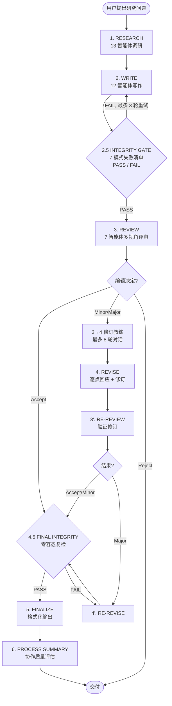

## 这套工具把每一类已知的失败模式做成了一道硬性阻断

[academic-research-skills](https://github.com/Imbad0202/academic-research-skills)（以下简称 ARS）是 Calvin I-En Wu 维护的一套 Claude Code 插件，当前版本 v3.9.4.2，CC BY-NC 4.0 协议。一条命令安装，30 秒跑通首条流水线。

看一个学术写作工具，最省事的办法是数智能体：13 个做调研，12 个管写作，7 个搞评审。但 ARS 真正跟同类拉开距离的地方不在数量——它把 Lu et al. (2026, *Nature*) 在一篇全自动 AI 研究系统的 Limitations 章节里逐条列出的 7 类失败模式，做成了流水线上三道绕不开的检查点。引用幻觉？Stage 2.5 抽样核验。实验结果凭空出现？Stage 4.5 全量复检。机器试图用编造的数据补缺口？直接插 `[MATERIAL GAP]` 标记，倒逼人类填。

这几道检查点背后连着一套引用审计系统——每条引用带三层定位符，开一个开关就能逐条拉取原始文献做 claim 级别的核验——以及一条写死了最多两轮修订、每轮都等人拍板才放行的流水线。下面从三条防线讲起，再沿一条完整流水线走一遍，看每个阶段机器出什么、人决定什么。

## 管线总览

在进入机制细节之前，先用一张图把 10 个阶段的顺序、分叉和阻断点定下来。这张图比任何文字描述都管用，后面的讨论会反复回到它。



三个阶段出现硬性阻断：**Stage 2.5**（写完初稿后）、**Stage 4→5 Claim Audit**（可选开关 `ARS_CLAIM_AUDIT=1`，逐条拉取引用原文核验）、**Stage 4.5**（最终出版前）。前两道是 Integrity Gate——机器先跑完 7 类失败模式检查，出报告，然后**必须等人确认**才能继续。

注意流水线里标注了 🧑 的人类决策点有 10 个之多：研究方法确认、大纲审批、编辑决定、修订策略选择、格式选择——机器在每个关键节点都只出方案，最终拍板权在设计上就不交出去。

## 防线一：Integrity Gate 与 7 类 AI 研究失败模式

ARS 设计逻辑的起点是 Lu et al. (2026, *Nature* 651:914-919) 的一项工作。该团队构建了 The AI Scientist——第一个通过顶级 ML 会议（ICLR 2025 workshop，盲审得分 6.33/10，workshop 均分 4.87）盲审的完全自主 AI 研究系统。但论文的 Limitations 章节直接把系统暴露的失败模式逐一列出，构成了 ARS 的检查清单。

Stage 2.5 和 Stage 4.5 的 Integrity Gate 跑的就是这 7 个模式：

| 模式 | 描述 | 在流水线中意味着什么 |
|------|------|---------------------|
| **M1** 实现 bug 通过自审 | AI 写的代码有 bug，但 AI 自审时没发现 | 实验代码必须经人类复查后再进入写作阶段 |
| **M2** 引用幻觉 | 引用了一篇不存在的论文，或把结论错误归因给某篇真实论文 | 这是 L3 风险等级的核心；v3.8 引入逐条审计 |
| **M3** 实验结果幻觉 | 声称跑了某个实验、得到了某个数字，但实际没有 | Stage 2.5 会对 30% 的 claim 做抽样核验 |
| **M4** 捷径依赖 | AI 选择了一条更简单但不正确的方法路径来完成任务 | 魔鬼代言人（Devil's Advocate）专门攻击这一点 |
| **M5** Bug 即洞见 | 把实现错误重新解释为「新发现」 | Integrity Gate 检查写作中的 self-justification 信号 |
| **M6** 方法论伪造 | 声称使用了某种方法但实际没有正确实施 | Stage 4.5 深模式检查 |
| **M7** 帧锁定 | 早期阶段做出的错误假设锁死了后续所有决策 | observer agent 在各阶段追踪一致性 |

Stage 2.5 做**抽样检查**——对 30% 的 claim（最少 10 条）逐条核验。Stage 4.5 做**全量检查**——100% claim 覆盖，零容忍。任何模式在 2.5 被标记为 SUSPECTED，到 4.5 必须是 CLEAR 或用户手动 Override，否则流水线卡住。

到 Stage 2.5 时，checkpoint 还没算完。还有一个 observer agent（`collaboration_depth_agent`）在每次 checkpoint 结束后默默运行，不问问题、不阻断流水线，只把观测结果写进报告。它在 2.5 和 4.5 这两个 Integrity Gate 阶段是被**显式跳过**的——设计者担心 observer 的报告会稀释门控检查的严肃性。

另外一篇直接影响 ARS 设计的论文来自 Zhao et al. (2026-05)。他们扫描了 arXiv、bioRxiv、SSRN 和 PMC 上 250 万篇论文的 1.11 亿条引用，保守估计 **2025 年一年就有 146,932 条幻觉引用**，并在 2024 年中观察到一个引用幻觉率的拐点。

更麻烦的是，这项研究还发现了「真实引用但错误归因」：引用本身指向真实存在的论文，但论文里写的主张和引用源实际说的不是一回事。Zhao et al. 把这个问题描述为 open challenge。ARS 的回应是 v3.7.3 开始在每条引用上附加**三层定位符**（locator anchor），v3.8 补上了 opt-in 的逐条审计——下面防线二专题讲这个。

## 防线二：三层引用定位与 Claim Audit

这是 ARS v3.7.3 → v3.8 演进中最关键的一条线。理解它的最佳方式是把引用系统想象成三层：

1. **引用存在层**：这篇论文存在吗？（Zhao et al. 发现 14.7 万条引用在 2025 年通不过这层检查）
2. **引用匹配层**：这篇论文的内容和 claim 匹配吗？（Zhao et al. 描述的 open challenge）
3. **引用约束层**：引用有没有违反用户预先声明的约束——比如「只能用 2023 年之后的文献」？

v3.7.3 做的是第一层和第二层的基础设施：每生成一条引用，就附带一个三层定位符——DOI / URL、被引段落、页码或段落号。v3.8 补上了第二层和第三层的执行：设置 `ARS_CLAIM_AUDIT=1` 后，系统会对每条引用定位符指向的原始文献做一次拉取，然后用 LLM-as-judge 判断 claim 是否确实被源文献支持。

判断结果分成 5 类 HIGH-WARN（L3 风险）：

- `claim-not-supported`：源文献不支撑该主张
- `negative-constraint-violation`：违反了用户设定的约束条件
- `fabricated-reference`：引用源不存在
- `anchorless`：引用缺少定位符，无法审计
- `constraint-violation-uncited`：未被引用的内容违反了约束

这 5 类在格式化输出阶段会触发硬性阻断——不是提醒、不是降级，而是直接让终端输出挂掉。审计模块附带了一套 20 元组的金标准校准集，接收阈值为假阴性率 < 0.15、假阳性率 < 0.10。校准通过后才正式上线——这个 ramp-on 计划目前还标注为「等校准证据后再推进」。

## 防线三：写作质量检测与风格校准

前面两道防线——Integrity Gate 和 Claim Audit——解决的是事实准确性问题。第三道防线解决的是写作质量。

ARS 在写作阶段做的事情包括：

**风格校准**：把你过往发表的论文交给系统，它会学习你的写作风格——引用习惯、段落结构、论证节奏——然后按你的风格出稿。这和「把 AI 味藏起来」完全不同：你可以看它是怎么校准的、校准到了什么效果。

**写作质量检查**：专门检测机器生成文本的典型模式——过度工整的句式、生硬的转场、空洞的修饰词堆叠。检测的目标是提升文字质量，而不是帮用户通过 AI 检测。

**反泄露协议**：写作过程中，如果模型试图用编造的数据填入某处，系统不会静默补全，而是插入 `[MATERIAL GAP]` 标记，倒逼人类研究员提供真实数据。

**VLM 图表核验**：生成的图表会经过一个 10 项 APA 检查清单，最多允许 2 轮修正。视觉语言模型（VLM）检查图表的格式合规性和数据一致性。

## 一条完整流水线的运转实例

机制拆完了，接下来跟一条具体的研究问题走一遍完整流水线。假设问题是：

> 「AI 辅助工具是否改变了高等教育质量评估中同行评议的有效性？」

### Stage 1: RESEARCH（研究调研）

13 个智能体协同工作。首先是 `research_question_agent` 把问题拆成可操作的子问题，`research_architect_agent` 设计方法蓝图。调研文献时，`bibliography_agent` 先检查 Material Passport 中是否已有文献语料库（corpus-first 策略），不足的部分再走搜索补充——不是无脑扫库。

这个阶段的产出是：RQ Brief（研究问题简报）+ Methodology Blueprint（方法蓝图）+ Annotated Bibliography（注释书目）。人类在这个 checkpoint 要确认研究问题和方法的合理性。

调研阶段还内置了一个**苏格拉底导师模式**：如果你说「引导我做研究」，系统不会直接给答案，而是通过追问帮你逐步收窄问题。这比直接丢一版文献综述过来更能训练研究者的问题意识。

### Stage 2: WRITE（论文撰写）

12 个智能体参与写作，但先不写正文。`structure_architect_agent` 先出大纲，`argument_builder_agent` 出论证地图（Argument Map）。两个产出都摆在人类面前，等人拍板，之后才由 `draft_writer_agent` 开始写正文。

写完初稿后会触发额外处理：双语摘要（中英）、图表生成（带 VLM 验证）、引用列表格式化。收尾是 `style_calibration` 跑一遍作者风格匹配。

### Stage 2.5: INTEGRITY GATE（完整性门控）

这是第一道硬阻断。`integrity_verification_agent` 跑 M1-M7 检查，对 30% 的 claim 做抽样核验。产出 Integrity Report，列出 PASS / FAIL / SUSPECTED 三类标记。

报告出来后，流水线暂停。人类必须读完报告、确认无误后，流水线才继续。如果 FAIL，回 Stage 2 修改，最多 3 轮。

项目 showcase 里有一份真实案例：Stage 2.5 的 Integrity Report 抓出了 **15 条伪造引用和 3 处统计错误**。而同一个项目后来的 Post-Publication Audit Report 显示，即使过了 3 轮完整性检查，仍然有 21/68 个问题被漏掉——这恰恰说明了 Integrity Gate 的设计逻辑：它不是万能的，但它是可配置的、可观察的。

### Stage 3: REVIEW（多视角评审）

7 个智能体组成评审团：EIC（主编）+ R1 方法论评审 + R2 领域评审 + R3 跨学科评审 + 魔鬼代言人。每个评审员按 0-100 质量量表打分。评审过程受 Sprint Contract 协议约束——先做盲审打分（Phase 1），再做可见全文评审（Phase 2），两个阶段之间通过 `<phase1_output>` 数据分隔符严格隔离，防止全文信息污染打分偏差。

魔鬼代言人的反驳评分是 1-5 分，只有 ≥ 4 分的反驳才会触发让步。这个阈值是写死的，目的在于避免模型无原则地向批评低头。

评审结果映射到编辑决定：≥ 80 分 Accept，65-79 分 Minor Revision，50-64 分 Major Revision，< 50 分 Reject。

### Stage 3 → 4 → 3' → 4': 修订循环

如果结果是 Minor 或 Major，进入修订教练阶段——最多 8 轮 Socratic 对话（用户可以说「直接把修改建议给我」跳过）。Stage 4 产出逐点回应（Point-by-Point Response）+ 修订稿 + Delta Report（改动了什么、为什么改）。

Stage 3'（Re-Review）只出动 3 个精简评审员做验证。ARS 写死了**最多 2 轮修订循环**的限制——超过后，剩余问题会被标记为「已确认的限制」写入论文，而不是无声无息地消失。

### Stage 4→5 Claim Audit（可选）

防线二已经把审计机制的细节拆过了。这里只补充它在流水线中的位置：开 `ARS_CLAIM_AUDIT=1` 后，系统逐条拉取原始文献、逐条判定 claim 是否被事实支持，产出的 5 类 HIGH-WARN 结果会直接阻断格式化输出。

### Stage 4.5: FINAL INTEGRITY（最终完整性门控）

7 模式全量复检，零容忍。和 Stage 2.5 的核心区别在于：这个阶段不放行任何 SUSPECTED 标记。你在 2.5 放过的，到 4.5 必须清理干净或者手动 Override。同时更新 Material Passport，记录所有产物的数据轨迹。

### Stage 5 & 6: FINALIZE + PROCESS SUMMARY

格式化输出（MD / DOCX / LaTeX / PDF），生成 AI 使用声明（可按 NeurIPS、APA 等会议/期刊的披露格式定制）。最后是 Process Summary——一条完整的论文制作过程记录，附带 6 维度协作质量评分。

## 成本：450K–750K tokens 换一篇 15K 词论文，值不值？

ARS 给出的估算是一条完整流水线跑下来约 450K–750K tokens，按 Anthropic API 费率折算在 **\$4–6 美元**左右。这个数字需要放在具体语境里理解。

**它测的是什么**：单次完整流水线的 token 消耗——从 RESEARCH 到 PROCESS SUMMARY。不包括 `ARS_CLAIM_AUDIT=1` 开关打开后的额外拉取成本，因为每条引用都需要一次独立的检索 + 判定。

**数字反映了 12K–15K 词论文场景**：更短的论文（短通讯、letter）会显著低于此数；更长的论文（学位论文章节级）会超出。

**不能推出的结论**：这不等于「花 \$5 就能产出一篇可投稿论文」。\$4–6 只是 API 费用；人类研究员审读、修改、补充实验的时间成本没有被计入。此外，如果 7 类失败模式中任何一个触发了 FAIL 重试循环，实际消耗会上浮。

附带依赖：强烈建议使用 Skip Permissions 模式运行，避免流水线在每个 checkpoint 因权限弹窗中断。Agent Team 模式是可选的——开启后多智能体并行度更高，但 token 消耗会增加。

## 配套工具：Experiment Agent

ARS 的 Stage 1（RESEARCH）产出 RQ Brief 和方法蓝图后，Stage 2（WRITE）需要实验结果作为素材。但实验执行本身不在 ARS 的范围内。

[experiment-agent](https://github.com/Imbad0202/experiment-agent) 填充的就是这个缺口：

```
ARS Stage 1 RESEARCH → RQ Brief + Methodology Blueprint
         ↓
   experiment-agent   → 执行实验（Python/R 等）+ 管理人类受试者 IRB 伦理清单
         ↓
ARS Stage 2 WRITE     → 用已验证的实验结果写论文
```

它做了几件 ARS 本身不做的 dirty work：代码实验的实时监控、11 类统计谬误检测、可复现性验证。跑完之后把结果连同 Material Passport 交回 ARS Stage 2，ARS 不需要做任何修改就能接上。

## Data Access Level 元数据：实证隔离的基础设施

v3.3.2 引入了一套容易被忽略但结构上很关键的元数据规范：每个技能必须声明 `data_access_level` 和 `task_type`。

- `data_access_level` 取值为 `raw` / `redacted` / `verified_only`。这个标注控制技能能看到什么层级的数据。Integrity Gate 运行在 `verified_only` 级别——它只接触已经经过验证的信息。
- `task_type` 取值为 `open-ended` 或 `outcome-gradable`。ARS 现有所有技能都标记为 `open-ended`。

`scripts/check_data_access_level.py` 在 CI/CD 中强制执行这套标注，设计灵感来自 Anthropic 的 automated-w2s-researcher（2026）。这套机制的作用很直接：确保 Integrity Gate 做检查时面对的是「已经被人确认过的数据」，而不是原始草稿——少了这道隔离层，完整性检查就失去了基准面。

## 谁该用，谁不必急着用

### 应该认真考虑的

- **独立研究者、博士生**：走完一条完整流水线产出的论文，引用链是可以回溯的、评审意见是带质量量表的、修订记录是带差分报告的。这对导师沟通和投稿准备都有实际价值。
- **非英语母语研究者**：风格校准把写作质量控制在你自己的语感范围内，双语摘要功能处理中英文转换。比起直接用通用 LLM 写英文稿然后反复润色，这条路更省回合数。
- **教授研究方法论的教师**：苏格拉底引导模式和分段 checkpoint 设计可以用来做教学演示——让学生看到一道研究问题如何被拆解、一篇论文如何从结构到论证逐步成型。
- **跨学科团队**：Material Passport 的数据轨迹和 Sprint Contract 的盲审协议适合多作者协同工作流。

### 暂时不必急着上的

- **已经有一套成熟写作流程的研究者**：ARS 是一条完整的流水线，不是一套模块化工具。如果你的流程已经稳定运行，装上去反而需要花时间把习惯适配到它的 checkpoint 结构上。
- **只写短通讯或微型论文的**：10 阶段 + 13 智能体的开销摊到一篇 letter 上，性价比不高。
- **对 LLM 输出有强确定性要求的研究**：ARS 文档反复强调 LLM 输出不是 byte-reproducible 的。Material Passport 记录了配置但不等同于可重放保证。

### 清晰的编码落地顺序

如果决定上手，推荐按这个顺序：

1. 先装，跑 `/ars-plan` 熟悉苏格拉底引导模式（不花钱，不产生正式产出）
2. 跑一次 `/ars-lit-review` 做文献综述——验证搜索质量是否符合你的领域期待
3. 开 `ARS_CLAIM_AUDIT=1` 跑一次完整流水线——确认引用审计在你的领域里是否能识别出问题
4. 根据后续实际体验决定是否关掉 Claim Audit（默认 OFF，需要主动开）

## 最后的判断

academic-research-skills 最值得看的地方不在智能体数量，也不在流水线长度。它值得看的地方是：**它把 AI 辅助学术写作的已知失败模式写成了一道道可以观察、可以配置、可以在流水线里阻断的检查点，而不是写在 README 里的一句免责声明。**

Integrity Gate 抓到过 15 条伪造引用和 3 处统计错误。同一条流水线的 Post-Publication Audit 又发现了 21 个漏网的问题。这组数字本身比任何设计理念都更有说服力：它说明 Integrity Gate 不是摆设，也说明它不是银弹。ARS 没有承诺「用了这个工具论文就不会出问题」，而是在每个可能出问题的环节上开了一扇窗——让你能看到、能判断、能阻断。

这恰好是 Lu et al. (2026) 揭示的 7 类失败模式所对应的解法：全自动系统无法察觉自己在 M1-M7 上的失效，ARS 通过在每个节点插入人类确认，把这 7 个盲区变成了可见的检查清单。代价是时间、注意力和 \$4–6 的 API 费用。回报是每一条引用都能追踪到原文，每一处统计错误都有被机器抓到过的可能。

---

*本文分析基于 academic-research-skills v3.9.4.2，相关信息可能随版本更新而变化。文中提及的 GitHub Star 数据、版本号和社区活跃度请以项目仓库的实际页面为准。*