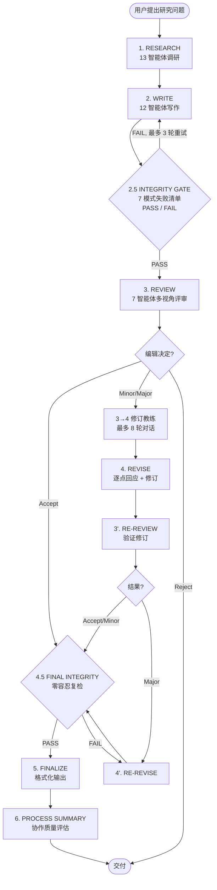

# academic-research-skills：一套把「AI 辅助学术写作」做成可审计流水线的开源框架

## 学习目标

读完本文后，你应当能够：

1. 说清 academic-research-skills 的核心设计：10 阶段流水线、Integrity Gate 门控机制、三层引用审计架构
2. 解释为什么需要"把 AI 辅助学术写作做成可审计流水线"：已知失败模式有哪些，如何做成硬性阻断
3. 描述一条完整流水线的运转过程：从文献检索到最终输出的每个阶段在做什么
4. 评估这套工具是否适合你的研究场景：成本（一篇 15K 词论文约 $4–6 的 API 费用）、适用边界、替代方案
5. 跟完一次完整流水线的运转实例，识别每个阶段的中间产物和质量控制点

**自测问题：**

1. Integrity Gate 的 7 类 AI 研究失败模式是什么？如果关闭 Integrity Gate，会有什么风险？
2. 三层引用定位与 Claim Audit 各自在检查什么？如果只做一层，会漏掉什么类型的错误？
3. 成本分析：4–6 美元换一篇 15K 词论文，这个值不值？在什么情况下不值？

---

## 目录

- [把已知失败模式做成硬性阻断](#把已知失败模式做成硬性阻断)
- [管线总览](#管线总览)
- [防线一：Integrity Gate 与 7 类 AI 研究失败模式](#防线一integrity-gate-与-7-类-ai-研究失败模式)
- [防线二：三层引用定位与 Claim Audit](#防线二三层引用定位与-claim-audit)
- [防线三：写作质量检测与风格校准](#防线三写作质量检测与风格校准)
- [一条完整流水线的运转实例](#一条完整流水线的运转实例)
- [成本：4–6 美元换一篇 15K 词论文，值不值？](#成本46-美元换一篇-15k-词论文值不值)
- [配套工具：Experiment Agent](#配套工具experiment-agent)
- [Data Access Level 元数据：实证隔离的基础设施](#data-access-level-元数据实证隔离的基础设施)
- [谁该用，谁不必急着用](#谁该用谁不必急着用)
- [常见问题解答](#常见问题解答)
- [动手练习](#动手练习)
- [自测题](#自测题)
- [进阶路径](#进阶路径)
- [最后的判断](#最后的判断)

## 把已知失败模式做成硬性阻断

[academic-research-skills](https://github.com/Imbad0202/academic-research-skills)（以下简称 ARS）是 Edward Cheng-I Wu 维护的一套 Claude Code 插件，当前版本 v3.21.2（2026-09-06 发布，查询日期 2026-09-14），CC BY-NC 4.0 协议——再发布时需按 LICENSE 要求署名 "Based on Academic Research Skills by Cheng-I Wu"。在 Claude Code CLI / VS Code / JetBrains（v3.7.0+）里执行下面两条命令即可安装，README 的原话是 "Install in 30 seconds"：

```text
/plugin marketplace add Imbad0202/academic-research-skills
/plugin install academic-research-skills
```

前置依赖只有两样：装好 Claude Code（SETUP.md 推荐原生安装脚本，npm 方式已弃用）并设置 `ANTHROPIC_API_KEY`。想直接产出 .docx 就装 Pandoc，想要 PDF / APA 7.0 中文排版再装 tectonic 和对应字体。完整说明见 [docs/SETUP.md](https://github.com/Imbad0202/academic-research-skills/blob/main/docs/SETUP.md)。

ARS 的看点不是 32 个智能体，而是它把 Lu et al. (2026, *Nature*) 在 Limitations 章节逐条列出的 7 类 AI 研究失败模式，做成了流水线上三道绕不开的检查点。引用幻觉？Stage 2.5 抽样核验。实验结果凭空出现？Stage 4.5 终检复验。机器试图用编造的数据补缺口？插 `[MATERIAL GAP]` 标记，倒逼人类填。

这些检查点配套了一套引用审计机制：每条引用带三层定位符，开一个开关就能逐条拉取原始文献做 claim 级别的核验。流水线本身写死了最多两轮修订，每轮都等人拍板才放行。

[↑ 回到目录](#目录)

## 管线总览

在进入机制细节之前，先用一张图把 10 个阶段的顺序、分叉和阻断点定下来。后面讨论三道防线和修订循环时，会反复回到这张图。


```mermaid
flowchart TD
    Start([用户提出研究问题])
    S1["1. RESEARCH<br/>13 智能体调研"]
    S2["2. WRITE<br/>12 智能体写作"]
    G25{"2.5 INTEGRITY GATE<br/>7 模式失败清单<br/>PASS / FAIL"}
    S3["3. REVIEW<br/>7 智能体多视角评审"]
    D3{编辑决定?}
    RC["3→4 修订教练<br/>最多 8 轮对话"]
    S4["4. REVISE<br/>逐点回应 + 修订"]
    S3p["3'. RE-REVIEW<br/>验证修订"]
    D3p{结果?}
    G45{"4.5 FINAL INTEGRITY<br/>零容忍复检"}
    S5["5. FINALIZE<br/>格式化输出"]
    S6["6. PROCESS SUMMARY<br/>协作质量评估"]
    End([交付])
    Start --> S1 --> S2 --> G25
    G25 -- PASS --> S3
    G25 -- FAIL, 最多 3 轮重试 --> S2
    S3 --> D3
    D3 -- Accept --> G45
    D3 -- Minor/Major --> RC --> S4 --> S3p --> D3p
    D3 -- Reject --> End
    D3p -- Accept/Minor --> G45
    D3p -- Major --> S4p["4'. RE-REVISE"] --> G45
    G45 -- PASS --> S5 --> S6 --> End
    G45 -- FAIL --> S4p
```

三个阶段出现硬性阻断：**Stage 2.5**（写完初稿后）、**Stage 4→5 Claim Audit**（可选开关 `ARS_CLAIM_AUDIT=1`，逐条拉取引用原文核验）、**Stage 4.5**（最终出版前）。其中 Stage 2.5 和 Stage 4.5 是 Integrity Gate（完整性门控）——机器先跑完 7 类失败模式检查，出报告，然后**必须等人确认**才能继续；Stage 4→5 Claim Audit 是独立的引用审计机制，下文防线二专题讲。

README 把「每个阶段都需要用户确认 checkpoint」写进流水线保证（pipeline guarantees）：研究方法确认、大纲审批、编辑决定、修订策略选择、格式选择——机器在每个关键节点都只出方案，最终拍板权在设计上就不交出去。任何绕过门控的 override 都必须附上用户理由，记录进 Stage 6 的过程报告，不允许无痕跳过。

[↑ 回到目录](#目录)

## 防线一：Integrity Gate 与 7 类 AI 研究失败模式

ARS 设计逻辑的起点是 Lu et al. (2026, *Nature* 651:914–919，卷期页码转引自 ARS 仓库) 的一项工作。该团队构建了 The AI Scientist——第一个通过顶级 ML 会议（ICLR 2025 workshop，盲审得分 6.33/10，workshop 均分 4.87）盲审的完全自主 AI 研究系统。但论文的 Limitations 章节直接把系统暴露的失败模式逐一列出，构成了 ARS 的检查清单。

Stage 2.5 和 Stage 4.5 的 Integrity Gate 跑的就是这 7 个模式：

| 模式 | 描述 | 在流水线中意味着什么 |
|------|------|---------------------|
| **M1** 实现 bug 通过自审 | AI 写的代码有 bug，但 AI 自审时没发现 | 实验代码必须经人类复查后再进入写作阶段 |
| **M2** 引用幻觉 | 引用了一篇不存在的论文，或把结论错误归因给某篇真实论文 | 这是 L3 风险等级的核心；v3.8 引入逐条审计 |
| **M3** 实验结果幻觉 | 声称跑了某个实验、得到了某个数字，但实际没有 | 归入 Stage 2.5 的 claim 抽样核验范围 |
| **M4** 捷径依赖 | AI 选择了一条更简单但不正确的方法路径来完成任务 | Devil's Advocate（魔鬼代言人）专门攻击这一点 |
| **M5** Bug 即洞见 | 把实现错误重新解释为「新发现」 | Integrity Gate 检查写作中的 self-justification 信号 |
| **M6** 方法论伪造 | 声称使用了某种方法但实际没有正确实施 | Stage 4.5 深模式检查 |
| **M7** 帧锁定 | 早期阶段做出的错误假设锁死了后续所有决策 | observer agent（观察者智能体）在各阶段追踪一致性 |

Stage 2.5 做**风险分层抽样**——被标为 HIGH-IMPACT（高影响）的引用逐条 100% 核验，其余 claim 随机抽 10% 哨兵样本（sentinel，小样本探路式抽检；样本数取 10 与 claim 总数中的较小值，规则见 `claim_verification_protocol.md`）。Stage 4.5 做**终检**——对注册在案（E1）的 claim 100% 复检，零容忍；文档同时明说语义抽取的完备性是未知数，这句话读作「注册了的 claim 一条不漏，没被抽到的语义层不承诺」。任何模式在 2.5 被标记为 SUSPECTED，到 4.5 必须是 CLEAR 或用户手动 Override，否则流水线卡住。2.5 保留抽样是初稿阶段的成本取舍——论文结构还没稳下来，逐条核验的结论会跟着修订作废。

到 Stage 2.5 时，checkpoint 还没算完。还有一个 observer agent（`collaboration_depth_agent`）在每次 checkpoint 结束后默默运行，不问问题、不阻断流水线，只把观测结果写进报告。它在 2.5 和 4.5 这两个 Integrity Gate 阶段是被**显式跳过**的——设计者担心 observer 的报告会稀释门控检查的严肃性。observer 的报告偏向过程观察而非硬性判定，若与 Integrity Gate 的 FAIL/SUSPECTED 标记混在一起，可能让用户误以为某些问题只是观察意见而非阻断信号。

另外一篇直接影响 ARS 设计的论文来自 [Zhao et al. (2026-05)](https://arxiv.org/abs/2605.07723)。根据 ARS 仓库 README 的转述，他们扫描了 arXiv、bioRxiv、SSRN 和 PMC 上 250 万篇论文的 1.11 亿条引用，保守估计 2025 年一年就有 146,932 条幻觉引用，并在 2024 年中观察到一个引用幻觉率的拐点；对 bioRxiv 与 PMC 的配对样本，预印本到发表版的持续率为 85.3%（数字均以 Zhao et al. 原文为准）。

更麻烦的是，这项研究还发现了「真实引用但错误归因」：引用本身指向真实存在的论文，但论文里写的主张和引用源实际说的不是一回事。Zhao et al. 把这个问题描述为 open challenge（开放挑战）。v3.7.3 开始在每条引用上附加**三层定位符**（locator anchor，定位锚点），v3.8 补上了 opt-in 的逐条审计——下面防线二专题讲这个。

ARS 还引了第三条证据线，这次来自期刊侧：*Organization Science* 编辑部 2026 年的报告（Gartenberg et al.，37(3):795–812）。该刊 AI 工作组用商业 AI 写作分类器给 2021 年 1 月到 2026 年 2 月收到的全部 6,957 篇初投稿和 10,389 份文本评审打了分，AI 痕迹重的稿件在可读性指标上表现更差、被 desk reject 的比例更高；编者的判断是，现行工具在「不发表就出局」的激励下，正把系统推向「更多而非更好」的均衡。ARS 把它引为 Collaboration Depth Observer 与 claim 强度分级的设计依据，同时如实标注这条证据的局限——观察性、单期刊、依赖专有分类器。

[↑ 回到目录](#目录)

## 防线二：三层引用定位与 Claim Audit

这是 ARS v3.7.3 → v3.8 演进中最关键的一条线。可以把引用系统拆成三层来看：

1. **引用存在层**：这篇论文存在吗？（Zhao et al. 发现 14.7 万条引用在 2025 年通不过这层检查）
2. **引用匹配层**：这篇论文的内容和 claim（主张）匹配吗？（Zhao et al. 描述的 open challenge）
3. **引用约束层**：引用有没有违反用户预先声明的约束——比如「只能用 2023 年之后的文献」？

v3.7.3 做的是第一层和第二层的基础设施：每生成一条引用，就附带一个三层定位符——DOI / URL、被引段落、页码或段落号。v3.8 补上了第二层和第三层的执行：设置 `ARS_CLAIM_AUDIT=1` 后，系统会对每条引用定位符指向的原始文献做一次拉取，然后用 LLM-as-judge（大模型作为评审）判断 claim（主张）是否确实被源文献支持。

判断结果分成 5 类 HIGH-WARN（L3 风险）：

- `claim-not-supported`：源文献不支撑该主张
- `negative-constraint-violation`：违反了用户设定的约束条件
- `fabricated-reference`：引用源不存在
- `anchorless`：引用缺少定位符，无法审计
- `constraint-violation-uncited`：未被引用的内容违反了约束

这 5 类在格式化输出阶段会触发硬性阻断——README 用「formatter REFUSE rules」描述这件事：直接让终端输出挂掉，不会降级为提醒。校准 runner 随功能一同发布，20 元组金集对应三道阈值：全局误差（假阴性率 < 0.15、假阳性率 < 0.10）、分类别误差、结果结构完整性。

下面这段配置片段把前面提到的几个开关集中到一处，方便对照。ARS 的实际配置以环境变量（如 `ARS_CLAIM_AUDIT`、`ARS_CROSS_MODEL`）和 `docs/SETUP.md` 中描述的安装方式为准，仓库中并未发布独立的 `.ars/config.yaml` 文件；下面的 YAML 仅用于说明字段关系，真实配置文件路径与字段以仓库 README 和 SETUP.md 为准：

```yaml
# 示意配置，非仓库原始文件——字段关系说明用
claim_audit:
  enabled: true              # 对应环境变量 ARS_CLAIM_AUDIT=1
  sample_ratio: 1.0          # Stage 4→5 对注册 claim 全量；Stage 2.5 风险分层抽样（HIGH-IMPACT 100% + 10% 哨兵）
  high_warn_levels:          # 触发硬阻断的 5 类结果
    - claim-not-supported
    - negative-constraint-violation
    - fabricated-reference
    - anchorless
    - constraint-violation-uncited
  calibration:
    golden_set_size: 20
    max_false_negative: 0.15
    max_false_positive: 0.10

skills:
  - name: integrity_verification_agent
    data_access_level: verified_only   # Integrity Gate 只接触已验证信息
    task_type: open-ended
  - name: bibliography_agent
    data_access_level: raw
    task_type: open-ended
```

把 `data_access_level: verified_only` 和 Stage 2.5 的抽样比例放在一起看，就能理解 ARS 为什么把 Integrity Gate 设计成「只看已验证数据」——少了这层隔离，抽样核验的基准面就漂了。

[↑ 回到目录](#目录)

## 防线三：写作质量检测与风格校准

前面两道防线——Integrity Gate 和 Claim Audit——解决的是事实准确性问题。第三道防线解决的是写作质量。

ARS 在写作阶段做的事情包括：

**风格校准**：把你过往发表的论文交给系统，它会学习你的写作风格——引用习惯、段落结构、论证节奏——然后按你的风格出稿。这和「把 AI 味藏起来」是两回事：你可以看它是怎么校准的、校准到了什么效果。

**写作质量检查**：专门检测机器生成文本的典型模式——过度工整的句式、生硬的转场、空洞的修饰词堆叠。检测的目标是提升文字质量，而不是帮用户通过 AI 检测。

**反泄露协议**：写作过程中，如果模型试图用编造的数据填入某处，系统不会静默补全，而是插入 `[MATERIAL GAP]` 标记，倒逼人类研究员提供真实数据。

**VLM 图表核验**：生成的图表会经过一个 10 项 APA 检查清单，最多允许 2 轮修正。视觉语言模型（VLM，Vision-Language Model）检查图表的格式合规性和数据一致性。

[↑ 回到目录](#目录)

## 一条完整流水线的运转实例

机制拆完了，接下来跟一条具体的研究问题走一遍完整流水线。假设问题是：

> 「AI 辅助工具是否改变了高等教育质量评估中同行评议的有效性？」

### Stage 1: RESEARCH（研究调研）

13 个智能体协同工作。首先是 `research_question_agent` 把问题拆成可操作的子问题，`research_architect_agent` 设计方法蓝图。调研文献时，`bibliography_agent` 先检查 Material Passport（材料护照，跨阶段共享的元数据载体）中是否已有文献语料库（corpus-first 策略），不足的部分再走搜索补充——不是无脑扫库。

这个阶段的产出是：RQ Brief（研究问题简报）+ Methodology Blueprint（方法蓝图）+ Annotated Bibliography（注释书目，每条经 Semantic Scholar 二次核验）。人类在这个 checkpoint 要确认研究问题和方法的合理性。

调研阶段还内置了一个**苏格拉底导师模式**：如果你说「引导我做研究」，系统不会直接给答案，而是通过追问帮你逐步收窄问题。这比直接丢一版文献综述过来更能训练研究者的问题意识。

### Stage 2: WRITE（论文撰写）

12 个智能体参与写作，但先不写正文。`structure_architect_agent` 先出大纲，`argument_builder_agent` 出论证地图（Argument Map）。两个产出都摆在人类面前，等人拍板，之后才由 `draft_writer_agent` 开始写正文。

写完初稿后会触发额外处理：双语摘要（中英）、图表生成（带 VLM 验证）、引用列表格式化。收尾是 `style_calibration` 跑一遍作者风格匹配。

### Stage 2.5: INTEGRITY GATE（完整性门控）

这是第一道硬阻断。`integrity_verification_agent` 跑 M1-M7 检查，按风险分层抽样核验 claim（HIGH-IMPACT 引用全量，其余抽 10% 哨兵）。产出 Integrity Report，列出 PASS / FAIL / SUSPECTED 三类标记。

报告出来后，流水线暂停。人类必须读完报告、确认无误后，流水线才继续。如果 FAIL，回 Stage 2 修改，最多 3 轮。

项目 showcase 里有一份真实案例：Stage 2.5 的 Integrity Report 抓出了 **15 条伪造引用和 3 处统计错误**。而同一个项目后来的 Post-Publication Audit Report 显示，即使过了 3 轮完整性检查，仍然有 21/68 个问题被漏掉。这正对应 Integrity Gate 的设计逻辑：它不保证零漏检，但每一处遗漏都会留在配置参数和检查报告里，对人可见。

### Stage 3: REVIEW（多视角评审）

7 个智能体组成评审团：领域分析员（自动探测学科，据此配置 3 个领域自适应评审员）、EIC（Editor-in-Chief，主编）、R1 方法论评审、R2 领域评审、R3 跨学科评审、魔鬼代言人、编辑综合器，产出 5 份评审报告（含 Journal-Fit 评审）加一份编辑决定和修订路线图。评审过程受 Sprint Contract（冲刺合约，Schema 13.2，full 模式的必备件）约束——先做盲审打分（Phase 1），再做可见全文评审（Phase 2），两个阶段之间通过 `<phase1_output>` 数据分隔符严格隔离，防止全文信息污染打分偏差，`check_phase_conformance.py` 在 CI 里校验这条边界。

魔鬼代言人的反驳评分是 1-5 分，只有 ≥ 4 分的反驳才会触发让步；低于 4 分时不让步，同时触发帧锁定检测器。这个阈值是写死的，目的在于避免模型无原则地向批评低头。

编辑决定不是分数加总出来的。full 模式必须挂 Sprint Contract，由编辑综合器按合约里预先提交的 block / warn / pass 触发器机械推出 Accept / Minor Revision / Major Revision / Reject 四值决定——官方标准文档（`editorial_decision_standards.md`）原话是「编辑决定没有数值总分阈值」。没有合约的回退路径才走定性标准，比如 Accept 要求至少 3/4 名评审员推荐 Accept 或 Minor Revision。

### Stage 3 → 4 → 3' → 4': 修订循环

如果结果是 Minor 或 Major，进入修订教练阶段——最多 8 轮 Socratic 对话（用户可以说「直接把修改建议给我」跳过）。Stage 4 产出逐点回应（Point-by-Point Response）+ 修订稿 + Delta Report（改动了什么、为什么改）。

Stage 3'（Re-Review）走三次顺序契约调用做验证——Phase 1/2A 复用首轮冻结的评审卡，Phase 2B 做一次整合调用——并产出 R&R Traceability Matrix（Schema 11）：作者声称改过的每一条，都逐项核对是否真的改了。ARS 写死了修订上限：3' 之后最多再走 1 轮 RE-REVISE，Stage 4 与 4' 合计**最多 2 轮修订循环**——超限后不放回修订，强制推进到 Stage 4.5，由零容忍终检兜底。

### Stage 4→5 Claim Audit（可选）

防线二已经把审计机制的细节拆过了。这里只补充它在流水线中的位置：开 `ARS_CLAIM_AUDIT=1` 后，系统逐条拉取原始文献、逐条判定 claim（主张）是否被事实支持，产出的 5 类 HIGH-WARN 结果会直接阻断格式化输出。

### Stage 4.5: FINAL INTEGRITY（最终完整性门控）

7 模式更深层复检，对注册 claim 100% 覆盖，零容忍。和 Stage 2.5 的核心区别在于：这个阶段不放行任何 SUSPECTED 标记。你在 2.5 放过的，到 4.5 必须清理干净或者手动 Override。同时把 Material Passport（材料护照）更新为 `verification_status: VERIFIED`，并声明 repro_lock——v3.3.5 起的规范要求你显式填入随机性声明、或者显式留 null（文档管这叫 honest opt-out），由独立脚本 `check_repro_lock.py` 校验格式；它是事后文档，不是运行时阻断，也不等价于可复现性证书。

### Stage 5 & 6: FINALIZE + PROCESS SUMMARY

格式化输出（MD / DOCX / LaTeX / PDF），生成 AI 使用声明（可按 NeurIPS、APA 等会议/期刊的披露格式定制）。最后是 Process Summary——一条完整的论文制作过程记录，附带 6 维度协作质量评分、Collaboration Depth Chapter（各 checkpoint 观察者报告的汇总）和 AI Self-Reflection Report（让步率、谄媚风险、健康告警、失败模式审计日志）。

[↑ 回到目录](#目录)

## 成本：4–6 美元换一篇 15K 词论文，值不值？

官方估算在 docs/PERFORMANCE.md：一次完整 10 阶段流水线约消耗 200K 输入 + 100K 输出 tokens，按 2026 年 4 月的 Opus 4.x 费率折算约 **$4–6**，基准场景是 15,000 词、约 60 条引用的论文。同一页还给了一笔重算：换成 2026 年 9 月的 Fable 5.1 牌价（每百万 tokens 输入 $10、输出 $50），同样的 token 量约 $7——文档注明这是算术换算，不是重新实测。

**它测的是什么**：从 RESEARCH 到 PROCESS SUMMARY 的一次端到端运行。引用存在性检查（v3.11 起）调用 Semantic Scholar / OpenAlex / Crossref / arXiv 的外部 API，不消耗 Claude tokens，结果存进 90 天 TTL 的本地 SQLite 缓存（`~/.cache/ars/verification.db`），重跑同一份书目不产生重复开销。

**不能推出的结论**：这不等于「花 $5 就能产出一篇可投稿论文」。$4–6 只是 API 费用，人类研究员审读、修改、补实验的时间没有被计入；FAIL 重试、修订循环多走一轮，消耗都会上浮；跨模型验证加约 $0.60–1.10，compliance agent 加约 $0.30。换模型就按新牌价重算，这些数字只当数量级锚点用。

运行形态上，README 现在推荐 auto permission mode（早期版本曾建议 Skip Permissions）——理由没变：checkpoint 多，每个都弹权限确认会把流水线切得很碎。Agent Team 模式可选，并行度更高，token 消耗相应增加。

[↑ 回到目录](#目录)

## 配套工具：Experiment Agent

ARS 的 Stage 1（RESEARCH）产出 RQ Brief 和方法蓝图后，Stage 2（WRITE）需要实验结果作为素材。但实验执行本身不在 ARS 的范围内。

[experiment-agent](https://github.com/Imbad0202/experiment-agent) 填充的就是这个缺口：

```text
ARS Stage 1 RESEARCH → RQ Brief + Methodology Blueprint
         ↓
   experiment-agent   → 执行实验（Python/R 等）+ 管理人类受试者 IRB（Institutional Review Board，机构审查委员会）伦理清单
         ↓
ARS Stage 2 WRITE     → 用已验证的实验结果写论文
```

它做了几件 ARS 本身不做的 dirty work：代码实验的实时监控、11 类统计谬误检测、可复现性验证。跑完之后把结果连同 Material Passport（材料护照）交回 ARS Stage 2，ARS 不需要做任何修改就能接上。

[↑ 回到目录](#目录)

## Data Access Level 元数据：实证隔离的基础设施

v3.3.2 引入了一套容易被忽略但结构上很关键的元数据规范：每个技能必须声明 `data_access_level` 和 `task_type`。

- `data_access_level` 取值为 `raw` / `redacted` / `verified_only`。这个标注控制技能能看到什么层级的数据。Integrity Gate 运行在 `verified_only` 级别——它只接触已经经过验证的信息。
- `task_type` 取值为 `open-ended` 或 `outcome-gradable`。ARS 现有所有技能都标记为 `open-ended`。

这套标注在流水线里真实生效：Stage 1 调研以 `raw` 运行，Stage 2 写作以 `redacted` 运行，两道 Integrity Gate 和整个评审阶段以 `verified_only` 运行——数据访问级别沿流水线逐段收紧。`scripts/check_data_access_level.py` 在 CI/CD 中强制执行这套标注，设计改编自 Anthropic 的 automated-w2s-researcher（2026）。它的作用很直接：确保 Integrity Gate 做检查时面对的是「已经被人确认过的数据」，而不是原始草稿——少了这道隔离层，完整性检查就失去了基准面。

[↑ 回到目录](#目录)

## 谁该用，谁不必急着用

### 应该认真考虑的

- **独立研究者、博士生**：走完一条完整流水线产出的论文，引用链可以回溯、评审意见带质量量表、修订记录带差分报告。这对导师沟通和投稿准备都有实际价值——导师问"这条引用怎么来的"，你能翻出 Stage 2.5 的 Integrity Report 而不是靠记忆。
- **非英语母语研究者**：风格校准把写作质量控制在你自己的语感范围内，双语摘要处理中英文转换。比直接用通用 LLM 写英文稿然后反复润色省回合数。
- **教授研究方法论的教师**：苏格拉底引导模式和分段 checkpoint 设计可以用于教学演示——让学生看到研究问题如何被拆解、论文如何从结构到论证逐步成型。
- **跨学科团队**：Material Passport 的数据轨迹和 Sprint Contract 的盲审协议适合多作者协同工作流。

### 暂时不必急着上的

- **已有一套成熟写作流程的研究者**：ARS 是一条完整流水线，不是模块化工具。如果你现有的流程已经稳定（不管用不用 AI），装上去反而需要花时间把习惯适配到它的 checkpoint 结构上。
- **只写短通讯或微型论文的**：10 阶段 + 32 智能体的开销摊到一篇 letter 上，性价比不高。一篇 3000 字的 letter 用通用 LLM 辅助可能更省事。
- **对 LLM 输出有强确定性要求的研究**：ARS 文档反复强调 LLM 输出不是 byte-reproducible 的。v3.3.5 起的 repro_lock 也只是要求你如实声明随机性——可复现性靠声明和留痕，不靠机器保证。同一套输入跑两次，模型可能给出不同的表述。

### 清晰的编码落地顺序

如果决定上手，按这个顺序推进：

1. 先装好插件，在 Claude Code 里跑 `/ars-plan`（这是 ARS 注册的 Claude Code slash command，用来通过苏格拉底式对话梳理论文结构）熟悉引导模式——开销很小（PERFORMANCE.md 估算 plan 模式约 $0.80），不产生正式产出，纯熟悉交互范式。
2. 跑一次 `/ars-lit-review "你的主题"` 做文献综述——验证搜索质量是否符合你的领域期待。这一步的质量直接决定后续写作阶段的引用基础。
3. 开 `ARS_CLAIM_AUDIT=1` 跑一次完整流水线——确认引用审计在你的领域里能不能识别出问题。如果你的领域文献主要来自非英文期刊或预印本，审计模块的检索覆盖可能有限。
4. 根据实际体验决定是否关掉 Claim Audit（默认 OFF——需要主动开是有意为之的设计选择：每条引用多一次原文拉取加一次 LLM 判定，开销随引用规模线性增长，而审计模块自身有假阳性，处理误报也是成本）。

[↑ 回到目录](#目录)

## 常见问题解答

这几个问题决定了你会怎么用它、以及出问题时怎么排查。

### ARS 会自动生成论文内容吗？

不会。ARS 的设计原则是"AI 作为辅助 copilot 而非替代研究者"。流水线在每个关键节点（研究问题确认、大纲审批、编辑决定、修订策略选择）都会暂停，等你拍板才继续。系统会帮你做文献检索、引用格式化、数据校验、逻辑一致性检查，但核心学术判断（研究问题定义、方法选择、结果解读、核心观点输出）必须由研究者完成。

### Claim Audit 全量审计的成本如何？

开 `ARS_CLAIM_AUDIT=1` 后，系统对每条引用定位符指向的原始文献做一次拉取，再用 LLM-as-judge 判断 claim 是否被源文献支持。开销随引用数量线性增长——PERFORMANCE.md 的基准表没有单列这个模式，实际增量取决于论文的引用规模。要区分两类成本：引用「存在性」检查走外部书目 API 且有本地缓存，基本不花 token；「claim 与源文献对不对得上」的对齐判定是 LLM 判定，每条都要花钱。标准流水线约 $4–6（200K 输入 + 100K 输出 tokens），这是算增量时的基准。

### Integrity Gate 的 FAIL 报警如何处理？

Stage 2.5 或 Stage 4.5 的 Integrity Report 标记为 FAIL 后，流水线会暂停，等你处理。你有三种选择：

1. **回到上一阶段修改**：回到 Stage 2 或 Stage 4 修正问题，然后重新跑 Integrity Gate（最多 3 轮重试）。
2. **手动 Override**：如果你判断报警是误报（比如 Claim Audit 的假阳性），可以手动 override 继续流水线。但 override 必须附上理由，记录进 Stage 6 的过程报告，不会悄悄抹掉。
3. **接受报警并插入 `[MATERIAL GAP]`**：如果确实缺少数据或引用，插入 `[MATERIAL GAP]` 标记，倒逼自己补上真实数据。

### Material Passport 具体包含什么信息？

Material Passport 是跨阶段共享的元数据载体，记录的内容包括：

- 每条引用的三层定位符（DOI/URL、被引段落、页码或段落号）
- Integrity Gate 的检查结果（PASS / FAIL / SUSPECTED）
- Claim Audit 的判定结果（5 类 HIGH-WARN）
- 各阶段智能体的配置参数和输出摘要
- 人类决策点的审批记录（谁在什么时候批准了什么）

这些信息在 Stage 4.5 最终出版前会做最后一次更新，确保整条流水线的数据轨迹可以回溯。

### ARS 适合哪些学科的论文写作？

ARS 对学科的要求主要在两方面：

1. **文献主要来自英文期刊或预印本平台**（arXiv、bioRxiv、SSRN、PubMed Central）：这样 Claim Audit 的检索覆盖才能生效。如果你的领域主要引用非英文文献，审计模块可能拉不到原文。
2. **研究方法论相对明确**，能够拆成"调研→写作→评审→修订"的线性流程。实证类研究（CS、生物医学、心理学）通常比理论类研究（哲学、纯数学）更适合。

跨学科团队使用 ARS 时，Material Passport 的数据轨迹和 Sprint Contract 的盲审协议能帮助多作者协同工作，减少"谁改了哪一段、为什么改"的沟通成本。

[↑ 回到目录](#目录)

## 动手练习

下面三个练习从观察系统行为到动手改配置，逐步加深对 ARS 三条防线的理解。

### 练习一：跟踪一次 Stage 2.5 的 Integrity Gate 执行

跑一条完整流水线（从 RESEARCH 到至少过完 Stage 2.5）。不用关心最终产出质量——这个练习的目标是读完 Integrity Report。拿到报告后回答：

1. M1—M7 中哪些模式被标记了 PASS、哪些被标记了 FAIL 或 SUSPECTED？
2. 抽样核验实际覆盖了哪些 claim？HIGH-IMPACT 之外的部分只有 10% 的哨兵样本，你观察到的覆盖率和「逐条核验」的想象差多远？
3. 如果 Stage 2.5 没有触发任何 FAIL，这是说明论文没问题，还是说明检查没覆盖到某些类型的失败模式？

第三问没有标准答案——它指向 Integrity Gate 的能力边界。Lu et al. 论文里提到的那 7 类失败模式，有些（M7 帧锁定）在单次流水线里几乎不可能被机器检测到。

### 练习二：开 Claim Audit 跑一篇短文并分析审计结果

找一篇你之前写过的短文（1000-2000 字，至少 5 条引用），开 `ARS_CLAIM_AUDIT=1` 跑流水线。拿到审计报告后：

1. 统计 5 类 HIGH-WARN 结果中每一类出现了几条。
2. 对 `claim-not-supported` 类型的标记，逐条检查：是引用源确实不支持该主张，还是审计模块误判（源文献措辞模糊、跨段落推论的正常范围）？
3. 对 `anchorless` 类型的标记，看是引用格式本身缺少定位符，还是定位符在检索时无法解析。

这个练习用来建立对 Claim Audit 的校准直觉——审计模块有假阳性（把合理的推论标成 unsupported），也有假阴性（漏掉真正的引用不匹配）。了解它的错误模式，你才能决定在投稿时要不要把 Claim Audit 报告作为补充材料。

### 练习三：读 Sprint Contract 模板，理解编辑决定是怎么推出来的

打开仓库里的 `shared/contracts/reviewer/full.json`（panel 5、六维度的评审合约模板）和 `methodology_focus.json`（panel 2），对照 `academic-paper-reviewer/references/editorial_decision_standards.md`，回答：

1. full 模式的编辑决定为什么由机械综合器按 block / warn / pass 触发器推出，而不是把 5 个评审员的意见加权平均？「没有数值总分阈值」防的是哪种失败？
2. 魔鬼代言人的 CRITICAL 发现为什么能阻断 Accept？Journal-Fit 评审否决它时，必须留下什么记录？
3. 如果你的场景只需要方法学审查，methodology-focus 把 panel 从 5 缩到 2——省下的是什么，冒的险是什么？

这个练习不动配置就能做，目标是建立对「决定从哪来」的直觉：评审系统的可信度不在评分数量的多少，而在每条决定都能指回预先提交的触发器。

[↑ 回到目录](#目录)

## 自测题

读完本文后，先自己想 30 秒再展开答案：

<details>
<summary>1. 能说出 ARS 流水线的阶段顺序和三个硬性阻断点的位置</summary>

主线上是 1. RESEARCH（调研）→ 2. WRITE（写作）→ 3. REVIEW（评审）→ 4. REVISE（修订）→ 5. FINALIZE（格式化）→ 6. PROCESS SUMMARY（过程总结），中间嵌套两个门控点 —— 2.5 INTEGRITY GATE 与 4.5 FINAL INTEGRITY —— 和一段「3→4→3'→4'」的修订循环。三个硬性阻断点：Stage 2.5（M1–M7 失败模式风险分层抽检）、Stage 4→5 Claim Audit（可选开关 `ARS_CLAIM_AUDIT=1`，逐条核验）、Stage 4.5（对注册 claim 全量、零容忍复检）。
</details>

<details>
<summary>2. 能复述 M1-M7 七类失败模式，并指出哪一类在一个 Integrity Gate 内几乎不可能被机器检测到</summary>

M1 实现 bug 通过自审；M2 引用幻觉（引用不存在的论文或错误归因）；M3 实验结果幻觉（声称跑了实验但实际没有）；M4 捷径依赖（走更简单但不正确的方法路径）；M5 Bug 即洞见（把实现错误重新解释成「新发现」）；M6 方法论伪造；M7 帧锁定。其中 **M7（帧锁定）**最强——它源自早期阶段的一个错误假设被后续所有决策继承，单次流水线内几乎无法被机器察觉，需要跨阶段的一致性追踪（observer agent 提供的只是观测，不是硬性判定）。
</details>

<details>
<summary>3. 能解释三层引用定位符分别解决什么问题，以及 5 类 HIGH-WARN 的触发条件</summary>

三层定位对应三个问题：① 引用存在层——这篇论文是否存在；② 引用匹配层——论文内容是否真正支撑该主张（Zhao et al. 描述的 open challenge）；③ 引用约束层——是否违反用户预声明的约束，如「只用 2023 年之后的文献」。5 类 HIGH-WARN 及其触发条件：`claim-not-supported`（源文献不支撑主张）、`negative-constraint-violation`（违反约束）、`fabricated-reference`（引用源不存在）、`anchorless`（缺少定位符无法审计）、`constraint-violation-uncited`（未被引用的内容违反了约束）。
</details>

<details>
<summary>4. 能解释为什么 Claim Audit 默认 OFF——这个默认值的取舍逻辑</summary>

默认关闭是成本与风险的主动取舍：全量审计对每条引用额外拉取原文、做一次 LLM-as-judge 判定，开销随引用数量线性增长；审计模块本身不是零误差，存在假阳性与假阴性，校准 runner 随功能发布（20 元组金集，全局阈值假阴性 < 0.15、假阳性 < 0.10），但误报的处理成本始终由用户承担。所以默认不开，把「是否付这笔钱、能否承受误报」的决定权留给用户，而不是让所有用户一起买单。
</details>

<details>
<summary>5. 能描述一次完整流水线中，人类在哪些节点需要做决策</summary>

README 把「每个阶段都需要用户确认 checkpoint」写进流水线保证，决策点都落在「机器只出方案、人拍板」的位置：Stage 1 后的研究方法确认、Stage 2 写作前的大纲审批、Stage 2.5 Integrity Report 出来后决定是否放行或回改、Stage 3 评审后的编辑决定与修订策略选择、Stage 5 前的格式选择。核心原则是：机器负责"发现"，人类负责"判断"——任何 FAIL 或 SUSPECTED 标记，流水线都停下来等人处理，override 也要留下书面理由。
</details>

<details>
<summary>6. 能估算一笔 15K 词论文跑 ARS 的 API 费用，并说出这个数字包含了什么、不包含什么</summary>

标准流水线约 $4–6（约 200K 输入 + 100K 输出 tokens，按 2026 年 4 月 Opus 4.x 费率，15K 词、约 60 条引用场景）。包含：一次从 RESEARCH 到 PROCESS SUMMARY 的完整流水线消耗。不包含：人类研读、修改、补实验的时间成本；开启 `ARS_CLAIM_AUDIT=1` 后逐条检索加判定的增量（随引用规模线性增长）；FAIL 重试与多轮修订的消耗；跨模型验证（约 +$0.60–1.10）。最重要的是——这不等价于「花 $5 就能产出一篇可投稿的论文」。
</details>

<details>
<summary>7. 能在 Claim Audit 报告中区分假阳性和真问题</summary>

假阳性：① 常识性陈述被标记为"未验证断言"；② 数学公式、定理被标记为"需要引用"；③ 背景介绍被标记为"缺少支持证据"。真问题：① 具体数据（如"准确率提升 15%"）无引用；② 对比性陈述（如"A 方法优于 B"）无实验支持；③ 因果关系陈述（如"X 导致 Y"）无引用或实验验证。
</details>

[↑ 回到目录](#目录)

## 进阶路径

1. **读 Lu et al. (2026) 原文**：原文需在 *Nature* 检索 Lu et al. 2026（卷期页码见上文防线一节，请以 Nature 官方记录为准）——这篇论文不仅提供了 ARS 的 7 类失败模式框架，它的 Limitations 章节本身就是一套"AI 研究系统该怎么写局限性"的示范。
2. **读 Zhao et al. 的引用幻觉研究**：理解 1.11 亿条引用里 14.7 万条幻觉引用的检测方法论——这对你使用 Claim Audit 时的校准有直接帮助。
3. **对比 experiment-agent 和 ARS 的 Material Passport 格式**：实验中产生的数据和论文中引用的数据是否通过 Passport 保持了一致性。不一致的环节往往是"AI 辅助研究"最容易出系统性偏差的地方。
4. **读 ARS 的 CI/CD 检查脚本**：`scripts/check_data_access_level.py` 只有几十行，但它强制执行了实证隔离——理解这个脚本比读 100 页方法论更能帮你把握 ARS 的设计哲学。

[↑ 回到目录](#目录)

## 最后的判断

academic-research-skills 做的事情可以一句话概括：把 AI 辅助学术写作的已知失败模式写成流水线上的检查点，每一处可能出错的位置都留下可复查的记录。这些检查点对人可见、可配置，触发时会直接阻断流水线。

Integrity Gate 抓到过 15 条伪造引用和 3 处统计错误。同一条流水线后来的独立全量参考文献审计（Post-Publication Audit）又发现 68 个问题里有 21 个被三轮完整性检查漏掉。这说明 Integrity Gate 确实在抓问题，也说明它抓不全。

README 把这条边界写得毫不遮掩：ARS 检查的是稿件和被报告的过程，不能确立「实验真的被执行了、原始数据真实、结果可复现」——一段被一致报告的伪造，可以通过所有这些检查。这句话没有被藏进文档角落，而是和 21/68 的漏检数字一起，构成这个项目对自身能力边界的定义。

这正对应 Lu et al. (2026) 揭示的 7 类失败模式：全自动系统无法察觉自己在 M1-M7 上的失效，ARS 通过在每个节点插入人类确认，把这 7 个盲区变成了可见的检查清单。代价是时间、注意力和 $4–6 的 API 费用，但每条引用都能追到原文，每处统计错误都有被机器抓到的机会。

[↑ 回到目录](#目录)

---

*本文分析基于 academic-research-skills v3.21.2（2026-09-06 发布，2026-09-14 查询），相关信息可能随版本更新而变化。版本号、文档路径与成本估算请以项目仓库的实际页面为准。*

## 资料口径说明

本文的判断和结论来自以下来源，存在明确的局限性：

1. **主要来源**：academic-research-skills 仓库（GitHub: Imbad0202/academic-research-skills）的公开文档和源码（当前版本 v3.21.2）。这些材料代表了作者 Edward Cheng-I Wu 的个人实践经验，不代表通用学术写作标准。

2. **技术准确性边界**：本文提到的 10 阶段流水线、Integrity Gate 门控机制、三层引用审计架构基于作者在特定研究领域（计算机科学、AI）的经验。不同学科（如人文、社会科学）的研究规范可能不同，需要根据学科惯例调整流水线参数。

3. **适用性边界**：academic-research-skills 面向的是"需要用 AI 辅助学术写作的研究者"，对于纯人文研究、艺术创作、非结构化写作等场景，这套流水线可能过度约束。文中的成本分析（约 $4–6，200K 输入 + 100K 输出 tokens）基于特定模型和研究复杂度，实际成本会因模型选择和研究规模而异。

4. **未覆盖话题**：本文不讨论学术伦理的完整框架、特定学科的引用规范（如 APA、Chicago、IEEE 等）、以及 AI 辅助研究的 legal 边界（不同国家/机构有不同的政策）。

5. **版本与时效性**：本文初稿基于 2026 年 6 月查询的 v3.9.4.2 撰写，2026-09-14 对照 v3.21.2 的 README、ARCHITECTURE、PERFORMANCE、SETUP 与评审标准文档逐条复核更新，文中的机制描述与成本数字以 v3.21.2 口径为准。academic-research-skills 仍在持续迭代，后续变更以仓库最新版本为准。Lu et al. (2026, Nature) 和 Zhao et al. (2026) 的在线发表版本可能因出版流程而调整。

---

