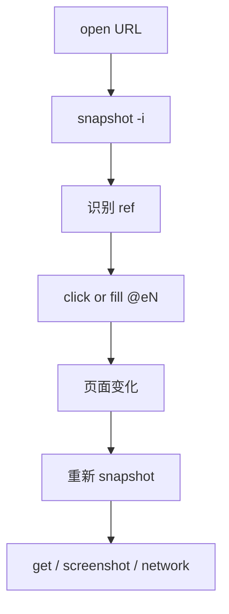

> **目标读者**：希望为 AI Agent、命令行工具或自动化流程补充浏览器能力的工程师。
> **核心问题**：让 Agent 直接在终端里"打开页面 -> 识别元素 -> 执行动作 -> 取回结果"，不必先写一层完整 SDK 代码——`agent-browser` 能否缩短这条路径？
> **事实边界**：本文基于 `vercel-labs/agent-browser` 仓库 README 与公开 CLI 帮助信息整理；未公开的内部实现、未验证的性能数字和未出现于官方文档的命令不写成事实。

## 阅读导航

### 完整目录

- §1 学习目标
- §2 定位与适用场景
  - §2.1 它是什么
  - §2.2 为什么它对 AI Agent 友好
  - §2.3 什么时候适合选它
  - §2.4 和 Playwright 的关系
- §3 核心工作流
  - §3.1 推荐模式：`snapshot + ref`
  - §3.2 一个最小可运行示例
  - §3.3 `ref` 与传统选择器的取舍
- §4 快速开始
  - §4.1 安装
  - §4.2 最小验证
  - §4.3 第一个 Agent 友好流程
- §5 核心命令地图
  - §5.1 导航与页面生命周期
  - §5.2 交互命令
  - §5.3 获取页面信息
  - §5.4 语义化查找与状态检查
  - §5.5 批量执行
- §6 会话、认证与安全
  - §6.1 会话隔离
  - §6.2 认证状态复用
  - §6.3 连接已有 Chrome
  - §6.4 面向 Agent 的安全控制
- §7 调试与观测
  - §7.1 先看页面，再看命令
  - §7.2 网络与错误观察
  - §7.3 Trace、Profiler 与 Dashboard
- §8 两个实战示例
  - §8.1 场景一：登录后提取仪表盘标题
  - §8.2 场景二：批量执行固定浏览动作
- §9 常见问题
- §10 练习与自测
- §11 结论与进阶路径
  - §11.1 一句话结论
  - §11.2 选型建议
  - §11.3 进阶路径

### 按需跳转

- 只想快速上手：直接看 §4 快速开始
- 想理解为什么它适合 Agent：先看 §2 定位与适用场景
- 想做登录、会话复用和安全收敛：重点看 §6 会话、认证与安全
- 想做调试、追踪和可视化观察：重点看 §7 调试与观测

## §1 学习目标

读完本文，你应该能：

- 说清 `agent-browser` 的定位，以及它和 Playwright 这类 SDK（软件开发工具包）方案的边界差异
- 上手官方推荐的 `snapshot + ref` 交互模式，不再一上来就堆 CSS（层叠样式表）选择器
- 独立完成安装、浏览器准备与最小验证
- 用常见命令打开页面、等待、点击、填充、抓取、截图、批量执行
- 在真实项目里处理会话隔离、认证复用、安全限制和调试排障
- 判断什么时候选它，什么时候回到 SDK、测试框架或云浏览器平台

## §2 定位与适用场景

### 2.1 它是什么

`agent-browser` 是一个用 Rust 编写的浏览器自动化 CLI（命令行接口），面向 Agent 工作流设计。命令行是它的统一入口：终端里连续执行 `open`、`snapshot`、`click`、`fill`、`wait`、`get` 等命令，浏览器状态由后台进程持续复用。

AI Agent 任务往往不需要先搭测试项目，也不必围绕 SDK 写胶水代码。Agent 拿到任务后，通常这样走：

1. 打开页面
2. 获取结构化快照
3. 依据快照里的元素引用执行动作
4. 在页面变化后重新获取快照
5. 产出截图、文本或网络信息

### 2.2 为什么它对 AI Agent 友好

官方资料里能看到这些设计取向：

| 设计点 | 对 Agent 的意义 |
| ------ | ------ |
| 原生命令行接口 | Agent 直接拼装和调用命令，不必先进入 SDK 运行时 |
| `snapshot` 输出元素引用 | Agent 围绕 `@e1`、`@e2` 这类稳定引用操作，降低脆弱选择器带来的误点风险 |
| 后台 daemon 持续复用浏览器 | 多次命令之间不必每一步都重新拉起浏览器 |
| `batch` 批量执行 | 多步流程合并成一次调用，降低进程往返开销 |
| 会话、状态、安全开关较完整 | 能支撑真实任务，不只是 demo 级别 |
| `chat`、dashboard、streaming 等能力 | 便于把 CLI 工作流延伸到可视化调试或 AI 辅助交互 |

### 2.3 什么时候适合选它

| 场景 | 是否适合 | 原因 |
| ------ | ------ | ------ |
| 让 AI Agent 在终端里访问网页并完成交互 | 很适合 | 命令模型直接，`snapshot + ref` 非常契合 LLM（大语言模型）决策 |
| 快速做页面巡检、截图、抓文本、检查网络请求 | 很适合 | 不必先搭测试框架 |
| 在 CI 或 Serverless 环境跑浏览器任务 | 适合 | 支持本地浏览器、CDP（Chrome DevTools Protocol，Chrome 开发者工具协议）连接和多种云浏览器 provider |
| 编写大型端到端测试套件 | 视情况而定 | 需要复杂断言、fixture、报告体系时，SDK 型方案通常更稳 |
| 做重度 DOM（文档对象模型）断言和应用级测试组织 | 不太适合单独承担 | CLI 擅长操作与提取，完整测试框架仍需 SDK 承担 |

### 2.4 和 Playwright 的关系

把它理解成"Playwright 的完全替代品"容易走偏。两者定位不同：

- 想让 Agent 以最少上下文接管浏览器，`agent-browser` 更直接
- 想构建工程化测试系统，Playwright 一类 SDK 更成熟
- 两者可以共存：前者偏 Agent 操作层，后者偏测试与应用代码层

## §3 核心工作流

### 3.1 推荐模式：`snapshot + ref`

官方文档反复出现一条建议：面向 AI 的最佳路径是先获取页面快照，再用快照里的引用操作元素。直接写复杂选择器容易踩坑——类名会变，DOM 层级会变，临时拼出来的选择器在页面重渲染后可能直接失效。



这套模式比直接堆 CSS 选择器更稳，原因在于 `ref` 是快照上下文里的确定性引用，不会因为页面重渲染而漂移。识别元素和执行动作被拆成两步，Agent 先观察再行动；页面变化后重新快照，引用始终对应当前 DOM，而不是过期结构。临时猜出来的 CSS 选择器在重渲染后往往直接失效，`ref` 把这个不确定性消掉了。

### 3.2 一个最小可运行示例

```bash
# 1. 打开页面。
agent-browser open https://example.com

# 2. 获取交互元素快照，输出里会出现 @e1、@e2 之类的引用。
agent-browser snapshot -i

# 3. 根据快照选择元素并执行动作。
agent-browser click @e2
agent-browser fill @e3 "test@example.com"

# 4. 获取结果或保留证据。
agent-browser get title
agent-browser screenshot ./example.png

# 5. 关闭当前浏览器会话。
agent-browser close
```

五步覆盖了完整工作流。§4.2 是更简短的安装验证流程，两者侧重不同。

### 3.3 `ref` 与传统选择器的取舍

| 方式 | 适合场景 | 说明 |
| ------ | ------ | ------ |
| `@e2` 这类 ref | Agent 自动化首选 | 来自 `snapshot` 输出，最适合 LLM 决策 |
| CSS 选择器 | 已知稳定 DOM 结构 | 如 `"#submit"`、`".item > a"` |
| `find role`、`find text` | 语义化定位 | 对可访问性良好的页面尤其有效 |
| XPath（XML 路径语言）/ `text=` | 兼容性补位 | 可用，官方 Agent 工作流里优先级较低 |

## §4 快速开始

### 4.1 安装

#### 全局安装（官方推荐）

```bash
npm install -g agent-browser
agent-browser install
```

#### Homebrew 安装（macOS）

```bash
brew install agent-browser
agent-browser install
```

#### Cargo 安装（Rust 环境）

```bash
cargo install agent-browser
agent-browser install
```

#### 从源码构建

```bash
git clone https://github.com/vercel-labs/agent-browser.git
cd agent-browser
pnpm install
pnpm build
pnpm build:native
pnpm link --global
agent-browser install
```

`agent-browser install` 这一步不能省。它会下载 Chrome for Testing；如果系统里已经存在 Chrome、Brave、Playwright 或 Puppeteer 相关浏览器，也会尝试自动检测。安装 CLI 和准备浏览器是两步，只做前一步会导致后续命令找不到浏览器。

### 4.2 最小验证

```bash
agent-browser open https://example.com
agent-browser wait --load networkidle
agent-browser snapshot -i
agent-browser close
```

这三步能跑通，说明 CLI、浏览器与后台通信链路基本正常。失败时回到 §4.1 检查 `agent-browser install` 是否执行过。

### 4.3 第一个 Agent 友好流程

```bash
agent-browser open https://news.ycombinator.com
agent-browser snapshot -i --urls
agent-browser find role link click --name "new"
agent-browser wait --load networkidle
agent-browser screenshot ./hn-new.png
```

先 `snapshot -i --urls` 把页面可交互元素和 URL 摸清楚，再通过 `find role` 这样的语义化命令执行动作，减少硬编码选择器。

## §5 核心命令地图

### 5.1 导航与页面生命周期

| 命令 | 作用 | 示例 |
| ------ | ------ | ------ |
| `open <url>` | 打开页面 | `agent-browser open https://example.com` |
| `back` / `forward` / `reload` | 导航控制 | `agent-browser reload` |
| `close` | 关闭当前浏览器 | `agent-browser close` |
| `close --all` | 关闭所有活动会话 | `agent-browser close --all` |
| `wait` | 等待元素、文本、URL 或加载状态 | `agent-browser wait --load networkidle` |

优先掌握 `wait`。大多数失败的根源是页面还没稳定就开始操作——Agent 拿到的快照里元素还没出现，后续 `click` 或 `fill` 自然落空。显式等待是降低这类误操作的主要手段。

### 5.2 交互命令

| 命令 | 作用 | 示例 |
| ------ | ------ | ------ |
| `click <sel>` | 点击元素 | `agent-browser click @e2` |
| `dblclick <sel>` | 双击元素 | `agent-browser dblclick ".card"` |
| `hover <sel>` | 悬停元素 | `agent-browser hover @e5` |
| `type <sel> <text>` | 模拟键入 | `agent-browser type @e3 "hello"` |
| `fill <sel> <text>` | 清空后填入 | `agent-browser fill @e3 "user@example.com"` |
| `press <key>` | 发送按键 | `agent-browser press Enter` |
| `select <sel> <val>` | 选择下拉项 | `agent-browser select @e4 beijing` |
| `check` / `uncheck` | 复选框状态控制 | `agent-browser check @e6` |
| `upload <sel> <files>` | 上传文件 | `agent-browser upload @e7 ./report.pdf` |
| `drag <src> <tgt>` | 拖拽元素 | `agent-browser drag @e8 @e9` |

`type` 和 `fill` 的区别：

- `type` 更接近真实按键输入，会触发 keydown、keyup 等事件
- `fill` 直接把输入框的值改成目标值，跳过逐键输入

测试输入法、快捷键或前端键盘事件时优先用 `type`；只是想稳定填值时优先用 `fill`，后者更快，也更不容易触发前端校验异常。

### 5.3 获取页面信息

| 命令 | 作用 | 示例 |
| ------ | ------ | ------ |
| `snapshot` | 获取可访问性树与引用 | `agent-browser snapshot -i --json` |
| `get text <sel>` | 取文本 | `agent-browser get text @e1` |
| `get html <sel>` | 取 HTML | `agent-browser get html "#main"` |
| `get attr <sel> <attr>` | 取属性 | `agent-browser get attr @e3 href` |
| `get title` | 取标题 | `agent-browser get title` |
| `get url` | 取当前 URL | `agent-browser get url` |
| `screenshot [path]` | 截图 | `agent-browser screenshot ./page.png` |
| `pdf <path>` | 导出 PDF | `agent-browser pdf ./page.pdf` |

给 LLM 用时，`snapshot --json` 输出结构化数据，适合文本推理；`screenshot --annotate` 在截图上标注元素 ref，适合视觉模型或人工复核页面布局。

### 5.4 语义化查找与状态检查

```bash
agent-browser find role button click --name "Submit"
agent-browser find text "Sign In" click
agent-browser find label "Email" fill "test@example.com"
agent-browser is visible @e2
agent-browser is enabled @e2
agent-browser is checked @e6
```

这些命令比直接写 CSS 更适合 Agent。业务页面不断迭代，类名和 DOM 层级会变，但按钮角色、可访问名称、标签文本往往稳定得多。语义定位让 Agent 接近"看懂页面再行动"，减少对脆弱选择器的依赖。

### 5.5 批量执行

```bash
echo '[
  ["open", "https://example.com"],
  ["wait", "--load", "networkidle"],
  ["snapshot", "-i"],
  ["screenshot", "result.png"]
]' | agent-browser batch --json
```

任务是多步固定流程时，`batch` 把多次往返压缩成一次调用。它适合：

- 已经确定步骤顺序的 Agent 子任务
- 需要减少命令调用开销的采集任务
- 希望统一处理失败停止逻辑的场景，例如 `batch --bail`

## §6 会话、认证与安全

### 6.1 会话隔离

```bash
agent-browser --session agent1 open https://site-a.com
agent-browser --session agent2 open https://site-b.com
agent-browser session list
```

会话隔离让多个 Agent 或多个任务不会把 Cookie、导航历史和页面状态混到一起。并发自动化和多租户任务里，把它当作默认选项启用，避免状态串扰。

### 6.2 认证状态复用

Agent Browser 提供多种状态复用方式，最常用的几类：

| 方式 | 适用场景 | 示例 |
| ------ | ------ | ------ |
| `--profile <name 或 path>` | 复用 Chrome 现有登录态或持久目录 | `agent-browser --profile Default open https://gmail.com` |
| `--session-name <name>` | 自动保存和恢复会话状态 | `agent-browser --session-name myapp open https://app.example.com` |
| `state save/load` | 显式导出与回放状态 | `agent-browser state save ./auth.json` |
| `auth save/login` | 本地加密存凭据并触发登录 | `echo "pass" \| agent-browser auth save github --url https://github.com/login --username user --password-stdin` |

策略选错容易导致登录态丢失或状态污染。按场景选：

- 临时复用自己的浏览器登录态，`--profile` 上手最快
- 脚本多次执行后都自动保留状态，`--session-name` 更省心
- 需要把状态在不同机器、任务间转移，`state save/load` 更可控

### 6.3 连接已有 Chrome

```bash
agent-browser connect 9222
agent-browser snapshot -i
```

`connect <port>` 接管已经开启远程调试端口的 Chrome 实例。这在两类场景中常用：

- 接管已经登录好的浏览器，省去重新登录
- 连接远程 CDP 端点，不在本地新开实例

安全边界要注意：远程调试端口意味着本机其他进程可能拿到完整浏览器控制权，只应在可信环境里使用。是否提供自动发现已开启远程调试 Chrome 的选项，以 `agent-browser --help` 输出为准。

### 6.4 面向 Agent 的安全控制

CLI 帮助信息里列出的安全开关，生产环境建议逐项确认（以 `agent-browser --help` 实际输出为准）：

| 选项 | 作用 |
| ------ | ------ |
| `--allowed-domains` | 限制只允许访问可信域名 |
| `--content-boundaries` | 给页面内容加边界标记，降低 LLM 把页面内容和系统输出混淆的风险 |
| `--confirm-actions` | 对 `eval`、下载等高风险动作要求确认 |
| `--action-policy` | 用策略文件限制敏感动作（如 CLI 帮助信息所示） |
| `--max-output` | 限制输出长度，防止页面内容淹没上下文（如 CLI 帮助信息所示） |

浏览器自动化事故里，命令失败通常留下报错堆栈，排查路径清晰；真正难防的是命令成功但越界——Agent 误点删除按钮、误下载文件、误把页面内容当成系统指令执行。把 `agent-browser` 放进真实 Agent 系统前，上面这些开关需要逐项确认。

## §7 调试与观测

### 7.1 先看页面，再看命令

```bash
agent-browser screenshot --annotate ./page.png
agent-browser highlight @e2
agent-browser inspect
```

推荐顺序：

1. `snapshot -i` 看结构
2. `screenshot --annotate` 看视觉位置
3. `highlight` 或 `inspect` 核对目标元素

按这个顺序排查，能把问题快速归因到"定位错了"还是"页面没加载完"，避免在两处之间反复试错。

### 7.2 网络与错误观察

```bash
agent-browser network requests
agent-browser network requests --filter api
agent-browser network request <requestId>
agent-browser console
agent-browser errors
```

页面行为异常时，优先排查三件事：

- 接口有没有发出去
- 控制台有没有脚本错误
- 页面是不是因为权限、重定向或接口失败而停在错误状态

### 7.3 Trace、Profiler 与 Dashboard

```bash
agent-browser trace start
agent-browser trace stop ./trace.zip

agent-browser profiler start
agent-browser profiler stop ./profile.json

agent-browser dashboard start
```

Trace 文件可以发给同事复现问题；Profiler 数据用来定位哪一步耗时最长；Dashboard 适合实时观察 Agent 的操作。排查偶发问题、复盘错误路径、多人协作时都能用上。

## §8 两个实战示例

### 8.1 场景一：登录后提取仪表盘标题

```bash
#!/usr/bin/env bash
set -euo pipefail

# 打开登录页并等待页面稳定。
agent-browser open https://app.example.com/login
agent-browser wait --load networkidle

# 获取页面快照，确认输入框和按钮的 ref。
agent-browser snapshot -i

# 下面的 @e2、@e3、@e4 仅为示例，实际值以当前快照输出为准。
agent-browser fill @e2 "user@example.com"
agent-browser fill @e3 "$APP_PASSWORD"
agent-browser click @e4

# 登录后等待 URL 变化并抓取结果。
agent-browser wait --url "**/dashboard"
agent-browser get title
agent-browser screenshot ./dashboard.png
```

这个例子里容易踩坑的是最后一行等待：登录按钮点下去之后立刻取标题，拿到的往往还是旧页面。`wait --url` 确保浏览器已经跳转到仪表盘，`get title` 才会返回新页面的标题。

### 8.2 场景二：批量执行固定浏览动作

```bash
echo '[
  ["open", "https://example.com"],
  ["wait", "--load", "networkidle"],
  ["snapshot", "-i", "--json"],
  ["screenshot", "./example-home.png"],
  ["open", "https://example.com/docs"],
  ["wait", "--load", "networkidle"],
  ["screenshot", "./example-docs.png"]
]' | agent-browser batch --json
```

`batch` 适合步骤已知的流程。下一步要靠上一步的输出动态决策时，得回到单步命令，让 Agent 在每一步重新判断——`batch` 内部无法插入 LLM 推理。

## §9 常见问题

### 9.1 装好了 CLI，但浏览器起不来

优先检查三件事：

- 是否执行过 `agent-browser install`
- 本机是否存在可检测到的 Chrome、Brave 或相关浏览器
- 当前环境是否限制了浏览器启动权限

### 9.2 页面总是超时

先做最小化排查，再考虑改逻辑：

```bash
agent-browser open https://example.com
agent-browser wait --load networkidle
agent-browser snapshot -i
```

这里已经失败的话，问题多半不在业务操作，而在网络、浏览器或页面本身。CLI 帮助信息提到默认操作超时是 `25000 ms`（来源：`agent-browser --help` 输出），可通过 `AGENT_BROWSER_DEFAULT_TIMEOUT` 环境变量调整。调大超时能容忍慢页面，但也会让卡死的流程拖得更久，要结合实际页面响应时间权衡。

### 9.3 页面内容太长，把 Agent 上下文撑爆了

优先组合几种办法：

- `snapshot -i` 只看交互元素
- `snapshot -c` 移除空结构元素
- `snapshot -d 3` 限制深度
- `--max-output` 限制输出体积（如 CLI 帮助信息所示）
- `-s "#main"` 只查看局部区域

### 9.4 想接入 AI，对话式控制怎么开

CLI 本身提供 `chat` 命令和 dashboard 内置聊天面板，但前提是先配置 Vercel AI Gateway 相关环境变量，例如 `AI_GATEWAY_API_KEY`。若只是"让上层 Agent 调命令"，不必启用 `chat`，直接用 `snapshot + ref` 更可控——`chat` 适合人工调试或让 LLM 自主探索，不适合需要确定性执行的流程。

## §10 练习与自测

### 10.1 动手练习

建议至少完成下面 5 个练习：

1. **基础流程**：用 `open -> snapshot -i -> click @eN -> screenshot` 跑通一次真实页面跳转，记录每一步的 `ref` 是否稳定
2. **会话复用**：用 `--session-name` 保存一次登录态，关闭浏览器后重启，验证状态是否仍可复用
3. **网络排查**：用 `network requests` 和 `console` 排查一次页面异常，记录你最终定位问题的顺序与依据
4. **批量执行**：把一段 5 步以上的固定流程改写成 `batch --json`，对比单步调用与批量调用的耗时差异
5. **安全收敛**：在一个真实站点上启用 `--allowed-domains` 和 `--max-output`，观察 Agent 在受限条件下的行为变化

### 10.2 自测清单

- 我能解释为什么 Agent 优先使用 `snapshot + ref`，避免直接猜 CSS 选择器
- 我知道 `type`、`fill`、`find role`、`wait --load networkidle` 分别适合什么场景
- 我知道 `--session`、`--session-name`、`--profile`、`state save/load` 的差异，并能根据场景选择
- 我知道怎样用 `--allowed-domains`、`--content-boundaries`、`--action-policy` 控制风险
- 我知道页面失败时先看 `snapshot`、`console`、`network`，避免盲目重试
- 我能区分 `agent-browser` 与 Playwright SDK 的适用边界，并说明何时该切换
- 我知道 `batch` 适合什么场景，以及为什么动态决策流程不应使用 `batch`

## §11 结论与进阶路径

### 11.1 一句话结论

要让 AI Agent 直接在终端里稳定操控浏览器，`agent-browser` 是优先选项。它把 LLM 最容易出错的"猜选择器"环节换成"读快照引用"——Agent 先 `snapshot` 拿到 `@e1`、`@e2` 这类稳定引用，再据此执行动作，页面变化后重新快照刷新认知。误操作的发生点从"选择器漂移"前移到了"是否在正确的快照上下文里操作"，排查起来也更容易。

### 11.2 选型建议

| 需求 | 更推荐的方向 |
| ------ | ------ |
| Agent 主导的网页操作 | `agent-browser` |
| 大型 E2E 测试工程 | Playwright / 其他测试框架 |
| 需要远程浏览器基础设施 | `agent-browser` + cloud provider |
| 需要强类型 SDK、fixture、断言组织 | SDK 方案更稳 |

### 11.3 进阶路径

按下面的顺序深入：

1. 先熟练 `open`、`snapshot -i`、`click`、`fill`、`wait`
2. 再补 `session`、`profile`、`state`、`auth`
3. 然后学习 `network`、`trace`、`console`、`errors`
4. 最后再引入 `chat`、dashboard、streaming 和云浏览器 provider

## 参考资料

- GitHub 仓库：https://github.com/vercel-labs/agent-browser（截至写作时有效）
- Chrome DevTools Protocol：https://chromedevtools.github.io/devtools-protocol/（截至写作时有效）

## 文档信息

- 难度：⭐⭐⭐⭐
- 类型：工具指南
- 更新日期：2026-04-15
- 预计阅读时间：18 分钟
- 前置知识：命令行基础、浏览器自动化基本概念、HTML 可访问性常识
