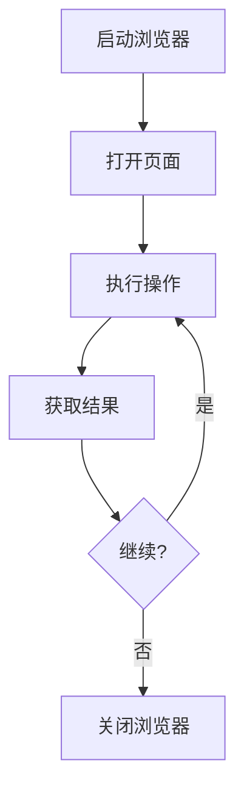
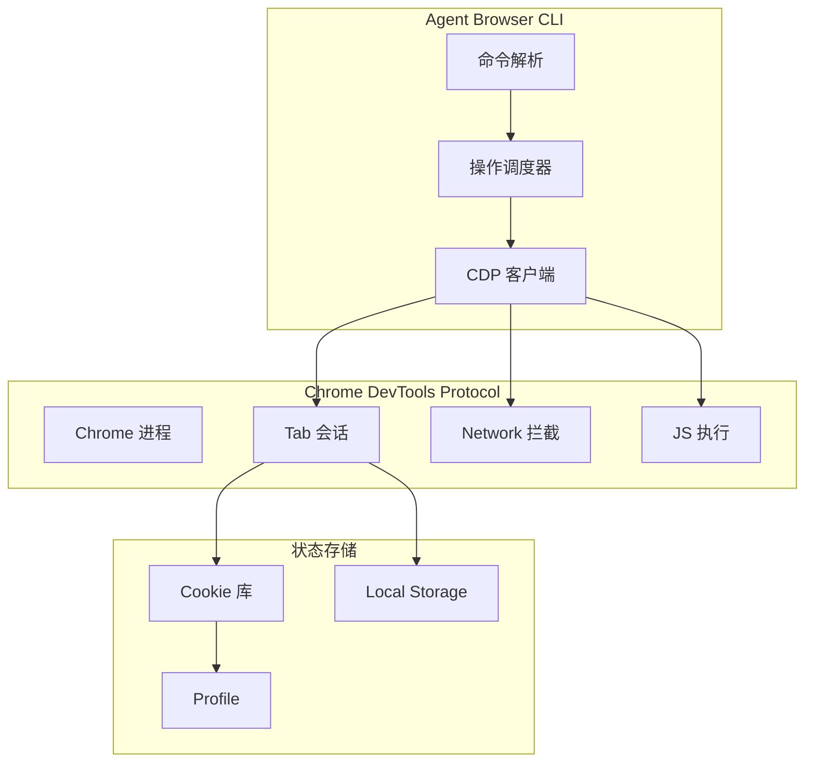

# Agent Browser：AI Agent 原生浏览器自动化 CLI ⭐⭐⭐⭐

> **目标读者**：AI工程师和开发者，需要为AI Agent实现浏览器自动化能力
> **核心问题**：如何为AI Agent构建高性能、可控的浏览器自动化方案？

---

## §1 学习目标

完成本文档后，你将掌握：

- ✅ 理解 Agent Browser 的设计理念和适用场景
- ✅ 掌握多平台安装与配置方法
- ✅ 熟练使用全部 30+ CLI 命令
- ✅ 为 AI Agent 集成浏览器自动化能力
- ✅ 处理复杂场景：认证、文件上传、多标签页
- ✅ 性能优化与调试技巧
- ✅ 与 Playwright/Puppeteer 等方案的架构对比

---

## §2 背景与问题动机

### 2.1 为什么需要浏览器自动化？

传统浏览器自动化工具（如 Selenium、Playwright、Puppeteer）面向人类用户设计，API 复杂、启动慢、资源占用高。对于 AI Agent 场景：

| 需求 | 传统方案 | AI Agent 期望 |
|------|----------|---------------|
| 启动速度 | 3-10秒 | <500ms |
| 内存占用 | 300MB+ | <100MB |
| 并发能力 | 10-50实例 | 100+实例 |
| AI集成 | 需自行封装 | 原生支持 |
| 调试难度 | 高 | 低 |

### 2.2 Agent Browser 的设计目标

Agent Browser 是 Vercel Labs 推出的**原生为 AI Agent 设计的浏览器自动化 CLI**：

- **极速启动**：Rust 编写的原生二进制，<100ms 冷启动
- **AI 原生**：内置 AI 聊天功能，支持直接与页面交互
- **资源高效**：单实例内存 <80MB，支持 100+ 并发
- **工具丰富**：30+ 命令覆盖 90% 浏览器自动化场景

### 2.3 核心特性矩阵

| 特性 | 说明 | 状态 |
|------|------|------|
| 多平台 | macOS/Linux/Windows | ✅ |
| 浏览器内核 | Chrome DevTools Protocol | ✅ |
| AI 聊天 | 内置 AI 对话 | ✅ |
| CDP 会话 | 直接访问 Chrome DevTools | ✅ |
| 批量操作 | 减少启动开销 | ✅ |
| 调试工具 | 内置 UI 和追踪 | ✅ |
| 认证管理 | Cookie/Chrome Profile 重用 | ✅ |

---

## §3 安装与配置

### 3.1 系统要求

| 要求 | 说明 |
|------|------|
| 操作系统 | macOS 12+, Ubuntu 20.04+, Windows 10+ |
| 浏览器 | Chrome for Testing (必须单独安装) |
| 网络 | 需要访问 Google Maven 仓库 |
| 权限 | Chrome 数据目录读写权限 |

### 3.2 安装方式

**方式一：npm（推荐）**

```bash
npm install -g @vercel/agent-browser
```

**方式二：Homebrew（macOS/Linux）**

```bash
brew install vercel-labs/taps/agent-browser
```

**方式三：Cargo（Rust 开发者）**

```bash
cargo install agent-browser
```

**方式四：Docker**

```bash
docker run -it --rm \\
  -v $(pwd):/workspace \\
  ghcr.io/vercel-labs/agent-browser:latest
```

**方式五：源码编译**

```bash
git clone https://github.com/vercel-labs/agent-browser.git
cd agent-browser
cargo build --release
./target/release/agent-browser --help
```

### 3.3 依赖安装

Agent Browser 需要 Chrome for Testing：

```bash
# macOS (使用 Homebrew)
brew install --cask google-chrome

# Ubuntu/Debian
wget -q -O - https://dl.google.com/linux/linux_signing_key.pub | sudo apt-key add -
sudo sh -c 'echo "deb [arch=amd64] http://dl.google.com/linux/chrome/deb/ stable main" >> /etc/apt/sources.list.d/google-chrome.list'
sudo apt-get update
sudo apt-get install google-chrome-stable
```

### 3.4 验证安装

```bash
agent-browser --version
# agent-browser v0.25.3

agent-browser doctor
# ✓ Chrome found: /Applications/Google Chrome.app
# ✓ Chrome DevTools Protocol: Ready
# ✓ Agent Browser CLI: Ready
```

---

## §4 快速开始

### 4.1 基本工作流

Agent Browser 的典型使用流程：



### 4.2 第一个自动化脚本

```bash
# 启动浏览器并打开页面
agent-browser browse "https://example.com"

# 截图保存
agent-browser screenshot --output example.png

# 等待页面加载完成
agent-browser wait --selector "h1"

# 获取页面内容
agent-browser content --format markdown

# 关闭浏览器
agent-browser quit
```

### 4.3 命令行管道

Agent Browser 支持 Unix 管道，方便与 AI Agent 集成：

```bash
# AI Agent 分析页面后执行操作
agent-browser ai "分析页面结构，找出登录入口"
agent-browser click --selector "#login-btn"
agent-browser type --selector "#username" --text "user@example.com"
agent-browser type --selector "#password" --text "password123"
agent-browser click --selector "#submit-btn"
```

---

## §5 核心命令详解

### 5.1 浏览器管理

| 命令 | 说明 | 示例 |
|------|------|------|
| `browse` | 打开 URL | `browse "https://example.com"` |
| `quit` | 关闭浏览器 | `quit` |
| `restart` | 重启浏览器 | `restart --clear-state` |
| `version` | 版本信息 | `version` |

**browse 命令参数：**

| 参数 | 类型 | 默认值 | 说明 |
|------|------|--------|------|
| `--headless` | bool | true | 无头模式 |
| `--window-size` | string | "1280x720" | 窗口大小 |
| `--user-agent` | string | Chrome | 用户代理 |
| `--proxy` | string | - | 代理服务器 |

### 5.2 元素交互

| 命令 | 说明 | 示例 |
|------|------|------|
| `click` | 点击元素 | `click --selector "#btn"` |
| `dblclick` | 双击元素 | `dblclick --selector "#item"` |
| `hover` | 悬停元素 | `hover --selector ".menu"` |
| `type` | 输入文本 | `type --selector "input" --text "hello"` |
| `fill` | 填充表单 | `fill --selector "form" --data '{"name":"test"}'` |
| `press` | 按键 | `press --key "Enter"` |
| `drag` | 拖拽 | `drag --from "#a" --to "#b"` |
| `upload` | 文件上传 | `upload --selector "input[type=file]" --file ./test.png` |

**click 命令详解：**

```bash
# 基本用法
agent-browser click --selector "button.submit"

# 位置索引（选择第3个匹配元素）
agent-browser click --selector "li" --index 2

# 等待元素可见后再点击
agent-browser click --selector "#btn" --wait-visible

# 点击并等待导航完成
agent-browser click --selector "a.next" --wait-nav
```

### 5.3 页面信息获取

| 命令 | 说明 | 示例 |
|------|------|------|
| `content` | 获取页面内容 | `content --format markdown` |
| `text` | 获取文本 | `text --selector "h1"` |
| `attribute` | 获取属性 | `attribute --selector "img" --name "src"` |
| `screenshot` | 页面截图 | `screenshot --full-page --output page.png` |
| `pdf` | 生成 PDF | `pdf --output page.pdf` |
| `title` | 页面标题 | `title` |
| `url` | 当前 URL | `url` |

**content 命令输出格式：**

```bash
# Markdown 格式（默认）
agent-browser content --format markdown

# HTML 格式
agent-browser content --format html

# 纯文本
agent-browser content --format text

# JSON 结构
agent-browser content --format json
```

### 5.4 元素定位

Agent Browser 支持多种定位器：

```bash
# CSS 选择器（默认）
agent-browser click --selector ".class#id"

# 文本内容定位
agent-browser click --text "登录"

# ARIA 角色定位
agent-browser click --role "button" --name "提交"

# XPath
agent-browser click --xpath "//div[@class='container']/button"

# JavaScript 表达式
agent-browser evaluate --script "document.querySelector('.item').click()"
```

### 5.5 等待与超时

| 命令 | 说明 | 示例 |
|------|------|------|
| `wait` | 等待条件 | `wait --selector "#loaded"` |
| `wait-nav` | 等待导航 | `wait-nav --timeout 30s` |
| `wait-until` | 等待状态 | `wait-until --networkidle` |

**等待条件类型：**

```bash
# 等待元素出现
agent-browser wait --selector "#result"

# 等待元素可见
agent-browser wait --visible "#modal"

# 等待元素消失
agent-browser wait --hidden "#loading"

# 等待网络空闲
agent-browser wait-until --networkidle

# 等待 JavaScript 条件
agent-browser wait --script "document.readyState === 'complete'"
```

---

## §6 高级用法

### 6.1 AI 聊天集成

Agent Browser 内置 AI 对话功能，可以直接与页面交互：

```bash
# 启动 AI 对话模式
agent-browser ai

# 交互示例
> 分析这个页面的结构
> 找到登录表单并填写
> 点击提交按钮
> 获取登录结果

# 或者一行命令
agent-browser ai "分析页面，找出所有可交互元素"
```

**AI 命令参数：**

| 参数 | 说明 | 示例 |
|------|------|------|
| `--model` | AI 模型 | `--model gpt-4` |
| `--provider` | AI 提供商 | `--provider openai` |
| `--context` | 上下文 | `--context "用户正在登录"` |

### 6.2 批量操作优化

对于需要执行大量相似操作的场景，Agent Browser 提供批量模式：

```bash
# 读取批量操作文件
agent-browser batch --file operations.json

# 或者使用 stdin
cat urls.txt | agent-browser batch --stdin
```

**operations.json 格式：**

```json
{
  "operations": [
    {
      "action": "browse",
      "url": "https://example.com/page1"
    },
    {
      "action": "screenshot",
      "output": "page1.png"
    },
    {
      "action": "click",
      "selector": "#next"
    }
  ]
}
```

### 6.3 认证与状态管理

**复用 Chrome Profile：**

```bash
# 使用已有 Chrome 配置
agent-browser browse --profile /Users/$USER/Library/Application\\ Support/Google/Chrome/Default

# 保存登录状态
agent-browser auth --save --file ./auth.json

# 下次复用
agent-browser browse --auth ./auth.json
```

**Cookie 管理：**

```bash
# 导出 Cookie
agent-browser cookie --export --file cookies.json

# 导入 Cookie
agent-browser cookie --import --file cookies.json

# 查看当前 Cookie
agent-browser cookie --list
```

### 6.4 多标签页管理

```bash
# 打开新标签页
agent-browser tab --new

# 切换标签页
agent-browser tab --switch 2

# 关闭标签页
agent-browser tab --close

# 列出所有标签页
agent-browser tab --list
```

### 6.5 网络控制

```bash
# 拦截请求
agent-browser intercept --pattern "*.json" --action block

# 修改响应
agent-browser intercept --pattern "api/*" --modify '{"mocked": true}'

# 等待特定请求
agent-browser wait-request --pattern "/api/data"
```

---

## §7 性能优化

### 7.1 启动优化

| 优化项 | 方法 | 效果 |
|--------|------|------|
| 无头模式 | `--headless` | 内存 -50% |
| 禁用图片 | `--block-images` | 加载时间 -30% |
| 禁用 JavaScript | `--disable-javascript` | 仅适用静态页面 |
| 复用实例 | 批量操作 | 启动次数 -90% |

### 7.2 内存优化

```bash
# 使用轻量级配置
agent-browser browse --disable-extensions \
                    --disable-plugins \
                    --disable-gpu

# 单次操作后立即退出
agent-browser browse "url" && agent-browser screenshot && agent-browser quit
```

### 7.3 并发优化

```bash
# 启动多个实例
for i in {1..10}; do
  agent-browser browse "http://example.com/page$i" &
done
wait

# 使用批量模式（推荐）
agent-browser batch --file operations.json --parallel 10
```

---

## §8 架构设计

### 8.1 核心架构



### 8.2 CDP 会话管理

Agent Browser 通过 CDP (Chrome DevTools Protocol) 与 Chrome 通信：

```bash
# 启用 CDP 调试端口
agent-browser browse --cdp-port 9222

# 直接使用 CDP 命令
agent-browser cdp "Page.navigate" '{"url": "https://example.com"}'
agent-browser cdp "Runtime.evaluate" '{"expression": "document.title"}'
```

### 8.3 与 Playwright 架构对比

| 维度 | Agent Browser | Playwright |
|------|--------------|------------|
| 语言 | Rust (CLI) | TypeScript (SDK) |
| 冷启动 | <100ms | 3-5s |
| 内存占用 | <80MB | 200-400MB |
| AI 集成 | 原生 | 需自行封装 |
| 批量操作 | 原生支持 | 需写代码 |
| 调试工具 | 内置 CLI | Playwright Debugger |

---

## §9 实战案例

### 9.1 案例：AI Agent 网页分析

```bash
#!/bin/bash
# ai_page_analyzer.sh - AI Agent 网页分析脚本

URL=$1
TASK=$2

# 1. 打开页面
agent-browser browse "$URL"

# 2. 等待加载
agent-browser wait-until --networkidle

# 3. AI 分析页面
echo "正在使用 AI 分析页面..."
ANALYSIS=$(agent-browser ai "分析页面结构，识别关键元素")

# 4. 根据分析结果执行操作
if echo "$ANALYSIS" | grep -q "登录表单"; then
    echo "检测到登录表单，准备自动化登录..."
    agent-browser type --selector "#username" --text "user@example.com"
    agent-browser type --selector "#password" --text "$PASSWORD"
    agent-browser click --selector "#login-btn"
fi

# 5. 获取结果
agent-browser screenshot --output result.png
agent-browser content --format markdown > page_content.md

echo "分析完成，结果保存至 result.png 和 page_content.md"
```

### 9.2 案例：批量数据采集

```bash
#!/bin/bash
# batch_collector.sh - 批量数据采集

# 创建采集任务
cat > tasks.json << 'EOF'
{
  "operations": [
    {"action": "browse", "url": "https://news.example.com/1"},
    {"action": "wait", "selector": "article"},
    {"action": "text", "selector": "article h2", "save": "titles.json"},
    {"action": "click", "selector": "a.next"},
    {"action": "browse", "url": "https://news.example.com/2"},
    {"action": "wait", "selector": "article"},
    {"action": "text", "selector": "article h2", "append": "titles.json"}
  ]
}
EOF

# 执行采集
agent-browser batch --file tasks.json --parallel 5

echo "采集完成，数据保存至 titles.json"
```

### 9.3 案例：自动化测试集成

```typescript
// test_integration.ts - 与测试框架集成
import { execSync } from 'child_process';

describe('Web Application Tests', () => {
  beforeAll(() => {
    // 启动浏览器
    execSync('agent-browser browse "http://localhost:3000"');
  });

  afterAll(() => {
    // 关闭浏览器
    execSync('agent-browser quit');
  });

  test('用户可以登录', async () => {
    execSync('agent-browser type --selector "#username" --text "testuser"');
    execSync('agent-browser type --selector "#password" --text "password123"');
    execSync('agent-browser click --selector "#login-btn"');
    
    // 验证登录成功
    const content = execSync('agent-browser content').toString();
    expect(content).toContain('Welcome');
  });
});
```

---

## §10 常见问题与故障排除

### 10.1 安装问题

**问题：Chrome 未找到**

```bash
# 解决方案：手动指定 Chrome 路径
export AGENT_BROWSER_CHROME_PATH="/Applications/Google Chrome.app/Contents/MacOS/Google Chrome"
agent-browser browse "https://example.com"
```

**问题：权限被拒绝**

```bash
# macOS: 授予完全磁盘访问权限
# 系统偏好设置 → 安全性与隐私 → 隐私 → 完全磁盘访问权限 → 添加 Terminal

# Linux: 检查 Chrome 数据目录权限
chmod 755 ~/.config/google-chrome
```

### 10.2 运行问题

**问题：浏览器启动失败**

```bash
# 清理浏览器状态
agent-browser restart --clear-state

# 检查端口占用
lsof -i :9222
# 或使用随机端口
agent-browser browse --cdp-port 0
```

**问题：操作超时**

```bash
# 增加超时时间
agent-browser click --selector "#btn" --timeout 60s

# 或禁用超时
agent-browser click --selector "#btn" --no-timeout
```

### 10.3 调试技巧

```bash
# 启用调试模式
export AGENT_BROWSER_DEBUG=1
agent-browser browse "https://example.com"

# 查看 CDP 日志
agent-browser debug --cdp-log

# 使用内置调试器
agent-browser debug --ui
```

---

## §11 总结与进阶

### 11.1 核心要点回顾

1. **设计理念**：Agent Browser 是为 AI Agent 原生设计的浏览器自动化工具
2. **性能优势**：Rust 实现，<100ms 启动，<80MB 内存
3. **AI 集成**：内置 AI 聊天，无需额外封装
4. **批量操作**：原生支持，减少重复启动开销
5. **CDP 访问**：直接与 Chrome DevTools 协议交互

### 11.2 命令速查

| 类别 | 命令 |
|------|------|
| 启动 | `browse`, `restart`, `quit` |
| 交互 | `click`, `type`, `fill`, `hover`, `drag` |
| 信息 | `content`, `text`, `screenshot`, `title` |
| 等待 | `wait`, `wait-nav`, `wait-until` |
| AI | `ai` |
| 批量 | `batch` |
| 网络 | `intercept`, `wait-request` |
| 标签页 | `tab` |
| 认证 | `auth`, `cookie` |

### 11.3 进阶资源

| 资源 | 链接 |
|------|------|
| GitHub 仓库 | https://github.com/vercel-labs/agent-browser |
| Claude Code 集成示例 | https://github.com/vercel-labs/agent-browser/tree/main/examples/claude-code |
| Chrome DevTools Protocol | https://chromedevtools.dev/protocol/ |
| Vercel 官方文档 | https://vercel.com/docs/agent-browser |

---

## 📋 附录

### A. 环境变量

| 变量 | 说明 | 默认值 |
|------|------|--------|
| `AGENT_BROWSER_CHROME_PATH` | Chrome 可执行文件路径 | 系统查找 |
| `AGENT_BROWSER_CDP_PORT` | CDP 调试端口 | 9222 |
| `AGENT_BROWSER_DEBUG` | 调试模式 | false |
| `AGENT_BROWSER_TIMEOUT` | 默认超时 | 30s |

### B. 配置文件

Agent Browser 支持 YAML 配置文件 `~/.agent-browser.yaml`：

```yaml
browser:
  headless: false
  window-size: "1920x1080"
  user-agent: "Mozilla/5.0 ..."

ai:
  provider: openai
  model: gpt-4

defaults:
  timeout: 60s
  screenshot-format: png
```

---

**文档信息**

- 难度：⭐⭐⭐⭐
- 类型：进阶分析
- 更新日期：2026-04-12
- 预计阅读时间：45 分钟
- 前置知识：命令行基础、浏览器自动化概念
