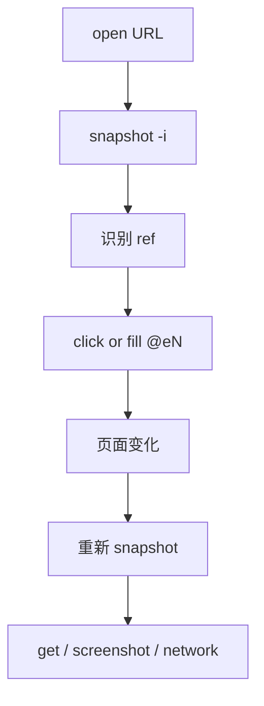

> **目标读者**：希望为 AI Agent、命令行工具或自动化流程补充浏览器能力的工程师。
> **核心问题**：让 Agent 直接在终端里"打开页面 -> 识别元素 -> 执行动作 -> 取回结果"，不必先写一层完整 SDK 代码——`agent-browser` 能否缩短这条路径？
> **事实边界**：本文基于 `vercel-labs/agent-browser` 仓库 README 与公开 CLI 帮助信息整理；未公开的内部实现、未验证的性能数字和未出现于官方文档的命令不写成事实。

## 阅读导航

### 完整目录

- §1 定位与适用场景
  - §1.1 它是什么
  - §1.2 为什么它对 AI Agent 友好
  - §1.3 什么时候适合选它
  - §1.4 和 Playwright 的关系
- §2 核心工作流
  - §2.1 推荐模式：`snapshot + ref`
  - §2.2 一个最小可运行示例
  - §2.3 `ref` 与传统选择器的取舍
- §3 快速开始
  - §3.1 安装
  - §3.2 最小验证
  - §3.3 第一个 Agent 友好流程
- §4 核心命令地图
  - §4.1 导航与页面生命周期
  - §4.2 交互命令
  - §4.3 获取页面信息
  - §4.4 语义化查找与状态检查
  - §4.5 批量执行
- §5 会话、认证与安全
  - §5.1 会话隔离
  - §5.2 认证状态复用
  - §5.3 连接已有 Chrome
  - §5.4 面向 Agent 的安全控制
- §6 调试与观测
  - §6.1 先看页面，再看命令
  - §6.2 网络与错误观察
  - §6.3 Trace、Profiler 与 Dashboard
- §7 两个实战示例
  - §7.1 场景一：登录后提取仪表盘标题
  - §7.2 场景二：批量执行固定浏览动作
- §8 常见问题
- §9 结论与进阶路径
  - §9.1 一句话结论
  - §9.2 选型建议
  - §9.3 进阶路径

## §1 定位与适用场景

### 1.1 它是什么

`agent-browser` 是一个用 Rust 编写的浏览器自动化 CLI（命令行接口），面向 Agent 工作流设计。命令行是它的统一入口：终端里连续执行 `open`、`snapshot`、`click`、`fill`、`wait`、`get` 等命令，浏览器状态由后台 daemon 进程持续复用。

它采用客户端 + daemon 两段式架构：Rust CLI 负责解析命令，后台 daemon 直接走 CDP（Chrome DevTools Protocol，Chrome 开发者工具协议）驱动浏览器，不依赖 Node.js 运行时。浏览器实例由 daemon 在后台持续持有，多次命令之间复用同一进程，省去反复启动的开销。

AI Agent 任务往往不需要先搭测试项目，也不必围绕 SDK 写胶水代码。Agent 拿到任务后，通常会走这几步：打开页面、获取结构化快照、依据快照里的元素引用执行动作、在页面变化后重新获取快照、最后产出截图或文本信息。除了这套"开浏览器"的路径，它还提供 `read` 命令直接抓取网页正文，以及 `mcp` 命令对外暴露 MCP（Model Context Protocol）服务，两条路都不需要先写代码。

### 1.2 为什么它对 AI Agent 友好

官方的设计取向体现在这些方面：

| 设计点 | 对 Agent 的意义 |
| ------ | ------ |
| 原生命令行接口 | Agent 直接拼装和调用命令，不必先进入 SDK 运行时 |
| `snapshot` 输出元素引用 | Agent 围绕 `@e1`、`@e2` 这类稳定引用操作，降低脆弱选择器带来的误点风险 |
| 后台 daemon 持续复用浏览器 | 多次命令之间不必每一步都重新拉起浏览器 |
| `batch` 批量执行 | 多步流程合并成一次调用，降低进程往返开销 |
| 会话、状态、安全开关较完整 | 能支撑真实任务，不只是 demo 级别 |
| `chat`、dashboard、streaming 等能力 | 便于把 CLI 工作流延伸到可视化调试或 AI 辅助交互 |

### 1.3 什么时候适合选它

| 场景 | 是否适合 | 原因 |
| ------ | ------ | ------ |
| 让 AI Agent 在终端里访问网页并完成交互 | 很适合 | 命令模型直接，`snapshot + ref` 非常契合 LLM（大语言模型）决策 |
| 快速做页面巡检、截图、抓文本、检查网络请求 | 很适合 | 不必先搭测试框架 |
| 在 CI 或 Serverless 环境跑浏览器任务 | 适合 | 支持本地浏览器、CDP（Chrome DevTools Protocol，Chrome 开发者工具协议）连接和多种云浏览器 provider |
| 编写大型端到端测试套件 | 视情况而定 | 需要复杂断言、fixture、报告体系时，SDK 型方案通常更稳 |
| 做重度 DOM（文档对象模型）断言和应用级测试组织 | 不太适合单独承担 | CLI 擅长操作与提取，完整测试框架仍需 SDK 承担 |

### 1.4 和 Playwright 的关系

两者定位不同：

- 想让 Agent 以最少上下文接管浏览器，`agent-browser` 更直接
- 想构建工程化测试系统，Playwright 一类 SDK 更成熟
- 两者可以共存：前者偏 Agent 操作层，后者偏测试与应用代码层

## §2 核心工作流

### 2.1 推荐模式：`snapshot + ref`

官方文档反复强调一条建议：面向 AI 的最优路径是先获取页面快照，再用快照里的引用操作元素。直接写复杂选择器容易踩坑——类名会变，DOM 层级会变，临时拼出来的选择器在页面重渲染后可能直接失效。


```mermaid
graph TD
    A[open URL] --> B[snapshot -i]
    B --> C[识别 ref]
    C --> D[click or fill @eN]
    D --> E[页面变化]
    E --> F[重新 snapshot]
    F --> G[get / screenshot / network]
```

这套模式比直接堆 CSS 选择器更可靠：`ref` 是快照上下文里的确定性引用，不会因为页面重渲染而漂移。识别元素和执行动作被拆成两步，Agent 先观察再行动；页面变化后重新快照，引用始终对应当前 DOM。临时猜出来的 CSS 选择器在重渲染后往往直接失效，`ref` 把这个不确定性消掉了。

一个常见的失败形态：目标被别的元素盖住，比如同意横幅或弹窗。此时 `click` 会提前失败，报错里会带上遮挡元素（例如 `covered by <div#consent-banner>`）。处理办法是先关掉遮挡元素，重新 `snapshot`，再用新的 ref 重试——不要硬点旧 ref。

### 2.2 一个最小可运行示例

```bash
# 1. 打开页面。
agent-browser open https://example.com

# 2. 获取交互元素快照，输出里会出现 @e1、@e2 之类的引用。
agent-browser snapshot -i

# 3. 根据快照选择元素并执行动作。
agent-browser click @e2
agent-browser fill @e3 "test@example.com"

# 4. 获取结果或保留证据。
agent-browser get title
agent-browser screenshot ./example.png

# 5. 关闭当前浏览器会话。
agent-browser close
```

这五步覆盖了完整工作流。§3.2 是更简短的安装验证流程，两者侧重不同。

### 2.3 `ref` 与传统选择器的取舍

| 方式 | 适合场景 | 说明 |
| ------ | ------ | ------ |
| `@e2` 这类 ref | Agent 自动化首选 | 来自 `snapshot` 输出，最适合 LLM 决策 |
| CSS 选择器 | 已知稳定 DOM 结构 | 如 `"#submit"`、`".item > a"` |
| `find role`、`find text` | 语义化定位 | 对可访问性良好的页面尤其有效 |
| XPath（XML 路径语言）/ `text=` | 兼容性补位 | 可用，官方 Agent 工作流里优先级较低 |

## §3 快速开始

### 3.1 安装

#### 全局安装（官方推荐）

```bash
npm install -g agent-browser
agent-browser install
```

#### Homebrew 安装（macOS）

```bash
brew install agent-browser
agent-browser install
```

#### Cargo 安装（Rust 环境）

```bash
cargo install agent-browser
agent-browser install
```

#### 从源码构建

需要 Node.js 24+、pnpm 11+ 和 Rust：

```bash
git clone https://github.com/vercel-labs/agent-browser.git
cd agent-browser
pnpm install
pnpm build
pnpm build:native
pnpm link --global
agent-browser install
```

`agent-browser install` 这一步不能省。它会下载 Chrome for Testing；如果系统里已经存在 Chrome、Brave、Playwright 或 Puppeteer 相关浏览器，也会尝试自动检测。安装 CLI 和准备浏览器是两步，只做前一步会导致后续命令找不到浏览器。

三个维护命令值得知道：

- `agent-browser upgrade`：检测安装方式（npm / Homebrew / Cargo）并自动升级
- `agent-browser install --with-deps`：Linux 下补装系统依赖，装不全会以非零码退出
- `agent-browser doctor`：体检环境、Chrome 安装、daemon 状态、配置、加密密钥与网络可达性，并做一次真实的无头启动测试；`--fix` 会执行破坏性修复（重装 Chrome、清理旧状态等），`--json` 输出给 Agent 解析

### 3.2 最小验证

```bash
agent-browser open https://example.com
agent-browser wait --load networkidle
agent-browser snapshot -i
agent-browser close
```

这四条命令能跑通，说明 CLI、浏览器与后台通信链路基本正常。失败时回到 §3.1 检查 `agent-browser install` 是否执行过。

### 3.3 第一个 Agent 友好流程

```bash
agent-browser open https://news.ycombinator.com
agent-browser snapshot -i --urls
agent-browser find role link click --name "new"
agent-browser wait --load networkidle
agent-browser screenshot ./hn-new.png
```

先 `snapshot -i --urls` 把页面可交互元素和 URL 摸清楚，再通过 `find role` 这样的语义化命令执行动作，减少硬编码选择器。

## §4 核心命令地图

### 4.1 导航与页面生命周期

| 命令 | 作用 | 示例 |
| ------ | ------ | ------ |
| `open <url>` | 打开页面 | `agent-browser open https://example.com` |
| `back` / `forward` / `reload` | 导航控制 | `agent-browser reload` |
| `close` | 关闭当前浏览器 | `agent-browser close` |
| `close --all` | 关闭所有活动会话 | `agent-browser close --all` |
| `wait` | 等待元素、文本、URL 或加载状态 | `agent-browser wait --load networkidle` |

优先掌握 `wait`。页面还没稳定就开始操作是最常见的失败原因——Agent 拿到的快照里元素还没出现，后续 `click` 或 `fill` 自然落空。显式等待是降低这类误操作的主要手段。

### 4.2 交互命令

| 命令 | 作用 | 示例 |
| ------ | ------ | ------ |
| `click <sel>` | 点击元素 | `agent-browser click @e2` |
| `dblclick <sel>` | 双击元素 | `agent-browser dblclick ".card"` |
| `hover <sel>` | 悬停元素 | `agent-browser hover @e5` |
| `focus <sel>` | 聚焦元素 | `agent-browser focus @e3` |
| `type <sel> <text>` | 模拟键入 | `agent-browser type @e3 "hello"` |
| `fill <sel> <text>` | 清空后填入 | `agent-browser fill @e3 "user@example.com"` |
| `press <key>` | 发送按键 | `agent-browser press Enter` |
| `keyboard type <text>` | 用真实按键输入（不限选择器） | `agent-browser keyboard type "hello"` |
| `keyboard inserttext <text>` | 不触发按键事件插入文本 | `agent-browser keyboard inserttext "hello"` |
| `select <sel> <val>` | 选择下拉项 | `agent-browser select @e4 beijing` |
| `check` / `uncheck` | 复选框状态控制 | `agent-browser check @e6` |
| `scroll <dir> [px]` | 滚动页面 | `agent-browser scroll down 300` |
| `scrollintoview <sel>` | 把元素滚进视口 | `agent-browser scrollintoview @e5` |
| `upload <sel> <files>` | 上传文件 | `agent-browser upload @e7 ./report.pdf` |
| `drag <src> <tgt>` | 拖拽元素 | `agent-browser drag @e8 @e9` |

`click` 支持 `--new-tab` 在新标签页打开链接；`focus` 适合先聚焦再输入的场景。`keyboard type` 和 `type` 的区别在于前者不绑定选择器，作用于当前焦点，适合先 `click` 或 `focus` 再输入的流程。

`type` 和 `fill` 的区别：

- `type` 更接近真实按键输入，会触发 keydown、keyup 等事件
- `fill` 直接把输入框的值改成目标值，跳过逐键输入

测试输入法、快捷键或前端键盘事件时优先用 `type`；只是想稳定填值时优先用 `fill`，后者更快，也更不容易触发前端校验异常。

### 4.3 获取页面信息

| 命令 | 作用 | 示例 |
| ------ | ------ | ------ |
| `snapshot` | 获取可访问性树与引用 | `agent-browser snapshot -i --json` |
| `get text <sel>` | 取文本 | `agent-browser get text @e1` |
| `get html <sel>` | 取 HTML | `agent-browser get html "#main"` |
| `get value <sel>` | 取输入框值 | `agent-browser get value @e3` |
| `get attr <sel> <attr>` | 取属性 | `agent-browser get attr @e3 href` |
| `get count <sel>` | 统计匹配元素数 | `agent-browser get count ".item"` |
| `get box <sel>` | 取元素包围盒 | `agent-browser get box @e2` |
| `get styles <sel>` | 取计算样式 | `agent-browser get styles @e2` |
| `get title` | 取标题 | `agent-browser get title` |
| `get url` | 取当前 URL | `agent-browser get url` |
| `get cdp-url` | 取 CDP WebSocket 地址 | `agent-browser get cdp-url` |
| `screenshot [path]` | 截图 | `agent-browser screenshot ./page.png` |
| `pdf <path>` | 导出 PDF | `agent-browser pdf ./page.pdf` |

给 LLM 用时，`snapshot --json` 输出结构化数据，适合文本推理；`screenshot --annotate` 在截图上标注元素 ref，适合视觉模型或人工复核页面布局。`--annotate` 截图之后 ref 会被缓存，可以直接继续用 `click @e2` 操作标注出来的元素，不用再跑一次 `snapshot`。截图还支持 `--full`（整页）、`--screenshot-dir`、`--screenshot-format jpeg` 和 `--screenshot-quality` 等参数。

### 4.4 语义化查找与状态检查

```bash
agent-browser find role button click --name "Submit"
agent-browser find text "Sign In" click
agent-browser find label "Email" fill "test@example.com"
agent-browser find placeholder "Search" type "agent-browser"
agent-browser find testid "submit-btn" click
agent-browser find first ".item" click
agent-browser find nth 2 "a" text
agent-browser is visible @e2
agent-browser is enabled @e2
agent-browser is checked @e6
```

`find` 的完整族包括 `role`、`text`、`label`、`placeholder`、`alt`、`title`、`testid`，以及按选择器取 `first`、`last`、`nth`。动作统一为 `click`、`fill`、`check`、`hover`、`text`。按 role 过滤可访问名时用 `--name`；要精确匹配（默认是不区分大小写的子串）用 `--exact`。隐式角色也可用：`<h2>` 就是 `heading`，`<ul>` 就是 `list`，顶层 `<header>` 就是 `banner`。

这些命令比直接写 CSS 更适合 Agent 的场景。业务页面不断迭代，类名和 DOM 层级会变，但按钮角色、可访问名称、标签文本往往稳定得多。语义定位让 Agent 接近"看懂页面再行动"，减少对脆弱选择器的依赖。

### 4.5 批量执行

```bash
# 参数模式：每个引号参数就是一条完整命令
agent-browser batch "open https://example.com" "snapshot -i" "screenshot"

# 加 --bail 遇到第一个错误就停
agent-browser batch --bail "open https://example.com" "click @e1" "screenshot"

# stdin 模式：按 JSON 数组喂入命令
echo '[
  ["open", "https://example.com"],
  ["wait", "--load", "networkidle"],
  ["snapshot", "-i"],
  ["screenshot", "result.png"]
]' | agent-browser batch --json
```

任务是多步固定流程时，`batch` 把多次往返压缩成一次调用。它适合：

- 已经确定步骤顺序的 Agent 子任务
- 需要减少命令调用开销的采集任务
- 希望统一处理失败停止逻辑的场景，例如 `batch --bail`

### 4.6 不启动浏览器抓取正文：`read`

只想拿正文、不想开浏览器时，用 `read`：

```bash
agent-browser read https://example.com/article
agent-browser read https://example.com/article --filter overview   # 只保留含关键词的章节
agent-browser read https://example.com/article --outline          # 只输出标题大纲
agent-browser read https://docs.example.com --llms index --filter auth
agent-browser read https://example.com/article --json
agent-browser read                                                # 读当前活动标签页渲染后的 DOM
```

`read` 走 HTTP 直接抓取，不启动 Chrome，更快也更省资源。它默认带 `Accept: text/markdown` 请求，优先要 Markdown；拿不到就沿路径向上找最近的 `llms.txt` 定位文档链接，最后退回从 HTML 提取可读正文。`--require-md` 可以强制要求服务端返回 Markdown，`--raw` 直接打印响应原文。它同样受 `--allowed-domains`、`--content-boundaries`、`--max-output` 这些全局安全开关约束。

不带 URL 的 `read` 会读当前活动标签页的渲染结果，能拿到登录态和客户端渲染后的内容——这是无头 fetch 拿不到的东西。

## §5 会话、认证与安全

### 5.1 会话隔离

```bash
agent-browser --session agent1 open https://site-a.com
agent-browser --session agent2 open https://site-b.com
agent-browser session list
```

会话隔离让多个 Agent 或多个任务不会把 Cookie、导航历史和页面状态混到一起。并发自动化和多租户任务里，把它当作默认选项启用，避免状态串扰。

### 5.2 认证状态复用

Agent Browser 提供多种状态复用方式，最常用的几类：

| 方式 | 适用场景 | 示例 |
| ------ | ------ | ------ |
| `--profile <name 或 path>` | 复用 Chrome 现有登录态或持久目录 | `agent-browser --profile Default open https://gmail.com` |
| `--session <id> --restore` | 自动保存和恢复会话状态 | `agent-browser --session myapp --restore open https://app.example.com` |
| `state save/load` | 显式导出与回放状态 | `agent-browser state save ./auth.json` |
| `auth save/login` | 本地加密存凭据并触发登录 | `echo "pass" | agent-browser auth save github --url https://github.com/login --username user --password-stdin` |

策略选错会导致登录态丢失或状态污染。按场景选：

- 临时复用自己的浏览器登录态，`--profile` 上手最快
- 脚本多次执行后都自动保留状态，`--session <id> --restore` 更省心
- 需要把状态在不同机器、任务间转移，`state save/load` 更可控

### 5.3 连接已有 Chrome

```bash
agent-browser connect 9222
agent-browser snapshot -i
```

`connect <port>` 接管已经开启远程调试端口的 Chrome 实例。这在两类场景中常用：

- 接管已经登录好的浏览器，省去重新登录
- 连接远程 CDP 端点，不在本地新开实例

安全边界要注意：远程调试端口意味着本机其他进程可能拿到完整浏览器控制权，只应在可信环境里使用。不想手动指定端口时，可用 `--auto-connect` 自动发现已开启远程调试的 Chrome。

### 5.4 面向 Agent 的安全控制

CLI 帮助信息里列出的安全开关，生产环境建议逐项确认（以 `agent-browser --help` 实际输出为准）：

| 选项 | 作用 |
| ------ | ------ |
| `--allowed-domains` | 限制只允许访问可信域名 |
| `--content-boundaries` | 给页面内容加边界标记，降低 LLM 把页面内容和系统输出混淆的风险 |
| `--confirm-actions` | 对 `eval`、下载等高风险动作要求确认 |
| `--action-policy` | 用策略文件限制敏感动作（如 CLI 帮助信息所示） |
| `--max-output` | 限制输出长度，防止页面内容淹没上下文（如 CLI 帮助信息所示） |

浏览器自动化里，命令失败通常留下报错堆栈，排查路径清晰；但命令成功但越界的情况更难防——Agent 误点删除按钮、误下载文件、误把页面内容当成系统指令执行。把 `agent-browser` 放进真实 Agent 系统前，上面这些开关需要逐项确认。

## §6 调试与观测

### 6.1 先看页面，再看命令

```bash
agent-browser screenshot --annotate ./page.png
agent-browser highlight @e2
agent-browser inspect
```

推荐顺序：

1. `snapshot -i` 看结构
2. `screenshot --annotate` 看视觉位置
3. `highlight` 或 `inspect` 核对目标元素

按这个顺序排查，能把问题归因到"定位错了"还是"页面没加载完"，避免在两处之间反复试错。

### 6.2 网络与错误观察

```bash
agent-browser network requests
agent-browser network requests --filter api
agent-browser network request <requestId>
agent-browser console
agent-browser errors
```

页面行为异常时，优先排查三件事：

- 接口有没有发出去
- 控制台有没有脚本错误
- 页面是不是因为权限、重定向或接口失败而停在错误状态

### 6.3 Trace、Profiler 与 Dashboard

```bash
agent-browser trace start
agent-browser trace stop ./trace.zip

agent-browser profiler start
agent-browser profiler stop ./profile.json

agent-browser dashboard start
```

Trace 文件可以发给同事复现问题；Profiler 数据用来定位哪一步耗时最长；Dashboard 适合实时观察 Agent 的操作。排查偶发问题、复盘错误路径、多人协作时都能用上。

## §7 两个实战示例

### 7.1 场景一：登录后提取仪表盘标题

```bash
#!/usr/bin/env bash
set -euo pipefail

# 打开登录页并等待页面稳定。
agent-browser open https://app.example.com/login
agent-browser wait --load networkidle

# 获取页面快照，确认输入框和按钮的 ref。
agent-browser snapshot -i

# 下面的 @e2、@e3、@e4 仅为示例，实际值以当前快照输出为准。
agent-browser fill @e2 "user@example.com"
agent-browser fill @e3 "$APP_PASSWORD"
agent-browser click @e4

# 登录后等待 URL 变化并抓取结果。
agent-browser wait --url "**/dashboard"
agent-browser get title
agent-browser screenshot ./dashboard.png
```

这个例子里容易踩坑的是最后一行等待：登录按钮点下去之后立刻取标题，拿到的往往还是旧页面。`wait --url` 确保浏览器已经跳转到仪表盘，`get title` 才会返回新页面的标题。

### 7.2 场景二：批量执行固定浏览动作

```bash
echo '[
  ["open", "https://example.com"],
  ["wait", "--load", "networkidle"],
  ["snapshot", "-i", "--json"],
  ["screenshot", "./example-home.png"],
  ["open", "https://example.com/docs"],
  ["wait", "--load", "networkidle"],
  ["screenshot", "./example-docs.png"]
]' | agent-browser batch --json
```

`batch` 适合步骤已知的流程。下一步要靠上一步的输出动态决策时，得回到单步命令，让 Agent 在每一步重新判断——`batch` 内部无法插入 LLM 推理。

## §8 常见问题

### 8.1 装好了 CLI，但浏览器起不来

优先检查三件事：

- 是否执行过 `agent-browser install`
- 本机是否存在可检测到的 Chrome、Brave 或相关浏览器
- 当前环境是否限制了浏览器启动权限

### 8.2 页面总是超时

先做最小化排查，再考虑改逻辑：

```bash
agent-browser open https://example.com
agent-browser wait --load networkidle
agent-browser snapshot -i
```

这里已经失败的话，问题多半不在业务操作，而在网络、浏览器或页面本身。官方 README 说明，标准操作的默认超时是 25000 ms，可通过 `AGENT_BROWSER_DEFAULT_TIMEOUT` 环境变量调整。注意别调过头：超过 30000 ms 时，CLI 的读取超时可能先于 daemon 返回而报 EAGAIN，CLI 会自动重试，但响应会变慢。调大超时能容忍慢页面，但也会让卡死的流程拖得更久，要结合实际页面响应时间权衡。

### 8.3 页面内容太长，把 Agent 上下文撑爆了

优先组合几种办法：

- `snapshot -i` 只看交互元素
- `snapshot -c` 移除空结构元素
- `snapshot -d 3` 限制深度
- `--max-output` 限制输出体积（如 CLI 帮助信息所示）
- `-s "#main"` 只查看局部区域

### 8.4 想接入 AI，对话式控制怎么开

CLI 本身提供 `chat` 命令和 dashboard 内置聊天面板，但前提是先配置 Vercel AI Gateway 相关环境变量，例如 `AI_GATEWAY_API_KEY`。若只是"让上层 Agent 调命令"，不必启用 `chat`，直接用 `snapshot + ref` 更可控——`chat` 适合人工调试或让 LLM 自主探索，不适合需要确定性执行的流程。

## §9 结论与进阶路径

### 9.1 一句话结论

要让 AI Agent 直接在终端里稳定操控浏览器，`agent-browser` 值得优先考虑。它把 LLM 最容易出错的"猜选择器"环节换成"读快照引用"——Agent 先 `snapshot` 拿到 `@e1`、`@e2` 这类稳定引用，再据此执行动作，页面变化后重新快照刷新认知。误操作的发生点从"选择器漂移"前移到了"是否在正确的快照上下文里操作"，排查起来也更容易。

### 9.2 选型建议

| 需求 | 更推荐的方向 |
| ------ | ------ |
| Agent 主导的网页操作 | `agent-browser` |
| 大型 E2E 测试工程 | Playwright / 其他测试框架 |
| 需要远程浏览器基础设施 | `agent-browser` + cloud provider |
| 需要强类型 SDK、fixture、断言组织 | SDK 方案更稳 |

### 9.3 进阶路径

按下面的顺序深入：

1. 先熟练 `open`、`snapshot -i`、`click`、`fill`、`wait`
2. 再补 `session`、`profile`、`state`、`auth`
3. 然后学习 `network`、`trace`、`console`、`errors`
4. 最后再引入 `chat`、dashboard、streaming 和云浏览器 provider

## 参考资料

- GitHub 仓库：https://github.com/vercel-labs/agent-browser（截至写作时有效）
- Chrome DevTools Protocol：https://chromedevtools.github.io/devtools-protocol/（截至写作时有效）

## 文档信息

- 难度：⭐⭐⭐⭐
- 类型：工具指南
- 更新日期：2026-08-08
- 预计阅读时间：16 分钟
- 前置知识：命令行基础、浏览器自动化基本概念、HTML 可访问性常识

## 资料口径说明

本文基于以下来源撰写，请读者注意时效性和局限性：

1. **官方文档**：本文主要基于 `vercel-labs/agent-browser` 仓库的 README 和公开 CLI 帮助信息整理。CLI 命令、参数和行为以 `agent-browser --help` 和实际运行结果为准。
2. **版本时效性**：本文撰写时的 CLI 命令和参数可能已更新，请以官方仓库的最新 README 和 `agent-browser --help` 输出为准。
3. **性能数据**：本文未提供具体的性能基准测试数据。实际性能因机器配置、网络状况、页面复杂度而异，请在真实环境中测试后获取基准数据。
4. **安全建议**：本文提供的安全控制建议（如 `--allowed-domains`、`--content-boundaries`、`--action-policy`）基于官方文档和常见安全实践，但具体安全策略应根据实际场景调整。
5. **兼容性**：`agent-browser` 依赖 Chrome DevTools Protocol (CDP)，需要本地安装 Chrome/Chromium。不同版本的 Chrome/Chromium 可能对某些 CDP 命令的支持有差异。
6. **事实边界**：本文未验证的性能数字、未出现于官方文档的命令、未公开的内部实现不写成事实。所有命令和参数均可在官方文档或 CLI 帮助信息中查证。