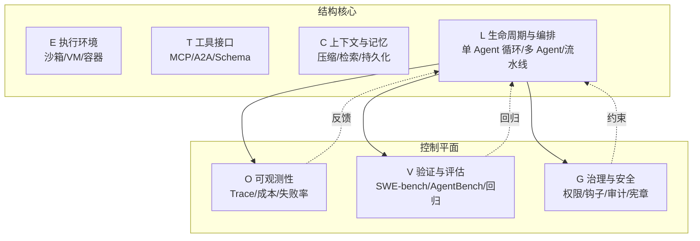

# Agent Harness Engineering：AI Agent 执行框架的系统化重构

2026 年 CMU、耶鲁、亚马逊的联合 Survey 给出了一个值得认真对待的判断：当模型本身已经强到能尝试长任务时，制约 Agent 上生产的瓶颈已经从模型下移到了包裹模型的执行框架——他们称之为 agent execution harness（执行框架或驾驭层）。论文把这套框架拆成 ETCLOVG 七层，并用 2022–2026 年的开源项目分布印证了一件事：行业把工程投入堆在 L 层（Lifecycle & Orchestration，生命周期与编排），而 C 层（Context & Memory，上下文与记忆）和 O 层（Observability & Operations，可观测性与运维）在开源侧明显偏薄。

论文全称 *Agent Harness Engineering: A Survey*，配套一个持续更新的开源项目目录 Awesome-Agent-Harness。本文按 ETCLOVG 的层次拆解这套框架，并补一个"编程 Agent 修 GitHub Issue"的任务流案例，把七层串起来。

---

## 三代演进：行业把工程投入投向哪里

论文把 2022–2026 年的 Agent 工程化分成三段，每段对应一个不同的瓶颈假设：

| 阶段 | 时间 | 优化对象 | 代表工作 | 隐含假设 |
|------|------|----------|----------|----------|
| Prompt Engineering | 2022–2024 | 单次调用的输入文本 | ReAct、早期 Tool Use | 模型是瓶颈，改 prompt 即改一切 |
| Context Engineering | 2025 | 每一步模型该看到什么 | 长程记忆、向量检索、语义压缩 | 上下文窗口和内容质量是瓶颈 |
| Harness Engineering | 2026– | 包裹模型的整个基础设施 | ETCLOVG 七层 | 框架层是瓶颈，决定能否上生产 |

三段在时间上互相重叠，描述的是边际投入流向。Prompt Engineering 阶段的 ReAct 模板在 2026 年依然在用，Context Engineering 的检索压缩也没有被 Harness Engineering 取代——后者只是把前两段无法解决的可靠性问题，下移到了框架层。

---

## ETCLOVG 七层：先看地图，再进细节

七层不是平铺的清单。论文自己就把它们分成两组：前四层（E/T/C/L）构成**结构核心**，决定 Agent 在哪跑、能调什么、看到什么、怎么组织控制流；后三层（O/V/G）构成**控制平面**，决定跑得怎么样、对不对、该不该让它跑。

七层之间不是单向调用。L 层的编排循环会同时被 O 层观测、V 层评估、G 层约束，而 O/V/G 的输出又回流到 L 层影响下一步决策。这种耦合是后面 Harness Coupling Problem 的根源。

---

## 七层逐层拆解

### E – Execution Environment（执行环境）

Agent 代码跑在哪里、受什么沙箱约束。具体形态包括托管沙箱、微虚拟机（如 Firecracker）、代码专用运行时、计算机使用环境、浏览器沙箱、操作系统权限模型。

设计轴只有一条：安全与灵活性的权衡。沙箱太严，Agent 改不了一个配置文件；太松，Prompt Injection（提示注入）和 Goal Misalignment（目标错位）就有可乘之机。论文没有给出"该选哪种沙箱"的判断，只列出了选项和各自的代价——这本身也反映了 E 层在 2026 年还没有形成共识。

### T – Tool Interface & Protocol（工具接口与协议）

外部能力如何被描述、发现和调用。MCP（Model Context Protocol，模型上下文协议）在 2025–2026 年快速成为事实标准，Anthropic 的插件生态和 OpenAI 的工具调用体系都在向协议层收敛；A2A（Agent-to-Agent）则处理 Agent 之间的互调。

T 层的关键不在协议本身，而在工具 Schema 的描述质量。一个描述模糊的工具，模型要么不敢调，要么调错参数；一个描述过细的工具，又会挤占上下文窗口。这是 T 层和 C 层的耦合点。

### C – Context & Memory Management（上下文与记忆管理）

模型在短时、会话级和持久化三个层面看到什么。技术形态包括长期上下文、上下文漂移缓解、状态持久化与恢复。

C 层在论文的生态统计中只有 9 个主项目，是七层里最薄的。原因不是这一层不重要，而是上下文和记忆通常嵌入在 L 层的框架内部（如 LangGraph 的 state、AutoGen 的 memory），很少作为独立组件发布。这也意味着 C 层的工程实践高度碎片化，每个框架都有自己的 state schema，互不兼容。

### L – Lifecycle & Orchestration（生命周期与编排）

控制流组织，从单 Agent 内部循环，到多 Agent 模式，再到完整的 Issue → Pull Request 流水线。47 个主项目，是七层里最拥挤的地带——基本上每个想做"AI Native 开发框架"的团队都在 L 层有投入。

L 层的密集也带来了一个问题：编排抽象的同质化。AutoGPT 时代的单 Agent 循环、CAMEL/ChatDev/MetaGPT 的多 Agent 角色、2025–2026 年的复杂任务编排系统，本质上都在回答"谁来调谁、什么时候停、失败怎么办"，但接口设计各不相同，迁移成本很高。

### O – Observability & Operations（可观测性与运维）

捕获 Trace、成本、失败率和可靠性信号。形态包括 Trace 平台、Agent 专用运维工具、成本追踪、统一可观测性。

O 层和 G 层在开源生态中都相对薄（15 个和 14 个主项目），更多出现在商业平台和 SDK 功能里。论文的解读是：运维控制比运行时和基准测试基础设施成熟得更晚——团队通常先跑起来再考虑观测，而观测做起来后才会认真对待治理。

### V – Verification & Evaluation（验证与评估）

把任务和 Trace 转化为评估、失败归因和回归反馈。SWE-bench、AgentBench、WebArena、GAIA 等评测体系在这一层。21 个主项目，数量仅次于 L 层。

V 层的项目规模说明行业已经认可"评估基础设施"是 Agent 工程化的必要投入，但这里有个容易被忽略的边界：这些 benchmark 测的是模型 + 框架的联合表现，不是框架本身。同一个 SWE-bench 分数，可能来自更强的模型，也可能来自更聪明的上下文压缩——单看分数推不出框架质量。

### G – Governance & Security（治理与安全）

在模型级、系统级和组织级施加行为约束。形态包括权限模型、生命周期钩子、组件加固、声明式宪章、审计基础设施。

G 层和 O 层形成对照：O 层回答"系统跑得怎么样"，G 层回答"系统是否在做它应该做的事"。G 层的薄反映了一个现实——大多数团队在 2026 年还在解决"能不能跑起来"的问题，"该不该让它跑"是更靠后的工程阶段才会认真对待的。

---

## 任务如何流过七层：一次 Agent 修 GitHub Issue

抽象的七层结构需要一次具体任务来串起来。假设有一个编程 Agent 接到任务：修复仓库 `example/repo` 的 Issue #42，该 Issue 报告 `parse_config` 在空文件上崩溃。

1. **E 层**：编排器拉起一个 Firecracker 微虚拟机，挂载仓库快照，限定网络只能访问 GitHub API 和 PyPI，文件系统写权限限定在工作目录。Agent 代码在这个 VM 里跑。
2. **T 层**：Agent 通过 MCP 协议发现可用工具——`read_file`、`write_file`、`run_tests`、`create_pull_request`。每个工具的 Schema 描述了参数类型、返回格式、副作用。
3. **C 层**：Agent 读 Issue 描述、读 `parse_config` 源码、跑一次复现，把这些信息塞进上下文。当上下文接近窗口上限时，C 层的压缩策略决定保留哪些 Trace、丢弃哪些中间输出。
4. **L 层**：Agent 进入"读代码 → 假设 → 改代码 → 跑测试"的循环。如果测试失败，L 层决定是回滚、重试，还是把失败信息回灌给模型重新推理。
5. **O 层**：每一步的 Token 消耗、工具调用延迟、失败率都被 Trace 平台记录。如果某次 `run_tests` 跑了 30 秒，O 层的 Trace 会显示是哪几个测试慢。
6. **V 层**：Agent 改完代码后，V 层的回归套件跑一遍 SWE-bench 风格的验证——不只是跑当前 Issue 的复现测试，还要跑相关模块的回归，确认没有引入新问题。
7. **G 层**：在 `create_pull_request` 之前，G 层的钩子检查改动是否触及 `security/` 目录、是否修改了 CI 配置、是否需要人工审批。如果触发规则，PR 会被标记为 `needs-review` 而不是直接合并。

这个案例里，七层同时在场：L 层的每一步循环都被 O 层观测、受 G 层约束、由 C 层喂上下文、用 T 层的工具、在 E 层的环境里跑、最后被 V 层验证。任何一层的局部优化都可能破坏其他层——这就是 Harness Coupling Problem 的具体含义。

---

## 开源生态分布：测的是什么，反映哪部分

论文维护的 Awesome-Agent-Harness 目录用公开文档（README、文档、论文、示例、Release Notes）对每个项目做 ETCLOVG 编码。主项目数量分布：

| 层 | 范围 | 主项目数 |
|---|------|---------:|
| E | Execution Environment & Sandbox | 20 |
| T | Tool Interface & Protocol | 12 |
| C | Context & Memory Management | 9 |
| L | Lifecycle & Orchestration | 47 |
| O | Observability & Operations | 15 |
| V | Verification & Evaluation | 21 |
| G | Governance & Security | 14 |

**这个分布测的是什么**：开源社区在 ETCLOVG 各层的项目级投入。一个项目被计入某层，意味着它在该层有可识别的独立功能，而不是把该层作为内部实现细节。

**反映哪部分**：L 层（47 个）和 V 层（21 个）的密集，反映"编排"和"评估"是开源侧竞争最激烈的两层；C 层（9 个）和 O/G 层（15/14 个）的薄，反映这些能力更多嵌入在更大的框架里或被商业化承接。

**不能推出什么**：

- 不能推出"L 层技术最成熟"——项目多可能只是因为门槛低、同质化严重。
- 不能推出"C 层不重要"——C 层项目少是因为它通常不作为独立组件发布。
- 不能推出"商业平台在 O/G 层更强"——这个分布只统计开源项目，商业平台的内部能力没有被纳入。

论文作者也明确承认这个局限：编码依赖公开文档，商业平台和内部系统的实际能力不在统计范围内。

从 Agent Frameworks 到 Agent Platforms 的转变是这个阶段的另一条线索：前者提供本地抽象（Agent、Tools、Memory、Execution Loop），后者提供持久化工作空间、身份、可观测性、评估、治理和跨多次运行多用户的人工交接。这条转变路径解释了为什么 O 层和 G 层在开源侧偏薄——它们更自然地属于 Platform 层，而不是 Framework 层。

---

## 五个开放问题

论文末尾提出五个横跨 ETCLOVG 各层的问题，每一个都不是单一层次能回答的：

### 1. 执行环境的加固与规模化

- Prompt Injection、Goal Misalignment、组合放大的通用安全评测标准
- 成本模型：在容器、微 VM、OS 权限边界、完整桌面 VM、浏览器环境之间如何决策
- 可移植性：自托管、云和混合部署之间的语义一致性

### 2. 长运行 Agent 的可靠状态管理

上下文管理需要被重新定义为状态估计问题：

- 每次压缩、检索或遗忘操作带来了什么信息损失
- 如何增加溯源、矛盾处理和显式陈旧标记
- 如何从持久化产物而非压缩历史中恢复

### 3. Trace 原生故障诊断

Trace 应该成为系统计算结果分数、轨迹质量、失败归因和回归测试的主要对象，而非仅作为事后调试材料。当前可观测性采纳广泛但离线评估少见，这个差距是具体切入点。

### 4. Agent、工具和人之间的标准化交接

交接内容需要超越文本摘要，覆盖意图、约束、权限、产物、溯源、预算状态、风险级别、Trace 历史和未解决决策。协议设计要在两个方向上找平衡：足够丰富才能支持安全和恢复，足够简单才能被广泛采纳。

### 5. 模型改进时的自适应简化

每个 wrapper 都编码了关于"模型无法可靠独立完成什么"的假设。随着模型能力提升，某些干预是"承载结构"（必须保留），另一些则变成了成本、延迟或运维开销。未来的 Harness 需要机制能够根据联合的质量、延迟、成本和风险约束进行自我削减和优化。

---

## 该怎么用这篇 Survey

### 如果你在评估或选型 Agent 框架

把 ETCLOVG 当成检查清单，逐层问：

- **E 层**：框架默认的执行环境是什么？换沙箱的代价多大？
- **T 层**：工具协议是 MCP 还是私有协议？工具 Schema 谁来维护？
- **C 层**：上下文压缩策略是什么？state schema 能不能导出？
- **L 层**：编排抽象是单 Agent 循环、多 Agent 还是流水线？迁移到另一个框架要改多少代码？
- **O 层**：Trace 能不能导出到外部系统？成本追踪粒度到不到单次工具调用？
- **V 层**：有没有内置的回归套件？能不能接 SWE-bench 风格的评测？
- **G 层**：权限模型是声明式还是代码式？有没有审计日志？

### 如果你在构建 Agent 系统

采用顺序建议：先 E 和 T，再 L 和 C，最后 O、V、G。E 和 T 决定系统能不能跑起来；L 和 C 决定能不能跑长任务；O、V、G 决定能不能上生产。跳过 O/V/G 直接上生产，是 2025–2026 年大多数 Agent 事故的常见路径。

### 哪类团队先上，哪类团队等等

- **先上**：已经有内部工具调用基础设施、有 SWE-bench 风格评测需求的团队；处理长任务（>10 步）的编程 Agent 团队。
- **可以等等**：只做单轮工具调用的团队——Prompt Engineering + 简单 T 层就够；上下文窗口完全够用的短任务场景——C 层投入可以延后。

### Survey 本身的局限

论文是 Survey 而非 Benchmark，它整理了生态但没有给出"哪个框架最好"的判断。七层的边界在不同框架中的划分方式也存在模糊地带（比如某些项目同时跨越 L 和 V 层）。开源项目编码依赖公开文档，商业平台和内部系统的实际能力没有被纳入统计——这个局限作者在论文中也明确承认。

---

## 参考链接

- 论文主页：https://picrew.github.io/LLM-Harness/
- PDF：https://picrew.github.io/LLM-Harness/main.pdf
- 开源项目目录：https://github.com/Picrew/awesome-agent-harness
- HuggingFace 数据集：https://huggingface.co/datasets/ChenLiu1996/Agent-Harness-Engineering
- OpenReview：https://openreview.net/forum?id=eONq7FdiHa
