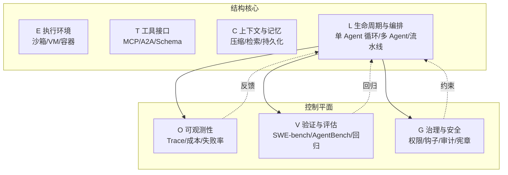

# Agent Harness Engineering：AI Agent 执行框架的系统化重构

2026 年 CMU、耶鲁等机构与亚马逊的联合 Survey 给出了一个值得认真对待的判断：当模型本身已经强到能尝试长任务时，制约 Agent 上生产的瓶颈已经从模型下移到了包裹模型的执行框架——他们称之为 agent execution harness（执行框架或驾驭层）。论文把这套框架拆成 ETCLOVG 七层，并用 2022–2026 年的开源项目分布印证了一件事：行业把工程投入堆在 L 层（Lifecycle & Orchestration，生命周期与编排），而 C 层（Context & Memory，上下文与记忆）和 O 层（Observability & Operations，可观测性与运维）在开源侧明显偏薄。

论文全称 *Agent Harness Engineering: A Survey*，由 CMU、耶鲁、JHU、NEU、Tulane、UAB、OSU、Virginia Tech 与 Amazon 联合团队发布，配套一个持续更新的开源项目目录 Awesome-Agent-Harness。论文于 2026 年 5 月 14 日在 OpenReview 发布（ID: eONq7FdiHa），最后一次修改为 2026 年 5 月 15 日。论文正式标题为 Agent Harness Engineering，项目页面 picrew.github.io/LLM-Harness/ 沿用早期命名 LLM-Harness，两者指向同一工作。venue/submission 状态以 OpenReview 页面为准。

按 ETCLOVG 的层次拆解这套框架，并补一个"编程 Agent 修 GitHub Issue"的任务流案例，把七层串起来。

## 学习目标

读完这篇笔记，应该能够：

- 说出 ETCLOVG 七层各自解决的工程问题，以及前四层与后三层的分组依据
- 把一个真实 Agent 任务（如修 GitHub Issue）映射到七层结构，指出每层的具体职责
- 根据团队需求（短任务 vs 长任务、内部工具 vs 上生产）选出先做哪一层
- 识别 Survey 的三个主要局限：开源编码偏倚、L 层同质化、O/G 层商业化承接
- 在选型或构建时，避开 E 层选错、C 层嵌入陷阱、O 层缺位等典型故障模式

## 目录

1. [三代演进：行业把工程投入投向哪里](#三代演进行业把工程投入投向哪里)
2. [ETCLOVG 七层：先看地图，再进细节](#etclovg-七层先看地图再进细节)
3. [七层逐层拆解](#七层逐层拆解)
4. [任务如何流过七层：一次 Agent 修 GitHub Issue](#任务如何流过七层一次-agent-修-github-issue)
5. [开源生态分布：测的是什么，反映哪部分](#开源生态分布测的是什么反映哪部分)
6. [五个开放问题](#五个开放问题)
7. [该怎么用这篇 Survey](#该怎么用这篇-survey)
8. [自测清单](#自测清单)
9. [参考链接](#参考链接)

---

## 三代演进：行业把工程投入投向哪里

论文把 2022–2026 年的 Agent 工程化分成三段，每段对应一个不同的瓶颈假设：

| 阶段 | 时间 | 优化对象 | 代表工作 | 隐含假设 |
|------|------|----------|----------|----------|
| Prompt Engineering | 2022–2024 | 单次调用的输入文本 | ReAct、早期 Tool Use | 模型是瓶颈，改 prompt 即改一切 |
| Context Engineering | 2025 | 每一步模型该看到什么 | 长程记忆、向量检索、语义压缩 | 上下文窗口和内容质量是瓶颈 |
| Harness Engineering | 2026– | 包裹模型的整个基础设施 | ETCLOVG 七层 | 框架层是瓶颈，决定能否上生产 |

三段在时间上互相重叠，描述的是边际投入流向。Prompt Engineering 阶段的 ReAct 模板在 2026 年依然在用，Context Engineering 的检索压缩也没有被 Harness Engineering 取代——后者只是把前两段无法解决的可靠性问题，下移到了框架层。

---

## ETCLOVG 七层：先看地图，再进细节

七层不是平铺的清单。论文自己就把它们分成两组：前四层（E/T/C/L）构成**结构核心**，决定 Agent 在哪跑、能调什么、看到什么、怎么组织控制流；后三层（O/V/G）构成**控制平面**，决定跑得怎么样、对不对、该不该让它跑。

七层之间不是单向调用。L 层的编排循环会同时被 O 层观测、V 层评估、G 层约束，而 O/V/G 的输出又回流到 L 层影响下一步决策。这种耦合是后面 Harness Coupling Problem 的根源。

---

## 七层逐层拆解

### E – Execution Environment（执行环境）

Agent 代码跑在哪里、受什么沙箱约束。具体形态包括托管沙箱、微虚拟机（如 Firecracker）、代码专用运行时、计算机使用环境、浏览器沙箱、操作系统权限模型。

设计轴只有一条：安全与灵活性的权衡。沙箱太严，Agent 改不了一个配置文件；太松，Prompt Injection（提示注入）和 Goal Misalignment（目标错位）就有可乘之机。论文没有给出"该选哪种沙箱"的判断，只列出了选项和各自的代价——E 层在 2026 年还没有形成共识。

### T – Tool Interface & Protocol（工具接口与协议）

外部能力如何被描述、发现和调用。MCP（Model Context Protocol，模型上下文协议）在 2025–2026 年快速成为事实标准，Anthropic 的插件生态和 OpenAI 的工具调用体系都在向协议层收敛；A2A（Agent-to-Agent）则处理 Agent 之间的互调。

T 层真正决定成败的是工具 Schema 的描述质量。协议本身只是载体，描述质量才决定模型能不能正确调用工具。一个描述模糊的工具，模型要么不敢调，要么调错参数；一个描述过细的工具，又会挤占上下文窗口。这是 T 层和 C 层的耦合点。

### C – Context & Memory Management（上下文与记忆管理）

C 层在论文的生态统计中只有 9 个主项目，是七层里最薄的。原因在于上下文和记忆通常嵌入在 L 层的框架内部（如 LangGraph 的 state、AutoGen 的 memory），很少作为独立组件发布。技术形态上，模型在短时、会话级和持久化三个层面看到什么，对应长期上下文、上下文漂移缓解、状态持久化与恢复三类技术。

嵌入的后果是 C 层实践高度碎片化，每个框架都有自己的 state schema，互不兼容。换框架等于重写状态层——这是 2026 年 Agent 系统迁移成本居高不下的主要原因之一。

### L – Lifecycle & Orchestration（生命周期与编排）

47 个主项目，是七层里最拥挤的地带。把 L 层的演化拉一条时间线对比着看会更清楚：

- **2023 年前后（AutoGPT 时代）**：单 Agent 循环，"思考-行动-观察"三段式，抽象简单但失败率高。
- **2024 年（CAMEL/ChatDev/MetaGPT）**：多 Agent 角色分工，用"角色扮演"模拟团队协作，复杂度上去了，但调试困难。
- **2025–2026 年（LangGraph/AutoGen v0.4 等）**：显式状态机 + 流水线，把控制流从隐式 prompt 约定搬到代码里。

三种抽象都在回答"谁来调谁、什么时候停、失败怎么办"，但接口设计各不相同。想做"AI Native 开发框架"的团队几乎都在 L 层有投入，这也带来了编排抽象的同质化——迁移成本很高，因为每家的 state、edge、condition 概念都不一样。

### O – Observability & Operations（可观测性与运维）

考虑一个真实场景：Agent 跑了 30 秒的 `run_tests`，但没人知道是哪几个测试慢、是不是卡在网络拉依赖。这是 O 层缺位的典型症状。O 层要捕获的信号包括 Trace、成本、失败率和可靠性，形态上分 Trace 平台、Agent 专用运维工具、成本追踪、统一可观测性四类。

O 层在开源生态中只有 15 个主项目，更多出现在商业平台和 SDK 功能里。原因很直接：团队通常先跑起来再考虑观测。但"先跑起来"的代价是，等事故发生时往往没有 Trace 可查——这是 2025–2026 年 Agent 事故复盘时最常见的痛点。

### V – Verification & Evaluation（验证与评估）

V 层有 21 个主项目，数量仅次于 L 层。SWE-bench、AgentBench、WebArena、GAIA 等评测体系都在这一层。但有一个边界问题容易被忽略：这些 benchmark 测的是模型 + 框架的联合表现，而非框架本身。同一个 SWE-bench 分数，可能来自更强的模型，也可能来自更聪明的上下文压缩——单看分数推不出框架质量。V 层的工程价值因此落在建立可归因的回归反馈上——哪次改动让哪个子任务的通过率掉了，是模型问题还是框架问题。论文也指出，当前可观测性采纳广泛但离线评估少见，这个差距是 V 层的具体切入点。

### G – Governance & Security（治理与安全）

G 层和 O 层形成对照：O 层回答"系统跑得怎么样"，G 层回答"系统是否在做它应该做的事"。在模型级、系统级和组织级施加行为约束，形态包括权限模型、生命周期钩子、组件加固、声明式宪章、审计基础设施。

G 层在开源生态中只有 14 个主项目，和 O 层一样薄。这背后的现实是：大多数团队在 2026 年还在解决"能不能跑起来"的问题，"该不该让它跑"是更靠后的工程阶段才会认真对待的。但 G 层缺位的代价是 Prompt Injection、越权操作、不可审计的决策——这些一旦在生产环境暴露，往往是事故级别的。

---

## 任务如何流过七层：一次 Agent 修 GitHub Issue

假设有一个编程 Agent 接到任务：修复仓库 `example/repo` 的 Issue #42，该 Issue 报告 `parse_config` 在空文件上崩溃。七层在这个任务里同时在场。

1. **E 层**：编排器拉起一个 Firecracker 微虚拟机，挂载仓库快照，限定网络只能访问 GitHub API 和 PyPI，文件系统写权限限定在工作目录。Agent 代码在这个 VM 里跑。
2. **T 层**：Agent 通过 MCP 协议发现可用工具——`read_file`、`write_file`、`run_tests`、`create_pull_request`。每个工具的 Schema 描述了参数类型、返回格式、副作用。
3. **C 层**：Agent 读 Issue 描述、读 `parse_config` 源码、跑一次复现，把这些信息塞进上下文。当上下文接近窗口上限时，C 层的压缩策略决定保留哪些 Trace、丢弃哪些中间输出。
4. **L 层**：Agent 进入"读代码 → 假设 → 改代码 → 跑测试"的循环。如果测试失败，L 层决定是回滚、重试，还是把失败信息回灌给模型重新推理。
5. **O 层**：每一步的 Token 消耗、工具调用延迟、失败率都被 Trace 平台记录。如果某次 `run_tests` 跑了 30 秒，O 层的 Trace 会显示是哪几个测试慢。
6. **V 层**：Agent 改完代码后，V 层的回归套件跑一遍 SWE-bench 风格的验证——不只是跑当前 Issue 的复现测试，还要跑相关模块的回归，确认没有引入新问题。
7. **G 层**：在 `create_pull_request` 之前，G 层的钩子检查改动是否触及 `security/` 目录、是否修改了 CI 配置、是否需要人工审批。如果触发规则，PR 会被标记为 `needs-review` 而不是直接合并。

这个案例里，七层同时在场：L 层的每一步循环都被 O 层观测、受 G 层约束、由 C 层喂上下文、用 T 层的工具、在 E 层的环境里跑、最后被 V 层验证。任何一层的局部优化都可能破坏其他层——Harness Coupling Problem 指的就是这种耦合。

---

## 开源生态分布：测的是什么，反映哪部分

论文维护的 Awesome-Agent-Harness 目录用公开文档（README、文档、论文、示例、Release Notes）对每个项目做 ETCLOVG 编码。截至 2026 年 5 月论文发布时，主项目数量分布如下：

| 层 | 范围 | 主项目数 |
|---|------|---------:|
| E | Execution Environment & Sandbox | 20 |
| T | Tool Interface & Protocol | 12 |
| C | Context & Memory Management | 9 |
| L | Lifecycle & Orchestration | 47 |
| O | Observability & Operations | 15 |
| V | Verification & Evaluation | 21 |
| G | Governance & Security | 14 |

**这个分布测的是什么**：开源社区在 ETCLOVG 各层的项目级投入。一个项目被计入某层，意味着它在该层有可识别的独立功能，而不是把该层作为内部实现细节。

**反映哪部分**：L 层（47 个）和 V 层（21 个）的密集，反映"编排"和"评估"是开源侧竞争最激烈的两层；C 层（9 个）和 O/G 层（15/14 个）的薄，反映这些能力更多嵌入在更大的框架里或被商业化承接。

**不能推出什么**：

- 不能推出"L 层技术最成熟"——项目多可能只是因为门槛低、同质化严重。
- 不能推出"C 层不重要"——C 层项目少是因为它通常不作为独立组件发布。
- 不能推出"商业平台在 O/G 层更强"——这个分布只统计开源项目，商业平台的内部能力没有被纳入。

论文作者也明确承认这个局限：编码依赖公开文档，商业平台和内部系统的实际能力不在统计范围内。

从 Agent Frameworks 到 Agent Platforms 的转变也解释了 O 层和 G 层在开源侧的偏薄。Framework 提供本地抽象（Agent、Tools、Memory、Execution Loop），Platform 提供持久化工作空间、身份、可观测性、评估、治理和跨多次运行多用户的人工交接——O 层和 G 层的能力更自然地属于 Platform 层，而不是 Framework 层。

---

## 五个开放问题

论文末尾提出五个横跨 ETCLOVG 各层的问题，每一个都跨层次。

### 1. 执行环境的加固与规模化

- Prompt Injection、Goal Misalignment、组合放大的通用安全评测标准
- 成本模型：在容器、微 VM、OS 权限边界、完整桌面 VM、浏览器环境之间如何决策
- 可移植性：自托管、云和混合部署之间的语义一致性

E 层选错往往同时引发上下文爆炸和安全漏洞两类症状。为图方便用裸进程跑 Agent，Prompt Injection 触发后 Agent 会直接读写宿主文件系统；反过来，沙箱太严会导致 Agent 连配置文件都改不了，被迫把所有写操作走外部 API，上下文被工具返回值撑爆。

### 2. 长运行 Agent 的可靠状态管理

上下文管理需要被重新定义为状态估计问题：

- 每次压缩、检索或遗忘操作带来了什么信息损失
- 如何增加溯源、矛盾处理和显式陈旧标记
- 如何从持久化产物而非压缩历史中恢复

在生产中，C 层压缩策略不当会让长任务"失忆"：Agent 跑到第 20 步时忘了第 3 步的关键约束（如"不要修改 tests/ 目录"），开始违反早期指令；或者压缩保留了高频但低价值的信息（如重复的工具调用日志），丢掉了低频但关键的事实（如用户的核心需求）。

### 3. Trace 原生故障诊断

Trace 应该成为系统计算结果分数、轨迹质量、失败归因和回归测试的主要对象，而不只是事后调试材料。当前可观测性采纳广泛但离线评估少见，这个差距是具体切入点。

实际项目里的常见症状是：团队"先跑起来再说"，等事故发生时发现没有 Trace、没有成本归因、没有失败率统计——复盘时只能靠日志猜测，无法定位是模型退化、框架 bug 还是上下文污染。

### 4. Agent、工具和人之间的标准化交接

交接内容需要超越文本摘要，覆盖意图、约束、权限、产物、溯源、预算状态、风险级别、Trace 历史和未解决决策。协议设计要在两个方向上找平衡：丰富到能支持安全和恢复，又简单到能被广泛采纳。

一个具体场景：Agent 跑到一半预算耗尽，交接给人类时只给了一段文本摘要，人类不知道 Agent 已经调过哪些工具、改过哪些文件、哪些决策是确定的哪些是待定的——只能从头重跑。

### 5. 模型改进时的自适应简化

每个 wrapper 都编码了关于"模型无法可靠独立完成什么"的假设。随着模型能力提升，某些干预是"承载结构"（必须保留），另一些则变成了成本、延迟或运维开销。未来的 Harness 需要机制能够根据联合的质量、延迟、成本和风险约束进行自我削减和优化。

这类技术债的表现是：2023 年为 GPT-3.5 写的复杂重试逻辑、格式校验、思维链引导，到 2026 年模型已经能原生处理，但这些 wrapper 还在跑——增加延迟、挤占上下文、制造不必要的失败路径。

---

## 该怎么用这篇 Survey

### 评估或选型 Agent 框架

把 ETCLOVG 当成检查清单，逐层问：

- **E 层**：框架默认的执行环境是什么？换沙箱的代价多大？看默认是容器、微 VM 还是裸进程；换沙箱要评估网络策略、文件系统隔离、启动延迟三方面代价。
- **T 层**：工具协议是 MCP 还是私有协议？工具 Schema 谁来维护？MCP 是 2025–2026 年的事实标准，私有协议会锁定生态；Schema 维护责任决定工具扩展成本。
- **C 层**：上下文压缩策略是什么？state schema 能不能导出？压缩策略决定长任务稳定性；state schema 不可导出意味着迁移成本高、调试困难。
- **L 层**：编排抽象是单 Agent 循环、多 Agent 还是流水线？迁移到另一个框架要改多少代码？抽象越显式（状态机 > 角色 prompt）越可调试；迁移成本主要看 state/edge/condition 概念是否兼容。
- **O 层**：Trace 能不能导出到外部系统？成本追踪粒度到不到单次工具调用？Trace 不可导出意味着被平台锁定；成本粒度不到单次调用就无法做精细归因。
- **V 层**：有没有内置的回归套件？能不能接 SWE-bench 风格的评测？内置回归套件决定升级信心；能接外部 benchmark 才能横向比较。
- **G 层**：权限模型是声明式还是代码式？有没有审计日志？声明式权限更易审计和复用；代码式更灵活但难追溯；审计日志是生产合规的底线。

### 构建 Agent 系统

采用顺序建议：先 E 和 T，再 L 和 C，最后 O、V、G。E 和 T 决定系统能不能跑起来；L 和 C 决定能不能跑长任务；O、V、G 决定能不能上生产。跳过 O/V/G 直接上生产，是 2025–2026 年大多数 Agent 事故的常见路径。

### 哪类团队先上，哪类团队等等

- **先上**：已经有内部工具调用基础设施、有 SWE-bench 风格评测需求的团队；处理长任务（>10 步）的编程 Agent 团队。
- **可以等等**：只做单轮工具调用的团队——Prompt Engineering + 简单 T 层就够；上下文窗口完全够用的短任务场景——C 层投入可以延后。

### Survey 本身的局限

论文是 Survey，不是 Benchmark，它整理了生态但没有给出"哪个框架最好"的判断。七层的边界在不同框架中的划分方式也存在模糊地带（比如某些项目同时跨越 L 和 V 层）。开源项目编码依赖公开文档，商业平台和内部系统的实际能力没有被纳入统计——这个局限作者在论文中也明确承认。

---

## 自测清单

以下问题用于检验对 ETCLOVG 框架的理解。参考答案要点附后，建议先独立作答再对照。

### 问题

1. ETCLOVG 七层分别解决什么工程问题？前四层与后三层的分组依据是什么？
2. 选型时应该先看哪一层？为什么？
3. 在"Agent 修 GitHub Issue"的任务流案例中，七层如何协作？抽掉 O 层会发生什么？
4. Survey 的开源项目编码有哪些局限？为什么 C 层项目数最少不代表 C 层最不重要？
5. 一个团队决定跳过 O/V/G 直接上生产，最可能遇到哪三类事故？

### 参考答案要点

1. **七层职责**：E 跑在哪、T 调什么、C 看到什么、L 怎么组织控制流（结构核心）；O 跑得怎么样、V 对不对、G 该不该跑（控制平面）。分组依据：前四层决定 Agent 能否运行，后三层决定运行是否可控。
2. **先看 E 和 T**：E 决定能不能跑起来（沙箱选错可能导致安全漏洞或功能受限），T 决定能不能调外部能力（协议锁定会限制后续工具接入）。L 和 C 决定长任务能力，O/V/G 决定生产就绪度。
3. **七层协作**：L 的每步循环被 O 观测、受 G 约束、由 C 喂上下文、用 T 的工具、在 E 的环境里跑、最后被 V 验证。抽掉 O 层：测试慢了不知道卡在哪、成本超了没有告警、失败无法归因——事故复盘时没有 Trace 可查。
4. **编码局限**：(a) 依赖公开文档，商业平台内部能力不在统计内；(b) 跨层项目编码有主观性；(c) C 层项目少是因为它通常嵌入 L 层框架内部（如 LangGraph state、AutoGen memory），不作为独立组件发布，不代表 C 层不重要。
5. **三类事故**：(a) Prompt Injection 或越权操作（G 层缺位）；(b) 成本失控或失败率飙升无告警（O 层缺位）；(c) 模型或框架升级后回归无感知，静默退化（V 层缺位）。

---

## 参考链接

- 论文主页：https://picrew.github.io/LLM-Harness/（项目页面沿用早期命名 LLM-Harness，与论文正式标题 Agent Harness Engineering 指向同一工作）
- PDF：https://picrew.github.io/LLM-Harness/main.pdf
- 开源项目目录：https://github.com/Picrew/awesome-agent-harness
- HuggingFace 数据集：https://huggingface.co/datasets/ChenLiu1996/Agent-Harness-Engineering
- OpenReview：https://openreview.net/forum?id=eONq7FdiHa（venue/submission 状态以 OpenReview 页面为准）
