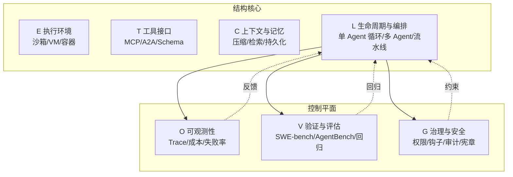

# Agent Harness Engineering：AI Agent 执行框架的系统化重构

2026 年 CMU、耶鲁、亚马逊等机构的联合 Survey 给出了一个判断：当模型已经强到能尝试长任务时，制约 Agent 上生产的瓶颈从模型下移到了包裹模型的执行框架——论文称之为 agent execution harness（执行框架或驾驭层）。这套框架被拆成 ETCLOVG 七层，2022–2026 年的开源项目分布印证了行业的投入方向：工程资源集中在 L 层（Lifecycle & Orchestration），O 层（Observability & Operations）与 G 层（Governance & Security）在开源侧偏薄，C 层（Context & Memory）则多以嵌入框架内的形态存在。

下文按 ETCLOVG 逐层拆解，再用一个"编程 Agent 修 GitHub Issue"的任务流把七层串起来。

## 三代演进：行业把工程投入投向哪里

论文把 Agent 工程化的演进梳理成三段，每段对应一个不同的瓶颈假设：

| 阶段 | 兴起时间 | 优化对象 | 代表工作 | 隐含假设 |
|------|----------|----------|----------|----------|
| Prompt Engineering | 2022 年前后（ReAct 时代） | 单次调用的输入文本 | ReAct、早期 Tool Use | 模型是瓶颈，改 prompt 即改一切 |
| Context Engineering | 2025 年成为独立话语（Karpathy 等人带火） | 每步模型能看到的完整信息状态 | 长程记忆、向量检索、语义压缩 | 上下文窗口和内容质量是瓶颈 |
| Harness Engineering | 2025 年出现转折，2026 年成为主流工程话语 | 包裹模型的整个基础设施 | ETCLOVG 七层 | 框架层是瓶颈，决定能否上生产 |

三段在时间上互相重叠，描述的是边际投入流向。Prompt Engineering 阶段的 ReAct 模板在 2026 年依然在用，Context Engineering 的检索压缩也没有被 Harness Engineering 取代——论文的定位是整合而非取代：Harness 工程把 prompt 和 context 的产出纳入一个更大的操作过程，让 Agent 的执行保持有界、可观测、可验证、可恢复。

这个"三段论"本身其实很新：论文在 Figure 1 的注释里说明，对这一递进关系最早的风格化表述，来自 2026 年 2 月的一篇博客文章（MadPlay），OpenAI 与后续论文随后沿用了类似说法。

---

## ETCLOVG 七层：先看地图，再进细节

七层不是平铺的清单。论文自己就把它们分成两组：前四层（E/T/C/L）构成**结构核心**，决定 Agent 在哪跑、能调什么、看到什么、怎么组织控制流；后三层（O/V/G）构成**控制平面**，决定跑得怎么样、对不对、该不该让它跑。

```mermaid
flowchart TB
    subgraph 结构核心
        E[E 执行环境<br/>沙箱/VM/容器]
        T[T 工具接口<br/>MCP/A2A/Schema]
        C[C 上下文与记忆<br/>压缩/检索/持久化]
        L[L 生命周期与编排<br/>单 Agent 循环/多 Agent/流水线]
    end
    subgraph 控制平面
        O[O 可观测性<br/>Trace/成本/失败率]
        V[V 验证与评估<br/>SWE-bench/AgentBench/回归]
        G[G 治理与安全<br/>权限/钩子/审计/宪章]
    end
    L --> O
    L --> V
    L --> G
    O -.反馈.-> L
    V -.回归.-> L
    G -.约束.-> L
```

七层之间不是单向调用。L 层的编排循环会同时被 O 层观测、V 层评估、G 层约束，而 O/V/G 的输出又回流到 L 层影响下一步决策。这种耦合是后面 Harness Coupling Problem 的根源。

## 七层逐层拆解

### E – Execution Environment（执行环境）

Agent 代码跑在哪里、受什么沙箱约束。论文把 2024–2026 年的沙箱生态分成七类：通用托管沙箱（E2B、Daytona、Modal）、计算机使用基础设施、代码专用沙箱、框架集成运行时、浏览器评测环境、操作系统级权限沙箱，以及把多种沙箱后端收拢到一个 API 后面的抽象层。隔离技术（容器、Firecracker 一类微虚拟机、gVisor、WebAssembly、bubblewrap/Seatbelt）则作为设计属性穿插在各类别里。

设计空间里反复出现的张力，是能力、控制与成本三者的纠缠。论文指出沙箱在 Agent 时代同时服务三个目的——安全、可复现（评测和训练需要随时重置到已知基线）、活性（liveness）：没有沙箱，Agent 每次写文件、装依赖都要弹权限框，用户要么烦到弃用，要么麻木地全部放行。Anthropic 的数据是给 Claude Code 引入沙箱后权限提示减少了 84%。论文同样没有给出"该选哪种沙箱"的判断，明确把 bundle 还是 compose 这类取舍归为经验设计问题——E 层在 2026 年还没有形成共识。

### T – Tool Interface & Protocol（工具接口与协议）

外部能力如何被描述、发现和调用。论文的说法是：MCP 已经成为编码与企业 Agent 场景中最主流的工具集成底座，其价值不止于 schema 层面的互操作，更在于生态流动性——开发者可以直接复用一个不断扩大的 server 目录，而不必为每个部署写定制连接器。A2A 则处理 Agent 之间的互调。值得注意的是，论文用"集成边界"给这些标准排座次：Function Calling 跨的是模型↔函数边界，MCP 跨的是 Agent↔外部能力边界，A2A 跨的是 Agent↔Agent 边界——它们在同一个 harness 里是非重叠的角色，不是互相取代的关系。

T 层真正决定成败的是工具 Schema 的描述质量。协议只是载体：描述模糊的工具，模型要么不敢调，要么调错参数；论文引用的生产系统经验反复表明，过大的工具菜单会降低可靠性、抬高 token 开销、放大规划错误，"少而精的工具"通常好过 brute-force 全量暴露。这是 T 层和 C 层的耦合点。

### C – Context & Memory Management（上下文与记忆管理）

C 层在论文的生态统计中只有 9 个主项目，数量最少。论文给出的解释不是它不重要：上下文和记忆通常嵌入在 L 层框架内部（如 LangGraph 的 state、AutoGen 的 memory），很少作为独立组件发布。技术形态上，论文采用"活动上下文窗口—会话级状态—跨会话存储"三层架构组织这一层，并单列长程技术（100 轮以上如何保持连贯）与上下文漂移（context drift）分析。漂移一节有个数据值得记住：标称 200K token 的模型，50K 左右就可能表现出明显性能衰减——"上下文腐烂"（context rot）不是极端情况，而是多步 Agent 的常态。

嵌入的后果是 C 层实践高度碎片化，每个框架都有自己的 state schema，互不兼容，换框架往往意味着重写状态层。

### L – Lifecycle & Orchestration（生命周期与编排）

47 个主项目，是七层里最拥挤的地带。把 L 层的演化拉一条时间线对比着看会更清楚：

- **2022 年（ReAct 时代）**：单 Agent 循环，"推理-行动-观察"三段式。论文提醒，早期系统的全部基础设施常常只是一个 while 循环、一张 prompt 模板和一张工具分发表。
- **2023 年（AutoGPT 与多 Agent 协调起步）**：AutoGPT、BabyAGI 加进任务队列、记忆和更广的工具使用，暴露出终止、上下文控制、状态恢复和监控的缺口；CAMEL、ChatDev、MetaGPT 引入"角色扮演"式的多 Agent 协作，复杂度上去了，但调试困难。
- **2025 年（harness turn）**：OpenAI 把"harness engineering"用进 Codex 类工作；LangChain 的 DeepAgents 靠纯 harness 层面的改动把 Terminal-Bench 2.0 成绩从 52.8% 提到 66.5%；Meta-Harness 则证明自动搜索 harness 可以胜过手工脚手架。

论文把编排模式归成五类：层级编排（AutoGen、DeerFlow）、团队编排、工作流编排（Semantic Kernel）、扇出（fan-out）、图组合（LangGraph）。这些抽象都在回答"谁来调谁、什么时候停、失败怎么办"，但接口设计各不相同，编排抽象因此高度同质化——迁移成本很高，因为每家的状态与控制流概念互不兼容。

### O – Observability & Operations（可观测性与运维）

Agent 跑了 30 秒的 `run_tests`，但没人知道是哪几个测试慢、是不是卡在网络拉依赖——这是 O 层缺位的典型症状。O 层要捕获的信号包括 Trace、成本、失败率和可靠性，形态上分 Trace 与监控平台、Agent 专用运维平台、成本追踪与优化、可靠性工程四类。

O 层在开源生态中只有 15 个主项目，更多出现在商业平台和 SDK 功能里。团队通常先跑起来再考虑观测，代价是等出问题时没有 Trace 可查——论文引用 LangChain 2026 年的调查指出的缺口（89% 的团队在用可观测性，只有 52.4% 跑离线评估）正是这种状态的写照：看得见 Agent 做了什么，却没有系统地判断做得对不对。

### V – Verification & Evaluation（验证与评估）

V 层有 21 个主项目，数量仅次于 L 层。SWE-bench、AgentBench、WebArena、GAIA 等评测体系都在这一层。但有一个边界问题容易被忽略：这些 benchmark 测的是模型 + 框架的联合表现，而非框架本身。同一个 SWE-bench 分数，可能来自更强的模型，也可能来自更聪明的上下文压缩——单看分数推不出框架质量。反过来，框架也可以当成实验变量来测：前文提到的 DeepAgents 实验只改 harness，成绩就动了近 14 个百分点。V 层的工程价值因此落在建立可归因的回归反馈上——哪次改动让哪个子任务的通过率掉了，是模型问题还是框架问题。论文也指出，当前可观测性采纳广泛但离线评估少见（89% 对 52.4%），这个缺口恰好是 V 层的切入点。

### G – Governance & Security（治理与安全）

G 层和 O 层形成对照：O 层回答"系统跑得怎么样"，G 层回答"系统是否在做它应该做的事"。在模型级、系统级和组织级施加行为约束，形态包括权限模型、生命周期钩子、组件加固、声明式宪章、审计基础设施。

G 层在开源生态中只有 14 个主项目，和 O 层一样薄。大多数团队在 2026 年还在解决"能不能跑起来"，"该不该让它跑"是更靠后的工程阶段才会认真对待的。但 G 层缺位的代价是 Prompt Injection、越权操作、不可审计的决策——这些一旦在生产环境暴露，往往是事故级别的。

## 任务如何流过七层：一次 Agent 修 GitHub Issue

假设有一个编程 Agent 接到任务：修复仓库 `example/repo` 的 Issue #42，该 Issue 报告 `parse_config` 在空文件上崩溃。

1. **E 层**：编排器拉起一个 Firecracker 微虚拟机，挂载仓库快照，限定网络只能访问 GitHub API 和 PyPI，文件系统写权限限定在工作目录。Agent 代码在这个 VM 里跑。
2. **T 层**：Agent 通过 MCP 协议发现可用工具——`read_file`、`write_file`、`run_tests`、`create_pull_request`。每个工具的 Schema 描述了参数类型、返回格式、副作用。
3. **C 层**：Agent 读 Issue 描述、读 `parse_config` 源码、跑一次复现，把这些信息塞进上下文。当上下文接近窗口上限时，C 层的压缩策略决定保留哪些 Trace、丢弃哪些中间输出。
4. **L 层**：Agent 进入"读代码 → 假设 → 改代码 → 跑测试"的循环。如果测试失败，L 层决定是回滚、重试，还是把失败信息回灌给模型重新推理。
5. **O 层**：每一步的 Token 消耗、工具调用延迟、失败率都被 Trace 平台记录。如果某次 `run_tests` 跑了 30 秒，O 层的 Trace 会显示是哪几个测试慢。
6. **V 层**：Agent 改完代码后，V 层的回归套件跑一遍 SWE-bench 风格的验证——不只是跑当前 Issue 的复现测试，还要跑相关模块的回归，确认没有引入新问题。
7. **G 层**：在 `create_pull_request` 之前，G 层的钩子检查改动是否触及 `security/` 目录、是否修改了 CI 配置、是否需要人工审批。如果触发规则，PR 会被标记为 `needs-review` 而不是直接合并。

七层在这一个任务里同时在场：L 层的循环每一步都被 O 层观测、受 G 层约束、由 C 层喂上下文、用 T 层的工具、在 E 层的环境里跑、最后被 V 层验证。任何一层的局部优化都可能牵动其他层——Harness Coupling Problem 指的就是这种耦合。

---

## 开源生态分布：测的是什么，反映哪部分

论文作者对随文维护的 Awesome-Agent-Harness 目录做 ETCLOVG 编码，证据来自公开文档本身（README、文档页、论文、示例、Release Notes），必要时看仓库结构。论文附录的全量映射表（快照日期 2026 年 5 月 8 日，171 个公开条目，其中纯阅读材料、清单类仓库和教程资源不计入）按主要层（primary layer）统计，分布如下：

| 层 | 范围 | 主项目数 |
|---|------|---------:|
| E | Execution Environment & Sandbox | 20 |
| T | Tool Interface & Protocol | 12 |
| C | Context & Memory Management | 9 |
| L | Lifecycle & Orchestration | 47 |
| O | Observability & Operations | 15 |
| V | Verification & Evaluation | 21 |
| G | Governance & Security | 14 |

**这个分布测的是什么**：开源社区在 ETCLOVG 各层的项目级投入。一个项目被计入某层，意味着它在该层有可识别的独立功能，而不是把该层作为内部实现细节。

**反映哪部分**：L 层（47 个）和 V 层（21 个）的密集，反映"编排"和"评估"是开源侧竞争最激烈的两层；C 层（9 个）和 O/G 层（15/14 个）数量少，反映这些能力更多嵌入在更大的框架里或被商业化承接。

**不能推出什么**：

- 不能推出"L 层技术最成熟"——项目多可能只是因为门槛低、同质化严重。
- 不能推出"C 层不重要"——C 层项目少是因为它通常不作为独立组件发布。
- 不能推出"商业平台在 O/G 层更强"——这个分布只统计开源项目，商业平台的内部能力没有被纳入。

论文作者也明确承认这个局限：编码依赖公开文档，商业平台和内部系统的实际能力不在统计范围内。

O 层和 G 层在开源侧的偏薄，也可以从 Agent Frameworks 到 Agent Platforms 的转变来理解。Framework 提供本地抽象（Agent、Tools、Memory、Execution Loop），Platform 提供持久化工作空间、身份、可观测性、评估、治理和跨多次运行多用户的人工交接——O 层和 G 层的能力更自然地属于 Platform 层，而不是 Framework 层。

---

## 跨层综合：三个系统级约束

七层组合后会产生单层解决不了的系统级约束，论文把它们总结成三个模式，五个开放问题都从其中长出。

- **成本-质量-速度三难（cost-quality-speed trilemma）**：更强的沙箱、更丰富的上下文、更深的评估都在提升质量，同时烧掉 token、延迟和基础设施。生产 harness 不能把质量当单一目标，要决定哪些风险值得上昂贵控制、哪些检查可以异步跑或塞进回归套件。
- **能力-控制权衡（capability-control tradeoff）**：更大的工具菜单、持久记忆、宽松沙箱扩大任务覆盖面，也放大误对齐或被攻陷行为的爆炸半径。能力和控制是同一根设计轴，贯穿工具 Schema、上下文策略、运行时权限、身份、可审计性和人工审批。
- **Harness 耦合问题（Harness Coupling Problem）**：各层彼此耦合，局部优化因此脆弱。一个 prompt、工具、沙箱、验证器或监控器单独看可能有益，组合进整个控制环后可能拖垮整体——harness 的改动要按系统改动来测试。

---

## 五个开放问题

论文末尾提出五个问题，每一个都横跨 ETCLOVG 多层。

### 1. 执行环境的加固与规模化

- Prompt Injection、Goal Misalignment、组合放大的通用安全评测标准
- 成本模型：在容器、微 VM、OS 权限边界、完整桌面 VM、浏览器环境之间如何决策
- 可移植性：自托管、云和混合部署之间的语义一致性

E 层选错往往同时引发上下文爆炸和安全漏洞两类症状。为图方便用裸进程跑 Agent，Prompt Injection 触发后 Agent 会直接读写宿主文件系统；反过来，沙箱太严会导致 Agent 连配置文件都改不了，被迫把所有写操作走外部 API，上下文被工具返回值撑爆。

### 2. 长运行 Agent 的可靠状态管理

上下文管理需要被重新定义为状态估计问题：

- 每次压缩、检索或遗忘操作带来了什么信息损失
- 如何增加溯源、矛盾处理和显式陈旧标记
- 如何从持久化产物而非压缩历史中恢复

在生产中，C 层压缩策略不当会让长任务"失忆"：Agent 跑到第 20 步时忘了第 3 步的关键约束（如"不要修改 tests/ 目录"），开始违反早期指令；或者压缩保留了高频但低价值的信息（如重复的工具调用日志），丢掉了低频但关键的事实（如用户的核心需求）。

### 3. Trace 原生故障诊断

Trace 应该成为系统计算结果分数、轨迹质量、失败归因和回归测试的主要对象，而不只是事后调试材料。论文把现状概括为"final-score 中心"：一次运行只留下一个过或不过的数字，而失败可能来自模型推理、误导性的工具 Schema、沙箱配置错误、过期上下文、flaky 测试、评测本身的歧义或编排循环——不做 trace 级归因，这些原因分不开。

生产 trace 与评估流水线脱节是普遍状态。论文给出的路线是把异常 trace 转化成回归用例、直接在 span 上计算轨迹指标、把诊断信号回灌给 prompt、工具、上下文和编排的修改。

### 4. Agent、工具和人之间的标准化交接

交接内容需要超越文本摘要，覆盖意图、约束、权限、产物、溯源、预算状态、风险级别、Trace 历史和未解决决策。协议设计要在两个方向上找平衡：丰富到能支持安全和恢复，又简单到能被广泛采纳。

一个具体场景：Agent 跑到一半预算耗尽，交接给人类时只给了一段文本摘要，人类不知道 Agent 已经调过哪些工具、改过哪些文件、哪些决策是确定的哪些是待定的——只能从头重跑。

### 5. 模型改进时的自适应简化

每个 wrapper 都编码了关于"模型无法可靠独立完成什么"的假设。随着模型能力提升，某些干预是"承载结构"（必须保留），另一些则变成了成本、延迟或运维开销。未来的 Harness 需要机制能够根据联合的质量、延迟、成本和风险约束进行自我削减和优化。

这类技术债的表现是：早期为弱模型写的复杂重试逻辑、格式校验、思维链引导，到模型已经能原生处理时，这些 wrapper 还在跑——增加延迟、挤占上下文、制造不必要的失败路径。

---

## 该怎么用这篇 Survey

### 评估或选型 Agent 框架

把 ETCLOVG 当成检查清单，逐层问：

- **E 层**：框架默认的执行环境是什么？换沙箱的代价多大？看默认是容器、微 VM 还是裸进程；换沙箱要评估网络策略、文件系统隔离、启动延迟三方面代价。
- **T 层**：工具协议是 MCP 还是私有协议？工具 Schema 谁来维护？MCP 已是编码与企业 Agent 生态中最主流的工具协议，私有协议意味着每接一个工具都要写适配代码；Schema 维护责任决定工具扩展成本。
- **C 层**：上下文压缩策略是什么？state schema 能不能导出？压缩策略决定长任务稳定性；state schema 不可导出意味着迁移成本高、调试困难。
- **L 层**：编排抽象是单 Agent 循环、多 Agent 还是流水线？迁移到另一个框架要改多少代码？抽象越显式（状态机 > 角色 prompt）越可调试；迁移成本主要看编排与状态概念和目标框架兼不兼容。
- **O 层**：Trace 能不能导出到外部系统？成本追踪粒度到不到单次工具调用？Trace 不可导出意味着被平台锁定；成本粒度不到单次调用就无法做精细归因。
- **V 层**：有没有内置的回归套件？能不能接 SWE-bench 风格的评测？内置回归套件决定升级信心；能接外部 benchmark 才能横向比较。
- **G 层**：权限模型是声明式还是代码式？有没有审计日志？声明式权限更易审计和复用；代码式更灵活但难追溯；审计日志是生产合规的底线。

### 构建 Agent 系统

采用顺序建议：先 E 和 T，再 L 和 C，最后 O、V、G。E 和 T 决定系统能不能跑起来；L 和 C 决定能不能跑长任务；O、V、G 决定能不能上生产。跳过 O/V/G 直接上生产，出问题时往往连定位故障的 Trace 都没有——只能靠日志猜是模型退化、框架 bug 还是上下文污染。

### 哪类团队先上，哪类团队等等

- **先上**：已经有内部工具调用基础设施、有 SWE-bench 风格评测需求的团队；处理长任务（>10 步）的编程 Agent 团队。
- **可以等等**：只做单轮工具调用的团队——Prompt Engineering + 简单 T 层就够；上下文窗口完全够用的短任务场景——C 层投入可以延后。

### Survey 本身的局限

论文是 Survey，不是 Benchmark，它整理了生态但没有给出"哪个框架最好"的判断。七层的边界在不同框架中的划分方式也存在模糊地带（比如某些项目同时跨越 L 和 V 层）。开源项目编码依赖公开文档，商业平台和内部系统的实际能力没有被纳入统计。

## 练习题

3 个练习，把 ETCLOVG 落到自己的项目里：

**练习 1：给现有 Agent 系统做七层体检**

选你们正在用的一个 Agent 框架（LangChain、AutoGen、CrewAI、OpenAI Agents SDK 等），按 ETCLOVG 七层逐层问：
- 这一层有没有显式设计？
- 如果没有，是用什么方式绕过的？
- 绕过的代价是什么（迁移成本、调试难度、合规风险）？

参考答案要点

典型体检结果：

- **E 层**：大多数框架默认用裸进程或简单容器，没有显式沙箱设计。代价：Prompt Injection 成功后可以直接读写宿主文件系统。
- **T 层**：如果用私有协议（非 MCP），工具接入成本高，每加一个工具都要写适配代码。代价：工具生态难以复用。
- **C 层**：通常嵌入在 L 层框架内部（LangGraph state、AutoGen memory），不可导出。代价：换框架往往意味着重写状态层，迁移成本很高。
- **L 层**：大多数框架有显式设计（循环、状态机、流水线）。这是七层里最成熟的。
- **O 层**：大多数框架缺位，或者只有简单的日志。代价：出问题时没有 Trace，无法定位是模型退化、框架 bug 还是上下文污染。
- **V 层**：多数框架自身不带评测，回归测试通常需要外接 benchmark。代价：升级框架或模型后，无法快速判断是不是引入了回归。
- **G 层**：大多数框架缺位，或者只有简单的 API key 管理。代价：Agent 持有 `drop_table` 权限但没有细粒度策略，出事后无法追溯是哪个 Agent 发起的。

体检后，优先补 O 层和 G 层——这两层缺位的代价在生产环境暴露最惨。

**练习 2：画一张你们团队的 Agent 采用路线图**

用 ETCLOVG 七层，画一张你们团队未来 6 到 12 个月的 Agent 采用路线图：
- 哪几层已经覆盖了？
- 哪几层是接下来的 3 个月要补的？
- 哪几层可以等等，为什么？

参考答案要点

典型团队路线图：

**第 1 阶段（0-3 个月）：E + T + L**
- E 层：先跑起来，用裸进程或简单容器，不追求完美沙箱。
- T 层：接入 MCP 协议，复用现有工具生态。
- L 层：用 LangGraph 这类图组合框架把控制流显式化（或用 AutoGen 搭层级编排），替换掉 ReAct 式的隐式循环。

**第 2 阶段（3-6 个月）：C + V**
- C 层：引入向量检索和上下文压缩，支持长任务（>10 步）。
- V 层：建 SWE-bench 风格的回归测试，确保升级模型或框架后不引入回归。

**第 3 阶段（6-12 个月）：O + G**
- O 层：接入 Trace 平台（如 Langfuse、Arize Phoenix），成本监控可以用 Helicone 这类免改代码的代理，记录每次工具调用的延迟、成本、失败率。
- G 层：用生命周期钩子加权限网关搭一层策略控制，在代码层拦截越权操作，并保留审计日志。

可以等等的原因：
- O 层和 G 层投入成本高，需要基础设施支持（Trace 平台、策略引擎、审计日志）。
- 如果你们还在第 1 阶段（能不能跑起来），O/G 层的投入产出比不高。

**练习 3：做一次开源框架的 ETCLOVG 对比**

选 3 个开源 Agent 框架（比如 LangGraph、AutoGen、CrewAI），按 ETCLOVG 七层做个对比表：
- 每一层有没有显式支持？
- 如果有，是用什么方式实现的（代码级、配置级、还是依赖外部服务）？
- 迁移成本在哪几层最高？

参考答案要点

| 层 | LangGraph | AutoGen | CrewAI |
|---|------------|---------------|--------|
| E | 依赖外部（容器/沙箱服务） | 内置 Agent Runtime | 依赖外部 |
| T | MCP 适配器（langchain-mcp-adapters） | 内置 MCP 客户端（autogen-ext） | 框架自有工具装饰器 |
| C | state schema（TypedDict） | memory 模块（可插拔） | 内置 memory 配置 |
| L | 图组合（StateGraph） | 层级编排（AgentChat 团队） | 工作流编排（Flow） |
| O | LangSmith（商业，同门） | OpenTelemetry 追踪 | 与 Langfuse 等第三方集成 |
| V | 外接 benchmark | 外接 benchmark | 外接为主 |
| G | 外接 | 外接为主 | 外接 |

迁移成本最高的层：
- **C 层**：每个框架的 state schema 不兼容，换框架往往意味着重写状态层。
- **L 层**：每个框架的编排抽象不兼容（StateGraph vs AgentChat 团队 vs Flow），换框架要重写编排逻辑。
- **T 层**：如果绑定了框架自有工具接口（如 CrewAI 的工具装饰器），换框架要重写工具适配层；如果用了 MCP，可以复用。

迁移成本最低的层：
- **E 层**：换容器或换云厂商，不影响框架逻辑。
- **O 层**：Trace 可以外接，不绑定框架。

## 进阶路径

如果你认同本文的判断，下面这条路径可以按顺序深入：

1. **先跑一个 E + T + L 的最小闭环**。选一个边界清晰、可独立验收、可回滚的任务（比如"修一个 GitHub Issue"），用 LangGraph 或 AutoGen 搭一个最小 Agent 系统，跑通 ETCLOVG 的前三层。
2. **建一个 C 层的上下文管理策略**。当任务超过 10 步时，引入向量检索和上下文压缩，避免上下文窗口溢出或关键信息被挤掉。
3. **接一个 O 层的 Trace 平台**。当 Agent 跑进日常生产、形成稳定调用量时，接入 Langfuse、Arize Phoenix 这类平台（成本监控可用 Helicone 这类免改代码的代理），记录每次工具调用的延迟、成本、失败率，为后续优化提供数据。
4. **建一个 V 层的回归测试套件**。当 Agent 开始进入生产环境时，建 SWE-bench 风格的回归测试，确保升级模型或框架后不引入静默回归。
5. **补一个 G 层的策略控制**。当 Agent 持有高风险工具权限（如 `drop_table`、`send_email`、`execute_code`）时，用权限模型和生命周期钩子搭一层代码级拦截，并保留审计日志，让越权操作既进不来也查得到。
6. **关注 ETCLOVG 的耦合问题**。当你在多层同时做优化时，注意 Harness Coupling Problem——某一层的局部优化可能破坏其他层，需要建跨层的回归测试。
7. **持续跟踪 Survey 的更新**。本文基于 2026 年 5 月的 Survey，ETCLOVG 框架和开源生态会以月为单位迭代。建议每隔 2 到 3 个月重新做一次七层体检，调整采用路线图。

---

## 资料口径说明

### 信息来源与时效性

本文基于 *Agent Harness Engineering: A Survey* 编写。作者共 17 人，机构为 CMU、UAB、Tulane、Yale、NEU、Stanford、Amazon、UChicago、Virginia Tech、Rutgers 与独立研究者（论文首页口径，NEU 为论文所用缩写），论文于 2026 年 5 月 14 日在 OpenReview 发布（ID: eONq7FdiHa），最后一次修改为 2026 年 5 月 15 日。

以下信息会随时间变化：

- ETCLOVG 七层的定义和边界可能在后续版本中调整，以 [OpenReview 页面](https://openreview.net/forum?id=eONq7FdiHa) 的最新版本为准。
- Awesome-Agent-Harness 开源项目目录会持续更新，各层项目数可能变化，以 [项目 GitHub 仓库](https://github.com/Picrew/awesome-agent-harness) 的最新提交为准。注意两个口径的差异：论文附录是 2026 年 5 月 8 日的快照（171 个条目，按 ETCLOVG 主要层编码），而仓库 README 在 2026 年 9 月已扩展到 368 个条目、改用 9 个主题类目组织——本文引用的是论文快照口径。
- 各开源框架（LangGraph、AutoGen、CrewAI 等）的 ETCLOVG 支持情况会随版本迭代，本文引用的是 2026 年 5 月时的公开文档。

### 适用边界

本文的框架和建议在下列场景下适用性更强：

- 长任务（>10 步）的 Agent 系统，上下文管理和状态持久化是瓶颈。
- 多 Agent 协作场景，需要显式编排和权限隔离。
- 生产环境的 Agent 部署，需要满足可观测性、验证、治理要求。

下列场景下，本文方法的直接适用性会下降：

- 单轮工具调用的简单场景，Prompt Engineering 足够，不需要完整的 ETCLOVG 七层。
- 无状态、无副作用的 Agent（如纯信息查询），E 层沙箱和 G 层治理的投入产出比不高。
- 纯研究性质的 Agent，不需要生产部署，O/V/G 层可以延后。

### 未覆盖的内容

本文未深入讨论以下话题：

- ETCLOVG 七层在具体行业（金融、医疗、法律）的合规映射。
- 多区域、多云平台上的 E 层沙箱和 G 层身份同步方案。
- Agent 系统的成本优化（如何在 E/T/C/L 各层做成本和延迟权衡）。
- ETCLOVG 与 Anthropic 的 Agent Skills、MCP 等新兴标准和协议的具体衔接方式。

### 争议与不同意见

- O（可观测性）和 V（验证与评估）的边界在实践中容易模糊：评估本来就依赖 Trace 数据，两层的工具链也高度重叠。论文有意识地把 O 独立成层（理由是有专门的工具生态和工程实践），但读者仍会看到两个层交替出现的话题。
- "Harness Engineering"能否作为一个独立工程阶段立住，尚待观察：三分法本身很新（最早的风格化表述见于 2026 年 2 月的一篇博客），也有实践者认为 Context Engineering 已经覆盖了大部分 Harness 问题。论文的反驳依据是 100 轮以上长任务的漂移问题——那部分确实是上下文工程管不到的。
- 开源生态的项目编码方法存在主观性。论文自己承认采用单编码员协议加作者审计，没有报告编码者间一致性指标（如 Cohen's kappa）；某些项目同时跨越多个层，编码判断会影响统计结果。

---

## 参考链接

- 论文主页：https://picrew.github.io/LLM-Harness/（项目页面沿用早期命名 LLM-Harness，与论文正式标题 Agent Harness Engineering 指向同一工作）
- PDF：https://picrew.github.io/LLM-Harness/main.pdf
- 开源项目目录：https://github.com/Picrew/awesome-agent-harness
- HuggingFace 数据集：https://huggingface.co/datasets/ChenLiu1996/Agent-Harness-Engineering
- OpenReview：https://openreview.net/forum?id=eONq7FdiHa（venue/submission 状态以 OpenReview 页面为准）