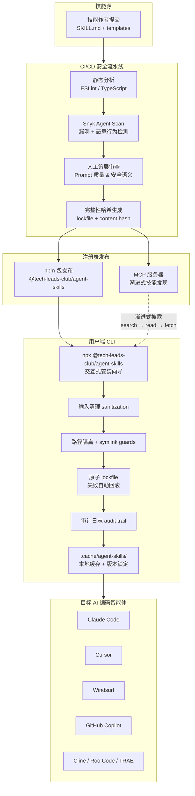

# agent-skills：面向专业 AI 编码智能体的安全技能注册表

> **快速信息卡**
>
> | 项目 | 信息 |
> |------|------|
> | 仓库 | [tech-leads-club/agent-skills](https://github.com/tech-leads-club/agent-skills) |
> | Stars | 4.7k+ |
> | Forks | 422+ |
> | 许可证 | MIT（代码）/ CC-BY-4.0（技能内容） |
> | 语言 | TypeScript |
> | 更新 | 2026-06-25 |

Snyk 2026 Agent Threat Report 给出一个数字：公开市场里 13.4% 的 AI 编码智能体技能包含关键级漏洞。换算下来，每安装 7 到 8 个技能就有一个可能携带可利用缺陷。AI 技能会以系统指令形式进入智能体的执行上下文，缺陷一旦被利用，影响范围比普通依赖更靠前。

[agent-skills](https://github.com/tech-leads-club/agent-skills) 由 Tech Leads Club 维护，把 AI 编码智能体（AI coding agent）的技能当成供应链依赖来管理。项目用 CI/CD 流水线、人工策展和 CLI 纵深防御，在技能从发布到安装的每一步留下可复查的痕迹。核心技术栈：Nx Cloud 多包管理、代码全部用 TypeScript 编写、MIT/CC-BY-4.0 双许可证。截至 2026 年 6 月，项目仍在活跃维护，已支持 19 个 AI 编码智能体。

下面分两层看：catalog 侧的发布审查机制怎么挡住恶意技能，CLI 侧的安装路径怎么挡住路径穿越和供应链篡改。

## 学习目标

读完这篇文章后，你应该能够：

- 说出 agent-skills CLI 的五道防御关卡，以及每道关卡各自拦截哪类威胁
- 解释 lockfile 三层保护（Zod schema、原子写入、内容哈希）各自针对的威胁
- 通过 `npx @tech-leads-club/agent-skills` 交互式向导完成技能安装，并从审计日志还原操作历史
- 区分 CLI 安装和 MCP server 两种技能获取方式的安全边界和适用场景
- 为团队设计技能采用策略，判断哪些场景适合 agent-skills、哪些需要并行厂商市场

## 前置知识

阅读本文前，建议先了解以下概念：

- **AI 编码智能体**：能在 IDE 或终端里自主读写代码、执行命令的智能体，如 Claude Code、Cursor、Cline 等
- **供应链安全**：第三方依赖被植入恶意代码或静默更新带来的风险，以及 lockfile、内容哈希等应对手段
- **TypeScript 基础**：能看懂 `async/await`、`Promise`、模板字符串等语法，理解 `resolve()`、`normalize()` 等 Node.js path 模块函数的作用

## 目录

- [安全技能注册表的工作流](#安全技能注册表的工作流)
- [技能包的结构约定](#技能包的结构约定)
- [CLI 纵深防御的五道关卡](#cli-纵深防御的五道关卡)
  - [L1 — 输入清理](#l1--输入清理input-sanitization)
  - [L2 — 路径隔离](#l2--路径隔离filesystem-isolation)
  - [L3 — 符号链接防护](#l3--符号链接防护symlink-guard)
  - [L4 — 原子锁文件](#l4--原子锁文件lockfile-integrity)
  - [L5 — 审计日志](#l5--审计日志audit-trail)
- [支持的智能体平台](#支持的智能体平台)
- [精选技能一览](#精选技能一览)
- [任务流案例：从发现到审计的完整路径](#任务流案例从发现到审计的完整路径)
- [MCP 服务器：让 AI 自己发现技能](#mcp-服务器让-ai-自己发现技能)
- [FAQ](#faq)
- [自检测试](#自检测试)
- [采用建议与适用边界](#采用建议与适用边界)

## 安全技能注册表的工作流



上图展示了一条完整的信任链：从技能源码提交到最终注入 AI 编码智能体的工作目录，每一步都留下可复查的痕迹。下面展开各环节的设计细节。

## 技能包的结构约定

每个技能遵循统一的目录布局。`SKILL.md` 是入口，`templates/` 存放可复制的文件骨架，`references/` 收纳按需加载的参考文档：

```text
packages/skills-catalog/skills/
  (category-name)/
    skill/
      SKILL.md
      templates/
      references/
```

这种约束让 CLI 和 MCP 服务器的路径解析保持确定性。没有 `../../` 逃逸，没有隐式依赖。

## CLI 纵深防御的五道关卡

agent-skills CLI 的安全实现构成了纵深防御体系，每一层独立失效时不导致其他层失效。

### L1 — 输入清理（Input Sanitization）

所有来自注册表、网络、用户输入的字符串在进入 CLI 核心逻辑前，先经过标准化和过滤。技能名称、平台标识符、文件路径等字段均作白名单校验。这一层拦截 `../../../etc/passwd`、`skill\0name`、`/etc/passwd`、`skill:name`、`.hidden`、300 字符超长名等输入。

### L2 — 路径隔离（Filesystem Isolation）

CLI 强制执行工作目录边界。安装目标路径永远被限制在用户指定的 agent 配置目录内。两个路径都经过 `resolve()` 完全解析——相对路径、符号链接、`..` 序列在比较前被消除。输入 `/etc/passwd` 或 `../../.ssh` 会被直接拒绝。这个守卫应用在每次写、读、删操作上。

### L3 — 符号链接防护（Symlink Guard）

安装过程中，CLI 用 `lstat()` 而不是 `stat()` 检测符号链接——`lstat()` 不跟随链接，能避免 TOCTOU（Time-of-Check-Time-of-Use）攻击。如果技能包内包含指向目标目录之外的 symlink，安装将中断。链式符号链接会被递归解析，最终目标必须落在允许目录内。`ELOOP` 错误（循环符号链接）会被捕获并强制删除链接。

### L4 — 原子锁文件（Lockfile Integrity）

锁文件 `.agents/.skill-lock.json` 是已安装技能的事实来源。保护机制有三层，各自防的威胁不同：Zod schema 防格式损坏，原子写入防进程中断，内容哈希防事后篡改。

锁文件从不原地写入，而是走三步：

```text
1. 备份现有文件  → .skill-lock.json.bak
2. 写入新内容    → .skill-lock.json.tmp
3. 原子重命名    → .skill-lock.json.tmp → .skill-lock.json
```

进程被 kill 时旧文件完好；重命名失败时临时文件被清理。每个已安装技能记录 SHA-256 内容哈希，由该技能所有文件计算得出。如果技能文件在安装后被篡改，下次操作时哈希不匹配会被检测到。

### L5 — 审计日志（Audit Trail）

每次 install、update、remove 操作都追加到 `~/.config/agent-skills/audit.log`，格式是 JSON Lines：

```json
{"action":"install","skillName":"aws-advisor","agents":["claude-code","cursor"],"success":1,"failed":0,"timestamp":"2026-05-18T14:32:01Z"}
{"action":"remove","skillName":"aws-advisor","agents":["cursor"],"success":1,"failed":0,"forced":false,"timestamp":"2026-05-18T16:00:00Z"}
```

日志是 append-only——条目永不覆盖。取证时直接 grep 这个文件就能还原谁在何时装了什么。

上述五道关卡之外，每个技能在进入注册表前都经过 [Snyk Agent Scan](https://github.com/snyk/agent-scan)（原 mcp-scan）的自动化扫描，覆盖已知漏洞库和恶意行为特征匹配。

## 支持的智能体平台

项目将所支持的 AI 编码智能体分为三个层级，按市场覆盖度和集成深度排列：

| 层级 | 平台 |
|------|------|
| Tier 1（主流） | Claude Code, Cline, Cursor, GitHub Copilot, Windsurf |
| Tier 2（上升期） | Aider, Antigravity, Gemini CLI, Kilo Code, Kiro, OpenAI Codex, Roo Code, TRAE |
| Tier 3（企业级） | Amazon Q, Augment, Droid (Factory.ai), OpenCode, Sourcegraph Cody, Tabnine |

Tier 1 平台经过了最频繁的集成测试，安装路径和配置格式有官方维护。Tier 2/3 同样可用，但可能需要手动指定配置文件位置。

## 精选技能一览

| 技能 | 类别 | 说明 |
|------|------|------|
| `tlc-spec-driven` | 开发 | 四阶段项目规划（Specify → Design → Tasks → Implement），跨会话持久化记忆 |
| `aws-advisor` | 云 | AWS 架构设计、安全评审与实现指导，集成 AWS MCP 工具 |
| `playwright-skill` | 自动化 | 完整的浏览器自动化能力：页面测试、表单填写、截图、UX 验证 |
| `figma` | 设计 | 从 Figma 获取设计上下文并将节点转译为生产级代码 |
| `security-best-practices` | 安全 | 语言/框架专项安全评审，漏洞检测并生成修复建议 |

每个技能的 `SKILL.md` 由人类编写和审查，不使用 LLM 自动生成，避免 LLM 生成指令常见的格式漂移和语义模糊。

## 任务流案例：从发现到审计的完整路径

以下以一个真实场景为例，展示一个技能从发现到审计的完整流程。

**场景**：团队同时使用 Claude Code 和 Cursor，需要统一的 AWS 安全评审标准。决定安装 `aws-advisor` 技能，并保留完整的审计记录。

### 第一步：发现技能

通过 MCP server 的 `search_skills` 工具搜索 AWS 相关技能。AI 编码智能体在会话中调用：

```text
search_skills("aws security")
```

返回候选技能列表，其中 `aws-advisor` 匹配需求。接着用 `read_skill` 读取 `SKILL.md` 主指令，确认技能的工作流和触发条件符合团队评审流程。

### 第二步：发布前验证

在安装前，检查 catalog 中该技能的安全元数据。这些信息在 [GitHub 仓库](https://github.com/tech-leads-club/agent-skills)的 `packages/skills-catalog/skills/` 目录下可以查阅：

- Snyk Agent Scan 扫描结果（漏洞数、通过/失败状态）
- SHA-256 内容哈希
- 技能版本号和发布日期
- `SKILL.md` 的完整内容预览
- 依赖清单

完成人工审查后再进入安装。

### 第三步：交互式安装

```bash
npx @tech-leads-club/agent-skills
```

首次运行进入交互式安装向导。向导检测本机已安装的 AI 编码智能体，生成推荐安装列表。按以下步骤操作：

```text
1. 选择 "Install skills"
2. 搜索 aws-advisor
3. 选择目标智能体：Claude Code + Cursor
4. 选择安装方式：Copy（推荐）或 Symlink
5. 选择范围：Global（~/.claude, ~/.cursor）或 Local（项目内）
```

CLI 拿到技能名 `aws-advisor` 后，先过 `sanitizeName()` 清理输入，确认没有路径分隔符和 null 字节。然后从 CDN 拉取技能包，缓存到 `~/.cache/agent-skills/`。下载完成后计算 SHA-256 内容哈希，跟 catalog 里的哈希比对，确认下载内容没被篡改。

安装写入时，目标路径过 `isPathSafe()` 验证，确认落在 Claude Code 和 Cursor 的技能目录内（`~/.claude/skills/aws-advisor/` 和 `~/.cursor/skills/aws-advisor/`）。写入完成后，锁文件 `.agents/.skill-lock.json` 通过原子写入更新，记录技能名、安装路径、内容哈希、安装时间。

### 第四步：验证审计日志

安装完成后，查看 `~/.config/agent-skills/audit.log`，确认操作被记录：

```json
{"action":"install","skillName":"aws-advisor","agents":["claude-code","cursor"],"success":1,"failed":0,"timestamp":"2026-05-18T14:32:01Z"}
```

日志包含操作类型、技能名、目标智能体、成功/失败计数和时间戳。任何后续的 update 或 remove 操作都会追加新条目。

### 第五步：在 AI 编码智能体中触发技能

安装后，在 Claude Code 会话中直接引用技能名称：

```text
请使用 aws-advisor 技能评审我的 S3 桶权限配置
```

Claude Code 会自动加载 `~/.claude/skills/aws-advisor/SKILL.md` 作为系统指令，按照技能定义的流程执行 AWS 安全评审。

任何一道关卡失败都会中断安装，已写入的文件回滚，锁文件恢复到备份状态。

## MCP 服务器：让 AI 自己发现技能

agent-skills 提供了独立的 MCP 服务器 `@tech-leads-club/agent-skills-mcp`，让 AI 编码智能体在运行时按需查询技能目录。设计思路是渐进式披露（progressive disclosure）——先搜索，确需时再拉取完整内容，避免上下文污染。

```json
{
  "mcpServers": {
    "agent-skills": {
      "command": "npx",
      "args": ["-y", "@tech-leads-club/agent-skills-mcp"]
    }
  }
}
```

四个 MCP 工具：

| 工具 | 功能 | 适用阶段 |
|------|------|----------|
| `list_skills` | 按类目浏览全部技能 | 探索 |
| `search_skills` | 模糊搜索技能名称和描述 | 发现 |
| `read_skill` | 读取技能的 `SKILL.md` 主指令 | 决策 |
| `fetch_skill_files` | 拉取指定参考文件（templates/references） | 执行 |

这种设计让 AI 编码智能体按需"翻阅目录→选中→加载"，和人类查阅文档的行为一致。MCP server 的安全设计：只读，没有写权限；本地 stdio 通信，无网络暴露端点；`fetch_skill_files` 在发起网络请求前验证文件路径是否在 registry 的 `files[]` 数组里，无法获取任意 URL；不访问本地文件系统。

## FAQ

**Q1：agent-skills 和直接克隆 GitHub 仓库手动复制技能有什么区别？**

手动复制绕过了所有安全检查：没有内容哈希验证、没有 Snyk Agent Scan 扫描结果、没有原子安装和回滚、没有审计日志。agent-skills CLI 的每一层防御都针对真实攻击面，留下可复查的痕迹。

**Q2：我的团队内部开发了私有技能，能接入 agent-skills 的安装流程吗？**

当前 agent-skills 的注册表来自 `@tech-leads-club/agent-skills` npm 包。私有技能可以通过 fork 项目并搭建内部 npm registry 来实现。社区已有提案讨论支持自定义 registry 端点，关注项目的 GitHub Issues 获取最新进展。

**Q3：安装技能后，如何确认它没有被篡改？**

查看锁文件 `.agents/.skill-lock.json`，里面记录了每个已安装技能安装时计算的 SHA-256 内容哈希。手动对该技能目录下所有文件重新计算哈希，跟锁文件里的值比对——如果不一致，说明技能文件在安装后被改动过。下次执行任何 agent-skills 操作时，CLI 也会自动做这个比对，哈希不匹配会被检测到。

**Q4：agent-skills 的性能开销有多大？对 AI 编码智能体的响应速度有影响吗？**

安全校验（sanitization、路径检查、哈希验证）在安装时一次性完成，总耗时通常 < 500ms。安装后，技能文件以纯文本 Markdown 形式注入 AI 编码智能体的系统指令中，没有运行时性能开销。MCP 服务器的渐进式披露设计进一步确保了上下文窗口不会被无关内容填满。

**Q5：如果 Snyk Agent Scan 漏报了漏洞怎么办？后续有补救措施吗？**

安全是分层防御，单点漏报不等于全链路失守。即使扫描漏报，路径隔离和 symlink guards 仍然限制了攻击面。同时，所有技能 100% 开源且无二进制依赖，社区可以进行独立审计。发现漏报后，可通过 GitHub Issues 提报，注册表维护者会发布修订版本，用户通过交互式向导升级。

**Q6：多个 AI 编码智能体能共享同一份技能安装吗？**

可以。在交互式向导中选择 Global 范围，技能会安装到共享目录（`~/.claude/`、`~/.cursor/` 等的公共父级），多个智能体共享同一份文件。也可以选择多目标安装——虽然会产生文件副本，但每个智能体独立管理版本，避免不同智能体对技能版本的兼容性差异。

**Q7：项目使用的是什么开源许可证？对商业使用有限制吗？**

技能注册表本身使用 MIT 许可证，技能内容（SKILL.md、templates、references）使用 CC-BY-4.0。两者均允许商业使用，CC-BY-4.0 只要求署名。可以将 agent-skills 集成到企业内部的 AI 开发工作流中，无需额外授权。

## 自检测试

在你的环境中完成以下 6 项检查，确认 agent-skills 正确运行：

- [ ] **CLI 可执行**：运行 `npx @tech-leads-club/agent-skills --version`，确认输出版本号且不报错
- [ ] **交互式向导可启动**：运行 `npx @tech-leads-club/agent-skills`，确认进入安装向导并检测到本机已安装的 AI 编码智能体
- [ ] **技能可安装**：在向导中选择 `tlc-spec-driven` 技能，安装到 Claude Code，然后确认 `~/.claude/skills/tlc-spec-driven/SKILL.md` 文件存在且内容非空
- [ ] **锁文件生成**：安装后确认 `.agents/.skill-lock.json` 包含刚安装的技能条目，记录了技能名、路径和 SHA-256 内容哈希
- [ ] **审计日志生成**：确认 `~/.config/agent-skills/audit.log` 包含刚才的安装记录，格式为 JSON Lines，包含时间戳和操作类型
- [ ] **MCP 服务器可启动**：在 AI 编码智能体的 `mcpServers` 配置中添加 agent-skills MCP 条目，重启后确认智能体可以调用 `list_skills` 工具

全部通过后，你的 agent-skills 部署即处于生产就绪状态。

## 采用建议与适用边界

**企业安全团队**需要管控 AI 编码智能体使用的工具集——agent-skills 的五层发布审查和 CLI 审计日志能直接接入安全合规流程。从 `npx @tech-leads-club/agent-skills` 开始，先在开发环境安装 `security-best-practices` 技能，跑一轮安全审查流程，确认审计日志和 lockfile 机制符合内部要求，再推广到生产智能体。

**开发团队**用 Claude Code 或 Cursor 做日常编码，想装社区技能但担心供应链风险——agent-skills 的 lockfile + 内容哈希能挡住静默更新，Snyk Agent Scan 能挡住已知漏洞。把 agent-skills 作为技能安装的唯一入口，禁用智能体自带的社区技能市场，可以收窄攻击面。

**智能体框架开发者**参考安全技能的设计规范——SECURITY.md 里的威胁模型表、CLI 纵深防御代码、allowlist 机制可以直接复用到自己的技能市场里。lockfile 原子写入和符号链接防护这两段代码值得直接复用。

**采用顺序建议**：

1. 在开发环境运行 `npx @tech-leads-club/agent-skills`，安装 `security-best-practices` 技能，熟悉交互式向导和锁文件机制
2. 检查 `~/.config/agent-skills/audit.log` 和 `.agents/.skill-lock.json`，确认审计日志和内容哈希符合内部安全要求
3. 在团队内部推广，统一技能安装入口，禁用智能体自带的社区技能市场
4. 配置 MCP server 用于运行时技能发现，CLI 安装用于长期使用的核心技能
5. 对于安全敏感场景（凭据访问、文件系统操作、网络调用），优先走 agent-skills；对于长尾技能需求，可并行使用厂商市场

**适用边界**：agent-skills 的 catalog 规模还小（v0.14.3），技能数量和覆盖面不如 Claude Code 或 Cursor 的官方市场。如果团队需要的技能不在 catalog 里，要么自己写技能提交审核，要么等社区贡献。对于需要大量长尾技能的团队，目前可能需要 agent-skills + 厂商市场并行使用，把安全敏感场景的技能走 agent-skills，其他技能走厂商市场。

完整威胁模型和漏洞报告流程见 [SECURITY.md](https://github.com/tech-leads-club/agent-skills/blob/main/SECURITY.md)。官方文档在 https://tech-leads-club.github.io/agent-skills/。

## 资料口径说明

本文基于 agent-skills 项目的 GitHub 仓库（[tech-leads-club/agent-skills](https://github.com/tech-leads-club/agent-skills)）中的以下来源进行判断和撰写：

1. **官方文档**：项目 README.md、SECURITY.md、官方网站（https://tech-leads-club.github.io/agent-skills/）
2. **源代码**：CLI 实现代码、锁文件生成逻辑、审计日志记录机制
3. **Snyk Agent Scan**：漏洞扫描工具的功能说明和报告格式
4. **MCP 服务器规范**：Model Context Protocol 的官方文档和 agent-skills-mcp 的实现

**局限性说明**：

- 项目仍在快速迭代（v0.14.3），部分细节可能在未来版本中变化。本文基于 2026年6月的版本撰写，建议在使用前查看项目最新文档。
- 性能数据（如"总耗时通常 < 500ms"）来自项目文档和社区反馈，实际性能可能因环境而异。
- 支持的平台列表可能随版本更新而变化，请以项目 GitHub 仓库的 README.md 为准。
- 本文未覆盖所有 CLI 命令和配置选项，仅聚焦核心安全机制和典型使用场景。

## 结语

大多数 AI 技能市场优先做的是降低贡献门槛和扩大技能数量，agent-skills 把优先级倒过来：CI/CD 流水线、人工策展、CLI 纵深防御三件事先到位，再谈技能数量。每个技能包上那枚 SHA-256 内容哈希是这条路线的落点——它让"这个技能安装后没被改过"变成可复查的事实，而不是一句承诺。

对于把 AI 编码智能体引入生产流水线的团队，供应链安全是前置条件。agent-skills 把这个前置条件收进一条 `npx @tech-leads-club/agent-skills` 命令里。
