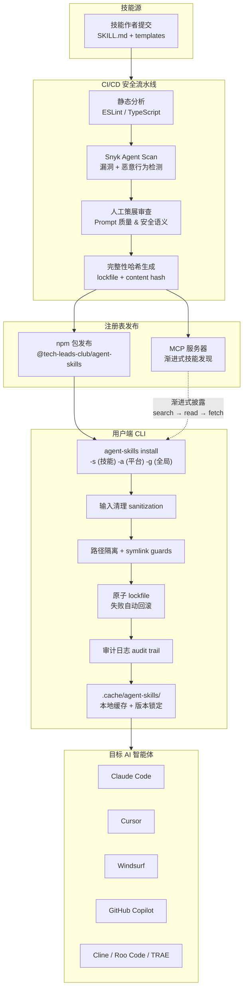

## 当你的 AI 编程助手在运行一个带漏洞的技能

Snyk Agent Scan 2026 年报告给出了一组刺眼的数据：**市场上超过 13% 的 AI Agent 技能包包含关键级（critical）漏洞**。每安装 8 个技能，统计上就有一个可能在你的本地文件系统上制造后门——这是 AI coding 生态当前最被低估的攻击面。

[agent-skills](https://github.com/tech-leads-club/agent-skills) 正面对抗这个问题。它不是一个"技能越多越好"的集市，而是一个面向安全敏感型团队的**经过验证的技能注册表**。项目由 Tech Leads Club 维护，核心技术栈：Nx Cloud 多包管理、TypeScript 100%、MIT/CC-BY-4.0 双许可证。GitHub 星标约 3,800，社区持续增长。

与无审查的市场不同，agent-skills 对每个技能施加了一套完整的 hardening 流水线：100% 开源（零二进制依赖）、CI/CD 静态分析、不可变完整性校验（lockfile + content hash）、人类策展的 prompts，以及 CLI 层的防御纵深——sanitization、路径隔离、symlink guards、原子 lockfile 和审计日志。npm 包版本持续迭代，不依赖任何黑箱。

## 安全技能注册表的工作流



上图展示了一条完整的信任链：从技能源码提交到最终注入 AI 智能体的工作目录，每一步都有可验证的安全锚点。下面展开各环节的设计细节。

## 技能包的结构约定

每个技能遵循统一的目录布局。`SKILL.md` 是入口，`templates/` 存放可复制的文件骨架，`references/` 收纳按需加载的参考文档：

```
packages/skills-catalog/skills/
  (category-name)/
    skill/
      SKILL.md
      templates/
      references/
```

这种约束不是为了形式统一——它让 CLI 和 MCP 服务器的路径解析永远是确定性的。没有 `../../` 逃逸，没有隐式依赖。

## 安全模型：五层防御

agent-skills CLI 的安全实现构成了一个纵深防御体系，每一层独立失效时不导致整体沦陷：

**L1 — 输入清理（Sanitization）**

所有来自注册表、网络、用户输入的字符串在进入 CLI 核心逻辑前，先经过标准化和过滤。技能名称、平台标识符、文件路径等字段均作白名单校验。

**L2 — 路径隔离（Path Isolation）**

CLI 强制执行工作目录边界。安装目标路径永远被限制在用户指定的 agent 配置目录内，杜绝路径遍历（path traversal）攻击——输入 `/etc/passwd` 或 `../../.ssh` 会被直接拒绝。

**L3 — Symlink Guards**

安装过程中，CLI 检测并阻止所有符号链接。如果技能包内包含指向目标目录之外的 symlink，安装将中断。这封住了通过符号链接将恶意文件写入敏感目录的攻击路径。

**L4 — 原子 Lockfile**

技能安装操作包裹在原子事务中。如果安装过程中任何一步失败（网络中断、磁盘满、权限不足），已写入的文件将被回滚到安装前的状态。不会留下半安装的残骸。

**L5 — 审计日志（Audit Trail）**

每次 `install`、`update`、`remove` 操作都会生成带时间戳、操作类型、目标路径和内容哈希的结构化日志。可通过 `agent-skills audit` 随时回溯。

上述五层之外，每个技能在进入注册表前都经过 [Snyk Agent Scan](https://github.com/snyk/agent-scan)（原 mcp-scan）的自动化扫描，覆盖已知漏洞库和恶意行为特征匹配。

## 支持的智能体平台

项目将所支持的 AI 智能体分为三个层级，按市场覆盖度和集成深度排列：

| 层级 | 平台 |
|------|------|
| Tier 1（主流） | Claude Code, Cline, Cursor, GitHub Copilot, Windsurf |
| Tier 2（上升期） | Aider, Antigravity, Gemini CLI, Kilo Code, Kiro, OpenAI Codex, Roo Code, TRAE |
| Tier 3（企业级） | Amazon Q, Augment, Droid (Factory.ai), OpenCode, Sourcegraph Cody, Tabnine |

Tier 1 平台经过了最频繁的集成测试，安装路径和配置格式有官方维护。Tier 2/3 同样可用，但可能需要手动指定配置文件位置。

## 精选技能一览

| 技能 | 类别 | 说明 |
|------|------|------|
| `tlc-spec-driven` | 开发 | 四阶段项目规划（Specify → Design → Tasks → Implement），跨会话持久化记忆 |
| `aws-advisor` | 云 | AWS 架构设计、安全评审与实现指导，集成 AWS MCP 工具 |
| `playwright-skill` | 自动化 | 完整的浏览器自动化能力：页面测试、表单填写、截图、UX 验证 |
| `figma` | 设计 | 从 Figma 获取设计上下文并将节点转译为生产级代码 |
| `security-best-practices` | 安全 | 语言/框架专项安全评审，漏洞检测并生成修复建议 |

每个技能的 `SKILL.md` 由人类编写和审查，不使用 LLM 自动生成——这保证了指令的精确性和可预测性。

## 实战：从零安装到首条审计日志

以下以一个真实场景为例，完整演示 agent-skills 的工作流。

**场景**：你同时在用 Claude Code 和 Cursor，团队需要统一的 AWS 安全评审标准。你决定安装 `aws-advisor` 技能，并为未来的操作留下审计记录。

### Step 1：初始化

```bash
npx @tech-leads-club/agent-skills
```

首次运行进入交互式安装向导。向导会检测你本机已安装的 AI 智能体，并生成一份推荐安装列表。你可以选择跳过，后续通过命令行手动管理。

### Step 2：浏览可用技能

```bash
agent-skills list
```

输出按类别分组的技能列表。记下 `aws-advisor` 的确切名称——技能标识符对大小写敏感。

### Step 3：检视技能内容（发布前验证）

在安装前，检查技能的 `SKILL.md` 和签名：

```bash
agent-skills inspect aws-advisor
```

输出包含：
- 技能版本号和发布日期
- Snyk Agent Scan 扫描结果（漏洞数、通过/失败状态）
- 内容哈希值（SHA-256）
- `SKILL.md` 的完整内容预览（前 50 行）
- 依赖清单

这一步让你在注入 AI 智能体之前，完成人工审查。

### Step 4：安装到多个智能体

```bash
agent-skills install -s aws-advisor -a claude-code cursor
```

CLI 执行以下动作：
1. 从 npm registry 拉取技能包的锁定版本
2. 验证内容哈希与注册表签名一致
3. 对输入执行 sanitization
4. 检查目标路径是否在允许的边界内
5. 扫描技能包内是否有 symlink
6. 以原子事务写入文件到 `~/.claude/skills/aws-advisor/` 和 `~/.cursor/skills/aws-advisor/`
7. 生成审计日志条目

### Step 5：验证安装

```bash
agent-skills audit --skill aws-advisor --limit 5
```

输出类似：

```
[2026-05-18T14:32:01Z] INSTALL  aws-advisor@2.1.0  → ~/.claude/skills/aws-advisor/   sha256:a1b2c3...
[2026-05-18T14:32:01Z] INSTALL  aws-advisor@2.1.0  → ~/.cursor/skills/aws-advisor/   sha256:a1b2c3...
[2026-05-18T14:32:01Z] VERIFY   aws-advisor@2.1.0   hash matched registry signature
```

确认安装成功、哈希匹配、无异常。

### Step 6：在 Claude Code 中触发技能

安装后，在 Claude Code 会话中直接引用技能名称：

```
请使用 aws-advisor 技能评审我的 S3 桶权限配置
```

Claude Code 会自动加载 `~/.claude/skills/aws-advisor/SKILL.md` 作为系统指令，按照技能定义的流程执行 AWS 安全评审。

### Step 7：更新与回滚

当注册表发布新版本：

```bash
agent-skills update
```

CLI 会对比本地安装的版本与注册表最新版本，逐技能提示是否升级。每次升级都是一次原子操作——如果新版本安装失败，自动回滚到上一个已验证的版本。

### Step 8：移除技能

```bash
agent-skills remove aws-advisor
```

移除操作同样记录审计日志，确保没有任何"幽灵安装"。

## MCP 服务器：让 AI 自己发现技能

agent-skills 提供了一个独立的 MCP 服务器 `@tech-leads-club/agent-skills-mcp`，让 AI 智能体在运行时自行查询技能目录。设计思路是渐进式披露（progressive disclosure）——先搜索，确需时再拉取完整内容，避免上下文污染。

```json
{
  "mcpServers": {
    "agent-skills": {
      "command": "npx",
      "args": ["-y", "@tech-leads-club/agent-skills-mcp"]
    }
  }
}
```

四个 MCP 工具：

| 工具 | 功能 | 适用阶段 |
|------|------|----------|
| `list_skills` | 按类目浏览全部技能 | 探索 |
| `search_skills` | 模糊搜索技能名称和描述 | 发现 |
| `read_skill` | 读取技能的 `SKILL.md` 主指令 | 决策 |
| `fetch_skill_files` | 拉取指定参考文件（templates/references） | 执行 |

这种设计让 AI 智能体不会一次性加载所有技能上下文，而是按需"翻阅目录→选中→加载"，和人类查阅文档的行为一致。

## FAQ

**Q1：agent-skills 和直接克隆 GitHub 仓库手动复制技能有什么区别？**

手动复制绕过了所有安全检查：没有内容哈希验证、没有 Snyk Agent Scan 扫描结果、没有原子安装和回滚、没有审计日志。agent-skills CLI 的每一层防御都不是"可有可无的仪式"，而是针对真实攻击面的工程对策。

**Q2：我的团队内部开发了私有技能，能接入 agent-skills 的安装流程吗？**

当前 agent-skills 的注册表来自 `@tech-leads-club/agent-skills` npm 包。私有技能可以通过 fork 项目并搭建内部 npm registry 来实现。社区已有提案讨论支持自定义 registry 端点，关注项目的 GitHub Issues 获取最新进展。

**Q3：安装技能后，如何确认它没有被篡改？**

运行 `agent-skills audit --skill <name>` 可以查看安装记录的完整哈希。配合 `agent-skills verify <name>` 命令，CLI 会重新计算本地文件的内容哈希并与注册表签名对比。任何不匹配都会被标记。

**Q4：agent-skills 的性能开销有多大？对 AI 智能体的响应速度有影响吗？**

安全校验（sanitization、路径检查、哈希验证）在安装时一次性完成，总耗时通常 < 500ms。安装后，技能文件以纯文本 Markdown 形式注入 AI 智能体的系统指令中，没有运行时性能开销。MCP 服务器的渐进式披露设计进一步确保了上下文窗口不会被无关内容填满。

**Q5：如果 Snyk Agent Scan 漏报了漏洞怎么办？后续有补救措施吗？**

安全是分层防御，不是单点依赖。即使扫描漏报，路径隔离和 symlink guards 仍然限制了攻击面。同时，所有技能 100% 开源且无二进制依赖，社区可以进行独立审计。发现漏报后，可通过 GitHub Issues 提报，注册表维护者会发布修订版本并通过 `agent-skills update` 推送。

**Q6：多个 AI 智能体能共享同一份技能安装吗？**

可以。`-g`（global）标志会将技能安装到共享目录（`~/.claude/`、`~/.gemini/` 等的公共父级），多个智能体共享同一份文件。但更推荐的是 `-a` 多目标安装——虽然会产生文件副本，但每个智能体独立管理版本，避免不同智能体对技能版本的兼容性差异。

**Q7：项目使用的是什么开源许可证？对商业使用有限制吗？**

技能注册表本身使用 MIT 许可证，技能内容（SKILL.md、templates、references）使用 CC-BY-4.0。两者均允许商业使用，CC-BY-4.0 只要求署名。你可以将 agent-skills 集成到企业内部的 AI 开发工作流中，无需额外授权。

## 自检测试

在你的环境中完成以下 6 项检查，确认 agent-skills 正确运行：

- [ ] **CLI 可执行**：运行 `npx @tech-leads-club/agent-skills --version`，确认输出版本号且不报错
- [ ] **技能列表可获取**：运行 `agent-skills list`，确认输出按类别分组的技能清单
- [ ] **inspect 返回扫描结果**：运行 `agent-skills inspect tlc-spec-driven`，确认输出包含 Snyk Agent Scan 状态和内容哈希
- [ ] **安装写入目标目录**：运行 `agent-skills install -s tlc-spec-driven -a claude-code`，然后确认 `~/.claude/skills/tlc-spec-driven/SKILL.md` 文件存在且内容非空
- [ ] **审计日志生成**：运行 `agent-skills audit --limit 5`，确认能看到刚才的安装记录，包括时间戳和内容哈希
- [ ] **MCP 服务器可启动**：在你的 AI 智能体（如 Claude Code）的 `mcpServers` 配置中添加 agent-skills MCP 条目，重启后确认智能体可以调用 `list_skills` 工具

全部通过后，你的 agent-skills 部署即处于生产就绪状态。

## 信任链才是核心

大多数 AI 技能市场的逻辑是"降低贡献门槛→扩大技能数量→网络效应"。agent-skills 走了另一条路：用 CI/CD 流水线 + 人工策展 + CLI 纵深防御，在技能的每一步流转中嵌入可验证的安全锚点。它的护城河不是技能数量——是每个技能包上那枚可验证的完整性哈希。

对于正在将 AI coding 智能体引入生产流水线的团队，供应链安全是前置条件。agent-skills 让这个前置条件可以通过一条 CLI 命令落地。