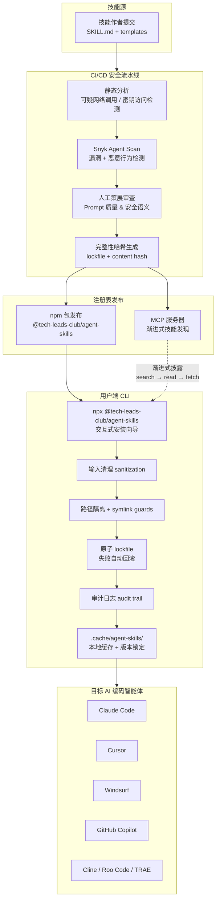

# agent-skills：面向专业 AI 编码智能体的安全技能注册表

> **快速信息卡**
>
> | 项目 | 信息 |
> |------|------|
> | 仓库 | [tech-leads-club/agent-skills](https://github.com/tech-leads-club/agent-skills) |
> | Stars | 6477 |
> | Forks | 537 |
> | 许可证 | MIT（代码）/ CC-BY-4.0（官方技能） |
> | 语言 | TypeScript |
> | 更新 | 2026-09-19 |

Snyk 2026 Agent Threat Report 给出一个数字：公开市场里 13.4% 的 AI 编码智能体技能包含关键级问题。换算下来，每安装 7 到 8 个技能就有一个可能带有关键级缺陷。AI 技能会以系统指令形式进入智能体的执行上下文，缺陷一旦被利用，影响范围比普通依赖更靠前。

[agent-skills](https://github.com/tech-leads-club/agent-skills) 由 Tech Leads Club 维护，把 AI 编码智能体（AI coding agent）的技能当成供应链依赖来管理。项目用 CI/CD 流水线、人工策展和 CLI 纵深防御，在技能从发布到安装的每一步留下可复查的痕迹。核心技术栈：Nx Cloud 多包管理、代码全部用 TypeScript 编写、MIT/CC-BY-4.0 双许可证。截至 2026 年 9 月，项目仍在活跃维护（最近一次推送在 2026-09-19），已支持 19 个 AI 编码智能体。

下面分两层看：catalog 侧的发布审查机制怎么挡住恶意技能，CLI 侧的安装路径怎么挡住路径穿越和供应链篡改。

## 学习目标

读完这篇文章后，你应该能够：

- 说出 agent-skills CLI 的五道防御关卡，以及每道关卡各自拦截哪类威胁
- 解释 lockfile 的四层保护（Zod schema、原子写入、内容哈希、移除授权）各自针对的威胁
- 通过 `npx @tech-leads-club/agent-skills` 交互式向导完成技能安装，并从审计日志还原操作历史
- 区分 CLI 安装和 MCP server 两种技能获取方式的安全边界和适用场景
- 为团队设计技能采用策略，判断哪些场景适合 agent-skills、哪些需要并行厂商市场

## 前置知识

阅读本文前，建议先了解以下概念：

- **AI 编码智能体**：能在 IDE 或终端里自主读写代码、执行命令的智能体，如 Claude Code、Cursor、Cline 等
- **供应链安全**：第三方依赖被植入恶意代码或静默更新带来的风险，以及 lockfile、内容哈希等应对手段
- **TypeScript 基础**：能看懂 `async/await`、`Promise`、模板字符串等语法，理解 `resolve()`、`normalize()` 等 Node.js path 模块函数的作用

## 目录

- [安全技能注册表的工作流](#安全技能注册表的工作流)
- [技能包的结构约定](#技能包的结构约定)
- [CLI 纵深防御的五道关卡](#cli-纵深防御的五道关卡)
  - [L1 — 输入清理](#l1--输入清理input-sanitization)
  - [L2 — 路径隔离](#l2--路径隔离filesystem-isolation)
  - [L3 — 符号链接防护](#l3--符号链接防护symlink-guard)
  - [L4 — 原子锁文件](#l4--原子锁文件lockfile-integrity)
  - [L5 — 审计日志](#l5--审计日志audit-trail)
- [支持的智能体平台](#支持的智能体平台)
- [精选技能一览](#精选技能一览)
- [任务流案例：从发现到审计的完整路径](#任务流案例从发现到审计的完整路径)
- [MCP 服务器：让 AI 自己发现技能](#mcp-服务器让-ai-自己发现技能)
- [FAQ](#faq)
- [自检测试](#自检测试)
- [采用建议与适用边界](#采用建议与适用边界)

## 安全技能注册表的工作流


```mermaid
flowchart TB
    subgraph Source["技能源"]
        A["技能作者提交<br/>SKILL.md + templates"]
    end

    subgraph Pipeline["CI/CD 安全流水线"]
        B["静态分析<br/>可疑网络调用 / 密钥访问检测"]
        C["Snyk Agent Scan<br/>漏洞 + 恶意行为检测"]
        D["人工策展审查<br/>Prompt 质量 & 安全语义"]
        E["完整性哈希生成<br/>lockfile + content hash"]
        B --> C --> D --> E
    end

    subgraph Registry["注册表发布"]
        F["npm 包发布<br/>@tech-leads-club/agent-skills"]
        G["MCP 服务器<br/>渐进式技能发现"]
    end

    subgraph Client["用户端 CLI"]
        H["npx @tech-leads-club/agent-skills<br/>交互式安装向导"]
        I["输入清理 sanitization"]
        J["路径隔离 + symlink guards"]
        K["原子 lockfile<br/>失败自动回滚"]
        L["审计日志 audit trail"]
        M[".cache/agent-skills/<br/>本地缓存 + 版本锁定"]
        H --> I --> J --> K --> L --> M
    end

    subgraph Agents["目标 AI 编码智能体"]
        N["Claude Code"]
        O["Cursor"]
        P["Windsurf"]
        Q["GitHub Copilot"]
        R["Cline / Roo Code / TRAE"]
    end

    A --> Pipeline
    E --> F
    E --> G
    F --> H
    G -.->|"渐进式披露<br/>search → read → fetch"| H
    M --> Agents
```

上图展示了一条完整的信任链：从技能源码提交到最终注入 AI 编码智能体的工作目录，每一步都留下可复查的痕迹。下面展开各环节的设计细节。

## 技能包的结构约定

每个技能遵循统一的目录布局。`SKILL.md` 是入口，`templates/` 存放可复制的文件骨架，`references/` 收纳按需加载的参考文档：

```text
packages/skills-catalog/skills/
  (category-name)/
    skill/
      SKILL.md
      templates/
      references/
```

这种约束让 CLI 和 MCP 服务器的路径解析保持确定性。没有 `../../` 逃逸，没有隐式依赖。

## CLI 纵深防御的五道关卡

agent-skills CLI 的安全实现构成了纵深防御体系，每一层独立失效时不导致其他层失效。

### L1 — 输入清理（Input Sanitization）

所有来自注册表、网络、用户输入的字符串在进入 CLI 核心逻辑前，先经过标准化和过滤。技能名称、平台标识符、文件路径等字段均作白名单校验。这一层拦截 `../../../etc/passwd`、`skill\0name`、`/etc/passwd`、`skill:name`、`.hidden` 等输入；超长名称统一截断到 255 字符（文件系统名长上限），清洗后为空的名字回落为 `unnamed-skill`。

### L2 — 路径隔离（Filesystem Isolation）

CLI 强制执行工作目录边界。安装目标路径永远被限制在用户指定的 agent 配置目录内。两个路径都经过 `resolve()` 完全解析——相对路径、符号链接、`..` 序列在比较前被消除。输入 `/etc/passwd` 或 `../../.ssh` 会被直接拒绝。这个守卫应用在每次写、读、删操作上。

### L3 — 符号链接防护（Symlink Guard）

安装过程中，CLI 用 `lstat()` 而不是 `stat()` 检测符号链接——`lstat()` 不跟随链接，能避免 TOCTOU（Time-of-Check-Time-of-Use）攻击。如果技能包内包含指向目标目录之外的 symlink，安装将中断。链式符号链接会被递归解析，最终目标必须落在允许目录内。`ELOOP` 错误（循环符号链接）会被捕获并强制删除链接。Windows 上则用目录联接（junction）替代符号链接，获得更好的系统级约束。

### L4 — 原子锁文件（Lockfile Integrity）

锁文件 `.agents/.skill-lock.json` 是已安装技能的事实来源（全局安装时位于用户主目录的 `.agents/` 下）。保护机制有四层，各自防的威胁不同：Zod schema 防格式损坏，原子写入防进程中断，内容哈希防事后篡改，移除授权防未授权删除。

Zod 读取时严格校验每个条目，格式损坏的锁文件会被优雅降级——拒绝坏条目、必要时回落到干净的空锁文件，而不是让 CLI 崩溃；旧版本（v1）锁文件会自动迁移到当前 schema。

锁文件从不原地写入，而是走三步：

```text
1. 备份现有文件  → .skill-lock.json.backup
2. 写入新内容    → .skill-lock.json.tmp
3. 原子重命名    → .skill-lock.json.tmp → .skill-lock.json
```

进程被 kill 时旧文件完好；重命名失败时临时文件被清理。每个已安装技能记录 SHA-256 内容哈希，由该技能所有文件计算得出。如果技能文件在安装后被篡改，下次操作时哈希不匹配会被检测到。移除授权是第四层：不在锁文件里的技能无法被 `remove` 删除，`--force` 可以绕过这道检查，但绕过行为本身会被写入审计日志。

### L5 — 审计日志（Audit Trail）

每次 install、update、remove 操作都追加到 `~/.agent-skills/audit.log`（可用 `agent-skills audit --path` 查看本机实际路径），格式是 JSON Lines：

```json
{"action":"install","skillName":"aws-advisor","agents":["claude-code","cursor"],"success":1,"failed":0,"timestamp":"2026-05-18T14:32:01Z"}
{"action":"remove","skillName":"aws-advisor","agents":["cursor"],"success":1,"failed":0,"forced":false,"timestamp":"2026-05-18T16:00:00Z"}
```

日志是 append-only——条目永不覆盖。取证时直接 grep 这个文件就能还原谁在何时装了什么。有一个边界值得知道：审计写入是 best-effort 的，文件系统故障时日志写入会静默跳过，不会让 install、remove、update 主流程失败——审计是事后取证的依据，不是实时的访问控制。

上述五道关卡之外，每个技能在进入注册表前都经过 [Snyk Agent Scan](https://github.com/snyk/agent-scan)（原 mcp-scan）的自动化扫描，检测提示注入、敏感数据处理、隐藏在自然语言中的恶意载荷等威胁。扫描是增量的：每个技能的内容哈希与上次扫描一致就直接命中缓存，只有内容变更的技能才重新扫描，这让扫描可以挂在每一次 PR 和发布上。发布管线把扫描设为必需步骤——扫描不过，release 发不出去。

## 支持的智能体平台

项目将所支持的 AI 编码智能体分为三个层级：

| 层级 | 平台 |
|------|------|
| Tier 1（主流） | Claude Code, Cline, Cursor, GitHub Copilot, Windsurf |
| Tier 2（上升期） | Aider, Antigravity, Gemini CLI, Kilo Code, Kiro, OpenAI Codex, Roo Code, TRAE |
| Tier 3（企业级） | Amazon Q, Augment, Droid (Factory.ai), OpenCode, Sourcegraph Cody, Tabnine |

分层来自官方 README，按 Popular / Rising / Enterprise 划分。19 个平台在锁文件 schema 里各自是独立的枚举值，安装时可以一次勾选多个目标，例如 `agent-skills install -s my-skill -a cursor claude-code`。

## 精选技能一览

| 技能 | 类别 | 说明 |
|------|------|------|
| `tlc-spec-driven` | 开发 | 四阶段项目规划（Specify → Design → Tasks → Implement），跨会话持久化记忆 |
| `aws-advisor` | 云 | AWS 架构设计、安全评审与实现指导，集成 AWS MCP 工具 |
| `playwright-skill` | 自动化 | 完整的浏览器自动化能力：页面测试、表单填写、截图、UX 验证 |
| `figma` | 设计 | 从 Figma 获取设计上下文并将节点转译为生产级代码 |
| `security-best-practices` | 安全 | 语言/框架专项安全评审，漏洞检测并生成修复建议 |

每个技能的 `SKILL.md` 都经过维护者人工审查（human curation），重点盯安全边界——官方威胁模型把这一层列为对提示注入的防线：目录里的每一条提示词都由维护者逐一代码审查。

## 任务流案例：从发现到审计的完整路径

以下以一个真实场景为例，展示一个技能从发现到审计的完整流程。

**场景**：团队同时使用 Claude Code 和 Cursor，需要统一的 AWS 安全评审标准。决定安装 `aws-advisor` 技能，并保留完整的审计记录。

### 第一步：发现技能

通过 MCP server 的 `search_skills` 工具搜索 AWS 相关技能。AI 编码智能体在会话中调用：

```text
search_skills("aws security")
```

返回候选技能列表，其中 `aws-advisor` 匹配需求。接着用 `read_skill` 读取 `SKILL.md` 主指令，确认技能的工作流和触发条件符合团队评审流程。

### 第二步：发布前验证

在安装前，有几样东西可以在 [GitHub 仓库](https://github.com/tech-leads-club/agent-skills)里直接查阅：

- `packages/skills-catalog/skills/` 下该技能的 `SKILL.md` 全文和 `references/`——这是人工审查的对象，值得自己读一遍
- `packages/skills-catalog/security-scan-allowlist.yaml`——扫描豁免记录，每条写明技能、告警代码、豁免理由、批准人和有效期，过期条目会自动重新触发告警
- Releases 页（tag 形如 `skills-catalog-v0.17.9`）——技能目录的版本演进

内容哈希不在仓库里，它在安装时由 CLI 自动校验（见下一步）。完成审查后再进入安装。

### 第三步：交互式安装

```bash
npx @tech-leads-club/agent-skills
```

首次运行进入交互式安装向导。向导会检测本机已安装的 AI 编码智能体。按以下步骤操作：

```text
1. 选择动作："Install skills"
2. 搜索 aws-advisor
3. 选择目标智能体：Claude Code + Cursor
4. 选择安装方式：Copy（推荐）或 Symlink
5. 选择范围：Global（用户主目录）或 Local（仅当前项目）
```

CLI 拿到技能名 `aws-advisor` 后，先过 `sanitizeName()` 清理输入，确认没有路径分隔符和 null 字节。然后从 CDN 拉取技能包，缓存到 `~/.cache/agent-skills/`。下载完成后按"排序路径 + 文件字节"计算 SHA-256 内容哈希，跟注册表元数据里的哈希比对——不一致就直接报 `Checksum mismatch` 中止，提示 CDN 内容可能被篡改或与注册表脱节。

安装写入时，目标路径过 `isPathSafe()` 验证，确认落在 Claude Code 和 Cursor 的技能目录内（`~/.claude/skills/aws-advisor/` 和 `~/.cursor/skills/aws-advisor/`）。写入完成后，锁文件 `.agents/.skill-lock.json` 通过原子写入更新，记录技能名、安装路径、内容哈希、安装时间。

### 第四步：验证审计日志

安装完成后，查看 `~/.agent-skills/audit.log`，确认操作被记录：

```json
{"action":"install","skillName":"aws-advisor","agents":["claude-code","cursor"],"success":1,"failed":0,"timestamp":"2026-05-18T14:32:01Z"}
```

日志包含操作类型、技能名、目标智能体、成功/失败计数和时间戳。任何后续的 update 或 remove 操作都会追加新条目。

### 第五步：在 AI 编码智能体中触发技能

安装后，在 Claude Code 会话中直接引用技能名称：

```text
请使用 aws-advisor 技能评审我的 S3 桶权限配置
```

Claude Code 会自动加载 `~/.claude/skills/aws-advisor/SKILL.md` 作为系统指令，按照技能定义的流程执行 AWS 安全评审。

任何一道关卡失败都会中断安装——下载校验不过、路径检查不过，CLI 都会停下来报错。锁文件因为走"备份 → 临时文件 → 原子重命名"的写入路径，不会停留在半写入状态。

## MCP 服务器：让 AI 自己发现技能

agent-skills 提供了独立的 MCP 服务器 `@tech-leads-club/agent-skills-mcp`，让 AI 编码智能体在运行时按需查询技能目录。设计思路是渐进式披露（progressive disclosure）——先搜索，确需时再拉取完整内容，避免上下文污染。

```json
{
  "mcpServers": {
    "agent-skills": {
      "command": "npx",
      "args": ["-y", "@tech-leads-club/agent-skills-mcp"]
    }
  }
}
```

四个 MCP 工具：

| 工具 | 功能 | 适用阶段 |
|------|------|----------|
| `list_skills` | 按类目浏览全部技能 | 探索 |
| `search_skills` | 模糊搜索技能名称和描述 | 发现 |
| `read_skill` | 读取技能的 `SKILL.md` 主指令 | 决策 |
| `fetch_skill_files` | 拉取指定参考文件（templates/references，单次最多 5 个） | 执行 |

官方对 `list_skills` 有明确的调用纪律：只应在用户明确要求浏览/列出目录时调用，避免无谓的上下文开销。

这种设计让 AI 编码智能体按需"翻阅目录→选中→加载"，和人类查阅文档的行为一致。MCP server 的安全设计：只读，没有写权限；本地 stdio 通信，无网络暴露端点；`fetch_skill_files` 在发起网络请求前验证文件路径是否在 registry 的 `files[]` 数组里，无法获取任意 URL；不访问本地文件系统；stdout 专用于 JSON-RPC 协议，所有日志走 stderr，避免日志混进协议流。

## FAQ

**Q1：agent-skills 和直接克隆 GitHub 仓库手动复制技能有什么区别？**

手动复制绕过了所有安全检查：没有内容哈希验证、没有 Snyk Agent Scan 扫描结果、没有原子安装和回滚、没有审计日志。agent-skills CLI 的每一层防御都针对真实攻击面，留下可复查的痕迹。

**Q2：我的团队内部开发了私有技能，能接入 agent-skills 的安装流程吗？**

当前 agent-skills 的注册表来自官方 CDN，没有开箱即用的私有 registry 支持。私有技能可以 fork 项目，按 `packages/skills-catalog/` 的目录约定发布自己的技能源。供应链加固方向（签名注册表、可复现构建、依赖图、离线安装）已有社区提案（issue #197）在讨论，关注项目的 GitHub Issues 获取最新进展。

**Q3：安装技能后，如何确认它没有被篡改？**

查看锁文件 `.agents/.skill-lock.json`，里面记录了每个已安装技能安装时计算的 SHA-256 内容哈希。手动对该技能目录下所有文件重新计算哈希，跟锁文件里的值比对——如果不一致，说明技能文件在安装后被改动过。下次执行任何 agent-skills 操作时，CLI 也会自动做这个比对，哈希不匹配会被检测到。

**Q4：agent-skills 的性能开销有多大？对 AI 编码智能体的响应速度有影响吗？**

安全校验（sanitization、路径检查、哈希验证）在安装时一次性完成。技能目录的注册表清单本身约 45KB（README 口径），下载和校验都只发生一次。安装后，技能文件以纯文本 Markdown 形式注入 AI 编码智能体的系统指令中，没有运行时性能开销。MCP 服务器的渐进式披露设计进一步确保了上下文窗口不会被无关内容填满。

**Q5：如果 Snyk Agent Scan 漏报了漏洞怎么办？后续有补救措施吗？**

安全是分层防御，单点漏报不等于全链路失守。即使扫描漏报，路径隔离和 symlink guards 仍然限制了攻击面。同时，所有技能 100% 开源且无二进制依赖，社区可以进行独立审计。发现漏报后，不要开公开 issue——官方安全政策要求通过 GitHub Security Advisory（私有，仅维护者可见）提报，附上漏洞描述、复现步骤、受影响组件和潜在影响；维护者承诺 48 小时内确认、14 天内修复已确认的漏洞。

**Q6：多个 AI 编码智能体能共享同一份技能安装吗？**

可以。在交互式向导中选择 Global 范围，技能会安装到用户主目录下的各智能体配置目录（如 `~/.claude/skills/`、`~/.cursor/skills/`），一次安装、多个智能体可用。向导也支持一次勾选多个目标智能体（命令行的 `-a` 参数同样支持），锁文件条目的 `agents` 字段会记录这份技能装到了哪些智能体。

**Q7：项目使用的是什么开源许可证？对商业使用有限制吗？**

软件本体（CLI、脚本、工具）使用 MIT 许可证；官方维护者编写的技能文件默认使用 CC-BY-4.0，两者均允许商业使用，CC-BY-4.0 只要求署名。注意目录里还收录了社区第三方技能，这部分保留其原有许可证和版权，使用前看各技能目录下的许可文件（部分附有 LICENSE.txt）。官方要求无论怎么使用技能目录，都必须给 Tech Leads Club 署名。可以将 agent-skills 集成到企业内部的 AI 开发工作流中，无需额外授权。

## 自检测试

在你的环境中完成以下 6 项检查，确认 agent-skills 正确运行：

- [ ] **CLI 可执行**：运行 `npx @tech-leads-club/agent-skills --version`，确认输出版本号且不报错
- [ ] **交互式向导可启动**：运行 `npx @tech-leads-club/agent-skills`，确认进入安装向导并检测到本机已安装的 AI 编码智能体
- [ ] **技能可安装**：在向导中选择 `tlc-spec-driven` 技能，安装到 Claude Code，然后确认 `~/.claude/skills/tlc-spec-driven/SKILL.md` 文件存在且内容非空
- [ ] **锁文件生成**：安装后确认 `.agents/.skill-lock.json` 包含刚安装的技能条目，记录了技能名、路径和 SHA-256 内容哈希（全局安装时锁文件在用户主目录的 `.agents/` 下）
- [ ] **审计日志生成**：确认 `~/.agent-skills/audit.log` 包含刚才的安装记录，格式为 JSON Lines，包含时间戳和操作类型
- [ ] **MCP 服务器可启动**：在 AI 编码智能体的 `mcpServers` 配置中添加 agent-skills MCP 条目，重启后确认智能体可以调用 `list_skills` 工具

全部通过后，你的 agent-skills 部署即处于生产就绪状态。

## 采用建议与适用边界

**企业安全团队**需要管控 AI 编码智能体使用的工具集——agent-skills 发布侧的多层审查（静态分析、扫描、人工策展）和 CLI 审计日志能直接接入安全合规流程。从 `npx @tech-leads-club/agent-skills` 开始，先在开发环境安装 `security-best-practices` 技能，跑一轮安全审查流程，确认审计日志和 lockfile 机制符合内部要求，再推广到生产智能体。

**开发团队**用 Claude Code 或 Cursor 做日常编码，想装社区技能但担心供应链风险——agent-skills 的 lockfile + 内容哈希能挡住静默更新，Snyk Agent Scan 能挡住提示注入和恶意载荷。把 agent-skills 作为技能安装的唯一入口，禁用智能体自带的社区技能市场，可以收窄攻击面。

**智能体框架开发者**参考安全技能的设计规范——SECURITY.md 里的威胁模型表、CLI 纵深防御代码、allowlist 机制可以直接复用到自己的技能市场里。lockfile 原子写入和符号链接防护这两段代码值得直接复用。

**采用顺序建议**：

1. 在开发环境运行 `npx @tech-leads-club/agent-skills`，安装 `security-best-practices` 技能，熟悉交互式向导和锁文件机制
2. 检查 `~/.agent-skills/audit.log` 和 `.agents/.skill-lock.json`，确认审计日志和内容哈希符合内部安全要求
3. 在团队内部推广，统一技能安装入口，禁用智能体自带的社区技能市场
4. 配置 MCP server 用于运行时技能发现，CLI 安装用于长期使用的核心技能
5. 对于安全敏感场景（凭据访问、文件系统操作、网络调用），优先走 agent-skills；对于长尾技能需求，可并行使用厂商市场

**适用边界**：agent-skills 的 catalog 规模还小（当前 92 个技能、14 个分类），技能数量和覆盖面不如 Claude Code 或 Cursor 的官方市场。如果团队需要的技能不在 catalog 里，要么自己写技能提交审核，要么等社区贡献。对于需要大量长尾技能的团队，目前可能需要 agent-skills + 厂商市场并行使用，把安全敏感场景的技能走 agent-skills，其他技能走厂商市场。

完整威胁模型和漏洞报告流程见 [SECURITY.md](https://github.com/tech-leads-club/agent-skills/blob/main/SECURITY.md)。官方文档在 https://agent-skills.techleads.club/。

## 练习与自测

### 练习一：配置自定义技能并接入 CLI

1. 从现有技能（如 `aws-advisor`）复制一份 SKILL.md，改名为 `my-team-standard`
2. 在 SKILL.md 正文里加入你团队的代码规范检查项（例如"所有 SQL 必须有 EXPLAIN 注释"）
3. 用 `npx @tech-leads-club/agent-skills` 安装到本地 Claude Code，验证技能能被正确加载
4. 记录安装过程中锁文件的变化：`.agents/.skill-lock.json` 中是否出现了你的技能条目、内容哈希是否匹配

> 提示：修改后需要重新运行 CLI 安装。技能文件是纯 Markdown，改完直接重装即可生效，不需要重新编译。

### 练习二：审计日志取证

1. 故意执行一次失败的技能安装（例如网络断开时安装、或指定不存在的技能名）
2. 查看 `~/.agent-skills/audit.log`，确认失败操作是否被记录
3. 对比成功和失败两条日志条目的字段差异（哪些字段只在成功时出现？哪些字段在失败时也会记录？）
4. 写一条 `grep` 命令，从审计日志中筛选出所有失败操作

> 提示：审计日志是 append-only 的 JSON Lines 格式，直接用 `jq` 或 `grep` 就能查询。

---

## 自测题

下面 5 道题用来检验你对全文核心概念的掌握程度。点击参考答案前的三角展开查看解析。

1. 说出 agent-skills CLI 的五道防御关卡，以及每道关卡各自拦截哪类威胁。

<details>
<summary>参考答案</summary>

| 关卡 | 拦截的威胁 |
|------|--------------|
| L1 输入清理 | 路径遍历（`../../../etc/passwd`）、null 字节（`\0`）、超长名称（截断到 255 字符） |
| L2 路径隔离 | 安装目标路径逃逸出允许的 agent 配置目录 |
| L3 符号链接防护 | 通过 symlink 绕过路径检查（TOCTOU 攻击） |
| L4 原子锁文件 | 进程中断导致锁文件损坏、恶意篡改已安装技能内容 |
| L5 审计日志 | 操作后无法追溯"谁在何时装了什么" |

（对应章节：CLI 纵深防御的五道关卡）

</details>

2. 解释 lockfile 的四层保护（Zod schema、原子写入、内容哈希、移除授权）各自针对的威胁。

<details>
<summary>参考答案</summary>

- **Zod schema 验证**：防止锁文件格式损坏或被恶意篡改结构（例如注入额外字段）；损坏的锁文件被优雅降级，而不是让 CLI 崩溃
- **原子写入（备份 → tmp → 重命名）**：防止进程被 kill 时锁文件处于半写入状态，导致下次读取失败
- **内容哈希（SHA-256）**：防止已安装的技能文件被静默篡改，下次操作时哈希不匹配可被检测
- **移除授权**：不在锁文件里的技能无法被 `remove` 删除；`--force` 可绕过但会被写入审计日志

（对应章节：L4 — 原子锁文件）

</details>

3. 区分 CLI 安装和 MCP server 两种技能获取方式的安全边界和适用场景。

<details>
<summary>参考答案</summary>

| 维度 | CLI 安装 | MCP server |
|------|-----------|-------------|
| 安全校验 | 安装时一次性完成（输入清理、路径检查、哈希验证） | 只读，无写权限；`fetch_skill_files` 验证文件路径在 registry 的 `files[]` 内 |
| 适用场景 | 长期使用的核心技能 | 运行时按需发现技能（渐进式披露） |
| 网络暴露 | 无（本地 stdio） | 无（本地 stdio） |
| 上下文占用 | 安装后技能文件直接注入系统指令 | 按需拉取，不预加载全部技能 |

（对应章节：MCP 服务器）

</details>

4. 复述一次完整的技能安装流程，从发现技能到在 Claude Code 中触发技能。

<details>
<summary>参考答案</summary>

1. **发现**：通过 MCP server 的 `search_skills("aws security")` 搜索，或手动浏览 catalog
2. **审查**：用 `read_skill` 读取 SKILL.md，或到仓库里查扫描豁免记录（allowlist）
3. **安装**：运行 `npx @tech-leads-club/agent-skills`，交互式选择技能和目标平台
4. **校验**：CLI 清理输入 → 验证路径 → 计算内容哈希 → 原子写入锁文件 → 写入审计日志
5. **触发**：在 Claude Code 会话中引用技能名称（如"请使用 aws-advisor 技能评审我的 S3 桶权限配置"）

（对应章节：任务流案例）

</details>

5. 为团队设计技能采用策略：哪些场景适合 agent-skills、哪些需要并行厂商市场？

<details>
<summary>参考答案</summary>

**适合 agent-skills 的场景**：
- 安全敏感操作（凭据访问、文件系统写操作、网络调用）
- 需要审计日志和锁文件追踪的合规场景
- 团队需要统一技能版本管理

**需要并行厂商市场的场景**：
- 需要大量长尾技能（catalog 规模还小，目前 92 个技能、14 个分类，只覆盖常见场景）
- 团队已经在使用 Claude Code / Cursor 官方市场，且技能不涉及安全敏感操作

**推荐策略**：安全敏感技能走 agent-skills，长尾技能可并行使用厂商市场。

（对应章节：采用建议与适用边界）

</details>

[↑ 回到目录](#目录)

---

## 进阶路径

跑通基本流程后，下面几条方向可以按兴趣挑选：

1. **读 CLI 源码**：克隆 [tech-leads-club/agent-skills](https://github.com/tech-leads-club/agent-skills)，重点看 `libs/core/src/lib/utils.ts`（`sanitizeName`、`isPathSafe` 的实现）和 `libs/core/src/lib/services/` 下的 `installer.service.ts`、`lockfile.service.ts`、`audit-log.service.ts`，理解五道关卡的具体代码逻辑。
2. **研究发布流水线**：看 `packages/skills-catalog/` 的目录布局和 `release.yml` 工作流——扫描是发版的必需步骤，理解一个技能从提交到进入注册表要经过哪些关卡，再考虑如何把团队私有技能按同样的结构约定发布。
3. **集成到团队 CI**：在 CI 中加入技能锁文件检查——如果 `.agents/.skill-lock.json` 中出现未审核的技能条目，阻断合并。可以参考项目中 `SECURITY.md` 的威胁模型表设计检查规则。
4. **给上游提 issue 或 PR**：遇到 bug 或缺失功能时，先在 [tech-leads-club/agent-skills](https://github.com/tech-leads-club/agent-skills) 搜索现有 issue，没有再提新 issue；有能力的可以直接提 PR。
5. **研究 MCP server 的实现**：看 `packages/mcp/src/tools/` 目录，理解 `list_skills`、`search_skills`、`read_skill`、`fetch_skill_files` 四个工具的实现，以及 `fetch_skill_files` 如何在发起网络请求前验证文件路径在 registry 的 `files[]` 数组内。

[↑ 回到目录](#目录)

---

## 资料口径说明

本文基于 agent-skills 项目的 GitHub 仓库（[tech-leads-club/agent-skills](https://github.com/tech-leads-club/agent-skills)）中的以下来源进行判断和撰写：

1. **官方文档**：项目 README.md、SECURITY.md、官方网站（https://agent-skills.techleads.club/）
2. **源代码**：`libs/core/src/lib/` 下的 utils、installer、lockfile、audit-log 实现，`packages/mcp/` 下的 MCP 工具实现
3. **Snyk Agent Scan**：扫描工具的 [官方仓库](https://github.com/snyk/agent-scan)说明与技能生态技术报告
4. **发布元数据**：GitHub API（stars/forks/最近推送）、npm registry（CLI 1.4.10 / MCP 0.1.6）、Releases（catalog v0.17.9）

**局限性说明**：

- 项目仍在快速迭代，部分细节可能在未来版本中变化。本文数据与源码行为以 2026-09-20 复核的 main 分支为口径（CLI v1.4.10、skills-catalog v0.17.9），建议在使用前查看项目最新文档。
- 审计日志路径、锁文件备份文件名等以源码常量为准（`~/.agent-skills/`、`.skill-lock.json.backup`）；官方 SECURITY.md 中写的 `~/.config/agent-skills/` 与 `.bak` 已与代码不一致，以本文和 `agent-skills audit --path` 的输出为准。
- 支持的平台列表可能随版本更新而变化，请以项目 GitHub 仓库的 README.md 为准。
- 本文未覆盖所有 CLI 命令和配置选项，仅聚焦核心安全机制和典型使用场景。

## 结语

大多数 AI 技能市场优先做的是降低贡献门槛和扩大技能数量，agent-skills 把优先级倒过来：CI/CD 流水线、人工策展、CLI 纵深防御三件事先到位，再谈技能数量。每个技能包上那枚 SHA-256 内容哈希是这条路线的落点——它让"这个技能安装后没被改过"变成可复查的事实，而不是一句承诺。

对于把 AI 编码智能体引入生产流水线的团队，供应链安全是前置条件。agent-skills 把这个前置条件收进一条 `npx @tech-leads-club/agent-skills` 命令里。

