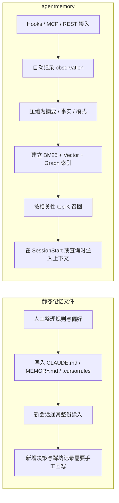

> **目标读者**：已经在使用 Claude Code、Cursor、Gemini CLI、Codex CLI 等 AI 编程 Agent，并且切身感受过“每开一个新会话就要重新解释项目”的开发者。
> **核心问题**：agentmemory 到底解决了什么问题？它和 `CLAUDE.md`、`MEMORY.md`、`.cursorrules` 这类静态记忆文件有什么本质区别？
> **资料范围**：本文以 agentmemory 的 GitHub README、benchmark 目录、集成说明和 iii 相关公开资料为主；凡无法在公开资料中直接证实的说法，本文不沿用。

---

## 阅读目标

读完这篇文章，你应该能回答四个问题：

- agentmemory 的定位是什么，适合什么场景，不适合什么场景。
- 它的记忆流水线、四层巩固模型和混合检索是怎么工作的。
- 在 Claude Code、Cursor、Gemini CLI 等环境里，应该用哪一种接入方式。
- README 里的性能数字分别代表什么，哪些可以直接采信，哪些要结合使用边界来理解。

## 1. 它解决的不是“笔记整理”，而是会话记忆断层

AI 编程 Agent 最大的问题，往往不是不会写代码，而是**每次会话都像第一次接手项目**。上一轮你已经解释过目录结构、鉴权方案、依赖约束、踩过的坑；下一轮它还是要重新理解一遍。随着项目变大，这种重复会带来三个直接成本：

- 上下文要反复重塞，token 消耗持续升高。
- 关键决策散落在对话里，过几天几乎无法复用。
- 当你同时在多个 Agent 之间切换时，记忆无法共享，等于每个 Agent 都从零开始。

只靠静态记忆文件通常不够。`CLAUDE.md`、`MEMORY.md`、`.cursorrules` 这类文件适合放项目约束、代码风格和长期规则，但它们本质上还是手工维护的说明文档，不会自动记录工具调用、不会做相关性检索，也不擅长处理“上次修过什么 bug”这类动态历史。

两类方案的差别可以先压缩成下面这张表：

| 方案 | 本质 | 优点 | 短板 |
| --- | --- | --- | --- |
| 静态记忆文件 | 手工维护的规则说明 | 简单、透明、零运行时 | 容易过时，无法按相关性召回，跨 Agent 难共享 |
| agentmemory | 本地运行的可检索记忆服务 | 自动捕获、压缩、检索、回灌上下文 | 需要运行时与集成配置 |

对长期编码工作流来说，差别不在于“能不能存信息”，而在于这些信息能不能在下一次会话里按相关性被重新取回。

### 1.1 一张图看懂：静态记忆文件 vs agentmemory



静态记忆文件负责沉淀规则，agentmemory 负责把历史工作转成可检索上下文。前者更轻，后者更强，也更接近一套运行中的基础设施。

## 2. agentmemory 到底是什么

按照项目自己的定义，agentmemory 是一个**构建在 iii engine 之上的持久化记忆系统**，面向支持 hooks、MCP 或 REST API 的 AI Agent。它不是某个特定 Agent 的插件，而是一台本地运行的记忆服务器，不同 Agent 可以共用同一份记忆层。

截至 2026 年 5 月 10 日，GitHub 页面显示这个项目大约有 3.8k stars。README 首页同时给出了几组最常被引用的数据：

- 95.2% 的检索 R@5
- 约 92% 的 token 节省
- 51 个 MCP tools
- 12 个自动 hooks
- 827 个通过的测试
- 不依赖外部数据库服务

这些数字都能在 README 中找到出处，但不能脱离 benchmark 口径和默认配置单独理解。更接近工程现实的判断是：agentmemory 已经把自动采集、混合检索、本地运行和多 Agent 接入打包成了一个成品系统，而不是一个只有 API 的 memory SDK。

项目对外暴露的形态主要有三层：

- 一个完整运行的本地服务，负责 API、viewer、hooks、压缩和回放。
- 一个可独立接入的 MCP server，适合 Cursor、Claude Desktop、Cline 这类支持 MCP 的客户端。
- 一组对外集成接口，包括 REST API、resources、prompts 和 skills。

它要替代的不是笔记文件本身，而是每次都要重新解释项目背景的那部分重复劳动。

## 3. 它是怎么“记住东西”的

### 3.1 记忆流水线

README 对 agentmemory 的工作方式给出了比较完整的流水线描述。它不是“写入一条记忆，再搜索一条记忆”的简单循环，而是一套围绕 session 组织的处理链路。

```text
PostToolUse
    -> 去重与隐私过滤
    -> 保存原始 observation
    -> 压缩为结构化事实 / 概念 / 叙事
    -> 生成 embedding
    -> 建立 BM25 + vector 索引

Stop / SessionEnd
    -> 汇总会话
    -> 可选的知识图谱抽取
    -> 可选的 slot reflection

SessionStart
    -> 读取项目画像
    -> 混合检索相关记忆
    -> 在 token 预算内注入上下文
```

这里有两个经常被忽略的前提。

- **自动捕获依赖 hooks 或专门集成**。如果你的 Agent 只接了一个纯 MCP server，而没有 hook 机制，那么你拿到的主要是“能查、能写”的工具接口，不一定能获得 Claude Code 插件那种几乎无感的自动捕获体验。
- **很多高级能力默认不是全开**。README 的配置章节明确写到，像 `AGENTMEMORY_AUTO_COMPRESS`、`AGENTMEMORY_INJECT_CONTEXT`、`AGENTMEMORY_SLOTS`、`GRAPH_EXTRACTION_ENABLED` 这类功能默认关闭。它的思路不是“默认替你做完一切”，而是先保证系统可控，再把更激进的自动化能力交给用户按需启用。

### 3.2 核心概念：四层巩固模型

介绍 agentmemory 时，最容易误解的地方是把它概括成“Capture / Organize / Retrieve / Forget”四阶段生命周期。根据 README，项目真正强调的是 **4-Tier Memory Consolidation**，也就是四层记忆巩固模型：

| 层级 | 保存什么 | 解决什么问题 |
| --- | --- | --- |
| Working | 工具调用产生的原始 observation | 保留最接近现场的短期记忆 |
| Episodic | 压缩后的会话摘要 | 回答“上一次发生了什么” |
| Semantic | 抽取出的事实、模式与稳定知识 | 回答“这个项目长期成立的事实是什么” |
| Procedural | 工作流、决策套路与可复用做法 | 回答“这类事情通常怎么做” |

这个模型的重点在于，agentmemory 并不是把所有信息平铺存起来，而是让项目知识逐步沉淀成不同密度、不同稳定性的记忆层。README 还明确提到记忆会衰减、强化、自动淘汰，并尝试解决陈旧记忆和矛盾事实的问题。

### 3.3 混合检索不是一句口号

agentmemory 的检索不是单一向量检索，而是三路信号混合：

| 检索流 | 作用 | 何时可用 |
| --- | --- | --- |
| BM25 | 关键词、术语、文件名、精确短语命中 | 始终可用 |
| Vector | 语义相似度检索 | 配置了 embedding provider 后可用 |
| Graph | 根据实体关系做图遍历 | 有图谱抽取或可识别实体时可用 |

三路结果最后用 Reciprocal Rank Fusion（RRF）做融合，并且会做 session 级别去重，避免结果全都来自同一段历史。这套检索方式很贴近编程场景：一部分查询明显依赖关键词，例如包名、文件路径、错误码；另一部分更像语义召回，例如“数据库性能优化”“之前那次鉴权改造”。

要跑完整的语义检索，README 推荐安装本地 embedding：

```bash
npm install @xenova/transformers
```

默认推荐的本地模型是 `all-MiniLM-L6-v2`。此外也支持 Gemini、OpenAI、Voyage、Cohere、OpenRouter 等 embedding 来源。

## 4. 快速开始：先分清完整服务和独立 MCP

agentmemory 的第一层使用门槛，不是配置文件，而是先分清自己要什么能力。

需要完整体验，包括 viewer、REST API、session replay、自动 hooks、压缩和回灌时，应该启动完整服务：

```bash
# 终端 1：启动完整服务
npx @agentmemory/agentmemory

# 终端 2：导入演示数据，直接看 recall 效果
npx @agentmemory/agentmemory demo

# 打开实时 viewer
open http://localhost:3113
```

README 的开发章节给出的前提是 Node.js >= 20，并且本地需要有 `iii-engine` 或 Docker。可以把它理解成：完整模式会启动一个真正的本地运行时，而不是单个脚本命令。

只需要把它接成 MCP server，而不关心 viewer、REST API、cron 或完整运行时时，可以走更轻的独立 MCP 方式：

```bash
npx -y @agentmemory/agentmemory mcp
# 或者使用 shim 包
npx -y @agentmemory/mcp
```

这两条命令是当前 README 能直接证实的官方启动方式，也比一些早期文章中流传的 `agentmemory server --mcp` 更准确。

### 4.1 Cursor 这类纯 MCP 客户端怎么接

以 Cursor 为例，README 给出的方式是在 MCP 配置中添加：

```json
{
    "mcpServers": {
        "agentmemory": {
            "command": "npx",
            "args": ["-y", "@agentmemory/mcp"]
        }
    }
}
```

这类接法的优点是简单直接，几乎所有支持 MCP 的客户端都能套用同一种模式。限制也很明确：如果客户端没有 hook 机制，你主要得到的是记忆工具能力，而不是完整的自动会话捕获。

### 4.2 Claude Code 的接法更深一些

Claude Code 是 agentmemory 重点照顾的场景。README 给出的推荐路径是：

1. 单独开一个终端运行 `npx @agentmemory/agentmemory`。
2. 在 Claude Code 里执行 `/plugin marketplace add rohitg00/agentmemory`。
3. 再执行 `/plugin install agentmemory`。

按 README 的说法，这条路径会同时注册 12 个 hooks、4 个 skills，并通过 `.mcp.json` 自动接上 `@agentmemory/mcp`，因此它的“自动记忆”体验通常会比纯 MCP 接法更完整。

### 4.3 其他 Agent 接入方式

README 当前列出的支持对象非常多，远不止 Claude Code、Cursor、Gemini CLI、Codex CLI 这几个名字。公开列出的对象还包括 OpenClaw、Hermes、OpenCode、Cline、Goose、Kilo Code、Claude Desktop、Windsurf、Roo Code、Aider 等。

这些接法大致分三类：

- **MCP 模式**：Cursor、Claude Desktop、Cline、Gemini CLI、Codex CLI、OpenCode 等。
- **插件 / provider 模式**：Claude Code、Hermes、OpenClaw。
- **REST API 模式**：Aider 或任意能发 HTTP 请求的 Agent。

例如 README 就给了一个最简单的 REST 查询例子：

```bash
curl -X POST http://localhost:3111/agentmemory/smart-search \
    -H "Content-Type: application/json" \
    -d '{"query": "auth"}'
```

## 5. “51 个 MCP 工具”不是全部答案

很多介绍文章都会突出“51 个 MCP tools”，但只停在这个数字，很容易把它误读成一份工具清单。README 更完整的表述是：**51 tools、6 resources、3 prompts、4 skills**。

这意味着 agentmemory 暴露给客户端的并不只是函数调用接口，还包括面向上下文注入、状态读取和工作流协作的附加能力。

对大多数人来说，最先用到的通常是下面几类：

| 能力类型 | 代表项 | 用途 |
| --- | --- | --- |
| 回忆与检索 | `memory_recall`、`memory_smart_search`、`memory_file_history` | 找回过去的观察、文件历史和相关上下文 |
| 主动写入 | `memory_save` | 把决策、经验、偏好保存成长期记忆 |
| 会话理解 | `memory_sessions`、`memory_timeline`、`memory_profile` | 看最近会话、时间线和项目画像 |
| 导出与关系查询 | `memory_export`、`memory_relations`、`memory_graph_query` | 导出记忆、查看事实之间的关联 |
| 治理与验证 | `memory_governance_delete`、`memory_verify` | 审计删除、追溯记忆来源 |
| 多 Agent 协作 | `memory_lease`、`memory_signal_send`、`memory_team_share` | 并行协作、消息传递、团队共享 |

此外还有一组不是 tools 的接口：

- resources，例如 `agentmemory://status`、`agentmemory://project/{name}/profile`
- prompts，例如 `recall_context`、`session_handoff`
- skills，例如 `/remember`、`/recall`、`/forget`

只把这一节理解成“51 个 MCP 工具一览”，会低估它的完整度。agentmemory 更像是在把长期记忆做成一套可调用的能力面，而不仅是若干条 CRUD 命令。

## 6. 为什么 iii 在这里不是幕后依赖

很多同类项目的实现思路是“一个 Node 或 Python 服务 + 一个向量数据库 + 一个 Viewer + 一层工具接口”。agentmemory 走的不是这条路。README 在架构部分反复强调，它本身就是一个运行中的 iii 实例，functions、triggers、KV state、streams、OTEL traces 都是 iii primitives。

这里的关键点在于，iii 对它来说不是内部依赖，而是产品边界的一部分。你会直接用到这些 iii 能力：

- `iii console --port 3114` 用来查看 traces、streams、state 和函数调用。
- `iii worker add iii-cron` 为记忆巩固、衰减和定时任务提供调度。
- `iii worker add iii-observability` 打开可观测性链路。
- `iii worker add iii-queue` 处理 embedding 和压缩任务的重试。
- `iii worker add iii-database` 在需要时切换到 SQL-backed state adapter。

README 甚至把“viewer 看记住了什么，iii console 看它做了什么”明确区分开了：

- viewer 适合看会话、记忆、图谱、health dashboard。
- iii console 适合看函数级执行、流、KV、trace waterfall 和 runtime 配置。

因此，agentmemory 看起来更像一个完整系统，而不只是记忆层 SDK。它把运行、回放、观测、扩展和治理一起交付出来了。

## 7. README 里的指标该怎么读

这些指标可以引用，但最好连同使用边界一起看。下面这张表更接近工程上的理解方式：

| 指标 | 官方口径 | 更稳妥的理解 |
| --- | --- | --- |
| 检索 R@5 | 95.2%，基于 LongMemEval-S（500 questions） | 说明混合检索能力不弱，但这是 README 的 benchmark 口径，不是独立第三方复测 |
| Token 节省 | 92% fewer tokens，约 `~1,900 tokens/session` | 说明“按需召回”明显优于每轮全量塞上下文，但不同项目的节省比例会随工作流波动 |
| 12 auto hooks | 首页 badge 与集成说明都在强调 | 这个数字更适用于支持 hooks 的深度集成场景，不应机械套到所有 MCP 客户端 |
| 0 external DBs | 首页 badge 与对比表中明确给出 | 正确理解是“不需要另起一套外部数据库服务”，不是“零运行时依赖” |
| 827 tests passing | 首页 badge 中给出 | 说明项目测试覆盖比较积极，但不能替代你对自身集成路径的验证 |

这些数字适合帮助读者建立预期，不适合脱离场景直接当成结论。benchmark 口径、适用边界和默认配置，最好一起交代。

## 8. 如果和 claude-mem、mem0、Letta 摆在一起看

单看“都有 memory”这个标签，很容易把它们混成同一类项目。实际上这几种方案切入的层级并不一样。对大多数开发者来说，关键问题不是谁更强，而是要给现有 Agent 补一层记忆，还是引入一套新的 agent 平台。

| 项目 | 更接近什么 | 更适合谁 | 和 agentmemory 的关键差异 |
| --- | --- | --- | --- |
| agentmemory | 记忆引擎 + MCP server + 本地运行时 | 已经在用 Claude Code、Cursor、Codex CLI、Gemini CLI 等现成 Agent，希望跨会话、跨 Agent 共享记忆的开发者 | 不要求你换掉现有 Agent，只是在外部补上一层共享记忆基础设施 |
| [claude-mem](claude-mem-persistent-memory-system-guide.md) | 更偏 Claude Code 工作流的持久化记忆 / 压缩系统 | 主要围绕 Claude Code 或相近编码助手工作，希望尽快得到自动记忆与压缩收益的用户 | 更聚焦单个编码工作流的记忆增强；跨 Agent 的基础设施视角通常不如 agentmemory 强 |
| mem0 | 通用 memory layer / SDK / API 平台 | 在做应用级 AI assistant、客服、个性化系统，需要 SDK、API、self-hosted 或 cloud 多种交付形态的团队 | 本质上更偏应用层 memory platform；如果目标只是给本地编码 Agent 补记忆，它不是最顺手的入口 |
| Letta | 带高级记忆能力的 stateful agent 平台 | 想直接构建长期运行、可自我改进的 agent 系统，而不是只给现有 Agent 加一层 recall 的团队 | 它不只是 memory add-on，而是一套 agent runtime；采用成本和架构绑定都更高 |

实际选择时，可以按下面四条判断：

- **已经有现成的编码 Agent，只是缺长期记忆**：先看 agentmemory。
- **主要围绕 Claude Code 工作流，想要更贴身的记忆压缩体验**：可以同时对照 [claude-mem](claude-mem-persistent-memory-system-guide.md)。
- **在做面向最终用户的 AI 应用，需要 API、SDK、托管与自托管多种形态**：mem0 往往更顺手。
- **目标是引入一个 stateful agent 平台，而不是外挂记忆层**：Letta 更适合直接当作主方案采用。

agentmemory 的 README 自己就把 mem0 和 Letta 放在对比表里，结论很清楚：它强调的是 **memory engine + MCP server** 这一路径，也就是继续使用现有 Agent，但把记忆变成共享服务；mem0 更偏 **memory layer API**；Letta 更偏 **full agent runtime**。因此，本文没有把它们简单写成同类竞品，而是拆成三种不同的系统形态。

## 9. 哪些场景适合用，哪些不适合

下面这些场景更适合 agentmemory：

- 你长期在同一个代码库里迭代，希望 Agent 能记住架构决策、踩坑记录和文件演化历史。
- 你会在 Claude Code、Cursor、Codex CLI、Gemini CLI 等多个 Agent 之间切换，希望它们共享记忆层。
- 你不想再维护一堆越来越长、越来越陈旧的静态记忆文件。
- 你需要可观测性，希望看到记忆是怎么被捕获、压缩、检索和注入的。

如果需求只是“给 Agent 一份简短项目说明”，那静态记忆文件通常更轻。下面这些情况也不一定适合一开始就引入 agentmemory：

- 项目很小，长期记忆价值有限。
- 当前 Agent 客户端只支持最基础的 MCP，没有 hooks，自动捕获收益会打折。
- 你不愿意在本地维护 iii-engine 或 Docker 这类运行时。
- 你更需要一个托管型团队知识库，而不是本地优先的开发记忆层。

还有几个部署层面的现实边界也需要提前知道：

- 完整服务依赖 `iii-engine v0.11.x` 或 Docker；Windows 额外有安装复杂度。
- 默认 LLM provider 是 no-op，很多 LLM 驱动能力默认关闭，这是为了控制成本和行为可预测性。
- 如果只跑 standalone MCP，你可以绕开完整运行时，但也会失去 viewer、REST API、cron 等能力。

## 10. 小结

从工程视角看，agentmemory 的价值在于它把 AI Agent 的长期记忆做成了**本地可运行、可检索、可观察、可扩展**的一层基础设施。session 中零散的 observation 会沉淀成四层记忆，再通过 BM25、vector、graph 三路融合把相关上下文找回来，最后用 MCP、REST、skills、viewer 和 iii console 交付整套能力。

只需要给 Agent 一份项目说明时，静态记忆文件已经够用。到了“一个项目要跑很多轮、很多天、很多 Agent”的阶段，agentmemory 的差异才会真正显出来。它解决的不是“记一点东西”，而是把过去的工作变成下一轮可用的上下文。

## 11. 资料口径说明

为避免把 README 文案直接写成结论，本文的几个关键判断采用了下面的取径方式：

- agentmemory 的架构、安装命令、MCP 形态、viewer、iii console、四层巩固模型、混合检索与默认配置，直接以其 GitHub README 和公开 benchmark 目录为准。
- mem0 与 Letta 的定位对照，采用两者各自 GitHub README 首页的官方表述，再结合 agentmemory README 里的 competitor 表做系统形态上的交叉比对。
- claude-mem 在本文里只承担“同属记忆系统、但更偏单一编码工作流”的参照作用，因此只保留高层级定位，不在这篇文章里展开未复核的细节数字。
- 文中的性能数字一律按项目公开口径引用，并明确标注其适用边界，不把 benchmark 结果直接等同于所有生产场景下的实际表现。

## 延伸阅读

- [claude-mem：面向 Claude Code 的持久化记忆系统](claude-mem-persistent-memory-system-guide.md)
- [yourmemory：基于遗忘曲线的 Agent Memory 设计](yourmemory-ebbinghaus-agent-memory.md)
- [Hindsight：另一种 Agent 记忆系统实现思路](hindsight-agent-memory-system-guide.md)
- [Chrome DevTools MCP：理解 MCP 工具接入的另一条路径](chrome-devtools-mcp.md)
- [agentmemory GitHub 仓库](https://github.com/rohitg00/agentmemory)
- [agentmemory 官网](https://agent-memory.dev/)
- [agentmemory benchmark 目录](https://github.com/rohitg00/agentmemory/tree/main/benchmark)
- [iii 文档](https://iii.dev/docs)
