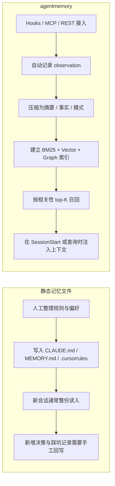

`CLAUDE.md` 写到 200 行就开始失效，而 agentmemory 想解决的是另一半问题：把 Agent（智能体）每一轮工具调用留下的痕迹，变成下一次能按相关性取回来的上下文。这篇文章按三条线读它——采集与巩固的流水线、三路混合检索、跑在 iii 引擎上的运行时形态，并核对 README 与源码不一致的几处默认值，因为它们会直接影响你部署时看到的行为。

先给判断：agentmemory 不只是一个 memory SDK（软件开发包），而是一台装在本地的记忆服务。它的采用成本主要来自这个形态——你要接受一个常驻进程、四个端口和一个被 pin 住的引擎版本；它带来的收益也来自同一个形态——捕获、压缩、索引、召回、回放全在同一条链路上，每一步都可查。

**资料范围**：本文以 agentmemory 的 GitHub README 与 main 分支源码为准（2026-09-19 核对，提交 `e04ba88`），npm 最新稳定版为 0.9.29；仓库数据（stars、forks、协议、语言、创建时间）来自 GitHub 同日查询，版本与依赖元数据来自 npm registry。凡无法在这些材料里找到出处的说法，本文不沿用。

## 阅读目标：读完你要能回答这五件事

1. 说清 agentmemory 的定位，以及它和 `CLAUDE.md`、`MEMORY.md`、`.cursorrules` 这类静态记忆文件的分工差别
2. 解释四层记忆巩固模型（Working / Episodic / Semantic / Procedural）和三路混合检索各自负责什么、默认状态下谁在工作
3. 描述三种接入方式——hook（钩子）、MCP（Model Context Protocol，模型上下文协议）、REST API（表述性状态转移风格的应用程序接口）——各自适合的场景，以及 MCP shim 连不上服务器时只剩 7 个工具这个关键限制
4. 完成安装，在 Claude Code 或 Cursor 里接入，并用四个端口、三条 curl 和一次存搜往返确认服务真的活着
5. 根据 README 的 benchmark 口径和仓库默认配置，判断是否采用它、按什么顺序采用

三个自测问题：

1. 四层巩固模型每一层存的是什么？如果只用到第一层（原始捕获），会丢掉哪些能力？
2. BM25 + Vector + Graph 三条检索流各自适合召回什么？keyless（无密钥）模式下谁在真正工作？
3. `@agentmemory/mcp` 这个 shim 连不上完整服务时会发生什么？`AGENTMEMORY_TOOLS` 写在 shim 的 `env` 里有用吗？

---

## 1. 它解决的是会话记忆断层

AI 编程 Agent 最大的问题往往不在模型能力，而在记忆。上一轮解释过的目录结构、鉴权方案、依赖约束，下一轮它还要重新理解。项目变大后，这种重复会带来三个直接成本：

- 上下文要反复重塞，token（词元）消耗持续升高。
- 关键决策散落在对话里，过几天几乎无法复用。
- 同时在多个 Agent 之间切换时，记忆无法共享，等于每个 Agent 都从零开始。

只靠静态记忆文件通常不够。`CLAUDE.md`、`MEMORY.md`、`.cursorrules` 适合放项目约束、代码风格和长期规则，但它们本质上是手工维护的说明文档：不会自动记录工具调用，不做相关性检索，也不擅长处理"上次修过什么 bug"这类动态历史。README 给了一组对照数字——内置记忆文件 200 行就到容量上限，240 条观察全量塞进上下文要 22K+ token；agentmemory 每会话约注入 1,900 token，少 92%。

两类方案的差别可以先压成一张表：

| 方案 | 本质 | 优点 | 短板 |
| --- | --- | --- | --- |
| 静态记忆文件 | 手工维护的规则说明 | 简单、透明、零运行时 | 约 200 行封顶，容易过时，无法按相关性召回，跨 Agent 难共享 |
| agentmemory | 本地运行的可检索记忆服务 | 自动捕获、压缩、检索、回灌上下文 | 需要常驻运行时与集成配置 |

对长期编码工作流来说，关键不在"能不能存下更多字"，而在这些信息能不能在下一次会话里按相关性被重新取回。

### 1.1 一张图看懂：静态记忆文件 vs agentmemory


```mermaid
flowchart LR
    subgraph A[静态记忆文件]
        A1[人工整理规则与偏好] --> A2[写入 CLAUDE.md / MEMORY.md / .cursorrules]
        A2 --> A3[新会话通常整份读入]
        A3 --> A4[新增决策与踩坑记录需要手工回写]
    end

    subgraph B[agentmemory]
        B1[Hooks / MCP / REST 接入] --> B2[自动记录 observation]
        B2 --> B3[压缩为摘要 / 事实 / 模式]
        B3 --> B4[建立 BM25 + Vector + Graph 索引]
        B4 --> B5[按相关性 top-K 召回]
        B5 --> B6[在 SessionStart 或查询时注入上下文]
    end
```

静态记忆文件负责沉淀规则，agentmemory 负责把历史工作转成可检索上下文。前者更轻，后者更强，也更接近一套运行中的基础设施。

## 2. agentmemory 到底是什么

agentmemory 是一个**构建在 iii engine 之上的持久化记忆系统**，面向支持 hook、MCP 或 REST API 的 AI Agent。它是一台本地运行的记忆服务器，不同 Agent 共用同一份记忆层。

这个项目 2026 年 2 月 25 日创建，到 2026 年 9 月 19 日在 GitHub 上是 28,594 stars、2,473 forks，TypeScript 编写，Apache-2.0 协议。npm 上 latest 为 0.9.29（2026-08-16 发布），而仓库 main 分支已经走到 8 月 23 日的那次提交——也就是说，仓库里比用户手上稳定版更新的东西，你要等下一个版本才拿得到。README 首页徽章给出六组最常被引用的数据：

- 95.2% 的检索 R@5（LongMemEval-S，500 题）
- 92% 的 token 节省（每会话约 1,900）
- 54 个 MCP tools
- 12 个自动 hooks
- 1,674+ 个通过的测试
- 不依赖外部数据库服务

这些数字都能在 README 里找到出处，但都不能脱离 benchmark 口径和默认配置单独理解，第 7 节会逐条拆开。README 自己也提醒了一句：star 数只是近似值，会随时间漂移——所以引用它时必须带上核对日期。

项目对外暴露的形态有三层：

- 一台完整运行的本地服务，负责 API、viewer、hooks、压缩和回放。
- 一个可独立接入的 MCP server，适合 Cursor、Claude Desktop、Cline 这类支持 MCP 的客户端。
- 一组对外集成接口，包括 REST API、resources、prompts 和 skills。

它要替代的是每次都要重新解释项目背景的那部分重复劳动，不是笔记文件本身。

## 3. 它是怎么"记住东西"的

### 3.1 记忆流水线

README 给出的是一条围绕 session 组织的处理链路，不是"写入一条记忆，再搜索一条记忆"的简单循环。

```text
PostToolUse
    -> SHA-256 去重（5 分钟窗口）
    -> 隐私过滤（剥离 API key 与密钥）
    -> 保存原始 observation
    -> 合成压缩（默认）；配置 LLM provider 且 AGENTMEMORY_AUTO_COMPRESS=true 时改为 LLM 压缩
    -> 配置了 embedding provider 时生成向量
    -> 建立 BM25 索引（向量启用后一并索引）

Stop / SessionEnd
    -> 汇总会话
    -> GRAPH_EXTRACTION_ENABLED=true 时抽取知识图谱
    -> AGENTMEMORY_REFLECT=true 时执行 slot reflection（前提是 AGENTMEMORY_SLOTS=true）

SessionStart
    -> 读取项目画像
    -> 混合检索相关记忆
    -> 在默认 2000 token 预算内注入上下文
```

这里有两个经常被忽略的前提。

**默认行为比想象中保守，但捕获不缺席。** 观察捕获走 PostToolUse，不依赖任何开关；压缩默认是本地的合成压缩，LLM（大语言模型）压缩要同时具备 provider 和 `AGENTMEMORY_AUTO_COMPRESS=true`；语义检索要显式开启本地 embedding（嵌入向量）或配置远程 provider。装完即得的是 BM25 关键词召回加自动捕获，更强的能力都是显式选择。

**上下文注入是一个独立开关。** `AGENTMEMORY_INJECT_CONTEXT` 默认关闭。打开后，SessionStart 才会在每个会话第一轮注入约 1–2K 字符的项目上下文——对 Claude Code 来说，SessionStart 的 stdout 会进入模型上下文，这是注入真正生效的通道。这个开关开不开，PostToolUse 的捕获都照常进行。

顺带说清两个容易混在一起的 slot 开关，因为 README 的流水线图在这上面和配置章节、源码并不一致：

| 开关 | 实际作用 | 默认 |
| --- | --- | --- |
| `AGENTMEMORY_SLOTS` | 开启 8 个可编辑的固定槽位（persona、user_preferences、tool_guidelines、project_context、guidance、pending_items、session_patterns、self_notes），有容量上限，Agent 用 `memory_slot_*` 工具改写 | 关 |
| `AGENTMEMORY_REFLECT` | 让 Stop hook 触发 `mem::slot-reflect`：扫描近期观察，往 `pending_items` 追加待办、在 `session_patterns` 里计数、把碰过的文件记进 `project_context`。即发即走，不阻塞会话 | 关，且要求 SLOTS 已开 |

README 的流水线图把第二步写成了 `SLOT_REFLECT_ENABLED=true`，这个名字在配置章节和源码里都不存在（源码读的是 `AGENTMEMORY_REFLECT`）。按配置章节写才对。

### 3.2 核心概念：四层巩固模型

介绍 agentmemory 时最容易误解的地方，是把它概括成"Capture / Organize / Retrieve / Forget"四阶段生命周期。README 真正强调的是 **4-Tier Memory Consolidation**，一个参照人类记忆处理（包括睡眠期巩固）设计的四层模型：

| 层级 | 保存什么 | 解决什么问题 |
| --- | --- | --- |
| Working | 工具调用产生的原始 observation | 保留最接近现场的短期记忆 |
| Episodic | 压缩后的会话摘要 | 回答"上一次发生了什么" |
| Semantic | 抽取出的事实、模式与稳定知识 | 回答"这个项目长期成立的事实是什么" |
| Procedural | 工作流、决策套路与可复用做法 | 回答"这类事情通常怎么做" |

重点在于让项目知识逐步沉淀成不同密度、不同稳定性的层，而不是把所有信息平铺存起来。README 同时写明记忆按艾宾浩斯遗忘曲线衰减、被频繁访问的记忆会强化、陈旧记忆自动淘汰、矛盾事实会被检测并处理。

### 3.3 混合检索不是一句口号

检索是三路信号混合，不是单一向量检索：

| 检索流 | 作用 | 何时可用 |
| --- | --- | --- |
| BM25 | 词干化关键词匹配，带同义词扩展 | 始终可用 |
| Vector | 稠密向量的余弦相似度 | 配置了 embedding provider 之后 |
| Graph | 按实体匹配做知识图遍历 | 查询里识别出实体时 |

三路结果用 Reciprocal Rank Fusion（RRF，k=60）融合，并做会话级多样化——每个会话最多贡献 3 条结果，避免整屏都来自同一段历史。这个形状很贴近编码场景：一部分查询明显依赖关键词，例如包名、文件路径、错误码；另一部分更像语义召回，例如"数据库性能优化""之前那次鉴权改造"。

权重默认是 `BM25_WEIGHT=0.4`、`VECTOR_WEIGHT=0.6`，图遍历在 smart-search 排序里的加分是 `AGENTMEMORY_GRAPH_WEIGHT=0.2`，注入预算 `TOKEN_BUDGET=2000`。

要让语义检索跑起来，现在只需在 `~/.agentmemory/.env` 里设 `EMBEDDING_PROVIDER=local` 并重启。npm 安装把 `@huggingface/transformers` 作为可选依赖一起带上，首次请求会下载 `Xenova/all-MiniLM-L6-v2`（384 维），因此要有网络、第一次也会慢一些；之后推理完全在设备本地。README 给出的收益是比纯 BM25 高约 8 个百分点的召回。远程 provider 会由密钥自动探测，除非你用 `EMBEDDING_PROVIDER` 覆盖。README 列了五家：

- Gemini `gemini-embedding-001`：免费额度，100+ 语言，768/1536/3072 维 MRL，输入上限 2048 token。它替代的 `text-embedding-004` 已于 2026 年 1 月 14 日下线。
- OpenAI `text-embedding-3-small`：$0.02/1M，README 标注质量最好。
- Voyage `voyage-code-3`：付费，为代码场景调优。
- Cohere `embed-english-v3.0`：免费试用，通用。
- OpenRouter：任意模型，多模型代理。

中文用户要单独注意 BM25 的分词边界。默认开箱支持希腊文、西里尔文、希伯来文、阿拉伯文和带变音符的拉丁文；中日韩文本需要额外的分词器（`npm install @node-rs/jieba tiny-segmenter`）才能切成词级 token，否则退化成整段切分，agentmemory 只会在 stderr 打一次提示。`@node-rs/jieba` 和 `tiny-segmenter` 在发布包里挂的是 optionalDependencies——装不上也不会让安装报错，所以别假设它们一定在。补装一次、确认能被 import，比读 README 时默认它已就位更省事。

### 3.4 一个会话周期的完整流转

把上面的机制串成一次真实工作。README 用的是"先加鉴权，再加限流"这组例子。

第一会话，你要求给 API 加鉴权。Agent 写代码、跑测试、修 bug，PostToolUse hook 在每个工具调用后静默捕获：改了哪些文件、测试怎么跑的、最终选了 jose 而不是 jsonwebtoken（为了 Edge 兼容）。会话结束时，Stop hook 把这些原始观察压缩沉淀进 Episodic 层，关键事实（鉴权中间件在 `src/middleware/auth.ts`、测试覆盖了 token 校验）进入 Semantic 层。

第二会话，你只说"加个限流"。SessionStart hook 读取项目画像，用混合检索找回上一会话的记忆，在 2000 token 预算内注入上下文——Agent 直接知道鉴权用的是 jose、测试已经覆盖 token 校验，不需要你重新解释。

一次完整流转就是：捕获（PostToolUse）→ 压缩沉淀（Stop）→ 检索注入（SessionStart）→ 跨会话复用。四层模型、三路检索、hooks 体系都挂在这条链路上。

## 4. 快速开始：先分清完整服务和独立 MCP

第一层使用门槛不是配置文件，是先确认自己要哪种形态。

需要完整体验——viewer、REST API、session replay、自动 hooks、压缩和回灌——就启动完整服务：

```bash
# 终端 1：启动完整服务（首次运行是交互式 setup）
npx -y @agentmemory/agentmemory@latest

# 终端 2：灌入 3 个演示会话（JWT 鉴权、N+1 查询修复、限流）并跑一遍检索
npx -y @agentmemory/agentmemory@latest demo

# 打开实时 viewer
open http://localhost:3113
```

`demo` 灌完样本会自己跑几条查询。这里要把预期先设对：keyless 安装不启用向量，所以关键词类查询应该靠 BM25 命中，而 demo 里那条 `database performance optimization` 是故意做成语义查询的，没配 embedding provider 之前它可能返回 0 条。想让它命中 N+1 修复那条记录，就设 `EMBEDDING_PROVIDER=local`、重启，并等首次模型下载完成。

首次运行是一个交互式安装向导：选择要接入的 Agent（Claude Code、Cursor、Codex、Gemini CLI（命令行工具）、OpenCode 等），再选择 LLM provider 或者保持 keyless。随后它写入配置、启动记忆服务器和固定版本的 iii 引擎，并问你要不要全局安装，好让裸 `agentmemory` 命令以后随处可用。README 的开发章节给出的前提是 Node.js >= 20；macOS/Linux 的自动安装路径需要 `curl`、POSIX `sh` 和 `tar`（`node:20-slim` 这类精简镜像可能没有）。

启动后用四个端口确认状态：3111 是 REST API + MCP HTTP，3112 是 iii streams，3113 是 viewer，49134 是 iii worker WebSocket。README 给的验证顺序是：

```bash
curl -fsS http://localhost:3111/agentmemory/livez
curl -fsS http://localhost:3111/agentmemory/health
curl -fsS -o /dev/null http://localhost:3113/
npx -y @agentmemory/agentmemory@latest status
```

`status` 会回报 agentmemory 健康和当前 provider / embedding 模式。它还给了一条重启持久性的验收写法——存一条探针、搜出来、`stop`、再启动、再搜一次，探针必须还在；如果当初指定了 `--data-dir`，重启时要传同一个值：

```bash
curl -fsS -X POST http://localhost:3111/agentmemory/remember \
  -H 'Content-Type: application/json' \
  -d '{"content":"agentmemory restart persistence probe","concepts":["install-check"]}'

curl -fsS -X POST http://localhost:3111/agentmemory/smart-search \
  -H 'Content-Type: application/json' \
  -d '{"query":"restart persistence probe","limit":5}'
```

只需要把它接成 MCP server、不关心 viewer / REST / cron 时，可以走更轻的独立 MCP 方式：

```bash
npx -y @agentmemory/agentmemory@latest mcp   # 规范入口
npx -y @agentmemory/mcp                      # shim 包别名
```

这里有一个必须知道的限制：`@agentmemory/mcp` 是一个薄 shim。**只有当它能通过 `AGENTMEMORY_URL` 连上正在运行的完整服务时，才代理出全部 54 个工具**；连不上时退回 7 个本地工具（`memory_save`、`memory_recall`、`memory_smart_search`、`memory_sessions`、`memory_export`、`memory_audit`、`memory_governance_delete`）。如果你在 Cursor、OpenCode 或 Gemini CLI 里只看到 7 个工具，原因就是完整服务没在跑。所以"纯 MCP 轻量接入"其实是两种形态：要么接受 7 个基础工具的离线模式，要么本地起一台完整服务、MCP 只是它的接入面。

### 4.1 Cursor 有两条路

早期"Cursor 只能走 MCP"的说法已经过时，README 现在给两条路径。

**MCP 接入**：把标准 `mcpServers` 块合并进 `~/.cursor/mcp.json`（注意是合并进已有的 `mcpServers` 对象，不是整份覆盖），或者用 `agentmemory connect cursor` 写入，网站上还有一键 deeplink。

```json
{
    "mcpServers": {
        "agentmemory": {
            "command": "npx",
            "args": ["-y", "@agentmemory/mcp"],
            "env": {
                "AGENTMEMORY_URL": "http://localhost:3111"
            }
        }
    }
}
```

**插件接入**：`.cursor-plugin/` 提供 7 个自动捕获 hook（`sessionStart`、`beforeSubmitPrompt`、`preToolUse`、`postToolUse`、`postToolUseFailure`、`stop`、`sessionEnd`）加 17 个 skills 和 MCP server，`AGENTMEMORY_URL` / `AGENTMEMORY_SECRET` 在 Cursor 的插件面板里管。Cursor Marketplace 的上架仍在审核中，当前要从本地 checkout 装。它在 Cursor IDE（集成开发环境）和 `cursor-agent` 命令行里都能工作；CLI 的 print 模式拿不到用户输入的提示词，靠会话结束时从 transcript 回填。

只用 MCP 的 Cursor 依然没有自动会话捕获，但想要完整体验已经有插件路径可选，只是还不算一键。

### 4.2 Claude Code 的接法最深

Claude Code 是 README 重点照顾的场景，推荐路径就三步：

1. 单独开一个终端运行 `npx -y @agentmemory/agentmemory@latest`。
2. 在 Claude Code 里执行 `/plugin marketplace add rohitg00/agentmemory`。
3. 再执行 `/plugin install agentmemory`。

这条路径注册 12 个 hooks、17 个 skills，并通过 `.mcp.json` 自动接上 `@agentmemory/mcp`，拿到全部 54 个工具。12 这个数字可以在 `plugin/hooks/hooks.json` 里逐个数出来，按它们在会话里出现的时机分四组：

- 会话两端：`SessionStart`、`SessionEnd`
- 每一轮输入与收尾：`UserPromptSubmit`、`Stop`、`Notification`、`TaskCompleted`
- 工具调用前后：`PreToolUse`、`PostToolUse`、`PostToolUseFailure`
- 压缩与子 Agent：`PreCompact`、`SubagentStart`、`SubagentStop`

其中 Subagent、SessionEnd、Notification、TaskCompleted、PostToolUseFailure 这几类事件只有 Claude Code 会注册，Codex 侧拿不到。

如果不想装插件、只在 `~/.claude.json` 里手动配 MCP，有个坑要绕：插件路径里的 `${CLAUDE_PLUGIN_ROOT}` 不会被解析，hook 脚本只能指向绝对路径，而那些路径通常带着内嵌版本号（例如 `…/agentmemory/0.9.22/scripts/…`），下次升级就静默失效。README 给的解法是 `agentmemory connect claude-code --with-hooks`，它把同一批 hook 命令以解析后的绝对路径合并进 `~/.claude/settings.json`，升级后重跑一次刷新路径，你自己在同一个文件里写的条目会保留、只替换掉旧的 agentmemory 条目。

### 4.3 其他 Agent：账面 20 个适配器，能改配置的 19 个

README 的措辞是"`agentmemory connect <agent>` 有 20 个适配器"。源码里 `src/cli/connect/index.ts` 的 `ADAPTERS` 数组注册了 21 个。逐个读它的 `install()` 会看到两件事：其中两个还是占位，而剩下的那些默认也只保证 MCP 工具可用。

先说占位。`connect openhuman` 会打印"integration is not yet automated"并返回 `kind: "stub"`（原因写的是 `no-integration-folder-yet`）；`connect hermes` 同样返回 stub，原因是 `yaml-merge-not-implemented`——Hermes 用 YAML 配置，自动合并还没做，README 里那套 6 hook 的 provider 要你自己 `cp -r integrations/hermes ~/.hermes/plugins/agentmemory` 再写 `memory.provider: agentmemory`。OpenHuman 在 README 里出现的位置甚至是赞助商标识，不是接入路径。所以真正会改写你配置的，是 19 个。

再说捕获。`connect` 写的是 MCP 块，工具因此可用，但没人替你记会话。顺带安装 hook 的只有六个：`claude-code`、`codex`、`dsh`、`devin`、`droid`、`antigravity-cli`——前三个自己实现了 `--with-hooks`，后三个通过 `createJsonMcpAdapter` 的 `installHooks` 挂上。`connect pi` 是另一种形状：它把一个扩展拷进 pi 的自动发现目录，由扩展在 Agent 启动时召回、结束时捕获。其余 12 个宿主的 `connect` 只到 MCP 为止：Cursor、Copilot CLI、OpenCode、Qwen、OpenClaw、Gemini CLI、Antigravity、Kiro、Warp、Cline、Continue、Zed。自动捕获要另外装插件目录或手工接。

三处配置形态上的差异，抄别人的片段时最容易踩：Zed 写在 `~/.config/zed/settings.json` 的 `context_servers` 下（不是 `mcpServers`）；OpenCode 用顶层 `mcp` 键、command 是数组；Goose 直接改 YAML 时用的是 `extensions:` + `cmd` 这组键。Continue 则更保守：如果你已经有 `config.yaml`，适配器只会打印要粘的块，不会替你改写——preserve 注释和 anchor 需要一个它不带的 YAML 解析器。

几个和时间有关的变化要单独说。其一，README 在 Antigravity 那一行标注"2026-06-18 Gemini CLI 停服之后改用它"。但同一张表里 **Gemini CLI 的 MCP 行仍然保留**（`~/.gemini/settings.json`，用 `gemini mcp add agentmemory …`），源码里也还有 `gemini-cli` 适配器。所以这不是被删掉的支持，而是被指路到新宿主。其二，Codex Desktop 有一个已知缺陷（openai/codex#16430）：插件自带的 `hooks.json` 目前不被派发，MCP 工具不受影响；要补生命周期捕获就跑 `agentmemory connect codex --with-hooks`，把同一批 hook 镜像进全局 `~/.codex/hooks.json`，等上游修好再撤。其三，Devin 的插件形态**不会**触发 SessionStart / SessionEnd，想要完整会话捕获必须再跑 `connect devin --with-hooks`——那六个原生 hook 来自 connect，不是来自插件本身。

日常运维五个命令：

```bash
agentmemory                    # 启动服务
agentmemory stop               # 干净地停止
agentmemory connect <agent>    # 接入另一个 Agent
agentmemory doctor             # 交互式诊断 + 修复提示
agentmemory remove             # 卸载它创建的所有东西
```

数据默认不落在你的仓库里：macOS 在 `~/Library/Application Support/agentmemory`，Linux 在 `$XDG_DATA_HOME/agentmemory` 或 `~/.local/share/agentmemory`，Windows 在 `%APPDATA%\agentmemory`。`--data-dir` 或 `AGENTMEMORY_DATA_DIR` 可以显式指定，重启时传同一个值；一个历史遗留行为要知道——如果仓库里还留着旧的 `./data/state_store.db`，instance 0 会优先复用它；显式指定才能盖过这个复用行为。要跑第二台实例用 `--instance 1`，它会换到 3211/3212/3213/49234 这组端口并单独开一个 `instance-1` 数据目录，最多到 50。

## 5. "54 个 MCP 工具"不是全部答案

很多介绍文章会突出工具数量，但停在数字上就容易把它误读成一份清单。README 的实际表述是 **54 个 MCP tools、6 个 resources、3 个 prompts、17 个 skills，外加 3111 端口上的 130 个 REST endpoints**。这个 130 不必只信 README：在 main 上数 `src/triggers/api.ts` 里 distinct 的 `sdk.registerFunction("api::…")`，正好 130 个。

可见度这块 README 说成"三档"，但环境变量只有两个取值。源码读的是 `process.env["AGENTMEMORY_TOOLS"] || "all"`：

- `core`：收窄到 8 个 essentials（`memory_save`、`memory_recall`、`memory_consolidate`、`memory_smart_search`、`memory_sessions`、`memory_diagnose`、`memory_lesson_save`、`memory_reflect`）。
- `all`（默认）：暴露全部 54 个。
- 中间那 14 个是文档表格里标出的"注册表基础集"，用来帮你理解哪些工具最稳定，不是一个可选项。

默认值本身是后来改过的。`getVisibleTools()` 一度默认走 `core`，于是 OpenCode 和 Claude Code 用户只看到 8 个工具、并不知道另外几十个存在；PR #650（随 0.9.22 发布）把它翻成 `all`，让运行时和插件清单宣传的表面一致——那次翻到的是 51 个，如今这张表面是 54 个。想知道你的 MCP 客户端到底拿到了什么，可以设 `AGENTMEMORY_DEBUG=1`，它会把 `tools/list` 的模式、响应形状、工具条数和本地回退内容打到 stderr。

还有一点常被误解：`AGENTMEMORY_TOOLS` 是**服务端**标志，写在 shim 的 `env` 块里没有效果。

对多数人来说最先用到的是下面几类：

| 能力类型 | 代表工具 | 用途 |
| --- | --- | --- |
| 回忆与检索 | `memory_recall`、`memory_smart_search` | 找回过去的观察、文件历史（`memory_file_history`）和相关上下文 |
| 主动写入 | `memory_save` | 把决策、经验、偏好手动沉淀成长期记忆 |
| 会话理解 | `memory_sessions`、`memory_timeline`、`memory_profile` | 查看最近会话、时间线与项目画像 |
| 提交与导出 | `memory_commit_lookup`、`memory_commits`、`memory_export` | 反查某个 git commit 背后是哪次会话，迁移或审计 |
| 治理与验证 | `memory_audit`、`memory_governance_delete`、`memory_verify` | 处理陈旧或敏感记忆，追溯来源 |
| 多 Agent 协作 | `memory_lease`、`memory_signal_send`、`memory_team_share` | 并行协作时避免记忆冲突、共享上下文 |

记忆本身带一套生命周期模型，这也是它和"一堆字符串"拉开距离的地方。每条观察和记忆都带不可变的来源通道标记（user、agent、tool、import、shared），在捕获、保存、导入时分别盖章；记忆有版本化与取代（supersession）机制，被新版本取代的记忆会离开所有召回路径，但版本链在 KV 里保留完整历史用于溯源；保存时如果内容与已有记忆高度相似，返回一个 `similarTo` 提示而不是静默重复存。遗忘侧三条路径：TTL 到期、矛盾检测、按重要性淘汰。多 Agent 场景下 `AGENT_ID` 给每条写入打角色标签，会话、原始观察、压缩观察、记忆四类对象都带。`AGENTMEMORY_AGENT_SCOPE` 决定召回时是否按这个标签过滤：默认 `shared`，打标签但不过滤，于是跨 Agent 可见、而每行仍记着是谁说的；切到 `isolated` 则打标签且过滤，architect 完全看不到 developer 的观察。单次请求还能用 `?agentId=` 覆盖。所以存下来的不是无差别文本，而是有来源、有版本、有关联、会过期的结构化记忆。

resources、prompts 和 skills 是工具之外的三类接口：

- resources：6 个只读接口——`agentmemory://status`、`agentmemory://project/{name}/profile`、`agentmemory://project/{name}/recent`、`agentmemory://memories/latest`、`agentmemory://graph/stats`、`agentmemory://team/{id}/profile`。
- prompts：`recall_context`、`session_handoff`、`detect_patterns` 三个上下文模板。
- skills：9 个可直接调用的动作技能（`/remember`、`/recall`、`/recap`、`/handoff`、`/forget`、`/lesson`、`/commit-context`、`/commit-history`、`/session-history`）加 8 个按需加载的参考技能（记忆纪律、MCP 工具表、REST API、配置、Agent、hooks、架构、写技能指南），共 17 个。参考技能里的数据表由源码生成，所以不会和实现漂移。

`npx skills add rohitg00/agentmemory -y` 走 vercel-labs 的 `skills` CLI，能自动探测调用方 Agent 并把这 17 个技能装进它的原生技能目录，覆盖 50+ Agent；`-a warp` 指定宿主，`-a '*'` 全装。另有一条 `npx skillkit install agentmemory`，README 标注支持 32+ Agent 且会自动探测宿主。

只把这一节理解成"工具清单"会低估它的完整度。agentmemory 是把长期记忆做成一套可调用的能力面，而不只是若干条 CRUD（增删改查）命令。

## 6. 为什么 iii 在这里不是幕后依赖

同类项目常见的实现是"一个 Node 或 Python 服务 + 一个向量数据库 + 一个 Viewer + 一层工具接口"。agentmemory 不走这条路。README 强调它本身**就是一个运行中的 iii 实例**：三个原语（worker、function、trigger）撑起运行时。functions、triggers、KV state（键值状态）、streams、OTEL（OpenTelemetry）traces 全是 iii primitives。它替代掉的是你通常会在外面单搭的那一套：Express / Fastify 换成 iii HTTP Triggers，SQLite / Postgres + pgvector 换成 iii KV State 加内存向量索引，SSE / Socket.io 换成 iii Streams。进程监督和可观测性也一起收进来——pm2 / systemd 换成 iii 引擎的 worker 监督，Prometheus / Grafana 换成 iii OTEL 加健康监控。

关键在于 iii 对它来说是产品边界的一部分，不是内部依赖。你会直接用到这些能力：

- `iii console --port 3114` 查看 traces、streams、state 和函数调用（viewer 占了 3113，console 错开到 3114）。README 用一句话划清分工：viewer 看你的 Agent **记住了什么**，iii console 看 Agent **做了什么**。
- `iii worker add iii-cron`：为记忆巩固、衰减扫描和快照轮换提供调度。
- `iii worker add iii-observability`：给每个记忆操作打开 OTEL 链路。
- `iii worker add iii-queue`：embedding 和压缩任务的持久化重试。
- `iii worker add iii-pubsub`：多实例记忆，把每次 `remember` 广播给连接的每个实例，搜索读的是并集。
- `iii worker add iii-database`：需要时换成 SQL-backed state adapter。
- `iii worker add iii-sandbox`：让召回出来的代码在一次性 microVM 里跑，而不是你的 shell。
- `iii worker add mcp`：在同一台引擎上再挂别的 MCP server。

七条命令共用一个特点：新 worker 注册的是同一个引擎里的函数和触发器，viewer 和 console 立刻能看到，不用重载、不用新集成、不用新容器。

规模上 README 自述"184 source files · ~42,200 LOC · 1,674 tests · 264 functions · 50 KV scopes"。按 2026-09-19 的 main 数 `src/**/*.ts`，实际是 189 个文件、43,398 行——账面数字略滞后，量级没问题。

有一处默认值和 README 的说法对不上，而且会直接影响你部署时的观感，值得单列。README 说 `iii-config.yaml` 出厂就启用了 observability worker、采样率 `1.0`；但同一个提交里的 `iii-config.yaml` 写的是 `sampling_ratio: 0.1`，npm 上 0.9.29 tarball 里打包的那份也是 0.1。配置旁边留着原因：全采样下持续负载会让日志订阅者跟不上，worker 于是发出 "Log trigger subscriber lagged" 的 WARN，而这条 WARN 又回灌进同一个它排不空的流，形成正反馈。有用户在几天里因此把 137 GB 写进了 `daemon.log.new`（issue #519）。收束这个默认值的 PR #686 记在 CHANGELOG 里。同一批调整里 `logs_console_output` 也改成默认关闭。读这个项目的一手文档时，把配置文件当成事实来源更划算。

最后一个安全边界：iii console 自身不做鉴权，保持默认的 `127.0.0.1` 绑定，不要暴露到公网。

## 7. README 里的指标该怎么读

这些指标可以引用，但最好连同口径一起看。

| 指标 | 官方口径 | 更稳妥的理解 |
| --- | --- | --- |
| 检索 R@5 | 95.2%，基于 LongMemEval-S（ICLR 2025，500 题）；R@10 98.6%，MRR 88.2% | 说明混合检索不弱；同表 BM25-only 回退行是 86.2% / 94.6% / 71.5%，差距主要来自语义召回。这是 README 的自测口径，不是独立第三方复现 |
| 新增 benchmark | coding-agent-life-v1（自建 15 会话语料）：hybrid P@5 0.240、R@5 1.000、top-5 命中 15/15、p50 延迟 14 ms；grep 基线 P@5 0.227、R@5 0.967、15/15、p50 0 ms | 0.240 已经是该语料在 P@5 上的数学上限，所以这条只能说明"混合检索把每条 gold 都捞回来了"，而 grep 的 P@5 只低 0.013、延迟还更低。README 自己承认语料小且 gold 稀疏、LongMemEval-S 更有区分度；提升点在召回和时间序查询，不在聚合精度 |
| Token 节省 | 92% fewer tokens，约 1,900/会话；年度口径：全量粘贴 19.5M+（README 标注"超出窗口，不可行"）、LLM 摘要约 65 万（约 $500）、agentmemory 约 17 万（约 $10），配本地 embedding 为 $0 | 说明"按需召回"明显优于每轮全量塞上下文。19.5M 那一行是极端对照，不是可选项；真实节省比例会随工作流波动 |
| 12 auto hooks | 首页徽章与集成说明都强调 | 只对注册了这 12 个事件的宿主成立（Claude Code）；Codex 插件 6 个、OpenCode 插件 22 个、Cursor 插件 7 个、Hermes 6 个但要手工接、Devin 的 6 个来自 `connect --with-hooks`；MCP-only 客户端一个都没有 |
| 0 external DBs | 首页徽章与对比表都给出 | 正确理解是"不需要另起一套外部数据库服务"。它把状态交给 iii 的 KV adapter（`iii-config.yaml` 里是 `store_method: file_based`，落在 `state_store.db`），不是零存储；那个 `.db` 后缀也别读成 SQLite |
| 1,674+ tests passing | 徽章与开发章节（`npm test` → 1,674）一致 | 说明测试覆盖投入不小，但不能替代你对自己集成路径的验证 |

README 在竞品表下面主动写了一段 benchmark 声明，值得转述：只有 agentmemory 的 R@5 是他们自己测的（LongMemEval-S，可从 `benchmark/COMPARISON.md` 复现）；mem0 和 Letta 的数字是各自已发表的 LoCoMo 成绩，属不同数据集；MemPalace、supermemory、TencentDB（PersonaMem）和 oracleagentmemory 的数字是厂商自报、未独立复现。oracleagentmemory 那次跑的还是 GPT-5.5 配 Oracle AI Database。放在一起只作量级参考，不是同数据下的正面交锋。一个项目愿意在自家 README 里把口径差异写清楚，本身是加分项。

复现入口也是齐的：`eval/README.md` 提供 adapter 可插拔的评测框架（LongMemEval-S 公开 500 题 + 自建 15 会话语料），grep / vector / agentmemory 三种 adapter 同表打分、输出 NDJSON，逐次评分报告落在 `docs/benchmarks/`。

## 8. 如果和 mem0、Letta 摆在一起看

单看"都有 memory"这个标签，很容易把它们混成同一类项目，实际上它们切入的层级不同。对多数开发者的问题而言，关键是：给现有 Agent 补一层记忆，还是引入一套新的 agent 平台。

竞品表一共 10 列，除 agentmemory 自己是 9 个对手。标了 star 数的六家按体量排：mem0（63K）、MemPalace（54K）、Khoj（36K）、supermemory（29K）、Letta / MemGPT（24K）、TencentDB Agent Memory（22K）；另外三家里 oracleagentmemory、Hippo 和内置 `CLAUDE.md` 没给 star 数。

表外另列两个新玩家。Zep / Graphiti（30K）走时序知识图谱，公开的 LongMemEval 成绩 63.8%，时间序查询里最强，但图是异步构建的，刚发生的事实可能滞后。Cognee（30K）做文档转知识图谱，只有 Python，为结构化实体抽取设计，不是为会话捕获设计。

README 在对比表末尾给了自己一句定位：这些对手里没有一个同时做 coding-agent hook 自动捕获、本地 viewer 和 keyless 运行。这是项目自陈，不是第三方结论，但它确实划出了 agentmemory 想站的位置。

这三类方案的形态差异浓缩如下：

| 项目 | 更接近什么 | 更适合谁 | 和 agentmemory 的关键差异 |
| --- | --- | --- | --- |
| agentmemory | 记忆引擎 + MCP server + 本地运行时 | 已经在用 Claude Code、Cursor、Codex CLI 等现成 Agent，希望跨会话、跨 Agent 共享记忆的开发者 | 不要求你换掉现有 Agent，只是在外部补一层共享记忆基础设施 |
| mem0 | 通用 memory layer / SDK / API 平台 | 在做应用级 AI assistant、客服、个性化系统，需要 SDK、API、自托管或云多种交付形态的团队 | 更偏应用层 memory platform；自动捕获靠手动 `add()` 调用，没有 hook 体系 |
| Letta | 带高级记忆能力的 stateful agent 平台 | 想直接构建长期运行、可自我改进的 agent 系统，而不只是给现有 Agent 加一层 recall 的团队 | 它是一整套 agent runtime，框架绑定深，采用成本更高 |

选择时可以按这三条判断：

- **已经有现成编码 Agent，只是缺长期记忆**：先看 agentmemory。
- **在做面向最终用户的 AI 应用，需要 API、SDK、托管与自托管多种形态**：mem0 往往更顺手。
- **目标是引入一个 stateful agent 平台，而不是外挂记忆层**：Letta 更适合直接当主方案。

站内的 [claude-mem](/posts/tech/claude-mem-persistent-memory-65k-stars/) 可作参照：它更聚焦 Claude Code 单一工作流的记忆与压缩，跨 Agent 的基础设施视角不如 agentmemory 强。一个变化值得一提——claude-mem 已经不在 agentmemory 当前 README 的对比表里了，换上来的是 mem0、Letta 这个体量的对手，侧面反映项目自我定位的变化。

## 9. 采用顺序与适用边界

更适合 agentmemory 的情形：

- 长期在同一个代码库里迭代，希望 Agent 记住架构决策、踩坑记录和文件演化史。
- 在 Claude Code、Cursor、Codex CLI 等多个 Agent 之间切换，要让它们共享记忆层。
- 不想再维护一堆越来越长、越来越陈旧的静态记忆文件。
- 需要可观测性，想看记忆是怎么被捕获、压缩、检索和注入的。

如果需求只是"给 Agent 一份简短项目说明"，静态记忆文件通常更轻。下面这些情况不必一开始就引入它：

- 项目很小，长期记忆价值有限。
- 客户端只支持最基础的 MCP、没有 hooks——自动捕获的收益会打折，shim 还只剩 7 个工具。
- 不愿意在本地维护 iii-engine 或 Docker 这类运行时。
- 更需要一个托管型团队知识库，而不是本地优先的开发记忆层。

真要采用，顺序比"全开"重要。第一步只用默认档位：起完整服务、装 Claude Code 或 Cursor 插件、跑一次 `demo`，确认 BM25 召回和 viewer 里的捕获链路是通的。第二步再开 `EMBEDDING_PROVIDER=local`，把语义召回补上——这一步免费，代价只有首次模型下载。第三步才是显式选择哪些能力值得花 token 和钱：`AGENTMEMORY_INJECT_CONTEXT` 决定注入是否真的进上下文，`GRAPH_EXTRACTION_ENABLED` 决定图检索有没有数据，`AGENTMEMORY_AUTO_COMPRESS` 会让每条观察都调模型，务必先看清 provider 的单价。

部署层面还有几条现实边界：

- 完整服务依赖 pinned 的 iii-engine v0.11.2 或 Docker。macOS/Linux 首次会自动装到 `~/.agentmemory/bin`，原生 Windows 要手动下载 `iii.exe`（或走 WSL2 / Docker Desktop）。pin 在 v0.11.2 的原因是引擎 v0.11.6 换成了"一切走 `iii worker add`"的沙箱模型，agentmemory 还没为此重构完；重构完成后这个 pin 会解除，自己也迁移过的人可以用 `AGENTMEMORY_III_VERSION` 覆盖。引擎是预编译二进制而不是 cargo crate，别去 `cargo install`；上游那句 `install.sh | sh` 装的是最新版，agentmemory 不支持。
- 默认 LLM provider 是 no-op：合成压缩和 BM25 召回照常工作，但所有 LLM 驱动的能力都要先配 provider。配了 provider 之后 consolidation（四层巩固）就默认开启——`src/config.ts` 里的判定是：显式设 `CONSOLIDATION_ENABLED=false` 才关，没设时取"是否配置了 LLM provider"这个结果，README 配置章节也是这么写的；`.env.example` 里那句"Default off"已经滞后。想完全无 LLM 运行就显式设成 `false`。
- 曾经默认启用的 Claude 订阅回退（会拉起 `@anthropic-ai/claude-agent-sdk` 会话）现在是显式选择，要设 `AGENTMEMORY_ALLOW_AGENT_SDK=true`；README 给出的原因是它曾造成 Stop hook 无界递归。
- 远程部署有官方模板：fly.io、Railway、Coolify 三种一键，Render 走的是 Blueprint 手动流程——一键按钮要求仓库根目录有 `render.yaml`，而他们刻意保持根目录干净。四份模板都自带 Dockerfile，从 npm 拉 agentmemory、从官方 `iiidev/iii` 镜像里取引擎二进制；首次启动的 entrypoint 会用一份绑到 `0.0.0.0`、用绝对 `/data` 路径的配置覆盖 npm 里那份绑 `127.0.0.1` 的，生成 HMAC secret，再用 `gosu` 从 root 降到 `node` 才启动 CLI。对外只发布 3111，viewer 3113 留在容器 loopback 里，四份 README 都写了 SSH 隧道的做法。
- 如果打算靠 `import-jsonl` 导入 Claude Code 历史作为主要捕获方式，注意 Claude Code 的 `cleanupPeriodDays` 默认 30 天就会删掉旧 JSONL——超过 30 天的历史在导入前就已经没了。要么定期跑导入，要么调大这个值，要么直接用 hooks 实时捕获，让 JSONL 清理不再影响你。

## 10. 按现象排查

下面这些失败形状都在 README 或源码里写明过，按你看到的现象找。最常见的是两类：工具数量不对，以及服务根本没起来。

| 现象 | 先查什么 | 处置 |
| --- | --- | --- |
| Cursor / OpenCode 里只有 7 个工具 | 完整服务没在跑，shim 退回本地模式 | 起 `npx -y @agentmemory/agentmemory@latest`，MCP 的 `env` 里设 `AGENTMEMORY_URL=http://localhost:3111`；探测默认 2 秒超时，慢机器用 `AGENTMEMORY_PROBE_TIMEOUT_MS` 放宽，`AGENTMEMORY_DEBUG=1` 能直接看到返回了几条 |
| 设了 `AGENTMEMORY_TOOLS=core` 没变化 | 它是服务端标志，写在 shim 的 `env` 里不生效 | 在服务进程的 env 里设，并重启服务 |
| `port in use`，四个端口里某个被占 | 上一次崩溃留下的进程 | `lsof -i :3111,3112,3113,49134` 找到再 `pkill -f agentmemory`、`pkill -f 'iii '`；Windows 用 `netstat -ano \| findstr ":3111"` + `taskkill /F /PID`。`agentmemory stop` 本来会干净地回收 worker 和引擎 pidfile |
| 启动报 `The engine process started but the REST API never responded.` | 四个派生端口没全空、pinned 引擎没活下来 | 重跑并加 `--verbose` 看引擎 stderr |
| `Could not start iii-engine` | `iii.exe` 和 Docker 都没装 | 手动装 pinned 引擎，或让 Docker Desktop 真正运行起来（托盘图标）——Docker 装了但没跑，回退会被跳过 |
| `demo` 里语义查询返回 0 条 | keyless 模式没有向量，那条查询故意做成语义型 | 设 `EMBEDDING_PROVIDER=local`、重启，等首次模型下载完成 |
| 中文 / 日文记忆召回很差 | CJK 退化成整段切分 | 装 `@node-rs/jieba` 与 `tiny-segmenter`；没装时 stderr 有一次性提示 |
| 升级后 hook 全静默 | 手配 `~/.claude.json` 时 `${CLAUDE_PLUGIN_ROOT}` 不解析，绝对路径带着旧版本号 | 跑 `agentmemory connect claude-code --with-hooks`，每次升级后重跑 |
| Codex Desktop 里没有生命周期捕获 | 上游未派发插件 `hooks.json`（openai/codex#16430） | `agentmemory connect codex --with-hooks` 镜像进 `~/.codex/hooks.json`，上游修复后撤 |
| Devin 插件收不到 SessionStart / SessionEnd | 插件形态本身不触发这两个事件 | 再跑 `connect devin --with-hooks` 补六个原生 hook |
| OpenClaw 里捕获被静默拦截 | 没给它会话访问权 | 设 `plugins.entries.agentmemory.hooks.allowConversationAccess=true` |
| `daemon.log.new` 体积疯涨 | 全采样 OTEL 下的日志订阅回灌（#519） | 出厂 `sampling_ratio` 已是 0.1；自己改回 1.0 前要预期这个放大路径 |
| 沙箱化 MCP 客户端（Flatpak / Snap）连不上 localhost | 网络命名空间隔离 | env 里加 `"AGENTMEMORY_FORCE_PROXY": "1"`，并把 `AGENTMEMORY_URL` 指到沙箱能到的地址（例如局域网 IP） |

## 11. 几个自测题

**题 1：评估你的项目是否需要 agentmemory。** 回顾最近一个月使用 AI 编程 Agent 的经历，回答四件事：有没有出现过"上次已经解释过的问题，新会话要重新解释"；`CLAUDE.md` 或 `MEMORY.md` 是否已经难维护；是否在多个 Agent 之间切换并希望它们共享记忆；项目是否已跑了 3 个月以上、积累了很多隐性决策。多数为"是"才值得引入。

**题 2：对照三种接入方式。** 按你手上的 Agent 填一遍：Claude Code 是 hooks + MCP + skills，能自动捕获（12 hooks），推荐完整服务加插件；Cursor 有 MCP 与插件两条路，插件才带 7 个自动捕获 hook；Codex CLI 是插件 + MCP，插件给 6 个生命周期 hook、Desktop 还要 `connect` 补；OpenCode 用 `connect` 或复制插件目录，MCP 配置形状和别家不同（顶层 `mcp`、command 是数组）；Aider 只有 REST。填到"你的 Agent"那一行时，判断依据是它能不能在工具调用前后回调外部命令。

**题 3：设计一个记忆策略。** 假设你在一个约 50 个文件的中型项目里用 Claude Code，要决定四件事：开哪些自动开关（`AGENTMEMORY_INJECT_CONTEXT`、`EMBEDDING_PROVIDER`、`GRAPH_EXTRACTION_ENABLED`、`AGENTMEMORY_AUTO_COMPRESS`、`AGENTMEMORY_SLOTS` + `AGENTMEMORY_REFLECT`）；LLM provider 用云 API、本地 Ollama 还是先 keyless；`TOKEN_BUDGET` 给多少、哪些信息应该每次会话开头就被召回；`BM25_WEIGHT` / `VECTOR_WEIGHT` 的 0.4 / 0.6 配比在你的查询以文件路径和错误码为主时要不要调。

成本那一栏可以帮你定价。README 用一次真实负载（635 次请求、888K token、35 小时活跃使用，按 2026-05-23 的 OpenRouter 价）跑过六个模型：推荐的三档是 `deepseek-v4-flash` 约 $0.07、`deepseek-v4-pro` 约 $0.46、`qwen3-coder` 约 $0.55；旗舰档 `claude-sonnet-5` 约 $5.02、`gpt-5.6-sol` 约 $9、`claude-opus-5` 约 $8.40，最后一行 README 直接标成 Avoid。它的取舍理由值得照搬：压缩是把摘要交给模型再读一遍、读者是 Agent 不是人，质量门槛不高，便宜模型和 Sonnet 在这个任务上差别在舍入误差内，价格却差 10–70 倍——把贵的留给你自己要直读的查询。

## 12. 下一步读哪份代码

### 阶段 1：吃透四层模型的实际内容

- **目标**：知道每一层在你项目里到底存了什么，以及它的生命周期
- **行动**：在 `src/functions/` 里读巩固实现；对照你项目的 viewer 看每一层落了什么；在 iii console 的 Triggers 页手动触发巩固 cron，比较前后状态
- **参考资源**：[agentmemory GitHub 仓库](https://github.com/rohitg00/agentmemory)、[记忆巩固的神经科学原理（Wikipedia）](https://en.wikipedia.org/wiki/Memory_consolidation)

### 阶段 2：优化检索质量和延迟

- **目标**：让召回更准、更快，且知道自己改的是哪一路
- **行动**：用 `BM25_WEIGHT`（默认 0.4）和 `VECTOR_WEIGHT`（默认 0.6）调两路配比，图加分单独由 `AGENTMEMORY_GRAPH_WEIGHT`（0.2）控制；给项目选 embedding（本地 `all-MiniLM-L6-v2` 免费起步，代码场景可试 Voyage 的 `voyage-code-3`）；按一次注入愿意花多少字去调 `TOKEN_BUDGET`（默认 2000）；用 viewer 的 session replay（0.5x–4x 变速）逐事件回放会话看召回质量
- **参考资源**：[agentmemory benchmark 目录](https://github.com/rohitg00/agentmemory/tree/main/benchmark)、[agentmemory eval 评测框架](https://github.com/rohitg00/agentmemory/blob/main/eval/README.md)

### 阶段 3：团队级记忆共享

- **目标**：让成员共享项目记忆，同时清楚谁说的、该给谁看
- **行动**：用 `TEAM_ID`、`USER_ID` 配命名空间，`memory_team_share` / `memory_team_feed` 管共享流；用 `AGENT_ID` + `AGENTMEMORY_AGENT_SCOPE` 给 architect / developer / reviewer 做共享或隔离；用 `memory_governance_delete` 和 `memory_verify` 建立审计规范（什么该记、什么不该记、记错了怎么追溯）；先在小范围比对 `shared` 与 `isolated` 两种 scope 的实际召回差异再定全局策略
- **参考资源**：[agentmemory 部署目录（fly.io / Railway / Render / Coolify）](https://github.com/rohitg00/agentmemory/tree/main/deploy)、[agentmemory README 配置章节](https://github.com/rohitg00/agentmemory#configuration)

## 13. 资料口径说明

为避免把 README 文案直接写成结论，几个关键判断采用了下面的取径：

- 架构、安装与验证命令、MCP 形态、viewer、iii console、四层巩固模型、混合检索、工具与端点数量、配置默认值和适配对象，以 2026-09-19 核对的 GitHub main（提交 `e04ba88`，2026-08-23）为准；该提交之后 main 未再前进，所以它与本文标注的 2026-09-19 快照等价。
- 两处默认值存在文档间不一致：OTEL 采样率（README 说 1.0，`iii-config.yaml` 是 0.1）、consolidation 开关（`.env.example` 说默认关，README 配置章节与 `src/config.ts` 说是随 provider 默认开）。两处都另核了 npm 上 0.9.29 tarball 里实际打包的那份配置，确认用户拿到的状态；结论一律以实现为准，并把文档的措辞一并写出来。
- 54 工具、6 resources、3 prompts、17 skills 与 130 端点，除 README 表述外，另在工具注册表和 API 触发器里按 distinct 名称复核。
- 仓库数据（stars、forks、协议、语言、创建时间）来自 GitHub 同日查询，引用时带日期；版本与依赖元数据来自 npm registry，CHANGELOG 的 0.9.29 日期与之相符。
- mem0 与 Letta 的定位对照，取自 agentmemory README 竞品表里的官方表述；表中各家召回数字的口径差异（自测 / LoCoMo / 厂商自报）按 README 原注转述，不作为同口径结论使用。
- claude-mem 在本文只承担"同属记忆系统、但更偏单一编码工作流"的参照作用，因此只保留高层定位，不展开未复核的细节数字。
- 性能数字一律按项目公开口径引用并标注边界，不把 benchmark 结果等同于所有生产场景下的实际表现。

## 14. 延伸阅读

- [claude-mem：面向 Claude Code 的持久化记忆系统](/posts/tech/claude-mem-persistent-memory-65k-stars/)
- [yourmemory：基于遗忘曲线的 Agent Memory 设计](/posts/tech/yourmemory-ebbinghaus-agent-memory/)
- [Hindsight：另一种 Agent 记忆系统实现思路](/posts/tech/hindsight-agent-memory-system-guide/)
- [Chrome DevTools MCP：理解 MCP 工具接入的另一条路径](/posts/tech/chrome-devtools-mcp-ai-coding-agents-guide/)
- [agentmemory GitHub 仓库](https://github.com/rohitg00/agentmemory)
- [agentmemory 官网](https://www.agent-memory.dev/)
- [agentmemory benchmark 目录](https://github.com/rohitg00/agentmemory/tree/main/benchmark)
- [iii 文档](https://iii.dev/docs)
