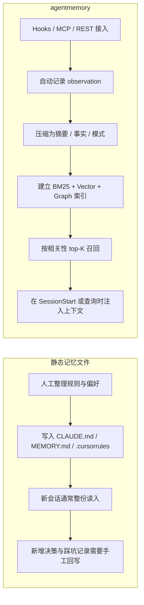

> **目标读者**：已经在使用 Claude Code、Cursor、Codex CLI、Copilot CLI 等 AI 编程 Agent，并且切身感受过"每开一个新会话就要重新解释项目"的开发者。
> **核心问题**：agentmemory 到底解决了什么问题？它和 `CLAUDE.md`、`MEMORY.md`、`.cursorrules` 这类静态记忆文件有什么本质区别？
> **资料范围**：本文以 agentmemory 的 GitHub README（2026-09-08 快照，对应 npm 0.9.29）、benchmark 目录和集成说明为主；凡无法在公开资料中直接证实的说法，本文不沿用。

## 学习目标

读完本文后，你应当能够：

1. 说清 agentmemory 的定位：它解决什么问题，和静态记忆文件的本质区别是什么
2. 解释四层记忆巩固模型（Working / Episodic / Semantic / Procedural）和三路混合检索各自在做什么
3. 描述三种接入方式（Hooks、MCP、REST API）各自适合什么场景，以及 MCP shim 在连不上服务器时只剩 7 个工具这个关键限制
4. 完成 agentmemory 的安装，并在 Claude Code 或 Cursor 中接入使用
5. 根据 README 中的 benchmark 口径和默认配置，判断是否采用它、按什么顺序采用

**自测问题：**

1. 四层巩固模型每一层都在做什么？如果只用到第一层（原始捕获），会丢失什么能力？
2. BM25 + Vector + Graph 三种索引各自适合召回什么？Keyless 模式下三者谁在工作？
3. `@agentmemory/mcp` shim 连不上完整服务时会发生什么？这对"只接一个轻量 MCP"的用法意味着什么？

---

## 1. 它解决的是会话记忆断层

AI 编程 Agent 最大的问题往往出在记忆上。上一轮解释过的目录结构、鉴权方案、依赖约束，下一轮它还要重新理解。项目变大后，这种重复会带来三个直接成本：

- 上下文要反复重塞，token 消耗持续升高。
- 关键决策散落在对话里，过几天几乎无法复用。
- 当你同时在多个 Agent 之间切换时，记忆无法共享，等于每个 Agent 都从零开始。

只靠静态记忆文件通常不够。`CLAUDE.md`、`MEMORY.md`、`.cursorrules` 这类文件适合放项目约束、代码风格和长期规则，但它们本质上还是手工维护的说明文档，不会自动记录工具调用、不会做相关性检索，也不擅长处理"上次修过什么 bug"这类动态历史。agentmemory 的 README 给了一组对照数字：内置记忆文件约 200 行就到容量上限，240 条观察记录全量塞进上下文要 22K+ token；agentmemory 每个会话平均注入约 1,900 token，相当于省 92%。

两类方案的差别可以先压缩成下面这张表：

| 方案 | 本质 | 优点 | 短板 |
| --- | --- | --- | --- |
| 静态记忆文件 | 手工维护的规则说明 | 简单、透明、零运行时 | 约 200 行封顶，容易过时，无法按相关性召回，跨 Agent 难共享 |
| agentmemory | 本地运行的可检索记忆服务 | 自动捕获、压缩、检索、回灌上下文 | 需要运行时与集成配置 |

对长期编码工作流来说，关键在于这些信息能不能在下一次会话里按相关性被重新取回。

### 1.1 一张图看懂：静态记忆文件 vs agentmemory


```mermaid
flowchart LR
    subgraph A[静态记忆文件]
        A1[人工整理规则与偏好] --> A2[写入 CLAUDE.md / MEMORY.md / .cursorrules]
        A2 --> A3[新会话通常整份读入]
        A3 --> A4[新增决策与踩坑记录需要手工回写]
    end

    subgraph B[agentmemory]
        B1[Hooks / MCP / REST 接入] --> B2[自动记录 observation]
        B2 --> B3[压缩为摘要 / 事实 / 模式]
        B3 --> B4[建立 BM25 + Vector + Graph 索引]
        B4 --> B5[按相关性 top-K 召回]
        B5 --> B6[在 SessionStart 或查询时注入上下文]
    end
```

静态记忆文件负责沉淀规则，agentmemory 负责把历史工作转成可检索上下文。前者更轻，后者更强，也更接近一套运行中的基础设施。

## 2. agentmemory 到底是什么

agentmemory 是一个**构建在 iii engine 之上的持久化记忆系统**，面向支持 hooks、MCP 或 REST API 的 AI Agent。它是一台本地运行的记忆服务器，不同 Agent 可以共用同一份记忆层。

这个项目 2026 年 2 月底创建，五个月内在 GitHub 上从几千 stars 涨到 28,125（2026-09-08 快照，forks 2,436），TypeScript 编写，Apache-2.0 协议，npm 最新版本 0.9.29。README 首页的徽章给出了几组最常被引用的数据：

- 95.2% 的检索 R@5（LongMemEval-S，500 题）
- 92% 的 token 节省（每会话约 1,900 token）
- 54 个 MCP tools
- 12 个自动 hooks
- 1,674+ 个通过的测试
- 不依赖外部数据库服务

这些数字都能在 README 中找到出处，但不能脱离 benchmark 口径和默认配置单独理解，第 7 节会逐条拆开。更接近工程现实的判断是：agentmemory 已经把自动采集、混合检索、本地运行和多 Agent 接入打包成了一个成品系统，不是只有 API 的 memory SDK。

项目对外暴露的形态主要有三层：
- 一个完整运行的本地服务，负责 API、viewer、hooks、压缩和回放。
- 一个可独立接入的 MCP server，适合 Cursor、Claude Desktop、Cline 这类支持 MCP 的客户端。
- 一组对外集成接口，包括 REST API、resources、prompts 和 skills。

它要替代的是每次都要重新解释项目背景的那部分重复劳动，不是笔记文件本身。

## 3. 它是怎么"记住东西"的

### 3.1 记忆流水线

README 对 agentmemory 的工作方式给出了比较完整的流水线描述。它是一套围绕 session 组织的处理链路，不是"写入一条记忆，再搜索一条记忆"的简单循环。

```text
PostToolUse
    -> SHA-256 去重（5 分钟窗口）
    -> 隐私过滤（剥离 API key 与密钥）
    -> 保存原始 observation
    -> 合成压缩（默认）；配置 LLM provider 且 AGENTMEMORY_AUTO_COMPRESS=true 时改为 LLM 压缩
    -> 配置了 embedding provider 时生成向量
    -> 建立 BM25 索引（向量启用后一并索引）

Stop / SessionEnd
    -> 汇总会话
    -> GRAPH_EXTRACTION_ENABLED=true 时抽取知识图谱
    -> AGENTMEMORY_SLOTS=true 时执行 slot reflection

SessionStart
    -> 读取项目画像
    -> 混合检索相关记忆
    -> 在默认 2000 token 预算内注入上下文
```

这里有两个经常被忽略的前提。

- **默认行为比你想象的保守，但捕获不缺席**。观察捕获走 PostToolUse，不依赖任何开关；压缩默认是本地的合成压缩，LLM 压缩需要同时配置 provider 和 `AGENTMEMORY_AUTO_COMPRESS=true`。语义检索需要显式开启本地 embedding 或配置远程 provider。装完即得的是 BM25 关键词召回加自动捕获，更强的能力都是显式选择。
- **上下文注入是一个独立开关**。`AGENTMEMORY_INJECT_CONTEXT=false` 是默认值。开启后，SessionStart 才会在每个会话第一轮注入约 1–2K 字符的项目上下文——对 Claude Code 来说，SessionStart 的 stdout 会进入模型上下文，这是注入真正生效的通道。无论这个开关开不开，PostToolUse 的捕获照常进行。

### 3.2 核心概念：四层巩固模型

介绍 agentmemory 时，最容易误解的地方是把它概括成"Capture / Organize / Retrieve / Forget"四阶段生命周期。根据 README，项目真正强调的是 **4-Tier Memory Consolidation**，也就是四层记忆巩固模型：

| 层级 | 保存什么 | 解决什么问题 |
| --- | --- | --- |
| Working | 工具调用产生的原始 observation | 保留最接近现场的短期记忆 |
| Episodic | 压缩后的会话摘要 | 回答"上一次发生了什么" |
| Semantic | 抽取出的事实、模式与稳定知识 | 回答"这个项目长期成立的事实是什么" |
| Procedural | 工作流、决策套路与可复用做法 | 回答"这类事情通常怎么做" |

这个模型的重点在于，agentmemory 让项目知识逐步沉淀成不同密度、不同稳定性的记忆层，而不是把所有信息平铺存起来。README 还明确提到记忆按艾宾浩斯遗忘曲线衰减、被频繁访问的记忆会强化、陈旧记忆自动淘汰、矛盾事实会被检测并处理。

### 3.3 混合检索不是一句口号

agentmemory 的检索是三路信号混合，不是单一向量检索：

| 检索流 | 作用 | 何时可用 |
| --- | --- | --- |
| BM25 | 词干化关键词匹配，带同义词扩展 | 始终可用 |
| Vector | 稠密向量的余弦相似度检索 | 配置了 embedding provider 后可用 |
| Graph | 根据实体关系做图遍历 | 查询中识别出实体时可用 |

三路结果用 Reciprocal Rank Fusion（RRF，k=60）融合，并做会话级多样化——每个会话最多贡献 3 条结果，避免结果全都来自同一段历史。这套检索方式很贴近编程场景：一部分查询明显依赖关键词，例如包名、文件路径、错误码；另一部分更像语义召回，例如"数据库性能优化""之前那次鉴权改造"。

要让语义检索跑起来，现在的做法比早期简单：npm 安装已内置 `@huggingface/transformers` 运行时，只需在 `~/.agentmemory/.env` 里设置 `EMBEDDING_PROVIDER=local` 并重启，首次请求会下载 `Xenova/all-MiniLM-L6-v2`（384 维），之后推理完全在本地，README 给出的收益是比纯 BM25 高约 8 个百分点的召回。远程 provider 也支持 Gemini（`gemini-embedding-001`，有免费额度；旧的 `text-embedding-004` 已于 2026 年 1 月 14 日停用）、OpenAI（`text-embedding-3-small`，$0.02/1M）、Voyage（`voyage-code-3`）、Cohere 和 OpenRouter。

中文用户还需要注意一个细节：BM25 默认开箱支持希腊文、西里尔文、希伯来文、阿拉伯文和带变音符的拉丁文，但中日韩文本需要额外安装分词器（`npm install @node-rs/jieba tiny-segmenter`），否则中文记忆会退化为整段切分，agentmemory 会在 stderr 打一次性提示。

### 3.4 一个会话周期的完整流转

把上面的机制串成一次真实工作。README 用"先加鉴权，再加限流"作例子：

第一会话，你要求给 API 加鉴权。Agent 写代码、跑测试、修 bug，PostToolUse hook 在每个工具调用后静默捕获：改了哪些文件、测试怎么跑的、最终采用了 jose 而不是 jsonwebtoken（为了 Edge 兼容）。会话结束时，Stop hook 把这些原始观察压缩成摘要沉淀进 Episodic 层，关键事实（"鉴权中间件在 `src/middleware/auth.ts`"）进入 Semantic 层。

第二会话，你只说"加个限流"。SessionStart hook 读取项目画像，用混合检索找回上一会话的记忆，在 2000 token 预算内注入上下文——Agent 直接知道鉴权用了 jose、测试覆盖了 token 校验，不需要你重新解释。

一次完整的流转就是这样：捕获（PostToolUse）→ 压缩沉淀（Stop）→ 检索注入（SessionStart）→ 跨会话复用。四层模型、三路检索、hooks 体系都是为这条链路服务的。

## 4. 快速开始：先分清完整服务和独立 MCP

agentmemory 的第一层使用门槛，是先分清自己要什么能力，配置文件反而靠后。

需要完整体验，包括 viewer、REST API、session replay、自动 hooks、压缩和回灌时，应该启动完整服务：

```bash
# 终端 1：启动完整服务（首次运行是交互式 setup）
npx -y @agentmemory/agentmemory@latest

# 终端 2：导入 3 个演示会话（JWT 鉴权、N+1 查询修复、限流），直接看召回效果
npx -y @agentmemory/agentmemory@latest demo

# 打开实时 viewer
open http://localhost:3113
```

首次运行是一个交互式安装向导：选择要接入的 Agent（Claude Code、Cursor、Codex、OpenCode 等）、选择 LLM provider 或保持 keyless，然后它写入配置、启动记忆服务器和固定版本的 iii 引擎。README 的开发章节给出的前提是 Node.js >= 20，macOS/Linux 首次运行会自动安装 pinned 的 iii-engine v0.11.2（需要 `curl`、POSIX `sh` 和 `tar`）。

启动后用四个端口验证状态：3111 是 REST API + MCP HTTP，3112 是 iii streams，3113 是 viewer，49134 是 iii worker WebSocket。README 的推荐验证路径是：

```bash
curl -fsS http://localhost:3111/agentmemory/livez
curl -fsS http://localhost:3111/agentmemory/health
npx -y @agentmemory/agentmemory@latest status
```

只需要把它接成 MCP server，而不关心 viewer、REST API 或 cron 时，可以走更轻的独立 MCP 方式：

```bash
npx -y @agentmemory/agentmemory@latest mcp
# 或者使用 shim 包
npx -y @agentmemory/mcp
```

但这里有一个必须知道的限制：`@agentmemory/mcp` 是一个薄 shim。**只有当它能通过 `AGENTMEMORY_URL` 连上正在运行的完整服务时，才暴露全部 54 个工具**；连不上时它退回 7 个本地工具（`memory_save`、`memory_recall`、`memory_smart_search`、`memory_sessions`、`memory_export`、`memory_audit`、`memory_governance_delete`）。如果你在 Cursor 里只看到 7 个工具，原因就是完整服务没在跑。所以"纯 MCP 轻量接入"实际是两种形态：要么接受 7 个基础工具的完全离线模式，要么本地起一个完整服务、MCP 只是它的接入面。

### 4.1 Cursor 现在有两条路

Cursor 的接入方式在 2026 年发生了变化，早期"Cursor 只能走 MCP"的说法已经过时。现在 README 给了两条路径：

**MCP 接入**：把标准 `mcpServers` 块合并进 `~/.cursor/mcp.json`，或者用 `agentmemory connect cursor` 写入，网站上还提供一键 deeplink：

```json
{
    "mcpServers": {
        "agentmemory": {
            "command": "npx",
            "args": ["-y", "@agentmemory/mcp"],
            "env": {
                "AGENTMEMORY_URL": "http://localhost:3111"
            }
        }
    }
}
```

**插件接入**：`agentmemory` 的 Cursor 插件在 `.cursor-plugin/` 提供 7 个自动捕获 hook（sessionStart、beforeSubmitPrompt、preToolUse、postToolUse、postToolUseFailure、stop、sessionEnd）加 17 个 skills 和 MCP server，Cursor Marketplace 上架在审核中，当前可以从本地 checkout 安装。它在 Cursor IDE 和 `cursor-agent` CLI 中都能工作。

MCP-only 的 Cursor 依然拿不到自动会话捕获，但想要完整体验已经有插件路径可选，只是还不算一键。

### 4.2 Claude Code 的接法最深

Claude Code 是 agentmemory 重点照顾的场景。README 给出的推荐路径是：

1. 单独开一个终端运行 `npx -y @agentmemory/agentmemory@latest`。
2. 在 Claude Code 里执行 `/plugin marketplace add rohitg00/agentmemory`。
3. 再执行 `/plugin install agentmemory`。

这条路径会注册 12 个 hooks（覆盖 SessionStart、UserPromptSubmit、PreToolUse、PostToolUse、PostToolUseFailure、PreCompact、SubagentStart/Stop、Stop、SessionEnd）、17 个 skills，并通过 `.mcp.json` 自动接上 `@agentmemory/mcp`，拿到全部 54 个工具。

如果不想装插件、只想在 `~/.claude.json` 里手动配 MCP，有一个坑要绕开：插件路径里的 `${CLAUDE_PLUGIN_ROOT}` 不会被解析，hook 脚本得指向内嵌版本号的绝对路径，下次升级就静默失效。README 给的解法是 `agentmemory connect claude-code --with-hooks`，它会把 hook 命令以绝对路径合并进 `~/.claude/settings.json`，升级 agentmemory 后重跑一次即可。

### 4.3 其他 Agent 接入方式

README 当前列出的适配对象已经扩到 20 个 `connect` 适配器，`npx skills add` 支持 50+ 个 Agent，远不止 Claude Code、Cursor、Codex CLI 这几个名字：GitHub Copilot CLI、Devin（6 hooks + MCP）、Warp、pi、OpenHuman、Qwen Code、Kiro、Continue.dev、Zed、Droid、DeepSeek Harness、OpenClaw、Hermes、OpenCode（22 hooks）、Cline、Goose、Kilo Code、Roo Code、Aider 等。

这些接法大致分三类：

- **插件 / hook 模式**（能自动捕获）：Claude Code（12 hooks）、Codex CLI（6 hooks）、OpenCode（22 hooks）、Devin（6 hooks）、Cursor（7 hooks 插件）、Copilot CLI（插件 hooks/skills）、Hermes、OpenClaw、pi。
- **MCP 模式**（工具可用，无自动捕获）：Claude Desktop、Cline、Goose、Kilo Code、Roo Code、Windsurf、Zed 等。
- **REST API 模式**：Aider 或任意能发 HTTP 请求的 Agent，例如：

```bash
curl -X POST http://localhost:3111/agentmemory/smart-search \
    -H "Content-Type: application/json" \
    -d '{"query": "auth"}'
```

两个时间点相关的变化需要单独说。其一，**Gemini CLI 已于 2026-06-18 停服**，README 建议迁移到 Antigravity（`agentmemory connect antigravity` 写标准 `mcpServers` 块；命令行工具则是 `antigravity-cli`/`agy`）。其二，**Codex Desktop 有一个已知缺陷**（openai/codex#16430）：插件 hooks 目前不被派发，MCP 工具不受影响；要补上生命周期捕获，跑 `agentmemory connect codex --with-hooks` 把 hook 镜像进全局 `~/.codex/hooks.json`，等上游修复后再撤。

日常运维有五个命令：

```bash
agentmemory                    # 启动服务
agentmemory stop               # 干净地停止
agentmemory connect <agent>    # 接入另一个 Agent
agentmemory doctor             # 交互式诊断 + 修复提示
agentmemory remove             # 卸载它创建的所有东西
```

数据默认不落在你的仓库里：macOS 在 `~/Library/Application Support/agentmemory`，Linux 在 `$XDG_DATA_HOME/agentmemory` 或 `~/.local/share/agentmemory`，Windows 在 `%APPDATA%\agentmemory`；用 `--data-dir` 或 `AGENTMEMORY_DATA_DIR` 可以显式指定，重启时传同一个值。

## 5. "54 个 MCP 工具"不是全部答案

很多介绍文章都会突出 MCP tools 的数量，但只停在数字上，很容易把它误读成一份工具清单。README 的实际表述是 **54 个 MCP tools、6 个 resources、3 个 prompts、17 个 skills，外加 3111 端口上的 130 个 REST endpoints**。

工具本身还分了三档可见度：`AGENTMEMORY_TOOLS=core` 只留 8 个 essentials（`memory_save`、`memory_recall`、`memory_consolidate`、`memory_smart_search`、`memory_sessions`、`memory_diagnose`、`memory_lesson_save`、`memory_reflect`）；基础集是注册表的 14 个核心工具；默认 `all` 暴露全部 54 个。

对大多数人来说，最先用到的通常是下面几类：

| 能力类型 | 代表能力 | 用途 |
| --- | --- | --- |
| 回忆与检索 | `memory_recall`、`memory_smart_search` | 找回过去的观察、文件历史和相关上下文 |
| 主动写入 | `memory_save` 把决策、经验、偏好存成长期记忆 | 手动沉淀值得记住的信息 |
| 会话理解 | `memory_sessions`、`memory_timeline`、`memory_profile` | 查看最近会话、时间线与项目画像 |
| 导出与关系查询 | `memory_export`、`memory_relations`、`memory_graph_query` | 迁移或审计记忆 |
| 治理与验证 | `memory_audit`、`memory_governance_delete`、`memory_verify` | 处理陈旧或敏感记忆，追溯来源 |
| 多 Agent 协作 | `memory_lease`、`memory_signal_send`、`memory_team_share` | 并行协作时避免记忆冲突、共享上下文 |

记忆本身带一套生命周期模型。每条观察和记忆都带不可变的来源通道标记（user、agent、tool、import 或 shared）；记忆有版本化与取代（supersession）机制——被新版本取代的记忆离开检索索引，但版本链在 KV 里保留完整历史，用于溯源；保存时如果内容与已有记忆高度相似，会返回一个 `similarTo` 提示而不是静默重复存储。遗忘侧有三条路径：TTL 到期过期、矛盾检测、按重要性淘汰。多 Agent 场景下 `AGENT_ID` 给每条写入打角色标签，`AGENTMEMORY_AGENT_SCOPE` 控制召回时按角色过滤（默认 `shared`，可切 `isolated` 严格隔离）。所以 agentmemory 里存的不是一条条无差别的字符串，而是有来源、有版本、有关联、会过期的结构化记忆。

resources、prompts 和 skills 是工具之外的三类接口：

- resources：`agentmemory://status`、`agentmemory://project/{name}/profile` 等 6 个只读订阅接口，覆盖运行状态和项目画像。
- prompts：`recall_context`、`session_handoff`、`detect_patterns` 三个上下文模板。
- skills：`/remember`、`/recall`、`/forget` 等 9 个可直接调用的动作技能，外加 8 个按需加载的参考技能，README 原生 skills 共 17 个。

只把这一节理解成"工具清单"会低估它的完整度。agentmemory 是在把长期记忆做成一套可调用的能力面，而不仅是若干条 CRUD 命令。

## 6. 为什么 iii 在这里不是幕后依赖

很多同类项目的实现思路是"一个 Node 或 Python 服务 + 一个向量数据库 + 一个 Viewer + 一层工具接口"。agentmemory 走的不是这条路。README 在架构部分反复强调，它本身就是一个运行中的 iii 实例，functions、triggers、KV state、streams、OTEL traces 都是 iii primitives；用 iii 的 HTTP Triggers、KV State 和内存向量索引，直接替代了你通常会在外面单搭的 Express + Postgres/Redis + 向量数据库那一套。

这里的关键点在于，iii 对它来说是产品边界的一部分，不是内部依赖。你会直接用到这些 iii 能力：

- `iii console --port 3114` 用来查看 traces、streams、state 和函数调用（viewer 占了 3113，console 错开到 3114）。README 用一句话划清分工：viewer 看你的 Agent**记住了什么**，iii console 看 Agent**做了什么**。
- `iii worker add iii-cron` 为记忆巩固、衰减扫描和快照轮换提供调度。
- `iii worker add iii-observability` 打开 OTEL 可观测性链路（iii-config.yaml 里默认启用，采样率 1.0，开箱即有 trace）。
- `iii worker add iii-queue` 处理 embedding 和压缩任务的持久化重试。
- `iii worker add iii-pubsub` 支持多实例记忆：把写入广播给每个连接的实例。
- `iii worker add iii-database` 在需要时切换到 SQL-backed state adapter。
- 另有两个新选项：`iii worker add iii-sandbox` 让召回出来的代码在一次性 microVM 里运行，`iii worker add mcp` 可以在同一引擎上再挂其他 MCP server。

整个系统的规模据 README 自述是 184 个源文件、约 42,200 行代码、264 个函数、50 个 KV scope，全部跑在这三个原语上。

还有一个安全细节：iii console 本身不做鉴权，保持默认的 `127.0.0.1` 绑定，不要暴露到公网。

因此，agentmemory 更像一个完整系统，不只是记忆层 SDK。它把运行、回放、观测、扩展和治理一起交付出来了。

## 7. README 里的指标该怎么读

这些指标可以引用，但最好连同使用边界一起看。下面这张表更接近工程上的理解方式：

| 指标 | 官方口径 | 更稳妥的理解 |
| --- | --- | --- |
| 检索 R@5 | 95.2%，基于 LongMemEval-S（ICLR 2025，500 题）；R@10 98.6%，MRR 88.2% | 说明混合检索能力不弱，对比行里 BM25-only fallback 是 86.2%，差距主要来自语义召回。这是 README 的 benchmark 口径，不是独立第三方复测 |
| 新增 benchmark | coding-agent-life-v1（自建 15 会话语料）：hybrid P@5 0.240、R@5 1.000、15/15 命中、p50 延迟 14 ms；grep 基线 P@5 0.227、R@5 0.967 | 语料小且 gold 稀疏，README 自己也说 LongMemEval-S 更有区分度；提升点是召回和时间序查询，不是聚合精度 |
| Token 节省 | 92% fewer tokens，约 1,900 token/会话；年度口径：全量粘贴 19.5M+ token，LLM 摘要约 65 万（约 $500/年），agentmemory 约 17 万（约 $10/年），配本地 embedding 为 $0 | 说明"按需召回"明显优于每轮全量塞上下文，但不同项目的节省比例会随工作流波动 |
| 12 auto hooks | 首页徽章与集成说明都在强调 | 这个数字适用于支持 hooks 的深度集成（Claude Code、Codex CLI、OpenCode、Devin 等），MCP-only 客户端不在此列 |
| 0 external DBs | 首页徽章与对比表中明确给出 | 正确理解是"不需要另起一套外部数据库服务"——它用 SQLite + iii-engine，不是零存储 |
| 1,674+ tests passing | 首页徽章与开发章节（`npm test` → 1,674 tests）一致 | 说明项目测试覆盖比较积极，但不能替代你对自身集成路径的验证 |

README 在竞品表下还主动加了一条 benchmark 声明，值得原文引用："只有 agentmemory 的 R@5 是我们自己测的（LongMemEval-S，可从 benchmark/COMPARISON.md 复现）；mem0 和 Letta 的数字是它们已发表的 LoCoMo 成绩（不同数据集）；MemPalace、supermemory、TencentDB、oracleagentmemory 的数字是厂商自报，我们未独立复现。放在一起只作量级参考，不是同数据下的正面交锋。"一个项目愿意在自家 README 里写清这类口径差异，本身是加分项。

复现入口也齐全：`eval/README.md` 提供可插拔 adapter 的评测框架（LongMemEval-S 公开 500 题 + 自建 15 会话语料），逐次评分报告落在 `docs/benchmarks/` 目录。

## 8. 如果和 mem0、Letta 摆在一起看

单看"都有 memory"这个标签，很容易把它们混成同一类项目。实际上这几种方案切入的层级并不一样。对大多数开发者来说，关键问题是给现有 Agent 补一层记忆，还是引入一套新的 agent 平台。

agentmemory 的 README 竞品表现在覆盖 10 个对比对象（mem0 63K stars、Letta/MemGPT 24K、Khoj 36K、supermemory 29K、TencentDB Agent Memory 22K、MemPalace 54K、oracleagentmemory、Hippo、内置 CLAUDE.md），另列了 Zep/Graphiti（30K，时序知识图谱，LongMemEval 63.8%）和 Cognee（30K，文档转知识图谱）两个新玩家。关键的形态区分浓缩如下：

| 项目 | 更接近什么 | 更适合谁 | 和 agentmemory 的关键差异 |
| --- | --- | --- | --- |
| agentmemory | 记忆引擎 + MCP server + 本地运行时 | 已经在用 Claude Code、Cursor、Codex CLI 等现成 Agent，希望跨会话、跨 Agent 共享记忆的开发者 | 不要求你换掉现有 Agent，只是在外部补上一层共享记忆基础设施 |
| mem0 | 通用 memory layer / SDK / API 平台 | 在做应用级 AI assistant、客服、个性化系统，需要 SDK、API、self-hosted 或 cloud 多种交付形态的团队 | 本质上更偏应用层 memory platform；自动捕获靠手动 `add()` 调用，没有 hook 体系 |
| Letta | 带高级记忆能力的 stateful agent 平台 | 想直接构建长期运行、可自我改进的 agent 系统，而非只给现有 Agent 加一层 recall 的团队 | 它是一套完整的 agent runtime，框架绑定深，采用成本更高 |

实际选择时，可以按下面几条判断：

- **已经有现成的编码 Agent，只是缺长期记忆**：先看 agentmemory。
- **在做面向最终用户的 AI 应用，需要 API、SDK、托管与自托管多种形态**：mem0 往往更顺手。
- **目标是引入一个 stateful agent 平台，而不是外挂记忆层**：Letta 更适合直接当作主方案采用。

站内的 [claude-mem](/posts/tech/claude-mem-persistent-memory-65k-stars/) 也可以作为参照：它更聚焦 Claude Code 单一工作流的记忆与压缩，跨 Agent 的基础设施视角不如 agentmemory 强。还有一个变化：claude-mem 已不在 agentmemory 当前 README 的对比表里，对比对象换成了 mem0、Letta 这些更大体量的玩家——侧面说明项目自我定位的变化。

## 9. 哪些场景适合用，哪些不适合

下面这些场景更适合 agentmemory：

- 你长期在同一个代码库里迭代，希望 Agent 能记住架构决策、踩坑记录和文件演化历史。
- 你会在 Claude Code、Cursor、Codex CLI 等多个 Agent 之间切换，希望它们共享记忆层。
- 你不想再维护一堆越来越长、越来越陈旧的静态记忆文件。
- 你需要可观测性，希望看到记忆是怎么被捕获、压缩、检索和注入的。

如果需求只是"给 Agent 一份简短项目说明"，那静态记忆文件通常更轻。下面这些情况也不一定适合一开始就引入 agentmemory：

- 项目很小，长期记忆价值有限。
- 当前 Agent 客户端只支持最基础的 MCP，没有 hooks，自动捕获收益会打折（且 shim 只剩 7 个工具）。
- 你不愿意在本地维护 iii-engine 或 Docker 这类运行时。
- 你更需要一个托管型团队知识库，而不是本地优先的开发记忆层。

还有几个部署层面的现实边界也需要提前知道：

- 完整服务依赖 pinned 的 iii-engine v0.11.2 或 Docker；macOS/Linux 首次会自动安装，原生 Windows 需要手动下载 `iii.exe`（或走 WSL2/Docker Desktop）。pin 在 v0.11.2 是因为引擎 v0.11.6 改成了沙箱模型，agentmemory 还没适配完。
- 默认 LLM provider 是 no-op：合成压缩和 BM25 召回照常工作，但所有 LLM 驱动的能力（LLM 压缩、图谱抽取的摘要质量）都需要先配 provider。配置了 provider 后，consolidation 默认开启，想完全无 LLM 运行需显式设 `CONSOLIDATION_ENABLED=false`。
- 远程部署有官方模板：fly.io、Railway、Render、Coolify 四种一键部署，只对外发布 3111 端口，viewer 留在 loopback 里走 SSH 隧道。
- 如果靠 `import-jsonl` 导入 Claude Code 历史作为主要捕获方式，注意 Claude Code 的 `cleanupPeriodDays` 默认 30 天就会删掉旧 JSONL——超过 30 天的历史在导入前就没了，要么定期跑导入，要么调大这个值，要么直接用 hooks 实时捕获。

## 10. 小结

从工程视角看，agentmemory 把 AI Agent 的长期记忆做成了**本地可运行、可检索、可观察、可扩展**的一层基础设施。session 中零散的 observation 会沉淀成四层记忆，再通过 BM25、vector、graph 三路融合把相关上下文找回来，最后用 MCP（54 工具）、REST（130 端点）、skills、viewer 和 iii console 交付整套能力。

只需要给 Agent 一份项目说明时，静态记忆文件已经够用。到了"一个项目要跑很多轮、很多天、很多 Agent"的阶段，agentmemory 的差异才会真正显出来：它把过去的工作变成下一轮可用的上下文，而且这条链路里的每一步都能看到。

## 11. 练习

### 练习 1：评估你的项目是否需要 agentmemory

回顾你最近一个月使用 AI 编程 Agent 的经历，回答以下问题：

1. 你有没有遇到过"上次已经解释过的问题，新会话又要重新解释"的情况？
2. 你的 `CLAUDE.md` 或 `MEMORY.md` 是否已经很难维护？
3. 你是否在多个 Agent 之间切换（例如 Claude Code 和 Cursor），并且希望它们共享记忆？
4. 你的项目是否已经运行超过 3 个月，并且积累了很多隐性决策？

如果以上问题的答案多为"是"，那么 agentmemory 可能适合你的场景。

### 练习 2：对比三种接入方式

根据你所使用的 Agent，填写下表：

| Agent 名称 | 支持的接入方式 | 是否能自动捕获 | 推荐配置 |
|-----------|--------------|--------------|----------|
| Claude Code | hooks + MCP + skills | ✅（12 hooks） | 完整服务 + 插件 |
| Cursor | MCP + 插件 | ✅（插件 7 hooks；Marketplace 审核中） | 完整服务 + 插件，或 MCP-only |
| Codex CLI | 插件 + MCP | ✅（6 hooks；Desktop 需 connect 补 hooks） | 完整服务 + 插件 |
| Aider | REST API | ❌ | 直接调 REST |
| 你的 Agent | ？ | ？ | ？ |

### 练习 3：设计一个记忆策略

假设你正在一个中型项目（约 50 个文件）中使用 Claude Code，请设计一个记忆策略：

1. 你会开启哪些自动功能？（`AGENTMEMORY_AUTO_COMPRESS`、`AGENTMEMORY_INJECT_CONTEXT`、`AGENTMEMORY_SLOTS`、`GRAPH_EXTRACTION_ENABLED`）
2. LLM provider 用云 API、本地 Ollama，还是先 keyless？（README 的成本测算：开启 LLM 压缩后每条观察都会调用模型，35 小时活跃使用在 DeepSeek V4 Flash 上约 $0.07，在旗舰模型上可到 $5+）
3. 你会如何组织记忆的优先级？（哪些信息应该在每次会话开始时被召回，`TOKEN_BUDGET` 设多少）

## 12. 进阶路径

### 阶段 1：深入理解四层记忆模型

- **目标**：理解每一层记忆的适用场景和生命周期
- **行动**：
  1. 阅读 agentmemory 源码中的 consolidation 实现
  2. 观察你的项目在每一层记忆中存储了什么
  3. 在 iii console 里手动触发巩固函数，对比触发前后的记忆状态
- **参考资源**：
  - [agentmemory GitHub 仓库](https://github.com/rohitg00/agentmemory)
  - [记忆巩固的神经科学原理（Wikipedia）](https://en.wikipedia.org/wiki/Memory_consolidation)

### 阶段 2：优化检索质量和性能

- **目标**：让你的记忆召回更准确、更快速
- **行动**：
  1. 用 `BM25_WEIGHT`（默认 0.4）和 `VECTOR_WEIGHT`（默认 0.6）调整两路检索的配比
  2. 为你的项目选择合适的 embedding 模型（本地 `all-MiniLM-L6-v2` 免费起步，代码场景可试 Voyage `voyage-code-3`）
  3. 配置 `TOKEN_BUDGET`（默认 2000），避免注入过多无关记忆
  4. 用 viewer 的 session replay（支持 0.5x–4x 变速）逐事件回放会话，分析召回质量
- **参考资源**：
  - [agentmemory benchmark 目录](https://github.com/rohitg00/agentmemory/tree/main/benchmark)
  - [agentmemory eval 评测框架](https://github.com/rohitg00/agentmemory/blob/main/eval/README.md)

### 阶段 3：构建团队级记忆共享

- **目标**：让团队成员共享项目记忆，避免重复踩坑
- **行动**：
  1. 用 `TEAM_ID`、`USER_ID`、`TEAM_MODE` 配置命名空间，`memory_team_share` / `memory_team_feed` 管理共享流
  2. 用 `AGENT_ID` + `AGENTMEMORY_AGENT_SCOPE` 为 architect / developer / reviewer 等角色做共享或隔离
  3. 用 `memory_governance_delete` 和 `memory_verify` 建立记忆审计规范（什么应该记录、什么不应该记录）
  4. 需要 teammates 各自可见又互不干扰时，对比 `shared` 与 `isolated` 两种 scope 模式后再定
- **参考资源**：
  - [agentmemory 部署模板（fly.io / Railway / Render / Coolify）](https://github.com/rohitg00/agentmemory/tree/main/deploy)
  - [agentmemory README 配置章节](https://github.com/rohitg00/agentmemory#configuration)

## 13. 资料口径说明

为避免把 README 文案直接写成结论，本文的几个关键判断采用了下面的取径方式：

- agentmemory 的架构、安装命令、MCP 形态、viewer、iii console、四层巩固模型、混合检索、工具数量、配置默认值与适配对象，直接以其 GitHub README 的 2026-09-08 快照为准（对应 npm 0.9.29，2026-08-16 发布）；仓库数据（stars、forks、协议、语言）来自 GitHub API 同日查询。
- mem0 与 Letta 的定位对照，采用两者在 agentmemory README 竞品表中的官方表述；表中各家召回数字的口径差异（实测 / LoCoMo / 厂商自报）按 README 原注转述，不作为同口径结论使用。
- claude-mem 在本文里只承担"同属记忆系统、但更偏单一编码工作流"的参照作用，因此只保留高层级定位，不在这篇文章里展开未复核的细节数字。
- 文中的性能数字一律按项目公开口径引用，并明确标注其适用边界，不把 benchmark 结果直接等同于所有生产场景下的实际表现。

## 14. 延伸阅读

- [claude-mem：面向 Claude Code 的持久化记忆系统](/posts/tech/claude-mem-persistent-memory-65k-stars/)
- [yourmemory：基于遗忘曲线的 Agent Memory 设计](/posts/tech/yourmemory-ebbinghaus-agent-memory/)
- [Hindsight：另一种 Agent 记忆系统实现思路](/posts/tech/hindsight-agent-memory-system-guide/)
- [Chrome DevTools MCP：理解 MCP 工具接入的另一条路径](/posts/tech/chrome-devtools-mcp-ai-coding-agents-guide/)
- [agentmemory GitHub 仓库](https://github.com/rohitg00/agentmemory)
- [agentmemory 官网](https://www.agent-memory.dev/)
- [agentmemory benchmark 目录](https://github.com/rohitg00/agentmemory/tree/main/benchmark)
- [iii 文档](https://iii.dev/docs)
