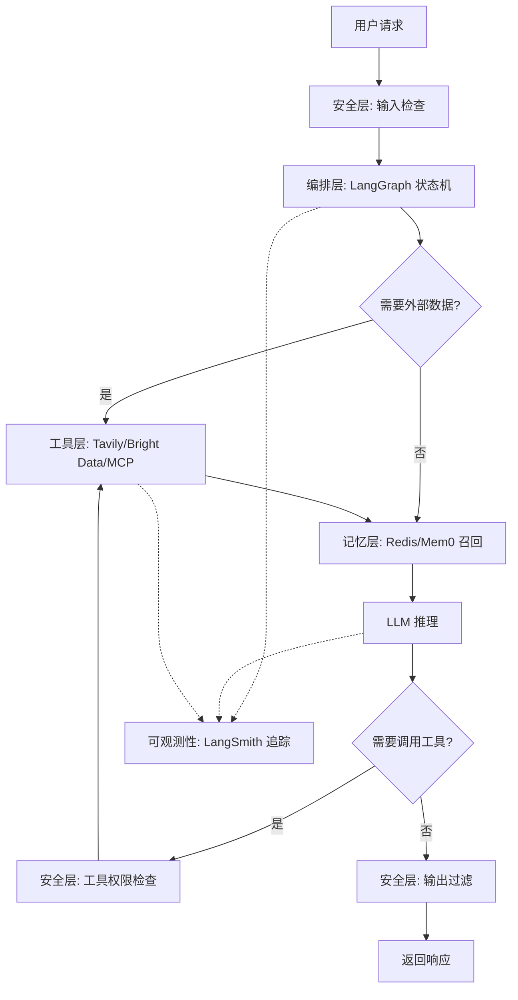

# Agents Towards Production：AI Agent 生产级开发全栈指南

[Agents Towards Production](https://github.com/NirDiamant/agents-towards-production) 把生产环境里真正会卡住人的环节——状态持久化、工具权限、记忆冲突、追踪调试——拆成 28 个独立可运行的教程。每个教程对应一个具体工程问题，配 Jupyter Notebook 或 Python 脚本，克隆下来就能跑。仓库由 Nir Diamant 维护，背后有 LangChain、Redis、Contextual AI 等厂商贡献对应模块的集成教程，不是第三方二手解读。

仓库本身不发明新框架。它做的事是把分散在十几个厂商文档里的集成方案，按生产 Agent 的层次结构归位，并补上每层常见的失败模式。

## 你会从这篇文章里得到什么

读完这篇指南，你应该能回答下面这几个问题：

- 一个生产级 Agent 至少要解决哪几层问题，每层不解决会出什么故障
- 工具集成、记忆系统、部署这三块各自有几条路径，边界在哪里
- 安全、可观测性、评估这三层分别测什么、不能测什么
- 面对一个具体业务需求，怎么从 28 个教程里挑出最小可用子集

如果你正在把一个 Demo Agent 推向生产，或者评估要不要引入某个厂商方案，这篇指南可以作为选型地图。如果你刚接触 Agent 开发，建议先跑通文末"采用顺序"里的第一阶段，再回头看各层细节。

## 目录

- [生产级 Agent 的层次结构与失败模式](#生产级-agent-的层次结构与失败模式)
- [工具集成：四条路径的边界](#工具集成四条路径的边界)
- [记忆系统：三种架构的取舍](#记忆系统三种架构的取舍)
- [RAG：企业级精度](#rag企业级精度)
- [部署：四条路径的演进](#部署四条路径的演进)
- [多智能体协作](#多智能体协作)
- [安全：防御与攻击两条线](#安全防御与攻击两条线)
- [可观测性与评估：测什么，不能推出什么](#可观测性与评估测什么不能推出什么)
- [Agent 框架：三种编排层的选择](#agent-框架三种编排层的选择)
- [模型定制](#模型定制)
- [前端界面](#前端界面)
- [任务流案例：一个研究型 Agent 如何流过系统](#任务流案例一个研究型-agent-如何流过系统)
- [采用顺序与决策建议](#采用顺序与决策建议)
- [常见问题与排查](#常见问题与排查)
- [自测：你选对路径了吗](#自测你选对路径了吗)
- [快速上手](#快速上手)
- [使用前需要注意](#使用前需要注意)
- [赞助生态](#赞助生态)
- [推荐阅读](#推荐阅读)

## 生产级 Agent 的层次结构与失败模式

构建一个能在生产环境稳定运行的 Agent，需要解决八层问题。每层都有典型的失败模式：

| 层次 | 解决的问题 | 不解决会怎样 | 仓库对应教程 |
|---|---|---|---|
| 编排层（Orchestration） | 工作流、状态转移、任务分发 | Agent 跑到一半状态丢失，无法恢复 | LangGraph、FastAPI、多智能体协作 |
| 记忆层（Memory） | 跨会话上下文、用户偏好 | 每次对话从零开始，无法积累 | Redis 双重记忆、Mem0、Cognee |
| 工具层（Tools） | 调用外部 API、搜索、采集 | Agent 只能聊天，不能行动 | MCP、Tavily、Bright Data、Arcade |
| 安全层（Security） | 提示注入、工具权限、内容过滤 | 被恶意输入操控，或泄露敏感数据 | LlamaFirewall、Apex |
| 可观测性（Observability） | 决策路径、执行耗时、中间状态 | 出问题无法定位根因 | LangSmith |
| 评估层（Evaluation） | 输出质量、行为一致性 | 改了 prompt 不知道是变好还是变坏 | IntellAgent |
| 部署层（Deployment） | 容器化、本地推理、GPU 扩展 | 无法从 Notebook 走到生产环境 | Docker、Ollama、RunPod、AWS Bedrock |
| 用户界面（UI） | 交互入口 | 无法让非技术人员使用 | Streamlit |

Demo 阶段只需要编排层加工具层；进入生产前必须补安全层和可观测性；规模化阶段才需要部署层的 GPU 扩展。



安全层在输入和输出两端各设一道关卡，工具调用前再做一次权限检查；可观测性贯穿全程，把每个节点的输入输出和耗时记录下来，供事后排查。

## 工具集成：四条路径的边界

仓库提供了四条工具集成路径，解决的是不同问题。

### MCP 协议：统一接入层

[Model Context Protocol（MCP）](https://github.com/NirDiamant/agents-towards-production/tree/main/tutorials/agent-with-mcp) 是一个标准化的协议，用于将 Agent 与外部 API 和工具对接。用 MCP 接入新工具时，开发者写的是协议适配，不是为每个工具单独写适配层。适合工具数量多、变更频繁的场景。

### Arcade：带权限审批的工具调用

[Arcade Secure Tool Calling](https://github.com/NirDiamant/agents-towards-production/tree/main/tutorials/arcade-secure-tool-calling) 解决的是工具调用的权限问题。通过 Arcade，Agent 可以连接 Gmail、Slack、Notion 等服务，但敏感操作不会自动执行——OAuth2 认证加上"人在回路"（Human-in-the-Loop）审批流程，让发邮件、改文档这类操作必须经过人类确认。企业场景里，这一层决定了 Agent 能不能上线。

### Tavily：实时信息获取

[Tavily 实时搜索集成](https://github.com/NirDiamant/agents-towards-production/tree/main/tutorials/agent-with-tavily-web-access) 解决的是大语言模型知识截止的问题。教程演示了把 Tavily 搜索结果与私有知识库结合，构建一个既能查最新资料又能用内部文档回答问题的研究型 Agent。需要时效性信息的场景——新闻摘要、市场调研——会用到这条路径。

### Bright Data：大规模网页采集

[Bright Data 教程](https://github.com/NirDiamant/agents-towards-production/tree/main/tutorials/agent-with-brightdata) 解决的是反爬问题。使用 Bright Data 的企业级代理网络和反爬基础设施，Agent 可以稳定抓取复杂网站，绕过 CAPTCHA 并提取结构化数据。竞品监控、行业数据聚合这类需要批量采集网页数据的场景会用到。

实际项目里这几条路径通常并存。一个研究型 Agent 可以同时用 MCP 接入内部工具、用 Tavily 查实时信息、用 Bright Data 做批量采集，再用 Arcade 给敏感操作加审批。选型时先看工具数量和权限需求：工具少且无敏感操作走 MCP，工具多且涉及账户操作走 Arcade，需要实时信息走 Tavily，需要批量采集走 Bright Data。

## 记忆系统：三种架构的取舍

记忆系统解决的是 Agent 跨会话保持上下文的问题。仓库提供了三种架构，对应不同的记忆需求。

### Redis 双重记忆：短时 + 长时

[Agent Memory with Redis](https://github.com/NirDiamant/agents-towards-production/tree/main/tutorials/agent-memory-with-redis) 实现了经典的双重记忆架构。**短时记忆**基于当前对话窗口的上下文，**长时记忆**持久化用户偏好和学习成果。Redis 同时充当向量数据库（语义搜索）和内存数据库（高速读写），兼顾检索精度和响应速度。对话密集、对延迟敏感的场景适合这套架构。

### Mem0：自进化记忆

[Self-Improving Memory with Mem0](https://github.com/NirDiamant/agents-towards-production/tree/main/tutorials/agent-memory-with-mem0) 展示了更进一步的记忆架构。Mem0 不仅存储记忆，还会自动提取洞察、解决记忆冲突，并在每次交互中优化自身。混合存储架构结合了向量搜索（语义召回）和图数据库（关系推理），让记忆既精准又有关联性。长期运行、需要积累用户画像的场景适合这套架构。

### Cognee：知识图谱增强

[Cognee 教程](https://github.com/NirDiamant/agents-towards-production/tree/main/tutorials/ai-memory-with-cognee) 展示了如何将分散的开发数据转化为统一的知识图谱，为 Agent 提供结构化的上下文背景。数据来源多、关系复杂的场景——代码库分析、企业知识管理——会用到这套架构。

选型时先看记忆需求：对话密集选 Redis，长期运行选 Mem0，关系复杂选 Cognee。

## RAG：企业级精度

[Production-Ready RAG with Contextual AI](https://github.com/NirDiamant/agents-towards-production/tree/main/tutorials/agent-RAG-with-Contextual) 是面向企业用户的 RAG（Retrieval-Augmented Generation，检索增强生成）教程。Contextual AI 提供托管平台，教程演示了从文档处理、智能索引到 Agent 部署的完整流程，并包含基于 LMUnit 测试框架的自动化评估。金融文档分析这类对精度要求极高的场景会用到——召回率差几个百分点就意味着合规风险。

## 部署：四条路径的演进

部署层解决的是从 Notebook 到生产环境的问题。仓库提供了四条路径，对应不同的部署阶段。

### Docker：环境一致性

[Containerizing Agents with Docker](https://github.com/NirDiamant/agents-towards-production/tree/main/tutorials/docker-intro) 是入门级部署教程，讲解如何将 Agent 打包为 Docker 容器，实现环境一致性、快速部署和横向扩展。这是所有部署路径的起点。

### Ollama：本地推理

[On-Prem LLM Deployment with Ollama](https://github.com/NirDiamant/agents-towards-production/tree/main/tutorials/on-prem-llm-ollama) 让开发者完全在本地运行大语言模型。对于关注数据隐私、控制成本或需要低延迟响应的场景，本地推理可以替代云端 API。Ollama 的设计让你无需深入了解模型 serving 的细节，就能快速跑起一个可用的推理服务。数据不能出内网的场景会用到这条路径。

### RunPod：GPU 云扩展

[Scalable GPU Deployment with RunPod](https://github.com/NirDiamant/agents-towards-production/tree/main/tutorials/runpod-gpu-deploy) 针对计算密集型 Agent 场景——比如需要频繁调用大模型的任务。使用 RunPod 的 GPU 云服务，可以快速搭建推理集群，教程涵盖了环境配置、成本优化和高可用部署。流量波动大、需要弹性算力的场景会用到这条路径。

### AWS Bedrock AgentCore：托管运行时

[AWS Bedrock AgentCore](https://github.com/NirDiamant/agents-towards-production/tree/main/tutorials/aws_agentcore) 演示如何将本地开发的 Agent 部署到 AWS Bedrock 的托管运行时，享受自动扩缩容、请求追踪和标准化通信模式。已经用 AWS 生态、不想自己运维推理集群的团队会用到这条路径。

从 Docker 到 Ollama、RunPod、AWS Bedrock，每一步解决一个新约束：环境一致性、数据隐私、算力弹性、运维托管。每一步在上一步基础上解决新的约束，四条路径可以并存——本地推理和云上托管并不冲突，按场景切换即可。

## 多智能体协作

[Multi-Agent Communication with A2A Protocol](https://github.com/NirDiamant/agents-towards-production/tree/main/tutorials/a2a) 解决的是多个 Agent 如何协同工作的问题。A2A（Agent-to-Agent）是一个开放通信协议，允许不同的 Agent 之间交换消息、分配任务和共享结果。教程通过模拟协作型 Agent 工作流，展示了如何在实际项目中实现多智能体分工。单个 Agent 能力有限、需要多个专精 Agent 协作的复杂任务会用到这条路径。

## 安全：防御与攻击两条线

安全层在仓库里分两条线展开。

### LlamaFirewall：防御侧

[Comprehensive Agent Security with LlamaFirewall](https://github.com/NirDiamant/agents-towards-production/tree/main/tutorials/agent-security-with-llamafirewall) 覆盖了 Agent 安全的三个维度：**输入安全**（防止提示注入）、**输出安全**（内容过滤和脱敏）以及**工具安全**（限制工具调用权限）。教程提供了预配置的护栏方案，适合需要快速为 Agent 添加安全保障的生产项目。

### Apex：攻击侧

[Apex Hands-On Agent Security](https://github.com/NirDiamant/agents-towards-production/tree/main/tutorials/agent-security-apex) 从攻击者视角出发，通过红队演练帮助开发者理解 Agent 可能遭受的安全威胁——包括提示注入攻击的常见手法、防御策略以及自动化安全测试流程。这一侧的价值在于：在攻击者发现漏洞之前，自己先发现。

两条线配合使用。Apex 在上线前做红队测试，发现漏洞；LlamaFirewall 在运行时做防护，拦截攻击。只做防御不做攻击测试，护栏是否有效无从验证；只做攻击测试不做防御，发现问题也来不及拦截。

## 可观测性与评估：测什么，不能推出什么

可观测性和评估解决的是"Agent 上线后怎么知道它工作正常"的问题。仓库提供了两个工具，但它们测量的对象不同。

### LangSmith：执行轨迹

[Agent Tracing & Debugging with LangSmith](https://github.com/NirDiamant/agents-towards-production/tree/main/tutorials/tracing-with-langsmith) 记录每个决策节点、每次工具调用、每段耗时。它测量的是执行过程——Agent 走了哪条路径、每一步花了多久、调用了哪些工具。

LangSmith 能告诉你：Agent 在哪一步卡住了、哪个工具调用最慢、token 消耗分布。LangSmith 不能告诉你：输出质量是否达标、用户是否满意、行为是否一致。这些需要评估层来解决。

### IntellAgent：行为质量

[IntellAgent](https://github.com/NirDiamant/agents-towards-production/tree/main/tutorials/agent-evaluation-intellagent) 提供系统化的 Agent 质量评估方案，包括行为分析、性能指标和可操作的改进建议。它测量的是输出质量——Agent 的回答是否准确、行为是否一致、是否遵循预设规则。

IntellAgent 能告诉你：改了 prompt 后行为是变好还是变坏、不同场景下的表现差异。IntellAgent 不能告诉你：生产环境里的实际延迟、token 成本、用户使用模式。这些需要 LangSmith 的追踪数据。

两个工具各管一段。LangSmith 记录执行过程，回答"Agent 走了哪条路、卡在哪一步"；IntellAgent 评估输出质量，回答"Agent 的回答是否准确、行为是否一致"。生产环境里两个都需要——只有追踪没有评估，不知道质量是否达标；只有评估没有追踪，出问题无法定位。

## Agent 框架：三种编排层的选择

### LangGraph：有状态工作流

[Stateful Agent Workflows with LangGraph](https://github.com/NirDiamant/agents-towards-production/tree/main/tutorials/LangGraph-agent) 是仓库的根本教程之一。LangGraph 是 LangChain 生态中的有状态工作流框架，用有向图描述复杂的多步骤 Agent 行为。与简单的 prompt-chain 不同，LangGraph 支持条件分支、循环和状态持久化。教程通过一个多步骤文本分析 pipeline（分类 → 实体提取 → 摘要）完整展示了其用法。需要复杂决策树、状态需要持久化的场景适合用 LangGraph。

### FastAPI：服务化

[Deploying Agents as APIs with FastAPI](https://github.com/NirDiamant/agents-towards-production/tree/main/tutorials/fastapi-agent) 解决 Agent 的服务化问题。教程演示了如何将 Agent 包装为高性能 API，同时支持同步调用和流式响应（streaming）。需要将 Agent 集成到既有后端系统的团队会用到这条路径。

### Koog：JVM 生态

[Building AI Agents in Kotlin with Koog](https://github.com/NirDiamant/agents-towards-production/tree/main/tutorials/kotlin-agent-with-koog) 面向 JVM 生态的开发者。Koog 是 JetBrains 推出的 AI Agent 框架，教程从零开始，30 分钟内完成从 hello world 到工具调用和结构化输出的完整路径。技术栈在 JVM、不想引入 Python 依赖的团队会用到这条路径。

## 模型定制

[Fine-Tuning AI Agents for Domain Expertise & Efficiency](https://github.com/NirDiamant/agents-towards-production/tree/main/tutorials/fine-tuning-agents) 覆盖如何针对特定领域微调大语言模型，让 Agent 在垂直场景下输出更精准。教程包含数据准备、训练流程、评估方案以及如何将微调后的模型集成回 Agent 工作流。微调适合有标注数据且通用模型在垂直领域表现不足的场景；数据频繁变动时 RAG 更合适。

## 前端界面

[Building a Chatbot UI with Streamlit](https://github.com/NirDiamant/agents-towards-production/tree/main/tutorials/agent-with-streamlit-ui) 提供了最简但完整的 Agent 前端方案。Streamlit 的弱前端属性让它适合快速搭建 Chatbot 界面用于演示和测试，教程包含了对话 UI、文件上传和会话状态管理。生产前端建议换 Next.js 或 Vue，Streamlit 留给内部演示和测试。

## 任务流案例：一个研究型 Agent 如何流过系统

把前面的层次串起来。假设要构建一个研究型 Agent，用户问"最近一周 AI Agent 领域有什么重要进展"，请求会这样流过系统：

1. **安全层（输入）**：LlamaFirewall 检查输入，确认没有提示注入
2. **编排层**：LangGraph 接收请求，初始化状态机
3. **记忆层**：Redis 召回该用户的历史偏好（比如关注多智能体方向）
4. **工具层**：Tavily 搜索"AI Agent 最新进展"，Bright Data 采集几篇关键论文的摘要
5. **编排层**：LangGraph 把搜索结果和用户偏好传给 LLM
6. **LLM 推理**：生成结构化摘要
7. **安全层（输出）**：LlamaFirewall 检查输出，过滤敏感内容
8. **可观测性**：LangSmith 全程记录每一步的输入、输出和耗时
9. **记忆层**：Mem0 把这次交互的洞察存入长时记忆，供下次使用
10. **部署层**：FastAPI 把响应流式返回给用户，Docker 保证环境一致性

## 采用顺序与决策建议

面对 28 个教程，按以下顺序推进：

**第一阶段：跑通一个完整 Agent**
从 LangGraph 的[有状态工作流教程](https://github.com/NirDiamant/agents-towards-production/tree/main/tutorials/LangGraph-agent)开始，配合 [FastAPI 部署教程](https://github.com/NirDiamant/agents-towards-production/tree/main/tutorials/fastapi-agent)，在本地搭建一个可运行的 Agent 服务。这个阶段的目标是让 Agent 跑通"接收请求→调用 LLM→返回响应"的最小循环。

**第二阶段：给 Agent 添加工具和记忆**
接入 Tavily 实时搜索让 Agent 能查最新信息，用 Redis 双重记忆让 Agent 能记住用户偏好。这两个维度的增强会让 Agent 从玩具变成可用的助手。

**第三阶段：安全与可观测性**
上线前必须做两件事：给 Agent 加上 LlamaFirewall 安全护栏，接入 LangSmith 追踪。这两层决定了 Agent 能否在无人值守的情况下稳定运行。

**第四阶段：规模化部署**
Docker 容器化 → RunPod GPU 扩展 → AWS Bedrock 托管。这三步对应从个人项目到企业级产品的演进路径，每一步解决一个新约束。

**选型边界**：

- 工具集成：工具少用 MCP，工具多且需要权限审批用 Arcade
- 记忆系统：对话密集用 Redis，长期运行用 Mem0，关系复杂用 Cognee
- 部署：数据不能出内网用 Ollama，流量波动大用 RunPod，已用 AWS 生态用 Bedrock
- 安全：上线前用 Apex 做红队测试，运行时用 LlamaFirewall 做防护
- 评估：追踪执行过程用 LangSmith，评估输出质量用 IntellAgent

## 常见问题与排查

**Q1：克隆仓库后跑某个教程，报依赖冲突怎么办？**

每个教程目录下都有独立的 `requirements.txt`，不要在同一个虚拟环境里装所有教程的依赖。推荐为每个教程单独建一个 venv 或 conda 环境：

```bash
cd tutorials/LangGraph-agent
python -m venv .venv
source .venv/bin/activate
pip install -r requirements.txt
```

如果仍然报版本冲突，先看 `requirements.txt` 里是否锁定了具体版本，再对照你本地的 Python 版本——部分教程依赖的库在 Python 3.8 以下不可用。

**Q2：LangGraph 状态机跑到一半挂了，重启后状态丢了怎么办？**

LangGraph 默认把状态存在内存里，进程退出就没了。生产环境需要接一个 checkpointer，把状态持久化到 Redis、Postgres 或 SQLite。教程里演示的是内存模式，上线前必须替换成持久化后端，否则长任务无法恢复。

**Q3：Tavily 搜索返回的结果质量不稳定，怎么排查？**

先看搜索 query 是不是 Agent 自己拼的——LLM 生成的 query 经常过于宽泛或过于具体。可以在 LangGraph 里加一个 query 改写节点，让 LLM 先把用户问题转成 2-3 个具体搜索词再调 Tavily。其次看 Tavily 的 `search_depth` 参数，`advanced` 模式会做内容提取，召回质量更高但更慢、更贵。

**Q4：LangSmith 追踪看不到工具调用的入参和出参，只看到名字。**

这通常是因为工具函数没有用 LangChain 的 `@tool` 装饰器，或者用了自定义的工具调用方式，LangSmith 无法自动捕获。把工具函数用 `@tool` 包装，并加上类型注解，LangSmith 就能记录完整的输入输出。如果用的是原生 OpenAI function calling，需要在调用处手动加 `langsmith` 的 trace 包装。

**Q5：LlamaFirewall 拦截了正常用户输入，误报率高怎么办？**

LlamaFirewall 的提示注入检测默认配置偏保守。先看拦截日志里命中的是哪条规则——如果是基于关键词的规则，可以加白名单；如果是基于模型的判断，可以调整阈值。误报率高的场景建议先在影子模式（只记录不拦截）跑一周，收集真实流量后再调规则。

**Q6：Mem0 记忆冲突解决机制把用户偏好改错了，怎么回滚？**

Mem0 的记忆更新是写操作，冲突解决策略默认是"新覆盖旧"。如果发现改错了，可以从 Mem0 的存储后端（通常是向量数据库）手动删除错误条目，让 Agent 重新学习。生产环境建议在 Mem0 之上加一层版本控制或审计日志，记录每次记忆变更的触发原因和前后状态。

**Q7：Docker 容器里跑 Ollama 模型，GPU 没被识别。**

这是 NVIDIA Container Toolkit 没装或配置不对。先在宿主机跑 `nvidia-smi` 确认驱动正常，再确认容器启动时带了 `--gpus all` 参数。Ollama 官方镜像默认支持 GPU，但需要宿主机预装 `nvidia-container-toolkit`。如果用的是 Apple Silicon，Ollama 走的是 Metal，不需要 NVIDIA 驱动，但 Docker 内跑 Ollama 在 Mac 上不支持 GPU 加速，建议直接在宿主机跑 Ollama。

**Q8：AWS Bedrock AgentCore 部署后请求延迟比本地高很多。**

先看延迟分布——是冷启动延迟还是稳态延迟。冷启动高是容器镜像拉取和模型加载，可以通过预热实例或减小镜像解决。稳态延迟高通常是区域问题，确认 Bedrock 的推理区域和你 Agent 部署的区域一致，跨区域调用会加几十到几百毫秒。另外 Bedrock 的模型调用本身有排队，高并发场景需要配额提升。

## 自测：你选对路径了吗

下面几个问题用来检验你是否理解了各层之间的边界。答案在文末。

1. 你的 Agent 需要连接公司内部的 5 个 API，都不涉及账户操作，但 API 经常变更。应该优先选 MCP 还是 Arcade？为什么？

2. 一个客服 Agent 跑了三个月，用户反馈"它记得我上周说的事，但把我名字记错了"。这是哪一层的问题？应该换哪套记忆架构？

3. 团队改了一版 prompt，线上指标没变化，但用户投诉变多了。LangSmith 能直接定位问题吗？还需要补什么？

4. 你的 Agent 部署在内网，数据不能出网，但需要跑 70B 参数的模型。Ollama 够用吗？如果不够，下一步该怎么做？

5. 上线前做了 Apex 红队测试，没发现漏洞。LlamaFirewall 还需要部署吗？两条线的职责差异是什么？

6. 一个研究型 Agent 同时用了 Tavily 和 Bright Data。两者职责怎么划分？如果只用一个，会缺什么能力？

<details>
<summary>参考答案（先自己想再展开）</summary>

1. **选 MCP**。5 个 API、不涉及账户操作、API 经常变更——MCP 的协议适配层正好解决"工具多、变更频繁"的问题。Arcade 的价值在权限审批，这里没有敏感操作，引入 Arcade 会增加不必要的 OAuth2 流程。

2. **记忆层问题，具体是记忆冲突未解决**。"记得上周的事"说明长时记忆在工作，"名字记错"说明记忆条目之间冲突，旧错误值覆盖了新正确值。Redis 双重记忆不处理冲突，应该升级到 Mem0，它的自进化机制会自动解决记忆冲突。

3. **LangSmith 不能直接定位**。LangSmith 测的是执行过程（路径、耗时、工具调用），不测输出质量。用户投诉变多说明输出质量下降，需要补 IntellAgent 做行为质量评估，对比改 prompt 前后的行为差异。LangSmith 的追踪数据可以辅助定位是哪些场景出了问题，但判断"变好还是变坏"需要评估层。

4. **Ollama 不一定够用**。Ollama 能在本地跑模型，但 70B 参数模型对显存要求高（通常需要多卡或量化）。先确认内网机器的 GPU 配置——如果显存够，Ollama 加量化模型可以跑；如果显存不够，要么换更小的模型，要么在内网搭 GPU 集群（参考 RunPod 教程的集群搭建思路，但用内网机器）。数据不能出网是硬约束，AWS Bedrock 这条路径排除。

5. **LlamaFirewall 仍需要部署**。Apex 是攻击侧，上线前做红队测试，发现潜在漏洞；LlamaFirewall 是防御侧，运行时拦截实际攻击。Apex 没发现漏洞不代表运行时没有攻击——新的攻击手法会不断出现，运行时防护不能省。两条线的职责差异：Apex 测"现在有没有已知漏洞"，LlamaFirewall 防"运行时遇到的攻击"。

6. **Tavily 负责实时信息检索（少量、精准），Bright Data 负责大规模网页采集（批量、结构化）**。Tavily 适合"查最新进展"这类需要时效性的查询，返回的是搜索结果；Bright Data 适合"采集 100 个竞品官网的定价页"这类需要批量抓取和反爬的任务，返回的是结构化数据。只用 Tavily 会缺批量采集能力，只用 Bright Data 会缺时效性检索能力——前者抓不到"最新"，后者查不了"实时"。

</details>

## 快速上手

每个教程都可独立运行。不需要克隆整个仓库再摸索依赖关系，每个 tutorial 文件夹下都有独立的 `requirements.txt` 和说明文档，选中哪个就直接进入对应的目录开始。

```bash
# 克隆仓库
git clone https://github.com/NirDiamant/agents-towards-production.git
cd agents-towards-production

# 进入目标教程目录，以 LangGraph 为例
cd tutorials/LangGraph-agent

# 安装依赖
pip install -r requirements.txt

# 启动 Jupyter Notebook
jupyter notebook tutorial.ipynb
```

仓库对 Python 版本的要求因教程而异，但大多数教程支持 Python 3.8+。具体版本要求请查看各教程目录下的 `requirements.txt`。

## 使用前需要注意

仓库声明了明确的免责声明：所有教程仅用于教育目的，作者不对因使用教程内容而造成的任何损失负责。安全相关工具（LlamaFirewall、Apex 等）必须在获得授权后才能用于实际测试。

仓库采用自定义非商业许可证，具体条款在 [LICENSE](https://github.com/NirDiamant/agents-towards-production/blob/main/LICENSE) 文件中约定，使用前请务必查阅。

## 赞助生态

仓库背后有真实的企业赞助商提供支持，每个赞助商贡献了对应工具的详细教程：

- **LangChain**——Agent 框架与工作流编排
- **Redis**——向量存储与内存数据库
- **Contextual AI**——企业级 RAG 平台
- **Bright Data**——网络数据采集基础设施
- **Tavily**——实时网络搜索 API
- **Arcade**——安全的多工具调用平台
- **JetBrains Koog**——Kotlin AI Agent 框架
- **Mem0**——自进化记忆系统
- **RunPod**——GPU 云算力
- **CodeRabbit**——AI 代码审查

每个教程链接都直接指向赞助商的官方文档和技术支持页面。这意味着教程内容来自对应领域厂商的官方集成方案，但也要注意：教程会偏向赞助商自家的工具，选型时需要对照其他方案。

## 推荐阅读

配合这个仓库，以下几本书值得一读：

- **《AI Engineering》**（Chip Huyen）——Chip Huyen 是这个领域最清晰的写作者之一，本书是 LLM 应用生产化的标准参考。
- **《Hands-On Large Language Models》**（Jay Alammar & Maarten Grootendorst）——视觉化风格，对 LLM 的工作机制讲解深入浅出。
- **《Designing Machine Learning Systems》**（Chip Huyen）——虽然聚焦 ML 系统，但生产级部署的实践建议对 Agent 开发同样适用。

---

*本文对应仓库版本为 README.md 中记录的 28 个教程，更新时间请参考 [GitHub 仓库](https://github.com/NirDiamant/agents-towards-production) 最新版本。*
