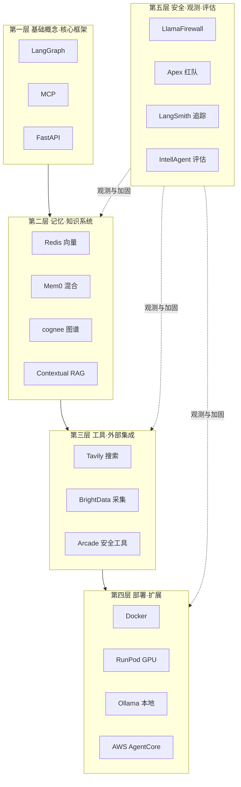

# 开源热点：Agents Towards Production——LLM Agent 开发工程化实践

把 LLM Agent 从原型推到生产，难点在工程链：状态、记忆、工具、安全、观测、部署。任何一环缺失都可能在生产环境暴露问题——没有观测，上线后出问题无法回放；没有安全护栏，工具调用可能越权；没有记忆层，每次对话从零开始。Nir Diamant 的 [agents-towards-production](https://github.com/NirDiamant/agents-towards-production) 做的就是这件事——28 个配套 Notebook，按工程依赖关系排成五层，下层不依赖上层，上层直接复用下层的产物。第一层写好的 Agent 代码，到第四层就是部署目标。

文章先拆仓库的五层架构和一条任务流（带长期记忆的搜索 Agent 从请求到部署的完整链路），再说技术选型逻辑和同类项目差异。读完之后能直接动手的两件事：判断每一层是否适合自己的场景，按依赖关系组合教程。

---

## 目录

- [学习目标](#学习目标)
- [总览：五层架构与依赖关系](#总览五层架构与依赖关系)
- [核心特色](#核心特色)
- [架构设计：从原型到生产的完整路径](#架构设计从原型到生产的完整路径)
- [带长期记忆的搜索 Agent 任务流](#带长期记忆的搜索-agent-任务流)
- [影响力数据](#影响力数据)
- [与同类项目对比](#与同类项目对比)
- [适合谁用](#适合谁用)
- [采用顺序与决策建议](#采用顺序与决策建议)
- [常见问题](#常见问题)
- [自测题](#自测题)
- [相关资源](#相关资源)
- [最小可运行环境](#最小可运行环境)

---

## 学习目标

读完这篇后，你应该能：

- 说出仓库五层架构的依赖方向，解释为什么第五层要从第一层就嵌入而不是部署后才接
- 根据延迟、成本和记忆结构需求，在 Redis、Mem0、cognee、Contextual AI 四种记忆方案里做出选型
- 把"用户提问 → 联网搜索 → 检索历史 → 生成回答"这条任务流映射到五层教程的具体 Notebook
- 区分 LlamaFirewall、Apex、LangSmith、IntellAgent 四个安全/观测/评估工具的作用位置和触发时机
- 给出一个具体场景（内网隔离 / 弹性推理 / 不想运维），选对第四层部署方案并说明理由

---

## 总览：五层架构与依赖关系

仓库把 Agent 生产化拆成五个工程层加一个专题层。下层提供原子能力，上层组合下层产物。你不需要从第一层开始读，但跳层时要清楚自己跳过了哪些前置依赖。



依赖方向自下而上：第一层搭骨架，第二层加记忆，第三层接外部工具，第四层打包部署，第五层全程观测和加固。第五层要从第一层就嵌入追踪点，不能等部署后才接——否则上线后出了问题没有可回放的链路。

---

## 核心特色

28 个教程全部是 Jupyter Notebook 或配套 `.py` 脚本，拿到就是一个可以直接 `Run All` 的工作环境，不需要在文档和代码之间来回跳。

技术栈瞄准真实部署——LangGraph、FastAPI、Redis、Ollama、Docker、RunPod 都是已经在生产里跑的工具，不是教学环境里的简化替代品。LangChain、Redis、Contextual AI、Tavily、Arcade、Mem0、RunPod 等厂商参与了对应教程的编写（贡献者名单与协作记录见[仓库 README](https://github.com/NirDiamant/agents-towards-production) 的 Contributors 部分及各教程目录的 commit 历史），教程里的 API 调用方式、参数选择和架构假设与这些工具的实际版本对齐，可在 commit 历史中逐条追溯。

设计 → 记忆 → 工具 → 安全 → 观测 → 评估 → 容器化 → GPU 部署，每条链路在仓库里都至少有一个对应的教程。下面进入架构设计，逐层拆解每个教程解决的具体工程问题。

---

## 架构设计：从原型到生产的完整路径

### 第一层：基础概念与核心框架

| 教程 | 说明 |
|---|---|
| **LangGraph-agent** | 基于 LangGraph 的有状态 Agent 工作流设计，有向图架构支撑多步骤文本分析流水线（分类→实体抽取→摘要）|
| **agent-with-mcp** | MCP（Model Context Protocol）标准化协议接入外部工具与 API |
| **fastapi-agent** | 将 Agent 部署为 FastAPI API，支持同步与流式响应 |

这一层解决的是"Agent 的骨架长什么样"。LangGraph 用有向图描述状态流转，每个节点是一步操作，边是状态迁移条件——这样设计的好处是调试时能定位到具体节点，而不是面对一坨隐式调用链。MCP 把工具调用收敛到统一协议，避免每接一个 API 就写一套胶水代码。FastAPI 把 Agent 包成 HTTP 服务，是后续 Docker 化和 GPU 部署的前置条件。

### 第二层：记忆与知识系统

| 教程 | 技术选型 |
|---|---|
| **agent-memory-with-Redis** | Redis 作为向量存储 + 内存数据库 |
| **agent-memory-with-mem0** | Mem0 自改进型记忆系统，混合向量 + 图存储 |
| **ai-memory-with-cognee** | cognee 图谱记忆方案 |
| **agent-RAG-with-Contextual** | Contextual AI RAG 平台接入 |

四种记忆方案各有侧重：Redis 适合低延迟的会话级记忆；Mem0 的混合存储适合需要跨会话关联的长期记忆；cognee 的图谱结构适合实体关系密集的领域（如医疗、法律知识库）；Contextual AI 适合不想自己维护检索管线的团队。选型差异落在三个具体维度上：Redis 的延迟在毫秒级但表达力弱，只能做向量近似检索；Mem0 的混合存储能关联跨会话实体，但写入路径长、成本高；cognee 的图谱查询表达力最强，前提是愿意投入领域建模；Contextual AI 把检索管线托管出去，换来的是厂商依赖和定制空间收窄。

实际踩坑里有两类常见失败：一是 Redis 向量索引选了 HNSW 却把 `ef_runtime` 调得太低，召回率掉到 60% 以下，Agent 看似有记忆实则经常答非所问；二是 Mem0 跨会话关联积累到几千条后，图查询延迟从几十毫秒涨到秒级，需要在写入侧做主动裁剪。这两类问题在原型阶段都不会暴露，要等数据量上来才显现。

### 第三层：工具与外部集成

| 教程 | 说明 |
|---|---|
| **agent-with-tavily-web-access** | Tavily 实时网络搜索 API |
| **agent-with-brightdata** | Bright Data 网络数据采集平台 |
| **arcade-secure-tool-calling** | Arcade MCP Runtime，安全 OAuth2 认证 + 人工介入控制 |

Tavily 和 Bright Data 处理"Agent 需要外部信息"的问题，前者偏实时检索，后者偏批量采集。Arcade 解决的是另一个问题——工具调用的权限边界。OAuth2 让 Agent 拿到的 token 受限于用户授权范围，人工介入控制让高风险操作（比如发邮件、转账）在执行前需要人确认。这一层之所以单独成层，是因为工具调用的权限和审计需求在生产环境里和原型阶段完全不同。

### 第四层：部署与扩展

| 教程 | 说明 |
|---|---|
| **docker-intro** | 容器化基础，跨环境可移植性 |
| **runpod-gpu-deploy** | RunPod GPU 云基础设施，按需扩缩容 |
| **on-prem-llm-ollama** | 本地 LLM 部署（Ollama），隐私优先、低延迟 |
| **aws_agentcore** | AWS Bedrock AgentCore 托管部署 |

部署方案按环境约束分流：内网隔离选 Ollama + Docker，弹性 GPU 推理选 RunPod，不想自己运维选 AWS AgentCore。Docker 是公共前置——前三层产出的 Agent 代码先打成镜像，再决定跑在哪里。

几个容易忽略的细节：Ollama 默认拉取 Q4 量化模型，体积小但推理质量比 Q8 低一档，对答案敏感的场景要手动指定 `ollama pull <model>:q8_0`；RunPod 的 GPU 实例冷启动在 30 秒到 2 分钟之间，做弹性扩缩容时这个延迟必须算进 SLA；Docker 镜像如果不做多阶段构建，带 CUDA 基础镜像会膨胀到 8GB 以上，推送和拉取都会拖慢部署节奏。

### 第五层：安全、观测与评估

| 教程 | 说明 |
|---|---|
| **agent-security-with-llamafirewall** | LlamaFirewall 全链路安全护栏（输入/输出/工具访问）|
| **agent-security-apex** | Apex 自动化红队测试——提示词注入攻击与防御 |
| **tracing-with-langsmith** | LangSmith 可观测性，完整链路追踪与决策分析 |
| **agent-evaluation-intellagent** | IntellAgent 自动化行为评估与性能指标 |

这一层贯穿整个生命周期。LlamaFirewall 在输入、输出、工具调用三个位置做内容校验，挡掉提示词注入和敏感信息泄露。Apex 用红队视角主动找漏洞——它会自动生成攻击提示词，测你的 Agent 在恶意输入下会不会越权。LangSmith 记录每次工具调用的延迟、Token 消耗和中间状态，调试时能回放整条决策链。IntellAgent 做回归评估，确保改了 Prompt 或换模型后行为不退化。

### 专题层

| 教程 | 说明 |
|---|---|
| **a2a** | A2A 协议多 Agent 通信与互操作 |
| **fine-tuning-agents** | 微调 LLMs 实现领域专业化和高效响应 |
| **agent-with-streamlit-ui** | Streamlit 快速构建 Chatbot 前端 |
| **kotlin-agent-with-koog** | JetBrains Koog 框架，Kotlin 语言构建 AI Agent |

专题层不属于主链路，但解决的是工程上绕不开的问题：多 Agent 协作、领域微调、前端交互、跨语言实现。

---

## 带长期记忆的搜索 Agent 任务流

把五层串起来看一个具体场景。需求是做一个搜索 Agent：用户提问 → Agent 查网络 → 检索对话历史 → 生成回答 → 部署上线 → 持续观测。

### 第一层：搭骨架

用 `LangGraph-agent` 定义有向图，关键结构如下（节点函数实现见仓库 Notebook）：

```python
from langgraph.graph import StateGraph

# 定义有向图：分类 → 检索 → 搜索 → 生成
graph = StateGraph(AgentState)
graph.add_node("classify", classify_intent)      # 分类：是否需要联网
graph.add_node("retrieve", retrieve_history)     # 检索：从记忆里捞相关历史
graph.add_node("search", web_search)             # 搜索：调 Tavily
graph.add_node("generate", generate_answer)      # 生成：拼上下文给 LLM

# 分类节点决定后续是否走搜索分支，避免每个问题都打外网
graph.add_conditional_edges(
    "classify",
    route_by_intent,
    {"need_web": "search", "no_web": "generate"},
)
graph.add_edge("retrieve", "search")
graph.add_edge("search", "generate")
```

分类节点决定后续是否走搜索分支——"昨天我们聊了什么"这类问题不需要联网，直接走生成节点。这样设计能减少不必要的网络调用，降低延迟和成本。

### 第二层：接记忆

接入 `agent-memory-with-Redis`，把每次对话的嵌入向量写入 Redis：

```python
import redis
import time

r = redis.Redis(host="localhost", port=6379)
r.hset(f"conv:{user_id}:{turn_id}", mapping={
    "embedding": embed(question + answer),
    "text": question + " " + answer,
    "ts": time.time(),
})
```

后续查询时先做向量检索，把 Top-K 相关历史塞进 Prompt 上下文。Redis 的延迟在毫秒级，不会拖慢响应。

### 第三层：接外部工具

在 `search` 节点里调 Tavily：

```python
import os
from tavily import TavilyClient

tavily = TavilyClient(api_key=os.environ["TAVILY_API_KEY"])
results = tavily.search(query=question, max_results=5)
```

Tavily 返回的是结构化结果（标题、URL、摘要），不需要自己解析 HTML。

### 第四层：打包部署

用 `docker-intro` 把 Agent 打成镜像，再上 `runpod-gpu-deploy`：

```dockerfile
FROM python:3.11-slim
COPY . /app
WORKDIR /app
RUN pip install -r requirements.txt
CMD ["uvicorn", "main:app", "--host", "0.0.0.0", "--port", "8000"]
```

RunPod 提供 GPU 实例，按小时计费，适合推理负载不稳定的场景。

### 第五层：观测与评估

接 `tracing-with-langsmith` 追踪每次工具调用的延迟和 Token 消耗：

```python
import os
os.environ["LANGCHAIN_TRACING_V2"] = "true"
os.environ["LANGCHAIN_PROJECT"] = "search-agent-prod"
# LANGCHAIN_API_KEY 从部署环境注入，不在代码里硬编码
```

LangSmith 会自动记录每个节点的输入输出、耗时、Token 数。上线后用 `agent-evaluation-intellagent` 跑回归评估，确保改 Prompt 或换模型后回答质量不退化。

整条链路从需求到上线，每一层都有对应的 Notebook 可以直接参考。你不需要从第一层开始，但跳层时要清楚自己跳过了什么——比如跳过第二层直接做部署，上线后会发现 Agent 没有长期记忆，每次对话都从零开始。

---

## 影响力数据

```text
Stars:     19,732
Forks:     2,634
Tutorials: 28 个（持续增加）
语言:      Jupyter Notebook（代码即文档）
```

项目于 2025 年 6 月创建，截至 2026 年 5 月累计近 2 万 Stars。按约 350 天计算，平均每天约 56 Stars。

Stars 数反映的是社区关注度——有多少人觉得这个仓库值得收藏。它不能直接推出代码质量、生产可用性或维护活跃度。判断这个仓库是否适合你的团队，看教程覆盖的场景和你的需求是否匹配，比看 Stars 排名有用。

---

## 与同类项目对比

| 项目 | Stars | 风格 | 特点 |
|---|---|---|---|
| **agents-towards-production** | 19.7k | 代码优先 + Notebook | 覆盖从设计到部署的完整工程链 |
| **langchain-ai/langchain** | 100k+ | 框架 | 全套 LangChain 生态，偏重文档 |
| **microsoft/AI-scientist** | ~5k | 论文复现 | 科研导向，非工程导向 |

LangChain 仓库偏框架文档，要自己拼出一条生产链路；AI-scientist 偏论文复现，不解决部署问题。如果你的目标是把 Agent 跑在生产环境里，agents-towards-production 给的是已验证的组合方式，每个环节都有可运行代码。

---

## 适合谁用

- 已有 LLM 调用经验，想系统学习 Agent 工程化的开发者——跟着教程列表从第一层往下走
- 团队在设计 Agent 架构，需要参考模式与工程实践——直接跳到对应层的 Notebook，看具体实现
- 想快速搭起一个可部署 Agent 原型的工程师——从 `LangGraph-agent` + `fastapi-agent` + `docker-intro` 三条教程起步
- 完全初学者建议先熟悉 LLM API 调用和 Python，再回来

---

## 采用顺序与决策建议

如果你在团队里推进 Agent 落地，建议的采用顺序：

1. **先跑通**：从第一层 `LangGraph-agent` 和 `fastapi-agent` 开始，把 Agent 跑成本地 API。
2. **再补齐**：按你的场景选配——需要长期记忆上第二层，需要搜网络接第三层。
3. **再加固**：上第五层的安全护栏和观测，确认行为可追溯、输入有校验。
4. **最后部署**：第四层挑适合你的环境——内网选 `ollama` + `docker`，弹性推理选 `runpod`。

如果你们团队的 Agent 还处于概念验证阶段，这个仓库比直接读框架文档效率更高——教程之间的依赖关系已经理顺，按层走就能拼出一条可运行的链路，不用自己从零试错。

### 场景决策表

按团队约束直接选型，避免逐个教程试错：

| 场景约束 | 推荐组合 | 跳过的教程 |
|---|---|---|
| 内网隔离、数据不能出网 | `LangGraph-agent` + `on-prem-llm-ollama` + `docker-intro` | Tavily、BrightData、RunPod、AWS AgentCore |
| 弹性 GPU 推理、负载波动大 | `LangGraph-agent` + `runpod-gpu-deploy` + `tracing-with-langsmith` | Ollama、AWS AgentCore |
| 不想自己运维、接受厂商锁定 | `LangGraph-agent` + `aws_agentcore` + `agent-security-with-llamafirewall` | Docker、RunPod、Ollama |
| 跨会话长期记忆是核心需求 | `LangGraph-agent` + `agent-memory-with-mem0` + `agent-RAG-with-Contextual` | Redis 教程（除非会话级延迟敏感） |
| 高风险工具调用（发邮件、转账） | `LangGraph-agent` + `arcade-secure-tool-calling` + `agent-security-apex` | Tavily、BrightData |

### 跳层风险提示

跳层前先确认跳过了什么：

- 跳第二层直接部署：Agent 没有长期记忆，每次对话从零开始
- 跳第三层直接做记忆：Agent 只能用自有知识，无法获取实时信息
- 跳第五层直接部署：上线后没有可回放的链路，出问题无法定位
- 跳第一层直接做记忆：没有 LangGraph 的状态图，记忆读写逻辑会散落在业务代码里

---

## 常见问题

**Q：教程里的 API Key 怎么获取？**

每个 Notebook 开头会列出依赖的环境变量（如 `OPENAI_API_KEY`、`TAVILY_API_KEY`、`LANGCHAIN_API_KEY`）。免费额度通常够跑通教程，生产使用需要付费。

**Q：可以用其他模型替换教程里的 OpenAI 吗？**

可以。第四层的 `on-prem-llm-ollama` 教程展示了如何用本地模型替换云端 API。LangGraph 的节点设计对模型无关，只要接口兼容即可。

**Q：第五层的安全护栏会不会拖慢响应？**

LlamaFirewall 的输入输出校验是同步的，会增加几十毫秒延迟。如果对延迟敏感，可以只在校验高风险节点（如工具调用前）开启，输入输出校验用异步队列。

**Q：教程之间有依赖吗？**

有。比如 `fastapi-agent` 假设你已经看过 `LangGraph-agent`，`runpod-gpu-deploy` 假设你已经看过 `docker-intro`。仓库的 README 标注了每个教程的前置依赖。

---

## 自测题

读完文章后，用下面 5 个问题检验理解。每题标注了答案所在章节。

1. **层级归属**：`on-prem-llm-ollama` 属于第几层？为什么不能放在第一层？（答案参见[架构设计·第四层](#架构设计从原型到生产的完整路径)）
2. **依赖方向**：第五层（安全·观测·评估）为什么用虚线指向 L2/L3/L4，而不是放在 L4 之后作为顺序步骤？（答案参见[总览：五层架构与依赖关系](#总览五层架构与依赖关系)）
3. **记忆选型**：医疗知识库需要跨会话关联患者病史和实体关系，应该选 Redis、Mem0、cognee、Contextual AI 中的哪一个？理由是什么？（答案参见[架构设计·第二层](#架构设计从原型到生产的完整路径)）
4. **任务流映射**：在"带长期记忆的搜索 Agent"案例里，分类节点 `classify` 的 `route_by_intent` 函数返回 `"no_web"` 时，请求会经过哪些节点？跳过了哪个节点？（答案参见[带长期记忆的搜索 Agent 任务流](#带长期记忆的搜索-agent-任务流)）
5. **部署决策**：团队接受厂商锁定、不想自己运维 GPU 实例，应该选第四层的哪个教程？如果同时需要红队测试，再补第五层的哪个教程？（答案参见[采用顺序与决策建议·场景决策表](#采用顺序与决策建议)）

### 进阶路径

如果这五个问题都能答上来，可以继续往下走。每条路径标注了前置检查和最小可验证产物：

- **想做多 Agent 协作**：看专题层的 `a2a` 教程，理解 A2A 协议的通信模型。前置检查：先跑通第一层 `LangGraph-agent`，确认单 Agent 状态图能正常流转。最小可验证产物：两个 Agent 通过 A2A 协议完成一次握手并交换一条消息。
- **想做领域专业化**：看 `fine-tuning-agents`，理解微调与 Prompt 工程的边界。前置检查：准备至少 500 条领域标注数据，确认基线模型在领域任务上的失败模式。最小可验证产物：微调后模型在 held-out 集上的准确率比基线提升 5 个百分点以上。
- **想做前端交互**：看 `agent-with-streamlit-ui`，把 Agent 包成可演示的 Chatbot。前置检查：第一层 `fastapi-agent` 已经能本地起服务。最小可验证产物：浏览器里能完成一轮问答，流式输出可见。
- **想跨语言实现**：看 `kotlin-agent-with-koog`，对比 Kotlin 与 Python 在 Agent 实现上的差异。前置检查：熟悉 Kotlin 协程基础，理解 Python 版 LangGraph 的状态图模型。最小可验证产物：用 Koog 复现第一层的分类→检索→生成三节点流水线。

---

## 相关资源

- **官方仓库**: https://github.com/NirDiamant/agents-towards-production
- **配套书籍**: [RAG Made Simple](https://www.amazon.com/dp/B0D76734SZ)——Amazon 生成式 AI 分类畅销书（截至 2026-05），作者同样来自 Nir Diamant
- **社区**: Discord 与 LinkedIn 均有活跃讨论，入口链接见[仓库 README](https://github.com/NirDiamant/agents-towards-production) 顶部的徽章区
- **依赖版本**: 各教程的精确版本要求参见对应目录下的 `requirements.txt`；最小可运行环境见下方「最小可运行环境」一节

---

## 最小可运行环境

跑通第一层 `LangGraph-agent` + `fastapi-agent` 所需的最小环境：

```text
Python:    3.11+
```

```text
# requirements.txt（最小集，版本以仓库各教程 requirements.txt 为准）
langgraph>=0.2.0
fastapi>=0.110.0
uvicorn>=0.29.0
redis>=5.0.0
tavily-python>=0.4.0
langsmith>=0.1.0
```

关键说明：

- LangGraph 0.2 之后 `StateGraph` API 有调整，老版本教程可能需要适配
- Redis 5.x 的向量检索依赖 Redis Stack（含 RediSearch 模块），社区版 Redis 不带向量索引
- Tavily SDK 包名是 `tavily-python`，不是 `tavily`
- 涉及第四层 GPU 部署时，还需要 Docker、NVIDIA Container Toolkit 和 RunPod CLI
