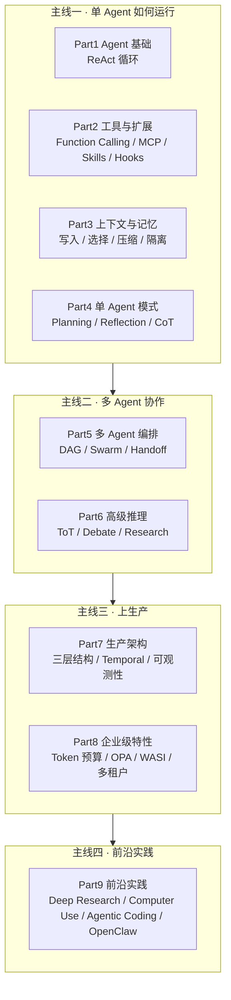

# 《AI Agent 架构》：不绑定框架的 Agent 系统设计书

<!-- truncate -->

市面上的 Agent 教程大多绑死在一个框架上：讲 LangChain 的只讲 LangChain，讲 CrewAI 的只讲 CrewAI。框架会过时，模式不会。Wayland Zhang 的《AI Agent 架构：从单体到企业级多智能体》（英文副标题 *From Concept to Production: Framework-Agnostic AI Agent Architecture Patterns*）走的正是"模式优先、框架其次"这一条路——9 部 33 章，把 Agent 系统拆成 ReAct 循环、工具协议、上下文管理、编排模式、生产架构、企业治理几条能独立演化的主线，再配一个 Go/Rust/Python 三层架构的开源参考实现 Shannon，让人能对着代码验证书里的说法。

这本书不是某一个框架的使用手册，书里的代码示例展示的是设计模式，不是框架 API。你读完一章，能用 LangGraph、CrewAI 或自己的框架实现同样的模式，这一章才算没白读。

下面先给一张总览地图，再按四条主线拆解核心机制，最后给一个任务流案例和不同读者的采用建议。

## 核心数据（GitHub API 2026-08-07 验证）

| 指标 | 数值 | 备注 |
|------|------|------|
| Stars | 325 | 2026-08-07 采集，仍在增长 |
| Forks | 60 | 同上 |
| 作者 | Wayland Zhang | Kocoro-lab 核心贡献者 |
| 章节 | 9 部 33 章 + 3 附录 | 附录含术语表 / 模式选择指南 / FAQ |
| 语言 | 中文 / English / 日本語 | 三语全部完成 |
| 书籍许可 | CC BY-NC-SA 4.0 | 非商用、相同方式共享 |
| 参考实现 | Shannon | 主语言 Go，MIT |

## 总览地图：9 部 33 章实际上在讲四条主线

全书 9 个 Part 对应 Agent 系统的四条主线。记四条线的边界，比背章节顺序更有用：



四条主线之间没有严格的依赖：可以只读主线一和主线二理解 Agent 的运行机制，也可以只读主线三补生产化短板。但主线三要用到主线一、主线二的概念，主线四依赖前三线的全部基础，所以不建议直接跳读 Part 9。

## 主线一：单 Agent 如何感知、行动、记忆

### Agent 的基础是一个循环

第 1 章先回答 Agent 和普通软件的区别在哪——区别在自主决策循环。普通软件的分支由开发者写死，Agent 的下一步行动由 LLM 在运行时根据观察决定。第 2 章把这个循环具体化为 ReAct（Reason-Act）：

```
观察(Observation) → 思考(Reasoning) → 行动(Action) → 重复直到终止条件
```

ReAct 之所以是 Agent 的基础范式，在于它把推理和行动交错执行，避开纯 Chain-of-Thought 在长任务里的漂移。终止条件的设计是工程上的关键点：循环次数上限、Token 预算耗尽、目标状态达成，三者通常要组合着用——只设次数上限会浪费 Token，只设预算可能在任务完成前被强制掐断，只靠"目标达成"又可能因任务根本无法完成而无限循环。

### 工具与扩展：MCP、Skills、Hooks

Agent 要和外部世界交互就得调用工具。第 3 章讲 Function Calling 的基础（工具定义、参数校验），第 4-6 章讲三个递进的扩展层：

- **MCP（Model Context Protocol）**：Anthropic 于 2024 年 11 月推出的工具标准化协议。在 MCP 之前，每个框架（LangChain、CrewAI、AutoGen）各有各的工具格式，工具无法跨框架复用；MCP 提供统一的工具描述格式，让任意 Agent 能调用任意 MCP 兼容工具。第 4 章详解传输层、资源与工具的协议细节。
- **Skills 技能系统**：可复用能力的封装、组合与动态加载，解决工具粒度过细导致的编排困难。
- **Hooks 与事件系统**：生命周期钩子和事件触发，是后面第 7 部分可观测性和第 8 部分权限引擎的基础。

### 上下文与记忆：四个独立策略

LLM 的上下文窗口有限，真实任务却往往需要长程记忆。第 7-9 章把上下文管理拆成四个独立策略：

| 策略 | 解决的问题 |
|------|------------|
| Write（写入） | 决定哪些信息进入上下文 |
| Select（选择） | 从历史中召回哪些片段 |
| Compress（压缩） | 如何在不丢关键信息的前提下缩减上下文 |
| Isolate（隔离） | 不同子任务的上下文如何互不污染 |

这四个策略互不冲突，可以单独优化任何一个，但组合使用时要权衡：Compress 会损失细节，Isolate 会增加总 Token 消耗。第 7 章还覆盖 Prompt Cache 这个工程优化，第 8 章讲短期/长期记忆的存储与检索（含向量存储），第 9 章讲多轮对话的状态管理。

### 单 Agent 的高级思维

单个 Agent 在复杂任务上需要更强的推理能力。第 10-12 章给出三种模式：

- **Planning**：任务分解与计划生成，适合多步骤任务。难点在于计划要能动态调整，否则中间某步失败就全盘崩溃。
- **Reflection**：自我评估与错误修正，让 Agent 产出后检查自己的结果。代价是额外的 LLM 调用开销。
- **Chain-of-Thought**：逐步推理，可解释性最好，是前两种模式的基础。

## 主线二：多 Agent 如何分工与协作

### 三种编排模式

第 13 章先区分"编排"和"协作"：编排是中心化的任务分配，协作是去中心化的交互。第 14-16 章给出三种具体编排模式。

**DAG（Directed Acyclic Graph）工作流**是最基础的，适合依赖关系明确的批处理任务：

```
    [Task A]
       ↓
    [Task B] → [Task D]
       ↓           ↓
    [Task C] → [Task E]
```

DAG 的优点是把依赖关系显式化、独立分支可并行执行；局限是无法处理循环依赖，对动态变化的任务不够灵活。

**Swarm 模式**是更灵活的事件驱动协作：

```
┌─────────────────────────────────────┐
│          Lead Agent                  │
│  (事件循环 + 动态Worker创建)          │
└─────────────────────────────────────┘
       ↓ 事件触发 ↓
   ┌────────┐  ┌────────┐  ┌────────┐
   │Worker A│  │Worker B│  │Worker C│
   └────────┘  └────────┘  └────────┘
       ↓              ↓
   [Workspace共享空间]
```

Lead Agent 在事件循环中按需创建和销毁 Worker，Worker 通过共享 Workspace 协作。这种动态性带来灵活性，也带来竞态条件——多个 Worker 一起写 Workspace 时需要并发控制。Swarm 还支持 **Human-in-the-Loop（HITL）**：通过 `human_input` 事件触发暂停，让人类在关键时刻介入审批，适合需要人工把关的高风险场景。

**Handoff 机制**是 Agent 间的接力模式：

```
Agent A (处理用户输入)
    ↓ Handoff (传递上下文)
Agent B (执行具体任务)
    ↓ Handoff (返回结果)
Agent A (汇总回答)
```

Handoff 的关键工程问题是上下文完整传递和状态保持。它适合"交接"型任务——一个 Agent 接收请求、另一个执行、再交回汇总——但不适合需要并行处理的场景。

### 三种模式怎么选

| 维度 | DAG | Swarm | Handoff |
|------|-----|-------|---------|
| 灵活性 | 低（依赖预定义） | 高（动态创建 Worker） | 中（按交接点定义） |
| 并行性 | 强（独立分支可并行） | 中（受事件循环约束） | 弱（串行交接） |
| 依赖处理 | 显式 | 动态 | 显式 |
| 适用场景 | 批处理、ETL | 协作型、需 HITL | 接力型、客服分流 |
| 工程复杂度 | 低 | 高（并发控制） | 中 |

依赖关系稳定选 DAG，需要人工介入或动态分工选 Swarm，任务天然分阶段选 Handoff。三者并非互斥，实际系统常组合使用。

### 高级推理

第 17-19 章把多 Agent 协作扩展到对抗性场景：

- **Tree-of-Thoughts**：思维树搜索，分支探索多条推理路径并评估，适合答案空间大、需要回溯的问题。
- **Debate 模式**：多 Agent 持对立观点对抗讨论，由裁判 Agent 综合得出结论。例如一个 Agent 主张用 Python、另一个主张用 Rust，通过对抗暴露各自局限，最终由裁判给出场景化建议。
- **Research-Synthesis**：多源研究综合，多个 Agent 各自调研不同来源，再合成报告。

## 主线三：从 Demo 到可上线

### 三层架构

第 20-22 章回答"Demo 跑通了，怎么上生产"。核心是三层架构（参考实现 Shannon）：

```
┌─────────────────────────────────────────────┐
│         Orchestrator (Go)                   │
│  - 编排逻辑、预算控制、策略执行               │
├─────────────────────────────────────────────┤
│         Agent Core (Rust)                    │
│  - 执行引擎、沙箱隔离、限流                   │
├─────────────────────────────────────────────┤
│         LLM Service (Python)                 │
│  - 推理服务、工具调用、向量存储               │
└─────────────────────────────────────────────┘
```

分三层是因为这三类职责的失败模式不同：编排层失败需要快速重启，执行层失败需要隔离爆炸半径，LLM 调用失败需要重试和降级。分层后就能针对每层独立设计容错策略。Go 偏性能和并发，Rust 偏安全和隔离，Python 偏 LLM 生态——这是工程权衡，按团队实际情况调整。

第 21 章讲 Temporal 工作流引擎，解决长时任务的持久化执行和故障恢复。第 22 章讲可观测性：链路追踪、指标监控、日志聚合，这是生产系统排查问题的前提。

### 企业级特性

大规模部署还要补上治理和安全。第 23-26 章覆盖四个维度：

- **Token 预算控制**：成本管理、配额分配、用量监控。LLM 调用按 Token 计费，没有预算控制很容易失控。
- **策略治理**：OPA（Open Policy Agent）策略引擎、权限控制、审计日志，把"谁能做什么"的策略从代码里抽出来，便于合规审计。
- **安全执行**：WASI 沙箱、代码隔离、资源限制。Agent 生成的代码要在沙箱里跑，避免逃逸风险。
- **多租户设计**：租户隔离、资源配额、数据分离。SaaS 场景下不同租户的数据不能互窜。

## 主线四：2025-2026 前沿实践

Part 9（第 27-33 章）覆盖新兴场景的落地形态。这部分时效性较强，建议结合仓库最新版本阅读。

| 章节 | 主题 | 解决的问题 |
|------|------|------------|
| 第 27 章 | Deep Research | 系统化深度调研，多 Agent 协作完成长报告 |
| 第 28 章 | Computer Use | 浏览器/桌面 GUI 自动化，扩展 Agent 的操作边界 |
| 第 29 章 | Agentic Coding | Claude Code/Devin 模式，代码生成 + 自动修复循环 |
| 第 30 章 | Background Agents | 后台异步执行长时任务 |
| 第 31 章 | 分层模型策略 | 按任务复杂度路由到不同模型，优化成本 |
| 第 32 章 | OpenClaw | 本地 Agent Harness，计算机控制（AX Tree + 坐标）、Hooks、权限引擎、循环检测 |
| 第 33 章 | Building on the Harness | 在 Harness 上扩展 Named Agents、Skills、Memory 持久化、Daemon、多源路由、定时任务、MCP 集成、Cloud Delegation |

其中第 32 章讲的 OpenClaw（仓库 openclaw/openclaw，TypeScript）是本地运行的 Agent Harness：本地执行无网络延迟、通过 AX Tree + 坐标精确操作 UI、用 Hooks + 权限引擎 + 循环检测做安全控制。第 33 章讲的 ShanClaw 是 macOS 原生的 Agent Harness，在 OpenClaw 基础上扩展了 Named Agents、Skills、Memory 持久化、Daemon、多源路由、定时任务、MCP 集成、Cloud Delegation 等能力——注意这个参考实现仓库后来改名为 [Kocoro](https://github.com/Kocoro-lab/Kocoro)（Mac 兼容的 AI 伙伴，MCP-native，基于 Shannon 构建）。

## 任务流案例：一个研究请求如何流过系统

把前面的机制串起来看。假设用户请求"对比 2026 年主流向量数据库的吞吐和成本"，在 Shannon 三层架构下会这样流转：

1. **Orchestrator（Go）** 接收请求，创建预算上下文（Token 上限、时间上限），按 Planning 模式把任务分解为"调研产品清单 → 各自测吞吐 → 各自查定价 → 综合对比"。
2. **Swarm 编排** 启动 Lead Agent，据此动态创建三个 Worker——调研、测试、综合——通过 Workspace 共享中间结果。
3. **调研 Worker** 调用 MCP 兼容的搜索工具和浏览器工具（Computer Use 能力），把结果写入短期记忆。
4. **测试 Worker** 在 WASI 沙箱里执行基准脚本，结果受 Token 预算约束，超预算时触发降级策略。
5. **综合 Worker** 汇总多源结果，若发现数据冲突可触发 Debate 模式让两个子 Agent 对抗验证。
6. 任意环节可触发 `human_input` 事件暂停，等人工审批后继续（HITL）。
7. **Agent Core（Rust）** 负责执行隔离和限流，**LLM Service（Python）** 负责推理和工具调用。
8. 全程链路追踪写入可观测性系统，OPA 策略引擎校验每一步的权限合规性。

这个案例里 ReAct 循环、MCP 工具、Swarm 编排、HITL、沙箱执行、预算控制、可观测性、策略治理同时工作。它只是示意——把这些模式串起来看它们怎么组合，不代表 Shannon 一定按这个流程实现。

## 参考实现：Shannon

[Shannon](https://github.com/Kocoro-lab/Shannon) 是配套的开源参考实现，采用前述三层架构：

```
Orchestrator (Go)    - 编排、预算、策略
Agent Core (Rust)    - 执行、沙箱、限流
LLM Service (Python) - 推理、工具、向量
```

仓库描述是"A production-oriented multi-agent orchestration framework."，定位生产向的多 Agent 编排框架：内置 Temporal 工作流做持久化执行和时间旅行调试、硬性的 Token 预算与模型自动降级、实时事件流 + Prometheus 指标 + OpenTelemetry 追踪、WASI 沙箱 + OPA 策略 + 多租户隔离，并且不绑定单一模型提供商（支持 OpenAI、Anthropic、Google、DeepSeek、xAI 以及本地 Ollama）。许可证是 MIT。

Shannon 不是唯一选择——LangGraph、CrewAI、AutoGen 都能实现类似能力。它的价值在于把书里的设计模式完整落地了，可以对照代码验证概念。学模式时看 Shannon，落地时按自己团队的技术栈选框架。

## 采用建议

### 不同读者的阅读路径

**快速入门（2-3 天）**：Part 1 全部 → 第 3 章 → 第 13 章 → 第 20 章，建立 Agent 基础概念，理解工具调用、多 Agent 编排和生产架构的最小可用系统。

**系统学习（2-3 周）**：Part 1-8 顺序阅读，配合 Shannon 代码实践，完整掌握从单 Agent 到企业级多 Agent 的内容，能动手实现一个生产级系统。

**前沿热点（1-2 天）**：第 4 章（MCP）→ 第 15 章 15.8 节（HITL）→ 第 27 章（Deep Research）→ 第 28 章（Computer Use）→ 第 29 章（Agentic Coding），适合已有 Agent 基础的读者。

### 什么时候不该读这本书

- 只想快速调用 ChatGPT API 做个 Demo——直接看官方 SDK 文档更快
- 需要 Prompt Engineering 技巧集锦——这本书讲架构，不讲提示词
- 从未接触过 LLM 基础概念——建议先补 Token、Embedding、上下文窗口等前置知识

### 落地时的取舍

读完书动手时，几个常见取舍点：

- **编排模式选型**：先用 DAG 跑通，遇到动态分工需求再引入 Swarm，不要一上来就上 Swarm——并发控制的复杂度会拖慢迭代。
- **三层架构落地**：小团队可以先用单进程 + 模块化分层，等性能或隔离需求出现再拆进程。Shannon 的三层是参考实现，按团队实际情况调整。
- **MCP 采纳**：MCP 生态还在早期，工具数量有限。如果工具集是内部的、稳定的，自建工具层成本更低；如果需要接入第三方工具，MCP 的标准化收益才显现。
- **HITL 设计**：只在 irreversible action（如发邮件、转账、删除数据）前触发 HITL，分析环节和草稿生成环节不需要人工审批。

### 几点边界

这本书有几个值得提前知道的边界：

- **版本时效**：原文基于 2026 年 4 月可访问的版本（9 部 33 章），后续可能新增或修改章节，以[书籍仓库](https://github.com/Kocoro-lab/ai-agent-book)的最新 commit 为准。
- **Shannon 实现滞后**：Shannon 的功能覆盖和书的章节对应关系可能随开发进展变化，部分书里讲到的模式，Shannon 未必已完整实现，直接看 Shannon 的 README 和最新代码为准。
- **MCP 生态早期**：第 4 章讲的 MCP 协议 2024 年 11 月才推出，工具数量、稳定性、兼容性都在快速变化。
- **代码是示意**：文中涉及的代码片段（ReAct 循环、DAG 编排、三层架构）都用于说明设计模式，实际实现参考 Shannon 源码或自己动手，不能直接拿去跑。

## 资源链接

| 资源 | 链接 |
|------|------|
| 书籍主页 | https://www.waylandz.com/ai-agent-book-en/ |
| 中文版 | https://github.com/Kocoro-lab/ai-agent-book/tree/main/zh |
| English | https://github.com/Kocoro-lab/ai-agent-book/tree/main/en |
| 日本語 | https://github.com/Kocoro-lab/ai-agent-book/tree/main/jp |
| Shannon OSS | https://github.com/Kocoro-lab/Shannon |
| Kocoro（原 ShanClaw） | https://github.com/Kocoro-lab/Kocoro |
| 完整目录 | https://github.com/Kocoro-lab/ai-agent-book/blob/main/zh/TABLE_OF_CONTENTS.md |