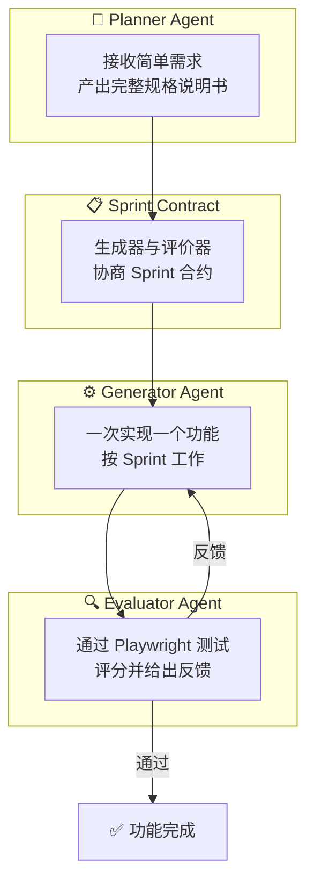
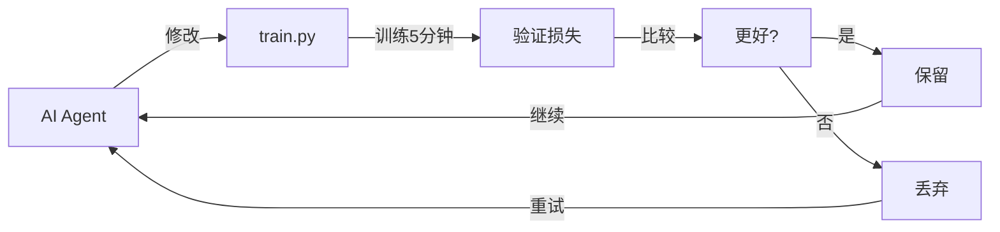

# AI 编程 Agent 的 Harness 设计：让大模型持续输出生产级代码

> **目标读者**：想构建长时运行 AI 编程 Agent 的开发者
> **核心问题**：如何设计 Harness 让 AI Agent 在数小时的编程任务中保持高质量输出？

---

## 🎯 项目概述

本文综合三篇重要资料：

| 来源 | 标题 | 核心贡献 |
|------|------|----------|
| Anthropic | [Effective Harnesses for Long-Running Agents](https://www.anthropic.com/engineering/effective-harnesses-for-long-running-agents) | Generator-Evaluator 架构、Context Reset |
| Anthropic | [Harness Design for Long-Running Application Development](https://www.anthropic.com/engineering/harness-design-long-running-apps) | Planner-Generator-Evaluator 三 Agent 系统 |
| Karpathy | [AutoResearch](https://github.com/karpathy/autoresearch) | 自主 LLM 训练研究范式 |

---

## 🧠 背景：为什么需要 Harness？

### 朴素实现的局限性

大模型 Agent 在单次对话中表现不错，但面临两个核心问题：

**问题一：上下文丢失（Context Loss）**

随着对话历史增长，模型在长任务中逐渐失去连贯性。有些模型还表现出「上下文焦虑」（Context Anxiety）——当感知到上下文快满时，会草率收尾工作。

**问题二：自我评价失准（Self-Evaluation Bias）**

当让 Agent 评价自己产出的代码时，无论质量如何，它都会自信地给出正面评价。这种现象在主观性任务（如前端设计）中尤为明显。

### 解决方案：Harness 设计

Harness 是一种「环绕在模型周围的架构」，通过精心设计的提示词工程和多 Agent 协作来弥补模型能力的不足。

---

## 🏛️ 核心架构：Generator-Evaluator 模式

### GAN 启发的双 Agent 架构

Anthropic 从生成对抗网络（GAN）中汲取灵感，设计了 **Generator-Evaluator** 架构：

```
                    ┌─────────────┐
                    │   迭代循环    │
                    └──────┬──────┘
                           │
         ┌─────────────────┼─────────────────┐
         │                 │                 │
         ▼                 │                 ▼
   ┌───────────┐           │          ┌───────────┐
   │ Generator │◄──────────┤─────────►│ Evaluator │
   │  生成器   │           │          │  评价器   │
   └─────┬─────┘           │          └─────┬─────┘
         │                 │                │
         │     反馈迭代     │                │
         └─────────────────┼────────────────┘
                           │
                    生成 → 评价 → 改进 → ...
```

### 评价器的设计原则

评价器不能简单地说「很好」，而需要：

1. **具体可操作的反馈**：指出问题所在，并给出修改建议
2. **对抗性调试**：像 QA 工程师一样主动寻找 Bug
3. **使用外部工具验证**：通过 Playwright 等工具实际运行代码验证功能

```python
# 评价器伪代码示例
class Evaluator:
    def evaluate(self, generated_code):
        # 1. 使用 Playwright 打开页面
        browser.navigate(generated_code.url)
        
        # 2. 模拟用户操作
        browser.click("#login-button")
        browser.fill("#username", "test")
        
        # 3. 检查结果
        if not browser.exists("#success-message"):
            return EvaluationResult(
                passed=False,
                issues=["登录功能失效：点击登录后没有出现成功提示"]
            )
        
        return EvaluationResult(passed=True)
```

---

## 📐 Anthropic 三 Agent 系统：Planner-Generator-Evaluator

### 系统架构



### 各 Agent 职责

**1. Planner Agent**

Planner 的职责是根据用户的简单描述（如「做一个 2D 游戏制作工具」）生成完整的产品规格说明书。

```markdown
## Planner Prompt

你是一个产品经理。请将用户的简单需求扩展为完整规格说明书。

要求：
- 保持雄心勃勃的范围
- 专注于产品上下文和高层技术设计
- 不要试图预先指定详细的技术实现
- 主动寻找可以将 AI 功能融入产品的机会

输出格式：
1. 产品概述
2. 用户故事列表
3. 功能清单（按优先级排序）
4. 技术架构建议
```

**2. Generator Agent**

Generator 一次只实现一个功能（按 Sprint 工作），完成后自检并交给 QA。

```markdown
## Generator Prompt

你是一个全栈工程师。你需要：
- 按 Sprint 工作，一次实现一个功能
- 实现完成后，运行自我评估
- 将工作交给 QA 前，确保基本功能正常
- 使用 React + Vite + FastAPI + SQLite 技术栈
```

**3. Evaluator Agent**

Evaluator 使用 Playwright MCP 与实际运行的应用交互，测试 UI 功能、API 端点和数据库状态。

```python
# Evaluator 的评分标准（前端设计示例）
EVALUATION_CRITERIA = {
    "design_quality": "设计是否感觉像是一个有凝聚力的整体？",
    "originality": "是否有定制决策的证据，还是模板化布局？",
    "craft": "技术执行：排版层次、间距一致性、色彩和谐度",
    "functionality": "可用性：用户能否理解界面功能、找到主要操作？"
}
```

### Sprint Contract 机制

在每个 Sprint 开始前，Generator 和 Evaluator 协商「合约」：

```markdown
## Sprint 3 合约

**功能**：矩形填充工具

**验收标准**：
- [ ] 点击拖拽可以在选中区域填充矩形
- [ ] 释放鼠标后填充生效
- [ ] 填充工具图标正确高亮
- [ ] 撤销功能可以回退填充操作

**测试方法**：
1. 选择矩形填充工具
2. 在画布上点击并拖拽
3. 观察是否在拖拽起点和终点之间填充矩形
```

---

## ⚖️ Context Reset vs Compaction

### Compaction（压缩）的问题

传统做法是在上下文快满时，对历史对话进行摘要压缩。这保留了连续性，但无法给 Agent 一个干净的起点。

### Context Reset（上下文重置）

Context Reset 是完全清空上下文窗口，开启一个新的 Agent 会话，配合结构化的交接文档传递状态。

| 特性 | Compaction | Context Reset |
|------|-------------|---------------|
| 连续性 | ✅ 保持 | ❌ 需要重建 |
| 清洁度 | ❌ 历史残留 | ✅ 全新开始 |
| 实现复杂度 | 低 | 高 |
| 适用场景 | 短任务 | 长时任务 |

**关键发现**：Claude Sonnet 4.5 表现出强烈的上下文焦虑，仅靠压缩无法支持长任务性能，因此 Context Reset 成为必要设计。

---

## 🔬 Karpathy 的 AutoResearch：自主 LLM 训练

### 核心思想

Karpathy 的 AutoResearch 展示了另一种 Harness 范式：**让 AI Agent 自主研究 LLM 训练**。



### 关键设计

**1. 固定时间预算**

训练始终运行 **5 分钟**（无论硬件配置如何），这使得所有实验直接可比。

**2. 单一修改文件**

Agent 只修改 `train.py` 一个文件，保持范围可控和差异可审查。

**3. 单一评估指标**

使用 **val_bpb**（验证集每字节比特数）——越低越好，与词表大小无关。

### 三文件架构

```
autoresearch/
├── prepare.py      # 固定常量、数据准备、运行时工具（不修改）
├── train.py        # 模型、优化器、训练循环（Agent 修改此文件）
└── program.md      # Agent 指令（Human 修改此文件）
```

---

## 📊 实验结果对比

### Anthropic V1 Harness vs Solo Agent

| 指标 | Solo Agent | Full Harness |
|------|-------------|---------------|
| 时长 | 20 分钟 | 6 小时 |
| 成本 | $9 | $200 |
| 质量 | 功能基本可用但有 Bug | 功能完整、可运行 |

**结论**：Harness 成本高出 20 倍，但输出质量差异立竿见影。

### Anthropic V2 Harness（优化后）

| 阶段 | 时长 | 成本 |
|------|------|------|
| Planner | 4.7 分钟 | $0.46 |
| Build (Round 1) | 2h 7min | $71.08 |
| QA (Round 1) | 8.8 分钟 | $3.24 |
| Build (Round 2) | 1h 2min | $36.89 |
| QA (Round 2) | 6.8 分钟 | $3.09 |
| **总计** | **3h 50min** | **$124.70** |

---

## 🚀 实践指南

### 如何构建自己的 Harness

**步骤 1：识别瓶颈**

先在裸模型上测试，确定是哪些问题限制了性能：
- 是上下文长度问题？
- 是自我评价失准？
- 是任务分解不够？

**步骤 2：选择架构**

| 场景 | 推荐架构 |
|------|----------|
| 前端设计等主观任务 | Generator + Evaluator |
| 长时编程任务 | Planner + Generator + Evaluator |
| 科学研究 | Agent 修改 + 固定评估指标 |

**步骤 3：实现评价器**

```python
class CodeEvaluator:
    def __init__(self, playwright_mcp):
        self.playwright = playwright_mcp
    
    async def evaluate(self, artifact):
        # 1. 启动应用
        await self.playwright.goto(artifact.url)
        
        # 2. 执行测试用例
        test_cases = load_test_cases(artifact.spec)
        results = []
        
        for case in test_cases:
            try:
                await self.execute_test(case)
                results.append(PASS)
            except AssertionError as e:
                results.append(FAIL(e))
        
        # 3. 生成报告
        return EvaluationReport(
            passed=len([r for r in results if r == PASS]),
            failed=len([r for r in results if r == FAIL]),
            details=results
        )
```

**步骤 4：迭代优化**

模型能力在不断提升，需要定期审视 Harness：
- 移除不再必要的组件
- 添加新组件以突破新的能力边界

---

## 💡 核心洞察

1. **Harness 是必要的**：基础模型能力有上限，Harness 设计能显著提升输出质量
2. **分离评价者是关键**：让 Generator 评价自己的作品会导致过度乐观，分离后评价更可靠
3. **Context Reset 不是银弹**：它解决了上下文焦虑，但带来了编排复杂性和延迟开销
4. **模型在进步，Harness 也需演进**：随着模型能力提升，今天的「最佳实践」可能明天就过时
5. **AutoResearch 启示**：Harness 思想可以泛化到模型训练以外的领域

---

## 📚 资源链接

- [Anthropic: Effective Harnesses for Long-Running Agents](https://www.anthropic.com/engineering/effective-harnesses-for-long-running-agents)
- [Anthropic: Harness Design for Long-Running Application Development](https://www.anthropic.com/engineering/harness-design-long-running-apps)
- [Karpathy/AutoResearch GitHub](https://github.com/karpathy/autoresearch)
- [Claude Agent SDK](https://platform.claude.com/docs/en/agent-sdk/overview)
- [Playwright MCP](https://playwright.dev/)

---

## 🎓 总结

Harness 设计是 AI 工程中的核心艺术。通过 Generator-Evaluator 模式，我们可以让 AI 的输出质量远超其默认能力。关键在于：

- **分离职责**：不要让生成者同时做评价
- **具体反馈**：评价器必须给出可操作的改进建议
- **持续迭代**：Harness 需要随模型进步而演进

随着 AI 模型能力的不断提升，最有趣的 Harness 组合空间不会缩小，只会移动。作为 AI 工程师，持续找到下一个新颖的组合方式就是我们的工作。
