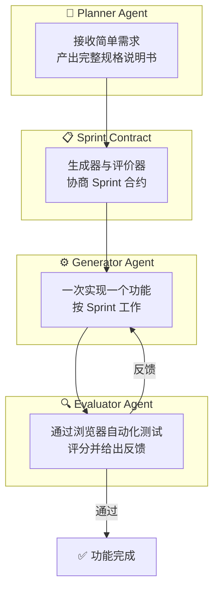
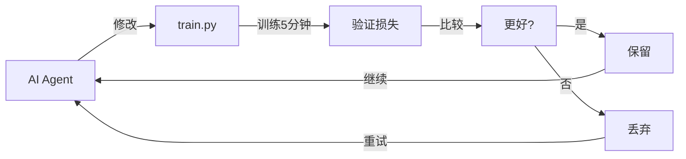

# AI 编程 Agent 的 Harness 设计：如何让大模型更稳定地产出高质量代码

> 预计阅读时间：40分钟 | 难度：⭐⭐⭐⭐

单靠把模型放进一个循环里，并不能稳定产出高质量应用。真正决定上限的，往往不是模型会不会写代码，而是系统能不能持续完成三件事：把任务拆对、把进度交清、把结果验真。

这也是 Anthropic 这两篇文章最值得看的地方。它们讨论的不是“怎样写一个更复杂的 Agent”，而是“当模型在长任务中会失忆、会自我美化、会在半成品前宣布胜利时，系统应该怎样补位”。

---

## 🎯 先讲结论

如果只保留三条最重要的结论，我会总结为：

1. 长时运行 Agent 的关键不只是生成能力，而是任务切分、状态交接与外部验证。
2. Harness 不是固定配方，而是针对当前模型短板的阶段性工程设计。
3. 模型越强，越要重新检查哪些脚手架还在创造价值，哪些已经只是成本。

## 📚 本文范围

本文综合三篇重要资料：

| 来源 | 标题 | 核心贡献 |
|------|------|----------|
| Anthropic | [Effective Harnesses for Long-Running Agents](https://www.anthropic.com/engineering/effective-harnesses-for-long-running-agents) | Initializer/Coding Agent、Feature List、Progress File、`init.sh` 与 Git 交接 |
| Anthropic | [Harness Design for Long-Running Application Development](https://www.anthropic.com/engineering/harness-design-long-running-apps) | Generator-Evaluator、Planner-Generator-Evaluator、多轮 QA 与 Harness 简化演进 |
| Karpathy | [AutoResearch](https://github.com/karpathy/autoresearch) | 自主 LLM 训练研究范式 |

---

## 🧠 背景：为什么需要 Harness？

### 朴素实现的局限性

大模型 Agent 在单次对话中表现不错，但面临两个核心问题：

#### 问题一：上下文丢失（Context Loss）

随着对话历史增长，模型在长任务中逐渐失去连贯性。有些模型还表现出「上下文焦虑」（Context Anxiety）——当感知到上下文快满时，会草率收尾工作。

#### 问题二：自我评价失准（Self-Evaluation Bias）

当让 Agent 评价自己产出的代码时，无论质量如何，它都会自信地给出正面评价。这种现象在主观性任务（如前端设计）中尤为明显。

### Harness 在解决什么

Harness 是一种「环绕在模型周围的架构」，通过提示词设计、工具接入与多 Agent 协作来弥补模型能力的不足。

---

## 🏛️ 核心架构：Generator-Evaluator 模式

### GAN 启发的双 Agent 架构

Anthropic 从生成对抗网络（GAN）中汲取灵感，设计了 **Generator-Evaluator** 架构：

```
                    ┌─────────────┐
                    │   迭代循环    │
                    └──────┬──────┘
                           │
         ┌─────────────────┼─────────────────┐
         │                 │                 │
         ▼                 │                 ▼
   ┌───────────┐           │          ┌───────────┐
   │ Generator │◄──────────┤─────────►│ Evaluator │
   │  生成器   │           │          │  评价器   │
   └─────┬─────┘           │          └─────┬─────┘
         │                 │                │
         │     反馈迭代     │                │
         └─────────────────┼────────────────┘
                           │
                    生成 → 评价 → 改进 → ...
```

### 评价器的设计原则

评价器不能简单地说「很好」，而需要：

1. **具体可操作的反馈**：指出问题所在，并给出修改建议
2. **对抗性调试**：像 QA 工程师一样主动寻找 Bug
3. **使用外部工具验证**：通过 Playwright、Puppeteer 这类浏览器自动化工具实际运行代码验证功能

下面的伪代码是根据 Anthropic 文中的评价思路整理的**示意实现**，不是原文代码：

```python
# 评价器伪代码示例
class Evaluator:
    def evaluate(self, generated_code):
        # 1. 使用 Playwright 打开页面
        browser.navigate(generated_code.url)
        
        # 2. 模拟用户操作
        browser.click("#login-button")
        browser.fill("#username", "test")
        
        # 3. 检查结果
        if not browser.exists("#success-message"):
            return EvaluationResult(
                passed=False,
                issues=["登录功能失效：点击登录后没有出现成功提示"]
            )
        
        return EvaluationResult(passed=True)
```

---

## 📐 Anthropic 三 Agent 系统：Planner-Generator-Evaluator

### 系统架构



### 各 Agent 职责

#### 1. Planner Agent

Planner 的职责是根据用户的简单描述（如「做一个 2D 游戏制作工具」）生成完整的产品规格说明书。

下面的 Prompt 是根据原文对 Planner 职责的描述整理的**示意版本**，不是原文逐字提示词：

```markdown
## Planner Prompt

你是一个产品经理。请将用户的简单需求扩展为完整规格说明书。

要求：
- 保持雄心勃勃的范围
- 专注于产品上下文和高层技术设计
- 不要试图预先指定详细的技术实现
- 主动寻找可以将 AI 功能融入产品的机会

输出格式：
1. 产品概述
2. 用户故事列表
3. 功能清单（按优先级排序）
4. 技术架构建议
```

#### 2. Generator Agent

Generator 一次只实现一个功能（按 Sprint 工作），完成后自检并交给 QA。

下面的 Prompt 同样是**示意版本**，用于帮助理解 Generator 的工作边界：

```markdown
## Generator Prompt

你是一个全栈工程师。你需要：
- 按 Sprint 工作，一次实现一个功能
- 实现完成后，运行自我评估
- 将工作交给 QA 前，确保基本功能正常
- 使用 React + Vite + FastAPI + SQLite 技术栈
```

#### 3. Evaluator Agent

Evaluator 使用浏览器自动化工具与实际运行的应用交互，测试 UI 功能、API 端点和数据库状态。

下面的评分维度是根据 Anthropic 前端设计实验中披露的标准整理的**示意表达**：

```python
# Evaluator 的评分标准（前端设计示例）
EVALUATION_CRITERIA = {
    "design_quality": "设计是否感觉像是一个有凝聚力的整体？",
    "originality": "是否有定制决策的证据，还是模板化布局？",
    "craft": "技术执行：排版层次、间距一致性、色彩和谐度",
    "functionality": "可用性：用户能否理解界面功能、找到主要操作？"
}
```

### Sprint Contract 机制

在每个 Sprint 开始前，Generator 和 Evaluator 协商「合约」：

```markdown
## Sprint 3 合约

**功能**：矩形填充工具

**验收标准**：
- [ ] 点击拖拽可以在选中区域填充矩形
- [ ] 释放鼠标后填充生效
- [ ] 填充工具图标正确高亮
- [ ] 撤销功能可以回退填充操作

**测试方法**：
1. 选择矩形填充工具
2. 在画布上点击并拖拽
3. 观察是否在拖拽起点和终点之间填充矩形
```

### Anthropic Harness 演进时间线

如果把两篇 Anthropic 文章连起来看，更准确的理解方式不是“他们发明了一套固定三 Agent 架构”，而是“他们围绕模型短板，分阶段搭建过不同版本的 Harness”。

- V1：跨上下文稳定推进
    代表文章：Effective Harnesses for Long-Running Agents
    使用模型：Claude Sonnet 4.5
    主要目标：解决多上下文窗口下的失忆、抢跑和半成品问题
    关键组件：Initializer Agent、Coding Agent、Feature List、Progress File、`init.sh`、Git 交接、Context Reset
    测试工具：Puppeteer MCP
    设计原因：Sonnet 4.5 存在明显的上下文焦虑，需要靠结构化工件、Context Reset 和干净交接维持连续开发
    备注：该文未提供成本/时长对比数据

- V2：引入 Generator-Evaluator 与 Sprint 结构
    代表文章：Harness Design for Long-Running Application Development
    使用模型：Claude Opus 4.5
    主要目标：引入独立 QA 解决自我评价失准，通过 Sprint 分解工作
    关键组件：Planner、Generator、Evaluator、Sprint Contract、自动 Compaction
    测试工具：Playwright MCP
    设计原因：Opus 4.5 本身已不再有上下文焦虑，可以去掉 Context Reset，改用连续会话配合自动 Compaction；但"规划"和"外部评价"仍然有明显价值

- V3：在更强模型上简化 Harness
    代表文章：同上（Harness Design for Long-Running Application Development）
    使用模型：Claude Opus 4.6
    主要目标：在保持质量的前提下减少编排成本
    关键变化：去掉 Sprint 结构，Evaluator 改为整体一次性评估而非逐 Sprint 检查
    设计原因：Opus 4.6 具备更好的长任务规划和自我纠错能力，Sprint 分解不再是必要脚手架

这条演进线很重要，因为它对应的是一种更普遍的方法论：**Harness 不是越复杂越好，而是应该针对当前模型最真实的短板来设计。** 当模型本身已经能稳定完成某一步时，继续保留那一层脚手架就可能只是在增加时延、成本和系统复杂度。

---

## ⚖️ Context Reset vs Compaction

### Compaction（压缩）的局限

传统做法是在上下文快满时，对历史对话进行摘要压缩。这保留了连续性，但无法给 Agent 一个干净的起点。

### Context Reset（上下文重置）

Context Reset 是完全清空上下文窗口，开启一个新的 Agent 会话，配合结构化的交接文档传递状态。

| 特性 | Compaction | Context Reset |
|------|-------------|---------------|
| 连续性 | ✅ 保持 | ❌ 需要重建 |
| 清洁度 | ❌ 历史残留 | ✅ 全新开始 |
| 实现复杂度 | 低 | 高 |
| 更适合的情形 | 模型本身长上下文稳定、交接成本高 | 模型存在明显上下文焦虑、交接文档可结构化 |

**关键发现**：在 Anthropic 第一篇文章的实验里，Claude Sonnet 4.5 表现出明显的上下文焦虑，仅靠压缩难以稳定支撑长任务，因此 Context Reset 在那个阶段成为关键设计。

但这不是一个永久结论。当第二篇文章切换到 Opus 4.5 时，上下文焦虑问题已经大幅缓解，Anthropic 直接去掉了 Context Reset，改用单次连续会话配合 Claude Agent SDK 的自动 Compaction。也就是说，**是否需要 Reset，取决于模型特性、任务长度和交接成本，而不是固定教条**。

---

## 🔬 Karpathy 的 AutoResearch：自主 LLM 训练

### 核心思想

Karpathy 的 AutoResearch 展示了另一种 Harness 范式：**让 AI Agent 自主研究 LLM 训练**。



### 关键设计

#### 1. 固定时间预算

训练始终运行 **5 分钟**（wall clock，不含启动与编译开销）。这使得同一平台上的实验更容易直接比较，但不同硬件之间的结果并不天然可比。

#### 2. 单一修改文件

Agent 只修改 `train.py` 一个文件，保持范围可控和差异可审查。

#### 3. 单一评估指标

使用 **val_bpb**（验证集每字节比特数）——越低越好，与词表大小无关。

### 三文件架构

```
autoresearch/
├── prepare.py      # 固定常量、数据准备、运行时工具（不修改）
├── train.py        # 模型、优化器、训练循环（Agent 修改此文件）
└── program.md      # Agent 指令（Human 修改此文件）
```

---

## 📊 实验结果对比

以下数字来自 Anthropic 文中的展示性实验，更适合用来理解 Harness 的量级与收益方向，而不是把它们视为严格可复现的统一 Benchmark。

### Opus 4.5 + 三 Agent + Sprint（V2）：Solo vs Full Harness

这一组数字来自第二篇文章，使用 **Opus 4.5**，对应 Planner-Generator-Evaluator + Sprint Contract 的完整三 Agent 架构。测试 Prompt 是「Create a 2D retro game maker」。

| 指标 | Solo Agent | Full Harness |
|------|-------------|---------------|
| 时长 | 20 分钟 | 6 小时 |
| 成本 | $9 | $200 |
| 质量 | 初看可用，但核心玩法存在明显缺陷 | 功能更完整，核心链路可运行 |

**结论**：Harness 成本高出 20 倍以上，但输出质量差异立竿见影。

### Opus 4.6 + 简化 Harness（V3）：去掉 Sprint 结构

这一组数字同样来自第二篇文章，使用 **Opus 4.6**。关键变化是去掉了 Sprint 结构——Generator 不再按 Sprint 逐个实现功能，而是连续构建；Evaluator 改为在构建完成后整体评估。测试 Prompt 是「Build a fully featured DAW in the browser using the Web Audio API」。

| 阶段 | 时长 | 成本 |
|------|------|------|
| Planner | 4.7 分钟 | $0.46 |
| Build (Round 1) | 2h 7min | $71.08 |
| QA (Round 1) | 8.8 分钟 | $3.24 |
| Build (Round 2) | 1h 2min | $36.89 |
| QA (Round 2) | 6.8 分钟 | $3.09 |
| Build (Round 3) | 10.9 分钟 | $5.88 |
| QA (Round 3) | 9.6 分钟 | $4.06 |
| **总计** | **3h 50min** | **$124.70** |

---

## 🚀 实践指南

### 步骤 1：识别瓶颈

先在裸模型上测试，确定是哪些问题限制了性能：

- 是上下文长度问题？
- 是自我评价失准？
- 是任务分解不够？

### 步骤 2：选择架构

| 场景 | 推荐架构 |
|------|----------|
| 前端设计等主观任务 | Generator + Evaluator |
| 长时编程任务 | Planner + Generator + Evaluator |
| 科学研究 | Agent 修改 + 固定评估指标 |

### 最小可复用蓝图

如果你想自己从零搭一个最小版本，不必一开始就照搬 Anthropic 的完整系统。更实用的做法是先把下面四类工件固定下来。

#### 1. 产品规格说明（Spec）

作用：把一句话需求扩展成可执行范围，但避免预先锁死过细实现。

```markdown
# Product Spec

## Overview
- 目标用户：独立开发者
- 核心任务：让用户用自然语言生成并编辑站点内容

## User Stories
- 作为用户，我希望创建新项目并保存草稿
- 作为用户，我希望 Agent 能解释每次修改的原因

## Prioritized Features
1. 项目创建与保存
2. 内容编辑器
3. Agent 辅助修改
4. 历史版本与回滚

## Constraints
- 优先保证核心链路跑通
- 不提前规定组件级实现细节
```

#### 2. 功能清单或 Sprint Contract

作用：把“要做什么”转成“怎样算完成”，避免 Generator 提前宣布胜利。

```json
{
    "feature": "草稿保存",
    "acceptance_criteria": [
        "用户点击保存后草稿持久化",
        "刷新页面后仍能恢复最近一次草稿",
        "保存失败时展示明确错误提示"
    ],
    "test_plan": [
        "输入内容并点击保存",
        "刷新页面后验证内容恢复",
        "断开后端后再次保存并检查报错"
    ]
}
```

#### 3. Progress File / Handoff Note

作用：让新一轮 Agent 在最短时间内知道“刚做了什么、现在卡在哪、下一步该干什么”。

```markdown
# Progress Update

## Completed
- 已完成草稿保存 API
- 前端已接入保存按钮与成功提示

## Verified
- 手工验证保存与刷新恢复成功

## Known Issues
- 保存失败提示样式不明显
- 断网重试逻辑未处理

## Next Step
- 补保存失败状态
- 增加自动保存
```

#### 4. Evaluator Report

作用：让反馈变成可执行清单，而不是泛泛地说“还不错”。

```markdown
# QA Report

## Verdict
- FAIL

## Findings
1. 点击保存后按钮进入 loading，但后端 500 时没有错误提示
2. 刷新恢复只覆盖正文，没有恢复标题

## Evidence
- 访问 /api/drafts 返回 500 时，页面无 toast
- local state 仅恢复 content 字段

## Required Fix
- 增加错误提示与失败态
- 恢复标题字段并补回归验证
```

这四类工件里，真正不能省的是后两项：**交接文档**决定你能不能跨会话稳定推进，**Evaluator 报告**决定你能不能把“模型觉得做完了”改成“系统证明做完了”。

### 步骤 3：实现评价器

下面的代码是概念示意，重点在“外部验证 + 结构化报告”这个模式：

```python
class CodeEvaluator:
    def __init__(self, playwright_mcp):
        self.playwright = playwright_mcp
    
    async def evaluate(self, artifact):
        # 1. 启动应用
        await self.playwright.goto(artifact.url)
        
        # 2. 执行测试用例
        test_cases = load_test_cases(artifact.spec)
        results = []
        
        for case in test_cases:
            try:
                await self.execute_test(case)
                results.append(PASS)
            except AssertionError as e:
                results.append(FAIL(e))
        
        # 3. 生成报告
        return EvaluationReport(
            passed=len([r for r in results if r == PASS]),
            failed=len([r for r in results if r == FAIL]),
            details=results
        )
```

### 步骤 4：迭代优化

模型能力在不断提升，需要定期审视 Harness：

- 移除不再必要的组件
- 添加新组件以突破新的能力边界

---

## 💡 核心洞察

1. **Harness 往往是高价值杠杆**：当任务超过模型裸跑的稳定边界时，Harness 设计能显著提升输出质量
2. **分离评价者是关键**：让 Generator 评价自己的作品会导致过度乐观，分离后评价更可靠
3. **Context Reset 不是银弹**：它解决了上下文焦虑，但带来了编排复杂性和延迟开销
4. **模型在进步，Harness 也需演进**：随着模型能力提升，今天的「最佳实践」可能明天就过时
5. **AutoResearch 启示**：Harness 思想可以泛化到模型训练以外的领域

---

## 📚 资源链接

- [Anthropic: Effective Harnesses for Long-Running Agents](https://www.anthropic.com/engineering/effective-harnesses-for-long-running-agents)
- [Anthropic: Harness Design for Long-Running Application Development](https://www.anthropic.com/engineering/harness-design-long-running-apps)
- [Karpathy/AutoResearch GitHub](https://github.com/karpathy/autoresearch)
- [Claude Agent SDK](https://platform.claude.com/docs/en/agent-sdk/overview)
- [Playwright MCP](https://github.com/microsoft/playwright-mcp)

---

## 🎓 总结

Anthropic 这组实践最有价值的地方，不是证明了某一套固定 Harness “已经胜出”，而是展示了一种更可靠的工程思路：先观察模型在真实任务里的失败模式，再用最小必要的结构去补它的短板。

早期模型容易在长任务里失焦，就强化交接、进度文件和 Context Reset；后续模型本体更强，就删掉一部分重脚手架，把系统重心转向规划质量与独立 QA。真正可迁移的经验不是某个 prompt 片段，而是这种持续重估系统负载点的方式。

如果把全文再压缩成一句话，那就是：**Harness 的本质不是把模型包得更厚，而是让系统在该约束的地方约束、在该验证的地方验证、在该简化的时候果断简化。**

关键抓手仍然是：

- **分离职责**：不要让生成者同时做评价
- **具体反馈**：评价器必须给出可操作的改进建议
- **持续迭代**：Harness 需要随模型进步而演进

随着 AI 模型能力的不断提升，最有趣的 Harness 组合空间不会缩小，只会移动。未来真正拉开差距的，不会只是“谁能调用更多工具”，而是谁能更快识别模型的新边界，并把它们转化成新的系统设计。
