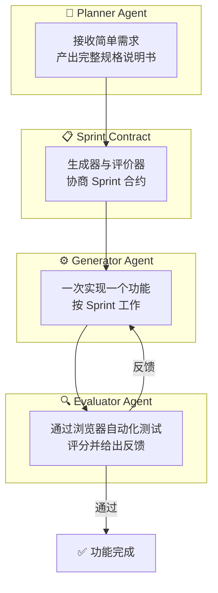
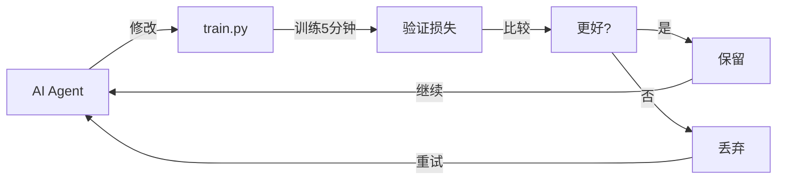

# AI 编程 Agent 的 Harness 设计：如何让大模型更稳定地产出高质量代码

> 预计阅读时间：25 分钟 | 难度：⭐⭐⭐⭐

单靠把模型放进一个循环里，并不能稳定产出高质量应用。决定上限的往往不是模型会不会写代码，而是系统能不能持续完成三件事：把任务拆对、把进度交清、把结果验真。

这也是 Anthropic 这两篇文章最值得看的地方。它们讨论的是：当模型在长任务中会失忆、会自我美化、会在半成品前宣布胜利时，系统应该怎样补位。

---

## 先讲结论

如果只保留三条最重要的结论，我会总结为：

1. 长时运行 Agent 的关键不只是生成能力，而是任务切分、状态交接与外部验证。
2. Harness 是针对当前模型短板的阶段性工程设计，不是固定配方。
3. 模型越强，越要重新检查哪些脚手架还在创造价值，哪些已经只是成本。

## 本文范围

本文综合三篇重要资料：

| 来源 | 标题 | 核心贡献 |
|------|------|----------|
| Anthropic（2025-11-26） | [Effective Harnesses for Long-Running Agents](https://www.anthropic.com/engineering/effective-harnesses-for-long-running-agents) | Initializer/Coding Agent、Feature List、Progress File、`init.sh` 与 Git 交接 |
| Anthropic（2026-03-24） | [Harness Design for Long-Running Application Development](https://www.anthropic.com/engineering/harness-design-long-running-apps) | Generator-Evaluator、Planner-Generator-Evaluator、多轮 QA 与 Harness 简化演进 |
| Karpathy（2026-03） | [AutoResearch](https://github.com/karpathy/autoresearch) | 自主 LLM 训练研究范式 |

---

## 背景：为什么需要 Harness？

### 朴素实现的局限性

大模型 Agent 在单次对话中表现不错，但面临两个核心问题：

#### 问题一：上下文丢失（Context Loss）

随着对话历史增长，模型在长任务中逐渐失去连贯性。有些模型还表现出「上下文焦虑」（Context Anxiety）——当感知到上下文快满时，会草率收尾工作。

#### 问题二：自我评价失准（Self-Evaluation Bias）

当让 Agent 评价自己产出的代码时，无论质量如何，它都会自信地给出正面评价。这种现象在主观性任务（如前端设计）中尤为明显。

### Harness 在解决什么

Harness 是一种「环绕在模型周围的架构」，通过提示词设计、工具接入与多 Agent 协作来弥补模型能力的不足。

---

## 核心架构：Generator-Evaluator 模式

### GAN 启发的双 Agent 架构

Anthropic 从生成对抗网络（GAN）中汲取灵感，设计了 **Generator-Evaluator** 架构：

```
                    ┌─────────────┐
                    │   迭代循环    │
                    └──────┬──────┘
                           │
         ┌─────────────────┼─────────────────┐
         │                 │                 │
         ▼                 │                 ▼
   ┌───────────┐           │          ┌───────────┐
   │ Generator │◄──────────┤─────────►│ Evaluator │
   │  生成器   │           │          │  评价器   │
   └─────┬─────┘           │          └─────┬─────┘
         │                 │                │
         │     反馈迭代     │                │
         └─────────────────┼────────────────┘
                           │
                    生成 → 评价 → 改进 → ...
```

### 评价器的设计原则

评价器不能只说「很好」，需要：

1. **具体可操作的反馈**：指出问题所在，并给出修改建议
2. **对抗性调试**：像 QA 工程师一样主动探测边界情况、寻找 Bug
3. **使用外部工具验证**：通过 Playwright 这类浏览器自动化工具实际运行代码验证功能

Anthropic 还分享了一条来之不易的调优经验：开箱即用的 Claude 并不是好的 QA。早期迭代里，他们会看到评价器先发现一个真问题，再自己说服自己「这不严重」，然后放行；测试也偏表面，不爱碰边界情况，微妙 Bug 因此漏网。Anthropic 的办法是反复读评价器的日志，找出它的判断与人类预期分歧的位置，针对性修改 QA 提示词，几轮之后评价器的标准才稳定下来。更根本的难点在于，评价器自己也是 LLM，天生对 LLM 产出宽容——把一个独立的评价器调得足够挑剔，远比让生成器学会批评自己的作品可行。

下面的伪代码是根据 Anthropic 文中的评价思路整理的**示意实现**，不是原文代码：

```python
# 评价器伪代码示例
class Evaluator:
    def evaluate(self, generated_code):
        # 1. 使用 Playwright 打开页面
        browser.navigate(generated_code.url)

        # 2. 模拟用户操作
        browser.click("#login-button")
        browser.fill("#username", "test")

        # 3. 检查结果
        if not browser.exists("#success-message"):
            return EvaluationResult(
                passed=False,
                issues=["登录功能失效：点击登录后没有出现成功提示"]
            )

        return EvaluationResult(passed=True)
```

### 前端设计实验：先把评价标准磨出来

这套循环最早在纯主观的前端设计任务上验证。Anthropic 写了四条评分标准，同时交给生成器和评价器，把「这个设计好不好」转成可以逐项打分的具体问题。每一轮生成跑 5 到 15 次迭代，评价器用 Playwright 直接操作真实页面、截图研究之后再打分，所以整个流程很慢——完整跑一轮最长要四个小时。

有两个实验发现值得留意。其一，评价器用带详细分数拆解的 few-shot 示例校准，用来对齐作者偏好、减少多轮之间的分数漂移。其二，标准的措辞本身会塑造输出风格：像「最好的设计是博物馆级的」这类短语，会把设计推向某种特定的视觉趋同。

一个被作者反复提及的例子：让模型给一家荷兰艺术博物馆做官网，前九次迭代都是一个干净、暗色的常规落地页；第十轮它整个推翻重来，把网站改成空间体验——用 CSS perspective 渲染的 3D 展厅、棋盘格地板、自由悬挂的画作、靠门洞穿行的导航。这种单轮生成里罕见的美学跳跃，正是独立评价回路喂出来的。

---

## Anthropic 三 Agent 系统：Planner-Generator-Evaluator

### 系统架构


```mermaid
graph TB
    subgraph Planner["🤖 Planner Agent"]
        P[接收简单需求<br/>产出完整规格说明书]
    end

    subgraph Contract["📋 Sprint Contract"]
        C[生成器与评价器<br/>协商 Sprint 合约]
    end

    subgraph Generator["⚙️ Generator Agent"]
        G[一次实现一个功能<br/>按 Sprint 工作]
    end

    subgraph Evaluator["🔍 Evaluator Agent"]
        E[通过浏览器自动化测试<br/>评分并给出反馈]
    end

    P --> C
    C --> G
    G --> E
    E -->|反馈| G
    E -->|通过| Done[✅ 功能完成]
```

### 各 Agent 职责

#### 1. Planner Agent

Planner 的职责是根据用户的简单描述（如「做一个 2D 游戏制作工具」）生成完整的产品规格说明书。

下面的 Prompt 是根据原文对 Planner 职责的描述整理的**示意版本**，不是原文逐字提示词：

```markdown
## Planner Prompt

你是一个产品经理。请将用户的简单需求扩展为完整规格说明书。

要求：
- 保持雄心勃勃的范围
- 专注于产品上下文和高层技术设计
- 不要试图预先指定详细的技术实现
- 主动寻找可以将 AI 功能融入产品的机会

输出格式：
1. 产品概述
2. 用户故事列表
3. 功能清单（按优先级排序）
4. 技术架构建议
```

为什么要限制 Planner 做高层设计？Anthropic 的考虑是：如果 Planner 预先规定了细粒度的技术细节又写错了，错误会顺着规格级联到下游实现。更好的做法是约束「交付什么」，让 Agent 们在做的过程中自己找路径。

#### 2. Generator Agent

Generator 一次只实现一个功能（按 Sprint 工作），每个 Sprint 结束时先自评，再交给 QA。技术栈是 React + Vite + FastAPI + SQLite（后期换成 PostgreSQL），用 Git 做版本控制。

下面的 Prompt 同样是**示意版本**，用于帮助理解 Generator 的工作边界：

```markdown
## Generator Prompt

你是一个全栈工程师。你需要：
- 按 Sprint 工作，一次实现一个功能
- 实现完成后，运行自我评估
- 将工作交给 QA 前，确保基本功能正常
- 使用 React + Vite + FastAPI + SQLite 技术栈
```

#### 3. Evaluator Agent

Evaluator 使用 Playwright MCP 像真实用户一样点击运行中的应用，测试 UI 功能、API 端点和数据库状态，然后对照一组从前端实验改造而来的标准给每个 Sprint 评分。标准覆盖产品深度、功能、视觉设计与代码质量，每条都有硬性阈值，任何一条低于阈值即判 Sprint 失败，并给 Generator 反馈具体错在哪里。

下面的评分维度是根据 Anthropic 前端设计实验中披露的标准整理的**示意表达**：

```python
# Evaluator 的评分标准（前端设计示例）
EVALUATION_CRITERIA = {
    "design_quality": "设计是否感觉像是一个有凝聚力的整体？",
    "originality": "是否有定制决策的证据，还是模板化布局？",
    "craft": "技术执行：排版层次、间距一致性、色彩和谐度、对比度",
    "functionality": "可用性：用户能否理解界面功能、找到主要操作？"
}
```

这套标准的权重分配是另一处关键设计：设计质量与独创性的权重高于工艺与功能。原因很实际——Claude 默认就能把工艺和功能做得不错，平庸的恰恰是设计与独创性；标准明确惩罚高度模板化的「AI slop」模式，把权重往设计上偏，就是在逼模型做美学冒险。

### Sprint Contract 机制

在每个 Sprint 开始前，Generator 和 Evaluator 先协商「合约」：Generator 提出这一段要做什么、怎样算验证通过，Evaluator 审查提案是否在造对的东西，双方迭代到达成一致后才动笔写代码。产品规格有意保持高层，合约就是用户故事与可测试实现之间的那座桥。通信全程走文件：一个 Agent 写文件，另一个读后在文件内或新文件里回复。

一份合约的示意结构如下：

```markdown
## Sprint N 合约（示意结构）

**功能**：本 Sprint 要实现的内容
**验收标准**：可测试的行为清单，每条对应一个可验证的结果
**测试方法**：评价器将如何操作运行中的应用来逐条验证
```

真实实验里的粒度可以说明这套机制有多细：在 retro game maker 实验中，Planner 把一句话需求扩成 16 个功能、横跨 10 个 Sprint 的规格；仅 Sprint 3 一个合约就有 27 条验收标准，全部覆盖关卡编辑器。合约够细，评价器找出的问题也就具体到可以直接修——比如矩形填充工具这一条：

> **合约标准**：矩形填充工具支持点击拖拽，用选中的瓦片填充矩形区域。
> **评价器发现**：FAIL——工具只在拖拽的起点和终点放置瓦片，没有填充整个区域；`fillRectangle` 函数存在，但 `mouseUp` 时没有被正确触发。

### Anthropic Harness 演进时间线

把两篇文章连起来看，更准确的理解是：他们围绕模型短板，分阶段搭建过不同版本的 Harness，而不是发明了一套固定的三 Agent 架构。

| | V1：跨上下文稳定推进 | V2：引入独立评价与 Sprint | V3：在更强模型上简化 |
|------|------|------|------|
| 代表文章 | Effective Harnesses for Long-Running Agents | Harness Design for Long-Running Application Development | 同上（后半部分） |
| 使用模型 | Claude Sonnet 4.5 | Claude Opus 4.5 | Claude Opus 4.6 |
| 主要目标 | 解决多上下文窗口下的失忆、抢跑和半成品问题 | 用独立 QA 解决自我评价失准，用 Sprint 切分工作 | 在保持质量的前提下减少编排成本 |
| 关键组件 | Initializer Agent、Coding Agent、Feature List、Progress File、`init.sh`、Git 交接、Context Reset | Planner、Generator、Evaluator、Sprint Contract、自动 Compaction | 去掉 Sprint 结构，Evaluator 改为构建结束后整体评估 |
| 测试工具 | Puppeteer MCP | Playwright MCP | Playwright MCP（保留） |
| 设计原因 | Sonnet 4.5 的上下文焦虑明显，需要结构化工件、Context Reset 与干净交接维持连续开发 | Opus 4.5 已基本没有上下文焦虑，可去掉 Context Reset，改用连续会话加自动 Compaction；规划与外部评价仍有明显价值 | Opus 4.6 长任务规划与自我纠错更强，Sprint 分解不再是必要脚手架 |
| 备注 | 该文未提供成本/时长对比数据 | —— | —— |

几个值得展开的实证细节：

- **V1 的 Feature List 特意用 JSON 而非 Markdown。** Anthropic 让 Initializer Agent 把需求展开成一份完整的功能清单——在 claude.ai 克隆实验里超过 200 项，全部初始标记为 failing，后续 Coding Agent 只允许改动每项的 `passes` 字段。多轮实验后他们选定 JSON，理由很直接：模型乱改或覆盖 JSON 文件的倾向比 Markdown 低得多。
- **V3 保留 Planner 与 Evaluator 各有实证理由。** 去掉 Planner 的对照里，Generator 拿到原始需求就直接开写、不做规格，产出的应用功能明显更少。Evaluator 的价值则取决于任务落在模型能力边界的位置：Opus 4.5 时代任务贴着能力边缘，评价器全程都能拦下真问题；Opus 4.6 把边界外推之后，边界内的任务里它成了纯开销，只有仍在边缘之外的部分才继续带来真实收益。评价器不是一个非开即关的固定组件，值得为每个任务单独判断。

这条演进线对应的是一种更普遍的方法论：**Harness 应该针对当前模型最真实的短板来设计，不是越复杂越好。** 当模型本身已经能稳定完成某一步时，继续保留那一层脚手架就可能只是在增加时延、成本和系统复杂度。

---

## Context Reset vs Compaction

### Compaction（压缩）的局限

传统做法是在上下文快满时，对历史对话进行摘要压缩。这保留了连续性，但无法给 Agent 一个干净的起点——残留的历史意味着上下文焦虑仍可能出现。

### Context Reset（上下文重置）

Context Reset 是完全清空上下文窗口，开启一个新的 Agent 会话，配合结构化的交接文档传递状态。

| 特性 | Compaction | Context Reset |
|------|-------------|---------------|
| 连续性 | ✅ 保持 | ❌ 需要重建 |
| 清洁度 | ❌ 历史残留 | ✅ 全新开始 |
| 实现复杂度 | 低 | 高 |
| 更适合的情形 | 模型本身长上下文稳定、交接成本高 | 模型存在明显上下文焦虑、交接文档可结构化 |

**关键发现**：在 Anthropic 第一篇文章的实验里，Claude Sonnet 4.5 表现出明显的上下文焦虑，仅靠压缩难以稳定支撑长任务，因此 Context Reset 在那个阶段成为关键设计。

但这不是一个永久结论。当第二篇文章切换到 Opus 4.5 时，上下文焦虑问题已经大幅缓解，Anthropic 直接去掉了 Context Reset，改用单次连续会话配合 Claude Agent SDK 的自动 Compaction。也就是说，**是否需要 Reset，取决于模型特性、任务长度和交接成本**。

---

## Karpathy 的 AutoResearch：自主 LLM 训练

### 核心思想

Karpathy 的 AutoResearch 展示了另一种 Harness 范式：**让 AI Agent 自主研究 LLM 训练**。给 Agent 一个小而真实的训练环境，让它整夜自主实验：改代码、训练 5 分钟、检查指标是否变好、保留或丢弃、继续。早上醒来，你得到一份实验日志，以及一个（但愿）更好的模型。训练代码本身是 nanochat 的简化单 GPU 实现。


```mermaid
graph LR
    A[AI Agent] -->|修改| T[train.py]
    T -->|训练5分钟| M[验证损失]
    M -->|比较| B[更好?]
    B -->|是| K[保留]
    B -->|否| D[丢弃]
    K -->|继续| A
    D -->|重试| A
```

### 关键设计

#### 1. 固定时间预算

训练始终运行 **5 分钟**（wall clock，不含启动与编译开销）。这让同一平台上的实验可以直接比较——无论 Agent 改的是模型大小、批尺寸还是架构；代价是不同硬件之间的结果并不天然可比。按这个预算，一小时约能跑 12 次实验，睡一觉醒来约有一百次实验的日志在等你。

#### 2. 单一修改文件

Agent 只修改 `train.py` 一个文件，保持范围可控和差异可审查。

#### 3. 单一评估指标

使用 **val_bpb**（验证集每字节比特数）——越低越好，且与词表大小无关，架构改动因此可以被公平比较。

### 三文件架构

```
autoresearch/
├── prepare.py      # 固定常量、一次性数据准备（下载训练数据、训练 BPE 分词器）、运行时工具（不修改）
├── train.py        # GPT 模型、Muon + AdamW 优化器、训练循环（Agent 修改此文件）
├── program.md      # Agent 指令（Human 修改此文件）
└── pyproject.toml  # 依赖
```

Karpathy 把这套玩法称作「自主研究组织」的起点：研究者不再像过去那样动手改 Python 文件，而是编写 `program.md`——README 里叫它一个「极轻量的 skill」，用它给 Agent 提供上下文、定义研究流程。整个项目的自我要求可以概括成一句话：一块 GPU、一个文件、一个指标。

---

## 实验结果对比

以下数字来自 Anthropic 文中的展示性实验，更适合用来理解 Harness 的量级与收益方向，而不是把它们视为严格可复现的统一 Benchmark。

### Opus 4.5 + 三 Agent + Sprint（V2）：Solo vs Full Harness

这一组数字来自第二篇文章，使用 **Opus 4.5**，对应 Planner-Generator-Evaluator + Sprint Contract 的完整三 Agent 架构。测试 Prompt 是「Create a 2D retro game maker」。

| 指标 | Solo Agent | Full Harness |
|------|-------------|---------------|
| 时长 | 20 分钟 | 6 小时 |
| 成本 | $9 | $200 |
| 质量 | 初看可用，但核心玩法存在明显缺陷 | 功能更完整，核心链路可运行 |

**结论**：Harness 成本高出 20 倍以上，但输出质量差异立竿见影。

两个成品的差距比数字更直观。Solo 版开局看着像样：布局能看、精灵编辑器在，但实际玩起来，实体出现在屏幕上却对输入毫无反应——翻代码才发现实体定义与游戏运行时之间的接线断了，表面毫无线索指向断点。完整 Harness 版则真的能玩：能移动实体、能跑完核心流程，虽然物理有毛边（角色跳上平台会与平台重叠），核心链路是通的。因为 Anthropic 特意要求 Planner 在规格里编织 AI 功能，这版还自带一个用自然语言生成关卡和精灵的内置 Claude 集成，明显加快了工作流。

### Opus 4.6 + 简化 Harness（V3）：去掉 Sprint 结构

这一组数字同样来自第二篇文章，使用 **Opus 4.6**。关键变化是去掉了 Sprint 结构——Generator 不再按 Sprint 逐个实现功能，而是连续构建；Evaluator 改为在构建完成后整体评估。测试 Prompt 是「Build a fully featured DAW in the browser using the Web Audio API」。

| 阶段 | 时长 | 成本 |
|------|------|------|
| Planner | 4.7 分钟 | $0.46 |
| Build (Round 1) | 2h 7min | $71.08 |
| QA (Round 1) | 8.8 分钟 | $3.24 |
| Build (Round 2) | 1h 2min | $36.89 |
| QA (Round 2) | 6.8 分钟 | $3.09 |
| Build (Round 3) | 10.9 分钟 | $5.88 |
| QA (Round 3) | 9.6 分钟 | $4.06 |
| **总计** | **3h 50min** | **$124.70** |

即便到了 Opus 4.6，QA 依然拦下了真问题：第一轮反馈指出多个核心 DAW 功能只有展示没有交互——剪辑不能在时间线上拖动、没有合成器旋钮和鼓机面板、没有 EQ 曲线一类的可视化效果器；第二轮又揪出录音仍是占位实现、剪辑不能拖拽缩放或拆分。Generator 独自干活时仍会漏细节、留桩模块，QA 的价值就体现在这最后一公里。

---

## 实践指南

### 步骤 1：识别瓶颈

先在裸模型上测试，确定是哪些问题限制了性能：

- 是上下文长度问题？
- 是自我评价失准？
- 是任务分解不够？

### 步骤 2：选择架构

| 场景 | 推荐架构 |
|------|----------|
| 前端设计等主观任务 | Generator + Evaluator |
| 长时编程任务 | Planner + Generator + Evaluator |
| 科学研究 | Agent 修改 + 固定评估指标 |

### 最小可复用蓝图

如果你想自己从零搭一个最小版本，不必一开始就照搬 Anthropic 的完整系统。更实用的做法是先把下面四类工件固定下来。

#### 1. 产品规格说明（Spec）

作用：把一句话需求扩展成可执行范围，但避免预先锁死过细实现。

```markdown
# Product Spec

## Overview
- 目标用户：独立开发者
- 核心任务：让用户用自然语言生成并编辑站点内容

## User Stories
- 作为用户，我希望创建新项目并保存草稿
- 作为用户，我希望 Agent 能解释每次修改的原因

## Prioritized Features
1. 项目创建与保存
2. 内容编辑器
3. Agent 辅助修改
4. 历史版本与回滚

## Constraints
- 优先保证核心链路跑通
- 不提前规定组件级实现细节
```

#### 2. 功能清单或 Sprint Contract

作用：把「要做什么」转成「怎样算完成」，避免 Generator 提前宣布胜利。

```json
{
    "feature": "草稿保存",
    "acceptance_criteria": [
        "用户点击保存后草稿持久化",
        "刷新页面后仍能恢复最近一次草稿",
        "保存失败时展示明确错误提示"
    ],
    "test_plan": [
        "输入内容并点击保存",
        "刷新页面后验证内容恢复",
        "断开后端后再次保存并检查报错"
    ]
}
```

#### 3. Progress File / Handoff Note

作用：让新一轮 Agent 在最短时间内知道「刚做了什么、现在卡在哪、下一步该干什么」。

```markdown
# Progress Update

## Completed
- 已完成草稿保存 API
- 前端已接入保存按钮与成功提示

## Verified
- 手工验证保存与刷新恢复成功

## Known Issues
- 保存失败提示样式不明显
- 断网重试逻辑未处理

## Next Step
- 补保存失败状态
- 增加自动保存
```

#### 4. Evaluator Report

作用：让反馈变成可执行清单，而不是泛泛地说「还不错」。

```markdown
# QA Report

## Verdict
- FAIL

## Findings
1. 点击保存后按钮进入 loading，但后端 500 时没有错误提示
2. 刷新恢复只覆盖正文，没有恢复标题

## Evidence
- 访问 /api/drafts 返回 500 时，页面无 toast
- local state 仅恢复 content 字段

## Required Fix
- 增加错误提示与失败态
- 恢复标题字段并补回归验证
```

这四类工件里，真正不能省的是后两项：**交接文档**决定你能不能跨会话稳定推进，**Evaluator 报告**决定你能不能把「模型觉得做完了」改成「系统证明做完了」。

### 步骤 3：实现评价器

下面的代码是概念示意，重点在「外部验证 + 结构化报告」这个模式：

```python
class CodeEvaluator:
    def __init__(self, playwright_mcp):
        self.playwright = playwright_mcp

    async def evaluate(self, artifact):
        # 1. 启动应用
        await self.playwright.goto(artifact.url)

        # 2. 执行测试用例
        test_cases = load_test_cases(artifact.spec)
        results = []

        for case in test_cases:
            try:
                await self.execute_test(case)
                results.append(PASS)
            except AssertionError as e:
                results.append(FAIL(e))

        # 3. 生成报告
        return EvaluationReport(
            passed=len([r for r in results if r == PASS]),
            failed=len([r for r in results if r == FAIL]),
            details=results
        )
```

### 步骤 4：迭代优化

模型能力在不断提升，需要定期审视 Harness：

- 移除不再必要的组件
- 添加新组件以突破新的能力边界

---

## 核心洞察

1. **Harness 往往是高价值杠杆**：当任务超过模型裸跑的稳定边界时，Harness 设计能显著提升输出质量
2. **分离评价者是关键**：让 Generator 评价自己的作品会导致过度乐观。但独立出来还不够——评价器自己也是 LLM，天生宽容；把独立的评价器调得挑剔，远比让生成器自我批评可行。它的收益还随模型进步而流动：任务在模型能力边界之外时值得开，边界之内时是纯开销
3. **Context Reset 不是银弹**：它解决了上下文焦虑，但带来了编排复杂性和延迟开销
4. **模型在进步，Harness 也需演进**：随着模型能力提升，今天的「推荐做法」可能明天就过时
5. **AutoResearch 启示**：Harness 思想可以泛化到模型训练以外的领域

---

## 资源链接

- [Anthropic: Effective Harnesses for Long-Running Agents](https://www.anthropic.com/engineering/effective-harnesses-for-long-running-agents)
- [Anthropic: Harness Design for Long-Running Application Development](https://www.anthropic.com/engineering/harness-design-long-running-apps)
- [Karpathy/AutoResearch GitHub](https://github.com/karpathy/autoresearch)
- [Claude Agent SDK](https://code.claude.com/docs/en/agent-sdk/overview)
- [Playwright MCP](https://github.com/microsoft/playwright-mcp)

---

## 总结

Anthropic 这组实践最有价值的地方，在于展示了一种可靠的工程思路：先观察模型在真实任务里的失败模式，再用最小必要的结构去补它的短板。

早期模型容易在长任务里失焦，就强化交接、进度文件和 Context Reset；后续模型本体更强，就删掉一部分重脚手架，把系统重心转向规划质量与独立 QA。真正可迁移的经验是这种持续重估的习惯——定期检查 Harness 里哪些部件还在承重，而不是收藏某个一劳永逸的 prompt 片段。

如果把全文再压缩成一句话，那就是：**Harness 的本质是让系统在该约束的地方约束、在该验证的地方验证、在该简化的时候果断简化，而不是把模型包得更厚。**

关键抓手仍然是：

- **分离职责**：不要让生成者同时做评价
- **具体反馈**：评价器必须给出可操作的改进建议
- **持续迭代**：Harness 需要随模型进步而演进

Anthropic 文章作者在结尾写道，随着模型进步，有趣的 Harness 组合空间不会缩小，只会移动。对 AI 工程师来说，真正的功课是持续找到下一种新组合：识别模型的新边界，再把它转化成新的系统设计。

---

## 参考来源与口径说明

- 三个来源均为公开资料：Anthropic 工程博客两篇（2025-11-26、2026-03-24）与 karpathy/autoresearch 的 README（master 分支，2026-03-26 后仓库无更新）。文中全部实验数字（Solo 20 分钟/$9 对 6 小时/$200、Opus 4.6 分阶段表格、5 分钟预算、约 12 次实验/小时）已逐项对照原文核实。
- 两组对比实验是 Anthropic 的展示性单次运行（特定 Prompt、特定时点的模型价格），不是受控基准；适合用来理解量级与收益方向，不适合横向精确比较。
- 标注「示意」的 Prompt、伪代码、合约结构与蓝图示例，均为帮助理解的整理稿，不是原文逐字内容；「评价器发现」引文为原文真实记录的翻译。
- V1 时间线的使用模型（Claude Sonnet 4.5）与失败模式细节，出自第二篇文章对第一篇实验的回顾；第一篇原文没有「上下文焦虑」一词，该概念在第二篇文章中命名并回溯归因。
- Claude Agent SDK 文档现位于 code.claude.com，旧的 platform.claude.com 链接会自动重定向。
