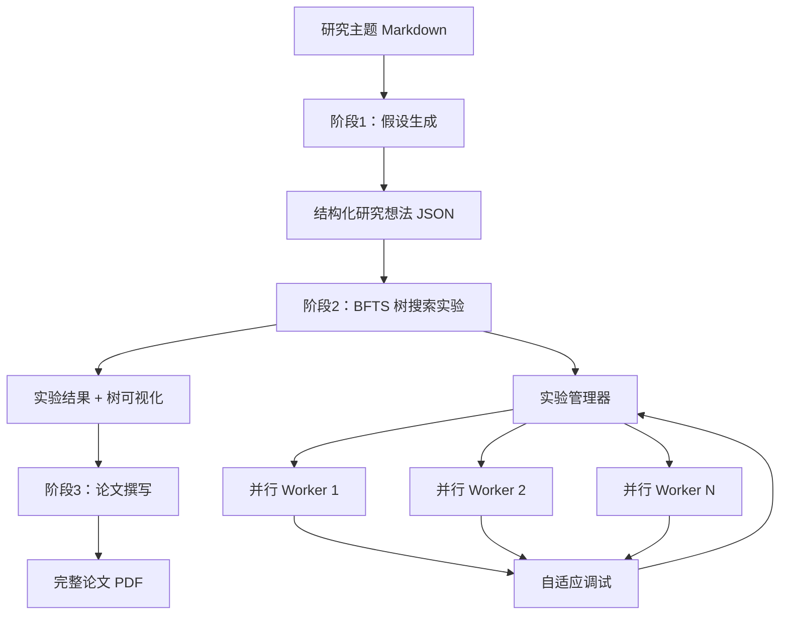

# AI Scientist-v2：智能体树搜索驱动的自动化科研论文生成

读完本文你会了解：AI Scientist-v2 的树搜索机制如何把"跑实验"从一条直线变成一棵可控的探索树；v2 相比 v1 到底解决了什么、又牺牲了什么；以及这套系统在当前阶段的适用边界。

---

## 一、项目概览

**AI Scientist-v2** 是 SakanaAI 开源的一个端到端科研智能体系统，能自主完成假设生成、实验设计、实验运行、数据分析到论文撰写的完整流程。项目在 GitHub 获得 **3.6k Stars**、**545 Forks**。

### 1.1 核心定位

v2 的核心变化可以概括为三点：

1. **从模板驱动到自主探索**：v1 依赖人类编写的实验模板，v2 把实验设计本身交给了智能体，不再需要预定义模板
2. **从单线执行到树搜索**：实验不再是"一条路走到黑"，而是通过最佳优先树搜索（BFTS）在多个实验分支间并行探索，遇到失败自动调试
3. **首个被 Workshop 接收的 AI 生成论文**：ICLR Workshop 接收了完全由 AI Scientist-v2 生成的论文，是 AI 科研自动化的一次实际验证

### 1.2 技术统计

| 指标 | 数值 |
|------|------|
| Stars | 3.6k |
| Forks | 545 |
| Commits | 58 |
| 贡献者 | 8 人 |
| 最新提交 | 2025-12-19 |
| 许可证 | AI Scientist Source Code License |
| 主要语言 | Python 70.4% |

### 1.3 v1 与 v2 对比

| 维度 | AI Scientist v1 | AI Scientist v2 |
|------|-----------------|-----------------|
| 模板依赖 | 依赖人类编写模板 | 无需模板 |
| 成功率 | 较高 | 较低 |
| 适用场景 | 目标明确、基础扎实的任务 | 开放性科学探索 |
| 灵活性 | 受限于模板 | 广泛探索 |

**重要说明**：v2 并不一定比 v1 产生更好的论文，特别是当有强起始模板可用时。v1 遵循明确的模板，成功率高；v2 采用更广泛、更具探索性的方法，成功率较低。

### 1.4 系统总览



三阶段流水线中，第二阶段是核心——它不是一条直线，而是一棵由实验管理器调度的搜索树。每个 Worker 独立探索一条实验路径，失败时自动触发调试重试，管理器在多个分支间按"最佳优先"策略分配资源。

## 二、核心功能

### 2.1 假设生成（Ideation）

AI Scientist-v2 能够自主生成研究假设：

- 基于用户提供的研究主题描述（Markdown 格式）
- 通过 LLM 大脑风暴并精炼研究想法
- 访问 Semantic Scholar 检查新颖性
- 输出结构化的 JSON 格式研究想法

```python
# 运行假设生成脚本
python ai_scientist/perform_ideation_temp_free.py \
  --workshop-file "ai_scientist/ideas/my_research_topic.md" \
  --model gpt-4o-2024-05-13 \
  --max-num-generations 20 \
  --num-reflections 5
```

### 2.2 智能体树搜索（Agentic Tree Search）

这是 v2 版本的核心创新：

- **最佳优先树搜索（BFTS，Best-First Tree Search）**：系统地探索多个实验路径
- **实验管理器智能体**：指导整个探索过程
- **并行探索**：可同时扩展多个节点
- **自适应调试**：自动尝试修复失败的实验节点

**关键参数配置**（`bfts_config.yaml`）：

| 参数 | 说明 |
|------|------|
| `num_workers` | 并行探索路径数 |
| `steps` | 最大探索节点数 |
| `max_debug_depth` | 最大调试次数 |
| `debug_prob` | 调试概率 |
| `num_drafts` | 独立树的数量 |

### 2.3 论文撰写

基于实验结果自动生成 LaTeX 论文：

- 分析实验数据
- 生成可视化图表
- 撰写 Introduction、Method、Experiment、Conclusion 等章节
- 生成参考文献
- 完整 PDF 输出

### 2.4 文献检索

集成 Semantic Scholar API：

- 搜索相关学术文献
- 检查假设的新颖性
- 自动生成参考文献引用

## 三、技术架构

### 3.1 一次完整任务如何流过系统

以一个具体例子说明：用户想研究"自适应学习率优化器的梯度噪声敏感性"。

1. **假设生成阶段**：用户提供 Markdown 格式的研究主题描述（含关键词、TL;DR、摘要）。系统调用 LLM 进行头脑风暴，生成 20 个候选研究想法，然后通过 Semantic Scholar 检索相关文献检查新颖性，最终输出 5 个结构化 JSON 格式的假设，每个包含论文标题、实验方案和预期贡献。

2. **树搜索实验阶段**：实验管理器读取 JSON 假设，启动 3 个并行 Worker。Worker 1 探索"噪声注入对收敛速度的影响"这条路径，Worker 2 探索"不同噪声分布的比较"，Worker 3 探索"噪声与 batch size 的交互"。当 Worker 2 的实验因 CUDA OOM 崩溃时，自适应调试机制自动减小模型并重试，最多重试 3 次。管理器根据中间结果动态调整资源分配——把更多预算给表现更好的 Worker 1。最终生成一棵包含 12 个节点的实验树和 `unified_tree_viz.html` 可视化。

3. **论文撰写阶段**：系统聚合所有实验节点的数据，生成对比图表，自动撰写 Introduction、Method、Experiment、Conclusion 章节，检索并插入参考文献，输出完整 LaTeX 论文 PDF。

### 3.2 系统流程

```
研究主题描述 (Markdown)
       ↓
[阶段1：假设生成]
       ↓
结构化研究想法 (JSON)
       ↓
[阶段2：智能体树搜索实验]
       ↓
实验结果 + 树可视化
       ↓
[阶段3：论文撰写]
       ↓
完整论文 PDF
```

### 3.3 支持的模型

AI Scientist-v2 支持多种 LLM 后端：

| 模型 | 调用方式 | 用途 |
|------|----------|------|
| OpenAI GPT-4o | `OPENAI_API_KEY` | 写作/审核 |
| Gemini | `GEMINI_API_KEY` | 写作/审核 |
| Claude (via AWS Bedrock) | `AWS_*` 环境变量 | 实验/写作/审核 |

### 3.4 成本估算

| 阶段 | 成本 | 说明 |
|------|------|------|
| 假设生成 | ~$2-3 | 取决于使用的 LLM |
| 实验运行 | ~$15-20 | 使用 Claude 3.5 Sonnet |
| 论文撰写 | ~$5 | 写作 + 引用 |

**一次完整运行的典型成本约为 $20-25**。

### 3.5 项目结构

```
AI-Scientist-v2/
├── ai_scientist/              # 核心代码目录
│   ├── perform_ideation_temp_free.py   # 假设生成脚本
│   └── ideas/                 # 研究想法目录
├── bfts_config.yaml           # BFTS 树搜索配置
├── launch_scientist_bfts.py   # 主启动脚本
├── docs/                     # 文档
└── requirements.txt           # Python 依赖
```

## 四、快速开始

### 4.1 环境要求

- **操作系统**：Linux（需 NVIDIA GPU）
- **Python**：3.11
- **CUDA** + **PyTorch**：GPU 计算支持
- **LaTeX**：PDF 文档生成

### 4.2 安装步骤

```bash
# 1. 创建 conda 环境
conda create -n ai_scientist python=3.11
conda activate ai_scientist

# 2. 安装 PyTorch（根据你的 CUDA 版本调整）
conda install pytorch torchvision torchaudio pytorch-cuda=12.4 -c pytorch -c nvidia

# 3. 安装 PDF 和 LaTeX 工具
conda install anaconda::poppler
conda install conda-forge::chktex

# 4. 安装 Python 依赖
pip install -r requirements.txt
```

### 4.3 配置 API Key

```bash
# OpenAI
export OPENAI_API_KEY="YOUR_OPENAI_KEY_HERE"

# Semantic Scholar（可选）
export S2_API_KEY="YOUR_S2_KEY_HERE"

# AWS（使用 Claude via Bedrock）
export AWS_ACCESS_KEY_ID="YOUR_AWS_ACCESS_KEY_ID"
export AWS_SECRET_ACCESS_KEY="YOUR_AWS_SECRET_KEY"
export AWS_REGION_NAME="your-aws-region"
```

### 4.4 运行完整流程

**第一步：生成研究想法**

```bash
python ai_scientist/perform_ideation_temp_free.py \
  --workshop-file "ai_scientist/ideas/my_research_topic.md" \
  --model gpt-4o-2024-05-13 \
  --max-num-generations 20 \
  --num-reflections 5
```

**第二步：运行实验并生成论文**

```bash
python launch_scientist_bfts.py \
  --load_ideas "ai_scientist/ideas/my_research_topic.json" \
  --load_code \
  --add_dataset_ref \
  --model_writeup o1-preview-2024-09-12 \
  --model_citation gpt-4o-2024-11-20 \
  --model_review gpt-4o-2024-11-20 \
  --model_agg_plots o3-mini-2025-01-31 \
  --num_cite_rounds 20
```

## 五、使用指南

### 5.1 准备研究主题

创建一个 Markdown 文件描述研究领域：

```markdown
# Title: 探索新的深度学习优化器

# Keywords:
深度学习, 优化器, 神经网络, 自适应学习率

# TL;DR:
提出一种新的自适应优化算法...

# Abstract:
我们提出一种...
```

### 5.2 理解树搜索结果

实验完成后，在 `experiments/"timestamp"/logs/0-run/` 目录下可以找到：

- **unified_tree_viz.html**：树搜索过程的可视化
- **实验日志**：每个节点的详细执行信息

### 5.3 故障排除

**问题：没有生成 PDF 或审核结果**

- 成功取决于选择的模型和想法的复杂性
- 建议使用 Claude 3.5 Sonnet 以获得更高成功率

**问题：CUDA 内存不足**

- 在研究主题文件中指定使用更小的模型
- 减少 `num_workers` 以降低并行度

## 六、安全与责任

### 6.1 警告

> ⚠️ **注意**：此代码将执行 LLM 生成的代码。自主运行 LLM 生成的代码存在多种风险，包括可能使用危险软件包、产生不可控的网络访问，以及生成意外进程。**务必在受控沙箱环境中运行**（例如 Docker 容器）。

### 6.2 强制性披露

根据许可证，使用此代码生成的科学论文必须：

- 在论文的显眼位置明确披露 AI 的使用
- 在摘要或方法部分添加适当的归属声明

**推荐引用格式：**

> "This manuscript was autonomously generated using The AI Scientist."

## 七、推荐做法

### 7.1 研究主题设计

- 提供清晰的研究领域描述
- 包含足够的背景信息帮助 LLM 理解研究上下文
- 明确研究的目标和预期贡献

### 7.2 模型选择

| 场景 | 推荐模型 | 理由 |
|------|----------|------|
| 实验阶段 | Claude 3.5 Sonnet | 高成功率 |
| 写作阶段 | GPT-4o 或 o1 | 成本效益 |
| 引用生成 | GPT-4o | 成本控制 |

### 7.3 成本优化

- 使用较便宜的模型进行引用生成（`model_citation`）
- 仔细选择 `num_workers` 和 `steps` 参数
- 在 ideation 阶段使用较小模型

## 八、常见问题

**Q: AI Scientist-v2 和 v1 哪个更好？**

A: 取决于你的需求。v1 适合有明确目标和良好基础的场景，成功率更高。v2 适合开放性科学探索，但成功率较低。

**Q: 运行一次完整实验需要多少时间？**

A: 完整流程通常需要数小时，具体取决于并行度和实验复杂度。

**Q: 是否需要 GPU？**

A: 是的，需要 NVIDIA GPU 和 CUDA 支持来运行深度学习实验。

**Q: 如何处理 Semantic Scholar API 限制？**

A: 可以跳过引用阶段，或者使用 `S2_API_KEY` 提高 API 限额。

## 九、总结与建议

AI Scientist-v2 把"跑实验"从一条直线变成了可搜索、可调试、可并行的树。它的不在"生成论文"这个结果，而在"把实验设计本身变成可被智能体探索的问题"这个方向。

**适用场景**：

- 适合：有明确假设空间但需要大量实验探索的研究方向，例如超参数搜索、消融实验、模型架构变体对比
- 不太适合：实验模板已经成熟、只需按模板批量运行的场景——此时 v1 效率更高、成功率也更稳定

**启动建议**：

1. 先用 v1 在一个成熟模板上跑通全流程，确认环境和依赖没问题
2. 再用 v2 在同一个研究方向上做开放式探索，观察树搜索的分支质量
3. 在写作阶段搭配 Claude 3.5 Sonnet 或 o1 系列模型，显著提高论文质量

**关键局限**：

- 成功率低于 v1，树搜索可能产生大量低质量分支，浪费 API 成本
- 依赖强大的 LLM 后端，弱模型下实验设计和调试能力大幅下降
- 需要 NVIDIA GPU 和 CUDA 环境，资源门槛较高

## 十、自测清单

读完这篇文章，对照下面 8 条检查自己的理解。不看原文能答出 6 条以上，说明核心内容已经抓住了；3 条以下有困难的话，建议回看对应章节。

- [ ] 能用一句话说清 BFTS（最佳优先树搜索）和"一条路跑到黑的线性实验"之间的根本区别
- [ ] 能列举 v2 相比 v1 的三个核心变化，以及每个变化带来的代价——不要只说"更灵活"，要说出牺牲了什么
- [ ] 能画出三阶段流水线（假设生成 → 树搜索实验 → 论文撰写）中数据的流转路径，标注每个阶段的输入和输出格式
- [ ] 能解释实验管理器和并行 Worker 的协作方式：管理器如何分配任务、Worker 失败后自适应调试的触发条件和重试上限
- [ ] 给定一个研究主题和 API 价格，能估算一次完整运行的大致成本范围（假设生成 ~$2-3、实验 ~$15-20、论文 ~$5）
- [ ] 给定一个具体的研究场景，能判断该选 v1 还是 v2，并能从模板可用性、探索空间大小、成本容忍度三个维度解释理由
- [ ] 理解 AI Scientist-v2 的安全风险——它执行的代码是 LLM 生成的，你知道最低限度的防护措施是什么（沙箱环境、Docker 隔离）
- [ ] 了解使用 AI 生成论文时的强制性披露要求，能写出正确的引用声明

## 十一、实战练习

以下三个练习从理解到分析递进，覆盖"读输出、跑流程、做决策"三个层次。每个练习有明确的预期产出，建议按顺序完成。

### 练习一：读懂一棵实验树（理解型）

假设你得到了一份 AI Scientist-v2 生成的 `unified_tree_viz.html`，里面展示了一棵 15 个节点的搜索树。

1. 在树中找出至少一个"调试重试"节点——也就是某个实验失败后触发自适应调试、最终重新执行成功的节点。描述它在树中的位置特征：深度、兄弟节点数量、父节点的实验类型。
2. 观察树的形状：是宽而浅还是窄而深？结合 `num_workers` 和 `max_debug_depth` 参数的含义，倒推这次运行的参数配置。
3. 找到树中最深的那条实验路径，列出从根到叶的所有节点。这条路径上的实验演进有逻辑连续性吗？如果中间有明显的方向跳跃，可能说明什么？

**预期产出**：一段 300-500 字的分析，包含对树结构特征的判断和参数推断的依据。

### 练习二：设计一个可跑通的研究主题（应用型）

你想用 AI Scientist-v2 探索一个真实的 ML 研究方向。完成以下三步：

1. **选题**：选一个你熟悉的方向，比如 Transformer 的位置编码变体、小样本学习的 prompt 设计、数据增强对鲁棒性的影响等。
2. **写主题描述**：按照第五章的 Markdown 格式，写一份包含 Title、Keywords、TL;DR、Abstract 的研究主题描述文件。TL;DR 和 Abstract 各控制在 3-5 句。
3. **配置参数并算成本**：给定 $25 的总预算，你怎么分配 `num_workers`、`steps`、`max_debug_depth`？写作阶段、引用生成阶段、实验阶段分别选什么模型？写出配置方案和成本计算明细。
4. **做风险预案**：预判至少两个实验可能失败的情况（比如 CUDA OOM、模型输出格式异常），并说明你的应对策略。

**预期产出**：一份 .md 主题描述文件 + 参数配置说明（含成本计算）+ 风险预案。

### 练习三：v1 还是 v2？做一次决策分析（分析型）

你的团队想把 AI Scientist 引入三个场景的科研流程。对每个场景，给出你的推荐（v1 / v2 / 不适合）并写清楚判断依据，至少覆盖模板可用性、探索空间大小、成本容忍度三个维度。

| 场景 | 描述 |
|------|------|
| A | 一个成熟的图像分类 benchmark，已有 3 篇论文做过系统消融实验。你的团队想在这个 benchmark 上验证一个新的归一化层设计 |
| B | 一个刚提出的新型神经网络架构，公开文献只有原论文和一篇复现报告。你想系统探索它的设计空间——深度、宽度、激活函数、连接方式的组合 |
| C | 一个需要大规模分布式训练加 TB 级数据集的任务，单次实验就要 8×A100，成本和时间都极为敏感 |

**预期产出**：每个场景 150-200 字的分析，给出明确结论和理由。鼓励在三个场景之间做出有区分度的判断——如果三个场景的结论一模一样，说明你的分析还没到位。

---

**相关资源：**

- 📄 [论文](https://pub.sakana.ai/ai-scientist-v2/paper)
- 📝 [博客文章](https://sakana.ai/ai-scientist-first-publication/)
- 🧪 [ICLR2025 Workshop 实验](https://github.com/SakanaAI/AI-Scientist-ICLR2025-Workshop-Experiment)
- 🐙 [GitHub](https://github.com/SakanaAI/AI-Scientist-v2)
