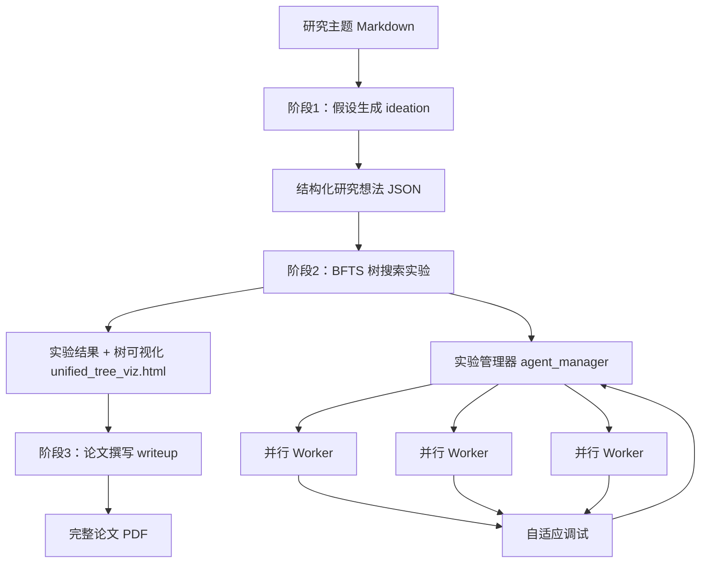

# AI Scientist-v2：把实验设计从模板改成树搜索

AI Scientist-v2 的贡献不在"更会写论文"，而在把实验设计这一步从 v1 的人类模板手里交还给模型。代价是成功率下降，换来的是更开放的探索空间——以及一篇完全由 AI 生成、同行评审均分高过 workshop 平均接收线的论文。本文拆解树搜索机制、那条评审结果该怎么读，以及现在该在什么场景用它。

## 一、v1 和 v2 差的不是写作，是实验设计从哪来

v1（SakanaAI/AI-Scientist）里，模型能产出的东西被人类模板框住。系统只能在 NanoGPT、2D Diffusion、Grokking 这类模板里选一个，把 idea 填进模板预留的插槽，实验怎么跑基本是定死的。这一步可靠，因为变异范围小，但也就限制了系统能探索的假设。

v2 把这一步也交给模型。给定一个宽泛的研究主题，系统自己提出假设、自己决定实验怎么做、失败了自己换个方向。这从"在一条固定路径上填参数"变成了"在一棵实验树上搜索"。README 把差别说得很直白：v2 产出的论文不一定比 v1 好——有强起始模板时，v1 走定义清晰的模板，成功率高；v2 路子更开放，成功率更低。v1 适合目标明确、地基扎实的任务，v2 为开放式科学探索而生。

| 维度 | v1 | v2 |
|------|-----|-----|
| 代码来源 | 人类写好的领域模板 | 模型自主生成、自主修改 |
| 实验推进 | 线性流水线，走完即止 | 最优优先树搜索，并行生长多分支 |
| 适用范围 | 特定领域（NanoGPT、2D Diffusion、Grokking） | 领域通用，不受模板限制 |
| 失败分支 | 没有退路，只能硬走 | 放弃失败路径，收缩到最有希望的方向 |
| 评审与图表 | 标准自动评审 | 引入 VLM 反馈循环，优化图表与正文一致性 |
| 定位 | 目标明确时成功率更高 | 开放式探索，成功率为代价换取广度 |

## 二、系统总览

从使用者视角看是三段流水线——想法生成、树搜索实验、论文撰写，中间那段是 v2 的命门。（注意：本节的"阶段"指这三段；树搜索内部还有自己的四阶段实验流程，见第三节。）


```mermaid
flowchart TD
    A[研究主题 Markdown] --> B[阶段1：假设生成 ideation]
    B --> C[结构化研究想法 JSON]
    C --> D[阶段2：BFTS 树搜索实验]
    D --> E[实验结果 + 树可视化 unified_tree_viz.html]
    E --> F[阶段3：论文撰写 writeup]
    F --> G[完整论文 PDF]

    D --> D1[实验管理器 agent_manager]
    D1 --> D2[并行 Worker]
    D1 --> D3[并行 Worker]
    D1 --> D4[并行 Worker]
    D2 & D3 & D4 --> D5[自适应调试]
    D5 --> D1
```

阶段二里，实验管理器（`ai_scientist/treesearch/agent_manager.py`）在几棵树之间调度资源。每个 Worker 独立探索一条分支，实验失败就触发自适应调试重试，管理器按 best-first 策略把预算分给更有希望的分支——非失败节点之间怎么挑，由一个 LLM 依据性能指标、训练动态和图表质量来评估。这一层的设计借鉴了 Jiang 等人的 [AIDE](https://github.com/WecoAI/aideml) 项目——把 LLM 代码生成与树搜索结合、每个节点带一个标量评估分、按分数迭代选择节点做调试或改进，曾在 MLE-Bench 上拿到领先成绩。AI-Scientist-v2 据此实现了自己的最优优先树搜索，README 末尾也专门向 AIDE 致谢。

阶段三里还有一处 v1 没有的增强：论文的自动评审（reviewer）接入了视觉语言模型（VLM）反馈循环。VLM 不只读文字，还会逐张看图，判断图像内容与标题、正文叙述是否对得上，据此反复提修改意见。论文的版本对比表显示，VLM 反馈在实验阶段和成稿评审两个环节都在用，v1 两处都没有。

## 三、树搜索：把"下一步做什么"变成可搜索的状态

v1 是线性推进：假设 → 实验 → 结论，走完拉倒。v2 把实验切开成节点，多个可行方向并行生长，失败的分支被放弃而不是硬走下去。这样系统能同时试几条路，再根据中间结果收缩到最有希望的那条。

第一段是 ideation（`ai_scientist/perform_ideation_temp_free.py`）。你给一个 Markdown 主题文件（含 Title、Keywords、TL;DR、Abstract），它用 LLM 生成一批候选想法，调用 Semantic Scholar 检查新颖性，最后产出结构化的研究想法 JSON。

第二段的搜索参数都写在 `bfts_config.yaml`：

| 参数 | 作用 |
|------|------|
| `num_workers` | 并行探索的分支数 |
| `steps` | 整棵树最多探索的节点数 |
| `num_seeds` | 多种子评估（`multi_seed_eval`）的种子数：`num_workers` 小于 3 时与它一致，否则设为 3 |
| `max_debug_depth` | 一个失败节点最多调试几次才放弃 |
| `debug_prob` | 失败时触发调试的概率 |
| `num_drafts` | 阶段一里独立生长的树的数量 |

README 还特别提醒：`k_fold_validation`、`expose_prediction`、`data_preview` 这三个 agent 参数在当前版本没有实际作用，配了也无效。

搜索过程被拆成四个显式阶段，由实验管理器逐段推进：Stage 1 用最小可行原型验证想法能跑通，Stage 2 调超参建立稳健基线，Stage 3 执行核心研究议程，Stage 4 做消融实验支撑结论。每个阶段都有明确的停止条件——比如 Stage 1 以最小原型成功执行为终点。`bfts_config.yaml` 里的 `stage1_max_iters` 到 `stage4_max_iters` 就是给这四个阶段分别设的节点数上限。

## 四、一次任务怎么流过系统

以"探索新的深度学习优化器"这类主题为例。第一步，把主题写成 Markdown 放进 `ai_scientist/ideas/`，跑 ideation：

```bash
python ai_scientist/perform_ideation_temp_free.py \
  --workshop-file "ai_scientist/ideas/my_research_topic.md" \
  --model gpt-4o-2024-05-13 \
  --max-num-generations 20 \
  --num-reflections 5
```

它生成 `my_research_topic.json`，里面是一批带假设、实验方案和相关工作分析的 idea。第二步，用这个 JSON 启动主流水线：

```bash
python launch_scientist_bfts.py \
  --load_ideas "ai_scientist/ideas/my_research_topic.json" \
  --load_code \
  --add_dataset_ref \
  --model_writeup o1-preview-2024-09-12 \
  --model_citation gpt-4o-2024-11-20 \
  --model_review gpt-4o-2024-11-20 \
  --model_agg_plots o3-mini-2025-01-31 \
  --num_cite_rounds 20
```

若干 Worker 并行跑实验，遇到 CUDA 内存不足这类报错，自适应调试会读错误信息、修改代码再重试，调试次数受 `max_debug_depth` 限制。真被显存卡住时，官方 FAQ 给的出路是回头改 ideation 提示文件，让实验改用更小的模型。实验结束后，`experiments/"timestamp_ideaname"/logs/0-run/` 目录下会生成树搜索的可视化 `unified_tree_viz.html`。最后进入 writeup 阶段，聚合实验数据、生成图表、写 LaTeX 论文，这一步通常要 20 到 30 分钟，产出 `timestamp_ideaname.pdf`。README 提醒，从实验到成稿的全部阶段一般几个小时能跑完。

## 五、那篇"通过评审"的论文，该怎么读

2025 年 3 月，SakanaAI 宣布一篇完全由 AI Scientist-v2 生成的论文在 ICLR 的 workshop 上走完了同行评审。论文题为《Compositional Regularization: Unexpected Obstacles in Enhancing Neural Network Generalization》，三位评审给了 6、7、6，均分 6.33，高于该 workshop 的平均接收阈值。按 SakanaAI 公布的数字，这个均分在全部投稿里排在约 45% 的位置，比不少最终被接收的人类论文还高。据 SakanaAI 所知，这是第一篇完全由 AI 生成、通过标准同行评审流程的论文。

读这个结果时，有几个背景要放进去：

- 那是个 **workshop**，不是主会议。ICLR 之类顶会主会议的接收率通常在 20% 到 30%，而像这次投稿的 ICBINB workshop 接收率在 60% 到 70%。过了 workshop 的线，不等于过了主会议的线。
- 三篇投稿里，另外两篇没有过线。投 3 篇是与 workshop 组织方商量后的决定，免得占用太多审稿人力。作者团队自己也按主会议标准把 3 篇都内部评审了一遍，结论是没有一篇达到 ICLR 主会的接收门槛。那篇过线的论文，主题是个负结果（negative result）——它报告的是"新正则化方法没能提升组合泛化"——而这恰恰是 ICBINB 鼓励的方向。
- 这次评审是 SakanaAI 与 ICLR 及 workshop 组织方协作的实验。按事前约定，即使论文过线，也会在真正发表前撤回；组织方因此没有再做终审（meta-review），也就是说，它达到了接收线，但没有、也不会真的被发表。
- 评审中暴露了 AI 系统的毛病：它把"基于 LSTM 的网络"错误引用到了 Goodfellow 2016，而正确出处是 Hochreiter 与 Schmidhuber 1997。

所以正确的读法是：这证明了"AI 能生成达到 workshop 接收标准的论文"这件事发生了，但离"达到顶会主会议标准"还有距离。数字本身（6.33、60%-70%）是评估的语境，不是能力的上限。

这套验证的原始材料都公开了：系统论文见 [arXiv:2504.08066](https://arxiv.org/abs/2504.08066)（Yamada, Lange, Lu, Hu, Lu, Foerster, Clune, Ha；Sakana AI 与 UBC、Vector Institute、Oxford 合作），官方博客《[The AI Scientist Generates its First Peer-Reviewed Scientific Publication](https://sakana.ai/ai-scientist-first-publication/)》，三篇投稿论文及评审细节放在 [SakanaAI/AI-Scientist-ICLR2025-Workshop-Experiment](https://github.com/SakanaAI/AI-Scientist-ICLR2025-Workshop-Experiment) 仓库，主代码在 [SakanaAI/AI-Scientist-v2](https://github.com/SakanaAI/AI-Scientist-v2)（The AI Scientist Source Code License，Responsible AI License 的衍生，不是宽松开源协议）。想核实任何数字，直接看这三处原始出处。

## 六、适用边界与采用建议

该在什么场景用它：

- **当你是研究者、想要新的实验方向时**：v2 可以作为 idea 生成器，给定一个宽泛主题，让它产出候选假设和实验方案，你从中挑有潜力的。这一步成本很低，ideation 一般只要几美元。
- **当你有强起始模板、目标明确时**：继续用 v1 更划算。README 明确说 v2 在这种场景不一定更好，反而成功率更低。v2 的"更广探索"是以成功率为代价换来的。
- **当你只想验证流程、不想烧太多钱时**：一次完整运行，实验阶段用 Claude 3.5 Sonnet 大约 $15-20，写作用默认模型约 $5，加上 ideation 几美元，总成本在几十美元的量级。README 建议把 `model_citation` 设为 GPT-4o，能压低写作成本。预算和 `num_workers`、`steps` 直接相关，可以先调小跑通再放大。

三条边界必须记住：

1. **成本与成功率挂钩**。成功率取决于实验阶段用的模型和 idea 的复杂度，用 Claude 3.5 Sonnet 一般更高。跑不出 PDF 或 review 是常见结果，不是 bug。
2. **必须在沙箱里跑**。系统会执行 LLM 生成的代码，可能装危险包、不受控地访问网络、拉起意外进程。README 要求放在受控沙箱（比如 Docker 容器）里运行。
3. **发表要披露**。这不是 Apache 那类宽松协议：许可证强制要求在任何由此产生的论文里清楚、显著地披露 AI 的使用，官方建议在 Abstract 或 Methods 里加一句"This manuscript was autonomously generated using The AI Scientist"式的归属声明。

树搜索的实现基于 AIDE，作者也在 README 里致谢了。这意味着这一层的改进可以顺着 AIDE 的迭代继续走。

## 结语

AI Scientist-v2 的价值要分开看。作为"自动生成论文"的系统，它目前的产出离顶会主会议还有距离，成本也不低。作为"把实验设计交给模型"的工程实验，它把开放式科研探索往前推了一步——第一篇 AI 生成的论文拿到高于接收线的评审分这件事，本身就是测量尺上的一次移动。用的时候别把它当成稳定的论文生产线，当成一个能帮你提出假设、跑通完整科研流程的探索工具更恰当。