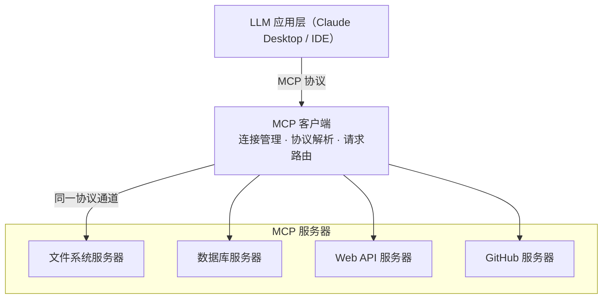
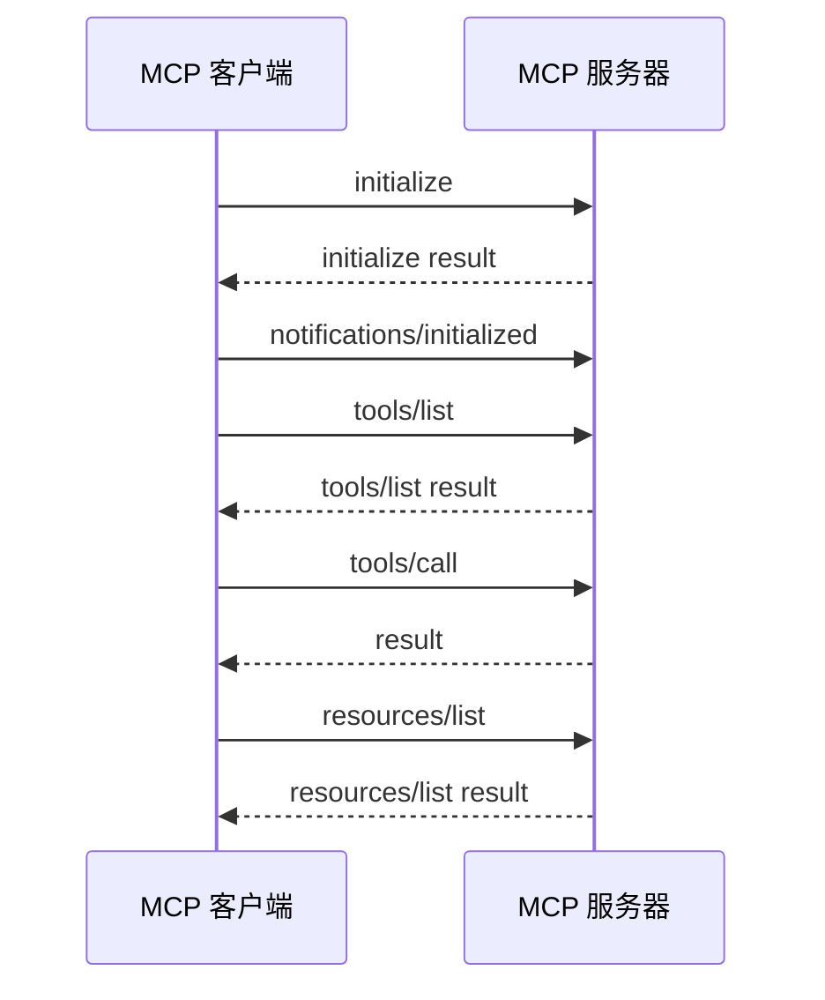

# Claude API 基础专题（五）：MCP 协议深度解析

> **目标读者**：想让 Claude 接入外部工具或数据的开发者
> **前置知识**：了解 Claude API 基础用法和工具调用概念

---

**读完本文，你会**：

- 说清 MCP 解决了工具调用的什么问题，以及在厂商私有格式之上它做了什么取舍
- 看懂客户端与服务器 `initialize` 握手、`tools/list`、`tools/call` 的完整报文交换
- 用官方 SDK 起一个可运行的 MCP 服务器，并用客户端脚本连上它
- 判断一个工具该走 MCP 还是普通工具调用，以及排错时先从哪下手

LLM 只能处理文本，要让它操作外部世界——读文件、查数据库、发邮件——就得有一套协议把"外部能力"接进来。MCP（Model Context Protocol）就是干这个的。

MCP 把工具定义、发现和调用从厂商私有格式收束为开放协议，让一次开发的工具能在多个 LLM 应用里复用。下面从三个角度展开：MCP 究竟解决了什么问题、客户端与服务器如何握手并交换能力、什么场景下值得选 MCP 而不是直接写工具调用。

## 为什么需要 MCP

### 碎片化的工具调用

2023 年 OpenAI 推出 function calling 后，各大 LLM 提供者陆续定义了各自的工具调用格式：

```python
# OpenAI 的格式
{
    "name": "get_weather",
    "description": "获取天气",
    "parameters": {
        "type": "object",
        "properties": {
            "city": {"type": "string"}
        }
    }
}

# Google 的格式
{
    "function_declarations": [{
        "name": "get_weather",
        "description": "获取天气",
        "parameters": {...}
    }]
}

# Anthropic 的格式
{
    "name": "get_weather",
    "description": "获取天气",
    "input_schema": {
        "type": "object",
        "properties": {
            "city": {"type": "string", "description": "城市名称"}
        }
    }
}
```

根因是厂商锁定：每个 LLM 提供商都想把开发者绑在自己的格式上。用 OpenAI 的格式写了一套工具，再想迁到 Google 的模型就得重写一遍。这带来四个连锁问题：

| 问题 | 影响 |
|------|------|
| 供应商锁定 | 开发者被绑定在某一 LLM 提供商 |
| 重复开发 | 同一个工具需要为不同提供商编写不同版本 |
| 生态割裂 | 工具开发者只愿意为流行平台开发 |
| 创新受阻 | 新入局的 LLM 难以快速建立工具生态 |

### MCP 的思路

MCP 由 Anthropic 于 2024 年 11 月开源提出，随规格演化，OpenAI、Google、Microsoft 等厂商也先后加入治理，逐步成为多方共同维护的开放标准。它的思路是：**给 LLM 工具调用做一个"USB 接口"——一次开发，到处可用。**

名字本身就点出了它的三个要点：

- **协议（Protocol）**：基于 JSON-RPC 2.0 的标准化通信规则，选型原因见后文「协议工作流程」一节。
- **上下文（Context）**：把"LLM 能读到的外部数据"和"LLM 能调用的外部函数"统一抽象为资源和工具。
- **模型无关（Model-agnostic）**：任何实现了 MCP 客户端的应用都能接入同一批服务器。

### MCP vs 传统工具调用

| 特性 | 传统工具调用 | MCP |
|------|------------|-----|
| 工具定义格式 | 各厂商私有（OpenAI `parameters`、Anthropic `input_schema`） | 统一 JSON Schema，跨厂商复用 |
| 工具发现 | 应用启动时硬编码或静态配置 | 运行时通过 `tools/list` 动态发现 |
| 服务器主动通知 | 无 | 支持 `resources/updated` 等通知 |
| 传输层 | 与应用同进程，函数调用 | 解耦，可走 stdio / Streamable HTTP |
| 实现语言 | 必须与宿主应用同语言 | 任意语言，只要实现 JSON-RPC 2.0 |
| 跨应用复用 | 一个工具绑定一个应用 | 同一服务器可被多个客户端使用 |

## MCP 架构

MCP 采用客户端-服务器架构，包含三个核心组件：



拆成三层，各管各的事：

- **LLM 应用层**只教客户端"把工具列表和调用结果喂给模型"，不碰具体工具实现。
- **MCP 客户端**负责连接管理、协议解析、请求路由，一个客户端能同时挂多个服务器。
- **MCP 服务器**只暴露自己的能力，不管哪家的应用在调它。

### 资源与工具的区别

MCP 里两个容易混的概念：**资源（Resources）** 和 **工具（Tools）**

```python
# 资源：LLM 可以读取的数据，类似于"文件"
{
    "type": "resource",
    "name": "user_profile",
    "uri": "file://./user_profile.json",
    "mimeType": "application/json"
}

# 工具：LLM 可以调用的函数，类似于"程序"
{
    "type": "tool",
    "name": "send_email",
    "description": "发送邮件",
    "inputSchema": {...}
}
```

两者的区别在于谁来发起操作：

| 类型 | 发起方 | 例子 | 权限 |
|------|--------|------|------|
| 资源 | LLM 主动读取 | 查看文件内容 | 读权限 |
| 工具 | LLM 调用执行 | 删除文件、发送邮件 | 写权限 |

把读和写分开，权限就能收得更窄：读取配置文件只要读权限，删除文件需要写权限。即使 LLM 被诱导，也无法通过"读"操作触发副作用。这个区分也引导读者按能力性质选通道——只是取数就申明成资源，要改动外部状态才做成工具；反过来，把一个副作用声明成资源，就等于在应用层绕过权限模型。

## 协议工作流程

### JSON-RPC 基础

MCP 底层使用 JSON-RPC 2.0 协议通信。选它有几个原因：消息格式只有请求、响应、通知三种，任何语言都能快速实现；与传输层解耦，stdio、Streamable HTTP 都能跑；基于 JSON，调试时直接打印就能看懂消息内容。

协议版本是带日期的字符串，从 2024-11-05 的初版一路演进到 2025-11-25。客户端和服务器在 initialize 阶段各自声明自己支持的 protocolVersion，协商出一个双方都能用的版本；版本对不上时，较新的一方会降级到对方支持的版本，而不是直接断开。

### 核心消息类型

```python
# 初始化请求（客户端 → 服务器）
{
    "jsonrpc": "2.0",
    "id": 1,
    "method": "initialize",
    "params": {
        "protocolVersion": "2025-11-25",
        "capabilities": {
            "roots": {"list": True},
            "sampling": {}
        },
        "clientInfo": {
            "name": "claude-desktop",
            "version": "1.0.0"
        }
    }
}

# 初始化响应（服务器 → 客户端）
{
    "jsonrpc": "2.0",
    "id": 1,
    "result": {
        "protocolVersion": "2025-11-25",
        "capabilities": {
            "tools": {"listChanged": True},
            "resources": {"subscribe": True, "listChanged": True}
        },
        "serverInfo": {
            "name": "filesystem-server",
            "version": "1.0.0"
        }
    }
}
```

### 完整交互流程



### 工具调用

当 LLM 决定调用一个工具时，客户端发送：

```python
{
    "jsonrpc": "2.0",
    "id": 42,
    "method": "tools/call",
    "params": {
        "name": "read_file",
        "arguments": {
            "path": "/Users/demo/readme.md"
        }
    }
}
```

服务器处理后返回：

```python
# 成功响应
{
    "jsonrpc": "2.0",
    "id": 42,
    "result": {
        "content": [
            {
                "type": "text",
                "text": "# Hello World\n\nThis is a sample file."
            }
        ],
        "isError": False
    }
}

# 错误响应
{
    "jsonrpc": "2.0",
    "id": 42,
    "error": {
        "code": -32603,
        "message": "File not found: /Users/demo/readme.md"
    }
}
```

## 构建 MCP 服务器

**前置条件**：Python 3.10+。用 `uv run pip install "mcp[cli]>=1.0"` 或 `pip install "mcp[cli]>=1.0"` 安装官方 SDK（`aiofiles` 一并带上）。

### 基础实现

下面是一个只读写本地文件的服务器，完整可运行。保存为 `src/server.py`：

```python
# src/server.py
from typing import Any
from mcp.server import Server
from mcp.server.stdio import stdio_server
from mcp.types import Tool, TextContent

server = Server("my-filesystem-server")

@server.list_tools()
async def list_tools() -> list[Tool]:
    """
    列出服务器提供的所有工具。
    
    list_tools 在握手后调用一次，客户端会缓存结果。
    """
    return [
        Tool(
            name="read_file",
            description="读取文件内容",
            inputSchema={
                "type": "object",
                "properties": {
                    "path": {
                        "type": "string",
                        "description": "要读取的文件路径"
                    }
                },
                "required": ["path"]
            }
        ),
        Tool(
            name="write_file",
            description="写入内容到文件。如果文件存在，会覆盖原有内容。",
            inputSchema={
                "type": "object",
                "properties": {
                    "path": {"type": "string", "description": "要写入的文件路径"},
                    "content": {"type": "string", "description": "要写入的内容"}
                },
                "required": ["path", "content"]
            }
        ),
        Tool(
            name="list_directory",
            description="列出目录中的文件和文件夹",
            inputSchema={
                "type": "object",
                "properties": {
                    "path": {
                        "type": "string",
                        "description": "要列出的目录路径",
                        "default": "."
                    }
                }
            }
        )
    ]

@server.call_tool()
async def call_tool(name: str, arguments: Any) -> list[TextContent]:
    """
    执行工具调用。
    
    list_tools 和 call_tool 分开的原因：
    - list_tools：定义"有什么工具"，连接时调用一次，客户端可缓存
    - call_tool：执行"具体某个工具"，每次调用都触发
    分开后客户端不用每次调用都重新拉工具列表，也支持 listChanged 通知。
    """
    if name == "read_file":
        return await _read_file(arguments)
    elif name == "write_file":
        return await _write_file(arguments)
    elif name == "list_directory":
        return await _list_directory(arguments)
    else:
        raise ValueError(f"Unknown tool: {name}")

async def _read_file(arguments: dict) -> list[TextContent]:
    import aiofiles
    path = arguments["path"]
    try:
        async with aiofiles.open(path, "r", encoding="utf-8") as f:
            content = await f.read()
        return [TextContent(type="text", text=content)]
    except FileNotFoundError:
        return [TextContent(type="text", text=f"Error: File not found: {path}")]
    except PermissionError:
        return [TextContent(type="text", text=f"Error: Permission denied: {path}")]

async def _write_file(arguments: dict) -> list[TextContent]:
    import aiofiles, os
    path = arguments["path"]
    content = arguments["content"]
    directory = os.path.dirname(path)
    if directory and not os.path.exists(directory):
        os.makedirs(directory, exist_ok=True)
    async with aiofiles.open(path, "w", encoding="utf-8") as f:
        await f.write(content)
    return [TextContent(type="text", text=f"Successfully wrote to {path}")]

async def _list_directory(arguments: dict) -> list[TextContent]:
    import os
    path = arguments.get("path", ".")
    try:
        entries = os.listdir(path)
        formatted = "\n".join(f"- {entry}" for entry in sorted(entries))
        return [TextContent(type="text", text=formatted)]
    except FileNotFoundError:
        return [TextContent(type="text", text=f"Directory not found: {path}")]
    except PermissionError:
        return [TextContent(type="text", text=f"Permission denied: {path}")]

async def main():
    async with stdio_server() as (read_stream, write_stream):
        await server.run(
            read_stream,
            write_stream,
            server.create_initialization_options()
        )

if __name__ == "__main__":
    import asyncio
    asyncio.run(main())
```

**验证这步**：直接 `python src/server.py` 会卡住，因为 stdio 服务器在等 stdin 上的协议消息，这符合预期。想确认它没写错，用 SDK 自带的调试器连一次：`uv run mcp dev src/server.py`，浏览器会打开一个交互面板，可以手写 `tools/call` 报文并看到文字返回。想静默结束，按 `Ctrl+C` 即可。

### 使用 FastMCP 简化开发

FastMCP 是官方 Python SDK 里的高级封装（`mcp.server.fastmcp`），用装饰器注册工具，省掉手写 inputSchema 的功夫：

```python
from mcp.server.fastmcp import FastMCP

mcp = FastMCP("my-demo-server")

@mcp.tool()
def calculate(operation: str, a: float, b: float) -> dict:
    """
    执行数学计算。
    
    装饰器写法下，函数签名被自动解析成 JSON Schema，
    不用手写 inputSchema。代价是执行顺序依赖装饰器顺序，
    动态注册工具时不如显式 API 灵活。适合简单工具定义。
    """
    operations = {
        "add": lambda x, y: x + y,
        "subtract": lambda x, y: x - y,
        "multiply": lambda x, y: x * y,
        "divide": lambda x, y: x / y if y != 0 else "Error: Division by zero"
    }
    if operation not in operations:
        return {"error": f"Unknown operation: {operation}"}
    result = operations[operation](a, b)
    return {"operation": operation, "a": a, "b": b, "result": result}

@mcp.resource("config://app")
def get_config() -> str:
    """提供应用配置资源"""
    return '{"version": "1.0.0", "theme": "dark"}'

if __name__ == "__main__":
    mcp.run()
```

FastMCP 后来也单独拆成了独立的 `fastmcp` 包，导入路径写成 `from fastmcp import FastMCP`，写法和这里一致。本地调试用官方 SDK 里的版本就够，想用更丰富的传输与插件能力再切到独立包。

## MCP 客户端开发

下面这个客户端连的就是上一节的 `server.py`，跑之前先在 `/tmp` 建一个 `demo.txt`，否则 `read_file` 会命中文档后面讲的"文件不存在"分支。

### 连接管理

```python
import asyncio
from mcp.client import ClientSession
from mcp.client.stdio import stdio_client, StdioServerParameters

async def main():
    server_params = StdioServerParameters(
        command="python",
        args=["server.py"],
    )
    async with stdio_client(server_params) as (read, write):
        async with ClientSession(read, write) as session:
            # 1. 初始化连接——握手交换能力信息
            await session.initialize()
            
            # 2. 列出可用工具
            tools = await session.list_tools()
            print("可用工具:", [t.name for t in tools])
            
            # 3. 调用工具
            result = await session.call_tool(
                "read_file",
                arguments={"path": "/tmp/demo.txt"}
            )
            print("文件内容:", result.content[0].text)

asyncio.run(main())
```

### 错误处理

```python
from mcp.exceptions import MCPError

async def safe_call_tool(session, tool_name: str, arguments: dict):
    try:
        result = await session.call_tool(tool_name, arguments)
        return {"success": True, "result": result}
    except MCPError as e:
        return {"success": False, "error": "protocol_error", "message": str(e)}
    except Exception as e:
        return {"success": False, "error": "internal_error", "message": str(e)}
```

## MCP 生态与实践

### 官方 MCP 服务器

MCP 项目在 [modelcontextprotocol/servers](https://github.com/modelcontextprotocol/servers) 维护了一批参考实现：filesystem（本地文件操作）、memory（持久化记忆）、sequential-thinking（推理辅助）、slack（Slack 集成）等。

### 在 Claude Desktop 中配置 MCP

```json
// macOS: ~/Library/Application Support/Claude/claude_desktop_config.json
{
    "mcpServers": {
        "filesystem": {
            "command": "npx",
            "args": ["-y", "@modelcontextprotocol/server-filesystem", "/Users/username/projects", "/Users/username/documents"]
        },
        "github": {
            "command": "npx",
            "args": ["-y", "@modelcontextprotocol/server-github"],
            "env": {
                "GITHUB_TOKEN": "your-github-pat"
            }
        }
    }
}
```

配置文件路径容易踩坑：macOS 上是 `~/Library/Application Support/Claude/claude_desktop_config.json`，不是 `~/.claude/mcp.json`。修改后需要重启 Claude Desktop 才能生效。

## MCP 与工具调用的选型

判断依据其实很具体：这个工具是否会被多个应用复用，或者是否需要长期维护。

### 用普通工具调用的场景

- **一次性脚本或原型**：只想快速验证想法，不想搭协议层
- **单宿主工具**：工具只服务于一个应用
- **强耦合逻辑**：工具实现依赖宿主内部状态，拆出去反而增加复杂度

代价是：换一个 LLM 提供商就要重写工具定义，工具也无法被其他应用共享。

### 用 MCP 的场景

- **多应用复用**：同一个文件系统服务器，Claude Desktop、Cursor、自定义脚本都能用
- **长期维护的工具集**：工具迭代和宿主应用解耦，可以独立发版
- **跨语言集成**：宿主是 TypeScript，工具用 Python 写更方便
- **企业标准化**：需要统一的权限、审计、工具发现机制

要付出的是一层进程间通信：调试链路变长，stdio 传输下日志处理要小心。

### 判断流程

拿到一个需求，按顺序回答三个问题：

1. 这个工具会被几个应用使用？只有一个 → 跳到 2；多个 → 用 MCP
2. 工具会长期迭代吗？一次性验证 → 用普通工具调用；长期维护 → 跳到 3
3. 工具实现需要用和宿主不同的语言吗？需要 → 用 MCP；不需要 → 看团队是否愿意承担协议层开销

## 常见踩坑

### 配置文件路径不对

Claude Desktop 看不到配置的 MCP 服务器，先确认三件事：

1. 配置文件路径：macOS 上是 `~/Library/Application Support/Claude/claude_desktop_config.json`，不是 `~/.claude/mcp.json`
2. `command` 指定的可执行文件在 PATH 里能找到。`npx` 在某些环境下需要写绝对路径
3. `args` 数组里没有重复键。JSON 不允许同一对象出现两个同名键，第二个会被静默覆盖

排查方法：在 Claude Desktop 菜单里查看 Developer Logs。

### 协议版本不匹配

MCP 客户端和服务器在 `initialize` 阶段交换 `protocolVersion`。如果版本不匹配，握手可能失败。处理方式：升级 `mcp` Python 包或 `@modelcontextprotocol/sdk` npm 包到最新版本。

### 工具调用返回 isError: true 但不重试

`isError` 只是告诉客户端"这次调用失败了"，是否重试由 Claude 自己决定。错误信息越具体，Claude 越容易自我修正。例如 `"File not found: /tmp/demo.txt"` 比 `"Error"` 更有利于 LLM 判断。

### 权限被拒绝

MCP 服务器访问本地资源时，权限取决于启动它的进程。macOS 上 Claude Desktop 默认没有"完全磁盘访问权限"，需要在"系统设置 → 隐私与安全性 → 完全磁盘访问权限"里加上 Claude。

### stdio 传输下日志去哪了

stdio 传输把 stdout 用作协议通道，直接 `print` 会污染协议流。stderr 不在协议流里，可以用 `logging` 模块输出到 stderr，或者写到独立日志文件。FastMCP 默认会把日志发到 stderr。

### 多个 MCP 服务器之间会互相影响吗

不会。每个服务器在独立进程里运行，客户端为每个服务器维护独立的 `ClientSession`。工具名冲突时，客户端通常按"服务器名.工具名"做命名空间隔离。

## 接着往下走

把本文的示例跑通之后，还有几条路可以深入：

做一个带状态的服务器。前面示例的工具都是无状态的。可以做一个跨会话记忆服务器——用 SQLite 存键值对，暴露 `remember`、`recall`、`forget` 三个工具，并订阅 `resources/updated` 通知客户端记忆变化。

研究传输层切换。stdio 适合本地进程，远程场景要换成 Streamable HTTP。挑一个官方服务器，把它从 stdio 改造成 Streamable HTTP，对比握手消息和心跳机制的差异。

参与生态建设。浏览 [MCP 服务器注册表](https://github.com/modelcontextprotocol/servers)，找一个你熟悉但还没有官方实现的服务，写一个社区服务器发布。过程中你会碰到 OAuth 流程、错误码标准化、工具描述优化这些真实工程问题。

相关阅读：本系列下一讲是 Claude Code 与 Computer Use 专题（六）；协议细节以 [MCP 官方文档](https://modelcontextprotocol.io/) 为准。

---

*字数：约 4500 字 | 更新日期：2026-03-25*