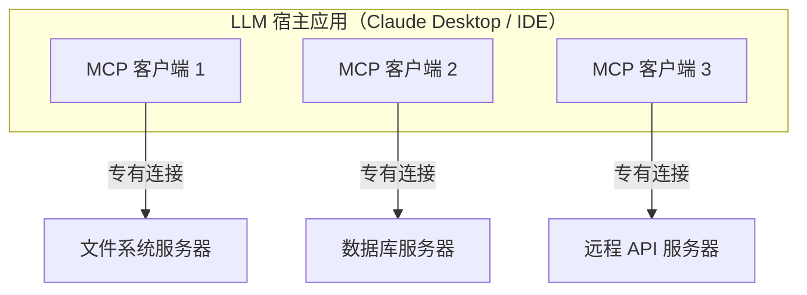

# Claude API 基础专题（五）：MCP 协议深度解析

> **目标读者**：想让 Claude 接入外部工具或数据的开发者
> **前置知识**：了解 Claude API 基础用法和工具调用概念

---

**读完本文，你会**：

- 说清 MCP 解决了工具调用的什么问题，以及在厂商私有格式之上它做了什么取舍
- 看懂 2025-11-25 及更早版本的 `initialize` 握手流程，和 2026-07-28 版取消握手后的请求方式
- 用官方 Python SDK（v2）写一个可运行的 MCP 服务器，并用客户端连上它
- 判断一个工具该走 MCP 还是普通工具调用，以及排错时先从哪下手

**版本口径**：协议部分对照 2026-07-28 修订（现行版）与 2025-11-25 及更早的握手式修订分讲；代码部分以 Python SDK v2.x（本文核对时为 2.2.0）为准。2026 年 7 月起 `pip install mcp` 安装的是 2.x，本文示例按 2.x 编写；1.x 仍在维护分支上修复关键问题。

LLM 只能处理文本，要让它操作外部世界——读文件、查数据库、发邮件——就得有一套协议把"外部能力"接进来。MCP（Model Context Protocol）就是干这个的。

MCP 把工具定义、发现和调用从厂商私有格式收束为开放协议，让一次开发的工具能在多个 LLM 应用里复用。下面从三个角度展开：MCP 究竟解决了什么问题、客户端与服务器如何交换报文、什么场景下值得选 MCP 而不是直接写工具调用。

## 为什么需要 MCP

### 碎片化的工具调用

2023 年 OpenAI 推出 function calling 后，各大 LLM 提供者陆续定义了各自的工具调用格式：

```python
# OpenAI 的格式
{
    "name": "get_weather",
    "description": "获取天气",
    "parameters": {
        "type": "object",
        "properties": {
            "city": {"type": "string"}
        }
    }
}

# Google 的格式
{
    "function_declarations": [{
        "name": "get_weather",
        "description": "获取天气",
        "parameters": {...}
    }]
}

# Anthropic 的格式
{
    "name": "get_weather",
    "description": "获取天气",
    "input_schema": {
        "type": "object",
        "properties": {
            "city": {"type": "string", "description": "城市名称"}
        }
    }
}
```

根因是厂商锁定：每个 LLM 提供商都想把开发者绑在自己的格式上。用 OpenAI 的格式写了一套工具，再想迁到 Google 的模型就得重写一遍。这带来四个连锁问题：

| 问题 | 影响 |
|------|------|
| 供应商锁定 | 开发者被绑定在某一 LLM 提供商 |
| 重复开发 | 同一个工具需要为不同提供商编写不同版本 |
| 生态割裂 | 工具开发者只愿意为流行平台开发 |
| 创新受阻 | 新入局的 LLM 难以快速建立工具生态 |

### MCP 的思路

MCP 由 Anthropic 于 2024 年 11 月开源提出。规范以带日期的字符串标记版本，每个版本对应一次不兼容变更：`2024-11-05`、`2025-03-26`、`2025-06-18`、`2025-11-25`，现行版本是 `2026-07-28`。OpenAI、Google DeepMind 等厂商先后宣布采用；项目本身以 "Model Context Protocol a Series of LF Projects, LLC" 的名义在 Linux Foundation 体系下治理，规范与代码按 Apache 2.0 许可发布。

它的思路是：**给 LLM 工具调用做一个"USB 接口"——一次开发，到处可用。**

名字本身就点出了它的三个要点：

- **协议（Protocol）**：基于 JSON-RPC 2.0 的标准化通信规则，选型原因见后文「协议工作流程」一节。
- **上下文（Context）**：把"LLM 能读到的外部数据"和"LLM 能调用的外部函数"统一抽象为资源、工具和提示模板。
- **模型无关（Model-agnostic）**：任何实现了 MCP 客户端的应用都能接入同一批服务器。

### MCP vs 传统工具调用

| 特性 | 传统工具调用 | MCP |
|------|------------|-----|
| 工具定义格式 | 各厂商私有（OpenAI `parameters`、Anthropic `input_schema`） | 统一 JSON Schema，跨厂商复用 |
| 工具发现 | 应用启动时硬编码或静态配置 | 运行时通过 `tools/list` 动态发现 |
| 服务器主动通知 | 无 | 支持（工具与资源变更通知，见下文） |
| 传输层 | 与应用同进程，函数调用 | 解耦，可走 stdio / Streamable HTTP |
| 实现语言 | 必须与宿主应用同语言 | 任意语言，只要实现 JSON-RPC 2.0 |
| 跨应用复用 | 一个工具绑定一个应用 | 同一服务器可被多个客户端使用 |

## MCP 架构

MCP 采用客户端-服务器架构。规范里的角色划分是三个：**宿主（Host）**是 AI 应用本身，**客户端（Client）**是宿主内维护连接的组件，**服务器（Server）**提供具体能力。关键的对应关系是：**宿主为每台服务器创建一个客户端，一个客户端只维护与一台服务器的专有连接**。



- **宿主应用**负责把工具列表和调用结果喂给模型，不碰具体工具实现；同时管理多个客户端。
- **MCP 客户端**负责一条连接的协议解析与请求路由。客户端与服务器的对应关系是一对一——哪怕两台服务器跑在同一个进程里，宿主也是各建一个客户端分别连接。
- **MCP 服务器**只暴露自己的能力，不管哪家的应用在调它。走 stdio 的本地服务器通常只服务一个客户端，走 Streamable HTTP 的远程服务器通常同时服务很多个。

### 资源、工具与提示：谁控制谁

MCP 服务器对外提供三类原语，规范用"谁来决定用它"区分它们：

| 原语 | 是什么 | 控制方 | 例子 |
|------|--------|--------|------|
| 工具（Tools） | 模型可以主动调用的函数 | 模型 | 删除文件、发送邮件、查询数据库 |
| 资源（Resources） | 只读的数据源，提供上下文 | 应用 | 文件内容、数据库 schema、API 文档 |
| 提示（Prompts） | 预置的指令模板 | 用户 | 斜杠命令、菜单里点选的模板 |

工具和资源最容易被混为一谈，区别不在"读还是写"，而在**谁发起**：工具由模型决定何时调用，资源由应用决定读取什么、把哪部分放进上下文——模型自己看不到资源列表，除非应用把内容喂给它。控制权决定了权限模型的挂点：应用可以对工具调用逐一弹窗审批（规范也建议如此），对资源则由应用自己把关。

一个容易犯的错是按"读写"分通道——把一个有副作用的操作包装成"资源"暴露出去，就等于绕开了应用层对工具的审批流程。读文件写成工具并没有问题（本文下面就是这么做的），把删除文件伪装成资源才是问题。

## 协议工作流程

### JSON-RPC 基础

MCP 底层使用 JSON-RPC 2.0 协议通信。选它有几个原因：消息格式只有请求、响应、通知三种，任何语言都能快速实现；与传输层解耦，stdio、Streamable HTTP 都能跑；基于 JSON，调试时直接打印就能看懂消息内容。

协议版本是带日期的字符串。`2026-07-28` 这一版做了一次大改：**取消了连接握手和会话**，改为每个请求自带协议版本信息；`2025-11-25` 及更早的版本仍走握手流程。两套流程现实中都在运行——今天大多数客户端仍在使用握手式协议——所以下面分两小节对照着讲。

### 握手流程（2025-11-25 及更早版本）

握手分三步：客户端发送 `initialize` 请求声明自己的版本和能力，服务器响应自己的版本和能力，客户端收到后再发一条 `notifications/initialized` 通知表示就绪：

```python
# 初始化请求（客户端 → 服务器）
{
    "jsonrpc": "2.0",
    "id": 1,
    "method": "initialize",
    "params": {
        "protocolVersion": "2025-11-25",
        "capabilities": {
            "roots": {"list": True},
            "sampling": {}
        },
        "clientInfo": {
            "name": "claude-desktop",
            "version": "1.0.0"
        }
    }
}

# 初始化响应（服务器 → 客户端）
{
    "jsonrpc": "2.0",
    "id": 1,
    "result": {
        "protocolVersion": "2025-11-25",
        "capabilities": {
            "tools": {"listChanged": True},
            "resources": {"subscribe": True, "listChanged": True}
        },
        "serverInfo": {
            "name": "filesystem-server",
            "version": "1.0.0"
        }
    }
}
```

版本协商规则是：客户端必须带上一个自己支持的版本（应当带最新的）；服务器支持就用同一版本响应，不支持则改用它支持的另一个版本（也应当是它最新的）；如果客户端对服务器响应的版本也不支持，就应当断开连接。另外走 HTTP 时，后续每个请求都要带 `MCP-Protocol-Version` 头。

### 无握手发现（2026-07-28 版）

`2026-07-28` 修订取消了握手和会话：每个请求在 `_meta` 里自带 `io.modelcontextprotocol/protocolVersion`（Streamable HTTP 上同名信息还放在 `MCP-Protocol-Version` 头里），服务器对每个请求独立判断接受还是拒绝。版本不被支持时，服务器返回 `UnsupportedProtocolVersionError`，列出自己支持的版本，客户端换一个再试即可。

客户端可以用一次 `server/discover` 调用同时拿到服务器支持的版本、能力和身份信息：

```python
# 发现请求（客户端 → 服务器）
{
    "jsonrpc": "2.0",
    "id": "discover-1",
    "method": "server/discover",
    "params": {
        "_meta": {
            "io.modelcontextprotocol/protocolVersion": "2026-07-28",
            "io.modelcontextprotocol/clientInfo": {
                "name": "ExampleClient",
                "version": "1.0.0"
            },
            "io.modelcontextprotocol/clientCapabilities": {}
        }
    }
}

# 发现响应（服务器 → 客户端）
{
    "jsonrpc": "2.0",
    "id": "discover-1",
    "result": {
        "resultType": "complete",
        "supportedVersions": ["2026-07-28"],
        "capabilities": {
            "tools": {},
            "resources": {}
        },
        "_meta": {
            "io.modelcontextprotocol/serverInfo": {
                "name": "ExampleServer",
                "version": "1.0.0"
            }
        },
        "instructions": "This server provides weather and resource utilities."
    }
}
```

调不调 `server/discover` 是可选的——客户端也可以直接发业务请求，收到版本错误再处理。取消会话的直接收益在运维侧：`2026` 请求不绑定任何 worker，负载均衡器后面随便哪台副本都能应答，不需要会话粘滞。同一台服务器可以同时应答两代客户端：新一代走无握手请求，老一代自动回落到 `initialize`（stdio 场景规范要求客户端先发 `server/discover` 探测、失败再回落握手）。

这一版同时废弃了一批服务器反向调用客户端的能力（roots、sampling、协议级日志转为弃用，`ping` 直接移除），工具与资源的变更通知也合并为统一的 `subscriptions/listen` 订阅流。这些变化 SDK 基本都替你处理了，写代码时感知不强，但读报文时要知道两代格式不同。

### 核心消息类型（2025-11-25 握手流程）

```python
# 初始化完成后，客户端列出工具
{
    "jsonrpc": "2.0",
    "id": 2,
    "method": "tools/list"
}

# 服务器返回工具定义
{
    "jsonrpc": "2.0",
    "id": 2,
    "result": {
        "tools": [
            {
                "name": "read_file",
                "description": "读取文件内容",
                "inputSchema": {
                    "type": "object",
                    "properties": {
                        "path": {"type": "string"}
                    },
                    "required": ["path"]
                }
            }
        ]
    }
}
```

`capabilities` 里的 `"tools": {"listChanged": True}` 就是为此服务的：工具列表变化时，服务器补发一条通知，客户端重新拉取即可。

### 工具调用

当 LLM 决定调用一个工具时，客户端发送：

```python
{
    "jsonrpc": "2.0",
    "id": 42,
    "method": "tools/call",
    "params": {
        "name": "read_file",
        "arguments": {
            "path": "/Users/demo/readme.md"
        }
    }
}
```

失败有两种报文形态，规范刻意区分它们：

```python
# 工具执行失败（业务错误）：请求本身合法，result 里用 isError 标记，
# 错误文本给模型看，模型可以据此调整参数重试
{
    "jsonrpc": "2.0",
    "id": 42,
    "result": {
        "content": [
            {
                "type": "text",
                "text": "File not found: /Users/demo/readme.md"
            }
        ],
        "isError": True
    }
}

# 协议级错误：比如调用了不存在的工具，走 JSON-RPC error，
# 模型对这类错误基本无从修起
{
    "jsonrpc": "2.0",
    "id": 42,
    "error": {
        "code": -32602,
        "message": "Unknown tool: read_fi1e"
    }
}
```

规范对这两类的适用范围有明确划分：工具执行失败（API 调用失败、输入校验不过、业务规则拒绝）一律走 `isError: true`，并建议客户端把这类错误交给模型以支持自我修正；未知工具、请求结构非法、服务器内部错误走 JSON-RPC error。

## 构建 MCP 服务器

**前置条件**：Python 3.10+。安装官方 SDK：`uv add "mcp[cli]"` 或 `pip install "mcp[cli]"`（装到的是 2.x；`cli` 额外组件提供 `mcp dev`、`mcp run` 等命令行工具，开发期建议带上）。维护中的 1.x 线需要显式限版，如 `mcp>=1.28,<2`——2.x 是一次带破坏性变更的大版本，老代码不能直接跑。

### 用高级 API 写

2.x 的高级 API 是 `MCPServer`：用装饰器注册工具，输入 schema 从类型注解自动生成，不用手写。下面是一个只读写本地文件的服务器，完整可运行，保存为 `server.py`：

```python
# server.py
import os
from pathlib import Path

from mcp.server import MCPServer
from mcp.server.mcpserver.exceptions import ToolError

mcp = MCPServer("my-filesystem-server")


@mcp.tool()
def read_file(path: str) -> str:
    """读取文件内容"""
    try:
        return Path(path).read_text(encoding="utf-8")
    except FileNotFoundError:
        raise ToolError(f"File not found: {path}")
    except PermissionError:
        raise ToolError(f"Permission denied: {path}")


@mcp.tool()
def write_file(path: str, content: str) -> str:
    """写入内容到文件。如果文件存在，会覆盖原有内容。"""
    p = Path(path)
    parent = p.parent
    if str(parent) not in ("", "."):
        parent.mkdir(parents=True, exist_ok=True)
    p.write_text(content, encoding="utf-8")
    return f"Successfully wrote to {path}"


@mcp.tool()
def list_directory(path: str = ".") -> str:
    """列出目录中的文件和文件夹"""
    try:
        entries = os.listdir(path)
    except FileNotFoundError:
        raise ToolError(f"Directory not found: {path}")
    except PermissionError:
        raise ToolError(f"Permission denied: {path}")
    return "\n".join(f"- {entry}" for entry in sorted(entries))


if __name__ == "__main__":
    mcp.run()
```

三个细节值得注意：

- **失败要 `raise ToolError`，不要 `return` 错误文本**。`return` 一个字符串时 `is_error=False`，在模型和客户端 UI 看来工具是成功的，那段错误文本反而成了"工具结果"。`ToolError` 会被 SDK 包装成 `isError: true` 的结果，消息原文送达模型，模型读到 `"File not found"` 就知道该换路径重试。
- 用普通 `def` 而不是 `async def` 也没关系：2.x 会把同步函数放到工作线程执行，不阻塞事件循环。
- `mcp.run()` 不带参数默认走 stdio 传输；`if __name__ == "__main__":` 这个保护必须有，因为 Inspector 和 `mcp run` 都是通过导入这个文件来加载服务器的。

**验证这步**：直接 `python server.py` 会卡住，因为 stdio 服务器在等 stdin 上的协议消息，这符合预期。想确认它没写错，用 SDK 自带的调试器连一次：`mcp dev server.py`，它会启动 MCP Inspector 并打印一个带一次性 token 的 URL，浏览器打开后可以浏览工具列表、手写参数调用、看到逐条报文。Inspector 还有 `--cli`（脚本化，适合 CI）和 `--tui`（终端 UI）两种形态；Web 形态需要 Node 22.19 以上。想静默结束，按 `Ctrl+C` 即可。

### 高级 API 与低层 API

`MCPServer` 的前身是 1.x 里的 `FastMCP`（`from mcp.server.fastmcp import FastMCP`）。2.x 把它更名为 `MCPServer` 并挪了模块——旧导入路径是直接移除而不是弃用，1.x 的 `FastMCP` 代码迁移主要是改这两行。`@mcp.tool()`、`@mcp.resource()`、`@mcp.prompt()` 的装饰器写法两代一致。

2.x 仍保留了低层 `Server`（`from mcp.server import Server`），但整个重写过：处理函数改为构造参数注册，签名统一为 `(ctx, params) -> result`，线上字段在 Python 侧改为 snake_case（报文仍是 camelCase），协议类型拆到了独立的 `mcp-types` 包。行为上最要紧的差异是：1.x 的低层 `Server` 会先按 `inputSchema` 用 jsonschema 校验工具入参再进函数，2.x 只声明 schema 不校验，参数检查要自己做。

另一个同名物是独立发行的 `fastmcp` 包（由 Prefect 维护，`from fastmcp import FastMCP`）。它从官方 SDK 的早期版本分叉，现在是一个覆盖服务器、客户端与交互应用的完整框架，功能面比官方高级 API 宽。本地调试用官方 SDK 足够；需要中间件、部署编排这类扩展能力时再评估独立包。

## MCP 客户端开发

2.x 的客户端只有一个入口对象 `Client`。它接受四种连接目标：URL 字符串（Streamable HTTP）、`StdioServerParameters`（本地子进程 + stdio）、任意传输对象，或者直接传服务器对象做进程内测试。

下面这个客户端连的就是上一节的 `server.py`。跑之前先在 `/tmp` 建一个 `demo.txt`，否则 `read_file` 会命中我们写的 `ToolError` 分支——那正好也是一次观察 `is_error` 的机会。

```python
import asyncio

from mcp import Client, StdioServerParameters


async def main():
    server_params = StdioServerParameters(
        command="python",
        args=["server.py"],
    )
    async with Client(server_params) as client:
        # 连接已在进入上下文时完成：探测 server/discover，
        # 对老服务器自动回落 initialize 握手
        print("协议版本:", client.protocol_version)
        print("服务器能力:", client.server_capabilities)

        # 列出可用工具
        tools = await client.list_tools()
        print("可用工具:", [t.name for t in tools])

        # 调用工具
        result = await client.call_tool(
            "read_file",
            {"path": "/tmp/demo.txt"},
        )
        print("是否出错:", result.is_error)
        print("文件内容:", result.content[0].text)


asyncio.run(main())
```

在 `server.py` 所在目录运行。`call_tool` 返回的 `result` 里，`content` 是给模型看的内容块列表，`structured_content` 是给程序用的结构化结果（按工具声明的输出 schema 生成），`is_error` 标记这次调用是否失败。**工具失败不会在客户端侧抛异常**——`isError: true` 是一个正常返回的结果，代码里要先看 `is_error` 再读内容。

### 错误处理

服务器端的三种失败，到达客户端时形态不同：

| 服务器端写法 | 线上形态 | 模型能否读到原因 |
|------|------|------|
| `raise ToolError("...")` | `isError: true` 的正常结果，带你的消息 | 能 |
| `raise MCPError(code, msg)` | JSON-RPC error，原样透传 | 否（协议错误） |
| 其他任何异常 | `isError: true`，但消息固定为 "Error executing tool …"，堆栈只进服务器日志 | 否 |

给模型用的工具，预期内的失败（文件不存在、参数超范围）一律 `raise ToolError` 并把原因写清楚；预期外的异常保持裸抛即可，SDK 会替你把堆栈挡在日志里，不让内部信息漏给模型。

## MCP 生态与实践

### 官方参考服务器与 Registry

MCP 项目在 [modelcontextprotocol/servers](https://github.com/modelcontextprotocol/servers) 仓库维护少量参考实现，定位是演示 SDK 用法的教学示例，官方明确提示不要直接用于生产。目前活跃的有七个：everything（全功能测试服务器）、fetch（网页抓取）、filesystem（文件操作）、git（Git 仓库操作）、memory（知识图谱记忆）、sequential-thinking（分步推理辅助）、time（时区换算）。

早先的一批参考服务器——GitHub、Slack、Google Drive、PostgreSQL、Puppeteer 等——已整体归档到 [servers-archived](https://github.com/modelcontextprotocol/servers-archived) 仓库，部分由社区接手维护。找可用的服务器不再看这个仓库，官方入口是 [MCP Registry](https://registry.modelcontextprotocol.io/)，一个公开发布的服务器注册表。

### 在 Claude Desktop 中配置 MCP

```json
// macOS: ~/Library/Application Support/Claude/claude_desktop_config.json
// Windows: %APPDATA%\Claude\claude_desktop_config.json
{
    "mcpServers": {
        "filesystem": {
            "command": "npx",
            "args": ["-y", "@modelcontextprotocol/server-filesystem", "/Users/username/projects", "/Users/username/documents"]
        }
    }
}
```

配置文件路径容易踩坑：macOS 上是 `~/Library/Application Support/Claude/claude_desktop_config.json`，Windows 上是 `%APPDATA%\Claude\claude_desktop_config.json`，不是 `~/.claude/mcp.json`。也可以在 Claude Desktop 的 Settings → Developer 标签里点 "Edit Config" 直接定位到这个文件。修改后需要完全退出并重启 Claude Desktop 才能生效。

上面示例里的 server-filesystem 就是官方参考服务器之一。曾经也有官方的 GitHub 参考服务器（`@modelcontextprotocol/server-github`），现已归档；GitHub 官方自己维护的 MCP 服务器在 [github/github-mcp-server](https://github.com/github/github-mcp-server)，以远程服务器形式提供，接入方式与本地 stdio 配置不同。

## MCP 与工具调用的选型

判断依据其实很具体：这个工具是否会被多个应用复用，或者是否需要长期维护。

### 用普通工具调用的场景

- **一次性脚本或原型**：只想快速验证想法，不想搭协议层
- **单宿主工具**：工具只服务于一个应用
- **强耦合逻辑**：工具实现依赖宿主内部状态，拆出去反而增加复杂度

代价是：换一个 LLM 提供商就要重写工具定义，工具也无法被其他应用共享。

### 用 MCP 的场景

- **多应用复用**：同一个文件系统服务器，Claude Desktop、Cursor、自定义脚本都能用
- **长期维护的工具集**：工具迭代和宿主应用解耦，可以独立发版
- **跨语言集成**：宿主是 TypeScript，工具用 Python 写更方便
- **企业标准化**：需要统一的权限、审计、工具发现机制

要付出的是一层进程间通信：调试链路变长，stdio 传输下日志处理要小心。

### 判断流程

拿到一个需求，按顺序回答三个问题：

1. 这个工具会被几个应用使用？只有一个 → 跳到 2；多个 → 用 MCP
2. 工具会长期迭代吗？一次性验证 → 用普通工具调用；长期维护 → 跳到 3
3. 工具实现需要用和宿主不同的语言吗？需要 → 用 MCP；不需要 → 看团队是否愿意承担协议层开销

## 常见踩坑

### 配置文件路径不对

Claude Desktop 看不到配置的 MCP 服务器，按官方教程的顺序排查：

1. 配置文件位置对不对（macOS 与 Windows 路径见上节，键名是 `mcpServers`）
2. JSON 语法是否合法，`args` 里给的文件路径是不是绝对路径
3. `command` 指定的可执行文件在 PATH 里能否找到，`npx` 在某些环境下要写绝对路径
4. 看 Claude Desktop 的日志确认报错，或者在命令行手动运行服务器命令看输出

另外注意 JSON 里同一对象不允许出现两个同名键，部分解析器会静默采用后一个——复制的配置块反复粘贴时容易踩。

### 协议版本不匹配

握手式协议下，版本由 `initialize` 协商，对不上时按「握手流程」一节的规则回落或断开。用 SDK 时这件事基本自动：Python SDK 2.x 的 `Client` 会先探测 `server/discover`，服务器不支持就回落握手；服务器报版本不支持时，`UnsupportedProtocolVersionError` 会列出可用版本。升级 SDK 或显式锁定版本线（如 `mcp>=1.28,<2`）能消掉大多数版本错配。

### 工具失败被写成了"成功"

前面反复提过：想给模型可读的失败信息，服务器里 `raise ToolError`，不要 `return` 错误字符串，也不要把业务失败抛成 JSON-RPC 协议错误。错误消息越具体，模型越容易自我修正——`"File not found: /tmp/demo.txt"` 比 `"Error"` 有用得多；反过来，预期外的异常别把内部细节（堆栈、路径、环境变量）放进 `ToolError` 消息。

### 权限被拒绝

MCP 服务器访问本地资源时，权限取决于启动它的进程。macOS 上 Claude Desktop 默认没有"完全磁盘访问权限"，需要在"系统设置 → 隐私与安全性 → 完全磁盘访问权限"里加上 Claude。

### stdio 传输下日志去哪了

stdio 传输把 stdout 用作协议通道，直接 `print` 会污染协议流，这是"服务器连不上"的经典原因。stderr 不在协议流里，日志一律走 stderr 或独立文件。`mcp dev` 打开的 Inspector 会把每条报文原样展示，怀疑协议流被污染时先看它。

### 多个 MCP 服务器之间会互相影响吗

不会。每台服务器一个独立连接（本地服务器通常还是独立进程），客户端各自维护会话。规范不规定工具重名时怎么处理，由宿主应用自行决定——重名时不同宿主的行为可能不同。Python SDK 的 `ClientSessionGroup` 提供了一种现成方案：按服务器的 `serverInfo.name` 加前缀聚合（如 `Web.search`），前缀只在本进程内生效，线上调用仍用原始工具名。

## 接着往下走

把本文的示例跑通之后，还有几条路可以深入：

做一个带状态的服务器。前面示例的工具都是无状态的。可以做一个跨会话记忆服务器——用 SQLite 存键值对，暴露 `remember`、`recall`、`forget` 三个工具；资源内容更新时发布变更通知，让订阅的客户端自动刷新（2.x 里调用 `ctx.notify_resource_updated(uri)`，协议层对应统一的订阅流；握手式协议下则是 `resources/subscribe` 与 `notifications/resources/updated`）。

研究传输层切换。stdio 适合本地进程，远程场景要换成 Streamable HTTP。挑一个官方服务器改造过去，重点对比两件事：`2026` 请求没有会话、副本无需粘滞，而 `2025-11-25` 客户端仍要维护 `Mcp-Session-Id`；以及 HTTP 场景下的授权（OAuth 2.1）是 stdio 上不存在的问题。

参与生态建设。浏览 [MCP Registry](https://registry.modelcontextprotocol.io/)，找一个你熟悉但还没有实现的服务，写一个社区服务器发布。过程中你会碰到 OAuth 流程、错误码标准化、工具描述优化这些真实工程问题。

相关阅读：本系列下一讲是 Claude Code 与 Computer Use 专题（六）；协议细节以 [MCP 官方文档](https://modelcontextprotocol.io/) 为准。

---

## 参考来源与口径说明

- **协议版本序列**（2024-11-05 → 2025-03-26 → 2025-06-18 → 2025-11-25 → 2026-07-28）与现行版本，核对自规范仓库 [modelcontextprotocol/modelcontextprotocol](https://github.com/modelcontextprotocol/modelcontextprotocol) 的 release 列表及官方 Versioning 页（2026-09-23 查询）。
- **报文示例**：`initialize` 请求/响应与版本协商规则取自 2025-11-25 规范 Lifecycle 一节；`server/discover` 请求/响应取自 2026-07-28 规范 Server Discover 一节（为省篇幅略有删减）；工具调用的两种失败形态取自 2025-11-25 规范 Tools 一节，`-32602 Unknown tool` 为规范原文示例。
- **架构与原语**：宿主-客户端-服务器的一对一连接关系、三类原语的控制方（模型/应用/用户），取自官方 Architecture 与 Server Concepts 页；`ping` 移除与 roots/sampling/日志弃用、`subscriptions/listen`，取自 2026-07-28 规范变更说明。
- **SDK 口径**：代码对照 [modelcontextprotocol/python-sdk](https://github.com/modelcontextprotocol/python-sdk) v2.x 与官方文档（py.sdk.modelcontextprotocol.io）。v2.0.0 于 2026-07-28 发布，1.x 线转入维护、官方建议锁定 `mcp>=1.28,<2`；`ToolError`/`MCPError`/其他异常的三种失败形态，以及"不要 return 错误字符串"，出自官方 Handling errors 页原文。
- **生态口径**：参考服务器活跃与归档清单取自 servers 仓库 README（README 自述为教学参考、查找服务器请用 MCP Registry）；GitHub 参考服务器归档、GitHub 官方服务器位于 github/github-mcp-server，分别核对自上述 README 与该仓库主页。治理表述（LF Projects 托管、Apache 2.0）取自官方 Governance 页。
- **Claude Desktop**：配置文件路径与排查步骤取自官方 Connect to local servers 教程（2026-07-28 文档版）。

*字数：约 5800 字 | 更新日期：2026-09-23*
